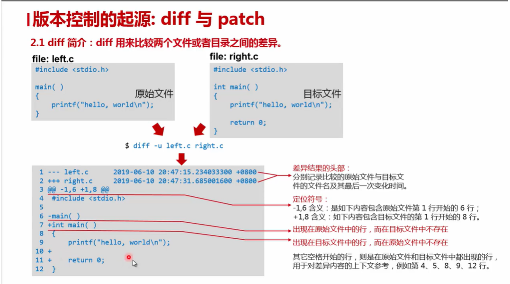
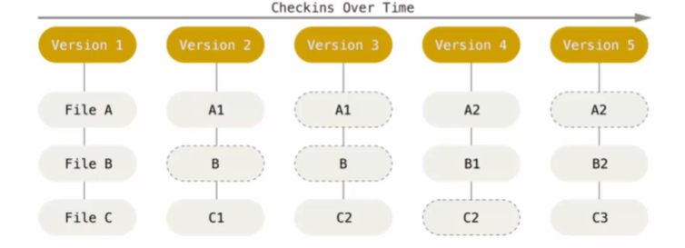
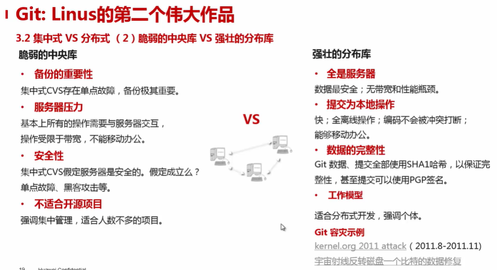
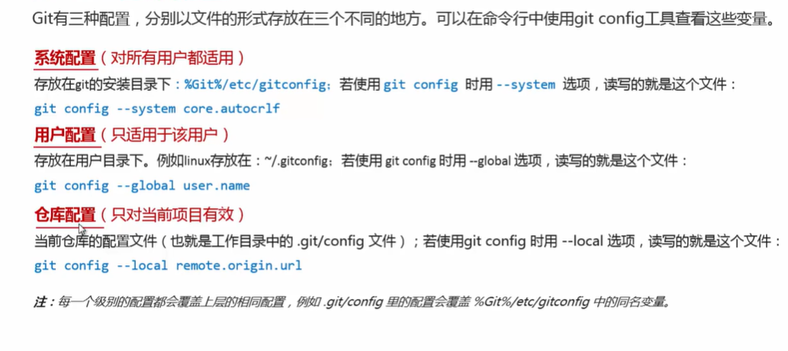
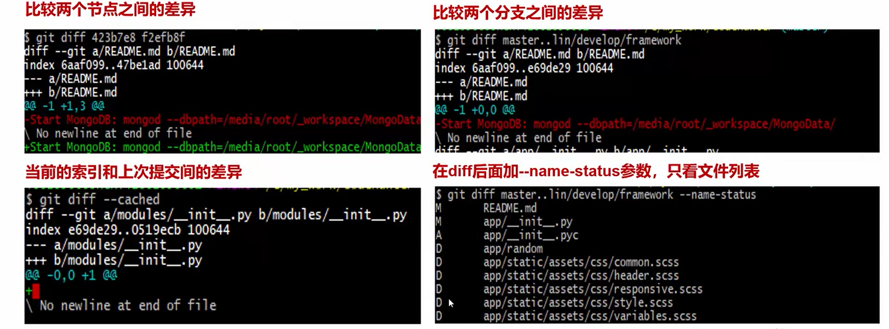
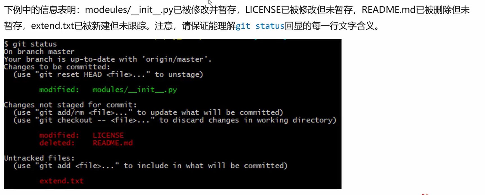
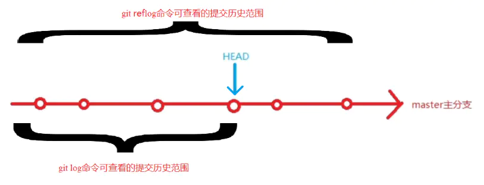
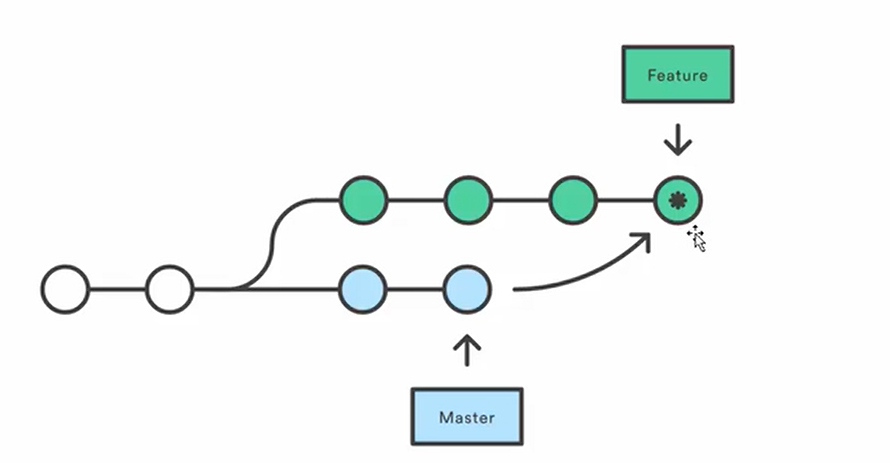
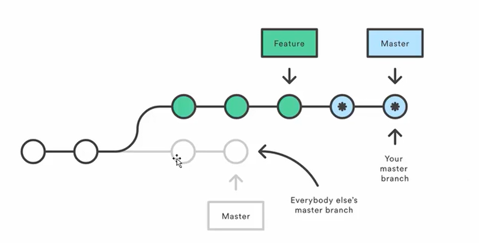

# 编程工具演练

## GIT基础与实操

### 版本控制工具简介

版本控制是一种记录一个或若干文件内容变化，以便将来查阅特定版本修订情况的系统，方便查看更改历史，备份以及恢复以前的版本，保证多人的协作不出问题。

* diff是用来比较两个文件或目录之间的差异`diff - u `

  

* patch是diff的反向操作，通过差异文件diff由一个文件推算另一个差异文件的内容。
  * `patch left.c diff.txt` 把diff.txt应用到left.c文件上，正向覆盖为修改后的文件内容
  * `patch -R right.c diff.txt` 把diff.txt应用到right.c文件上，反向覆盖为修改前的文件内容

RCS（Reversion Control System）：最早期的本地版本控制工具，通过存储在磁盘中的diff集合实现历史版本回退。

CVS（Concurrent Versions System），不支持原子化提交，导致上传数据不完整，网络传输效率低

SVN（SubVersion）优化了服务器上内容的存储，实现了原子提交，但是局域网之外操作延迟

集中式版本控制存在的问题：

1. 狭窄的提交通道，提交需要排队，且不能同时修改，缺乏质量控制和缺乏代码门禁，检查防护（Rietveld提供旁路检查）
2. 数据安全性差，单点故障、黑客攻击

Git是分布式的版本管理工具，其与集中式版本控制的不同在于

* **对待数据的方式**，集中式版本控制工具将保存的信息看作是基本文件随时间逐步积累的差异

  

* Git记录的是每个版本所有文件的快照，如果中间版本文件破坏或者丢失，也不会影响后续文件的记录
  

* **中央库和分布库**

  

SVN不适合的领域：

* 跨地域的协同开发
* 对代码高质量追求和代码门禁

Git不适合的领域：

* 不适合Word等二级制文档的版本控制，因为Git无锁定解锁模式，不能排他式修改
* 整体的读授权，不能将读授权精细到目录级别（解决方案：版本库按照目录拆分）

小结：

1. **版本控制工具的发展历史经过：**原始人工维护状态，本地RCS，集中式如VCS、SVN和分布式如Git。

2. 版本控制工具**提供了协作开发的能力**，借助它们我们可以回到任何时间的代码状态。

3. 集中式版本控制工具，几乎所有动作**都需要服务器参与**，并且**数据安全性与服务器关系很大**。

4. **Git 是分布式版本控制工具**，除了与服务器之前进行按需同步之外，**所有的提交操作都不需要服务器**。

### 基本配置文件



### 配置个人身份

```shell
git config --global user.name "Liu Guanghao"
git config --global user.email "lguanghao123@163.com"
```

文本换行符配置

Windows上使用回车和换行两个字符来结束一行，而Mac和Linux上只使用一个换行符。

Git在提交时会自动地把行结束符CRLF转换成LF，而在签出代码时把LF转换成CRLF。用`core.autocrlf`来打开此项功能。

如果是在Windows系统上，把它设置成`true`，LF在代码签出时会转换为CRLF

```shell
git config --global core.autocrlf true
```

在Linux或Mac系统上，希望提交代码时将CRLF转换为LF，而签出时不进行转换

```shell
git config --global core.autocrlf input
```

如果一直在Windows系统上进行开发，不需要CRLF和LF来回转换，则将此项功能设置为`false`

```shell
git config --global core.autocrlf false
```

### 文本编码配置

* `i18n.commitEncoding`选项：用来让`git commit log`存储时，采用的编码格式默认为`UTF-8`
* `i18n.logOutputEncoding`选项：查看`git log`时，建议设置为`UTF-8`

```shell
#中文编码支持
git config --global gui.encoding utf-8
git config --global i18n.commitencoding utf-8
git config --global u18n.logoutputencoding utf-8
#显示路径中的中文
git config --global core.quotepath false
```

### 与服务器的认证配置

* http/https协议认证

  设置口令缓存，记住之前的认证结果

  ```shell
  git config --global credential.helper store
  ```

  添加HTTPS证书信任：

  ```shell
  git config http.sslverify false
  ```

* ssh协议认证

  1. 生成公钥：

     ```shell
     ssh -keygen -t rsa -C lguanghao123@163.com
     ```

  2. 进入代码平台，进入`Profile Setting`在`SSH Keys`将公钥文件保存

### Git状态说明

Git版本控制下的工程区域：

1. 版本库（Repository），也可以叫本地仓库，在工作区的隐藏目录`.git`下
2. 工作区（Working Directory）日常工作代码文件或者文档所在文件夹
3. 暂存区（stage）也叫索引，一般存放在工程跟目录`.git/index`文件中

Git版本控制下的状态

1. 已提交（committed）该文件已安全保存在本地数据库中
2. 已修改（modified）修改了但是还没有提交保存
3. 已暂存（staged）把已修改的文件存放在下次要提交的清单中

### 工程准备

* 可以使用`git init 仓库名`在本地新建仓库
* `git clone [URL]`或者`git lfs clone [URL]`，注意，如果项目git服务器支持git-lfs，对二进制文件进行了区别管理，则克隆时务必使用后者，否则工程内容不完整

### 新增/删除/移动文件到暂存区

* 在提交修改的文件之前，需要先进行`git add`把文件添加到暂存区
* `git rm`将指定文件彻底从当前分支的缓存区删除，之后也不再受git跟踪；也可以在硬盘删除再提交也会自动删除
* `git mv`命令用于移动和重命名文件

### 查看工作区

* `git diff`用于比较项目两个版本（分支）的差异，也可以用来比较当前所以和上次提交之间的差异

  

* `git status`用于显示工作目录和暂存区的状态，使用此命令可以看到修改的git文件是否已被暂存，新增文件是否纳入git版本库的管理。

  

### 提交更改的文件

* `git commit` 主要是将暂存区里的文件改动提交到本地的版本库，不影响远端服务器

  * 提交常用命令

    ```shell
    git commit file_name -m "commit message"
    ```

  * 一次性提交暂存区所有改动的文件

    ```shell
    git commit file_name -am "commit message"
    ```

  * 修改最近一次提交的信息,会新生成一个提交节点

    ```shell
    git commit --amend
    ```

### 查看提交历史

* `git log`由远及近列出历史提交日志，配合不同参数有不同功能
  * `--name-status` 显示修改的文件列表及状态
  * `-p`以patch的形式显示修改的内容
  * `--pretty==format`控制显示的记录格式
  * `-graph`分支提交点线图
  * `-1`显示最近的一个提交日志
  
* `git reflog`命令：可以显示所有可的历史版本记录。大多是为了进行版本回退或恢复操作所使用

  * 使用`git log`命令只可以查看到HEAD指针及其之前的版本信息，如果版本发生过回退操作，则可能会出现，HEAD指针之后仍存在历史提交版本的情况

    

### 推送到远端仓库

* `git push`将本地版本库的分支推送到远端服务器对应的分支上

  * 推送命令

    ```shell
    git push origin branch_name
    ```

  * 本地分支名可与远端分支名不同

    ```shell
    git push origin remote_branch_name:local_branch_name
    ```

### 分支管理

* `git branch`命令即可查看本地工程的所有git分支名称，`*`代表当前工作区所在分支

  * `git branch -r`可查看远端服务器分支，返回的分支名带`origin`前缀
  * `git branch -a` 可查看远端和本地所有分支

* `git branch`或`git checkout -b`新建分支

  * `git branch`新建分支后并不会切换到新分支

    ```shell
    git branch new_branch_name
    ```

  * `git checkout -b`新建分支后会自动切换到新分支

    ```shell
    git checkout -b branch_name
    ```

* `git branch -d`或`git branch -D`可以删除分支，后者表示强制删除

  * 将分支删除后，还需要推送到远端

    ```shell
    git push origin : branch_name
    ```

* `git checkout branch_name`切换分支，官方叫“检出”

  * 如当前工作分支存在修改而未提交的文件，与目的分支上的文件内容冲突，会导致切换失败，可以使用`git checkout -f`进行强制切换
  * 切换对象可以是分支，也可以是提交节点或节点下的某个文件

* `git pull` 从远端服务器获取某个分支的更新，再与本地指定的分支进行**自动合并**

  * 常见的拉取分支命令为

    ```shell
    git pull origin remote_branch : local_branch
    ```

  * 若本地与远端指定的分支相同，则可以直接执行

    ```shell
    git pull origin remote_branch
    ```

* `git fetch`从远端获取某个分支的更新，不会自动合并

    * 常见的拉取分支命令为

      ```shell
      git fetch origin remote_branch : local_branch
      ```

  * 若本地与远端指定的分支相同，则可以直接执行

    ```shell
    git f origin remote_branch
    ```

### 分支合并

* `git merge`命令是用于指定的分支（节点）合并到当前分支的操作

  

  * git会将指定的分支与当前分支进行比较，找出二者最近的一个共同节点base，之后将指定分支在base之后的节点合并到当前分支上，会产生一个merge commit节点，如果合并的时候遇到冲突，仅需要修改后重新commit

    ```shell
    git merge branch_name
    ```

  * 记录了真实的commit情况，包括每个分支的详情，但是使用GUI工具查看时较杂乱

* `git rebase`也可以合并分支到当前分支

  

  * 会合并之前的commit历史，得到更简洁的项目历史，去掉了merge commit，但因为更改了提交历史，使得log日志杂乱，不建议协作时使用。

    ```shell
    git rebase branch_name
    ```

  * 如果合并出现代码问题不容易定位，因为re-write了history

    ```tex
    1. 解决冲突
    2. git add 
    3. git rebase continue(若没解决执行4)
    4. git rebase --skip
    ```

* `git cherry-check`更新某个节点到当前分支的头节点，同时新生成一个提交的commit id

  * 常用命令为

    ```shell
    git cherry-check commit_id
    ```

### 撤销操作

* `git reset`通常用于撤销当前工作区的某些`git add/commit`操作，可以将工作区的内容回退到历史提交节点

  * 常用命令

    ```shell
    git reset commit_id
    ```

* `git checkout .`用于回退本地所有修改但未提交的文件内容
  * `git checkout .`会取消本地工作区的修改，用暂存区的所有文件直接覆盖本地文件，达到回退内容的目的，谨慎使用
  * `git checkout -filename`仅回退某个文件的未提交改动
  * `git checkout commit_id`可以回退到某个提交版本

## IDEA使用

### 常用快捷键

1. 新建

   * 新建文件：`Alt+Insert`
2. 移动

   * 以函数为单位移动：`Alt + 上下箭头`

   * 定位到行：`Ctrl+G`
   * 可以选择单词继而语句继而函数：`Ctrl+W`
   * 取消选择光标所在词：`Ctrl+Shift+W`
   * 可以跑到大括号的开头与结尾：`Ctrl + {/Ctrl+}`
3. 定位查找

   * 查找任意文件：`Shift + Shift`
   * 查找Java类： `Ctrl+N`
   * 查找：`Ctrl+F`
   * 替换：`Ctrl+R`
   * 进入某一方法或到变量定义处：`F4`
   * 查看方法和成员变量：`Ctrl+F12`
   * 回退（前进）到上一次编辑处：`Ctrl+Alt+左箭头（右箭头）`
4. 编辑

   * 复制一行：`Ctrl+D`
   * 删除一行：`Ctrl+Y`
   * 选中一段进行注释及反注释：`Ctrl+/`
5. 简单重构
   * 重命名：`Shift+F6`
   * 抽取函数：`Ctrl+Alt+M`
   * 抽取变量：`Ctrl+Alt+V`
6. 简单调试
   * 调试/运行测试用例：`Ctrl+Shift+F9/F10`
   * 打断点/取消断点：`Ctrl+F8`
   * 调试/运行：`Shift+F9/F10`
   * 进入函数：`F7`
   * 单步：`F8`
   * 到下一个断点或者结束：`F9`
   * 查看表达式结果：`Alt+F8`


