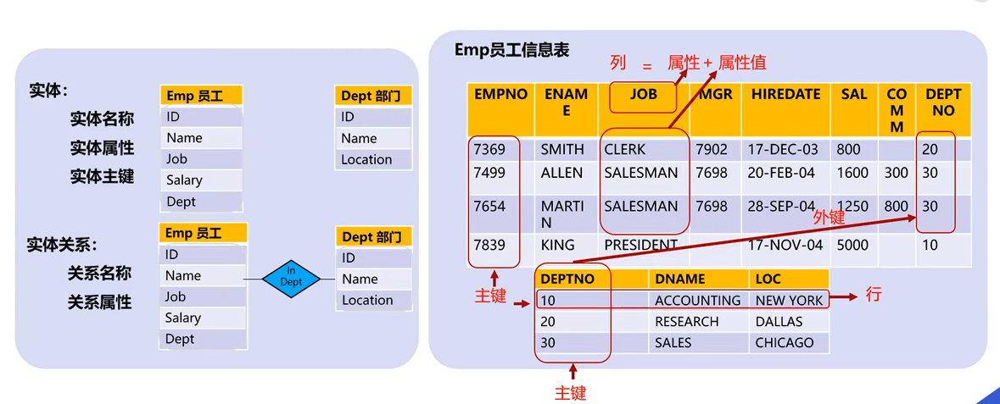
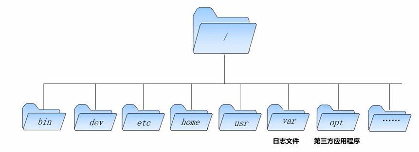
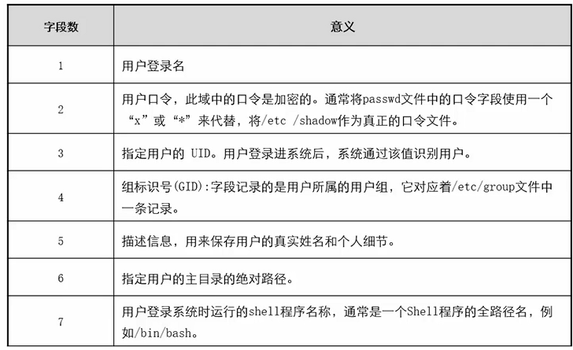
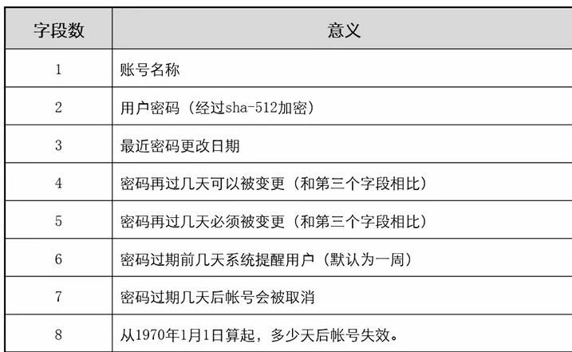

# 编程后台操作

## 数据库

### 数据库介绍

**关系型数据库**，是建立在关系模型之上的数据库，借助于集合代数等数学概念和方法来处理数据库中的数据。现实世界中的各种实体以及实体之间的各种联系均用关系模型来表示。



**SQL** (Structured Query Language:结构化查询语言) 是用于管理关系数据库管理系统（RDBMS）。 SQL 的范围包括数据插入、查询、更新和删除，数据库模式创建和修改，以及数据访问控制。

- SQL 面向数据库执行查询
- SQL 可从数据库取回数据
- SQL 可在数据库中插入新的记录
- SQL 可更新数据库中的数据
- SQL 可从数据库删除记录
- SQL 可创建新数据库
- SQL 可在数据库中创建新表
- SQL 可在数据库中创建存储过程
- SQL 可在数据库中创建视图
- SQL 可以设置表、存储过程和视图的权限

### SQL基础命令

#### SQL SELECT

SELECT 语句用于从数据库中选取数据。结果被存储在一个结果表中，称为结果集。

```mysql
#选取某列
SELECT column_name,column_name 
FROM table_name;
#选取所有列
SELECT *  FROM table_name;
```

#### SQL SELECT DISTINCT

在数据表中，一个列可能会包含多个值，可以使用以下命令返回唯一不同的值

```sql
SELECT DISTINCT column_name,column_name
FROM table_name;
```

#### SQL WHERE

该语句用于提取那些满足指定条件的记录

```sql
SELECT column_name,column_name
FROM table_name
WHERE column_name operator value;
```

SQL 使用单引号来环绕文本值（大部分数据库系统也接受双引号）

如果是数值字段，请不要使用引号

```sql
SELECT * FROM Websites WHERE country='CN';
SELECT * FROM Websites WHERE id=1;
```

常用操作符如下：

| 运算符  | 描述                                                       |
| ------- | ---------------------------------------------------------- |
| >       | 大于                                                       |
| <>      | 不等于。**注释**在SQL 的一些版本中，该操作符可被写成 != |
| >=      | 大于等于                                                   |
| <       | 小于                                                       |
| <=      | 小于等于                                                   |
| BETWEEN | 在某个范围内                                               |
| LIKE    | 搜索某种模式                                               |
| IN      | 指定针对某个列的多个可能值                                 |
| =       | 等于                                                       |

#### SQL AND&OR

该运算符用对记录进行多条件过滤

AND运算符实例

```sql
SELECT * FROM Websites
WHERE country='CN'
AND alexa > 50;
```

OR运算符实例

```sql
SELECT * FROM Websites
WHERE country='USA'
OR country='CN';
```

也可以把 AND 和 OR 结合起来（使用圆括号来组成复杂的表达式）

```sql
SELECT * FROM Websites
WHERE alexa > 15
AND (country='CN' OR country='USA');
```

#### SQL ORDER BY

ORDER BY 关键字用于对结果集按照一个列或者多个列进行排序。

ORDER BY 关键字默认按照升序对记录进行排序。如果需要按照降序对记录进行排序，您可以使用 DESC 关键字

```sql
SELECT column_name,column_name
FROM table_name
ORDER BY column_name,column_name ASC|DESC;
```

#### SQL INSERT INTO

INSERT INTO 语句用于向表中插入新记录。

第一种形式无需指定要插入数据的列名，只需提供被插入的值即可

```sql
INSERT INTO table_name
VALUES (value1,value2,value3,...);
```

第二种形式需要指定列名及被插入的值：

```sql
INSERT INTO table_name (column1,column2,column3,...)
VALUES (value1,value2,value3,...);
```

#### SQL UPDATE

UPDATE 语句用于更新表中已存在的记录

```sql
UPDATE table_name
SET column1=value1,column2=value2,...
WHERE some_column=some_value;
```

实例

```sql
UPDATE Websites 
SET alexa='5000', country='USA' 
WHERE name='菜鸟教程';
```

要格外小心，如果没有加`Where`条件，会将表中所有数据更新

#### SQL DELETE

DELETE 语句用于删除表中的行

```sql
DELETE FROM table_name
WHERE some_column=some_value;
```

删除所有数据

```sql
DELETE FROM table_name;
#或
DELETE * FROM table_name;
```

### SQL高级教程

#### SQL SELECT TOP

SELECT TOP 子句用于规定要返回的记录的数目

**注意:**并非所有的数据库系统都支持 SELECT TOP 语句。 MySQL 支持 LIMIT 语句来选取指定的条数数据， Oracle 可以使用 ROWNUM 来选取。

SQL Server / MS Access 语法

```sql
SELECT TOP number|percent column_name(s)
FROM table_name;
```

MySQL语法

```mysql
SELECT column_name(s)
FROM table_name
LIMIT number;
```

Oracle语法

```sql
SELECT column_name(s)
FROM table_name
WHERE ROWNUM <= number;
```

#### SQL LIKE

LIKE 操作符用于在 WHERE 子句中搜索列中的指定模式

```sql
SELECT column_name(s)
FROM table_name
WHERE column_name LIKE pattern;
```

在 SQL 中，通配符与 SQL LIKE 操作符一起使用。SQL 通配符用于搜索表中的数据。

| 通配符                     | 描述                       |
| :------------------------- | :------------------------- |
| %                          | 替代 0 个或多个字符        |
| _                          | 替代一个字符               |
| [charlist]                 | 字符列中的任何单一字符     |
| [^charlist] 或 [!charlist] | 不在字符列中的任何单一字符 |

MySQL 中使用 **REGEXP** 或 **NOT REGEXP** 运算符 (或 RLIKE 和 NOT RLIKE) 来操作正则表达式

下面的 SQL 语句选取 name 以 "G"、"F" 或 "s" 开始的所有网站

```sql
SELECT * FROM Websites
WHERE name REGEXP '^[GFs]';
```

下面的 SQL 语句选取 name 以 A 到 H 字母开头的网站

```sql
SELECT * FROM Websites
WHERE name REGEXP '^[A-H]';
```

下面的 SQL 语句选取 name 不以 A 到 H 字母开头的网站

```sql
SELECT * FROM Websites
WHERE name REGEXP '^[^A-H]';
```

#### SQL IN

IN 操作符允许您在 WHERE 子句中规定多个值，NOT IN反之

```sql
SELECT column_name(s)
FROM table_name
WHERE column_name IN (value1,value2,...);
```

#### SQL BETWEEN

BETWEEN 操作符选取介于两个值之间的数据范围内的值。这些值可以是数值、文本或者日期

```sql
SELECT column_name(s)
FROM table_name
WHERE column_name BETWEEN value1 AND value2;
```

如需显示不在上面实例范围内的网站，请使用 NOT BETWEEN

```sql
SELECT * FROM Websites
WHERE alexa NOT BETWEEN 1 AND 20;
```

下面的 SQL 语句选取 alexa 介于 1 和 20 之间但 country 不为 USA 和 IND 的所有网站：

```sql
SELECT * FROM Websites
WHERE (alexa BETWEEN 1 AND 20)
AND country NOT IN ('USA', 'IND');
```

下面的SQL语句选取date介于一个时间段内的访问记录

```sql
SELECT * FROM access_log
WHERE date BETWEEN '2016-05-10' AND '2016-05-14';
```

#### SQL AS

创建别名是为了让列名称的可读性更强

列的别名语法，如果列名称包含空格，要求使用双引号或方括号

```sql
SELECT column_name AS alias_name
FROM table_name;
```

表的别名语法

```sql
SELECT column_name(s)
FROM table_name AS alias_name;
```

表使用别名的适用情景

- 在查询中涉及超过一个表
- 在查询中使用了函数
- 列名称很长或者可读性差
- 需要把两个列或者多个列结合在一起

#### SQL JOIN

SQL join 用于把来自两个或多个表的行结合起来


- **INNER JOIN**：如果表中有至少一个匹配，则返回行
- **LEFT JOIN**：即使右表中没有匹配，也从左表返回所有的行
- **RIGHT JOIN**：即使左表中没有匹配，也从右表返回所有的行
- **FULL JOIN**：只要其中一个表中存在匹配，则返回行

#### SQL UNION

UNION 操作符用于合并两个或多个 SELECT 语句的结果集。

请注意，UNION 内部的每个 SELECT 语句必须拥有相同数量的列。列也必须拥有相似的数据类型。同时，每个 SELECT 语句中的列的顺序必须相同

```sql
SELECT column_name(s) FROM table1
UNION
SELECT column_name(s) FROM table2;
```

默认地，UNION 操作符选取不同的值。如果允许重复的值，请使用 UNION ALL。

```sql
SELECT column_name(s) FROM table1
UNION ALL
SELECT column_name(s) FROM table2;
```

#### SQL INTO

SELECT INTO 语句从一个表复制数据，然后把数据插入到另一个新表中

可以选择复制所有的列

```sql
SELECT *
INTO newtable [IN externaldb]
FROM table1;
```

也可以选择复制部分列

```sql
SELECT column_name(s)
INTO newtable [IN externaldb]
FROM table1;
```

SELECT INTO 语句可用于通过另一种模式创建一个新的空表。只需要添加促使查询没有数据返回的 WHERE 子句即可

MySQL 数据库不支持 SELECT ... INTO 语句，但支持 [INSERT INTO ... SELECT](https://www.runoob.com/sql/sql-insert-into-select.html) ，可以使用下面的命令拷贝表结构和数据

```mysql
CREATE TABLE 新表
AS
SELECT * FROM 旧表 
```

#### SQL INSERT INTO SELECT

INSERT INTO SELECT 语句从一个表复制数据，然后把数据插入到一个已存在的表中

```sql
INSERT INTO table2
SELECT * FROM table1;
```

也可以选择复制部分列

```sql
INSERT INTO table2
(column_name(s))
SELECT column_name(s)
FROM table1;
```

#### SQL CREATE DATABASE

CREATE DATABASE 语句用于创建数据库

```sql
CREATE DATABASE dbname;
```

#### SQL CREATE TABLE

CREATE TABLE 语句用于创建数据库中的表。

表由行和列组成，每个表都必须有个表名 

```sql
CREATE TABLE table_name
(
column_name1 data_type(size),
column_name2 data_type(size),
column_name3 data_type(size),
....
);
```

column_name 参数规定表中列的名称。

data_type 参数规定列的数据类型（例如 varchar、integer、decimal、date 等等）。

size 参数规定表中列的最大长度。

#### SQL 约束

SQL 约束用于规定表中的数据规则。

如果存在违反约束的数据行为，行为会被约束终止。

约束可以在创建表时规定（通过 CREATE TABLE 语句），或者在表创建之后规定（通过 ALTER TABLE 语句）

SQL CREATE TABLE + CONSTRAINT(约束) 语法

```sql
CREATE TABLE table_name
(
column_name1 data_type(size) constraint_name,
column_name2 data_type(size) constraint_name,
column_name3 data_type(size) constraint_name,
....
);
```

在 SQL 中，我们有如下约束：

- **NOT NULL** - 指示某列不能存储 NULL 值。
- **UNIQUE** - 保证某列的每行必须有唯一的值。
- **PRIMARY KEY** - NOT NULL 和 UNIQUE 的结合。确保某列（或两个列多个列的结合）有唯一标识，有助于更容易更快速地找到表中的一个特定的记录。每个表可以有多个 UNIQUE 约束，但是每个表只能有一个 PRIMARY KEY 约束。
- **FOREIGN KEY** - 保证一个表中的数据匹配另一个表中的值的参照完整性。
- **CHECK** - 保证列中的值符合指定的条件。
- **DEFAULT** - 规定没有给列赋值时的默认值。

#### SQL NOT NULL

NOT NULL 约束强制列不接受 NULL 值。

```sql
CREATE TABLE Persons (
    ID int NOT NULL,
    LastName varchar(255) NOT NULL,
    FirstName varchar(255) NOT NULL,
    Age int
);
```

添加NOT NULL约束

```sql
ALTER TABLE Persons
MODIFY Age int NOT NULL;
```

删除NOT NULL约束

```sql
ALTER TABLE Persons
MODIFY Age int NULL;
```

#### SQL UNIQUE

创建UNIQUE约束

* MySQL

  ```sql
  CREATE TABLE Persons
  (
  P_Id int NOT NULL,
  LastName varchar(255) NOT NULL,
  FirstName varchar(255),
  Address varchar(255),
  City varchar(255),
  UNIQUE (P_Id)
  )
  ```

* SQL Server / Oracle / MS Access

  ```sql
  CREATE TABLE Persons
  (
  P_Id int NOT NULL UNIQUE,
  LastName varchar(255) NOT NULL,
  FirstName varchar(255),
  Address varchar(255),
  City varchar(255)
  )
  ```

* 如需命名 UNIQUE 约束，并定义多个列的 UNIQUE 约束，请使用下面的 SQL 语法

  ```sql
  CREATE TABLE Persons
  (
  P_Id int NOT NULL,
  LastName varchar(255) NOT NULL,
  FirstName varchar(255),
  Address varchar(255),
  City varchar(255),
  CONSTRAINT uc_PersonID UNIQUE (P_Id,LastName)
  )
  ```

添加UNIQUE约束：

* 当表已经被创建，需要在字段上新增UNIQUE约束，可以使用

  ```sql
  ALTER TABLE Persons
  ADD UNIQUE (P_Id)
  ```

* 如需命名 UNIQUE 约束，并定义多个列的 UNIQUE 约束，请使用下面的 SQL 语法

  ```sql
  ALTER TABLE Persons
  ADD CONSTRAINT uc_PersonID UNIQUE (P_Id,LastName)
  ```

如需撤销 UNIQUE 约束，请使用下面的 SQL：

* MySQL

  ```sql
  ALTER TABLE Persons
  DROP INDEX uc_PersonID
  ```

* SQL Server / Oracle / MS Access

  ```sql
  ALTER TABLE Persons
  DROP CONSTRAINT uc_PersonID
  ```

#### SQL PRIMARY KEY

PRIMARY KEY 约束唯一标识数据库表中的每条记录。

* 主键必须包含唯一的值。
* 主键列不能包含 NULL 值。
* 每个表都应该有一个主键，并且每个表只能有一个主键。

创建PRIMARY约束

* MySQL

  ```sql
  CREATE TABLE Persons
  (
  P_Id int NOT NULL,
  LastName varchar(255) NOT NULL,
  FirstName varchar(255),
  Address varchar(255),
  City varchar(255),
  PRIMARY KEY (P_Id)
  )
  ```

* SQL Server / Oracle / MS Access

  ```sql
  CREATE TABLE Persons
  (
  P_Id int NOT NULL PRIMARY KEY,
  LastName varchar(255) NOT NULL,
  FirstName varchar(255),
  Address varchar(255),
  City varchar(255)
  )
  ```

* 如需命名 PRIMARY KEY 约束，并定义多个列的 PRIMARY KEY 约束，请使用下面的 SQL 语法

  ```sql
  CREATE TABLE Persons
  (
  P_Id int NOT NULL,
  LastName varchar(255) NOT NULL,
  FirstName varchar(255),
  Address varchar(255),
  City varchar(255),
  CONSTRAINT pk_PersonID PRIMARY KEY (P_Id,LastName)
  )
  ```

  **注释：**在上面的实例中，只有一个主键 PRIMARY KEY（pk_PersonID）。然而，pk_PersonID 的值是由两个列（P_Id 和 LastName）组成的。

添加 PRIMARY KEY 约束

* 如需在 "P_Id" 列创建 PRIMARY KEY 约束，请使用下面的 SQL

  ```sql
  ALTER TABLE Persons
  ADD PRIMARY KEY (P_Id)
  ```

* 需命名 PRIMARY KEY 约束，并定义多个列的 PRIMARY KEY 约束

  ```sql
  ALTER TABLE Persons
  ADD CONSTRAINT pk_PersonID PRIMARY KEY (P_Id,LastName)
  ```

如需撤销 PRIMARY KEY 约束，请使用下面的 SQL

* MySQL

  ```sql
  ALTER TABLE Persons
  DROP PRIMARY KEY
  ```

* SQL Server / Oracle / MS Access

  ```sql
  ALTER TABLE Persons
  DROP CONSTRAINT pk_PersonID
  ```

#### SQL FOREIGN KEY

一个表中的 FOREIGN KEY 指向另一个表中的 UNIQUE KEY(唯一约束的键)

* FOREIGN KEY 约束用于预防破坏表之间连接的行为。
* FOREIGN KEY 约束也能防止非法数据插入外键列，因为它必须是它指向的那个表中的值之一

| P_Id | LastName  | FirstName | Address      | City      |
| :--- | :-------- | :-------- | :----------- | :-------- |
| 1    | Hansen    | Ola       | Timoteivn 10 | Sandnes   |
| 2    | Svendson  | Tove      | Borgvn 23    | Sandnes   |
| 3    | Pettersen | Kari      | Storgt 20    | Stavanger |

| O_Id | OrderNo | P_Id |
| :--- | :------ | :--- |
| 1    | 77895   | 3    |
| 2    | 44678   | 3    |
| 3    | 22456   | 2    |
| 4    | 24562   | 1    |

创建FOREIGN KEY

* MySQL

  ```sql
  CREATE TABLE Orders
  (
  O_Id int NOT NULL,
  OrderNo int NOT NULL,
  P_Id int,
  PRIMARY KEY (O_Id),
  FOREIGN KEY (P_Id) REFERENCES Persons(P_Id)
  )
  ```

* SQL Server / Oracle / MS Access

  ```sql
  CREATE TABLE Orders
  (
  O_Id int NOT NULL PRIMARY KEY,
  OrderNo int NOT NULL,
  P_Id int FOREIGN KEY REFERENCES Persons(P_Id)
  )
  ```

* 如需命名 FOREIGN KEY 约束，并定义多个列的 FOREIGN KEY 约束，请使用下面的 SQL 语法

  ```sql
  CREATE TABLE Orders
  (
  O_Id int NOT NULL,
  OrderNo int NOT NULL,
  P_Id int,
  PRIMARY KEY (O_Id),
  CONSTRAINT fk_PerOrders FOREIGN KEY (P_Id)
  REFERENCES Persons(P_Id)
  )
  ```

添加FOREIGN约束

* 如需在 "P_Id" 列创建 FOREIGN KEY 约束，请使用下面的 SQL

  ```sql
  ALTER TABLE Orders
  ADD FOREIGN KEY (P_Id)
  REFERENCES Persons(P_Id)
  ```

* 如需命名 FOREIGN KEY 约束，并定义多个列的 FOREIGN KEY 约束，请使用下面的 SQL 语法

  ```sql
  ALTER TABLE Orders
  ADD CONSTRAINT fk_PerOrders
  FOREIGN KEY (P_Id)
  REFERENCES Persons(P_Id)
  ```

撤销FOREIGN约束

* MySQL

  ```sql
  ALTER TABLE Orders
  DROP FOREIGN KEY fk_PerOrders
  ```

* SQL Server / Oracle / MS Access

  ```sql
  ALTER TABLE Orders
  DROP CONSTRAINT fk_PerOrders
  ```

#### SQL CHECK

CHECK 约束用于限制列中的值的范围。

* 如果对单个列定义 CHECK 约束，那么该列只允许特定的值。
* 如果对一个表定义 CHECK 约束，那么此约束会基于行中其他列的值在特定的列中对值进行限制。

创建CHECK约束

* MySQL

  ```sql
  CREATE TABLE Persons
  (
  P_Id int NOT NULL,
  LastName varchar(255) NOT NULL,
  FirstName varchar(255),
  Address varchar(255),
  City varchar(255),
  CHECK (P_Id>0)
  )
  ```

* SQL Server / Oracle / MS Access

  ```sql
  CREATE TABLE Persons
  (
  P_Id int NOT NULL CHECK (P_Id>0),
  LastName varchar(255) NOT NULL,
  FirstName varchar(255),
  Address varchar(255),
  City varchar(255)
  )
  ```

* 如需命名 CHECK 约束，并定义多个列的 CHECK 约束，请使用下面的 SQL 语法

  ```sql
  CREATE TABLE Persons
  (
  P_Id int NOT NULL,
  LastName varchar(255) NOT NULL,
  FirstName varchar(255),
  Address varchar(255),
  City varchar(255),
  CONSTRAINT chk_Person CHECK (P_Id>0 AND City='Sandnes')
  )
  ```

添加CHECK约束

* 如需在 "P_Id" 列创建 CHECK 约束，请使用下面的 SQL

  ```sql
  ALTER TABLE Persons
  ADD CHECK (P_Id>0)
  ```

* 如需命名 CHECK 约束，并定义多个列的 CHECK 约束，请使用下面的 SQL 语法

  ```sql
  ALTER TABLE Persons
  ADD CONSTRAINT chk_Person CHECK (P_Id>0 AND City='Sandnes')
  ```

撤销CHECK约束

* Mysql

  ```sql
  ALTER TABLE Persons
  DROP CHECK chk_Person
  ```

* SQL Server / Oracle / MS Access

  ```sql
  ALTER TABLE Persons
  DROP CONSTRAINT chk_Person
  ```

#### SQL DEFAULT

DEFAULT 约束用于向列中插入默认值。如果没有规定其他的值，那么会将默认值添加到所有的新记录。

创建DEFAULT约束

* 创建在 "City" 列上创建 DEFAULT 约束

  ```sql
  CREATE TABLE Persons
  (
      P_Id int NOT NULL,
      LastName varchar(255) NOT NULL,
      FirstName varchar(255),
      Address varchar(255),
      City varchar(255) DEFAULT 'Sandnes'
  )
  ```

* 通过使用类似 GETDATE() 这样的函数，DEFAULT 约束也可以用于插入系统值

  ```sql
  CREATE TABLE Orders
  (
      O_Id int NOT NULL,
      OrderNo int NOT NULL,
      P_Id int,
      OrderDate date DEFAULT GETDATE()
  )
  ```

添加DEFAULT约束

* MySQL

  ```sql
  ALTER TABLE Persons
  ALTER City SET DEFAULT 'SANDNES'
  ```

* SQL Server / MS Access

  ```sql
  ALTER TABLE Persons
  ADD CONSTRAINT ab_c DEFAULT 'SANDNES' for City
  ```

* Oracle

  ```sql
  ALTER TABLE Persons
  MODIFY City DEFAULT 'SANDNES'
  ```

撤销CHECK约束

* MySQL

  ```sql
  ALTER TABLE Persons
  ALTER City DROP DEFAULT
  ```

* SQL Server / Oracle / MS Access

  ```sql
  ALTER TABLE Persons
  ALTER COLUMN City DROP DEFAULT
  ```

#### SQL CREATE INDEX

CREATE INDEX 语句用于在表中创建索引。

在不读取整个表的情况下，索引使数据库应用程序可以更快地查找数据。

**注释：**更新一个包含索引的表需要比更新一个没有索引的表花费更多的时间，这是由于索引本身也需要更新。因此，理想的做法是仅仅在常常被搜索的列（以及表）上面创建索引。

在表上创建一个简单的索引。允许使用重复的值

```sql
CREATE INDEX index_name
ON table_name (column_name)
```

在表上创建一个唯一的索引。不允许使用重复的值：唯一的索引意味着两个行不能拥有相同的索引值

```sql
CREATE UNIQUE INDEX index_name
ON table_name (column_name)
```

**注释：**用于创建索引的语法在不同的数据库中不一样。因此，检查您的数据库中创建索引的语法。

#### SQL DROP

通过使用 DROP 语句，可以轻松地删除索引、表和数据库

DROP INDEX 语句用于删除表中的索引

* MS Access

  ```sql
  DROP INDEX index_name ON table_name
  ```

* MS SQL Server

  ```sql
  DROP INDEX table_name.index_name
  ```

* DB2/Oracle

  ```sql
  DROP INDEX index_name
  ```

* MySQL

  ```sql
  ALTER TABLE table_name DROP INDEX index_name
  ```

DROP TABLE 语句用于删除表

```sql
DROP TABLE table_name
```

DROP DATABASE 语句用于删除数据库

```sql
DROP DATABASE database_name
```

仅仅需要删除表内的数据，但并不删除表本身

```sql
TRUNCATE TABLE table_name
```

#### SQL ALTER TABLE

ALTER TABLE 语句用于在已有的表中添加、删除或修改列

如需在表中添加列，请使用下面的语法

```sql
ALTER TABLE table_name
ADD column_name datatype
```

如需删除表中的列，请使用下面的语法（请注意，某些数据库系统不允许这种在数据库表中删除列的方式）

```sql
ALTER TABLE table_name
DROP COLUMN column_name
```

要改变表中列的数据类型，请使用下面的语法

* SQL Server / MS Access

  ```sql
  ALTER TABLE table_name
  ALTER COLUMN column_name datatype
  ```

* MySQL / Oracle

  ```sql
  ALTER TABLE table_name
  MODIFY COLUMN column_name datatype
  ```

* Oracle 10G 之后版本

  ```sql
  ALTER TABLE table_name
  MODIFY column_name datatype;
  ```

#### SQL AUTO INCREMENT

Auto-increment 会在新记录插入表中时生成一个唯一的数字

* MySQL

  * MySQL 使用 AUTO_INCREMENT 关键字来执行 auto-increment 任务。默认地，AUTO_INCREMENT 的开始值是 1，每条新记录递增 1。

    ```sql
    CREATE TABLE Persons
    (
    ID int NOT NULL AUTO_INCREMENT,
    LastName varchar(255) NOT NULL,
    FirstName varchar(255),
    Address varchar(255),
    City varchar(255),
    PRIMARY KEY (ID)
    )
    ```

  * 要让 AUTO_INCREMENT 序列以其他的值起始，请使用下面的 SQL 语法

    ```sql
    ALTER TABLE Persons AUTO_INCREMENT=100
    ```

  * 要在 "Persons" 表中插入新记录，我们不必为 "ID" 列规定值（会自动添加一个唯一的值）

* SQL Server

  * MS SQL Server 使用 IDENTITY 关键字来执行 auto-increment 任务

    ```sql
    CREATE TABLE Persons
    (
    ID int IDENTITY(1,1) PRIMARY KEY,
    LastName varchar(255) NOT NULL,
    FirstName varchar(255),
    Address varchar(255),
    City varchar(255)
    )
    ```

  * 要规定 "ID" 列以 10 起始且递增 5，请把 identity 改为 IDENTITY(10,5)

  * 要在 "Persons" 表中插入新记录，我们不必为 "ID" 列规定值（会自动添加一个唯一的值）

* Access

  * MS Access 使用 AUTOINCREMENT 关键字来执行 auto-increment 任务，默认地，AUTOINCREMENT 的开始值是 1，每条新记录递增 1

    ```sql
    CREATE TABLE Persons
    (
    ID Integer PRIMARY KEY AUTOINCREMENT,
    LastName varchar(255) NOT NULL,
    FirstName varchar(255),
    Address varchar(255),
    City varchar(255)
    )
    ```

  * 要规定 "ID" 列以 10 起始且递增 5，请把 autoincrement 改为 AUTOINCREMENT(10,5)

  * 要在 "Persons" 表中插入新记录，我们不必为 "ID" 列规定值（会自动添加一个唯一的值）

* Oracle

  * 必须通过 sequence 对象（该对象生成数字序列）创建 auto-increment 字段，下面的代码创建一个名为 seq_person 的 sequence 对象，它以 1 起始且以 1 递增。该对象缓存 10 个值以提高性能。cache 选项规定了为了提高访问速度要存储多少个序列值。

    ```sql
    CREATE SEQUENCE seq_person
    MINVALUE 1
    START WITH 1
    INCREMENT BY 1
    CACHE 10
    ```

  * 要在 "Persons" 表中插入新记录，我们必须使用 nextval 函数（该函数从 seq_person 序列中取回下一个值）

    ```sql
    INSERT INTO Persons (ID,FirstName,LastName)
    VALUES (seq_person.nextval,'Lars','Monsen')
    ```

#### SQL CREATE VIEW

在 SQL 中，视图是基于 SQL 语句的结果集的可视化的表。

视图包含行和列，就像一个真实的表。视图中的字段就是来自一个或多个数据库中的真实的表中的字段。

您可以向视图添加 SQL 函数、WHERE 以及 JOIN 语句，也可以呈现数据，就像这些数据来自于某个单一的表一样。

SQL CREATE VIEW 语法

```sql
CREATE VIEW view_name AS
SELECT column_name(s)
FROM table_name
WHERE condition
```

**注释：**视图总是显示最新的数据！每当用户查询视图时，数据库引擎通过使用视图的 SQL 语句重建数据。

以使用下面的语法来更新视图

```sql
CREATE OR REPLACE VIEW view_name AS
SELECT column_name(s)
FROM table_name
WHERE condition
```

可以通过 DROP VIEW 命令来删除视图

```sql
DROP VIEW view_name
```

#### SQL 日期

当我们处理日期时，最难的任务恐怕是确保所插入的日期的格式，与数据库中日期列的格式相匹配。

只要您的数据包含的只是日期部分，运行查询就不会出问题。但是，如果涉及时间部分，情况就有点复杂了。

在讨论日期查询的复杂性之前，我们先来看看最重要的内建日期处理函数。

MySQL 中最重要的内建日期函数

| 函数                                                         | 描述                                |
| :----------------------------------------------------------- | :---------------------------------- |
| [NOW()](https://www.runoob.com/sql/func-now.html)            | 返回当前的日期和时间                |
| [CURDATE()](https://www.runoob.com/sql/func-curdate.html)    | 返回当前的日期                      |
| [CURTIME()](https://www.runoob.com/sql/func-curtime.html)    | 返回当前的时间                      |
| [DATE()](https://www.runoob.com/sql/func-date.html)          | 提取日期或日期/时间表达式的日期部分 |
| [EXTRACT()](https://www.runoob.com/sql/func-extract.html)    | 返回日期/时间的单独部分             |
| [DATE_ADD()](https://www.runoob.com/sql/func-date-add.html)  | 向日期添加指定的时间间隔            |
| [DATE_SUB()](https://www.runoob.com/sql/func-date-sub.html)  | 从日期减去指定的时间间隔            |
| [DATEDIFF()](https://www.runoob.com/sql/func-datediff-mysql.html) | 返回两个日期之间的天数              |
| [DATE_FORMAT()](https://www.runoob.com/sql/func-date-format.html) | 用不同的格式显示日期/时间           |

MySQL使用下列数据类型在数据库中存储日期或日期/时间值：

- DATE - 格式：YYYY-MM-DD
- DATETIME - 格式：YYYY-MM-DD HH:MM:SS
- TIMESTAMP - 格式：YYYY-MM-DD HH:MM:SS
- YEAR - 格式：YYYY 或 YY

#### SQL NULL 值

如果表中的某个列是可选的，那么我们可以在不向该列添加值的情况下插入新记录或更新已有的记录。这意味着该字段将以 NULL 值保存

选取在 "Address" 列中带有 NULL 值的记录，使用 IS NULL 操作符

```sql
SELECT LastName,FirstName,Address FROM Persons
WHERE Address IS NULL
```

选取在 "Address" 列中不带有 NULL 值的记录，使用 IS NOT NULL 操作符

```sql
SELECT LastName,FirstName,Address FROM Persons
WHERE Address IS NOT NULL
```

#### SQL NULL 函数

在数据库中使用函数处理NULL值

在 MySQL 中，我们可以使用 IFNULL() 函数

```sql
SELECT ProductName,UnitPrice*(UnitsInStock+IFNULL(UnitsOnOrder,0))
FROM Products
```

或者我们可以使用 COALESCE() 函数

```sql
SELECT ProductName,UnitPrice*(UnitsInStock+COALESCE(UnitsOnOrder,0))
FROM Products
```

#### SQL 数据类型

MySQL数据类型，有三种主要的类型：Text（文本）、Number（数字）和 Date/Time（日期/时间）类型

**Text 类型：**

| 数据类型         | 描述                                                         |
| :---------------------- | :--------------------------------------------- |
| CHAR(size)       | 保存固定长度的字符串（可包含字母、数字以及特殊字符）。在括号中指定字符串的长度。最多 255 个字符。 |
| VARCHAR(size)    | 保存可变长度的字符串（可包含字母、数字以及特殊字符）。在括号中指定字符串的最大长度。最多 255 个字符。**注释**如果值的长度大于 255，则被转换为 TEXT 类型。 |
| TINYTEXT         | 存放最大长度为 255 个字符的字符串。                          |
| TEXT             | 存放最大长度为 65,535 个字符的字符串。                       |
| BLOB             | 用于 BLOBs（Binary Large OBjects）。存放最多 65,535 字节的数据。 |
| MEDIUMTEXT       | 存放最大长度为 16,777,215 个字符的字符串。                   |
| MEDIUMBLOB       | 用于 BLOBs（Binary Large OBjects）。存放最多 16,777,215 字节的数据。 |
| LONGTEXT         | 存放最大长度为 4,294,967,295 个字符的字符串。                |
| LONGBLOB         | 用于 BLOBs (Binary Large OBjects)。存放最多 4,294,967,295 字节的数据。 |
| ENUM(x,y,z,etc.) | 允许您输入可能值的列表。可以在 ENUM 列表中列出最大 65535 个值。如果列表中不存在插入的值，则插入空值。**注释**:这些值是按照您输入的顺序排序的。可以按照此格式输入可能的值： ENUM('X','Y','Z') |
| SET              | 与 ENUM 类似，不同的是，SET 最多只能包含 64 个列表项且 SET 可存储一个以上的选择。 |

**Number 类型：**

| 数据类型        | 描述                                                         |
| :-------------- | :----------------------------------------------------------- |
| TINYINT(size)   | 带符号-128到127 ，无符号0到255。                             |
| SMALLINT(size)  | 带符号范围-32768到32767，无符号0到65535, size 默认为 6。     |
| MEDIUMINT(size) | 带符号范围-8388608到8388607，无符号的范围是0到16777215。 size 默认为9 |
| INT(size)       | 带符号范围-2147483648到2147483647，无符号的范围是0到4294967295。 size 默认为 11 |
| BIGINT(size)    | 带符号的范围是-9223372036854775808到9223372036854775807，无符号的范围是0到18446744073709551615。size 默认为 20 |
| FLOAT(size,d)   | 带有浮动小数点的小数字。在 size 参数中规定显示最大位数。在 d 参数中规定小数点右侧的最大位数。 |
| DOUBLE(size,d)  | 带有浮动小数点的大数字。在 size 参数中规显示定最大位数。在 d 参数中规定小数点右侧的最大位数。 |
| DECIMAL(size,d) | 作为字符串存储的 DOUBLE 类型，允许固定的小数点。在 size 参数中规定显示最大位数。在 d 参数中规定小数点右侧的最大位数。 |

**注意：**以上的 size 代表的并不是存储在数据库中的具体的长度，如 int(4) 并不是只能存储4个长度的数字。

实际上int(size)所占多少存储空间并无任何关系。int(3)、int(4)、int(8) 在磁盘上都是占用 4 btyes 的存储空间。就是在显示给用户的方式有点不同外，int(M) 跟 int 数据类型是相同的。

例如：

1、int的值为10 （指定zerofill）

```
int（9）显示结果为000000010
int（3）显示结果为010
```

就是显示的长度不一样而已 都是占用四个字节的空间

**Date 类型：**

| 数据类型    | 描述                                                         |
| :---------- | :----------------------------------------------------------- |
| DATE()      | 日期。格式：YYYY-MM-DD**注释**:支持的范围是从 '1000-01-01' 到 '9999-12-31' |
| DATETIME()  | 日期和时间的组合。格式：YYYY-MM-DD HH:MM:SS**注释**:支持的范围是从 '1000-01-01 00:00:00' 到 '9999-12-31 23:59:59' |
| TIMESTAMP() | 时间戳。TIMESTAMP 值使用 Unix 纪元('1970-01-01 00:00:00' UTC) 至今的秒数来存储。格式：YYYY-MM-DD HH:MM:SS**注释**：支持的范围是从 '1970-01-01 00:00:01' UTC 到 '2038-01-09 03:14:07' UTC |
| TIME()      | 时间。格式：HH:MM:SS**注释**：支持的范围是从 '-838:59:59' 到 '838:59:59' |
| YEAR()      | 2 位或 4 位格式的年。**注释**：4 位格式所允许的值：1901 到 2155。2 位格式所允许的值：70 到 69，表示从 1970 到 2069。 |

### SQL函数

#### SQL Aggregate 函数

SQL Aggregate 函数计算从列中取得的值，返回一个单一的值。

- AVG() - 返回平均值

  ```sql
  SELECT AVG(column_name) FROM table_name
  ```

- COUNT() - 返回行数

  * COUNT(column_name) 函数返回指定列的值的数目（NULL 不计入）

    ```sql
    SELECT COUNT(column_name) FROM table_name;
    ```

  * COUNT(*) 函数返回表中的记录数

    ```sql
    SELECT COUNT(*) FROM table_name;
    ```

  * COUNT(DISTINCT column_name) 函数返回指定列的不同值的数目

    ```sql
    SELECT COUNT(DISTINCT column_name) FROM table_name;
    ```

- FIRST() - 返回第一个记录的值，只有 MS Access 支持 FIRST() 函数

  * MySQL FIRST() 工作区

    ```sql
    SELECT column_name FROM table_name
    ORDER BY column_name ASC
    LIMIT 1;
    ```

- LAST() - 返回最后一个记录的值，只有 MS Access 支持 LAST()  函数

  * MySQL LAST()工作区

    ```sql
    SELECT column_name FROM table_name
    ORDER BY column_name DESC
    LIMIT 1;
    ```

- MAX() - 返回最大值

  ```sql
  SELECT MAX(column_name) FROM table_name;
  ```

- MIN() - 返回最小值

  ```sql
  SELECT MIN(column_name) FROM table_name;
  ```

- SUM() - 返回总和

  ```sql
  SELECT SUM(column_name) FROM table_name;
  ```

#### SQL Scalar 函数

SQL Scalar 函数基于输入值，返回一个单一的值

- UCASE() - 将某个字段转换为大写

  ```sql
  SELECT UCASE(column_name) FROM table_name;
  ```

- LCASE() - 将某个字段转换为小写

  ```sql
  SELECT LCASE(column_name) FROM table_name;
  ```

- MID() - 从某个文本字段提取字符，MySql 中使用

  ```sql
  SELECT MID(column_name,start[,length]) FROM table_name;
  ```

  | 参数        | 描述                                                        |
  |:----------- |:----------------------------------------------------------- |
  | column_name | 必需。要提取字符的字段。                                    |
  | start       | 必需。规定开始位置（起始值是 1）。                          |
  | length      | 可选。要返回的字符数。如果省略，则 MID() 函数返回剩余文本。 |

- LEN() - 返回某个文本字段的长度，MySQL 中函数为 LENGTH():

  ```sql
  SELECT LENGTH(column_name) FROM table_name;
  ```

- ROUND() - 对某个数值字段进行指定小数位数的四舍五入

  ```sql
  SELECT ROUND(column_name,decimals) FROM TABLE_NAME;
  ```

  | 参数        | 描述                         |
  | :---------- | :--------------------------- |
  | column_name | 必需。要舍入的字段。         |
  | decimals    | 可选。规定要返回的小数位数。 |

- NOW() - 返回当前的系统日期和时间

  ```sql
  SELECT NOW() FROM table_name;
  ```

- FORMAT() - 格式化某个字段的显示方式

  ```sql
  SELECT FORMAT(column_name,format) FROM table_name;
  ```

  | 参数        | 描述                   |
  | :---------- | :--------------------- |
  | column_name | 必需。要格式化的字段。 |
  | format      | 必需。规定格式。       |

#### SQL GROUP BY()函数

GROUP BY 语句用于结合聚合函数，根据一个或多个列对结果集进行分组

```sql
SELECT column_name, aggregate_function(column_name)
FROM table_name
WHERE column_name operator value
GROUP BY column_name;
```

下面是选自 "Websites" 表的数据

```bash
+----+--------------+---------------------------+-------+---------+
| id | name         | url                       | alexa | country |
+----+--------------+---------------------------+-------+---------+
| 1  | Google       | https://www.google.cm/    | 1     | USA     |
| 2  | 淘宝          | https://www.taobao.com/   | 13    | CN      |
| 3  | 菜鸟教程      | http://www.runoob.com/    | 4689  | CN      |
| 4  | 微博          | http://weibo.com/         | 20    | CN      |
| 5  | Facebook     | https://www.facebook.com/ | 3     | USA     |
| 7  | stackoverflow | http://stackoverflow.com/ |   0 | IND     |
+----+---------------+---------------------------+-------+---------+
```

下面是 "access_log" 网站访问记录表的数据

```bash
mysql> SELECT * FROM access_log;
+-----+---------+-------+------------+
| aid | site_id | count | date       |
+-----+---------+-------+------------+
|   1 |       1 |    45 | 2016-05-10 |
|   2 |       3 |   100 | 2016-05-13 |
|   3 |       1 |   230 | 2016-05-14 |
|   4 |       2 |    10 | 2016-05-14 |
|   5 |       5 |   205 | 2016-05-14 |
|   6 |       4 |    13 | 2016-05-15 |
|   7 |       3 |   220 | 2016-05-15 |
|   8 |       5 |   545 | 2016-05-16 |
|   9 |       3 |   201 | 2016-05-17 |
+-----+---------+-------+------------+
9 rows in set (0.00 sec)
```

统计 access_log 各个 site_id 的访问量

```sql
SELECT site_id, SUM(access_log.count) AS nums
FROM access_log GROUP BY site_id;
```

下面的 SQL 语句统计有记录的网站的记录数量

```sql
SELECT Websites.name,COUNT(access_log.aid) AS nums FROM access_log
LEFT JOIN Websites
ON access_log.site_id=Websites.id
GROUP BY Websites.name;
```

#### SQL HAVING

在 SQL 中增加 HAVING 子句原因是，WHERE 关键字无法与聚合函数一起使用。

HAVING 子句可以让我们筛选分组后的各组数据。

```sql
SELECT column_name, aggregate_function(column_name)
FROM table_name
WHERE column_name operator value
GROUP BY column_name
HAVING aggregate_function(column_name) operator value;
```

同样是上节两个表

现在我们想要查找总访问量大于 200 的网站

```sql
SELECT Websites.name, Websites.url, SUM(access_log.count) AS nums FROM (access_log
INNER JOIN Websites
ON access_log.site_id=Websites.id)
GROUP BY Websites.name
HAVING SUM(access_log.count) > 200;
```

现在我们想要查找总访问量大于 200 的网站，并且 alexa 排名小于 200

```sql
SELECT Websites.name, SUM(access_log.count) AS nums FROM Websites
INNER JOIN access_log
ON Websites.id=access_log.site_id
WHERE Websites.alexa < 200 
GROUP BY Websites.name
HAVING SUM(access_log.count) > 200;
```

#### SQL EXISTS

EXISTS 运算符用于判断查询子句是否有记录，如果有一条或多条记录存在返回 True，否则返回 False

```sql
SELECT column_name(s)
FROM table_name
WHERE EXISTS
(SELECT column_name FROM table_name WHERE condition);
```

EXISTS 可以与 NOT 一同使用，查找出不符合查询语句的记录

## Linux

### Linux简介


Linux由四部分组成

* 应用程序
* shell程序（Bash）
  * Bourne shell（sh）
  * C shell（csh）和korn shell（ksh）
  * Bash shell（/bin/bash）1
* Linux内核Kernel
* 硬件系

Linux目录结构



### Linux用户管理

Linux系统是通过ID来区分用户的，ID分为User ID和Group ID，用户名或者组名只是方便人们的记忆 

* 用户UID保存路径：`/etc/passwd`，其文件结构为

  

* 用户密码信息路径：`/etc/shadow`，文件中每一行代表一个系统用户的密码记录，用冒号分成八项，支持密码过期设定等功能。
  

* 组GID保存路径：`/etc/group`

#### 群组操作

**用于将用户添加至群组**

* 语法：`groupadd [-option] [群组名]`
  * `-g`：指定组ID

**用于修改群组**

* 语法：`groupmod [-g n][群组名]`
  * `-g`：修改群组ID
  * `-n`：修改组名

**用于删除群组**

* 语法：`groupdel [群组名]`

#### 用户操作

**用于新增系统用户**

* 语法：`useradd [-option] [用户名]`

  * `-d`：设置用户家目录
  * `-m`：如果家目录不存在，则自动创建
  * `-u`：设置用户UID，若不带此参数，系统自动设置
  * `-g`：设置初始GID或组名，若不带此参数，系统建立与用户名相同的组或根据配置文件自动设置
  * `-G`：设置用户加入其他非初始群组
  * `-s`：指定用户的shell，如`/bin/csh`

**设置用户密码**

* 语法：`passwd [用户名]`
  * `-d`：设置用户家目录

**修改用户属性**

* 语法：`usermod [-option] [用户名]`
  * `-d`：修改用户家目录
  * `-e`：修改用户密码失效日期
  * `-g`：修改初始群组

**删除用户**

* 语法：`userdel [-option] [用户名]`
  * `-r`：将用户家目录一起删除

**查询用户的有关信息**

* 查询当前登录系统的所有用户：`who`
* 查询当前用户的GID和UID：`id`
* 查询用户的属性信息：`finger`

**切换用户**

* 语法：`su [-] [用户名]`
  *  `-`：同时切换用户相应的环境变量

### 文件和目录管理
#### 目录和路径

**绝对路径和相对路径**
* 绝对路径，由根目录/开始的路径
* 相对路径，相对于当前目录的路径，`.`代表当前目录 `..`代表上一级目录 

**显示当前工作目录**
* 语法：`pwd`

**切换目录**
* 说明：用于更改当前的工作目录
* 语法：`cd + 目录`
    * 没有参数：回到登录进入时的主目录
    * `..` ：返回上一级目录
    * `-`：返回原工作目录

#### 文件和目录权限

