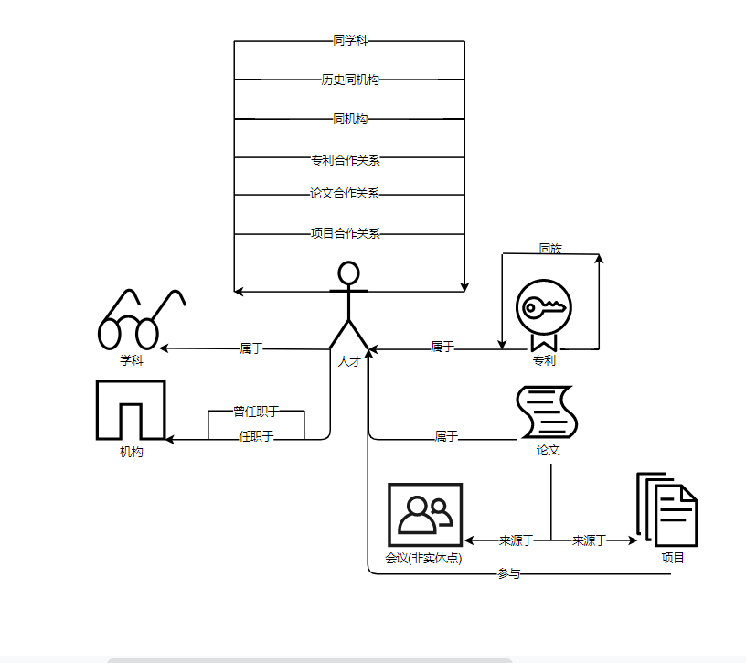

1. 需求：描述数据点集之间的关系，构建基本的知识图谱架构

    

2. 目的或功能是什么？
  * 发现学者之间的关联，避免评审选择时选到一起

3. SQL语句编写优化
* **在查询数据表时，指定所需的待查字段名，而非使用 * 号**；在大数据量多字段的数据表中，如果使用 SELECT * 方式去查询数据，会造成很多无效数据的处理，会占用程序资源，造成资源的浪费。
* **慎重使用COUNT(DISTINCT col)**，distinct会将b列所有的数据保存到内存中，形成一个类似hash的结构，速度是十分的块；但是在大数据背景下，因为b列所有的值都会形成以key值，极有可能发生OOM。可以考虑使用Group By 或者 ROW_NUMBER() OVER(PARTITION BY col)方式代替COUNT(DISTINCT col)
* **不要在表关联后面加WHERE条件，采用谓词下推的技术**，提早进行过滤有可能减少必须在数据库分区之间传递的数据量。所谓谓词下推就是通过嵌套的方式，将底层查询语句尽量推到数据底层去过滤，这样在上层应用中就可以使用更少的数据量来查询，这种SQL技巧被称为谓词下推(Predicate pushdown)
* **处理掉字段中带有空值的数据**，在查询的时候，过滤掉所有为NULL的数据，查询出空值并给其赋上随机数,避免了key值为空

4. Hive SQL
* Hive 的计算基于 Hadoop 实现的一个特别的计算模型 MapReduce，它可以将计算任务分割成多个处理单元，然后分散到一群家用或服务器级别的硬件机器上，降低成本并提高水平扩展性。
* Hive 的数据存储在 Hadoop 一个分布式文件系统上，即 HDFS。
* **需明确的是，Hive 作为数仓应用工具，对比 RDBMS（关系型数据库） 有3个“不能”：**
     -  **不能像 RDBMS 一般实时响应，Hive 查询延时大；**
     -   **不能像 RDBMS 做事务型查询，Hive 没有事务机制；**
     -   **不能像 RDBMS 做行级别的变更操作（包括插入、更新、删除）。**
*  Hive 没有定长的 varchar 这种类型，字符串都是 string；
*  Hive 是读时模式，它在保存表数据时不会对数据进行校验，而是在读数据时校验不符合格式的数据设置为NULL
