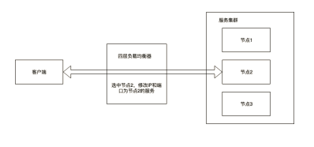
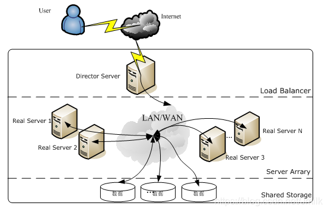
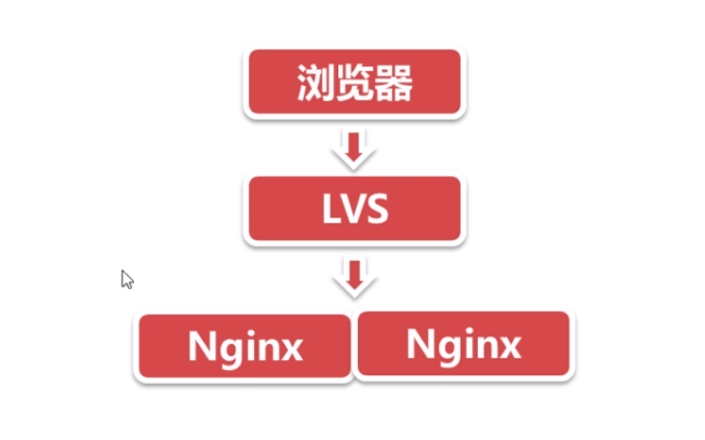
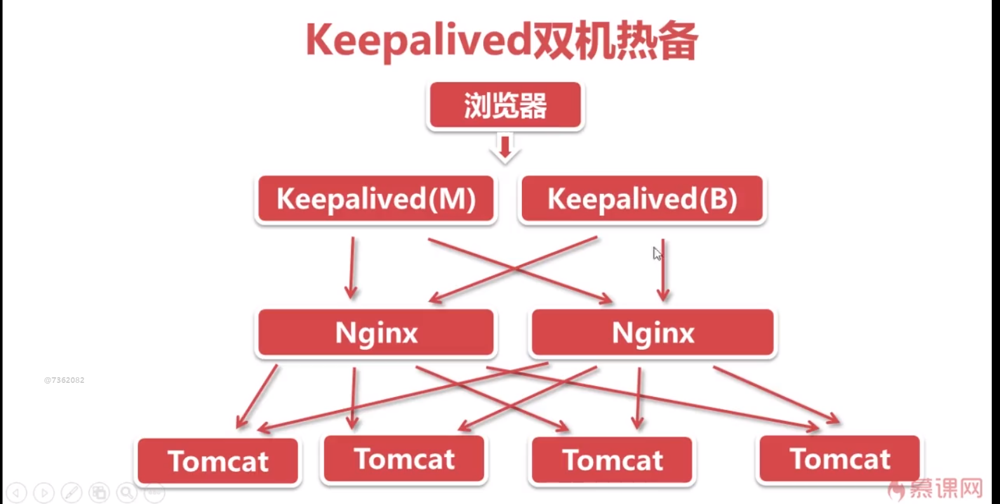

## 服务器优化
### Tomcat配置优化(8.5.20)
#### 内存优化catalina
```shell
JAVA_OPTS="-server -Xms2048M -Xmx2048M  内存大小为2G
-XX:+UseConcMarkSweepGC 
-XX:+UseParNewGC -XX:+UseCMSCompactAtFullCollection 
-XX:CMSFullGCsBeforeCompaction=5  -XX:+PrintGCDetails 
-XX:+HeapDumpOnOutOfMemoryError   //内存溢出的话出错log记录
-XX:HeapDumpPath=$CATALINA_HOME/logs/heap.dump" 
```

#### 并发优化
**${tomcat}/webapps/docs/config/http.html**
   *   **maxConnections**：最大连接数，The maximum number of connections that the server will accept and process at any given time  NIO默认`10000`,ARP默认`8192`, 调整为`300`。
   *   **acceptCount**:   请求队列长度  The maximum queue length for incoming connection requests when all possible request processing threads are in use.当使用所有可能的请求处理线程时，传入连接请求的最大队列长度。调为`200`
   *   **maxThreads**：最大工作线程线程数，The maximum number of request processing threads to be created by this Connector  默认`200`，调为`400`
   *   **minSpareThreads**：最小空闲的工作线程。The minimum number of threads always kept running 调整为`200`个

#### 其他优化
**${tomcat}/webapps/docs/config/host.html**
  *   **autoDeploy**：周期性检查网页应用的更新 This flag value indicates if Tomcat should check periodically for new or updated web applications while Tomcat is running `禁用，影响性能`

**${tomcat}/webapps/docs/config/http.html**
  *  enableLookups：false 如果想调用方法进行DNS查询，则true，`设为false，提高性能`

**${tomcat}/webapps/docs/config/context.html**
*  reloadable：false  检查/WEB-INF/classes和/WEB-INF/lib文件下的改动，若有改动则会进行重载 `设为false，提高性能`

####  连接器：apr
APR对于Tomcat最大的作用就是socket调度。你在局域网环境测，就算是400个并发，也是一瞬间就处理/传输完毕，但是在真实的Internet环境下，页面处理时间只占0.1%都不到，绝大部分时间都用来页面传输。如果不用APR,一个线程同一时间只能处理一个用户，势必会造成阻塞。所以生产环境下用apr是非常必要的。
[下载地址](http://apr.apache.org/)
依赖：
```shell
APR 1.2+ development headers (libapr1-dev package)
OpenSSL 1.0.2+ development headers (libssl-dev package)
JNI headers from Java compatible JDK 1.4+
GNU development environment (gcc, make)
```
安装
```shell
yum install apr* openssl-devel gcc make

tar zxvf apr-1.4.5.tar  
cd apr-1.4.5  
./configure --prefix=/usr/local/apr  
make  
make install  

tar -zxvf apr-iconv-1.2.1.tar.gz  
cd apr-iconv-1.2.1  
./configure --prefix=/usr/local/apr-iconv --with-apr=/usr/local/apr  
make  
make install

yum install expat-devel

tar zxvf apr-util-1.3.12.tar.gz  
cd apr-util-1.3.12  
./configure --prefix=/usr/local/apr-util --with-apr=/usr/local/apr
make  
make install 

安装openssl 1.0.2
./config  --prefix=/usr/local/openssl
修改Makefile：
vi Makefile
将原来的：CFLAG=     -DOPENSSL_THREADS
修改为：  CFLAG= -fPIC -DOPENSSL_THREADS
也就是添加-fPIC
执行执行：
make && make install

cd bin
tar -zxvf tomcat-native.tar.gz
cd tomcat-native-1.2.12-src
cd native
./configure --with-apr=/usr/local/apr --with-ssl=/usr/local/openssl 
make
make install

catalina.sh：
JAVA_OPTS="$JAVA_OPTS -Djava.library.path=/usr/local/apr/lib


//注意：开启了apr之后，jvm用到的native内存会增大，因此要适当调大Metaspace空间,添加JVM选项：-XX:MetaspaceSize=128m

JAVA_OPTS="-server -Xms2048M -Xmx2048M -XX:MetaspaceSize=128M -XX:+HeapDumpOnOutOfMemoryError -XX:HeapDumpPath=$CATALINA_HOME/logs/heap.dump"

server.xml：
<Connector port="8080" protocol="org.apache.coyote.http11.Http11AprProtocol"
connectionTimeout="20000"
redirectPort="8443" />

<Listener className="org.apache.catalina.core.AprLifecycleListener" SSLEngine="off" />
```

### Nginx
可作为HTTP服务器，也可作为反向代理服务器，邮件服务器,常见配置有：
-   1.$remote_addr 与 $http_x_forwarded_for 用以记录客户端的ip地址；
-   2.$remote_user ：用来记录客户端用户名称；
-   3.$time_local ： 用来记录访问时间与时区；
-   4.$request ： 用来记录请求的url与http协议；
-   5.$status ： 用来记录请求状态；成功是200；
-   6.$body_bytes_s ent ：记录发送给客户端文件主体内容大小；
-   7.$http_referer ：用来记录从那个页面链接访问过来的；
-   8.$http_user_agent ：记录客户端浏览器的相关信息；

#### Ngnix优化
优化手段：
1. 并发优化
2. KeepAlive长连接
3. 压缩优化
4. 配置缓存

监控器
1. nginx_status：并发统计
2. Ngxtop：请求统计

安装：
```shell
yum install -y gcc gcc-c++
./configure --prefix=/usr/local/nginx --with-pcre=/usr/local/src/pcre-8.38 --with-http_stub_status_module --with-http_gzip_static_module --add-module=/usr/local/src/ngx_cache_purge-2.3
make
make install
```
[下载地址](http://nginx.org/en/docs/)

#### 详细配置
```shell
user  www;
worker_processes  4;#取决于cpu

error_log  logs/error.log;

pid        logs/nginx.pid;

worker_rlimit_nofile 20480; #每个进程打开的最大的文件数=worker_connections*2是安全的，受限于操作系统/etc/security/limits.conf

events {
    worker_connections 10240;#每一个进程打开的最大连接数，包含了nginx与客户端和nginx与upstream之间的连接
    multi_accept on; #可以一次建立多个连接
    use epoll;
}

http {
    include       mime.types;
    default_type  application/octet-stream;
    server_tokens off; #隐藏版本号
    client_max_body_size 10m; #文件上传需要调大

    log_format  main  '$remote_addr - $remote_user [$time_local] "$request" '
                      '$status $body_bytes_sent "$http_referer" '
                      '"$http_user_agent" "$http_x_forwarded_for"';

    access_log  logs/access.log  main;
    #默认写日志：打开文件写入关闭，max:缓存的文件描述符数量，inactive缓存时间，valid：检查时间间隔，min_uses：在inactive时间段内使用了多少次加入缓存
    open_log_file_cache max=200 inactive=20s valid=1m min_uses=2;
    
    #只有开启了sendfile，tcp_nopush才起作用
    #tcp_nodelay和tcp_nopush互斥，二者同时开启，nginx会： （1）确保数据包在发送给客户端之前是满的
   #（2）对于最后一个数据包，允许tcp立即发送，没有200ms的延迟
    tcp_nodelay on;
    sendfile       on;
    tcp_nopush     on;
    #与浏览器的长连接
    keepalive_timeout  65;#长连接超时时间
    keepalive_requests 500;#500个请求以后，关闭长连接
    keepalive_disable msie6;
    # 启用压缩
    gzip on;
    gzip_http_version 1.1;
    gzip_disable "MSIE [1-6]\.(?!.*SV1)";
    gzip_proxied any;
    gzip_types text/plain text/css application/javascript application/x-javascript application/json application/xml application/vnd.ms-fontobject application/x-font-ttf application/svg+xml application/x-icon;
    gzip_vary on; #Vary: Accept-Encoding
    gzip_static on; #如果有压缩好的 直接使用
    #超时时间
    proxy_connect_timeout 5; #连接proxy超时
    proxy_send_timeout 5; # proxy连接nginx超时
    proxy_read_timeout 60;# proxy响应超时
     # 开启缓存,2级目录
    proxy_cache_path /usr/local/nginx/proxy_cache levels=1:2 keys_zone=cache_one:200m inactive=1d max_size=20g;
    proxy_ignore_headers X-Accel-Expires Expires Cache-Control;
    proxy_hide_header Cache-Control;
    proxy_hide_header Pragma;
    
    #反向代理服务器集群
    upstream server_pool{
        server localhost:8080 weight=1 max_fails=2 fail_timeout=30s;
        server localhost:8081 weight=1 max_fails=2 fail_timeout=30s; 
        keepalive 200; # 最大的空闲的长连接数 
    }

    server {
        listen       80;
        server_name  localhost 192.168.220.133;
        
        location / {
            #长连接
            proxy_http_version 1.1;
            proxy_set_header Upgrade $http_upgrade;
            proxy_set_header Connection "upgrade";
            #Tomcat获取真实用户ip
            proxy_set_header Host $http_host;
            proxy_set_header X-Real-IP $remote_addr;
            proxy_set_header X-Forwarded-For $remote_addr;
            proxy_set_header X-Forwarded-Proto  $scheme;
            proxy_pass http://server_pool;
        }
        # 状态监控
        location /nginx_status {
            stub_status on;
            access_log   off;
            allow 127.0.0.1;
            allow 192.168.220.133;
            deny all;
        }
        #用于清除缓存
        location ~ /purge(/.*)
        {
            allow 127.0.0.1;
            allow 192.168.220.133;
            deny all;
            proxy_cache_purge cache_one $host$1$is_args$args;
        }
        # 静态文件加缓存
        location ~ .*\.(gif|jpg|jpeg|png|bmp|swf|js|css|ico)?$
        {
            expires 1d;
            proxy_cache cache_one;
            proxy_cache_valid 200 304 1d;
            proxy_cache_valid any 1m;
            proxy_cache_key $host$uri$is_args$args;
            proxy_pass http://server_pool;
        }
    }
}
```

### LVS四层负载均衡
网络协议是由七层ISO协议定义，自底向上分为物理层、数据链路层、网络层、传输层、会话层、表现层和应用层。
四层负载均衡主要工作在网络七层ISO协议的第四层，即传输层。传输层的代表协议为TCP。相对于网络层，传输层对于数据包的区分，除了包含IP地址外，还包含端口号，并且TCP实现的是通过在不同机器的两个进程之间建立连接来进行通信。

所以四层负载均衡主要是基于IP和端口号来进行请求转发。由于传输层可以实现两个不同机器进程的连接建立，所以在四层负载均衡的实现当中，负载均衡器接收到一个请求报文时，具体为接收到TCP的第一次握手报文时，可以根据一定的负载均衡算法选择一个集群节点。

集群节点的选择过程为：将这个握手报文的目标IP地址和端口号修改为，通过负载均衡算法从集群中选中的某个节点的IP地址和运行于其上的服务进程所对应的端口号，从而可以将该请求转发给这个节点。由于是在TCP层完成负载均衡，所以客户端是直接与集群的这个节点建立TCP连接的，而不是与负载均衡器建立TCP连接。负载均衡器只是起到了一个中转的作用，后续该客户端的请求是直接发送给这个节点的。具体工作过程如下图所示。



在四层负载均衡实现当中，由于是在客户端和服务集群节点之间直接建立连接进行数据传输的，负载均衡器只是在连接建立阶段进行一个中转，不需要处理该连接之后的请求和响应的相关数据，所以该负载均衡器的负载较低，性能较高，可以处理更多请求的转发。

#### LVS介绍
 * Linux 虚拟服务器（LVS，Linux Virtual Server）**LVS 就是一个四层（传输层）负载均衡器，支持 TCP/UDP 的负载均衡**。
 * LVS 由工作在用户态的 ipvsadm（LVS 的命令行工具）与工作在内核态的 ipvs（LVS 提供服务的内核模块）组成。
 * 用户通过 ipvsadm 添加规则，再由 ipvs 来实现功能，ipvs 工作在 iptables 的 input 链上。



三层结构：负载调度器、服务器池、共享存储。

-   **VS**：Virtual Server，也称为 Director，负载均衡服务器
-   **RS**：Real Server，真正的服务器，集群中各节点
-   **VIP**：Director 向外部提供服务的 IP
-   **DIP**：Director 向内部与 RS 通信的 IP
-   **RIP**：真实服务器的 IP
-   **CIP**：客户端的 IP

####  LVS三种模式
##### LVS-NAT（网络地址转换）
**修改报文头信息**
通过网络地址转换（NAT），调度器重写请求三层 IP 数据包的目标地址，根据预设的调度算法，将请求分派给后端的真实服务器；真实服务器的响应报文通过调度器时，IP 数据包的源地址被重写，再返回给客户，完成整个负载调度过程。
**特性**：
1.  RS 的网关必须指向 DIP
2.  依赖 Director 的路由转发功能，将 CIP、CPort 转换为 RIP、RPort
3.  Director 会成为系统的瓶颈所在
**缺点**：扩展性有限。当 RS 增长过多时，Director 将成为瓶颈，因为所有请求包和响应包都要经过 Director。

#####  LVS-TUN IP隧道
采用 NAT 技术时，由于请求和响应报文都必须经过调度器地址重写，当客户请求越来越多时，调度器的处理能力将成为瓶颈。为了解决这个问题，调度器把请求报文通过 IP 隧道转发至真实服务器，而真实服务器将响应直接返回给客户，所以调度器只处理请求报文。由于一般网络服务应答比请求报文大许多，采用 VS/TUN 技术后，集群系统的最大吞吐量可以提高 10 倍。
**特性**
1.  RIP、DIP、VIP 必须为 Internet IP（公网）
2.  RS 网关不指向 Director
3.  请求数据报文由 Director 转发至 RS，响应数据报文由 RS 直接发送至客户端
4.  不支持端口映射
5.  RS 的 OS 必须支持隧道技术
6.  Director 与 RS、RS 与 RS 可以跨网段、跨机房
7.  一般用于外网环境
**缺点**：隧道模式的 RS 需要合法 IP，这种方式需要所有的服务器都支持 “IP Tunneling” 协议，所以操作系统类型可能只局限在部分 Linux 上。

#####  LVS_DR 直接路由
通过改写三层请求 IP 数据包的 MAC 地址，将请求发送到真实服务器，而真实服务器将响应直接返回给客户。同 VS/TUN 技术一样，VS/DR 技术可极大地提高集群系统的伸缩性。这种方法没有 IP 隧道的开销，对集群中的真实服务器也没有必须支持 IP 隧道协议的要求，但是要求调度器与真实服务器都有一块网卡连在同一物理网段上。
**特性**
1.  必须保证前端路由通过 ARP 地址解析将数据包转发至 Director，数据报文不能直接被 RS 接收
2.  RS 可以使用私网 IP，也可以使用公网 IP
3.  Director 只负责调度
4.  Director 与 RS 必须在同一物理网段中，因为 Director 到 RS 是通过二层网络完成的
5.  不支持端口映射
6.  RS 的网关为前端路由，不能为 Director
7.  RS 支持大多出 OS（可以拒绝 ARP 报文请求的操作系统）
**缺点**：Director 与 RS 必须在同一物理网段中

#### LVS 负载均衡算法
##### 静态负载均衡
-   **rr（round robin，轮询 ）**：把每次来自客户端的请求轮流分配到后端真实服务器。它无需记录当前所有连接的状态，是一种无状态调度。但也不会考虑每台服务器的处理能力。
    
-   **wrr（weight round robin，加权轮询）**：由于每台服务器的配置、安装的业务应用等不同，其处理能力会不一样。所以，根据服务器的不同处理能力，给每个服务器分配不同的权值，使其能够接受相应权值数的服务请求。
    
-   **sh（source hashing，源地址 HASH）**：实现会话绑定 session affinity，将同一客户端的请求发给同一个真实服务器，源地址散列调度算法正好与目标地址散列调度算法相反，它根据请求的源 IP 地址，作为散列键（Hash Key）从静态分配的散列表找出对应的服务器，若该服务器是可用的并且没有超负荷，将请求发送到该服务器，否则返回空。它采用的散列函数与目标地址散列调度算法的相同。它的算法流程与目标地址散列调度算法的基本相似，除了将请求的目标IP地址换成请求的源 IP 地址。
    
-   **dh（destination hashing，目标地址 HASH）**：将同样的请求发送给同一个后端服务器，一般用于缓存服务器。简单的说，LB 集群后面又加了一层，在 LB 与真实服务器之间加了一层缓存服务器，通过这种方式来提高缓存的命中率。目标地址散列调度算法也是针对目标 IP 地址的负载均衡，它是一种静态映射算法，通过一个散列函数将一个目标 IP 地址映射到一台服务器。目标地址散列调度算法先根据请求的目标 IP 地址，作为散列键（Hash Key）从静态分配的散列表找出对应的服务器，若该服务器是可用的且未超载，将请求发送到该服务器，否则返回空。

##### 动态负载均衡
-   **lc（leash-connection，最少连接 ）**：最少连接调度算法是把新的连接请求分配到当前连接数最小的服务器。最小连接调度是一种动态调度短算法，它通过服务器当前所活跃的连接数来估计服务器的负载均衡，调度器需要记录各个服务器已建立连接的数目，当一个请求被调度到某台服务器，其连接数加 1，当连接中止或超时，其连接数减 1。当服务器的权值为 0 时，表示该服务器不可用而不被调度。
    
    -   简单算法：active * 256 + inactive (谁的小选谁)
-   **wlc（加权最少连接）**：lc 算法忽略了服务器的性能问题，有的服务器性能好，有的服务器性能差。通过加权重可以区分性能，各个服务器用相应的权值表示其处理性能。服务器的缺省权值为 1，可以动态地设置服务器的权限，加权最小连接调度在调度新连接时尽可能使服务器的已建立连接数和其权值成比例。由于服务器的性能不同，给性能相对好的服务器，加大权重，即会接收到更多的请求。
    
    -   简单算法：（active * 256 + inactive) / weight（谁的小选谁）
-   **sed（最少期望延迟）**：不考虑非活动连接，谁的权重大，我们优先选择权重大的服务器来接收请求，但会出现问题，就是权重比较大的服务器会很忙，但权重相对较小的服务器很闲，甚至会接收不到请求，所以便有了下面的算法 nq。
    
    -   简单算法：（active + 1) * 256 / weight （谁的小选谁）
-   **nq（never queue，永不排队）**：是 sed 的改进，不管权重多大都会被分配到请求。如果真实服务器的连接数为 0 就直接分配过去，不需要再进行 sed 运算。
    
-   **LBLC（基于局部性的最少连接 ）**：针对请求报文目标 IP 地址的负载均衡调度，主要用于 Cache 集群系统，因为 Cache 集群中客户请求报文的目标 IP 地址是变化的，这里假设任何后端服务器都可以处理任何请求，算法的设计目标在服务器的负载基本平衡的情况下，将相同的目标 IP 地址的请求调度到同一个台服务器，来提高服务器的访问局部性和主存 Cache 命中率，从而调整整个集群系统的处理能力。
    
-   **LBLCR（基于局部性的带复制功能的最少连接）**：针对目标 IP 地址的负载均衡，该算法根据请求的目标 IP 地址找出该目标 IP 地址对应的服务器组，按 “最小连接” 原则从服务器组中选出一台服务器，若服务器没有超载，将请求发送到该服务器；若服务器超载，则按 “最小连接” 原则从这个集群中选出一台服务器，将该服务器加入到服务器组中，将请求发送到该服务器。同时，当该服务器组有一段时间没有被修改，将最忙的服务器从服务器组中删除，以降低复制的程度。

#### LVS四层负载均衡架构搭建


配个虚拟IP与路由
 **lvs_dr.sh**
```shell
1.  #! /bin/bash
2.  echo 1 > /proc/sys/net/ipv4/ip_forward
3.  ipv=/sbin/ipvsadm
4.  vip=192.168.220.130
5.  rs1=192.168.220.135
6.  rs2=192.168.220.139
7.  case $1 in
8.  start)
9.  echo "Start LVS"
10.  ifconfig eth0:0 $vip broadcast $vip netmask 255.255.255.255 up #添加虚拟网卡
11.  route add -host $vip dev eth0:0 #添加到虚拟主机的路由
12.  $ipv -A -t $vip:80 -s lc #添加虚拟服务器，-s：调度算法
13.  $ipv -a -t $vip:80 -r $rs1:80 -g -w 1 #添加真实服务器，-g：DR，-w：权重
14.  $ipv -a -t $vip:80 -r $rs2:80 -g -w 1
15.  ;;
16.  stop)
17.  echo "Stop LVS"
18.  route del -host $vip dev eth0:0 #删除虚拟网卡
19.  ifconfig eth0:0 down #删除路由
20.  $ipv -C #删除虚拟主机
21.  ;;
22.  *)
23.  echo "Usage:$0 {start|stop}"
24.  exit 1
25.  esac
```
**lvs_rs.sh**
```shell
1.  #!/bin/bash
2.  vip=192.168.220.130
3.  case $1 in
4.  start)
5.  echo "Start LVS"
6.  ifconfig eth0:0 $vip broadcast $vip netmask 255.255.255.255 up
7.  route add -host $vip dev eth0:0
8.  echo "1" > /proc/sys/net/ipv4/conf/lo/arp_ignore
9.  echo "2" > /proc/sys/net/ipv4/conf/lo/arp_announce
10.  echo "1" > /proc/sys/net/ipv4/conf/all/arp_ignore
11.  echo "2" > /proc/sys/net/ipv4/conf/all/arp_announce
12.  sysctl -p > /dev/null 2>&1
13.  ;;
14.  stop)
15.  echo "Stop LVS"
16.  route del -host $vip dev eth0:0
17.  /sbin/ifconfig eth0:0 down
18.  echo "0" > /proc/sys/net/ipv4/conf/lo/arp_ignore
19.  echo "0" > /proc/sys/net/ipv4/conf/lo/arp_announce
20.  echo "0" > /proc/sys/net/ipv4/conf/all/arp_ignore
21.  echo "0" > /proc/sys/net/ipv4/conf/all/arp_announce
22.  sysctl -p > /dev/null 2>&1
23.  ;;
24.  *)
25.  echo "Usage:$0 {start|stop}"
26.  exit 1
27.  esac
```

### Keepalived
Keepalived是基于vrrp协议的一款高可用软件。Keepailived有一台主服务器和多台备份服务器，在主服务器和备份服务器上面部署相同的服务配置，使用一个虚拟IP地址对外提供服务，当主服务器出现故障时，虚拟IP地址会自动漂移到备份服务器。

VRRP（Virtual Router Redundancy Protocol，虚拟路由器冗余协议），VRRP是为了解决静态路由的高可用。VRRP的基本架构
虚拟路由器由多个路由器组成，每个路由器都有各自的IP和共同的VRID(0-255)，其中一个VRRP路由器通过竞选成为MASTER，占有VIP，对外提供路由服务，其他成为BACKUP，MASTER以IP组播（组播地址：224.0.0.18）形式发送VRRP协议包，与BACKUP保持心跳连接，若MASTER不可用（或BACKUP接收不到VRRP协议包），则BACKUP通过竞选产生新的MASTER并继续对外提供路由服务，从而实现高可用。


避免单点故障
```shell
global_defs {
   notification_email {
         Joshua@163.com
   }
   notification_email_from admin@163.com
   smtp_server 220.181.12.11
   smtp_connect_timeout 30
   router_id LVS_DEVEL 
}

vrrp_instance VI_1 {
    state MASTER 
    interface eth0  
    virtual_router_id 51  #主从必须一致
    priority 100  #优先级，选举master用
    advert_int 1    #master与backup节点间同步检查的时间间隔，单位为秒 
    authentication {#验证类型和验证密码，通常使用PASS类型，同一vrrp实例MASTER与BACKUP使用相同的密码才能正常通信
        auth_type PASS
        auth_pass 1111
    }
    virtual_ipaddress {#vip
        192.168.220.130
    }
}
virtual_server 192.168.220.130 80 {
        delay_loop 6 ##每隔 6 秒查询RealServer状态 
        lb_algo rr   #负载均衡算法
        lb_kind DR    #DR转发模式
        persistence_timeout 10 #会话保持时间 
        protocol TCP 
        real_server 192.168.220.142 80 { #RS
                weight 1
                TCP_CHECK {
                        connect_timeout 10
                        connect_port 80
                }
        }
        real_server 192.168.220.139 80 {
                weight 1
                TCP_CHECK {
                        connect_timeout 10
                        connect_port 80
                }
        }
}
```

操作回顾
```txt
http://www.keepalived.org/

1. 配置RealServer：跟上一节一样，创建路由信息

2.安装keepalive
yum install ipvsadm openssl-devel popt-devel  libnl libnl-devel  libnfnetlink-devel -y
./configure --prefix=/usr/local/keepalived 
make
make install

3.设置内核参数，开启ip转发
vi /etc/sysctl.conf
net.ipv4.ip_forward = 1

4. 关闭防火墙：
iptables -F

5.修改master配置文件

6. 启动keepalive：
./sbin/keepalived --help：列出所有的选项
./sbin/keepalived -f /usr/local/keepalived/etc/keepalived/keepalived.conf -D

7.测试轮询
修改nginx的配置：
keepalive_timeout  1s; #长连接的超时时间
#修改默认的会话保持时间
ipvsadm -L --timeout
ipvsadm --set 1 2 1
#查看连接信息
watch ipvsadm -L -n -c

8.测试双机热备高可用
两台DR，同样的VIP：
state MASTER | BACKUP
priority 100     | 80
```