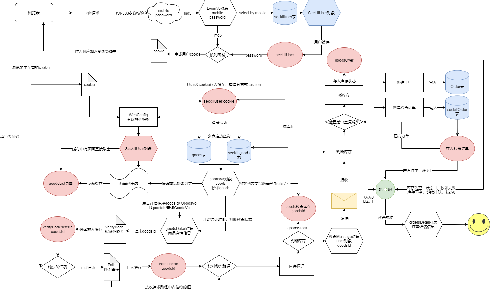

## 秒杀系统实现




|功能模块|1|2|3|4|
|----|----|----|----|----|
|用户登录|数据库设计|两次MD5|JSR303参数校验和全局异常处理|分布式Session|
|实现秒杀功能|数据库设计|商品列表页|商品详情页|订单详情页|
|JMeter压测|JMeter使用|模拟多用户|JMeter命令行使用||
|页面优化技术|页面+URL+对象缓存|页面静态化|静态资源优化|CDN优化|
|接口优化|Redis预减库存|内存标记|RabbitMQ异步下单|访问Nginx水平扩展|
|安全优化|秒杀接口地址隐藏|数学公式验证码|接口防刷|流量控制|
|配置优化|Tomcat配置优化|Ngnix配置|LVS四层均衡负载|Keepalived高可用|

>代码量：15137行

### 技术选型
#### 为什么会选择SpringBoot
* 自动配置一些常用的框架包
* 可以管理依赖关系
* 在开发web应用时，会配置一个嵌入式的Tomcat服务器
#### 为什么会使用Mybatis-Plus
MyBatis-Plus（简称：MP）是一个MyBatis的增强工具，在MyBatis的基础上只做增强不做改变，为简化开发、提高效率而生。
我建立了一个单独的工程，在里面集成mybatis-plus，用到数据库中哪个表的时候，就可以输入表的名称，生成表对应的mapper文件。

#### 为什么消息队列会选择RabbitMQ
时效性高

#### Mapper接口的工作原理
JDK动态代理，Mybatis运行时会使用JDK动态代理为Dao接口生成代理proxy对象，代理对象proxy会拦截接口方法，转而执行MapperedStatement所代表的sql，然后将sql执行的结果返回。

### 常见问题
#### 秒杀系统的痛点有哪些
1. **高并发**：时间极短、 瞬间用户量大，而且用户会在开始前不断刷新页面，还会积累一大堆重复请求的问题，请求过多把数据库打宕机了，系统响应失败。
2. **链接暴露**：有人知道了你秒杀的url，然后在秒杀开始前通过这个url传要传递的参数来进行购买操作
3. **超卖:** 你只有一百件商品，由于是高并发的问题，一起拿到了最后一件商品的信息，都认为还有，全卖出去了，最终卖了一百十件，仓库里根本没这么多货
4. **恶意请求:** 因为秒杀的价格比较低，有人会用脚本来秒杀，全给一个人买走了，他再转卖，或者同时以脚本操作多个账号一起秒杀。（就是我们常见的黄牛党）
5. **数据库:** 一瞬间高QPS把数据库打宕机了，谁都抢不到,活动失败GG，这可能与高并发有重叠的点，不过着眼于数据库的具体方面

#### 秒杀系统高并发解决方案
1. JSR303参数校验挡住不合理的登录请求
2. 分布式Session
3. 页面+URL+对象缓存，页面静态化
4. Redis预减库存阻挡数据库访问，内存标记阻挡Redis访问，RabbitMQ异步下单
5. 数学公式验证码，接口防刷
6. nginx做负载均衡

#### 链接暴露的解决方案
秒杀接口地址隐藏，在秒杀时间到的时候，才能获得url，MiaoshaService 生成随机数再用MD5加密来作为 该用户秒杀该商品的path.
1. 请求后台先验证用户是否登录和验证码是否正确，生成随机地址存入redis并且返回  
2. 带着地址请求后台，后台从redis中取出地址验证是否正确  
3. 正确继续执行秒杀逻辑，错误直接返回

#### 两次MD5
1. 用户端：PASS=MD5(明文+固定salt)
2. 服务端：PASS=MD5(用户输入+随机salt)
* 第一次md5是为了防止明文密码直接在网络上进行传输，第二次md5的目的是：假如数据库本身被泄露，那么可以增加被破解的难度，因为就算还原出来也只是一个md5以后的串，而不是用户的原始密码本身。
* 如果想安全，目前通用的做法是使用https，如果想再安全一点，那就只能使用浏览器的插件比如ActiveX来实现了，比如网银的那些安全控件，控件对数据做加密，因为控件本身破解的难度很高，因此相对来说是非常安全的，但是仅仅依靠js是无法做法数据安全的，因为js本身都是明文的。

**实现过程**：
-   通过前端传来的账号mobile，查询数据库是否存在该条记录
-   获取到该用户的盐值salt和前端传递的password，在后台进行第二次加密，加密的方式写在后端
-   比较第二次加密后的密码和数据库中密码是否一致

#### 参数校验与全局异常的实现
JSR(Java Specification Requests） 是一套 JavaBean 参数校验的标准，它定义了很多常用的校验注解，我们可以直接将这些注解加在我们 JavaBean 的属性上面，这样就可以在需要校验的时候进行校验了，非常方便！
基于**Hibernate Validator**框架实现
全局异常的注解
1.  `@ControllerAdvice` :注解定义全局异常处理类
2.  `@ExceptionHandler` :注解声明异常处理方法

#### 怎么实现持久化登录的
**Cookie**实际上是一小段的文本信息（key-value格式）。客户端向服务器发起请求，如果服务器需要记录该用户状态，就使用response向客户端浏览器颁发一个Cookie。客户端浏览器会把Cookie保存起来。当浏览器再请求该网站时，浏览器把请求的网址连同该Cookie一同提交给服务器。服务器检查该Cookie，以此来辨认用户状态。
**session**描述了“会话”的概念，即在不同的页面中跳转，客户端与服务器的会话，始终对应到一个session
***
Cookie+Session
1.  登录页面提交用户输入给后台登录验证程序
2.  验证程序通过验证，创建session（随机UID（sessionid）+用户对象）,缓存到Redis中
3.  将sessionid下发到浏览器的cookie之中
4.  登录页面跳转到登录成功页面
5.  登录成功页面利用cookie里的信息找到对应session中的用户身份信息

#### 分布式Session的实现
将session单独存到一个缓存中，做到服务器之间的session同步
1. 登陆验证成功过后，我们在服务器端生成一个uuid作为一个token
2. 将token作为key，用户信息作为value写入到redis缓存中，redis缓存有效期为2天
3. 将token生成cookie（“token”,token），传递到客户端，cookie设置的有效期为2天
4. 客户端访问其他页面时，就会将这个cookie上传到服务端
5. 服务器端通过cookie可以获取到token值，通过request.getCookies就能获取到指定的cookie。再通过token就可以从redis中获取到用户的信息也就是session


#### token的概念
token是一种身份验证的机制，初始时用户提交账号数据给服务端，服务端采用一定的策略生成一个字符串（token），token字符串中包含了少量的用户信息，并且有一定的期限。服务端会把token字符串传给客户端，客户端保存token字符串，并在接下来的请求中带上这个字符串。

#### jwt登录认证及优缺点
1.  用户输入用户名密码
2.  app请求登录中心验证用户名密码
3.  如果验证通过则生成一个Token，其中Token中包含：用户的uid、Token过期时间、过期延期时间等，然后返回给app
4.  app获得Token，保存在cookie中，下次请求其他服务则带上
5.  其他服务获取到Token之后调用登录中心接口验证
6.  验证通过则响应

JWT登录认证有哪些优势：
1.  性能好：服务器不需要保存大量的session
2.  单点登录（登录一个应用，同一个企业的其他应用都可以访问）：使用JWT做一个登录中心基本搞定，很容易实现。
3.  兼容性好：支持移动设备，支持跨程序调用，Cookie 是不允许垮域访问的，而 Token 则不存在这个问题。
4.  安全性好：因为有签名，所以JWT可以防止被篡改。

#### cookie安全性问题
最大的原因是因为它存储在浏览器端（用户本地），一些别有用心的人能够通过浏览器截获cookie（脚本、利用工具抓取等）。
1. **cookie欺骗**
将cookie向服务器提交（模拟身份验证），身份验证通过之后，就可以冒充被窃取cookie对应用户来访问网站，甚至获取到用户的隐私信息，对于用户的隐私造成非常严重的危害，这种方式就叫做cookie欺骗。
2. **cookie截获**
cookie以纯文本的形式在浏览器和服务器之间传递，在web通信时极容易被非法用户截获和利用。非法用户截获cookie后，在cookie的有效时间内重新发放给服务器，那么这个非法用户就拥有了这个合法用户的所有权限。
3. **Flash的内部代码隐患**
Flash中有一个getURL()函数，Flash利用它自动打开指定的页面。那么这个就意味着，你在观看Flash动画时，在Flash的内部可以悄无声息的打开一个极小的不易发现的包含特殊操作的页面，可以是木马，可以向远端输入当前cookie或者用户信息，这是非常危险的，由于这个是Flash内部的操作，所以网站无法禁止，要想避免，尽量打开本地防火墙以及访问正规网站。

#### 如何解决cookie安全性问题
1. 设置cookie有效期不要过长，合适即可
2. 设置HttpOnly属性为true，可以防止js脚本读取cookie信息，有效的防止XSS攻击。
3. **设置复杂的cookie，加密cookie，cookie的key使用uuid，随机生成**。
4. 用户第一次登录时，保存ip+cookie加密后的token
5. session和cookie同时使用，**将相对重要的信息存入session**
6. 如果网站支持https，尽可能使用https，可以为cookie设置Secure属性为true，它的意思是，cookie只能使用https协议发送给服务器，而https比http更加安全。

####  如果有一个不存在的用户去访问会怎么样
在Redis缓存中获取到的用户信息为空，会返回到登录页面

#### 缓存穿透怎么解决/怎么应对大量不存在的请求
在本项目中使用的是**JSR303 参数校验**
**概念** 有一堆的请求，在缓存中没有，数据库中也没有，这种垃圾请求还特别多，而且因为是在数据库没有查询到，所以也不会被放到缓存中，这就是缓存穿透的场景。
**后果** 大量的这种请求，最终会导致数据库压力剧增，最终就会将数据打垮，若是这个数据库是核心数据库，那么其他所有依赖这个库的接口都会报错。
**措施** 
1. 首先最基本的就是要做**参数校验，非法的参数就直接return**，连缓存层都到不了。
2. 当请求的数据在穿过Redis后，数据库也返回空，这样的数据也可以存入到缓存中，然后过期时间可以设置一个比较短的时间，这样能够在一定程度上保障后端数据库的安全。
3. 可以使用Redis的布隆过滤器，这个工具可以有效的防止缓存穿透的发生，我们可以将一个参数是否存在保存为一个boolean值，然后需要一个bit就可以存储，这样的数据压缩到一个数据结构中，就是布隆过滤器的原理。

####  布隆过滤器的原理特性
使用布隆过滤器缓存请求
**原理**布隆过滤器是一个 bit 向量或者说 bit 数组，如果我们要映射一个值到布隆过滤器中，我们需要**使用多个不同的哈希函数生成多个哈希值，并对每个生成的哈希值指向的 bit 位置 1**

**误判率**  布隆过滤器的误判是指多个输入经过哈希之后在相同的bit位置1了，这样就无法判断究竟是哪个输入产生的，因此误判的根源在于相同的 bit 位被多次映射且置 1。

这种情况也造成了布隆过滤器的删除问题，因为布隆过滤器的每一个 bit 并不是独占的，很有可能多个元素共享了某一位。如果我们直接删除这一位的话，会影响其他的元素。(比如上图中的第 3 位)**传统的布隆过滤器并不支持删除操作**

#### 热点数据的更新时机
在初始化时将商品数量加载到缓存中，并使用内存标记，**Redis预减库存**，然后使用消息队列异步下单，做削峰填谷、流量控制。

#### 需要实时性要求很高的，但不是热点信息怎么保证时效性
时效性要求很高的数据，库存，采取的是数据库+缓存双写的技术方案，也解决双写的一致性的问题
**缓存+数据库读写的模式，cache aside pattern**
1. 读的时候，先读缓存，缓存没有的话，那么就读数据库，然后取出数据后放入缓存，同时返回响应
2. 更新的时候，先删除缓存，然后再更新数据库

#### 为什么是删除缓存，而不是更新缓存呢
更新缓存的代价是很高，如果你频繁修改一个缓存涉及的多个表，那么这个缓存会被频繁的更新，频繁的更新缓存。

#### Jmeter压测是怎么做的
1. 创建线程组
2. 设置线程组参数（线程数100，Ramp-up Period(in seconds) 1s内启动100个线程，为0代表同时启动，循环次数设置为3）
3. 添加线程组配置元件，HTTP请求默认值 
4. 添加数据源与数据源参数
5. 添加http请求和请求参数
6. 打开查看聚合树和打开聚合报告

命令行压测
1. 在Windows上录好jmx
2. 命令行：`sh jmeter.sh -n -t XXX.jmx -l result.jtl`
3. 把result.jtl导入到jmeter

#### QPS、TPS、并发用户数、吞吐量关系
1. **QPS** `Queries Per Second` 是每秒查询率 ,是**一台服务器**每秒能够相应的查询次数，是对一个特定的查询服务器**在规定时间内**所处理流量多少的衡量标准, 即**每秒的响应请求数，也即是最大吞吐能力**。
2. **TPS** `Transactions Per Second` 也就是事务数/秒。一个事务是指一个客户机向服务器发送请求然后服务器做出反应的过程。客户机在发送请求时开始计时，收到服务器响应后结束计时，以此来计算使用的时间和完成的事务个数，
**区别：**
1. Tps即每秒处理事务数，包括了
-   用户请求服务器
-   服务器自己的内部处理
-   服务器返回给用户
这三个过程，每秒能够完成N个这三个过程，Tps也就是N；
2. Qps基本类似于Tps，但是不同的是，对于一个页面的一次访问，形成一个Tps；但一次页面请求，可能产生多次对服务器的请求，服务器对这些请求，就可计入“Qps”之中。

#### 实现分布式锁的三种方式
1. 基于数据库实现分布式锁
     * 悲观锁，利用`select..where..for update` 排他锁
     * 乐观锁  **通过增加递增的版本号字段实现乐观锁，秒杀就是用了这种实现以防止超卖**
2.  基于Redis缓存实现分布式锁
3.  基于Zookeeper实现分布式锁
     * 创建一个目录mylock
     * 线程A想获取锁就在mylock目录下创建临时顺序节点
     * 获取mylock目录下所有的子节点，然后获取比自己小的兄弟节点，如果不存在，则说明当前线程顺序号最小，获得锁
     * 线程B获取所有节点，判断自己不是最小节点，设置监听比自己次小的节点
     * 线程A处理完，删除自己的节点，线程B监听到变更事件，判断自己是不是最小的节点，如果是则获得锁

#### 分布式锁实现方式对比
**数据库分布式锁实现**  
缺点：
1. db操作性能较差，并且有锁表的风险  
2. 非阻塞操作失败后，需要轮询，占用cpu资源;  
3. 长时间不commit或者长时间轮询，可能会占用较多连接资源

**Redis(缓存)分布式锁实现**  
缺点：
1. 锁删除失败 过期时间不好控制  
2. 非阻塞，操作失败后，需要轮询，占用cpu资源;

**ZK分布式锁实现**  
缺点：性能不如redis实现，主要原因是写操作（获取锁释放锁）都需要在Leader上执行，然后同步到follower。

**总之**：
ZooKeeper有较好的性能和可靠性。
从理解的难易程度角度（从低到高）数据库 > 缓存 > Zookeeper
从实现的复杂性角度（从低到高）Zookeeper >= 缓存 > 数据库
从性能角度（从高到低）缓存 > Zookeeper >= 数据库
从可靠性角度（从高到低）Zookeeper > 缓存 > 数据库

#### 如何用Redis实现分布式锁？
创建了很多个线程去扣减库存inventory，不出意外的库存扣减顺序变了，最终的结果也是不对的。
要想实现分布式锁，必须要求Redis有【互斥】的能力，我们可以使用SETNX命令，命令表示SET IF NOT EXISTS，即key不存在才会设置它的值，否则什么都不做。

客户端1申请加锁，加锁成功：
```shell
127.0.0.1:6379> SETNX lock 1
(integer) 1 #客户端1，加锁成功
```

客户端2申请加锁，因为后到达，加锁失败
```shell
127.0.0.1:6379> SETNX lock 1
(integer) 0 #客户端2，加锁失败
```

此时，加锁成功的客户端，就可以去操作「共享资源」，例如，修改 MySQL 的某一行数据，或者调用一个 API 请求。

操作完成后，还要及时释放锁，给后来者让出操作共享资源的机会。
直接使用 DEL 命令删除这个 key 即可
```shell
127.0.0.1:6379>DEL lock #释放锁
(integer) 1
```
但是此种方式可能会出现以下两种情况造成死锁：
1. 程序处理业务逻辑异常，没及时释放锁
2. 进程挂了，没机会释放锁

在申请锁时，给这把锁设置一个「租期」，但是加锁，设置过期是2条命令，可能会有执行了第一条，而第二条来不及执行的情况发送
1. SETNX执行成功，执行EXPIRE时由于网络原因，执行失败
2. SETNX执行成功，Redis宕机，ECPIRE没有机会执行
3. SETNX执行成功，客户端异常崩溃，EXPIRE也没有机会执行

这两条命令不能保证是原子操作（一起成功），就有潜在的风险导致过期时间设置失败，依旧发生「死锁」问题。

但在 Redis 2.6.12 之后，Redis 扩展了 SET 命令的参数，用这一条命令就可以了
`127.0.0.1:6379>SET lock 1 EX 10 NX` 
一条命令保证原子性执行
但是会导致两个问题：
1. 锁过期：客户端1操作太久了，超过了锁的过期时间
2. 释放别人的 锁：客户端1操作共享资源完成，释放锁（因为1的提前释放，现在释放的是客户端2的锁）

**锁被别人释放怎么办?**
客户端在加锁时，设置一个只有自己知道的「唯一标识」进去
安全释放锁，可以使用原子性的lua脚本
```lua
if redis.call("GET",KEY[1])==ARGV[1]
then 
   return redis.call("DEL",KEYS[1])
else
   return 0
end
```

1. 加锁，`SET lock uuid EX 20 NX`
2. 操作共享资源
3. 释放锁，Lua脚本，先get判断锁是否归属自己，再del释放锁

**过期时间评估**
java使用Redisson库，采用了自动续期的方案来避免锁过期，这个守护线程一般叫做【看门狗】线程。  

若是Redis集群实现分布式锁

1. 客户端1从Master获取了锁。
2. Master宕机了，存储锁的key还没有来得及同步到Slave上。
3. Slave升级为Master。
4. 客户端2从新的Master获取到了对应同一个资源的锁
5. 锁不具有安全性了

#### redis的各种数据结构在项目中怎么使用的
使用spring的RedisTemplate,配置其序列化

使用String缓存用户的cookie和对象

#### 秒杀接口优化思路
1. 系统初始化，把商品库存数量加载到Redis
2. 收到请求，Redis预减库存，库存不足直接返回，否则进入3
3. 请求入队，立即返回排队中

#### 解决超卖问题
**1. 卖超产生的原因**  
有两种情况可能会导致卖超：
（1）一个用户同时发出了多个请求，如果库存足够，没加限制，用户就可以下多个订单。（2）减库存的sql上没有加库存数量的判断，并发的时候也会导致把库存减成负数。  
**2. 解决卖超的方法**  ：  
（1）：前端加验证码，防止用户同时发出多个请求，在后端的miaosha_order表中，对user_id和goods_id加唯一索引，确保一个用户对一个商品绝对不会生成两个订单。  
对于
（2）：我们的减库存的sql上应该加上库存数量的判断

#### Redis中的库存如何与DB中的库存保持一致？
**使用Redis来预减库存，消息队列请求操作数据库变更**（方案1）

客户端对数据库中的数据主要有两类操作，读(select)与写(DML)。

针对放入redis中缓存的热点数据，当客户端想读取的数据在缓存中就直接返回数据，即命中缓存(cache hit)，当读取的数据不在缓存内，就需要从数据库中将数据读入缓存，即未命中缓存(cache miss)。所以**读操作并不会导致缓存与数据库中的数据不一致**。  

对于**写操作(DML)**，缓存与数据库中的内容都需要被修改，但两者的执行必定存在一个先后顺序，这**可能会导致缓冲与数据库中的数据不再一致**

1. **先淘汰cache，再更新数据库：**  
 采用同步更新缓存的策略，可能会导致数据长时间不一致，如果用延迟双删来优化，还需要考虑究竟需要延时多长时间的问题——读的效率较高，但数据的一致性需要靠其它手段来保证  
    采用异步更新缓存的策略，不会导致数据不一致，但在数据库更新完成之前，都需要到数据库层面去读取数据，读的效率不太好——**保证了数据的一致性，适用于对一致性要求高的业务**  
2. **先更新数据库，再淘汰cache：**  
 无论是同步/异步更新缓存，都不会导致数据的最终不一致，在更新数据库期间，cache中的旧数据会被读取，可能会有一段时间的数据不一致，但读的效率很好——**保证了数据读取的效率，如果业务对一致性要求不是很高，这种方案最合适**

####  Redis预减成功，DB扣减库存失败怎么办？
两大类情况可导致redis预减成功而DB扣减失败：
（1） 如果一个用户发出了多个请求（不管何种手段），而这些所有的请求比所有其他用的请求都更快的到达了服务器，这个时候如果库存足够，就会出现redis预减多次，而只能下单成功一次（前提是：这个用户的多个请求比网站的其他用户的请求都更快的到达服务器，这在网络环境不可知的情况下，基本不可能）
（2） 还有就是在生成订单的过程中发生了不可预料的异常，也会导致redis扣减成功，而db扣减失败（如果是DB出现了异常，可能所有的订单都无法生成，但是只要存在redis预减，活动就可以正常结束）
因此，在初始化的时候，redis中的数量可以多于db的库存数量。
出现这种情况的后果是什么？
（1） 对用户而言，秒杀不中是正常现象，秒杀中才是意外，单个用户能否秒杀中本来就是小概率事件，出现这种情况对用户而言是没有任何影响的。
（2） 对商户而言，本来就是为了做活动拉流量拉人气的，卖不完还可以省一部分费用，但是活动还是正常参与了，也是没有任何影响
（3） 对网站而言，网站最重要的是用户体验，只要网站不崩，用户不骂娘，对网站也没有任何影响。
所以，卖不完是完全允许的，但是卖超是绝对不允许的！卖超的这部分钱商家是不会出的，需要网站自己来出。

#### 为什么Redis中的数量会减成负数？
假如redis中的数量是1，这个时候同时过来100个请求，大家一起去执行decr,数量就会减成-99，这是正常的。虽说，库存出现负数，不会出现`超卖的问题`。但由于这里是预减库存，如果负数值负的太多的话，后面万一要回退库存时，就会导致库存不准。lua脚本，是能够保证原子性的，它跟redis一起配合使用，能够完美解决上面的问题。

1. 先判断商品id是否存在，如果不存在则直接返回。
2. 获取该商品id的库存，判断库存如果是-1，则直接返回，表示不限制库存。
3. 如果库存大于0，则扣减库存。
4. 如果库存等于0，是直接返回，表示库存不足。

#### 为什么要单独维护一个秒杀结束的标志？
（1） 前面也提过，所有的秒杀相关的接口都要加上活动是否结束的标志，如果结束就直接返回了，包括轮询的接口，防止一直轮询没法结束。
（2） 管理后台也可以手动的更改这个标志，防止出现活动开始以后就没法结束这种意外的发生。

#### 如果用户秒杀成成功了，但是没有付款怎么办？
一般网站都会有下单30分钟不支付订单自动取消这样的操作，此时就需要把库存再加回去，因此又叫回仓。
可以在创建订单以后，把订单写入到延迟队列里面（RabbitMQ、RocketMQ都支持），如果在有效期之内用户做了付款，则从队列删除，否则等延迟队列数据出队的时候，再去查询数据库订单的状态，如果是未支付则需要回仓。回仓无非就是重置redis和mysql的数据，包括一些秒杀结束的状态等等。
#### 流量控制
最常用限流算法的就是使用令牌桶或者漏斗桶算法 

[10a5.限流算法.md](..\..\..\4.Permanente Notizen\10.数据结构与算法\10a.基础知识\10a5.限流算法.md) 

限制同一个用户一秒钟或者一分钟之内只能访问固定次数，在服务端对系统做一层保护。

1. 获取访问路径
2. 拼接用户用户的Id作为一个记录该用户访问次数的key
3. 缓存里面取得该key，做判断
4. 如果缓存里面没有取到，代表是第一次访问，所以给缓存设置该key，并设置初始值value为1
5. 如果缓存里面取得值并且小于5，那么直接将该key对应的值value+1
6. 如果缓存里面的次数大于超过4（>=5），那么代表在限制时间内（在缓存还没有失效的时间内），访问次数达到限制

如何做一个**通用的限流防刷逻辑**
 1. 新建注解@AccessLimit(seconds = 5,maxCount = 5,needLogin = true)
 2. 实现拦截器，自定义AccessInterceptor继承HandlerInterceptorAdapter拦截器基类，通过实现这个接口，拿到方法上的注解
 3. 将拦截器注册到WebConfig中，这个类继承WebMvcConfigurerAdapter ,Spring框架的配置类。

 


