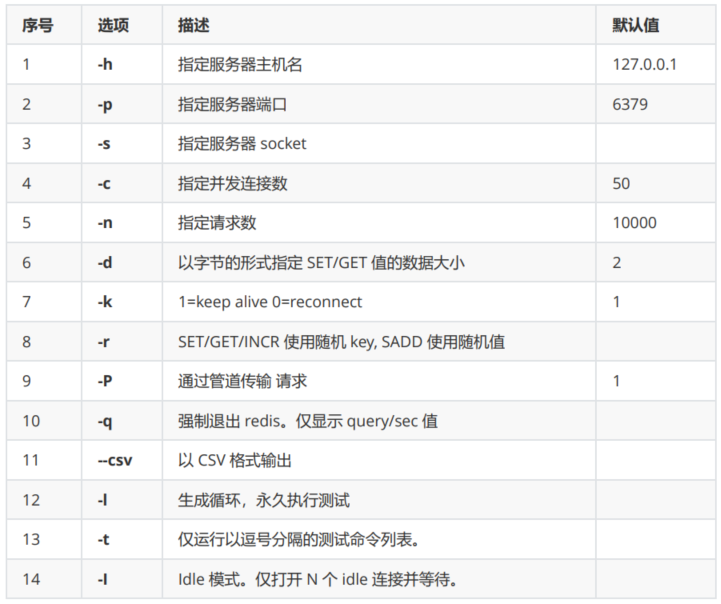
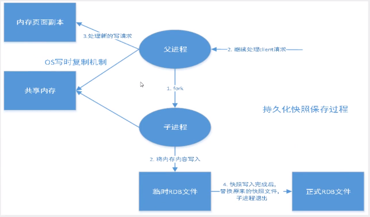
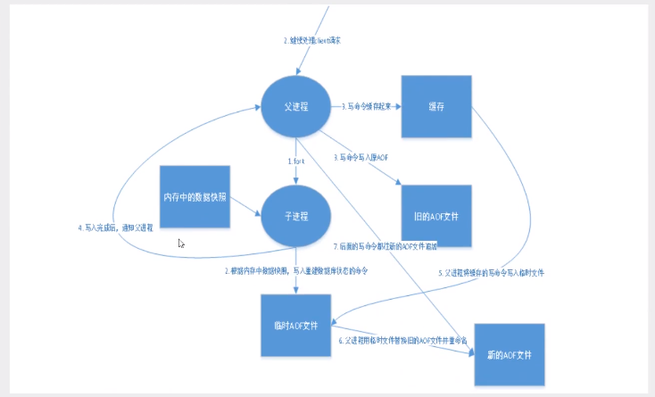
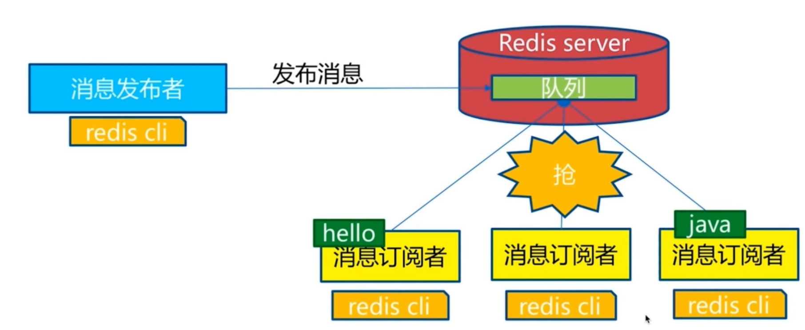
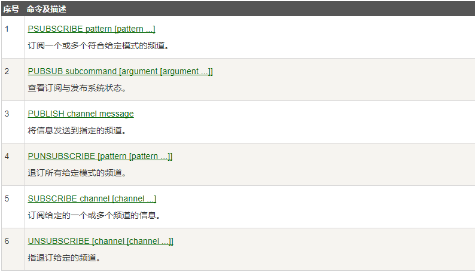
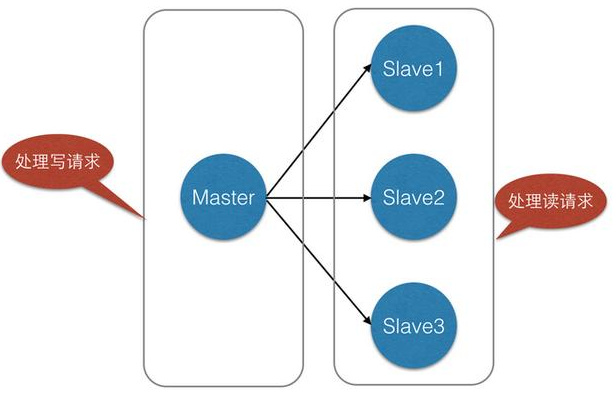

### 概述
>Redis是什么
Redis：Remote Dictionary Server(远程字典服务器)
* 是完全开源免费的，用c语言编写，遵守BSD协议
* 是一个遵守BSD协议，是一个高性能的（Key/Value）分布式内存数据库
* 基于内存运行，并支持持久化的NoSQL数据库
* 是当前最热门的NoSQL数据库之一，也被人们称为数据结构服务器。

Redis与其他key-value缓存产品有以下三个特点：
1. Redis支持数据的持久化，可以将内存中的数据保持在磁盘中，重启的时候可以再次加载进行使用。
2. Redis不仅仅支持简单的 key-value 类型的数据，同时还提供list、set、zset、hash等数据结构的存储。
3. Redis支持数据的备份，即master-slave模式的数据备份。

>Redis能做什么
* 内存存储和持久化：redis支持异步将内存中的数据写到硬盘上，同时不影响继续服务
* 取最新N个数据的操作，如：可以将最新的10条评论的ID放在Redis的List集合里面 
* 发布、订阅消息系统 地图信息分析 
* 定时器、计数器 ......

>特性
* 数据类型、基本操作和配置
* 持久化和复制，RDB、AOF
* 事务的控制

### 测试性能
redis压力测试工具-----Redis-benchmark

`redis-benchmark -h localhost -p 6379 -c 100 -n 100000`
```shell
====== PING_INLINE ======
  100000 requests completed in 4.16 seconds
  100 parallel clients
  3 bytes payload
  keep alive: 1

0.00% <= 1 milliseconds
48.56% <= 2 milliseconds
98.06% <= 3 milliseconds
99.82% <= 4 milliseconds
99.99% <= 5 milliseconds
100.00% <= 5 milliseconds
24044.24 requests per second

====== PING_BULK ======
  100000 requests completed in 4.57 seconds
  100 parallel clients
  3 bytes payload
  keep alive: 1

0.00% <= 1 milliseconds
30.63% <= 2 milliseconds
88.68% <= 3 milliseconds
99.50% <= 4 milliseconds
99.78% <= 5 milliseconds
99.85% <= 6 milliseconds
99.94% <= 7 milliseconds
100.00% <= 7 milliseconds
21862.70 requests per second

====== SET ======
  100000 requests completed in 4.32 seconds
  100 parallel clients
  3 bytes payload
  keep alive: 1

0.00% <= 1 milliseconds
42.07% <= 2 milliseconds
94.83% <= 3 milliseconds
99.83% <= 4 milliseconds
99.90% <= 5 milliseconds
99.90% <= 6 milliseconds
99.90% <= 7 milliseconds
99.92% <= 8 milliseconds
99.96% <= 9 milliseconds
99.98% <= 10 milliseconds
99.99% <= 11 milliseconds
100.00% <= 11 milliseconds
23142.79 requests per second

====== GET ======
  100000 requests completed in 4.19 seconds
  100 parallel clients
  3 bytes payload
  keep alive: 1

0.00% <= 1 milliseconds
46.47% <= 2 milliseconds
97.88% <= 3 milliseconds
99.85% <= 4 milliseconds
99.98% <= 5 milliseconds
100.00% <= 5 milliseconds
23849.27 requests per second

====== INCR ======
  100000 requests completed in 4.37 seconds
  100 parallel clients
  3 bytes payload
  keep alive: 1

0.00% <= 1 milliseconds
38.88% <= 2 milliseconds
95.34% <= 3 milliseconds
99.42% <= 4 milliseconds
99.73% <= 5 milliseconds
99.90% <= 6 milliseconds
99.95% <= 7 milliseconds
99.96% <= 8 milliseconds
99.98% <= 9 milliseconds
100.00% <= 9 milliseconds
22872.83 requests per second

====== LPUSH ======
  100000 requests completed in 5.04 seconds
  100 parallel clients
  3 bytes payload
  keep alive: 1

0.00% <= 1 milliseconds
25.97% <= 2 milliseconds
82.95% <= 3 milliseconds
94.57% <= 4 milliseconds
97.98% <= 5 milliseconds
98.96% <= 6 milliseconds
99.25% <= 7 milliseconds
99.42% <= 8 milliseconds
99.53% <= 9 milliseconds
99.61% <= 10 milliseconds
99.68% <= 11 milliseconds
99.77% <= 12 milliseconds
99.80% <= 13 milliseconds
99.89% <= 14 milliseconds
99.92% <= 15 milliseconds
99.93% <= 20 milliseconds
99.93% <= 21 milliseconds
99.94% <= 22 milliseconds
99.94% <= 24 milliseconds
99.95% <= 25 milliseconds
99.98% <= 26 milliseconds
99.99% <= 27 milliseconds
99.99% <= 28 milliseconds
100.00% <= 31 milliseconds
19853.09 requests per second
```

### Redis的基本知识说明
Redis默认有16个数据库，类似数组下标从零开始，初始默认使用零号库
查看redis.config 里面默认配置
`databases 16`

`set key value`：设置键值
`get key`：获取值
`keys`：展示数据库中所有的键
```shell
127.0.0.1:6379> set name guanghaoliu
OK
127.0.0.1:6379> keys *
1) "mylist"
2) "counter:__rand_int__"
3) "key:__rand_int__"
4) "name"
127.0.0.1:6379> get name
"guanghaoliu"
127.0.0.1:6379>
```


使用`select`命令可以切换数据库
```bash
127.0.0.1:6379> select 3
OK
127.0.0.1:6379[3]>
```

`Dbsize`查看当前数据库的key的数量
```bash
127.0.0.1:6379> Dbsize
(integer) 3
127.0.0.1:6379> keys *
1) "mylist"
2) "counter:__rand_int__"
3) "key:__rand_int__"
127.0.0.1:6379>
```

`Flushdb`： 清空当前库
`Flushall`：清空所有的库

Redis是单线程的！
Redis是基于内存操作，CPU不是Redis性能瓶颈，Redis的瓶颈是机器的内存和网路带宽。
Redis为什么存取速度快：
* C语言编写
* Redis是将所有的数据全部放在内存中的，所以单线程去操作效率就是最高的（CPU上下文切换耗时）

### Redis-Key
`EXISTS  key`：检测数据库中是否存在该键
```shell
127.0.0.1:6379> EXISTS name
(integer) 0
127.0.0.1:6379>
```

`move key 1`：从当前数据库移动到1数据库
```shell
127.0.0.1:6379> move name 1
(integer) 1
127.0.0.1:6379>
```

`EXPIRE key seconds`：设置过期时间
`ttl key`：可以看到key的剩余时间 
```shell
127.0.0.1:6379[1]> EXPIRE name 10
(integer) 1
127.0.0.1:6379[1]> ttl name
(integer) 7
127.0.0.1:6379[1]> ttl name
(integer) 3
127.0.0.1:6379[1]> ttl name
(integer) -2
```

`type name`：查看当前key的类型
```shell
127.0.0.1:6379[1]> type name
string
```

### String（字符串）
`APPEND key "hello"`：在key的键值后面追加字符串,如果当前key不存在，就相当于setkey
```shell
127.0.0.1:6379[1]> append name "hello"
(integer) 16
127.0.0.1:6379[1]> get name
"guanghaoliuhello"
```

`STRLEN key`：返回字符串长度
```shell
127.0.0.1:6379[1]> strlen name
(integer) 16
```

`incr key`：键值加一
```shell
127.0.0.1:6379[1]> set views 0
OK
127.0.0.1:6379[1]> get views
"0"
127.0.0.1:6379[1]> incr views
(integer) 1
127.0.0.1:6379[1]> get views
"1"
```

`decr key`：键值减一

`incrby key num` 增加num
`decrby key num` 减少num
```shell
127.0.0.1:6379[1]> incrby views 10
(integer) 11
127.0.0.1:6379[1]> decrby views 5
(integer) 6
```

`GETRANGE key start end`：获取一定范围内的字符串
```shell
127.0.0.1:6379[1]> getrange name 0 3
"guan"
```

`SETRANGE key offset value`：从某个位置开始替换值
```shell
127.0.0.1:6379[1]> get name
"guanghaoliuhello"
127.0.0.1:6379[1]> setrange name 2 xx
(integer) 16
127.0.0.1:6379[1]> get name
"guxxghaoliuhello"
127.0.0.1:6379[1]>
```

`setex key seconds "hello"`：(set with expire) 设置值及其过期时间
```shell
127.0.0.1:6379[1]> setex key2 20 "byebye"
OK
127.0.0.1:6379[1]> ttl key2
(integer) 14
127.0.0.1:6379[1]> ttl key2
(integer) 12
127.0.0.1:6379[1]> ttl key2
(integer) 11
127.0.0.1:6379[1]> ttl key2
(integer) 5
127.0.0.1:6379[1]> ttl key2
(integer) -2
```

`setnx key value`：(set if not exists)如果没有设置值的话再进行设置，有就不set
```shell
127.0.0.1:6379[1]> setnx age 23
(integer) 1
127.0.0.1:6379[1]> setnx age 20
(integer) 0
127.0.0.1:6379[1]> get age
"23"
```

 `mset key1 value1 key2 value2 key3 value3...`：批量设置
 ```shell
 127.0.0.1:6379[1]> mset k1 v1 k2 v2 k3 v3
OK
127.0.0.1:6379[1]> keys *
1) "k3"
2) "k1"
3) "k2"
 ```

`mget key1 key2 key3`：批量获取
```shell
127.0.0.1:6379[1]> mget k1 k2 k3
1) "v1"
2) "v2"
3) "v3"
```

`msetnx key1 key2 key3`：批量设置不存在的键值

`set user:1 {name:zhangsan,age:3}`：设置一个user:1对象，值为json字符来保存一个对象，key是个巧妙的设计：`user:{id}:{filed}`
```shell
127.0.0.1:6379[1]> set user:1 {name:zhangsan,age:3}
OK
127.0.0.1:6379[1]> get user:1
"{name:zhangsan,age:3}"
```

`getset`：先获取值再设置值
```shell
127.0.0.1:6379[1]> set db mangodb
OK
127.0.0.1:6379[1]> get db
"mangodb"
127.0.0.1:6379[1]> getset db redis
"mangodb"
127.0.0.1:6379[1]> get db
"redis"
```

Spring类似的使用场景：value除了是字符串还可以是数字
* 计数器
* 统计多单位的数量
* 粉丝数
* 对象缓存存储

### 列表List
在redis里面，我们可以用list实现栈、队列等
所有的list命令都是用`l`
`lpush list value`：添加值到列表的头部
`rpush list value`：添加值到表的尾部
`lrange list 0 -1`：获取list一定范围的值
```shell
127.0.0.1:6379> lpush list one
(integer) 1
127.0.0.1:6379> lpush list two
(integer) 2
127.0.0.1:6379> lpush list three
(integer) 3
127.0.0.1:6379> lrange list 0 -1
1) "three"
2) "two"
3) "one"
```

`lpop list`：弹出list左边第一个值,也就是列表的第一个元素
`lpop list`：弹出列表的最后一个值
```shell
127.0.0.1:6379> lpop list
"three"
127.0.0.1:6379> rpop list
"one"
```

`lindex`：通过下标获取值
```shell
127.0.0.1:6379> lrange list 0 -1
1) "one"
2) "two"
127.0.0.1:6379> lindex list 0
"one"
127.0.0.1:6379> lindex list 1
"two"
127.0.0.1:6379>
```

`Llen list`：获取列表的长度
```shell
127.0.0.1:6379> llen list
(integer) 4
```

`lrem list n value`：移除列表中n个值为value的元素
```shell
127.0.0.1:6379> lrem list 1 two
(integer) 1
127.0.0.1:6379> lrange list 0 -1
1) "one"
2) "three"
3) "three"
127.0.0.1:6379> lrem list 2 three
(integer) 2
127.0.0.1:6379> lrange list 0 -1
1) "one"
```

`ltrim list start end`：修剪列表
```shell
127.0.0.1:6379[1]> rpush list "hello"
(integer) 1
127.0.0.1:6379[1]> rpush list "hello1"
(integer) 2
127.0.0.1:6379[1]> rpush list "hello2"
(integer) 3
127.0.0.1:6379[1]> rpush list "hello3"
(integer) 4
127.0.0.1:6379[1]> ltrim list 1 2
OK
127.0.0.1:6379[1]> lrange list 0 -1
1) "hello1"
2) "hello2"
```

`rpoplpush`：移除列表的最后一个元素，将其移动到新的列表之中
```shell
127.0.0.1:6379[1]> lrange list 0 -1
1) "hello1"
2) "hello2"
127.0.0.1:6379[1]> rpoplpush list otherlist
"hello2"
127.0.0.1:6379[1]> lrange list 0 -1
1) "hello1"
127.0.0.1:6379[1]> lrange otherlist 0 -1
1) "hello2"
```

`linsert list before|after pivot value`：在某个元素的前或后插入新的值
```shell
127.0.0.1:6379[1]> lrange list 0 -1
1) "hello"
2) "hello1"
3) "hello2"
4) "hello3"
127.0.0.1:6379[1]> linsert list BEFORE "hello1" bye
(integer) 5
127.0.0.1:6379[1]> lrange list 0 -1
1) "hello"
2) "bye"
3) "hello1"
4) "hello2"
5) "hello3"
127.0.0.1:6379[1]>
```

### Set集合
`sadd set value`：向集合中添加值
`smembers set`：显示集合中的元素
`sismember set value`：判断集合中是否存在value
```shell
127.0.0.1:6379[1]> sadd set "one"
(integer) 1
127.0.0.1:6379[1]> sadd set "two"
(integer) 1
127.0.0.1:6379[1]> sadd set "three"
(integer) 1
127.0.0.1:6379[1]> smembers set
1) "three"
2) "two"
3) "one"
127.0.0.1:6379[1]> sismember set one
(integer) 1
127.0.0.1:6379[1]>
```

`scard set`：获取集合中的元素个数
```shell
127.0.0.1:6379[1]> scard set
(integer) 3
```

`srem set value`：移除集合中的元素
```shell 
127.0.0.1:6379[1]> scard set
(integer) 3
127.0.0.1:6379[1]> srem set one
(integer) 1
127.0.0.1:6379[1]> scard set
(integer) 2
```

set可以抽取随机数
`srandmember set n`：随机抽出n个数
```shell
127.0.0.1:6379[1]> srandmember set 1
1) "two"
127.0.0.1:6379[1]> srandmember set 1
1) "two"
127.0.0.1:6379[1]> srandmember set 1
1) "three"
```

`spop set n`：随机删除set集合中的n个元素
```shell
127.0.0.1:6379[1]> spop set 1
1) "three"
127.0.0.1:6379[1]> smembers set
1) "two"
```


`smove set1 set2 member`：移动某个元素到另一个集合
```shell
127.0.0.1:6379[1]> smove set  set1 two
(integer) 1
127.0.0.1:6379[1]> smembers set
(empty list or set)
127.0.0.1:6379[1]> smembers set1
1) "two"
```

`sdiff set1 set2`：取两个集合差集
`sinter set1 set2`：取两个集合交集
`sunion set1 set2`：取两个集合并集

### Map集合
map集合，key-map

`hset hash field value`：设置hash集合中的键值
`hget hash field`：取出hash集合中的键值
`hmset hash field1 value1 field2 value2...`：设置多个hash集合中的键值
`hmget hash field1 field2 field3`：取出多个hash集合中的键值
`hgetall hash`：显示hash中全部的key和value，交替显示
```shell
127.0.0.1:6379[1]> hset hash field1 one
(integer) 1
127.0.0.1:6379[1]> hget hash field1
"one"
127.0.0.1:6379[1]> hmset hash field1 one field2 two field3 three
OK
127.0.0.1:6379[1]> hmget hash field1 field2 field3
1) "one"
2) "two"
3) "three"
127.0.0.1:6379[1]> hgetall hash
1) "field1"
2) "one"
3) "field2"
4) "two"
5) "field3"
6) "three"
127.0.0.1:6379[1]>
```

`hdel set field`：删除hash中指定的字段
```shell
127.0.0.1:6379[1]> hdel hash field1
(integer) 1
127.0.0.1:6379[1]> hgetall hash
1) "field2"
2) "two"
3) "field3"
4) "three"
127.0.0.1:6379[1]>
```

`hlen hash`：返回hash的长度
```shell
127.0.0.1:6379[1]> hlen hash
(integer) 2
```

`hexists hash field`：判断hash中是否存在对应字段
`hkeys hash`：获取hash中所有键
`hvals hash`：获取hash中所有值
```shell
127.0.0.1:6379[1]> hexists hash field2
(integer) 1
127.0.0.1:6379[1]> hexists hash field1
(integer) 0
127.0.0.1:6379[1]> hkeys hash
1) "field2"
2) "field3"
127.0.0.1:6379[1]> hvals hash
1) "two"
2) "three"
```

`hincrby hash filed 1`：指定增量
`hdecrby hash filed 1`：指定减量
`hsetnx hash field value`：如果该字段不存在，则设置，存在就不设置

### Zset(有序集合)
在set的基础上增加了一个序列值
`zadd set score value`：集合中的第number位设置value值
`zadd set 1 value1 2 value2`：设置多个值
`zadd set 0 -1`：显示zset中的值
```shell
127.0.0.1:6379[1]> zadd set 1 one
(integer) 1
127.0.0.1:6379[1]> zadd set 2 two 3 three
(integer) 2
127.0.0.1:6379[1]> zrange set 0 -1
1) "one"
2) "two"
3) "three"
```

`zrangebyscore salary -inf +inf`：从极大值到极小值范围内升序输出
`zrangebyscore salary -inf +inf withscores`：显示元素并附带序列值

`zrevrangebyscore salary +inf -inf`：从极小值到极大值范围内降序输出
`zrevrangebyscore salary +inf -inf withscores`：显示元素并附带序列值
`zrange salary start end`：默认输出范围内的值是升序
```shell
127.0.0.1:6379[1]> zrangebyscore set -inf +inf
1) "one"
2) "two"
3) "three"
127.0.0.1:6379[1]> zrevrangebyscore set +inf -inf
1) "three"
2) "two"
3) "one"
127.0.0.1:6379[1]> zrange set 0 -1
1) "one"
2) "two"
3) "three"
```

`zrem set value`：移除指定元素
`zcount set start end`： 获取指定区间的成员数量

### Geospatial地理位置详解
Redis的Geo在Redis3.2版本就推出了
只有六个命令
`geoadd countryname:city 经度 纬度 cityname`：添加地理信息（无法添加两极）
```shell
127.0.0.1:6379[1]> geoadd china:city 116.40 39.90 beijing
(integer) 1
127.0.0.1:6379[1]> geoadd china:city 121.47 31.23 shanghai
(integer) 1
127.0.0.1:6379[1]> geoadd china:city 106.50 29.53 chongqing 114.05 22.52 shenzhen
(integer) 2
```

`geopos city:china cityname` 从key中返回所有给定元素的位置
```shell
127.0.0.1:6379[1]> geopos china:city beijing
1) 1) "116.39999896287918091"
   2) "39.90000009167092543"
127.0.0.1:6379[1]> geopos china:city chongqing
1) 1) "106.49999767541885376"
   2) "29.52999957900659211"
```

`geodist pos1 pos2`：两个地点之间的距离（单位m、km、mi英里、ft英尺）默认是米
```shell
127.0.0.1:6379[1]> geodist china:city beijing shanghai
"1067378.7564"
```

`georadius 经度 纬度 半径 单位`：返回规定地点在一定半径内的所有地点
`withdist`(返回距离)、`withcoord`(返回位置坐标)、`count`(返回的个数)
```shell
127.0.0.1:6379[1]> georadius china:city 110 30 1000 km
1) "chongqing"
2) "shenzhen"
```

`georadiusbymember pos redius` 返回成员一定半径内的其他成员

`geohash pos1 pos2` ：将二维的经纬度转换为一维字符串返回，两个字符串越像位置彼此越近(不常用)

Geo底层是zset，可以使用zset命令操作geo

### Hyperloglog基数统计
基数，不重复的元素
优点：占用的内存是固定的
有0.81%的错误率

`pfadd key value`：添加元素
`pfcount key`：不重复计数
```shell
127.0.0.1:6379[1]> pfadd set a b c d e f g h i j
(integer) 1
127.0.0.1:6379[1]> pfcount set
(integer) 10
```

`pfmerge distset sourceset1 sourceset2`：合并两个集合,并集
```shell
127.0.0.1:6379[1]> pfmerge set2 set set1
OK
127.0.0.1:6379[1]> pfcount set2
(integer) 12
```

### Bitmaps
位存储
统计用户信息，活跃，不活跃，登录，未登录
bitmaps位图，数据结构，操作二进制位进行记录，就只有0和1两个状态

`setbit key 序号 状态`：按序号设置状态信息
```shell
127.0.0.1:6379[1]> setbit sign 0 1
(integer) 0
127.0.0.1:6379[1]> setbit sign 1 0
(integer) 0
127.0.0.1:6379[1]> setbit sign 3 1
(integer) 0
127.0.0.1:6379[1]> setbit sign 4 1
(integer) 0
127.0.0.1:6379[1]> setbit sign 5 0
(integer) 0
127.0.0.1:6379[1]> setbit sign 6 1
(integer) 0
```

`getbit key 序号`：查看对应序号的状态
`bitcount key`：统计状态为1的个数
```shell
127.0.0.1:6379[1]> getbit sign 3
(integer) 1
127.0.0.1:6379[1]> bitcount sign
(integer) 4
```

### Redis基本的事务操作
Redis事务本质：一组命令的集合，一组命令序列化顺序执行
一次性、顺序性、排他性
```shell
-------队列 set set set 执行-----
```
Redis事务没有隔离级别的概念
Redis事务不能保证原子性，单条命令可以保证原子性

redis的事务：
 * 开启事务（）`multi`
 * 命令入队（）`comand1 comand2...`
 * 执行事务（）`exec`

>正常执行命令
```shell
127.0.0.1:6379[1]> multi
OK
127.0.0.1:6379[1]> set k1 v1
QUEUED
127.0.0.1:6379[1]> set k2 v2
QUEUED
127.0.0.1:6379[1]> set k3 v3
QUEUED
127.0.0.1:6379[1]> keys *
QUEUED
127.0.0.1:6379[1]> exec
1) OK
2) OK
3) OK
4) 1) "k3"
   2) "k2"
   3) "set"
   4) "sign"
   5) "set2"
   6) "k1"
   7) "set1"
127.0.0.1:6379[1]>
```

`discard` ：放弃事务

编译型错误：命令错误，执行时报错，所有事物命令都不会被执行
运行时错误：命令的语法没有错误，出现运行时报错，例如让空值加一，这样执行事物时错误命令会抛出异常，其他命令依旧会执行。

### Redis实现乐观锁
* 悲观锁：认为什么时候都会出问题，无论做什么都会加锁！
* 乐观锁：很乐观，认为什么时候都没有问题，所以不会上锁。更新数据的时候会去判断一下，在此期间是否有人修改这个数据，
   1. 获取vision
   2. 更新的时候比较version

Redis监视测试
`watch object` 监视对象
正常执行
```shell
127.0.0.1:6379[1]> set money 100
OK
127.0.0.1:6379[1]> set out 20
OK
127.0.0.1:6379[1]> watch money
OK
127.0.0.1:6379[1]> multi
OK
127.0.0.1:6379[1]> decrby money 20
QUEUED
127.0.0.1:6379[1]> incrby out 20
QUEUED
127.0.0.1:6379[1]> exec
1) (integer) 80
2) (integer) 40
```

测试多线程修改值，使用watch可以当作redis的乐观锁操作

`unwatch object`：失败后需要解锁，重新加锁 再加锁相当于获取最新的值
也就是说如果修改失败，获取最新值即可。

### Jedis 
我们要使用java来操作Redis
1. 添加依赖
   * Jedis
   * fastjson
2. 连接测试
```java
import redis.clients.jedis.Jedis;

public class TestPing{
	public static void main(String[] args){
		Jedis jedis = new Jedis("127.0.0.1",6379);
		//jedis方法就是之前所学redis的命令
		System.out.println(jedis.ping());
	}
}
```

```shell
PONG
```
3. 常用API
```java
//基本操作
public class TestPassword { 
	public static void main(String[] args) {
		Jedis jedis = new Jedis("127.0.0.1", 6379); 
		//验证密码，如果没有设置密码这段代码省略  
		jedis.auth("password"); 
		jedis.connect(); //连接 
		jedis.disconnect(); //断开连接 
		jedis.flushAll(); //清空所有的key 
	} 
}
```
对key的操作
```java
public class TestKey { 
	public static void main(String[] args) { 
		Jedis jedis = new Jedis("127.0.0.1", 6379); 
		System.out.println("清空数据："+jedis.flushDB()); 
		
		System.out.println("判断某个键是否存在："+jedis.exists("username"));
		
		System.out.println("新增<'username','kuangshen'>的键值 对："+jedis.set("username", "kuangshen")); 
		System.out.println("新增<'password','password'>的键值 对："+jedis.set("password", "password")); 
		
		System.out.print("系统中所有的键如下："); 
		Set keys = jedis.keys("*"); 
		System.out.println(keys); 
		
		System.out.println("删除键password:"+jedis.del("password"));
		
		System.out.println("判断键password是否存 在："+jedis.exists("password"));
		
		System.out.println("查看键username所存储的值的类 型："+jedis.type("username")); 
		
		System.out.println("随机返回key空间的一个："+jedis.randomKey());
		
		System.out.println("重命名key："+jedis.rename("username","name"));
		
		System.out.println("取出改后的name："+jedis.get("name"));
		
		System.out.println("按索引查询："+jedis.select(0));
		
		System.out.println("删除当前选择数据库中的所有key："+jedis.flushDB());
		
		System.out.println("返回当前数据库中key的数目："+jedis.dbSize());
		
		System.out.println("删除所有数据库中的所有key："+jedis.flushAll()); 
	} 
}
```
对String的操作命令
```java
public class TestString { 
	public static void main(String[] args) {
		Jedis jedis = new Jedis("127.0.0.1", 6379); 
		jedis.flushDB(); 
		
		System.out.println("===========增加数据===========");
		System.out.println(jedis.set("key1","value1"));
		System.out.println(jedis.set("key2","value2"));
		System.out.println(jedis.set("key3", "value3"));
		
		System.out.println("删除键key2:"+jedis.del("key2"));		
		System.out.println("获取键key2:"+jedis.get("key2"));
		System.out.println("修改key1:"+jedis.set("key1", "value1Changed"));
		System.out.println("获取key1的值："+jedis.get("key1"));
		System.out.println("在key3后面加入值："+jedis.append("key3", "End"));
		System.out.println("key3的值："+jedis.get("key3"));
		
		System.out.println("增加多个键值 对："+jedis.mset("key01","value01","key02","value02","key03","value03"));
		System.out.println("获取多个键值对："+jedis.mget("key01","key02","key03"));
		System.out.println("获取多个键值 对："+jedis.mget("key01","key02","key03","key04"));
		System.out.println("删除多个键值对："+jedis.del("key01","key02"));
		System.out.println("获取多个键值 对："+jedis.mget("key01","key02","key03")); 
		jedis.flushDB(); 
		
		System.out.println("===========新增键值对防止覆盖原先值==============");
		System.out.println(jedis.setnx("key1", "value1"));
		System.out.println(jedis.setnx("key2", "value2"));
		System.out.println(jedis.setnx("key2", "value2-new"));
		System.out.println(jedis.get("key1"));
		System.out.println(jedis.get("key2")); 
		
		System.out.println("===========新增键值对并设置有效时间=============");
		System.out.println(jedis.setex("key3", 2, "value3"));
		System.out.println(jedis.get("key3")); 
		try {
			TimeUnit.SECONDS.sleep(3); 
		} catch (InterruptedException e) {
			e.printStackTrace(); 
		} 
		System.out.println(jedis.get("key3"));
		
		System.out.println("===========获取原值，更新为新值==========");
		System.out.println(jedis.getSet("key2", "key2GetSet"));
		System.out.println(jedis.get("key2")); 
		System.out.println("获得key2的值的字串："+jedis.getrange("key2", 2, 4)); 
	} 
}
```
对List操作
```java
public class TestList {
	public static void main(String[] args) {
		Jedis jedis = new Jedis("127.0.0.1", 6379); 
		jedis.flushDB(); 
		
		System.out.println("===========添加一个list===========");
		jedis.lpush("collections", "ArrayList", "Vector", "Stack", "HashMap", "WeakHashMap", "LinkedHashMap"); 
		jedis.lpush("collections", "HashSet"); 
		jedis.lpush("collections", "TreeSet"); 
		jedis.lpush("collections", "TreeMap"); 
		
		System.out.println("collections的内容："+jedis.lrange("collections", 0, -1));
		//-1代表倒数第一个元素，-2代表倒数第二个元素,end为-1表示查询全部  
		System.out.println("collections区间0-3的元素："+jedis.lrange("collections",0,3)); 
		
		System.out.println("==============================="); 
		// 删除列表指定的值 ，第二个参数为删除的个数（有重复时），后add进去的值先被删，类似于出栈 
		System.out.println("删除指定元素个数："+jedis.lrem("collections", 2, "HashMap")); 
		System.out.println("collections的内容："+jedis.lrange("collections", 0, -1)); 
		System.out.println("删除下表0-3区间之外的元 素："+jedis.ltrim("collections", 0, 3)); 
		System.out.println("collections的内容："+jedis.lrange("collections", 0, -1)); 
		
		System.out.println("collections列表出栈（左 端）："+jedis.lpop("collections")); 
		System.out.println("collections的内容："+jedis.lrange("collections", 0, -1)); 
		
		System.out.println("==============================="); 
		System.out.println("collections添加元素，从列表右端，与lpush相对 应："+jedis.rpush("collections", "EnumMap"));
		System.out.println("collections的内容："+jedis.lrange("collections", 0, -1)); 
		System.out.println("collections列表出栈（右 端）："+jedis.rpop("collections")); 
		System.out.println("collections的内容："+jedis.lrange("collections", 0, -1)); 
		
		System.out.println("==============================="); 
		System.out.println("修改collections指定下标1的内容："+jedis.lset("collections", 1, "LinkedArrayList"));
		System.out.println("collections的内容："+jedis.lrange("collections", 0, -1)); 
		
		System.out.println("==============================="); 
		System.out.println("collections的长度："+jedis.llen("collections")); 
		System.out.println("获取collections下标为2的元素："+jedis.lindex("collections", 2)); 
		
		System.out.println("===============================");
		jedis.lpush("sortedList", "3","6","2","0","7","4"); 
		System.out.println("sortedList排序前："+jedis.lrange("sortedList", 0, -1)); 
		System.out.println(jedis.sort("sortedList")); 
		System.out.println("sortedList排序后："+jedis.lrange("sortedList", 0, -1)); 
	} 
}
```
对set操作
```java
public class TestSet { 
	public static void main(String[] args) { 
		Jedis jedis = new Jedis("127.0.0.1", 6379); 
		jedis.flushDB(); 
		
		System.out.println("============向集合中添加元素（不重复============");
		System.out.println(jedis.sadd("eleSet", 
									  "e1","e2","e4","e3","e0","e8","e7","e5"));
		System.out.println(jedis.sadd("eleSet", "e6"));
		System.out.println(jedis.sadd("eleSet", "e6")); 
		
		System.out.println("eleSet的所有元素为："+jedis.smembers("eleSet"));
		System.out.println("删除一个元素e0："+jedis.srem("eleSet", "e0"));
		System.out.println("eleSet的所有元素为："+jedis.smembers("eleSet"));
		System.out.println("删除两个元素e7和e6："+jedis.srem("eleSet", 
													 "e7","e6")); 
		System.out.println("eleSet的所有元素为："+jedis.smembers("eleSet")); 
		
		System.out.println("随机的移除集合中的一个元素："+jedis.spop("eleSet")); 
		System.out.println("随机的移除集合中的一个元素："+jedis.spop("eleSet")); 
		System.out.println("eleSet的所有元素为："+jedis.smembers("eleSet")); 
		
		System.out.println("eleSet中包含元素的个数："+jedis.scard("eleSet")); 
		System.out.println("e3是否在eleSet中："+jedis.sismember("eleSet","e3")); 
		System.out.println("e1是否在eleSet中："+jedis.sismember("eleSet","e1")); 
		System.out.println("e1是否在eleSet中："+jedis.sismember("eleSet","e5")); 
		
		System.out.println("================================="); 
		System.out.println(jedis.sadd("eleSet1",
									  "e1","e2","e4","e3","e0","e8","e7","e5")); 
		System.out.println(jedis.sadd("eleSet2", 
									  "e1","e2","e4","e3","e0","e8")); 
		System.out.println("将eleSet1中删除e1并存入eleSet3中,"+jedis.smove("eleSet1", "eleSet3", "e1"));
		//移到集合元素 
		System.out.println("将eleSet1中删除e2并存入eleSet3中："+jedis.smove("eleSet1", "eleSet3", "e2")); 
		System.out.println("eleSet1中的元素："+jedis.smembers("eleSet1"));
		System.out.println("eleSet3中的元素："+jedis.smembers("eleSet3")); 
		
		System.out.println("============集合运算=================");
		System.out.println("eleSet1中的元素："+jedis.smembers("eleSet1"));
		System.out.println("eleSet2中的元素："+jedis.smembers("eleSet2"));
		System.out.println("eleSet1和eleSet2的交集:"+jedis.sinter("eleSet1","eleSet2")); 
		System.out.println("eleSet1和eleSet2的并集:"+jedis.sunion("eleSet1","eleSet2")); 
		System.out.println("eleSet1和eleSet2的差集:"+jedis.sdiff("eleSet1","eleSet2"));
		//eleSet1中有，eleSet2中没有 
		jedis.sinterstore("eleSet4","eleSet1","eleSet2");
		//求交集并将交集保存到 dstkey的集合 
		System.out.println("eleSet4中的元素："+jedis.smembers("eleSet4")); 
	} 
}
```
对hash进行操作
```java
public class TestHash { 
	public static void main(String[] args) { 
		Jedis jedis = new Jedis("127.0.0.1", 6379); 
		jedis.flushDB();
		Map<String,String> map = new HashMap<>(); 
		map.put("key1","value1"); 
		map.put("key2","value2"); 
		map.put("key3","value3"); 
		map.put("key4","value4"); 
		//添加名称为hash（key）的hash元素 
		jedis.hmset("hash",map); 
		//向名称为hash的hash中添加key为key5，value为value5元素 
		jedis.hset("hash","key5", "value5"); 
		System.out.println("散列hash的所有键值对为："+jedis.hgetAll("hash"));
		//return Map<String,String>
		
		System.out.println("散列hash的所有键为："+jedis.hkeys("hash"));
		//return Set<String> 
		
		System.out.println("散列hash的所有值为："+jedis.hvals("hash"));
		//return List<String>
		
		System.out.println("将key6保存的值加上一个整数，如果key6不存在则添加 key6："+jedis.hincrBy("hash", "key6", 6)); 
		System.out.println("散列hash的所有键值对为："+jedis.hgetAll("hash"));
		
		System.out.println("将key6保存的值加上一个整数，如果key6不存在则添加 key6："+jedis.hincrBy("hash", "key6", 3)); 
		System.out.println("散列hash的所有键值对为："+jedis.hgetAll("hash"));
		
		System.out.println("删除一个或者多个键值对："+jedis.hdel("hash","key2")); 
		System.out.println("散列hash的所有键值对为："+jedis.hgetAll("hash"));
		
		System.out.println("散列hash中键值对的个数："+jedis.hlen("hash"));
	
		System.out.println("判断hash中是否存在key2："+jedis.hexists("hash","key2")); 
		System.out.println("判断hash中是否存在 key3："+jedis.hexists("hash","key3")); 

		System.out.println("获取hash中的值："+jedis.hmget("hash","key3")); 
		System.out.println("获取hash中的 值："+jedis.hmget("hash","key3","key4")); 
	} 
}
```
事务的基本操作
```java
import com.alibaba.fastjson.JSONObject; 
import redis.clients.jedis.Jedis; 
import redis.clients.jedis.Transaction; 

public class TestMulti { 
	public static void main(String[] args) { 
		//创建客户端连接服务端，redis服务端需要被开启 
		Jedis jedis = new Jedis("127.0.0.1", 6379); 
		jedis.flushDB(); 
		JSONObject jsonObject = new JSONObject(); 
		jsonObject.put("hello", "world"); 
		jsonObject.put("name", "java"); 
		
		//开启事务 
		Transaction multi = jedis.multi(); 
		String result = jsonObject.toJSONString(); 
		try{ 
			//向redis存入一条数据 
			multi.set("json", result); 
			//再存入一条数据 
			multi.set("json2", result); 
			//这里引发了异常，用0作为被除数 
			int i = 100/0; 
			//如果没有引发异常，执行进入队列的命令
			multi.exec(); 
		} catch(Exception e){ 
			e.printStackTrace(); 
			//如果出现异常，事务执行失败，Redis没有回滚
			multi.discard(); 
		} finally{ 
			System.out.println(jedis.get("json"));
			System.out.println(jedis.get("json2")); //最终关闭客户端 
			jedis.close(); 
		}
	}
}
```

### SpringBoot整合
通过SpringData来连接redis
jedis：采用的直连，多个线程操作不安全，如果要避免不安全的操作，需要使用jedis pool连接池 BIO
lettuce: 采用netty，实例可以在多个线程中进行共享，不存在线程不安全的情况，可以减少线程数据，更像NIO模式

### Redis配置文件详解
`config get *` 获取全部的配置

`Units`单位
1. 配置大小单位，开头定义了一些基本的度量单位，只支持bytes，不支持bit
2. 对大小写不敏感

`INCLUDES`包含
和spring配置文件类似，可以通过includes包含，redis.conf可以作为总文件，包含其他文件

`network`网络配置
```shell
bind 127.0.0.1 #绑定的ip
protected-mode yes #保护模式
port 6370 #默认端口
```

`general`通用
```shell
daemonize yes #默认情况下，Redis不作为守护进程运行。需要开启的话，改为yes

supervised no #可通过spstart和systemd管理Redis守护进程

pidfile /var/run/redis_6379.pid #以后台进程方式运行redis，需要指定pid文件

loglevel notice #日志级别，可选项有：debug（记录大量日志信息，适用于开发、测试阶段）
                #verbose（较多的日志信息）
				#notice(适量的日志信息，使用于生产环境)
				#warning（仅有部分重要、关键信息才会被记录）
logfile "" #日志文件的位置，当指定为空字符串时，为标准输出
database 16 #设置数据库的数目，默认的数据库是0
always-show-logo yes #是否总是显示logo
```

`snapshopting`快照
```shell
#900秒（15分钟）内至少1个key改变（则进行数据库保存--持久化）
save 900 1
#300秒（5分钟）内至少10个key改变（则进行数据库保存--持久化）
save 300 10
#60秒（1分钟）内至少10000个key值改变（则进行数据库保存--持久化）
save 60 10000

stop-writes-on-bgsave-errors yes #持久化出现错误后，是否依然继续进行工作

rdbcompression yes #使用压缩rdb文件，yes需要一些cpu资源，no消耗更多的磁盘空间

rdbchecksum yes #是否校验rdb文件，更有利于文件的容错性，但是保存在rdb文件的时候会有大约10%的性能损耗

dbfilename dump.rdb #rdb的文件名称

dir ./ #dir数据目录，数据库的写入会在这个目录，rab、aof文件也会在这个目录
```

`REPLICATION` 复制

`SECURITY`安全
访问密码的查看、设置和取消

`LIMIT`限制
```shell
maxclients 10000 #设置能连上redis的最大客户端数量

maxmemory <bytes> #redis配置的最大内存容量

maxmemory-policy noeviction #maxmemory-policy内存达到上限的处理策略
#1. volatile-lru 利用LRU算法移除设置过过期时间的key
#2. volatile-random 随机移除设置过过期时间的key
#3. volatile-ttl 移除即将过期的key，根据最近过期时间来删除
#4. allkeys-lru 利用LRU算法移除任何key
#5. allkeys-random 随机移除任何key
#6. noeviction 不移除任何key，只是返回一个写错误
```

`append-only`模式
```shell
appendonly no #是否以append only模式作为持久化方式，默认使用的是rdb方式持久化

appendfilename #aof文件名称

ppendfsync everysec  # appendfsync aof持久化策略的配置 
# no表示不执行fsync，由操作系统保证数据同步到磁盘，速度最快。 
# always表示每次写入都执行fsync，以保证数据同步到磁盘。 
# everysec表示每秒执行一次fsync，可能会导致丢失这1s数据。
```

常见配置介绍
1. Redis默认不是以守护进程的方式运行，可以通过该配置项修改，使用yes启用守护进程
`daemonize no`
2. 当Redis以守护进程方式运行时，Redis默认会把pid写入/var/run/redis.pid文件，可以通过pidfile指定
`pidfile /var/run/redis.pid`
3. 指定Redis监听端口，默认端口为6379，作者在自己的一篇博文中解释了为什么选用6379作为默认端口，因为6379在手机按键上MERZ对应的号码，而MERZ取自意大利歌Alessia Merz的名字
`port 6379`
4. 绑定的主机地址
`bind 127.0.0.1`
5. 当 客户端闲置多长时间后关闭连接，如果指定为0，表示关闭该功能
`timeout 300`
6. 指定日志记录级别，Redis总共支持四个级别：debug、verbose、notice、warning，默认为 verbose
`loglevel verbose`
7. 日志记录方式，默认为标准输出，如果配置Redis为守护进程方式运行，而这里又配置为日志记录方式为标准输出，则日志将会发送给/dev/null
`logfile stdout`
8. 设置数据库的数量，默认数据库为0，可以使用SELECT 命令在连接上指定数据库id
`databases 16`
9. 指定在多长时间内，有多少次更新操作，就将数据同步到数据文件，可以多个条件配合
`save 900 1 / save 300 10 /save 60 10000`
10. 指定存储至本地数据库时是否压缩数据，默认为yes，Redis采用LZF压缩，如果为了节省CPU时间，可以关闭该选项，但会导致数据库文件变的巨大
`rdbcompression yes`
11. 指定本地数据库文件名，默认值为dump.rdb
`dbfilename dump.rdb`
12. 指定本地数据库存放目录
`dir./`  
13. 设置当本机为slav服务时，设置master服务的IP地址及端口，在Redis启动时，它会自动从master 进行数据同步
`slaveof`
14. 当master服务设置了密码保护时，slav服务连接master的密码
`masterauth`
15. 设置Redis连接密码，如果配置了连接密码，客户端在连接Redis时需要通过AUTH 命令提供密码， 默认关闭
`requirepass foodbared`
16. 设置同一时间最大客户端连接数，默认无限制，Redis可以同时打开的客户端连接数为Redis进程可 以打开的最大文件描述符数，如果设置 maxclients 0，表示不作限制。当客户端连接数到达限制时， Redis会关闭新的连接并向客户端返回max number of clients reached错误信息
`maxclients 128`
17. 指定Redis最大内存限制，Redis在启动时会把数据加载到内存中，达到最大内存后，Redis会先尝 试清除已到期或即将到期的Key，当此方法处理 后，仍然到达最大内存设置，将无法再进行写入操作， 但仍然可以进行读取操作。Redis新的vm机制，会把Key存放内存，Value会存放在swap区
`maxmemory`
18. 指定是否在每次更新操作后进行日志记录，Redis在默认情况下是异步的把数据写入磁盘，如果不开启，可能会在断电时导致一段时间内的数据丢失。因为 redis本身同步数据文件是按上面save条件来 同步的，所以有的数据会在一段时间内只存在于内存中。默认为no
`append only`
19. 指定更新日志文件名，默认为appendonly.aof
`appendfilename appendonly.aof`
20. 指定更新日志条件，共有3个可选值
`no：表示等操作系统进行数据缓存同步到磁盘（快） `
`always：表示每次更新操作后手动调用fsync()将数据写到磁盘（慢，安全）` 
`everysec：表示每秒同步一次（折衷，默认值） `
`appendfsync everysec`
21. 指定是否启用虚拟内存机制，默认值为no，简单的介绍一下，VM机制将数据分页存放，由Redis将 访问量较少的页即冷数据swap到磁盘上，访问多的页面由磁盘自动换出到内存中（在后面的文章我会仔 细分析Redis的VM机制）
`vm-enabled no`
22. 虚拟内存文件路径，默认值为/tmp/redis.swap，不可多个Redis实例共享
`vm-swap-file /temp/redis.swap`
23. 将所有大于vm-max-memory的数据存入虚拟内存,无论vm-max-memory设置多小,所有索引数据 都是内存存储的(Redis的索引数据 就是keys),也就是说,当vm-max-memory设置为0的时候,其实是所有 value都存在于磁盘。默认值为0
`vm-max-memory 0`
24. Redis swap文件分成了很多的page，一个对象可以保存在多个page上面，但一个page上不能被多个对象共享，vm-page-size是要根据存储的数据大小来设定的，作者建议如果存储很多小对象，page 大小最好设置为32或者64bytes；如果存储很大大对象，则可以使用更大的page，如果不确定，就使用 默认值
`vm-page-size 32`
25. 设置swap文件中的page数量，由于页表（一种表示页面空闲或使用的bitmap）是在放在内存中 的，在磁盘上每8个pages将消耗1byte的内存。
`vm-pages 134217728`
26. 设置访问swap文件的线程数,最好不要超过机器的核数,如果设置为0,那么所有对swap文件的操作都是串行的，可能会造成比较长时间的延迟。默认值为4
`vm-max-threads 4`
27. 设置在向客户端应答时，是否把较小的包合并为一个包发送，默认为开启
`glueoutputbuf yes`
28. 指定在超过一定的数量或者最大的元素超过某一临界值时，采用一种特殊的哈希算法
`hash-max-zipmap-entries 64`
`hash-max-zipmap-value 512`
29. 指定是否激活重置哈希，默认为开启（后面在介绍Redis的哈希算法时具体介绍）
`activerehashing yes`
30. 指定包含其它的配置文件，可以在同一主机上多个Redis实例之间使用同一份配置文件，而同时各个实例又拥有自己的特定配置文件
`inclued /path/to/local.conf`

### Redis持久化
#### RDB
Redis是内存数据库，如果不能将内存中的数据库状态保存到磁盘，那么一旦服务器进程退出，服务器中的数据库状态也会消失。所以Redis提供了持久化功能。


在指定的时间间隔内将内存中的数据集快照写入磁盘中，snapshot快照，它恢复时是将快照文件直接读到内存里

1. Redis会单独创建一个子进程来进行持久化；
2. 子进程会先将数据写入到一个临时文件中；
3. 待持久化过程都结束了，再用这个临时文件替换上次持久化好的文件。

整个过程，主进程是不进行任何IO操作的。这就确保了极高的性能。如果需要进行大规模数据的恢复，且对于数据恢复的完整性不是非常敏感，那RDB方式要比AOF方式更加的高效，

触发机制：
1. 满足save的规则，会自动触发rdb
2. 执行flushall命令，也会触发rdb规则
3. 退出redis，也会产生rdb文件

恢复rdb文件
1.只需要将rdb文件放在redis启动目录就可以
2. 查看需要存在的位置
```shell
127.0.0.1:6379> config get dir
1) "dir"
2) "/mnt/c/Users/23974"
```

优点：
1. 适合大规模的数据恢复
2. 对数据的完整性要求不高

缺点：
1. 需要一定的时间间隔进程操作，如果redis意外宕机了，最后一次持久化后的数据会丢失
2. fork进程的时候，会占用一定的内存空间

有时候生产环境中会将rdb文件进行备份

#### AOF操作
将我们的所有命令都记录下来，history，恢复的时候就把这个文件写操作全部再执行一遍



以日志的形式记录每个写操作，将redis执行过的所有指令记录下来（读操作不记录），只许追加但不可以改写文件，redis启动之初会读取该文件重新构建数据。

AOF保存的是appendonly.aof文件

如果AOF文件和RDB文件同时存在，会优先使用AOF

如果aof文件有错误，redis启动会失败，要使用`redis-check-aof --fix`进行修复

优点：
1. 每一次修改都同步，文件的完整会更加好
2. 每秒同步一次，可能会丢失一秒的数据
3. 从不同步，效率最高

缺点：
1. 相对于数据文件来说，aof远远大于rdb，修复的速度也比rdb慢
2. aof运行效率要比rdb慢

如果aof大于规定值，会有新开的进程将文件进行重写

### Redis订阅发布
Redis发布订阅(pub/sub)是一种**消息通信模式**：发送者(pub)发送消息，订阅者(sub)接收消息。微信、微博、关注系统
Redis客户端可以订阅任意数量的频道




测试：

订阅端：
```java
127.0.0.1:6379> subscribe channel
Reading messages... (press Ctrl-C to quit)
1) "subscribe"
2) "channel"
3) (integer) 1
1) "message"
2) "channel"
3) "hello"
```

发送端：
```java
127.0.0.1:6379> publish channel hello
(integer) 1
```

Redis是使用C实现的，通过分析Redis源码中的pubsub.c文件，了解发布和订阅的实现

通过subscribe命令订阅某频道后，redis-server会使用给定的频道作为键，在它所维护的字典中查找记录订阅这个频道所有客户端的链表，链表中保存了所有订阅了这个channel的客户端，subscribe的命令的关键，就是将客户端添加到给定channel的订阅链表中

通过publish命令向订阅者发送消息，redis-server会使用给定的频道作为键，在它所维护的channel字典中找到记录了所有订阅这个频道的客户端，将消息发布给他们

### Redis主从机集群
主从复制，是指将一台Redis服务器的数据，复制到其他的Redis服务器。前者称为主节点 
(master/leader)，后者称为从节点(slave/follower)；数据的复制是单向的，只能由主节点到从节点。 Master以写为主，Slave 以读为主。

默认情况下，每台Redis服务器都是主节点；且一个主节点可以有多个从节点(或没有从节点)，但一个从节点只能有一个主节点。

主从复制的作用主要包括：
1. 数据冗余：主从复制实现了数据的热备份，是持久化之外的一种数据冗余方式。
2. 故障恢复：当主节点出现问题时，可以由从节点提供服务，实现快速的故障恢复；实际上是一种服务 的冗余
3. 负载均衡：在主从复制的基础上，配合读写分离，可以由主节点提供写服务，由从节点提供读服务 （即写Redis数据时应用连接主节点，读Redis数据时应用连接从节点），分担服务器负载；尤其是在写 少读多的场景下，通过多个从节点分担读负载，可以大大提高Redis服务器的并发量。
4. 高可用基石：除了上述作用以外，主从复制还是哨兵和集群能够实施的基础，因此说主从复制是 Redis高可用的基础。

一般来说，要将Redis运用于工程项目中，只使用一台Redis是万万不能的，原因如下： 
1. 从结构上，单个Redis服务器会发生单点故障，并且一台服务器需要处理所有的请求负载，压力较 大； 
2. 从容量上，单个Redis服务器内存容量有限，就算一台Redis服务器内存容量为256G，也不能将所有 内存用作Redis存储内存，一般来说，单台Redis最大使用内存不应该超过20G。 

电商网站上的商品，一般都是一次上传，无数次浏览的，说专业点也就是"多读少写"。 
对于这种场景，我们可以使如下这种架构：



环境配置时，只需要配置从库
`infor replication` ：查看当前库的信息
```shell
127.0.0.1:6379> info replication
# Replication
role:master
connected_slaves:0  #没有从机
master_replid:be2593be2df0dbf0457bad3fb72d0af52657977d
master_replid2:0000000000000000000000000000000000000000
master_repl_offset:0
second_repl_offset:-1
repl_backlog_active:0
repl_backlog_size:1048576
repl_backlog_first_byte_offset:0
repl_backlog_histlen:0
127.0.0.1:6379>
```
复制3个配置文件，修改
1. 端口
2. pid名字
3. log名字
4. rdb名字

配置从机，一主多从
`salveof 主机ip`
真实的应该在conf文件中进行配置，命令重启后从机配置也会重置
主机可以写，从机不能写

1. Slave 启动成功连接到 master 后会发送一个sync命令 
2. Master 接到命令，启动后台的存盘进程，同时收集所有接收到的用于修改数据集命令，在后台进程执行 完毕之后，master将传送整个数据文件到slave，并完成一次完全同步。 
    * 全量复制：而slave服务在接收到数据库文件数据后，将其存盘并加载到内存中。 
    * 增量复制：Master 继续将新的所有收集到的修改命令依次传给slave，完成同步 
3. 只要是重新连接master，一次完全同步（全量复制）将被自动执行


### 哨兵模式(自动选老大)
主从切换技术的方法是：当主服务器宕机后，需要手动把一台从服务器切换为主服务器，这就需要人工 干预，费事费力，还会造成一段时间内服务不可用。这不是一种推荐的方式，更多时候，我们优先考虑 哨兵模式。Redis从2.8开始正式提供了Sentinel（哨兵） 架构来解决这个问题。

哨兵模式是一种特殊的模式，首先Redis提供了哨兵的命令，哨兵是一个独立的进程，作为进程，它会独 立运行。其原理是哨兵通过发送命令，等待Redis服务器响应，从而监控运行的多个Redis实例。


哨兵有两个作用：
1. 通过发送命令，让Redis服务器返回监控其运行状态，包括主服务器和从服务器
2. 当哨兵检测到master宕机，会自动将slave切换成master，然后通过**发布订阅模式**通知其他的从服务器，修改配置文件，让它们切换主机。

假设主服务器宕机，哨兵1先检测到这个结果，系统并不会马上进行failover过程，仅仅是哨兵1主观的认为主服务器不可用，这个现象成为**主观下线**。当后面的哨兵也检测到主服务器不可用，并且数量达到一 定值时，那么哨兵之间就会进行一次投票，投票的结果由一个哨兵发起，进行`failover[故障转移]`操作。 切换成功后，就会通过发布订阅模式，让各个哨兵把自己监控的从服务器实现切换主机，这个过程称为 **客观下线**。

配置测试
1. 调整结构，6379带着80、81 
2. 自定义的 /myredis 目录下新建 sentinel.conf 文件，名字千万不要错 
3. 配置哨兵，填写内容 `sentinel monitor 被监控主机名字    127.0.0.1 6379 1` 
上面最后一个数字1，表示主机挂掉后slave投票看让谁接替成为主机，得票数多少后成为主机 
4. 启动哨兵 `Redis-sentinel   /myredis/sentinel.conf` 
上述目录依照各自的实际情况配置，可能目录不同 
5. 正常主从演示 
6. 原有的Master 挂了 
7. 投票新选 
8. 重新主从继续开工，info replication 查查看 
9. 问题：如果之前的master 重启回来，会不会双master 冲突？  之前的回来只能做小弟了

优点 
1. 哨兵集群模式是基于主从模式的，所有主从的优点，哨兵模式同样具有。
2. 主从可以切换，故障可以转移，系统可用性更好。 
3. 哨兵模式是主从模式的升级，系统更健壮，可用性更高。 
缺点 
1. Redis较难支持在线扩容，在集群容量达到上限时在线扩容会变得很复杂。 
2. 实现哨兵模式的配置也不简单，甚至可以说有些繁琐

哨兵配置说明
```shell
# Example sentinel.conf
# 哨兵sentinel实例运行的端口    默认26379 
port 26379 

# 哨兵sentinel的工作目录 
dir /tmp 

# 哨兵sentinel监控的redis主节点的  ip port 
# master-name 可以自己命名的主节点名字 只能由字母A-z、数字0-9 、这三个字符".-_"组成。 
# quorum 配置多少个sentinel哨兵统一认为master主节点失联 那么这时客观上认为主节点失联了 # sentinel monitor <master-name> <ip> <redis-port> <quorum> 
sentinel monitor mymaster 127.0.0.1 6379 2

# 当在Redis实例中开启了requirepass foobared 授权密码,这样所有连接Redis实例的客户端都 要提供密码 
# 设置哨兵sentinel 连接主从的密码    注意必须为主从设置一样的验证密码 
# sentinel auth-pass <master-name> <password> 
sentinel auth-pass mymaster MySUPER--secret-0123passw0rd 

# 指定多少毫秒之后,主节点没有应答哨兵sentinel,此时,哨兵主观上认为主节点下线 默认30秒 # sentinel down-after-milliseconds <master-name> <milliseconds> 
sentinel down-after-milliseconds mymaster 30000 

# 这个配置项指定了在发生failover主备切换时最多可以有多少个slave同时对新的master进行    同步， 
# 这个数字越小，完成failover所需的时间就越长，但是如果这个数字越大，
# 就意味着越多的slave因为replication而不可用。 
# 可以通过将这个值设为1来保证每次只有一个slave 处于不能处理命令请求的状态。 
# sentinel parallel-syncs <master-name> <numslaves> 
sentinel parallel-syncs mymaster 1 

# 故障转移的超时时间    failover-timeout 可以用在以下这些方面： 
#1. 同一个sentinel对同一个master两次failover之间的间隔时间。 
#2. 当一个slave从一个错误的master那里同步数据开始计算时间。直到slave被纠正为向正确的 master那里同步数据时。 
#3.当想要取消一个正在进行的failover所需要的时间。 
#4.当进行failover时，配置所有slaves指向新的master所需的最大时间。不过，即使过了这个超 时，slaves依然会被正确配置为指向master，但是就不按parallel-syncs所配置的规则来了 # 默认三分钟 
# sentinel failover-timeout <master-name> <milliseconds> 
sentinel failover-timeout mymaster 180000 

# SCRIPTS EXECUTION 
#配置当某一事件发生时所需要执行的脚本，可以通过脚本来通知管理员，例如当系统运行不正常时发邮件通知相关人员。 
#对于脚本的运行结果有以下规则： 
#若脚本执行后返回1，那么该脚本稍后将会被再次执行，重复次数目前默认为10 
#若脚本执行后返回2，或者比2更高的一个返回值，脚本将不会重复执行。 
#如果脚本在执行过程中由于收到系统中断信号被终止了，则同返回值为1时的行为相同。 
#一个脚本的最大执行时间为60s，如果超过这个时间，脚本将会被一个SIGKILL信号终止，之后重新执 行。

#通知型脚本:当sentinel有任何警告级别的事件发生时（比如说redis实例的主观失效和客观失效等 等），将会去调用这个脚本，这时这个脚本应该通过邮件，SMS等方式去通知系统管理员关于系统不正常 运行的信息。调用该脚本时，将传给脚本两个参数，一个是事件的类型，一个是事件的描述。如果 sentinel.conf配置文件中配置了这个脚本路径，那么必须保证这个脚本存在于这个路径，并且是可执 行的，否则sentinel无法正常启动成功。 
#通知脚本 
# sentinel notification-script <master-name> <script-path> 
sentinel notification-script mymaster /var/redis/notify.sh 

# 客户端重新配置主节点参数脚本 
# 当一个master由于failover而发生改变时，这个脚本将会被调用，通知相关的客户端关于master 地址已经发生改变的信息。 
# 以下参数将会在调用脚本时传给脚本: 
# <master-name> <role> <state> <from-ip> <from-port> <to-ip> <to-port> 
# 目前<state>总是“failover”, 
# <role>是“leader”或者“observer”中的一个。 
# 参数    from-ip, from-port, to-ip, to-port是用来和旧的master和新的master(即旧的 slave)通信的
# 这个脚本应该是通用的，能被多次调用，不是针对性的。 
# sentinel client-reconfig-script <master-name> <script-path> 
sentinel client-reconfig-script mymaster /var/redis/reconfig.sh
```

### Redis缓存穿透和雪崩
**缓存穿透：**
缓存穿透的概念很简单，用户想要查询一个数据，发现redis内存数据库没有，也就是缓存没有命中，于是向持久层数据库查询。发现也没有，于是本次查询失败。当用户很多的时候，缓存都没有命中，于是都去请求了持久层数据库。这会给持久层数据库造成很大的压力，这时候就相当于出现了缓存穿透。

*解决方案*：布隆过滤器
布隆过滤器是一种数据结构，对所有可能查询的参数以hash形式存储，在控制层先进行校验，不符合则丢弃，从而避免了对底层存储系统的查询压力；

当存储层不命中后，即使返回的空对象也将其缓存起来，同时会设置一个过期时间，之后再访问这个数据将会从缓存中获取，保护了后端数据源；
但是这种方法会存在两个问题： 
1. 如果空值能够被缓存起来，这就意味着缓存需要更多的空间存储更多的键，因为这当中可能会有很多的空值的键； 
2. 即使对空值设置了过期时间，还是会存在缓存层和存储层的数据会有一段时间窗口的不一致，这对需要保持一致性的业务会有影响。

**缓存击穿：**
这里需要注意和缓存击穿的区别，缓存击穿，是指一个key非常热点，在不停的扛着大并发，大并发集中 对这一个点进行访问，当这个key在失效的瞬间，持续的大并发就穿破缓存，直接请求数据库，就像在一 个屏障上凿开了一个洞。 

当某个key在过期的瞬间，有大量的请求并发访问，这类数据一般是热点数据，由于缓存过期，会同时访问数据库来查询最新数据，并且回写缓存，会导使数据库瞬间压力过大。

*解决方案*
1. 设置热点数据永不过期 
    从缓存层面来看，没有设置过期时间，所以不会出现热点 key 过期后产生的问题。 

2. 加互斥锁 
    分布式锁：使用分布式锁，保证对于每个key同时只有一个线程去查询后端服务，其他线程没有获得分布式锁的权限，因此只需要等待即可。这种方式将高并发的压力转移到了分布式锁，因此对分布式锁的考验很大。
	

**缓存雪崩**
缓存雪崩，是指在某一个时间段，缓存集中过期失效。 
产生雪崩的原因之一，比如在写本文的时候，马上就要到双十二零点，很快就会迎来一波抢购，这波商 品时间比较集中的放入了缓存，假设缓存一个小时。那么到了凌晨一点钟的时候，这批商品的缓存就都 过期了。而对这批商品的访问查询，都落到了数据库上，对于数据库而言，就会产生周期性的压力波 峰。于是所有的请求都会达到存储层，存储层的调用量会暴增，造成存储层也会挂掉的情况。

其实集中过期，倒不是非常致命，比较致命的缓存雪崩，是缓存服务器某个节点宕机或断网。因为自然 形成的缓存雪崩，一定是在某个时间段集中创建缓存，这个时候，数据库也是可以顶住压力的。无非就 是对数据库产生周期性的压力而已。而缓存服务节点的宕机，对数据库服务器造成的压力是不可预知 的，很有可能瞬间就把数据库压垮。

*解决方案*
1. redis高可用 
    这个思想的含义是，既然redis有可能挂掉，那我多增设几台redis，这样一台挂掉之后其他的还可以继续工作，其实就是搭建的集群。 
2. 限流降级 
    这个解决方案的思想是，在缓存失效后，通过加锁或者队列来控制读数据库写缓存的线程数量。比如对某个key只允许一个线程查询数据和写缓存，其他线程等待。 
3. 数据预热 
    数据加热的含义就是在正式部署之前，我先把可能的数据先预先访问一遍，这样部分可能大量访问的数据就会加载到缓存中。在即将发生大并发访问前手动触发加载缓存不同的key，设置不同的过期时间，让缓存失效的时间点尽量均匀。
