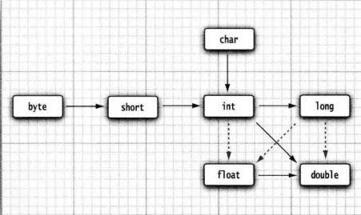

# 9.a1 Java基础知识
## 基本语法
### Java的基本数据类型
```java
public class Hello {
	public static void main(String[] args)
	{
		System.out.println("We will say 'Hello Word!");
	}

}
```
* 关键字public：访问修饰符 （access modifier），这些修饰符用于控制程序的其它部分对这段代码的访问级别。
* 关键字class：java程序的全部内容包含在类中，可以理解为加载程序逻辑的容器
* 类名：跟在关键字class之后，命名以大写字母开头，骆驼命名法，源代码的文件名必须与公共类名相同
* main：运行已编译的程序时，java虚拟机将从指定类的main方法开始执行，必须声明为public
* object.method(parameters)：等价于函数调用
```java
//单行注释

/*
  多行
  注释
*/

/**
可以生成文档
/
```
java 是一种强类型语言，必须为每一个变量声明一种类型  
1. 四种整型：

 	*   int：4字节
 	*   short：2字节
 	*   long：8字节
 	*   byte：1字节
2. 两种浮点型：
	*   float：4字节 有效位数6-7位
	*   double：8字节 有效位数15位
3. 字符类型：
	*   char：字面类型要用单引号引起来
4. 布尔类型：
	*   boolean：用来进行逻辑判断

每个变量都有一个类型：  
`int salary;`   `int salary,cost`  

声明一个变量之后，必须用赋值语句对变量进行显式初始化。  
```java
int vacationDays;
vacationDays = 12;
```

在java中使用final指示常量：
```java
final double CM_PER_INCH = 2.54;
```
关键字final表示这个变量只能被赋值一次，习惯上常量名使用全大写。  

数值之间的类型转换：

数值强制类型转换：  
```java
double x = 9.997;
int nx = (int) Math.round(x);
```

java中没有内置的字符串类型，而是在标准java类库中提供了一个预定义类，很自然地叫做String。每个用双引号括起来的字符串都是String类的一个实例。

string类的substring方法可以从一个较大的字符串中提取一个子串。例如：
```java
String greeting = "Hello";
String s = greeting.substring(0,3)
```

如果需要把多个字符串放在一起，用一个定界符分隔，可以使用静态join方法：  
```java
String all = String.join("/","s","m","n");
```

由于不能修改java字符串中的字符，所以java文档中将String类对象称为不可变字符串。可以使用equals的方法检测两个字符串是否相等。
```java
s.equals(t);
"Hello".equals("Greeting");
s.equalsignoreCase("hello")  //忽略大小写
```
`==`只能够确定两个字符串是否放在同一位置上，相同字符串放在不同位置上就会不相等，因此不能用来判读两个字符串是否相等。    

可以使用`if(str.length()==0)`检查一个字符串是否为空。不过String变量还可以存放一个特殊的值，名为null，这表明目前没有任何对象与该变量关联。   

代码单元相当于是一个char，大多数字符都用一个代码单元及一个char就可以表示，但是有的辅助字符会占两个char即一对代码单元；码点是字面量实际的字符个数。

* length方法可以返回字符串的代码单元数量
* 要想得到实际的长度即码点的数量，可以调用`int cpCount = greeting.codePointCount(0,greeting.length())`
* 调用`s.charAt(n)`将返回位置n的代码单元
* 要想得到第i个码点应该使用
```java
int index = greetng.offsetByCodePoints(0,i);
int cp = greeting.codePointAt(index);
```
* 要遍历字符串的码点
```java
int[] codePoints = str.codePoints().toArray();
//将它转化为一个数组，再进行遍历
//反之将数组转换为一个字符串
String str = new String(codePoints,0,codePoints.length);
```

构建字符串，如果需要用许多小段的字符串构建一个字符串，那么应该按照下列步骤进行。
```java
//首先，构建一个空的字符串构建器：
StringBuilder builder = new StringBuilder();
//当每次需要添加一部分内容时，就调用append方法
builder.append(str);
//在需要构建字符串时就调用`toString`方法，将可以得到一个String对象
String completedString = builder.toString();
```

读取输入，要想通过控制台进行输入，首先需要构造一个Scanner对象，并与“标准输入流”System.in关联
```java
Scanner in = new Scanner(System.in);
```
现在，就可以使用Scanner类的各种方法实现输入操作了。例如，nextLine方法将输入一行。
```java
System.out.print("What is your name?")
String name = in.nextLine();
```
使用nextLine方法时因为在输入行中可能包含空格。要想读取一个单词，可以调用
```java
String firstName = in.next();
```
最后，在程序最开始添加一行：  
```java
import java.util.*;

public class Hello {
	public static void main(String[] args)
	{
		Scanner in = new Scanner(System.in);
		
		//get first input
		System.out.print("What's your name?");
		String name = in.nextLine();
		
		//get second input
		System.out.print("How old are you?");
		int age = in.nextInt();
		
		//display output on console
		System.out.println("Hello," + name + ". Next year, you'll be " + (age + 1) + ".");
	}
}
```

调用`printf("%8.2f",x)`格式化数值，可以用8个字符的宽度和小数点后两个字符的精度打印x，也可以使用多个参数`System.out.printf("Hello,  %s. Next year, you will be %d", name, age);`    格式化参数索引 : `System.out.printf("%1$s %2$tB", "Due date", new Date())`  

可以使用静态的String.format方法创建一个格式化的字符串，而不打印输出：
```java
String message = String.format("Hello, %s. Next year, you'll be %d", name,)
```

要想对文件进行读取，就需要一个用File对象构造一个Scanner对象  
```java
Scanner in = new Scanner(Paths.get("myfile.txt"),"UTF-8");
```
要想写入文件，就使用
```java
PrintWriter out = new PrintWriter("myfile.txt","UTF-8");
```
如果不存在就可以创造文件 ，还可以根据给定的路径名构造一个Path
```java
static Path get(String pathname);
```

### Java控制流程
块作用域：块（复合语句），块确定了变量的作用域。一个块可以嵌套到另一个块中，但是两个块中的变量不能重复定义。

在java中，条件语句的格式为
```java
if (condition)
{
	statement；
	}
```

循环语句
```java
while (condition) statement;
```
举例：
```java
/**
 * 
 * @version 1.1 2021.5.16
 * @author 23974
 */
public class Retirement {
	public static void main(String[] args)
	{
		//read inputs
		Scanner in = new Scanner(System.in);
		
		System.out.print("How much money do you need to retire?");
		double goal = in.nextDouble();
		
		System.out.print("How much money do you contribute every year?");
		double payment = in.nextDouble();
		
		System.out.print("Interest rate in %: ");
		double  interestRate = in.nextDouble();
		
		double balance = 0;
		int years = 0;
		
		// update account balance while goal isn't reached
		while (balance<goal)
		{
			//add this year's payment and interest
			balance += payment;
			double interest = balance * interestRate/100;
			balance += interest;
			years++;
		}
		System.out.println("You can retire in " + years + "years.");
	}

}
```
运行结果：
```shell
How much money do you need to retire? 500000
How much money do you contribute every year? 5000
Interest rate in %: 2

You can retire in 55years.
```
如果想要循环体至少循环一次
```java
do statement while (condition);
```
举例，只要用户回答N就一直执行
```java
public class Retirement2 {
	public static void main(String[] args)
	{
		@SuppressWarnings("resource")
		Scanner in = new Scanner(System.in);

		System.out.print("How much money will you contribute every year?");
		double payment = in.nextDouble();

		System.out.print("Interest rate in % ");
		double interestRate = in.nextDouble();

		double balance = 0;
		int year = 0;

		String input;

		//update account balance while user isn't ready to retire
		do
		{
			//add this year's payment and interest
			balance += payment;
			double interest = balance * interestRate/100;
			balance += interest;
			
			year++;

		    //print current balance
		    System.out.printf("After year %d, your balance is %,.2f%n", year, balance);

		    //ask if ready to retire and get input
		    System.out.print("Ready to retire?(Y/N)");
		    input = in.next();
		}
		while (input.equals("N"));
	}

}
```

for循环语句
```java
for (int i=1; i<=10; i++)
```
如果在 for 语句内部定义一个变量， 这个变量就不能在循环体之外使用。因此， 如果希望在 for 循环体之外使用循环计数器的最终值，就要确保这个变量在循环语句的前面且在外部声明！另一方面，可以在各自独立的不同 for 循环中定义同名的变量.

switch条件选择语句（少用）
```java
swich(choice)
{
	case 1:
	...;
	break;
	
	case 2;
	...;
	break;
	
	default:
	..;
	break;
}
```

大数值：如果基本的整数和浮点数精度不能够满足需求，那么可以使用java.math包中两个很有用的类：`BigInterger`,   `BigDecimal`,可以满足任意精度的整数和浮点数运算。  

数组是一种数据结构，用来存储同一类型值的集合。在声明数组变量时，需要指出数组类型，例如`int[] a;`，不过，这条语句只声明了变量a，并没有将其初始化为一个真正的数组。应该使用`new`运算符创建数组 `int[]a = new int[100];` 这个数组的下标从 0 ~ 99 (不是 1 ~ 100 )。一旦创建了数组，就可以给数组元素赋值。 例如，使用一个循环：
```java
int[] a = new int[100];
for (int i = 0; i<100; i++)
	a[i] = i;
```
创建一个数字数组时， 所有元素都初始化为 0。boolean 数组的元素会初始化为 false。对象数组的元素则初始化为一个特殊值 null, 这表示这些元素（还）未存放任何对象。  数组一旦定义就不能再改变它的大小，就应该使用另一种数据结构———数组列表（array list）

for each循环，可以依次处理数组中的每个元素
```java
for (variable:collection) statement;
```
collection 这一集合表达式必须是一个数组或者是一个实现了 Iterable 接口的类对象  

在 Java中， 提供了一种创建数组对象并同时赋予初始值的简化书写形式。
```java
int[] smallPrimes = {2,3,5,7,9,11} //这种情况下不需要调用new
 //or
smallPrimes = new int[] {17,19,23,26} 
```
数组拷贝
```java
int[] luckNumbers = smallPrimes;
luckyNumbers = 12;// now smallPrimes[5] is also 12
//这种情况下，两个变量将引用同一个数组

//如果想创建新数组
int[] copiedLuckyNumers = Arrays.copyOf(luckyNumbers,luckyNumbers.length)
//此方法还经常用来增加数组的大小
```
命令行参数，每一个java应用程序都有一个带`String arg[]`参数的main方法。这个参数表明main方法将接收一个字符串数组，也就是命令行参数。  
```java
package practice;

public class Message {
	public static void main(String[] args)
	{
		if (args.length == 0 || args[0].equals("-h"))
			System.out.print("Hello,");
		else if (args[0].equals("-g"))
			System.out.print("Goodbye");
		for (int i=1; i<args.length;i++)
			System.out.print(" " + args[i]);
		System.out.println("!");
	}

}
```
使用`java Message -g cruel world` 运行这个程序  
args数组将包含：`args[0]:"-g"   args[1]:"cruel"   args[2]: "world"!`  

要想对数组中的数据进行排序，可以用
```java
int[] a = new int[10000];
...
Arrays.sort(a)//使用了 快速排序算法
```
举例
```java
public class LottreyDrawing {
	public static void main(String[] args) 
	{
		Scanner in = new Scanner(System.in);
		
		System.out.print("How many numbers do you need to draw?");
		int k = in.nextInt();
		
		System.out.print("What's the highest number you can draw?");
		int n = in.nextInt();
		//fill an array with number 1 2 3 .. n
		int[] number = new int[n];
		for (int i = 0; i<number.length; i++)
			number[i] = i+1;
		//draw k numbers and put them into a second array
		int[] result = new int[k];
		for (int i=0; i<result.length; i++) {
			int r = (int) (Math.random() * n);
		    result[i] = number[r];
		    //move the last element into the random location
		    number[r] = number[n-1];
		    n--;
		}
		//print the sorted array
		Arrays.sort(result);
		System.out.println("Bet the flowing combination. It'll make you rich!");
		for (int r : result)
			System.out.println(r);
		in.close();
	}
}
```

二维数组
```java
double[][] balances; //声明
balances = new double[NYEARS][NRATES]; //初始化
//或者
int[][] magicSquare = 
{
	{1,2,3,5,3},
	{5,6,8,68,2}
};
```
如果需要访问数组中元素
```java
for (double[] row : a)
	for (double value : row)
		do something with value
```

多维数组相当于数组的数组，所以可以是不规则的，每一行的个数可以不相同。
```
1 
1 1
1 2 1 
1 3 3 1
1 4 6 4 1
1 5 10 10 5 1
1 6 15 20 15 6 1
```

## 对象与类
1. 类是构造对象的模板或蓝图。由类构造对象的过程称为创建类的实例
2. 封装，将数据和行为组合在一个包中。对象中的数据称为实例域，操作对象的过程称之为方法，不同的数据可使对象的状态发生不同的改变。
3. 通过扩展一个类来建立另一个类的过程称为继承。

类之间的关系：
* 依赖（“uses-a”）一个类的方法操纵另一个类的对象，可以说一个类依赖另一个类，避免依赖，减少类之间的耦合。
* 聚合（“has-a”）类A的对象包含着类B的对象，例如菜单与条目
* 继承（“is-a”）由一般到特殊

使用对象要清楚三个特性：
1. 对象的行为：对象应该具备哪些方法
2. 对象的状态：当施加方法时应该如何响应
3. 对象标识：如何辨别具有相同行为与状态的不同对象

要想使用对象，就要先构造对象，使用构造器来构造新实例，构造器的名字应该和类名相同。例如`new Date()`，如果需要的话，可以将这个对象传递给一个方法：`System.out.print(new Date());`，如果希望构造的对象可以多次使用，则需要将对象存放到一个变量之中：`Date birthday = new Date();`, 当然，也可以调用新构造对象的方法`String s = new Date.toString();`

在 Java 中，任何对象变量的值都是对存储在另外一个地方的一个对象的引用。new 操作符的返回值也是一个引用。不要使用构造器来构造 LocalDate 类的对象。实际上，应当使用静态工厂方法 (factory method) 代表你调用构造器。`LocalDate.now()`会构造一个新对象，表示构造这个对象时的日期。   

只访问对象而不修改对象的方法有时称为访问器

构造器：
* 构造器与类同名
* 每个类可以有一个以上的构造器
* 构造器可以有0个、1个或多个参数
* 构造器没有返回值
* 构造器总是伴随着new操作一起调用

隐式参数：出现在方法名前的Employee类对象。第二个参数位于方法名后面的括号中的数值。在每一个方法中，关键字this表示隐式参数。
```java
public void raiseSalary(double byPercent)
{
	double raise = this.salary * byPercent/100;
	this.salary += raise;
}
```
这样写可以将实例域和局部变量明显地区分开

在有些时候，需要获得或设置实例域的值。因此应该提供下面三项内容：
1. 一个私有的数据域；
2. 一个公有的域访问器方法；
3. 一个公有域的域更改器方法；
这样做比提供一个简单的公有数据域复杂些，首先，可以通过类中的方法改变其内部的实现，这样不会影响其它的代码。除此之外，使用更改器方法可以对数据域执行错误检查，例如薪金是否小于0。

注意不要编写返回引用可变对象的访问器方法，例如返回Date()类对象，因为Date类是可变的，这一点破坏了封装性。如果需要返回一个可变数据域的拷贝，就应该使用 clone。

私有方法：有时，可能希望将一个计算代码划分成若干个独立的辅助方法。通 常， 这些辅助方法不应该成为公有接口的一部分，这是由于它们往往与当前的实现机制非常紧 密， 或者需要一个特别的协议以及一个特别的调用次序。最好将这样的方法设计为 private 的。   

final实例域：如果加final关键字，这个域的值被设置，在后面的操作中不允许再修改，例如,  
```java
class Employee
{
	private final String name;
}
```

**静态域、静态常量与静态方法**  
* 静态域： 一个类的每一个对象对实例域都有着属于自己的拷贝，但是共享一个静态域。静态域属于类而不属于任何独立的对象，所以其又被称为类域。
*  静态常量，不需要建立对象就可以访问
*  静态方法：不能向对象实施操作的方法，可以直接使用类名来调用静态方法。
	* 工厂方法：  类似LocalDate和NumberFormat的类使用静态工厂的方法来构造对象。NumberFormat类如下使用工厂方法生成不同风格的格式化对象：
```java
NumberFormat currencyFormatter = NumberFormat.getCurrencyInstance();
double x = 0.1;
System.out.println(percentFormat.format(x)); //print 10%
```
为什么要用静态工厂的方法而不用构造器
* 使用构造器必须要与类名相同。但是这里希望得到的货币实例与百分比实例采用不用的名字
* 当使用构造器时，无法改变所构造的对象类型。而Factory方法将返回一个DecimalFormat类对象，这是NumberFormat的子类。

main方法不对对象进行任何操作，静态的main方法执行创建对象。每一个类都可以有一个main方法这是进行单元测试的一个技巧。  
举例：
```java
public class StaticTest {
	public static void main(String[] args)
	{
		//fill the staff array with three Employee objects
		Employee[] staff = new Employee[3];
		
		staff[0] = new Employee("Tom",40000);
		staff[1] = new Employee("Dick",60000);
		staff[2] = new Employee("Harry", 65000);
		
		//print out information about all Employee objects
		for (Employee e : staff)
		{
			e.setId();
			System.out.println("name=" + e.getName() + ",id=" + e.getId() + ",salary=" + e.getSalary());
		}
		
		int n = Employee.getNextId(); //calls static method
		System.out.println("Next available id=" + n);
	}

}

class Employee
{
	private static int nextId = 1;
	
	private String name;
	private double salary;
	private int id;
	
	public Employee(String n, double s)
	{
		name = n;
		salary = s;
		id = 0;
	}
	
	public String getName()
	{
		return name;
	}
	
	public double getSalary()
	{
		return salary;
	}
	
	public int getId()
	{
		return id;
	}
	
	public void setId()
	{
		id = nextId; //set id to next available id
		nextId++;
	}
	
	public static int getNextId()
	{
		return nextId; //return static field
	}
	
	public static void main(String[] args) //unit test
	{
		Employee e = new Employee("Harry", 50000);
		System.out.println(e.getName() + " " + e.getSalary());
	}
}
```

```shell
name=Tom,id=1,salary=40000.0
name=Dick,id=2,salary=60000.0
name=Harry,id=3,salary=65000.0
Next available id=4
```


方法参数：java是“call by value” 按值调用，传递给方法的参数值不能修改。  
方法参数共有两种类型：
* 基本数据类型（数字、布尔值）
* 对象引用，实现一个改变对象参数状态的方法并不是一件难事。理由很简单，方法得到的是对象引用的拷贝，对象引用及其他的拷贝同时引用同一个对象。    
总结java方法参数的使用：
1. 一个方法不能修改一个基本数据类型的参数
2. 一个方法可以改变一个对象参数的状态
3. 一个方法不能让对象参数引用一个新的对象。  

**对象构造**
1. 重载：方法重载是一个类中定义了多个方法名相同,而他们的参数的数量不同或数量相同而类型和次序不同,则称为方法的重载(Overloading)
2. 重写：方法重写是在子类存在方法与父类的方法的名字相同,而且参数的个数与类型一样,返回值也一样的方法,就称为重写(Overriding)。
3. 方法重载是一个类的多态性表现,而方法重写是子类与父类的一种多态性表现。

如果在构造器中没有显式地给域赋予初值，那么就会被自动地赋为默认值： 数值为 0、 布尔值为 false、 对象引用为 null。初始值不一定是常量值，可以调用方法对域进行初始化。

关键字 this 引用方法的隐式参数。关键字 this 引用方法的隐式参数。然而，这个关键字还有另外一个含义。 如果构造器的第一个语句形如 this(...)， 这个构造器将调用同一个类的另一个构造器。

调用构造器的具体处理步骤：
1. 所有数据域被初始化为默认值（0，false或null）
2. 按照在类声明中出现的次序，依次执行所有域初始化语句和初始化块
3. 如果构造第一行调用了第二个构造器，则执行第二个构造器主体。
4. 执行这个构造器的主体

如果对类的静态域进行初始化的代码比较复杂，那么可以使用静态的初始化块，将代码放在一个块中，并标记关键字 static。
```java
static
{
	Random generator = new Random();
	nextId = generator.nextInt(10000);
}
```
总结举例：
```java
public class ConstructorTest {
	public static void main(String[] args)
	{
		//fill the staff array with three Employee objects
		Employee1[] staff = new Employee1[3];
				
		staff[0] = new Employee1("Tom",40000);
		staff[1] = new Employee1("Dick",60000);
		staff[2] = new Employee1();
				
		//print out information about all Employee objects
		for (Employee1 e : staff)
			System.out.println("name=" + e.getName() + ",id=" + e.getId() + ",salary=" + e.getSalary());	
	}
}
	
class Employee1
{
	private static int nextId;
	
	private int id;
	private String name = ""; //instance field initialization
	private double salary;
	
	//static initialization block
	static
	{
		Random generator = new Random();
		//set nextId to a random between 0 and 9999
		nextId = generator.nextInt(10000);
	}
	
	//object initialization block
	{
		id = nextId;
		nextId++;
	}
	
	public Employee1(String n, double s)
	{
		name = n;
		salary = s;
	}
	
	public Employee1(double s)
	{
		//calls the Employee(String, double) constructor
		this("Employee #" + nextId, s);
	}
	
	//the default constructor
	public Employee1()
	{
		//name initialed to "" --see above
		//salary not explicitly set-- initialized to 0
		//id initialized in initialization block
	}
	
	public String getName()
	{
		return name;
	}
	
	public double getSalary()
	{
		return salary;
	}
	
	public int getId()
	{
		return id;
	}	
}
```


如果某个资源需要在使用完毕后立刻被关闭， 那么就需要由人工来管理。对象用完时， 可以应用一个 close 方法来完成相应的清理操作。

包：使用包（package）将类组织起来，确保类名的唯一性。例如两个人都建立了相同的类，但放在不同的包里就不会产生冲突。除此之外，嵌套的包没有任何关系，都具有独立的类。  

类的导入：一个类可以使用所属包中的所有类，以及其它包中的公有类（两种方式）
1. 在每个类名之前添加完整的包名
2. 使用`import java.util.*`; 导入java.util包中所有的类

import 语句不仅可以导入类，还增加了导人静态方法和静态域的功能。  
例如：
```java
import static java.lang.System.*;
```
就可以使用System类的静态方法和静态域，而不必加类名前缀:
```java
out.println("Goodbye, World!"); //System.out
```
要想将一个类放人包中， 就必须将包的名字放在源文件的开头，包中定义类的代码之前。
```java
package com.horstman
```
如果没有在源文件中放置package语句，这个源文件的类就被放置在一个默认包中。   
需要注意，编译器对文件 （带有文件分隔符和扩展名 .java 的文件）进行操作。而 Java 解 释器加载类（带有 . 分隔符 )。
```shell
javac com/mycompany/PayrollApp.java
java com.mycompany.PayrollApp
```

类注释必须放在 import 语句之后，类定义之前 :
* @author 姓名
* @version 文本 
* @since  文本 这里的 text 可以是对引人特性的版本描 述。例如， ©since version 1.7.10
* @deprecated 文本 添加一个不再使用的标记或替换建议
* @see 引用
每一个方法注释必须放在所描述的方法之前。除了通用标记之外， 还可以使用下面的标记:
* @param 变量描述
* @return 描述
* ©throws 类描述

类设计技巧：
1.  一定要保证数据私有
	* 这是最重要的；绝对不要破坏封装性。有时候，需要编写一个访问器方法或更改器方法， 但是最好还是保持实例域的私有性。很多惨痛的经验告诉我们， 数据的表示形式很可能会改变，但它们的使用方式却不会经常发生变化。当数据保持私有时，它们的表示形式的变化不会对类的使用者产生影响， 即使出现 bug 也易于检测。
2. 一定要对数据初始化
	* Java 不对局部变量进行初始化， 但是会对对象的实例域进行初始化。最好不要依赖于系 统的默认值， 而是应该显式地初始化所有的数据， 具体的初始化方式可以是提供默认值， 也 可以是在所有构造器中设置默认值。
3. 不要在类中使用过多的基本类型
	* 这样会使类更加易于理解且易于修改
4.  不是所有的域都需要独立的域访问器和域更改器
5.  将职责过多的类进行分解
6.  类名和方法名要能够体现它们的职责
7.  优先使用不可变的类


## 继承
1. 继承：继承已存在的类就是复用（继承）这些类的方法和域。在此基础上，还可以添加一些新的方法和域，以满足新的需求。
2. 反射：反射是指在程序运行期间发现更多的类及其属性的能力。

下面是由继承 Employee 类来定义 Manager类的格式， 关键字 extends 表示继承。
```java
public class Manager extends Employee
{
   添加方法和域
}
```
关键字 `extends` 表明正在构造的新类派生于一个已存在的类。   
已存在的类称为**超类 ( superclass)**、 基类（ base class) 或父类（parent class);   
新类称为**子类（subclass)**、 派生类 ( derived class) 或孩子类（child class)。  

超类中有些方法不适用于子类，需要提供新方法来覆盖超类中的这个方法，如果在重新定义方法时需要调用超类中的方法，需要在方法名前加`super`关键字，来标明这是调用的超类中的方法而不是调用自己，举例如下：
```java
public class Manager extends Employee
{
   public double getsalary()
   {
       double baseSalary = super.getSalary();
	   return baseSalary + bonus;
   }
}
```

子类构造器
```java
public Manager(Spring name, double salary, int year, int month, int day)
{
	super(name, salary, year, month, day);
	bonus=0;
}
```
这里的super有不同的含义，`super(name, salary, year, month, day);`指的是*调用超类Employee中含有n、s、year、month、day参数的构造器*

由于 Manager 类的构造器不能访问 Employee 类的私有域， 所以必须利用 Employee 类 的构造器对这部分私有域进行初始化，我们可以通过 super 实现对超类构造器的调用。使用 super 调用构造器的语句必须是子类构造器的第一条语句。  

**如果子类的构造器没有显式地调用超类的构造器， 则将自动地调用超类默认（没有参数 ) 的构造器。 如果超类没有不带参数的构造器， 并且在子类的构造器中又没有显式地调用超类 的其他构造器**

回忆总结：
1. this
	* 引用隐式参数
	* 调用该类其它的构造器
2. super
	* 调用超类的方法
	* 调用超类的构造器 

一个对象变量（例如，变量 e ) 可以指示多种实际类型的现象被称为多态（polymorphism)。在运行时能够自动地选择调用哪个方法的现象称为动态绑定（ dynamic binding)。  

继承并不仅限于一个层次，由一个公共超类所派生出来的类的集合称之为继承层次，一个祖先可以有多个子孙继承类。   

超类对象变量可以引用一个超类对象，也可以引用该超类的所有子类对象。但反之不可以，子类对象变量不能引用超类对象。  

方法的名字和方法的参数称之为方法的签名。不过返回类型不是签名的一部分，要保证返回类型的兼容性。  

如果是 private 方法、 static 方法、 final 方法或者构造器， 那么编译器将可以准确地知道应该调用哪个方法， 我们将这种调用方式称为静态绑定（ static binding )。 与此对应的是，调用的方法依赖于隐式参数的实际类型， 并且在运行时实现动态绑定。

final类   
阻止继承，使用final关键字标明类为final类。类中的特定方法也可以被声明为final，如果这样做，子类就不能覆盖这个方法(final类中所有的方法自动地成为final方法)。

虚拟机中的即时编译器比传统编译器的处理能力强得多。这种编译器可以准 确地知道类之间的继承关系， 并能够检测出类中是否真正地存在覆盖给定的方法。如果方法 很简短、 被频繁调用且没有真正地被覆盖， 那么即时编译器就会将这个方法进行*内联*处理。

* 只能在继承层次内进行类型转换
* 在超类转换为子类时，应该使用instanceof进行检查。
例如:
```java
if(staff[1] instanceof Manager)
{
	boss = (Manager) staff[1]
}
//staff[1]为Employee类，insranceof检查是否可以转换为其子类Manager
```
一般，当超类需要用到子类方法时才会需要类型转换，这个时候也应该检查下超类设计的合理不合理。  

抽象类 ：抽象类不能被实例化，一般通用超类设置为抽象类  
为了提高程序的清晰度， 包含一个或多个抽象方法的类本身必须被声明为抽象的，当然类不含抽象方法也可以定义为抽象类。
```java
public abstrast class Person
{
	public abstract String getDescription();
}
```
除了抽象方法之外，抽象类还可以包含具体数据和具体方法。例如， Person 类还保存着 姓名和一个返回姓名的具体方法。  

举例：
```java
package abstractClasses;
public abstract class Person {
	public abstract String getDescription();
	private String name;
	
	public Person(String name)
	{
		this.name = name;
	}
	
	public String getName()
	{
		return name;
	}
}
```

```java
package abstractClasses;
import java.time.*;

public class Employee extends Person{
	private double salary;
	private LocalDate hireDay;
	
	public Employee(String name, double salary, int year, int month, int day)
	{
		super(name);
		this.salary = salary;
		hireDay = LocalDate.of(year, month, day);
	}
	
	public double getSalary()
	{
		return salary;
	}
	
	public LocalDate gerHireDay()
	{
		return hireDay;
	}
	
	public String getDescription()
	{
		return String.format("an employee with a salary of $%.2f", salary);
	}
	
	public void raiseSalary(double byPercent)
	{
		double raise = salary * byPercent/100;
		salary += raise;
	}
}

```

```java
package abstractClasses;

public class Student extends Person{
	private String major;
	
	public Student(String name, String major)
	{
		//pass n to superclass constructor
		super(name);
		this.major = major;
	}
	
	public String getDescription()
	{
		return "a student majoring in" + major;
	}
}
```

```java
package abstractClasses;

public class PersonTest {
	public static void main(String[] args)
	{
		Person[] people = new Person[2];
		
		//fill the people array with Student and Employee objects
		people[0] = new Employee("Harry Hacker", 50000, 1989,10,1);
		people[1] = new Student("Maria Morris", "computer science");
		
		//print out names and description of all Person objects
		for (Person p:people)
			System.out.println(p.getName()+","+p.getDescription());
	}
}
```
是否可以省略 Person 超类中的抽象方法，而仅在 Employee 和 Student 子类中定义 getDescription方法呢？ 如果这样的话，就不能通过变量p调用 getDescription方法了。编译器只允许调用在类中声明的方法。   

java用于控制可见性的4个访问修饰符：
1. 仅对本类可见 --private
2. 对所有类可见 --public
3. 对本包和所有子类可见 --protected
4. 对本包可见 --默认不需要修饰符

Object类是Java中所有类的始祖，在Java 中每个类都是由它扩展而来的。如果没有明显地指出超类，Object 就被认为是这个类的超类。

在 Java 中，只有基本类型（ primitive types) 不是对象， 例如，数值、 字符和布尔类型的 值都不是对象。所有的数组类塱，不管是对象数组还是基本类型的数组都扩展了 Object 类。

Object类中的equals方法用于检测一个对象是否等于另外一个对象。在object类中，这个方法将判断两个对象是否具有相同的引用，但很多时候我们需要检测的是两个对象状态的相等性，如果两个对象状态相等，就认为两个对象是相等的。    

instanceof是Java中的二元运算符，左边是对象，右边是类；当对象是右边类或子类所创建对象时，返回true；否则，返回false。

java语言规范要求equals具有以下特性：
1. 自反性：对于任何非空引用x，x.equals(x)应该返回true。
2. 对称性：对于任何引用x和y，当且仅当y.equals(x)返回true，x.equals(y)应该也返回true。
3. 传递性：对于任何引用x,y和z，如果x.equals(y)返回true，y.equals(z)返回true，x.equals(z)也应该返回true。
4. 一致性：如果 x 和 y 引用的对象没有发生变化，反复调用 x.equals(y) 应该返回同样的结果。
5. 对于任意非空引用 x, x.equals(null) 应该返回 false。  

编写完美的equals方法的建议：
```java
//1.显示参数命名为otherObject，稍后需要将它转换成另一个叫做other的变量。

//2.检测this与otherObject是否引用同一个对象：
if(this == otherObject) return true;
//3.a检测otherObject是否为null，如果为null，返回false。
if(otherObject == null) return false;
//3.b比较this与Obejcet是否属于同一个类。如果equals的语义在每个子类中有所改变，就使用getClass检验：
if(getClass() != otherObject.getClass()) return false;
//4.如果所有的子类都拥有统一的语义，就使用instanceof检测
if(!(otherObject instanceof ClassName)) return false;
//5.将otherObject转换为相应的类类型变量
ClassName other = (ClassName) otherObject
//6.现在开始对所有需要比较的域进行比较了，使用==比较基本类型域，使用equals比较对象域。如果所有域都匹配，就返回true；否则返回fasle。
return field1 == other.field1 && Objects.equals(field2,other.field2)
	&& ...;
```
对于数组类型的域， 可以使用静态的 Arrays.equals 方法检测相应的数组元素是否相等。   

散列码(hash code)是由对象导出的一个整型值。散列码是没有规律的。如果x和y是两个不同的对象，x.hashCode()与y.hashCode()基本不会相同。

String类使用下列算法计算散列码：
```java
int hash = 0;
for (int i=0; i<length(); i++)
	hash = 31*hash + charAt(i);
```

由于hashCode方法定义在Object类中，因此每个对象都有一个默认的散列码，其值为对象的存储地址。  

String 类不同的是，StringBuffer 和 StringBuilder 类的对象能够被多次的修改，并且不产生新的未使用对象。在使用 StringBuffer 类时，每次都会对 StringBuffer 对象本身进行操作，而不是生成新的对象，所以如果需要对字符串进行修改推荐使用 StringBuffer。    

StringBuilder 类在 Java 5 中被提出，它和 StringBuffer 之间的最大不同在于 StringBuilder 的方法不是线程安全的（不能同步访问）。由于 StringBuilder 相较于 StringBuffer 有速度优势，所以多数情况下建议使用 StringBuilder 类。

Equals 与 hashCode 的定义必须一致：如果 `x.equals(y)` 返回 true, 那么 `x.hashCode( )` 就必须与`y.hashCode()` 具有相同的值。例如，如果用定义的 Employee.equals 比较雇员的 ID，那 么 hashCode 方法就需要散列 ID，而不是雇员的姓名或存储地址。  

如果存在数组类型的域， 那么可以使用静态的 `Arrays.hashCode` 方法计算一个散列 ? ， 这个散列码由数组元素的散列码组成。

`toString`方法用于返回表示对象值的字符串

`ArrayList`类在添加或删除元素时，具有自动调节数组容量的功能，而不需要为此编写任何代码。`ArrayList`是一个采用类型参数的泛型类。为了指定数组列表保存的元素对象类型，需要用一对尖括号将类名括起来加在后面。
```java
ArrayList<Employee> staff = new ArrayList<>();
```
可以使用`add`方法将元素添加到数组列表中。
```java
staff.add(new Employee("Harry Hacker",...));
```
数组列表管理着对象引用的一个内部数组。最终， 数组的全部空间有可能被用尽。这就显现出数组列表的操作魅力： 如果调用 add 且内部数组已经满了，数组列表就将自动地创建 一个更大的数组，并将所有的对象从较小的数组中拷贝到较大的数组中

如果已经清楚或能够估计出数组可能存储的元素数量， 就可以在填充数组之前调用 ensureCapacity方法.  
```java
staff.ensureCapacity(lOO);
```
这个方法调用将分配一个包含 100 个对象的内部数组。然后调用 100 次 add, 而不用重新分 配空间。 

另外，还可以把初始容量传递给 ArrayList 构造器
```java
new ArrayListo(lOO) // capacity is 100
```

*数组列表的容量与数组的大小有一个非常重要的区别* 如果为数组分配100个元素的存储空间，数组就有100个空位置可以使用。而容量为100个元素的数组列表只是拥有保存 100个元素的潜力（ 实际上，重新分配空间的话，将会超过100), 但是在最初，甚至完成初始化构造之后，数组列表根本就不含有任何元素。

`size`方法将返回数组列表中包含的实际元素数目。将返回 staff 数组列表的当前元素数量， 它等价于数组 a 的 a.length。`staff.size()`

一旦能够确认数组列表的大小不再发生变化，就可以调用`trimToSize`方法。这个方法将存储区域的大小调整为当前元素数量所需要的存储空间数目。垃圾回收器将回收多余的存储空间。   

使用`get`和`set`方法实现访问或改变数组元素的操作，而不使用人们喜爱的`[]`语法格式。例如，要设置第i个元素，可以使用
```java
staff.set(i,harry);
//它等价于对数组a的元素赋值(数组的下标从0开始):
a[i] = harry
```
使用下列格式获得数组列表的元素：
```java
Employee e = staff.get(i);
```
下面这个技巧可以一举两得，既可以灵活地扩展数组，又可以方便地访问数组元素。
```java
//首先创建一个数组列表，并添加所有的元素；
ArrayList<X> list = new ArrayList<>();
while(...)
{
	x=...;
	list.add(x);
}
//使用toArray方法将数组元素拷贝到一个数组中
x[] a = new X[list.size()];
list.toArray(a);
```

```java
//除了在数组列表的尾部追加元素之外，还可以在数组列表的中间插入元素，使用带索引参数的add方法。
int n = staff.size()/2;
staff.add(n,e);
//同样可以从数组列表中间删除一个元素
Employee e = staff.remove(n);
//可以使用'for each'循环遍历数组列表
for(Employee e: staff)
	do something with e
```

对象包装器：有时需要将int这样的基本类型转换为对象。所有的基本类型都有一个与之对应的类。例如，Integer类对应基本类型int。这些类被称为包装器（wrapper）。这些对象包装器类：Integer、Long、Float、Double、Short、Byte、Character、Void和Boolean(前六个派生于公共的超类Number)。对象包装器不可变，不能定义子类。   
假设我们想定义一个整型数组列表，尖括号中的类型参数不允许为基本类型，这里就应该使用包装器：
```java
ArrayList<Integer> list = new ArrayList<>();
```
自动装箱:将int类型的元素添加到`ArrayList<Integer>`中，`list.add(3)`将自动地变成`list.add(Integer.valueOf(3))`，这种变换叫做自动装箱。   
自动拆箱：相反地，当讲一个Integer对象赋给一个int值时，将会自动地拆箱。`int n = list.get(i);`将会翻译成`int n = list.get(i).intValue();`     

两个包装器对象比较时调用`equals`方法。   

要想讲字符串转化为整型，可以使用下面这条语句：
```java
int x = Integer.parseInt(s);
```

枚举类：
```java
public enum Size{SMALL,MEDIUM,LARGE,EXTRA_LARGE};
```
实际上这个声明定义的类型是一个类，它刚好有4个实例，在比较两个枚举类型的值时，永远不需要equals，直接使用`"=="`就好了。

所有的枚举类型都是 Enum 类的子类。它们继承了这个类的许多方法。其中最有用的一个是 toString， 这个方法能够返回枚举常量名。例如，`Size.SMALL.toString()`将返回字符“SMALL”。其逆方法为`valueOf`。
```java
Size s = Enum.valueOf(Size.class,"SMALL");

```
每个枚举类型都有一个静态的values方法，它将返回一个包含全部枚举值的数组。
```java
Size[] values = Size.values();
```
`ordinal`方 法 返 冋 enum 声 明 中 枚 举 常 量 的 位 置， 位 置 从 0 开始计数。 例如：`Size. MEDIUM. ordinal()` 返回 1。

```java
package practice;
import java.util.*;

public class EnumTest {
	public static void main(String[] args)
	{
		Scanner in = new Scanner(System.in);
		System.out.print("Enter a size:(SMALL,MEDIUM.LARGE,EXTRA_LARGE)");
		String input = in.next().toUpperCase();
		Size size = Enum.valueOf(Size.class, input);
		System.out.println("size=" + size);
		System.out.println("abbreviation=" + size.getAbbreviation());
		if(size==Size.EXTRA_LARGE)
			System.out.println("Good job--you paid attention to the _.");
		in.close();
	}
}

enum Size
{
	SMALL("S"),MEDIUM("M"),LARGE("L"),EXTRA_LARGE("XL");//构造了4个实例
	
	private Size(String abbreviation) 
	{
		this.abbreviation = abbreviation;
		}
	public String getAbbreviation()
	{
		return abbreviation;
	}
	
	private String abbreviation;
}
```
结果
```shell
Enter a size:(SMALL,MEDIUM.LARGE,EXTRA_LARGE)EXTRA_LARGE
size=EXTRA_LARGE
abbreviation=XL
Good job--you paid attention to the _.
```

反射：能够分析类能力的程序称为反射（reflective )

Class 类实际上是一个泛型类

还有一个很有用的方法:`newInstance()`，可以动态地创建一个类的实例。
```java
e.getClass().newInstance();
```

捕获异常：
将可能抛出已检査异常的一个或多个方法调用代码放在 try块中，然后在 catch 子句中提供处理器代码。   
```java
try
{
    String name=...;//get class name
	Class cl = Class.forName(name);//might throw exception
	do something with cl
}
catch (Exception e)
{
	e.printStackTrace();
}
```

反射分析
```java
package reflection;
import java.util.*;
import java.lang.reflect.*;
/**
 * 
 * @author 23974
 *
 */
public class ReflectionTest {
	public static void main(String[] args)
	{
		//read class name from command line args or user input
		String name;
		if (args.length>0) name = args[0];
		else
		{
			Scanner in = new Scanner(System.in);
			System.out.println("Enter class name(e.g.java.util.Date): ");
			name = in.next();
			in.close();
		}
		try
		{
			//print class name and superclass name(if!=Object)
			Class<?> cl = Class.forName(name);
			Class<?> supercl = cl.getSuperclass();
			String modifiers = Modifier.toString(cl.getModifiers());
			if (modifiers.length()>0) 
				System.out.print(modifiers + " ");
			System.out.print("class " + name);
			if(supercl != null && supercl !=Object.class) 
				System.out.print(" extends " + supercl.getName());
			
			System.out.print("\n{\n");
			printConstructors(cl);
			System.out.println();
			printMethods(cl);
			System.out.println();
			printFields(cl);
			System.out.println("}");
		}
		catch (ClassNotFoundException e)
		{
			e.printStackTrace();
		}
		
		System.exit(0);
	}
	/**
	 * prints all constructor of a class
	 * @param cl a class
	 */
	public static void printConstructors(Class<?> cl)
	{
		Constructor<?>[] constructors = cl.getDeclaredConstructors();
		
		for (Constructor<?> c : constructors)
		{
			String name = c.getName();
			System.out.print("   ");
			String modifiers = Modifier.toString(c.getModifiers());
			if (modifiers.length()>0) System.out.print(modifiers + " ");
			System.out.print(name + "(");
			
			//print parameter types;
			Class<?>[] paramTypes = c.getParameterTypes();
			for (int j=0; j<paramTypes.length;j++)
			{
				if (j>0)
					System.out.print(", ");
				System.out.print(paramTypes[j].getName());
			}
			System.out.println(");");
		}
	}
	/**
	 * Prints all methods of a class
	 * @param cl a class
	 */
	public static void printMethods(Class<?> cl)
	{
		Method[] methods = cl.getDeclaredMethods();
		
		for (Method m : methods)
		{
			Class<?> retType = m.getReturnType();
			String name = m.getName();
			
			System.out.print("   ");
			//print modifiers return type and method name
			String modifiers = Modifier.toString(m.getModifiers());
			if (modifiers.length()>0)
				System.out.print(retType.getName() + " " + name + "(" );
			//print parameter types
			Class<?>[] paramTypes = m.getParameterTypes();
			for (int j=0; j<paramTypes.length; j++)
			{
				if(j>0) 
					System.out.print(", ");
				System.out.print(paramTypes[j].getName());
			}
			System.out.println(");");
		}
	}
	
	/**
	 * print all fields of a class
	 * @param cl a class
	 */
	public static void printFields(Class<?> cl)
	{
		Field[] fields = cl.getDeclaredFields();
		
		for (Field f: fields)
		{
			Class<?> type = f.getType();
			String name = f.getName();
			System.out.print("   ");
			String modifiers = Modifier.toString(f.getModifiers());
			if (modifiers.length()>0)
				System.out.print(modifiers+" ");
			System.out.println(type.getName() + " " + name + ";");
		}
	}
}
```
以java.lang.Double为例
```shell
Enter class name(e.g.java.util.Date): 
java.lang.Double
public final class java.lang.Double extends java.lang.Number
{
   public java.lang.Double(double);
   public java.lang.Double(java.lang.String);

   boolean equals(java.lang.Object);
   java.lang.String toString(double);
   java.lang.String toString();
   int hashCode();
   int hashCode(double);
   double min(double, double);
   double max(double, double);
   long doubleToRawLongBits(double);
   long doubleToLongBits(double);
   double longBitsToDouble(long);
   int compareTo(java.lang.Object);
   int compareTo(java.lang.Double);
   byte byteValue();
   short shortValue();
   int intValue();
   long longValue();
   float floatValue();
   double doubleValue();
   java.lang.Double valueOf(java.lang.String);
   java.lang.Double valueOf(double);
   java.lang.String toHexString(double);
   int compare(double, double);
   boolean isNaN(double);
   boolean isNaN();
   boolean isInfinite(double);
   boolean isInfinite();
   boolean isFinite(double);
   double sum(double, double);
   double parseDouble(java.lang.String);

   public static final double POSITIVE_INFINITY;
   public static final double NEGATIVE_INFINITY;
   public static final double NaN;
   public static final double MAX_VALUE;
   public static final double MIN_NORMAL;
   public static final double MIN_VALUE;
   public static final int MAX_EXPONENT;
   public static final int MIN_EXPONENT;
   public static final int SIZE;
   public static final int BYTES;
   public static final java.lang.Class TYPE;
   private final double value;
   private static final long serialVersionUID;
}
```

 整型数组类型`int[]`可以被转换成Object，但不能转换成对象数组，下面举两个扩展数组的例子：
```java
package reflection;
import java.util.*;
import java.lang.reflect.*;
/**
 * 
 * @param args
 */
public class CopyOfTest {
	public static void main(String[] args)
	{
		int[] a = {1,2,3};
		a = (int[]) goodCopyOf(a,10);
		System.out.println(Arrays.toString(a));
		
		String[] b = {"Tom","Dick","Harry"};
		b = (String[]) goodCopyOf(b,10);
		System.out.println(Arrays.toString(b));
		
		System.out.println("The following call will generate an exception");
		b = (String[]) badCopyOf(b,10);
	}
	/**
	 * @param a array to grow
	 * @param newLength the new length
	 * @return a larger array contains all elements of a. However, the returned array has type Object[],
	 */
	public static Object[] badCopyOf(Object[] a, int newLength) //not useful
	{
		Object[] newArray = new Object[newLength];
		System.arraycopy(a,0,newArray,0,Math.min(a.length, newLength));
		//public static native void arraycopy(Object src,  int srcPos, Object dest, int destPos,int length);
		return newArray;
	}
	
	public static Object goodCopyOf(Object a, int newLength)
	{
		Class<?> cl = a.getClass();
		if(!cl.isArray()) return null;
		Class<?> componentType = cl.getComponentType();
		int length = Array.getLength(a);
		Object newArray = Array.newInstance(componentType, newLength);
		System.arraycopy(a, 0, newArray, 0, Math.min(length, newLength));
		return newArray;
	}
}
```
结果
```shell
[1, 2, 3, 0, 0, 0, 0, 0, 0, 0]
[Tom, Dick, Harry, null, null, null, null, null, null, null]
The following call will generate an exception
Exception in thread "main" java.lang.ClassCastException: class [Ljava.lang.Object; cannot be cast to class [Ljava.lang.String; ([Ljava.lang.Object; and [Ljava.lang.String; are in module java.base of loader 'bootstrap')
	at reflection.CopyOfTest.main(CopyOfTest.java:20)
```
调用任意方法，获取方法的指针
```java
package reflection;
import java.lang.reflect.*;
/**
 * 
 * @author 23974
 *
 */

public class MethodTableTest {
	public static void main(String[] args) throws NoSuchMethodException
	{
		//get method pointers to the square and sqrt methods
		Method square = MethodTableTest.class.getMethod("square", double.class);
		Method sqrt = Math.class.getMethod("sqrt", double.class);
		
		//print tables of x- and y- values
		
		printTable(1,10,10,square);
		printTable(1,10,10,sqrt);
	}
	/**
	 * Returns the square of a number
	 * @param x a number
	 * @return x squared 
	 */
	public static double square(double x)
	{
		return x * x;
	}
	/**
	 * Prints a table with x and y-values for a method
	 * @param from the lower bound for the x-values
	 * @param to the upper bound for the x-values
	 * @param n the number of rows in the table
	 * @param f a method with a double parameter and double return value
	 */
	public static void printTable(double from, double to, int n, Method f)
	{
		//print out the method as table header
		System.out.println(f);
		double dx = (to-from)/(n-1);
		
		for (double x=from;x<=to;x+=dx)
		{
			try
			{
				double y = (Double) f.invoke(null, x);
				System.out.printf("%10.4f|%10.4f%n",x,y);
			}
			catch (Exception e)
			{
				e.printStackTrace();
			}
		}
	}
}
```
结果
```shell
public static double reflection.MethodTableTest.square(double)
    1.0000|    1.0000
    2.0000|    4.0000
    3.0000|    9.0000
    4.0000|   16.0000
    5.0000|   25.0000
    6.0000|   36.0000
    7.0000|   49.0000
    8.0000|   64.0000
    9.0000|   81.0000
   10.0000|  100.0000
public static double java.lang.Math.sqrt(double)
    1.0000|    1.0000
    2.0000|    1.4142
    3.0000|    1.7321
    4.0000|    2.0000
    5.0000|    2.2361
    6.0000|    2.4495
    7.0000|    2.6458
    8.0000|    2.8284
    9.0000|    3.0000
   10.0000|    3.1623

```
`public Object invokeCObject implicitParameter,Object[] explicitParamenters)`调用这个对象所描述的方法，传递给定参数，并返回方法的返回值。对于静态方法，把 mill 作为隐式参数传递。在使用包装器传递基本类型的值时，基本类型的返回值必须是未包装的。
建议在有必要时再使用Method对象，最好还是用接口以及lambda表达式。


