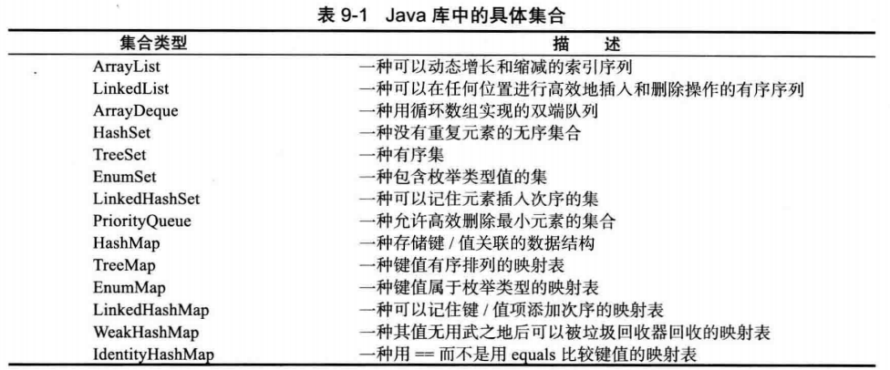

# java集合
## Java集合框架
队列通过链表或循环数组实现，如果需要一个链表队列，就直接使用`LinkedList`类，这个类实现了`Queue`接口。循环数组比链表更高效，但是循环数组是一个有界集合，容量有限。
### Collection接口
在Java类库中，集合类的基本接口是`Collection`接口。这个接口的基本方法有两个：
```java
public interface Collection<E>
{
   boolean add(E element);
   Iterator<E> iterator();
   ...
}
```
add方法用于向集合中添加元素。如果添加元素确实改变了集合返回ture，如果集合没有发生变化就返回false。  
iterator方法用于返回一个实现了Iterator接口的对象。也叫做迭代器，可以用来依次访问集合中的元素。    
可以调用`forEachRemaining`方法并提供一个lambda表达式(它会处理一个元素)。将对迭代器的每一个元素调用这个lambda表达式，知道没有元素为止。  
```java
intertor.forEachRemaining(element -> do something with element);
```
事实上，Collection接口声明了很多方法，下面举例：
```java
int size(); //返回当前存储在集合中的元素个数
boolean isEmpty(); 
boolean contains(Object obj); //如果集合中包含了一个与obj相等的对象，返回true
boolean containsAll(Collection<?> c); //集合包含其它集合的所有元素，返回ture
boolean equals(Obejct other); 
boolean addAll(Collection<? extends E> from);//将其它集合元素全部添加
boolean remove(Object obj); 
boolean removeAll(Collection<?> c);
void clear(); //删除集合中所有元素
boolean retainAll(Collection<?> c); //从这个集合中删除与其它集合中的元素不同的元素
Object[] toArray(); //返回这个元素的对象数组
<T> T[] toArray(T[] arrayToFill);
```
### 集合框架中的接口
java集合框架为不同类型定义了大量接口，基本接口有两个`Collection`和`Map`。
* Map映射访问元素`V get(K key)`
* Map映射添加元素`V put(K key, V value)`  

## 具体的集合

### 链表
链表是一个有序集合，每个对象的位置十分重要。
```java
ListIterator<E> listIterator(); //返回一个列表迭代器，以便用来访问列表中的元素
void add(int i, E element); //在给定位置添加一个元素
void addAll(int i, Collection<? extends E> elements);
E remove(int i);
E get(int i);
R set(int i, E element); //用新元素取代给定位置的元素，并返回原来那个元素
int indexOf(Object element);//返回与指定元素相等的元素在列表中第一次出现的位置，没有将返回-1
int lastIndexOf(Object element);//返回与指定元素相等的元素在列表中最后一次出现的位置，如果没有这样的元素将返回-1
```
### 数组
适用于随机访问某个元素
* 需要同步`Vector`类
* 不需要同步`ArrayList`类

### 散列集
链表和数组可以按照人们的意愿排列元素的次序。但是，如果想要査看某个指定的元素， 却又忘记了它的位置，就需要访问所有元素， 直到找到为止。    
散列表可以快速查找所需要的对象，散列表为每个对象计算一个整数，称为散列码。散列码由`String`类的`hashCode`方法产生。  

在java中散列表用链表数组实现。每个列表被称为桶(bucket)。要想查找表中对象的位置，要先计算其散列码，然后与桶的综述取余数。所得到的结果就是保存这个元素的桶的索引。    

散列表可以用于实现几个重要的数据结构。 其中最简单的是 set 类型。set 是没有重复元素的元素集合。set 的 add方法首先在集中查找要添加的对象，如果不存在，就将这个对象添 加进去。  

Java 集合类库提供了一个 HashSet 类，它实现了基于散列表的集。可以用 add 方法添加 元素。contains方法已经被重新定义，用来快速地查看是否某个元素已经出现在集中。它只在某个桶中査找元素，而不必查看集合中的所有元素。

散列集迭代器将依次访问所有的桶。 由于散列将元素分散在表的各个位置上，所以访问 它们的顺序几乎是随机的。只有不关心集合中元素的顺序时才应该使用 HashSet。   
```java
HashSet();
HashSet(Collection<? extends E> elements);//构造一个散列集，并将集合内的元素添加进去
HashSet(int initialCapacity, float loadFactor);//构造一个具有指定容量和装填因子(一个0-1之间的数值，确定散列表填充的百分比)
int hashCode();//返回对象的散列码。散列码可以是任何整数，包括正数或负数。 
```
### 树集
`TreeSet`类与散列集十分类似。树集是一个有序集合。可以以任意顺序将元素插入到集合中。
### 队列与双端队列
队列可以让人们有效地在尾部添加一个元素， 在头部删除一个元素。有两个端头的队列， 即双端队列，可以让人们有效地在头部和尾部同时添加或删除元素。不支持在队列中间添加元素。
```java
//java.util.Queue<E>
boolean add(E element);
boolean offer(E element);
E remove();//如果队列没有满，将给定元素添加到队列的尾部并返回true
E poll();//返回头部元素并删除
E element();
E peek();//返回头部元素但不删除
//java.util.Deque<E>
boolean addFirst(E element);
boolean addLast(E element);
boolean offerFirst(E element);
boolean offerLast(E element);
E removeFirst();//如果队列没有满，将给定元素添加到队列的尾部并返回true
E removeLast();
E pollFirst();//返回头部元素并删除
E pollLast()
E element();
E peekFirst();//返回头部元素但不删除
E peekLast();
```
###  优先级队列
优先级队列（priority queue) 中的元素可以按照任意的顺序插人，却总是按照排序的顺序进行检索。。也就是说，无论何时调用 remove 方法，总会获得当前优先级队列中最小的元素。 然而，优先级队列并没有对所有的元素进行排序。如果用迭代的方式处理这些元素，并不需要对它们进行排序。   

优先级队列使用了一个优雅且高效的数据结构，称为堆（heap)。堆是一个可以自我调整的二叉树，对树执行添加（ add) 和删除（remore) 操作， 可以让最小的元素移动到根，而不必花费时间对元素进行排序。

使用优先级队列的典型示例是任务调度。每一个任务有一个优先级，任务以随机顺序添 加到队列中。每当启动一个新的任务时，都将优先级最高的任务从队列中删除（由于习惯上将 1 设为“ 最高” 优先级，所以会将最小的元素删除)

```java
PriorityQueue(int initialCapacity, Comparator<? super E> c);
//构造一个优先级队列，并用指定的比较器对元素进行比较排序。
```

## 映射
### 基本概念
映射用来存放键/值对。如果提供了键，就能够查找到值。   

Java 类库为映射提供了两个通用的实现：HashMap 和 TreeMap。这两个类都实现了 Map 接口。 散列映射对键进行散列， 树映射用键的整体顺序对元素进行排序， 并将其组织成搜索 树。散列或比较函数只能作用于键。与键关联的值不能进行散列或比较。

### 映射视图
可以枚举一个映射中所有的键值
```java
Set<String> keys = map.keySet();
for (String key:keys)
{
	do somethin with key;
}
```
如果想同时查看键和值，可以通过枚举条目来避免查找值。使用以下代码：
```java
for(Map.Entry<String, Employee> entry:staff.entrySet())
{
	String k = entry.getKey();
	Employee v = entry.getValue();
	do somethin with k,v;
}
//原先这是访问所有映射条目的最高效的方法。如今，只需要使用 forEach 方法
counts.forEach(k,v) ->
{
	do something with k,v;
}
```
## 视图与包装器
### 轻量级集合包装器
Arrays 类的静态方法 asList 将返回一个包装了普通 Java 数组的 List 包装器。这个方法可 以将数组传递给一个期望得到列表或集合参数的方法。  返回的对象不是 ArrayList。它是一个视图对象， 带有访问底层数组的 get 和 set 方 法。
### 子范围
可以为很多集合建立子范围（subrange ) 视图。例如，假设有一个列表staff, 想从中取出第 10 个- 第19个元素。可以使用 subList 方法来获得一个列表的子范围视图。
```java
List group = staff.subList(10,20);
```

## 要点
### List,Set与Map的区别
* `List`(对付顺序的好帮手)：存储的元素是有序的、可重复的。
* `Set`(注重独一无二的性质)：存储的元素是无序的、不可重复的。
* `Map`(用key来搜索的专家)：使用键值对(key-value)存储，类似于数字上的函数`y=f(x)`, key是无序的、不可重复的，value是无序的、可重复的，每个键最多映射到一个值。    

### 集合框架底层数据结构总结
先来看一下`Collection`接口下面的集合
#### List
* `ArrayList`: `Object[]`数组
* `Vector`: `Object[]` 数组
* `LinkedList`: 双向链表

#### Set
*  `HashSet`（无序，唯一）：基于`HashMap`实现的，底层采用`HashMap`来保存元素
*  `LinkedHashSet`：`LinkedHashSet`是`HashSet`的子类，并且其内部是通过`HashMap`来实现的。
*  `TreeSet`（有序、唯一）：红黑树（自平衡的排序二叉树）

#### Map
* `HashMap`:由数组+链表组成，数组是HashMap的主体，链表则是主要为了解决哈希冲突而存在的(“拉链法”解决冲突)。
* `LinkedHashMap`:继承自`HashMap`，所以底层仍然是基于拉链式散列结构即由数组和链表或红黑树组成。
* `Hashtable`：数组+链表组成，数组是Hash的主体，链表则是主要为了解决哈希冲突而存在的。
* `TreeMap`：红黑树（自平衡的排序二叉树）


