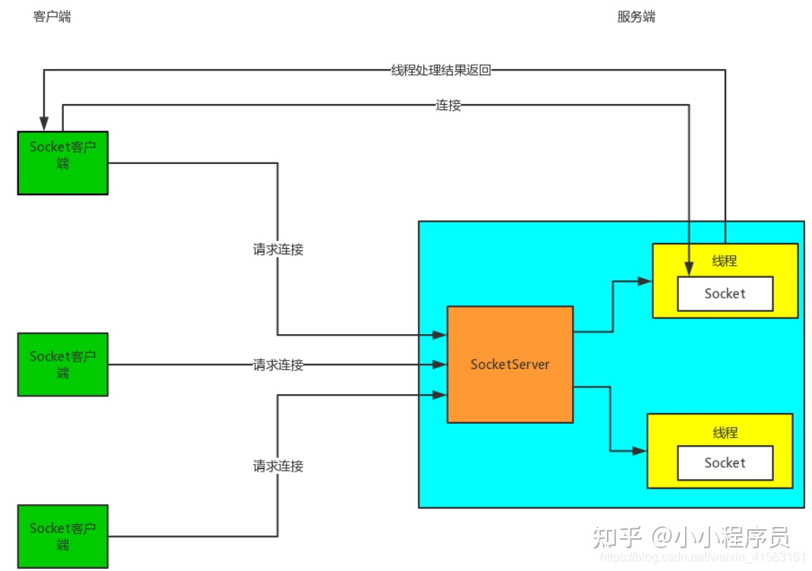
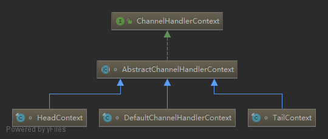

# Netty


## 各种IO
### BIO、NIO、AIO区别
#### BIO
传统的网络通讯模型，就是BIO，同步阻塞IO， 其实就是服务端创建一个ServerSocket， 然后就是客户端用一个Socket去连接服务端的那个ServerSocket， ServerSocket接收到了一个的连接请求就创建一个Socket和一个线程去跟那个Socket进行通讯。**接着客户端和服务端就进行阻塞式的通信**，客户端发送一个请求，服务端Socket进行处理后返回响应，在响应返回前，客户端那边就阻塞等待，什么事情也做不了。 这种方式的缺点， 每次一个客户端接入，都需要在服务端创建一个线程来服务这个客户端，这样大量客户端来的时候，就会造成服务端的线程数量可能达到了几千甚至几万，这样就可能会造成服务端过载过高，最后崩溃死掉。


#### NIO
NIO: NIO是一种同步非阻塞IO, 基于Reactor模型来实现的。其实相当于就是一个线程处理大量的客户端的请求，通过一个线程轮询大量的channel，每次就获取一批有事件的channel，然后对每个请求启动一个线程处理即可。这里的核心就是非阻塞，就那个selector一个线程就可以不停轮询channel，所有客户端请求都不会阻塞，直接就会进来，大不了就是等待一下排着队而已。这里面优化BIO的核心就是，一个客户端并不是时时刻刻都有数据进行交互，没有必要死耗着一个线程不放，所以客户端选择了让线程歇一歇，只有客户端有相应的操作的时候才发起通知，创建一个线程来处理请求。


#### AIO
AIO：异步非阻塞IO，基于Proactor模型实现。 每个连接发送过来的请求，都会绑定一个Buffer，然后通知操作系统去完成异步的读，这个时间你就可以去做其他的事情，等到操作系统完成读之后，就会调用你的接口，给你操作系统异步读完的数据。这个时候你就可以拿到数据进行处理，将数据往回写，在往回写的过程，同样是给操作系统一个Buffer，让操作系统去完成写，写完了来通知你。这两个过程都有buffer存在，数据都是通过buffer来完成读写。

这里面的主要的区别在于将数据写入的缓冲区后，就不去管它，剩下的去交给操作系统去完成。操作系统写回数据也是一样，写到Buffer里面，写完后通知客户端来进行读取数据。


### 同步、异步、阻塞、非阻塞
#### 同步
对于同步型的调用，应用层需要自己去向系统内核问询，如果数据还未读取完毕，那此时读取文件的任务还未完成，应用层根据其阻塞和非阻塞的划分，或挂起或去做其他事情（所以同步和异步并不决定其等待数据返回时的状态）；如果数据已经读取完毕，那此时系统内核将数据返回给应用层，应用层即可以用取得的数据做其他相关的事情。

#### 异步
而对于异步型的调用，应用层无需主动向系统内核问询，在系统内核读取完文件数据之后，会主动通知应用层数据已经读取完毕，此时应用层即可以接收系统内核返回过来的数据，再做其他事情。

对于通知调用者的三种方式，具体如下：

-   状态
即监听被调用者的状态（轮询），调用者需要每隔一定时间检查一次，效率会很低。

-   通知
当被调用者执行完成后，发出通知告知调用者，无需消耗太多性能。

-   回调
与通知类似，当被调用者执行完成后，会调用调用者提供的回调函数。

例如：B/S模式中的ajax请求，具体过程是：客户端发出ajax请求->服务端处理->处理完毕执行客户端回调，在客户端（浏览器）发出请求后，仍然可以做其他的事。

#### 同步与异步的区别
是否是同步还是异步，关注的是任务完成时消息通知的方式。由调用方盲目主动问询的方式是同步调用，由被调用方主动通知调用方任务已完成的方式是异步调用。


#### 阻塞
如果应用层调用的是阻塞型I/O，那么在调用之后，应用层即刻被挂起，一直出于等待数据返回的状态，直到系统内核从磁盘读取完数据并返回给应用层，应用层才用获得的数据进行接下来的其他操作。

#### 非阻塞
如果应用层调用的是非阻塞I/O，那么调用后，系统内核会立即返回（虽然还没有文件内容的数据），应用层并不会被挂起，它可以做其他任意它想做的操作。（至于文件内容数据如何返回给应用层，这已经超出了阻塞和非阻塞的辨别范畴。）

#### 阻塞与非阻塞的区别
是否是阻塞还是非阻塞，关注的是接口调用（发出请求）后等待数据返回时的状态。被挂起无法执行其他操作的则是阻塞型的，可以被立即「抽离」去完成其他「任务」的则是非阻塞型的。


## NIO从入门到踹门
**java.nio**全称**java non-blocking IO**，是指**JDK1.4 及以上**版本里提供的新api（New IO） ，为所有的原始类型（boolean类型除外）提供**缓存支持的数据容器**，使用它可以提供**非阻塞式**的高伸缩性网络。

NIO相较于BIO：
BIO在高并发的情况下，会创建很多线程，线程会占用内存，线程之间的切换也会浪费资源开销，而NIO**只有在连接/通道真正有读写事件**发生时(**事件驱动**)，**才会进行读写**，就大大地减少了系统的开销。不必为每一个连接都创建一个线程，也不必去维护多个线程，**避免了多个线程之间的上下文切换**。

### NIO三大核心
|NIO的核心|对应的类或接口|应用|作用|
|----|----|----|----|
|缓冲区|Buffer|文件IO/网络IO|存储数据|
|通道|Channel|文件IO/网络IO|运输|
|选择器|Selector|网络IO|控制器|

#### 缓冲区


`Buffer`是一个内存块。在`NIO`中，所有的数据都是用`Buffer`处理，有读写两种模式。所以NIO和传统的IO的区别就体现在这里。传统IO是面向`Stream`流，`NIO`而是面向缓冲区(`Buffer`)。

一般我们常用的类型是`ByteBuffer`，把数据转成字节进行处理。实质上是一个`byte[]`数组。
```java
public abstract class ByteBuffer extends Buffer implements Comparable<ByteBuffer>{  
	//存储数据的数组  
	final byte[] hb;  
	//构造器方法  
	ByteBuffer(int mark, int pos, int lim, int cap, byte[] hb, int offset) {
		super(mark, pos, lim, cap);  
		//初始化数组  
		this.hb = hb;  
		this.offset = offset;  
	}  
}
```

创建Buffer的方式：JVM堆内内存块Buffer、堆外内存块Buffer。
1. 创建堆内内存块(非直接缓冲区)的方法是：
```java
//创建堆内内存块HeapByteBuffer
ByteBuffer byteBuffer1 = ByteBuffer.allocate(1024);

String msg = "java技术爱好者";
//包装一个byte[]数组获得一个Buffer，实际类型是HeapByteBuffer
ByteBuffer byteBuffer2 = ByteBuffer.wrap(msg.getBytes());
```
2. 创建堆外内存块(直接缓冲区)的方法
```java
//创建堆外内存块DirectByteBuffer  
ByteBuffer byteBuffer3 = ByteBuffer.allocateDirect(1024);
```

`HeapByteBuffer`所创建的字节缓冲区就是在JVM堆中的，即JVM内部所维护的字节数组。而`DirectByteBuffer`是**直接操作操作系统本地代码**创建的**内存缓冲数组**。

`DirectByteBuffer`的使用场景：
1.  java程序与本地磁盘、socket传输数据
2.  大文件对象，可以使用。不会受到堆内存大小的限制。
3.  不需要频繁创建，生命周期较长的情况，能重复使用的情况。
    

`HeapByteBuffer`的使用场景：
除了以上的场景外，其他情况还是建议使用`HeapByteBuffer`，没有达到一定的量级，实际上使用`DirectByteBuffer`是体现不出优势的。

ByteBuffer的例子：
```java
public static void main(String[] args) throws Exception {
        String msg = "java技术爱好者，起飞！";
        //创建一个固定大小的buffer(返回的是HeapByteBuffer)
        ByteBuffer byteBuffer = ByteBuffer.allocate(1024);
        byte[] bytes = msg.getBytes();
        //写入数据到Buffer中
        byteBuffer.put(bytes);
        //切换成读模式，关键一步
        byteBuffer.flip();
        //创建一个临时数组，用于存储获取到的数据
        byte[] tempByte = new byte[bytes.length];
        int i = 0;
        //如果还有数据，就循环。循环判断条件
        while (byteBuffer.hasRemaining()) {
            //获取byteBuffer中的数据
            byte b = byteBuffer.get();
            //放到临时数组中
            tempByte[i] = b;
            i++;
        }
        //打印结果
        System.out.println(new String(tempByte));//java技术爱好者，起飞！
    }
```
上面有一个`flip()`方法是很重要的。意思是切换到读模式。**缓存区是双向的**，**既可以往缓冲区写入数据，也可以从缓冲区读取数据**。但是不能同时进行，需要切换。

#### 管道


* FileChannel，读写文件中的数据。  
* SocketChannel，通过TCP读写网络中的数据。  
* ServerSockectChannel，监听新进来的TCP连接，像Web服务器那样。对每一个新进来的连接都会创建一个SocketChannel。  
* DatagramChannel，通过UDP读写网络中的数据。
**Channel本身并不存储数据，只是负责数据的运输**。必须要和`Buffer`一起使用

FileChannel
FileChannel的获取方式，下面举个文件复制拷贝的例子进行说明：
```java
public static void main(String[] args) throws Exception{
	//获取文件输入流
	File file = new File("1.txt");
	FileInputStream inputStream = new FileInputStream(file);  
	//从文件输入流获取通道  
	FileChannel inputStreamChannel = inputStream.getChannel();  
	//获取文件输出流  
	FileOutputStream outputStream = new FileOutputStream(new File("2.txt"));  
	//从文件输出流获取通道  
	FileChannel outputStreamChannel = outputStream.getChannel();  
	//创建一个byteBuffer，小文件所以就直接一次读取，不分多次循环了  
	ByteBuffer byteBuffer = ByteBuffer.allocate((int)file.length());  
	//把输入流通道的数据读取到缓冲区  
	inputStreamChannel.read(byteBuffer);  
	//切换成读模式  
	byteBuffer.flip();  
	//把数据从缓冲区写入到输出流通道  
	outputStreamChannel.write(byteBuffer);  
	//关闭通道  
	outputStream.close();  
	inputStream.close();  
	outputStreamChannel.close();  
	inputStreamChannel.close();
}
```


SocketChannel
通过一个例子来快速上手：
```java
public static void main(String[] args) throws Exception {
        //获取ServerSocketChannel
        ServerSocketChannel serverSocketChannel = ServerSocketChannel.open();
        InetSocketAddress address = new InetSocketAddress("127.0.0.1", 6666);
        //绑定地址，端口号
        serverSocketChannel.bind(address);
        //创建一个缓冲区
        ByteBuffer byteBuffer = ByteBuffer.allocate(1024);
        while (true) {
            //获取SocketChannel
            SocketChannel socketChannel = serverSocketChannel.accept();
            while (socketChannel.read(byteBuffer) != -1){
                //打印结果
                System.out.println(new String(byteBuffer.array()));
                //清空缓冲区
                byteBuffer.clear();
            }
        }
    }
```
通过上面的例子可以知道，通过`ServerSocketChannel.open()`方法可以获取服务器的通道，然后绑定一个地址端口号，接着`accept()`方法可获得一个`SocketChannel`通道，也就是客户端的连接通道。
最后配合使用`Buffer`进行读写即可。

#### 选择器
`Selector`翻译成**选择器**，有些人也会翻译成**多路复用器**，实际上指的是同一样东西。只有网络IO才会使用选择器，文件IO是不需要使用的。

选择器可以说是NIO的核心组件，它可以监听通道的状态，来实现异步非阻塞的IO。换句话说，也就是事件驱动。以此实现**单线程管理多个Channel**的目的。

核心API
|API方法名|作用|
|----|----|
|Selector.open()|打开一个选择器|
|select()|选择一组键，其相应的通道已为I/O操作准备就绪|
|selectedKeys|返回此选择器的已选择键集|

### NIO快速入门
`transferTo()`：把源通道的数据传输到目的通道中。
```java
public static void main(String[] args) throws Exception {
        //获取文件输入流
        File file = new File("1.txt");
        FileInputStream inputStream = new FileInputStream(file);
        //从文件输入流获取通道
        FileChannel inputStreamChannel = inputStream.getChannel();
        //获取文件输出流
        FileOutputStream outputStream = new FileOutputStream(new File("2.txt"));
        //从文件输出流获取通道
        FileChannel outputStreamChannel = outputStream.getChannel();
        //创建一个byteBuffer，小文件所以就直接一次读取，不分多次循环了
        ByteBuffer byteBuffer = ByteBuffer.allocate((int) file.length());
        //把输入流通道的数据读取到输出流的通道
        inputStreamChannel.transferTo(0, byteBuffer.limit(), outputStreamChannel);
        //关闭通道
        outputStream.close();
        inputStream.close();
        outputStreamChannel.close();
        inputStreamChannel.close();
    }    

```
`transferFrom()`：把来自源通道的数据传输到目的通道。
```java
public static void main(String[] args) throws Exception {
        //获取文件输入流
        File file = new File("1.txt");
        FileInputStream inputStream = new FileInputStream(file);
        //从文件输入流获取通道
        FileChannel inputStreamChannel = inputStream.getChannel();
        //获取文件输出流
        FileOutputStream outputStream = new FileOutputStream(new File("2.txt"));
        //从文件输出流获取通道
        FileChannel outputStreamChannel = outputStream.getChannel();
        //创建一个byteBuffer，小文件所以就直接一次读取，不分多次循环了
        ByteBuffer byteBuffer = ByteBuffer.allocate((int) file.length());
        //把输入流通道的数据读取到输出流的通道
        outputStreamChannel.transferFrom(inputStreamChannel,0,byteBuffer.limit());
        //关闭通道
        outputStream.close();
        inputStream.close();
        outputStreamChannel.close();
        inputStreamChannel.close();
    }

```

#### 分散读取和聚合写入
```java
public abstract class FileChannel extends AbstractInterruptibleChannel  
    implements SeekableByteChannel, GatheringByteChannel, ScatteringByteChannel {   
}
```
GatheringByteChannel和ScatteringByteChannel就是支持分散读取和聚合写入的操作。
写一个main方法来实现复制1.txt文件，文件内容是`abcdefghijklmnopqrstuvwxyz//26个字母`
```java
public static void main(String[] args) throws Exception {
        //获取文件输入流
        File file = new File("1.txt");
        FileInputStream inputStream = new FileInputStream(file);
        //从文件输入流获取通道
        FileChannel inputStreamChannel = inputStream.getChannel();
        //获取文件输出流
        FileOutputStream outputStream = new FileOutputStream(new File("2.txt"));
        //从文件输出流获取通道
        FileChannel outputStreamChannel = outputStream.getChannel();
        //创建三个缓冲区，分别都是5
        ByteBuffer byteBuffer1 = ByteBuffer.allocate(5);
        ByteBuffer byteBuffer2 = ByteBuffer.allocate(5);
        ByteBuffer byteBuffer3 = ByteBuffer.allocate(5);
        //创建一个缓冲区数组
        ByteBuffer[] buffers = new ByteBuffer[]{byteBuffer1, byteBuffer2, byteBuffer3};
        //循环写入到buffers缓冲区数组中，分散读取
        long read;
        long sumLength = 0;
        while ((read = inputStreamChannel.read(buffers)) != -1) {
            sumLength += read;
            Arrays.stream(buffers)
                    .map(buffer -> "posstion=" + buffer.position() + ",limit=" + buffer.limit())
                    .forEach(System.out::println);
            //切换模式
            Arrays.stream(buffers).forEach(Buffer::flip);
            //聚合写入到文件输出通道
            outputStreamChannel.write(buffers);
            //清空缓冲区
            Arrays.stream(buffers).forEach(Buffer::clear);
        }
        System.out.println("总长度:" + sumLength);
        //关闭通道
        outputStream.close();
        inputStream.close();
        outputStreamChannel.close();
        inputStreamChannel.close();
    }
```
可以看到循环了两次。第一次循环时，三个缓冲区都读取了5个字节，总共读取了15，也就是读满了。还剩下11个字节，于是第二次循环时，前两个缓冲区分配了5个字节，最后一个缓冲区给他分配了1个字节，刚好读完。总共就是26个字节。

使用场景就是可以**使用一个缓冲区数组，自动地根据需要去分配缓冲区的大小。可以减少内存消耗**。网络IO也可以使用，

#### 非直接/直接缓冲区
非直接缓冲区的创建方式：`static ByteBuffer allocate(int capacity)`
直接缓冲区的创建方式：`static ByteBuffer allocateDirect(int capacity)`


最大的不同在于直接缓冲区不需要再把文件内容copy到物理内存中。这就大大地提高了性能。其实在介绍Buffer时，我们就有接触到这个概念。直接缓冲区是堆外内存，在本地文件IO效率会更高一点。

接下来我们来对比一下效率，以一个136 MB的视频文件为例：
```java
public static void main(String[] args) throws Exception {
    long starTime = System.currentTimeMillis();
    //获取文件输入流
    File file = new File("D:\\小电影.mp4");//文件大小136 MB
    FileInputStream inputStream = new FileInputStream(file);
    //从文件输入流获取通道
    FileChannel inputStreamChannel = inputStream.getChannel();
    //获取文件输出流
    FileOutputStream outputStream = new FileOutputStream(new File("D:\\test.mp4"));
    //从文件输出流获取通道
    FileChannel outputStreamChannel = outputStream.getChannel();
    //创建一个直接缓冲区
    ByteBuffer byteBuffer = ByteBuffer.allocateDirect(5 * 1024 * 1024);
    //创建一个非直接缓冲区
    //ByteBuffer byteBuffer = ByteBuffer.allocate(5 * 1024 * 1024);
    //写入到缓冲区
    while (inputStreamChannel.read(byteBuffer) != -1) {
        //切换读模式
        byteBuffer.flip();
        outputStreamChannel.write(byteBuffer);
        byteBuffer.clear();
    }
    //关闭通道
    outputStream.close();
    inputStream.close();
    outputStreamChannel.close();
    inputStreamChannel.close();
    long endTime = System.currentTimeMillis();
    System.out.println("消耗时间：" + (endTime - starTime) + "毫秒");
}
```

### 网络IO
#### 举例
NIO的主要用途是网络IO，在NIO之前java要使用网络编程就只有用`Socket`。而`Socket`是阻塞的，显然对于高并发的场景是不适用的。所以NIO的出现就是解决了这个痛点。

主要思想是把Channel通道注册到Selector中，通过Selector去监听Channel中的事件状态，这样就不需要阻塞等待客户端的连接，从主动等待客户端的连接，变成了通过事件驱动。没有监听的事件，服务器可以做自己的事情。

我们来做一个服务器接受客户端消息的例子：
首先服务端代码
```java
public class NIOServer {
    public static void main(String[] args) throws Exception {
        //打开一个ServerSocketChannel
        ServerSocketChannel serverSocketChannel = ServerSocketChannel.open();
        InetSocketAddress address = new InetSocketAddress("127.0.0.1", 6666);
        //绑定地址
        serverSocketChannel.bind(address);
        //设置为非阻塞
        serverSocketChannel.configureBlocking(false);
        //打开一个选择器
        Selector selector = Selector.open();
        //serverSocketChannel注册到选择器中,监听连接事件
        serverSocketChannel.register(selector, SelectionKey.OP_ACCEPT);
        //循环等待客户端的连接
        while (true) {
            //等待3秒，（返回0相当于没有事件）如果没有事件，则跳过
            if (selector.select(3000) == 0) {
                System.out.println("服务器等待3秒，没有连接");
                continue;
            }
            //如果有事件selector.select(3000)>0的情况,获取事件
            Set<SelectionKey> selectionKeys = selector.selectedKeys();
            //获取迭代器遍历
            Iterator<SelectionKey> it = selectionKeys.iterator();
            while (it.hasNext()) {
                //获取到事件
                SelectionKey selectionKey = it.next();
                //判断如果是连接事件
                if (selectionKey.isAcceptable()) {
                    //服务器与客户端建立连接，获取socketChannel
                    SocketChannel socketChannel = serverSocketChannel.accept();
                    //设置成非阻塞
                    socketChannel.configureBlocking(false);
                    //把socketChannel注册到selector中，监听读事件，并绑定一个缓冲区
                    socketChannel.register(selector, SelectionKey.OP_READ, ByteBuffer.allocate(1024));
                }
                //如果是读事件
                if (selectionKey.isReadable()) {
                    //获取通道
                    SocketChannel socketChannel = (SocketChannel) selectionKey.channel();
                    //获取关联的ByteBuffer
                    ByteBuffer buffer = (ByteBuffer) selectionKey.attachment();
                    //打印从客户端获取到的数据
                    socketChannel.read(buffer);
                    System.out.println("from 客户端：" + new String(buffer.array()));
                }
                //从事件集合中删除已处理的事件，防止重复处理
                it.remove();
            }
        }
    }
}
```
客户端代码：
```java
public class NIOClient {
    public static void main(String[] args) throws Exception {
        SocketChannel socketChannel = SocketChannel.open();
        InetSocketAddress address = new InetSocketAddress("127.0.0.1", 6666);
        socketChannel.configureBlocking(false);
        //连接服务器
        boolean connect = socketChannel.connect(address);
        //判断是否连接成功
        if(!connect){
            //等待连接的过程中
            while (!socketChannel.finishConnect()){
                System.out.println("连接服务器需要时间，期间可以做其他事情...");
            }
        }
        String msg = "hello java技术爱好者！";
        ByteBuffer byteBuffer = ByteBuffer.wrap(msg.getBytes());
        //把byteBuffer数据写入到通道中
        socketChannel.write(byteBuffer);
        //让程序卡在这个位置，不关闭连接
        System.in.read();
    }
}
```

接下来启动服务端，然后再启动客户端，我们可以看到控制台打印以下信息：
```java
服务器等待3秒，没有连接  
服务器等待3秒，没有连接  
from 客户端：hello java技术爱好者！   
服务器等待3秒，没有连接  
服务器等待3秒，没有连接
```

#### SelectionKey
在`SelectionKey`类中有四个常量表示四种事件，来看源码：
```java
public abstract class SelectionKey {
    //读事件
    public static final int OP_READ = 1 << 0; //2^0=1
    //写事件
    public static final int OP_WRITE = 1 << 2; // 2^2=4
    //连接操作,Client端支持的一种操作
    public static final int OP_CONNECT = 1 << 3; // 2^3=8
    //连接可接受操作,仅ServerSocketChannel支持
    public static final int OP_ACCEPT = 1 << 4; // 2^4=16
}
```
附加的对象(可选)，把通道注册到选择器中时可以附加一个对象。
```java
public final SelectionKey register(Selector sel, int ops, Object att)
```
从`selectionKey`中获取附件对象可以使用`attachment()`方法
```java
public final Object attachment() {
    return attachment;
}
```

#### 使用NIO实现多人聊天室
服务端代码：
```java
public class GroupChatServer {

    private Selector selector;

    private ServerSocketChannel serverSocketChannel;

    public static final int PORT = 6667;

    //构造器初始化成员变量
    public GroupChatServer() {
        try {
            //打开一个选择器
            this.selector = Selector.open();
            //打开serverSocketChannel
            this.serverSocketChannel = ServerSocketChannel.open();
            //绑定地址，端口号
            this.serverSocketChannel.bind(new InetSocketAddress("127.0.0.1", PORT));
            //设置为非阻塞
            serverSocketChannel.configureBlocking(false);
            //把通道注册到选择器中
            serverSocketChannel.register(selector, SelectionKey.OP_ACCEPT);
        } catch (Exception e) {
            e.printStackTrace();
        }
    }

    /**
     * 监听，并且接受客户端消息，转发到其他客户端
     */
    public void listen() {
        try {
            while (true) {
                //获取监听的事件总数
                int count = selector.select(2000);
                if (count > 0) {
                    Set<SelectionKey> selectionKeys = selector.selectedKeys();
                    //获取SelectionKey集合
                    Iterator<SelectionKey> it = selectionKeys.iterator();
                    while (it.hasNext()) {
                        SelectionKey key = it.next();
                        //如果是获取连接事件
                        if (key.isAcceptable()) {
                            SocketChannel socketChannel = serverSocketChannel.accept();
                            //设置为非阻塞
                            socketChannel.configureBlocking(false);
                            //注册到选择器中
                            socketChannel.register(selector, SelectionKey.OP_READ);
                            System.out.println(socketChannel.getRemoteAddress() + "上线了~");
                        }
                        //如果是读就绪事件
                        if (key.isReadable()) {
                            //读取消息，并且转发到其他客户端
                            readData(key);
                        }
                        it.remove();
                    }
                } else {
                    System.out.println("等待...");
                }
            }
        } catch (Exception e) {
            e.printStackTrace();
        }
    }

    //获取客户端发送过来的消息
    private void readData(SelectionKey selectionKey) {
        SocketChannel socketChannel = null;
        try {
            //从selectionKey中获取channel
            socketChannel = (SocketChannel) selectionKey.channel();
            //创建一个缓冲区
            ByteBuffer byteBuffer = ByteBuffer.allocate(1024);
            //把通道的数据写入到缓冲区
            int count = socketChannel.read(byteBuffer);
            //判断返回的count是否大于0，大于0表示读取到了数据
            if (count > 0) {
                //把缓冲区的byte[]转成字符串
                String msg = new String(byteBuffer.array());
                //输出该消息到控制台
                System.out.println("from 客户端：" + msg);
                //转发到其他客户端
                notifyAllClient(msg, socketChannel);
            }
        } catch (Exception e) {
            try {
                //打印离线的通知
                System.out.println(socketChannel.getRemoteAddress() + "离线了...");
                //取消注册
                selectionKey.cancel();
                //关闭流
                socketChannel.close();
            } catch (IOException e1) {
                e1.printStackTrace();
            }
        }
    }

    /**
     * 转发消息到其他客户端
     * msg 消息
     * noNotifyChannel 不需要通知的Channel
     */
    private void notifyAllClient(String msg, SocketChannel noNotifyChannel) throws Exception {
        System.out.println("服务器转发消息~");
        for (SelectionKey selectionKey : selector.keys()) {
            Channel channel = selectionKey.channel();
            //channel的类型实际类型是SocketChannel，并且排除不需要通知的通道
            if (channel instanceof SocketChannel && channel != noNotifyChannel) {
                //强转成SocketChannel类型
                SocketChannel socketChannel = (SocketChannel) channel;
                //通过消息，包裹获取一个缓冲区
                ByteBuffer byteBuffer = ByteBuffer.wrap(msg.getBytes());
                socketChannel.write(byteBuffer);
            }
        }
    }

    public static void main(String[] args) throws Exception {
        GroupChatServer chatServer = new GroupChatServer();
        //启动服务器，监听
        chatServer.listen();
    }
}
```

客户端代码：
```java
public class GroupChatClinet {

    private Selector selector;

    private SocketChannel socketChannel;

    private String userName;

    public GroupChatClinet() {
        try {
            //打开选择器
            this.selector = Selector.open();
            //连接服务器
            socketChannel = SocketChannel.open(new InetSocketAddress("127.0.0.1", GroupChatServer.PORT));
            //设置为非阻塞
            socketChannel.configureBlocking(false);
            //注册到选择器中
            socketChannel.register(selector, SelectionKey.OP_READ);
            //获取用户名
            userName = socketChannel.getLocalAddress().toString().substring(1);
            System.out.println(userName + " is ok~");
        } catch (Exception e) {
            e.printStackTrace();
        }
    }

    //发送消息到服务端
    private void sendMsg(String msg) {
        msg = userName + "说：" + msg;
        try {
            socketChannel.write(ByteBuffer.wrap(msg.getBytes()));
        } catch (Exception e) {
            e.printStackTrace();
        }
    }

    //读取服务端发送过来的消息
    private void readMsg() {
        try {
            int count = selector.select();
            if (count > 0) {
                Iterator<SelectionKey> iterator = selector.selectedKeys().iterator();
                while (iterator.hasNext()) {
                    SelectionKey selectionKey = iterator.next();
                    //判断是读就绪事件
                    if (selectionKey.isReadable()) {
                        SocketChannel channel = (SocketChannel) selectionKey.channel();
                        //创建一个缓冲区
                        ByteBuffer byteBuffer = ByteBuffer.allocate(1024);
                        //从服务器的通道中读取数据到缓冲区
                        channel.read(byteBuffer);
                        //缓冲区的数据，转成字符串，并打印
                        System.out.println(new String(byteBuffer.array()));
                    }
                    iterator.remove();
                }
            }
        } catch (Exception e) {
            e.printStackTrace();
        }
    }

    public static void main(String[] args) throws Exception {
        GroupChatClinet chatClinet = new GroupChatClinet();
        //启动线程，读取服务器转发过来的消息
        new Thread(() -> {
            while (true) {
                chatClinet.readMsg();
                try {
                    Thread.sleep(3000);
                } catch (Exception e) {
                    e.printStackTrace();
                }
            }
        }).start();
        //主线程发送消息到服务器
        Scanner scanner = new Scanner(System.in);
        while (scanner.hasNextLine()) {
            String msg = scanner.nextLine();
            chatClinet.sendMsg(msg);
        }
    }
}
```

## Netty概述
**Netty**是 一个**异步事件驱动**的网络应用程序框架，用于**快速开发可维护的高性能协议服务器和客户端**。是对nio进一步的封装与优化。

NIO的缺点
-   NIO的类库和API繁杂，学习成本高，你需要熟练掌握Selector、ServerSocketChannel、SocketChannel、ByteBuffer等。
-   需要熟悉Java多线程编程。这是因为NIO编程涉及到Reactor模式，你必须对多线程和网络编程非常熟悉，才能写出高质量的NIO程序。
-   臭名昭著的epoll bug。它会导致Selector空轮询，最终导致CPU 100%。直到JDK1.7版本依然没得到根本性的解决。

Netty的优点
-   API使用简单，学习成本低。
-   功能强大，内置了多种解码编码器，支持多种协议。
-   性能高，对比其他主流的NIO框架，Netty的性能最优。
-   社区活跃，发现BUG会及时修复，迭代版本周期短，不断加入新的功能。
-   Dubbo、Elasticsearch都采用了Netty，质量得到验证。

### 整体架构

1. 绿色的部分**Core**核心模块，包括零拷贝、API库、可扩展的事件模型。

2. 橙色部分**Protocol Support**协议支持，包括Http协议、webSocket、SSL(安全套接字协议)、谷歌Protobuf协议、zlib/gzip压缩与解压缩、Large File Transfer大文件传输等等。  
3. 红色的部分**Transport Services**传输服务，包括Socket、Datagram、Http Tunnel等等。  

### 永远的Hello Word
1. 引入Maven依赖
```xml
<!--使用的版本是4.1.20，相对比较稳定的一个版本。-->  
<dependency> <groupId>io.netty</groupId> <artifactId>netty-all</artifactId> <version>4.1.20.Final</version> </dependency>
```
2. 创建服务端启动类
```java
public class MyServer {
    public static void main(String[] args) throws Exception {
        //创建两个线程组 boosGroup、workerGroup
        EventLoopGroup bossGroup = new NioEventLoopGroup();
        EventLoopGroup workerGroup = new NioEventLoopGroup();
        try {
            //创建服务端的启动对象，设置参数
            ServerBootstrap bootstrap = new ServerBootstrap();
            //设置两个线程组boosGroup和workerGroup
            bootstrap.group(bossGroup, workerGroup)
                //设置服务端通道实现类型    
                .channel(NioServerSocketChannel.class)
                //设置线程队列得到连接个数    
                .option(ChannelOption.SO_BACKLOG, 128)
                //设置保持活动连接状态    
                .childOption(ChannelOption.SO_KEEPALIVE, true)
                //使用匿名内部类的形式初始化通道对象    
                .childHandler(new ChannelInitializer<SocketChannel>() {
                        @Override
                        protected void initChannel(SocketChannel socketChannel) throws Exception {
                            //给pipeline管道设置处理器
                            socketChannel.pipeline().addLast(new MyServerHandler());
                        }
                    });//给workerGroup的EventLoop对应的管道设置处理器
            System.out.println("java技术爱好者的服务端已经准备就绪...");
            //绑定端口号，启动服务端
            ChannelFuture channelFuture = bootstrap.bind(6666).sync();
            //对关闭通道进行监听
            channelFuture.channel().closeFuture().sync();
        } finally {
            bossGroup.shutdownGracefully();
            workerGroup.shutdownGracefully();
        }
    }
}
```
3. 创建服务端处理类
```java
/**
 * 自定义的Handler需要继承Netty规定好的HandlerAdapter
 * 才能被Netty框架所关联，有点类似SpringMVC的适配器模式
 **/
public class MyServerHandler extends ChannelInboundHandlerAdapter {

    @Override  
    public void channelRead(ChannelHandlerContext ctx, Object msg) throws Exception {
		//ChannelHandlerContext表示ChannelHandker与ChannelPipeline之间的关联
        //获取客户端发送过来的消息
        ByteBuf byteBuf = (ByteBuf) msg;
        System.out.println("收到客户端" + ctx.channel().remoteAddress() + "发送的消息：" + byteBuf.toString(CharsetUtil.UTF_8));
    }

    @Override
    public void channelReadComplete(ChannelHandlerContext ctx) throws Exception {
        //发送消息给客户端
        ctx.writeAndFlush(Unpooled.copiedBuffer("服务端已收到消息，并给你发送一个问号?", CharsetUtil.UTF_8));
    }

    @Override
    public void exceptionCaught(ChannelHandlerContext ctx, Throwable cause) throws Exception {
        //发生异常，关闭通道
        ctx.close();
    }
}
```
4. 创建客户端启动类
```java
public class MyClient {

    public static void main(String[] args) throws Exception {
        NioEventLoopGroup eventExecutors = new NioEventLoopGroup();
        try {
            //创建bootstrap对象，配置参数
            Bootstrap bootstrap = new Bootstrap();
            //设置线程组
            bootstrap.group(eventExecutors)
                //设置客户端的通道实现类型    
                .channel(NioSocketChannel.class)
                //使用匿名内部类初始化通道
                .handler(new ChannelInitializer<SocketChannel>() {
                        @Override
                        protected void initChannel(SocketChannel ch) throws Exception {
                            //添加客户端通道的处理器
                            ch.pipeline().addLast(new MyClientHandler());
                        }
                    });
            System.out.println("客户端准备就绪，随时可以起飞~");
            //连接服务端
            ChannelFuture channelFuture = bootstrap.connect("127.0.0.1", 6666).sync();
            //对通道关闭进行监听
            channelFuture.channel().closeFuture().sync();
        } finally {
            //关闭线程组
            eventExecutors.shutdownGracefully();
        }
    }
}
```
5. 创建客户端处理器
```java
public class MyClientHandler extends ChannelInboundHandlerAdapter {

    @Override
    public void channelActive(ChannelHandlerContext ctx) throws Exception {
        //发送消息到服务端
        ctx.writeAndFlush(Unpooled.copiedBuffer("歪比巴卜~茉莉~Are you good~马来西亚~", CharsetUtil.UTF_8));
    }

    @Override
    public void channelRead(ChannelHandlerContext ctx, Object msg) throws Exception {
        //接收服务端发送过来的消息
        ByteBuf byteBuf = (ByteBuf) msg;
        System.out.println("收到服务端" + ctx.channel().remoteAddress() + "的消息：" + byteBuf.toString(CharsetUtil.UTF_8));
    }
}
```
6. 测试
先启动服务端，再启动客户端，就可以看到结果

### Netty的特性与重要组件
#### taskQueue任务队列
如果Handler处理器有一些长时间的业务处理，可以交给**taskQueue异步处理**。怎么用呢，请看代码演示：
```java
public class MyServerHandler extends ChannelInboundHandlerAdapter{
    @Override
    public void channelRead(ChannelHandlerContext ctx, Object msg) throws Exception{
        //获取到线程池eventLoop，添加线程，执行
        ctx.channel().eventLoop().execute(new Runnable() {
            @Override
            public void run() {
                try {
                    //长时间操作，不至于长时间的业务操作导致Handler阻塞
                    Thread.sleep(1000);
                    System.out.println("长时间的业务处理");
                } catch (Exception e) {
                    e.printStackTrace();
                }
            }
        });
    }
}
```
我们打一个debug调试，是可以看到添加进去的taskQueue有一个任务。  

####  scheduleTaskQueue延时任务队列
延时任务队列和上面介绍的任务队列非常相似，只是多了一个可延迟一定时间再执行的设置，请看代码演示：
```java
ctx.channel().eventLoop().schedule(new Runnable() {
    @Override
    public void run() {
        try {
            //长时间操作，不至于长时间的业务操作导致Handler阻塞
            Thread.sleep(1000);
            System.out.println("长时间的业务处理");
        } catch (Exception e) {
            e.printStackTrace();
        }
    }
},5, TimeUnit.SECONDS);//5秒后执行
```

#### Future异步机制
ChannelFuture提供操作完成时一种异步通知的方式。一般在Socket编程中，等待响应结果都是同步阻塞的，而Netty则不会造成阻塞，因为ChannelFuture是采取类似观察者模式的形式进行获取结果。请看一段代码演示：
```java
//添加监听器
channelFuture.addListener(new ChannelFutureListener() {
    //使用匿名内部类，ChannelFutureListener接口
    //重写operationComplete方法
    @Override
    public void operationComplete(ChannelFuture future) throws Exception {
        //判断是否操作成功    
        if (future.isSuccess()) {
            System.out.println("连接成功");
        } else {
            System.out.println("连接失败");
        }
    }
});
```

#### Bootstrap与ServerBootStrap
Bootstrap和ServerBootStrap是Netty提供的一个创建客户端和服务端启动器的工厂类，使用这个工厂类非常便利地创建启动类，根据上面的一些例子，其实也看得出来能大大地减少了开发的难度。首先看一个类图：

一般来说，使用Bootstrap创建启动器的步骤可分为以下几步：


#####  group()
Reactor模式一般翻译成"**反应器模式**"，也有人称为"**分发者模式**"。它是将客户端请求提交到一个或者多个服务处理程序的设计模式。工作原理是由**一个线程来接收所有的请求**，然后**派发这些请求到相关的工作线程中**。所以说服务器端要使用两个线程组：
* bossGroup 用于监听客户端连接，专门负责与客户端创建连接，并把连接注册到workerGroup的Selector中。
* workerGroup用于处理每一个连接发生的读写事件。

创建线程直接使用new：
```java
EventLoopGroup bossGroup = new NioEventLoopGroup();
EventLoopGroup workerGroup = new NioEventLoopGroup();
```

既然是线程组，那线程数默认是多少呢？深入源码：
```java
//使用一个常量保存
    private static final int DEFAULT_EVENT_LOOP_THREADS;

    static {
        //NettyRuntime.availableProcessors() * 2，cpu核数的两倍赋值给常量
        DEFAULT_EVENT_LOOP_THREADS = Math.max(1, SystemPropertyUtil.getInt(
                "io.netty.eventLoopThreads", NettyRuntime.availableProcessors() * 2));

        if (logger.isDebugEnabled()) {
            logger.debug("-Dio.netty.eventLoopThreads: {}", DEFAULT_EVENT_LOOP_THREADS);
        }
    }
    
    protected MultithreadEventLoopGroup(int nThreads, Executor executor, Object... args) {
        //如果不传入，则使用常量的值，也就是cpu核数的两倍
        super(nThreads == 0 ? DEFAULT_EVENT_LOOP_THREADS : nThreads, executor, args);
    }
```

默认的线程数是cpu核数的两倍,假设想自定义线程数，可以使用有参构造器：
```java
//设置bossGroup线程数为1
EventLoopGroup bossGroup = new NioEventLoopGroup(1);
//设置workerGroup线程数为16
EventLoopGroup workerGroup = new NioEventLoopGroup(16);
```

##### channel()
`channel()`这个方法用于设置通道类型，当建立连接后，会根据这个设置创建对应的Channel实例。

通道类型有以下：

**NioSocketChannel**： 异步非阻塞的客户端 TCP Socket 连接。

**NioServerSocketChannel**： 异步非阻塞的服务器端 TCP Socket 连接。

**NioSctpChannel**： 异步的客户端 Sctp（Stream Control Transmission Protocol，流控制传输协议）连接。

**NioSctpServerChannel**： 异步的 Sctp 服务器端连接。

##### option()与childOption()
`option()`设置的是服务端用于接收进来的连接，也就是boosGroup线程。
**SO_BACKLOG** Socket参数，服务端接受连接的队列长度，如果队列已满，客户端连接将被拒绝。默认值，Windows为200，其他为128。


`childOption()`是提供给父管道接收到的连接，也就是workerGroup线程。
SocketChannel参数，也就是childOption()常用的参数：
1. **SO_RCVBUF** Socket参数，TCP数据接收缓冲区大小。  
2. **TCP_NODELAY** TCP参数，立即发送数据，默认值为Ture。   
3. **SO_KEEPALIVE** Socket参数，连接保活，默认值为False。启用该功能时，TCP会主动探测空闲连接的有效性。

##### 设置流水线
ChannelPipeline是Netty处理请求的责任链，ChannelHandler则是具体处理请求的处理器。实际上每一个channel都有一个处理器的流水线。

在Bootstrap中childHandler()方法需要初始化通道，实例化一个ChannelInitializer，这时候需要重写initChannel()初始化通道的方法，装配流水线就是在这个地方进行。代码演示如下：
```java
//使用匿名内部类的形式初始化通道对象
bootstrap.childHandler(new ChannelInitializer<SocketChannel>() {
    @Override
    protected void initChannel(SocketChannel socketChannel) throws Exception {
        //给pipeline管道设置自定义的处理器
        socketChannel.pipeline().addLast(new MyServerHandler());
    }
});
```
处理器Handler主要分为两种：
ChannelInboundHandlerAdapter(入站处理器)、ChannelOutboundHandler(出站处理器)
* 入站指的是数据从底层java NIO Channel到Netty的Channel。
* 出站指的是通过Netty的Channel来操作底层的java NIO Channel。

**ChannelInboundHandlerAdapter处理器常用的事件有**：
1.  注册事件 fireChannelRegistered。
2.  连接建立事件 fireChannelActive。
3.  读事件和读完成事件 fireChannelRead、fireChannelReadComplete。
4.  异常通知事件 fireExceptionCaught。
5.  用户自定义事件 fireUserEventTriggered。
6.  Channel 可写状态变化事件 fireChannelWritabilityChanged。
7.  连接关闭事件 fireChannelInactive。

**ChannelOutboundHandler处理器常用的事件有**：
1.  端口绑定 bind。
2.  连接服务端 connect。
3.  写事件 write。
4.  刷新时间 flush。
5.  读事件 read。
6.  主动断开连接 disconnect。
7.  关闭 channel 事件 close。

##### bind()
提供用于服务端或者客户端绑定服务器地址和端口号，默认是异步启动。如果加上sync()方法则是同步。

##### 优雅地关闭EventLoopGroup
```java
//释放掉所有的资源，包括创建的线程
bossGroup.shutdownGracefully();
workerGroup.shutdownGracefully();
```
会关闭所有的child Channel。关闭之后，释放掉底层的资源。

#### Channel
一种连接到网络套接字或能进行读、写、连接和绑定等I/O操作的组件。
Channel为用户提供：
1.  通道当前的状态（例如它是打开？还是已连接？）
2.  channel的配置参数（例如接收缓冲区的大小）
3.  channel支持的IO操作（例如读、写、连接和绑定），以及处理与channel相关联的所有IO事件和请求的ChannelPipeline。

获取channel的状态
```java
boolean isOpen(); //如果通道打开，则返回true
boolean isRegistered();//如果通道注册到EventLoop，则返回true
boolean isActive();//如果通道处于活动状态并且已连接，则返回true
boolean isWritable();//当且仅当I/O线程将立即执行请求的写入操作时，返回true。
```

获取channel的配置参数
获取单条配置信息，使用getOption()，代码演示：
```java
ChannelConfig config = channel.config();//获取配置参数
//获取ChannelOption.SO_BACKLOG参数,
Integer soBackLogConfig = config.getOption(ChannelOption.SO_BACKLOG);
//因为我启动器配置的是128，所以我这里获取的soBackLogConfig=128
```
获取多条配置信息，使用getOptions()，代码演示：
```java
```text
ChannelConfig config = channel.config();
Map<ChannelOption<?>, Object> options = config.getOptions();
for (Map.Entry<ChannelOption<?>, Object> entry : options.entrySet()) {
    System.out.println(entry.getKey() + " : " + entry.getValue());
}
/**
SO_REUSEADDR : false
WRITE_BUFFER_LOW_WATER_MARK : 32768
WRITE_BUFFER_WATER_MARK : WriteBufferWaterMark(low: 32768, high: 65536)
SO_BACKLOG : 128
以下省略...
*/
```

channel支持的IO操作
1. **写操作**，这里演示从服务端写消息发送到客户端：
```java
@Override
public void channelRead(ChannelHandlerContext ctx, Object msg) throws Exception {
    ctx.channel().writeAndFlush(Unpooled.copiedBuffer("这波啊，这波是肉蛋葱鸡~", CharsetUtil.UTF_8));
}
```
客户端控制台：
```bash
收到服务端/127.0.0.1:6666的消息：这波啊，这波是肉蛋葱鸡~
```

2. **连接**操作，代码演示：
```java
ChannelFuture connect = channelFuture.channel().connect(new InetSocketAddress("127.0.0.1", 6666));//一般使用启动器，这种方式不常用
```

3. **通过channel获取ChannelPipeline**，并做相关的处理：
```java
//获取ChannelPipeline对象
ChannelPipeline pipeline = ctx.channel().pipeline();
//往pipeline中添加ChannelHandler处理器，装配流水线
pipeline.addLast(new MyServerHandler());
```

#### Selector
在NioEventLoop中，有一个成员变量selector，这是nio包的Selector

Netty中的Selector也和NIO的Selector是一样的，就是用于监听事件，管理注册到Selector中的channel，实现多路复用器。

#### PiPeline与ChannelPipeline
在前面介绍Channel时，我们知道可以在channel中装配ChannelHandler流水线处理器，那一个channel不可能只有一个channelHandler处理器，肯定是有很多的，既然是很多channelHandler在一个流水线工作，肯定是有顺序的。

于是pipeline就出现了，pipeline相当于处理器的容器。初始化channel时，把channelHandler按顺序装在pipeline中，就可以实现按序执行channelHandler了。

在一个Channel中，只有一个ChannelPipeline。该pipeline在Channel被创建的时候创建。ChannelPipeline包含了一个ChannelHander形成的列表，且所有ChannelHandler都会注册到ChannelPipeline中。


#### ChannelHandlerContext
在Netty中，Handler处理器是有我们定义的，上面讲过通过集成入站处理器或者出站处理器实现。这时如果我们想在Handler中获取pipeline对象，或者channel对象，怎么获取呢。

于是Netty设计了这个ChannelHandlerContext上下文对象，就可以拿到channel、pipeline等对象，就可以进行读写等操作。



通过类图，ChannelHandlerContext是一个接口，下面有三个实现类。实际上ChannelHandlerContext在pipeline中是一个链表的形式。看一段源码就明白了：
```java
//ChannelPipeline实现类DefaultChannelPipeline的构造器方法
protected DefaultChannelPipeline(Channel channel) {
    this.channel = ObjectUtil.checkNotNull(channel, "channel");
    succeededFuture = new SucceededChannelFuture(channel, null);
    voidPromise =  new VoidChannelPromise(channel, true);
    //设置头结点head，尾结点tail
    tail = new TailContext(this);
    head = new HeadContext(this);
    
    head.next = tail;
    tail.prev = head;
}
```


#### EventLoopGroup
每个EventLoopGroup里包括一个或多个EventLoop，每个EventLoop中维护一个Selector实例

##### 轮询机制实现原理
不妨看一段DefaultEventExecutorChooserFactory的源码：
```java
private final AtomicInteger idx = new AtomicInteger();
private final EventExecutor[] executors;

@Override
public EventExecutor next() {
    //idx.getAndIncrement()相当于idx++，然后对任务长度取模
    return executors[idx.getAndIncrement() & executors.length - 1];
}
```