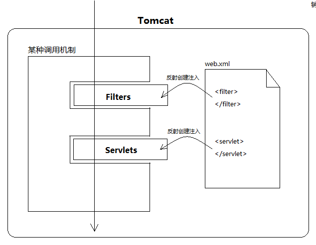
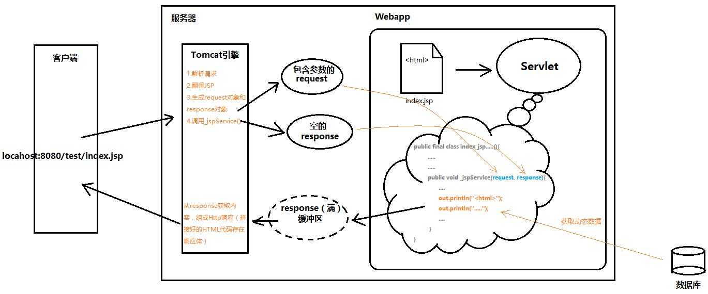

# Servlet
## Servlet的前世今生
**Tomcat服务器 = Web服务器 + Servlet/JSP容器（Web容器）**

web服务器的作用：将某个主机上的资源映射为一个URL供外界访问

Servlet容器，顾名思义里面存放着Servlet对象。我们为什么能通过Web服务器映射的URL访问资源？肯定需要写程序处理请求，主要3个过程：
1. 接收请求
2. 处理请求
3. 响应请求


任何一个应用程序，必然包括这三个步骤。其中接收请求和响应请求是共性功能，且没有差异性。大家就把接收和响应两个步骤抽取成Web服务器

但**处理请求的逻辑**是不同的。**抽取出来做成Servlet，交给程序员自己编写。**
当然，随着后期互联网发展，出现了三层架构，所以一些逻辑就从Servlet抽取出来，分担到Service和Dao(Data Access **Object**数据库访问接口)。


但是Servlet并不擅长往浏览器输出HTML页面，所以出现了JSP。

等Spring家族出现后，Servlet开始退居幕后，取而代之的是方便的SpringMVC。SpringMVC的核心组件DispatcherServlet其实本质就是一个Servlet。但它已经自立门户，在原来HttpServlet的基础上，又封装了一条逻辑。

## JavaWeb三大组件
从Tomcat开始，我们再也没写过main方法。以前，一个main方法启动，程序间的调用井然有序，我们知道程序所有流转过程。但是到了Javaweb后，Servlet/Filter/Listener一路下来我们越学越沮丧。没有main，也没有new，写一个类然后在web.xml中配个标签，它们就这么兀自运行了。
这一切的一切，简单来说就是“注入”和“回调”。Tomcat里有个main方法，假设是这样的：





## 实现一个Servlet
ServletConfig
servletConfig对象封装了servlet的一些参数信息


HTTP请求到了Tomcat后，Tomcat通过字符串解析，把各个请求头（Header），请求地址（URL），请求参数（QueryString）都封装进了Request对象中。通过调用：
```java
request.getHeader(); 
request.getUrl()； 
request.getQueryString();
```
等等方法，都可以得到浏览器当初发送的请求信息.。

至于Response，Tomcat传给Servlet时，它还是空的对象。Servlet逻辑处理后得到结果，最终通过response.write()方法，将结果写入response内部的缓冲区。Tomcat会在servlet处理结束后，拿到response，遍历里面的信息，组装成HTTP响应发给客户端。



Servlet接口5个方法，其中init、service、destroy是生命周期方法。init和destroy各自只执行一次，即servlet创建和销毁时。而service会在每次有新请求到来时被调用。也就是说，我们主要的业务代码需要写在service中。

但是，浏览器发送请求最基本的有两种：Get/Post，于是我们必须这样写：


GenericServlet，是个**抽象类**

