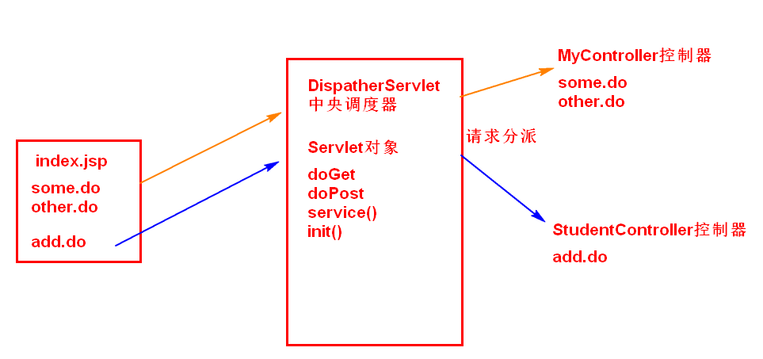
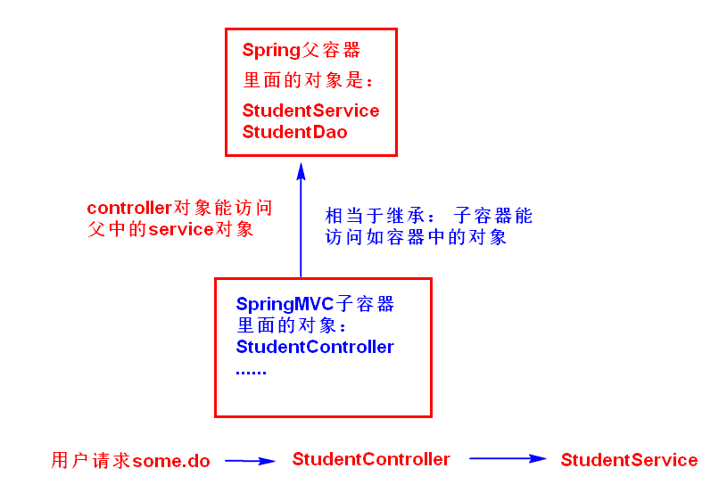

SpringMVC框架

# 第一章 SpringMVC 概述
##  1.1 SpringMVC 基本说明

SpringMVC是基于spring的， 是spring中的一个模块，做web开发使用的。 springmvc 叫做spring web mvc

说明他是spring的核心技术， 做web开发，springmvc内部是使用mvc架构模式。

SpringMVC 是一个容器， 管理对象的，使用IoC核心技术。 springmvc管理界面层中的控制器对象。

SpringMVC底层也是Servlet。 以Servlet为核心， 接收请求，处理请求。 显示处理结果给用户。

处理用户的请求：

用户发起请求----SpringMVC---Spring---MyBatis--mysql数据库

 ### 1.1.2 使用步骤
 1. 新建web应用
 2. 加入web依赖
    * spring-webmvc依赖，servlet依赖
 3. 声明springmvc核心对象DispatcherServlet
     1) DispatcherServlet是一个Servlet对象
     2) DispatcherServlet叫做前端控制器(front controller)
     3) DispatcherServlet作用：
          1. 在servlet的init()方法中，创建springmvc中的容器对象
          2. 作为servlet，接收请求
4. 创建一个jsp，发起请求
5. 创建一个普通的类，作为控制器使用（代替之前的servlet）
    1) 在类的上面加入`@controller`注解
    2) 在类中定义方法，方法的上面加入`@RequestMapping`注解方法处理请求的，相当于servlet的doGet，doPost
6. 创建作为结果的jsp页面
7. 创建springmvc的配置文件（spring的配置文件一样）
    1) 声明组件扫描器，指定`@controller`注解所在的包名
    2) 声明视图解析器对象
8. 使用逻辑视图名称

## 1.2 SpringMVC中的核心Servlet -- DispatcherServlet

DispatcherServlet 是框架一个Servlet对象。  负责接收请求， 响应处理结果。

DispatcherServlet 他的父类是HttpServlet 

DispatcherServlet 也叫做前端控制器（ front controller）。

SpringMVC是管理控制器对象， 原来没有SpringMVC之前使用 Servlet作为控制器对象使用。现在通过SpringMVC容器创建一种叫做控制器的对象，代替Servlet行驶控制器的角色。功能。

SpringMVC 主要使用注解的方式， 创建控制器对象， 处理请求。

```xml
<servlet>
    <servlet-name>myweb</servlet-name>
    <servlet-class>org.springframework.web.servlet.DispatcherServlet</servlet-class>
    <!--自定义配置文件的位置-->
    <init-param>
        <param-name>contextConfigLocation</param-name>
        <param-value>classpath:springmvc.xml</param-value>
    </init-param>
    <!--
       表示服务器tomcat创建对象的顺序， 是个整数值， 大于等于0.
       数值越小，创建对象的时间越早。
    -->
    <load-on-startup>1</load-on-startup>
</servlet>


<servlet-mapping>
    <servlet-name>myweb</servlet-name>
    <!--
       url-pattern 作用: 把一些请求交给指定的servlet处理
       使用中央调度器（DispatcherServlet）
       1. 使用扩展名方式， 格式 *.xxx ,  xxx是自定义的扩展名。
          例如  *.do , *.action, *.mvc 等等. 不能使用*.jsp
          http://localhost:8080/myweb/some.do
          http://localhost:8080/myweb/user/list/queryUser.do
          http://localhost:8080/myweb/user/list/list.do

       2. 使用斜杠 "/"
    -->
    <url-pattern>*.do</url-pattern>

</servlet-mapping>
```

## 1.3 springmvc请求的处理过程
简单的处理过程：

用户发起请求some.do--->Tomcat接收了请求---DispatcherServlet--分配MyController(doSome()返回mv对象)--mv显示给用户了。 

省略tomcat

用户some.do--------------DispatcherServlet--------------MyController

如果使用servlet处理请求

用户发起请求--------------------没有其他对象------------------------Servlet



## 1.4  复习

用户发起some.do---DispatcherServlet(Servlet接收请求)---转给MyController

```java
public class DispatcherServlet extends HttpServlet{
	public void service(HttpServletRequest request, HttpServletResponse response){
		if("some.do".equals(request.getURI())){
			//从容器中获取MyController
			MyController c  = ctx.getBean("some"));
			c.doSome();
		} 
		else if( "other.do".equals(request.getURI())){
			OtherController c  = ctx.getBean("other"));
			c.doOther();
		}
	}
}
```


## 1.5 web开发中配置文件的说明

1. web.xml  部署描述符文件 ， 给服务器（tomcat）。 

   作用：服务器在启动的时候，读取web.xml ，根据文件中的声明创建各种对象， 

   ​           根据文件中的声明 知道 请求和servlet等对象的关系。

2. 框架的配置文件， springmvc的配置文件

   作用：声明框架创建的项目中的各种对象， 主要是创建Controller对象的


配置文件的加载顺序和功能

1. tomcat服务器启动， 读取web.xml. 根据web.xml文件中的说明，创建对象。
```xml
   <servlet>
           <servlet-name>myweb</servlet-name>
           <servlet-class>org.springframework.web.servlet.DispatcherServlet</servlet-class>
           <!--自定义配置文件的位置-->
           <init-param>
               <param-name>contextConfigLocation</param-name>
               <param-value>classpath:springmvc.xml</param-value>
           </init-param>
           <!--
              表示服务器tomcat创建对象的顺序， 是个整数值， 大于等于0.
              数值越小，创建对象的时间越早。
           -->
           <load-on-startup>1</load-on-startup>
       </servlet>
```

   创建DispatcherServlet他的对象， 会执行init()方法。 在init()方法中会执行 springmvc容器对象创建

   WebApplicationContext ctx = new ClassPathXmlApplicationContext("classpath:springmvc.xml")

2. springmvc框架， new ClassPathXmlApplicationContext(）读取springmvc的配置文件。

```xml
    <context:component-scan base-package="com.bjpowernode.controller" />
   
       <!--声明视图解析器：帮助处理视图-->
       <bean class="org.springframework.web.servlet.view.InternalResourceViewResolver">
           <!--前缀：指定视图文件的路径-->
           <property name="prefix" value="/WEB-INF/view/" />
           <!--后缀：视图文件的扩展名-->
           <property name="suffix" value=".jsp" />
       </bean>
```

   使用组件扫描器base-package="com.bjpowernode.controller" ，遍历controller包中的所有类，MyController类， 找到这个类中的@Controller， @RequestMapping注解， 就能创建MyContoller对象。

   知道some.do的请求是执行doSome()方法

   以上 1， 2. 都是项目启动的过程， 没有执行任何的用户请求。

3. 用户发起请求some.do----DispatcherServlet

   DispatcherServlet里面有 WebApplicationContext 。  WebApplicationContext 里面有MyController对象。

   请求some.do ，DispatcherServlet 就知道是 MyController处理的。

   

## 1.6 SpringMVC内部的执行流程

springmvc内部请求的处理过程：

1. 用户发起请求给DispatcherServlet

2. DispatcherServlet把请求（request）交给了 处理器映射器。

   处理器映射器： springmvc框架中的对象， 需要实现HandlerMapping接口。

   映射器作用： 从springmvc容器中，获取控制器对象（MyController）,把找到的控制器和拦截器对象都放到                处理器执行链对象中，保存，并返回给中央调度器。（MyController controller  = ApplicationContext.getBean()）

   

3. DispatcherServlet把获取到的处理器执行链中的控制器对象，交给了处理器适配器

   处理器适配器：是springmvc框架中的对象， 实现HandlerAdapter接口。

   适配器作用： 执行控制器的方法， 也就是执行MyController.doSome()方法。得到结果ModelAndView

   

4. DispatcherServlet把控制器执行结果mv交给了 视图解析器

   视图解析器： springmvc中的对象，需要实现ViewResolver接口。

   视图解析器作用： 处理视图的， 组成视图的完整路径。 能创建View类型的对象

   

5. DispatcherServlet调用View类的方法， 把Model中的数据放入到request作用域。 执行request.setAttribute(),  对视图执行forward()转发行为， request.getRequestDispather("/show.jsp").forward(request,response)


# 第二章 SpringMVC 注解式开发

## 2.1 @RequestMapping注解的使用。

属性： value  请求的uri地址。

位置： 1） 在方法的上面， 必须的。 2）在类的上面作为模块名称

```java
@RequestMapping(value ="/some.do")
public ModelAndView doSome(){
```


属性 method 请求的方式， 使用RequestMehtod类的枚举，表示请求方式

```java
@RequestMapping(value ="/other.do",method = RequestMethod.POST)
public ModelAndView doOther(){
```


## 2.2 接收请求中的参数

对应HttpServletRequest, HttpServletResponse, HttpSession 只需要在控制器方法的形参列表中，定义就可以了。框架会给参数赋值， 在控制器方法内部可以直接使用 request，response，session参数。


400 ： http status , 表示客户端异常。 主要是发生在用户提交参数过程中。


接收请求中的参数： 逐个接收， 对象接收

### 2.2.1 逐个接收

逐个接收： 请求中的参数名和控制器方法的形参名一样。按照名称对象接收参数

```xml
<p>逐个接收请求参数</p>
<form action="receive-property.do" method="post">
    姓名：<input type="text" name="name"> <br/>
    年龄：<input type="text" name="age"> <br/>
    <input type="submit" value="提交参数">
</form>
```


Controller接收参数

```java
@RequestMapping(value ="/receive-property.do")
public ModelAndView doPropertyParam(String name, Integer age) {} 
```


接收参数的问题：

1. 参数最好使用包装类型。 例如Integer ，能接收空值情况， 接收的是null
2. 框架可以使用String到int ，long， float， double等类型转换。
3. post请求中有乱码的问题， 使用字符集过滤器。


### 2.2.2 CharacterEncodingFilter使用：

```xml
在web.xml 声明过滤器
 <filter>
        <filter-name>characterEncodingFilter</filter-name>
        <filter-class>org.springframework.web.filter.CharacterEncodingFilter</filter-class>
        <!--给过滤器属性赋值-->
        <init-param>
            <!--项目使用的字符编码-->
            <param-name>encoding</param-name>
            <param-value>utf-8</param-value>
        </init-param>
        <init-param>
            <!--强制请求（request）对象使用encoding的编码方式-->
            <param-name>forceRequestEncoding</param-name>
            <param-value>true</param-value>
        </init-param>
        <init-param>
            <!--强制应答（response）对象使用encoding的编码方式-->
            <param-name>forceResponseEncoding</param-name>
            <param-value>true</param-value>
        </init-param>
    </filter>
    <filter-mapping>
        <filter-name>characterEncodingFilter</filter-name>
        <!--强制所有请求，先经过过滤器处理-->
        <url-pattern>/*</url-pattern>
    </filter-mapping>
```


### 2.2.3 请求中参数名和形参名不一样，使用@RequestParam

```java
/**
 * 逐个接收请求参数， 请求中参数名和形参名不一样
 * @RequestParam : 解决名称不一样的问题
 *       属性： value 请求中的参数名称
 *              required : boolean类型的，默认是true
 *                    true：请求中必须有此参数，没有报错。
 *                    false：请求中可以没有此参数。
 *       位置： 在形参定义的前面
 */
@RequestMapping(value ="/receive-param.do")
public ModelAndView doReceiveParam(
    @RequestParam(value = "rname",required = false) String name,
    @RequestParam(value = "rage",required = false) Integer age) { }
```


### 2.2.4 对象接收

对象接收： 在控制器方法的形参是java对象， 使用java对象的属性接收请求中参数值。

要求： java对象的属性名和请求中参数名一样。   

例子：

```java
 */
public class Student {

    // 属性名和请求中参数名一样
    private String name;
    private Integer age;
    // set| get方法
}

 @RequestMapping("/receive-object.do")
 public ModelAndView doReceiveObject(Student student){
    System.out.println("MyController的方法doReceiveObject="+student);
    ModelAndView mv = new ModelAndView();
    mv.addObject("myname", student.getName());
    mv.addObject("myage", student.getAge());
    mv.setViewName("show");
    return mv;
}


```


## 2.3 控制器方法的返回值

控制器方法的返回值表示本次请求的处理结果，返回值有ModelAndView, String, void , Object

请求的处理结果包含: 数据和视图。

### 2.3.1 ModelAndView 数据和视图

请求的结果有数据和视图，使用ModelAndView最方便

数据：存放request作用域。 

视图：执行forward转发操作


### 2.3.2 String 视图

框架对返回值是String，执行的是forward转发操作。

视图可以表示为完整视图路径， 或者视图的逻辑名称


```java
@RequestMapping(value ="/return-string-view.do")
public String doReturnStringView1(HttpServletRequest request,String name, Integer age) {
        System.out.println("执行了MyController的doReturnStringView1方法name=");
      
        //返回结果,forward,转发到show.jsp
        //逻辑名称， 需要配置视图解析器
        return "show";
}


@RequestMapping(value ="/return-string-view2.do")
public String doReturnStringView2(HttpServletRequest request,String name, Integer age) {
    System.out.println("执行了MyController的doReturnStringView2方法name=");
    //完整视图路径，不能使用视图解析器
    return "/WEB-INF/view/show.jsp";

}
```

### 2.3.3 void  没有数据和视图

void： 没有数据和视图， 可以使用HttpServletResponse对象输出数据，响应ajax请求。


### 2.3.4 Object 

返回Student 表示数据，还是视图。 所以控制器方法返回对象Object， 用来响应ajax请求。

返回对象Object ，可以是List， Student ， Map ，String ，Integer....  这些都是数据， 而ajax请求需要的旧是数据。 在ajax请求中，一般需要从服务器返回的是json格式的数据， 经常要处理java对象到json的转换。而且还需要输出数据响应ajax请求。  框架提供了处理 java对象到json转换， 还是数据输出工作。


#### 2.3.4.1 HttpMessageConverter 消息转换器

HttpMessageConverter 接口，作用是 1）实现请求的数据转为java对象，  2） 把控制器方法返回的对象转为json，xml，text，二进制等不同格式的数据。


```java
public interface HttpMessageConverter<T> {

   /**
      作用： 检查clazz这个类型的对象，能否转为 mediaType表示的数据格式
            如果能转为mediaType表示的类型， 返回true， 返回true调用read（）
    */
   boolean canRead(Class<?> clazz, @Nullable MediaType mediaType);
   /**
      作用： 接收请求中的数据，把数据转为 clazz表示的对象
    */
   T read(Class<? extends T> clazz, HttpInputMessage inputMessage)
         throws IOException, HttpMessageNotReadableException;
    
    
    
   /**
      作用：检查clazz这种数据类型，能否转为mediaType表示的数据格式
    */
   boolean canWrite(Class<?> clazz, @Nullable MediaType mediaType);

   /**
      作用： 把t对象，按照contentType说明的格式，把对象转为json或者xml
    */
   void write(T t, @Nullable MediaType contentType, HttpOutputMessage outputMessage)
         throws IOException, HttpMessageNotWritableException;

}
```


MediaType：媒体类型，表示互联网中数据的格式。例如application/json, text/html, image/gif


```xml
HttpMessageConverter 接口的实现类：
MappingJackson2HttpMessageConverter ： 用jackson工具库的ObjectMapper把java对象转为json数据格式
StringHttpMessageConverter ： 把字符串类型的数据，进行格式转换和编码
```


怎么使用实现类：

框架根据控制器方法的返回类型， 自动查找使用的实现类。

```java
@RequestMapping("/receive-object.do")
public Student doReceiveObject(String name,Integer age){
    System.out.println("MyController的方法doReceiveObject=");
    Student student = new Student();
    student.setName("lisi");
    student.setAge(20);
    return student;
}
```

默认情况下： springmvc使用了HttpMessageConveter接口的4个实现类。包括了StringHttpMessageConverter. 

需要在springmvc的配置文件，加入注解驱动的标签 mvc:annotation-driven. 加入这个标签后， springmvc项目启动后，会创建HttpMessageConveter接口的7个实现类对象，包括StringHttpMessageConverter 和 MappingJackson2HttpMessageConverter。


#### 2.3.4.2 @ResponseBody

@ResponseBody注解的作用，就是把student转换后的json通过HttpServletResponse对象输出给浏览器。

```java
//输出json，响应ajax
response.setContentType("application/json;charset=utf-8");
PrintWriter pw  = response.getWriter();
pw.println(json);
pw.flush();
pw.close();

@ResponseBody注解作用就上面的代码的实现
```

#### 2.3.4.3 控制器方法返回对象转为json的步骤

1）pom.xml加入jackson依赖，springmvc框架，默认处理json就是使用jackson

2）在springmvc的配置文件中，加入注解驱动的标签mvc:annotation-dirven

3)   在控制器方法的上面加入@ResponseBody注解，表示返回值数据，输出到浏览器。


## 2.4  静态资源处理

访问地址：

当web.xml中DispatcherServlet的url-pattern是 *.do

http://localhost:8080/ch05_url_pattern/index.jsp                tomcat

http://localhost:8080/ch05_url_pattern/js/jquery-3.4.1.js   tomcat

http://localhost:8080/ch05_url_pattern/images/p1.jpg       tomcat

http://localhost:8080/ch05_url_pattern/html/test.html       tomcat

http://localhost:8080/ch05_url_pattern/some.do                 DispatcherServlet（springmvc框架）


#### 2.4.1 tomcat的default servlet

tomcat安装目录/conf/web.xml


```xml
 <servlet>
        <servlet-name>default</servlet-name>
        <servlet-class>org.apache.catalina.servlets.DefaultServlet</servlet-class>
        <init-param>
            <param-name>debug</param-name>
            <param-value>0</param-value>
        </init-param>
        <init-param>
            <param-name>listings</param-name>
            <param-value>false</param-value>
        </init-param>
        <load-on-startup>1</load-on-startup>
</servlet>
<servlet-mapping>
        <servlet-name>default</servlet-name>
        <url-pattern>/</url-pattern>
</servlet-mapping>


default 叫做默认servlet ，作用：
1.它提供静态资源的处理
2.它处理所有未映射到其他请求的请求处理
```


#### 2.4.2  中央调度器设置 "/"

http://localhost:8080/ch05_url_pattern/index.jsp  tomcat 成功访问

http://localhost:8080/ch05_url_pattern/js/jquery-3.4.1.js     404    没有对应的控制器对象

http://localhost:8080/ch05_url_pattern/images/p1.jpg         404   没有对应的控制器对象

http://localhost:8080/ch05_url_pattern/html/test.html         404  没有对应的控制器对象

http://localhost:8080/ch05_url_pattern/some.do                   200  MyController


```xml
    使用斜杠 "/" . 导致中央调度器称为了默认的default servlet。
    需要处理静态资源和其他的未映射的请求。  默认中央调度器没有处理
    静态资源的控制器对象， 所以静态资源都是 404 。 some.do这个请求
    有MyController对象， 所以能访问。


    如果项目中 ， 中央调度器设置了“/” ， 动态资源能访问，静态资源不能访问。
    需要处理静态资源的访问工作。
```


#### 2.4.3 第一种方式处理静态资源

在springmvc的配置文件加入 mvc:default-servlet-handler标签， springmvc框架会在项目运行时，加入DefaultServletHttpRequestHandler对象，让这个对象处理静态资源的访问。


```xml
<!--声明注解驱动
    default-servlet-handler和@RequestMapping使用有冲突
-->
<mvc:annotation-driven />

<!--声明静态资源的第一种处理方式
    创建DefaultServletHttpRequestHandler处理静态资源。
    DefaultServletHttpRequestHandler把接收的静态资源的地址，转发给了tomcat的default

    优点：
      解决方式简单
    缺点：
      依赖tomcat服务器提供的能力。
-->
<mvc:default-servlet-handler />
```


#### 2.4.4 第二种静态资源的处理方式

在springmvc配置文件中加入一个 mvc:resources标签，  框架会创建ResourceHttpRequestHandler控制器对象， 使用这个对象处理静态资源的访问。 不依赖tomcat服务器。  推荐使用的。


```xml
 <!--声明注解驱动
        resources和@RequestMapping使用有冲突
    -->
    <mvc:annotation-driven />

    <!--声明静态资源的第二种处理方式
        mapping: 访问静态资源的uri地址， 可以使用通配符（**）。
                  ** : 表示任意的目录和目录和资源名称
        location: 静态资源在项目中的位置， 不要使用/WEB-INF目录

    -->
    <mvc:resources mapping="/images/**" location="/images/" />
    <mvc:resources mapping="/html/**" location="/html/" />
    <mvc:resources mapping="/js/**" location="/js/" />


    <!--一句话设置静态资源-->
    <!--<mvc:resources mapping="/static/**" location="/static/" />-->
```

# 第三章 SSM 整合

## 3.1 SSM 整合思路

SSM思路： SpringMVC+ Spring + MyBatis(IBatis),  所以有人叫做SSI整合。 SSM整合是使用三个框架的优势功能。三个框架对应的三层架构的三层。  SpringMVC是视图层， Spring是业务层， MyBatis持久层。

SSM 整合，需要把对象交给容器管理， 让容器去创建项目中要使用的java对象。 现在有两个容器。 

第一个是Spring容器： Spring容器是管理service 和 dao等对象的。  是业务层对象的容器。

第二个是SpringMVC容器：管理控制器对象的。   是视图层对象。

SSM整合就是把对象交给容器管理。  两个容器共存。 各自负责管理不同的对象。 把对象声明到配置文件中，让两个容器创建对象。  spring创建service，dao； springmvc创建controller。

## 3.2 容器的创建
Spring容器创建： 在web.xml声明了监听器ContextLoaderListener , 这个功能框架写好了。功能是创建spring的容器对象 WebApplicationContext. 在创建WebApplicationContext对象时，读取spring的配置文件， 读取文件的时候，遇到bean标签或者注解，就能创建service ，dao等对象， 放到容器中。

SpringMVC容器： 在web.xml声明了中央调度器DispatcherServlet。 在这个servlet的init（）方法中， 创建了容器对象 WebApplicationContext, 在创建WebApplicationContext对象，读取springmvc的配置文件， 读取文件的时候，遇到@Controller注解，创建控制器controller对象，放到容器中。

内存中， 创建对象

WebApplicationContext spring = new WebApplicationContext(); //spring--map(service, dao)

WebApplicationContext springmvc = new WebApplicationContext(); //springmvc--map(controller)

SpringMVC容器和Spring容器的关系： 设计上SpringMVC容器对象是 Spring容器的子容器。

Spring是父容器。  SpringMVC子容器。 相当于java中的继承关系。 



## 3.3 SSM整合开发步骤

1. 使用的student2表（id，name，age）

2. 创建maven web项目

3. 修改pom.xml加入依赖： spring ，springmvc，mybatis， mybatis-spring, mysql驱动，druid， jackson

4. 写web.xml ： 声明容器对象

   1）声明spring的监听器ContextLoaderListener： 创建spring的容器对象， 创建service ，dao对象

   2）声明springmvc的中央调度器DispatherServlet : 创建springmvc容器对象， 创建controller对象

   3）声明字符集的过滤器 CharacterEncodingFilter ， 解决post请求乱码的问题

5. 创建程序中的包， dao ，service， controller， entity

6. 写spring，springmvc， mybatis配置文件

7. 写java代码， 实体类， dao接口和mapper文件， service类，controller类。 使用注解声明对象和赋值

8. 创建视图文件， 各种jsp

   


## 3.4 相对路径

在页面中，有路径的问题， 访问路径有 "/"开头的， 还有没有 “/”。

```xml

<a href="test/some.do">没有斜杠开头</a>
<a href="/test/some.do">有斜杠开头</a>
<a href="http://www.baidu.com">有协议开头的地址</a>
```

地址的区别，现在看的都是在页面中的地址。

1）有协议开头的例如http://www.baidu.com ,  称为绝对地址。 地址是唯一的，你能够直接访问

2）没有协议开头的，例如 test/some.do   , /test/some.do 称为相对地址。 相对地址单独使用不能表示某个资源，不能访问。 相对地址必须有参考地址在一起，才能表示一个资源的完整地址，才能访问。


参考地址：  有“ /" 和没有”/“ 参考地址不同的。

1）没有斜杠开头的地址， 参考地址：当前资源的访问路径

​     当前访问的地址： http://localhost:8080/ch07_path/index.jsp

​    资源名称： index.jsp

​    资源路径：  http://localhost:8080/ch07_path

​    在index.jsp 有 访问地址 a href="test/some.do"

​    点击some.do后， 地址变成 http://localhost:8080/ch07_path/test/some.do

```xml
此时：http://localhost:8080/ch07_path/test/some.do
资源名称：some.do
资源路径：http://localhost:8080/ch07_path/test/

在去点击 test/some.do 地址：http://localhost:8080/ch07_path/test/test/some.do

```

没有斜杠开头的地址：  参考地址 + 当前的相对地址 组合在一起是最后的访问地址


解决方式：

  ```xml
1)使用${pageContext.request.contextPath}。 表示访问项目的路径（上下文件 context path）
<a href="${pageContext.request.contextPath}/test/some.do">发起请求test/some.do</a>

优点：好理解
缺点：每个链接地址，都需要加el表达式

2)固定当前页面中的 没有“/”开头地址的 参考地址
使用html中base标签
<%
    String basePath = request.getScheme() + "://" + request.getServerName()
            +":"+request.getServerPort()+request.getContextPath()+"/";
%>
<head>
    <title>浏览学生</title>
    <base href="<%=basePath%>">
 </head>
  ```


2) 有斜杠开头的地址

a href="/test/some.do"

```xml
现在访问的的 http://localhost:8080/ch07_path/index.jsp
在index.jsp中有  /test/some.do.
点击/test/some.do,地址变成 http://localhost:8080/test/some.do

有斜杠开头的地址，参考地址是 服务器地址， 也就是从协议开始到端口号的位置 http://localhost:8080

地址组成：http://localhost:8080/test/some.do

地址缺少项目访问路径， ch07_path. 

```

解决问题的方式：在你的路径前面加入 el表达式 ${pageContext.request.contextPath}

```xml
<p>有/开头的地址</p>
<a href="${pageContext.request.contextPath}/test/some.do">/test/some.do</a>
```


# 第四章 SpringMVC 核心技术。

## 4.1 转发和重定向

forward:视图完整路径

redirect:视图完整路径

```java
mv.setViewName("forward:/hello.jsp");
mv.setViewName("redirect:/other.jsp");
```


## 4.2 异常处理

框架使用的是集中的异常处理。 把各个Controller中抛出的异常集中到一个地方处理。 处理异常的叫做异常处理器。

框架中使用两个注解完成异常的集中处理。 这样每个controller不用单独处理异常了。注解是：

1）@ExceptionHandler : 放在方法的上面，表示此方法可以处理某个类型的异常。 当异常发生时，执行这个方法。

2)  @ControllerAdvice: 放在类的上面， 表示这个类中有异常的处理方法。  相当于aop中的@Aspect.

​     @ControllerAdvice看做是 控制器增强, 就是给Controller类增加异常(切面)的处理功能.


## 4.3 拦截器

拦截器：是springmvc框架中的一种对象， 需要实现接口HandlerInterceptor.  拦截用户的请求。 拦截到controller的请求。


作用：拦截用户的请求， 可以预先对请求做处理。 根据处理结果， 决定是否执行controller 。   也可以把多个controller中共用的功能定义到拦截器。


特点：

1. 拦截器可以分为系统拦截器和自定义拦截器。
2. 一个项目可以多个拦截器。0，或多个自定义拦截器。
3. 拦截器侧重拦截用户的请求。
4. 拦截器是在请求处理之前先执行的。


拦截器的定义：

1）创建类实现拦截器接口HandlerInterceptor，实现接口中的方法（3个）

2）在springmvc配置文件中，声明拦截器对象，并指定拦截的uri地址


### 4.3.1  第一个拦截器


```java
public class MyInterceptor implements HandlerInterceptor {
    /**
     *  preHandle: 预先处理请求的方法。
     *  参数：
     *     Object handler ： 被拦截的控制器对象（MyController）
     *  返回值： boolean
     *   true: 请求是正确的，可以被controller处理的。
     *     =====MyInterceptor拦截器的preHandle====
     *     执行了MyController的doSome方法
     *     =====MyInterceptor拦截器的postHandle====
     *     =====MyInterceptor拦截器的afterCompletion====
     *   false: 请求不能被处理， 控制器方法不会执行。 请求到此截止。
     *     =====MyInterceptor拦截器的preHandle====
     * 特点：
     *  1. 预处理方法他的执行时间： 在控制器方法之前先执行的。
     *  2. 可以对请求做处理， 可以做登录的检查， 权限的判断， 统计数据等等。
     *  3. 决定请求是否执行。
     */
    @Override
    public boolean preHandle(HttpServletRequest request,
                             HttpServletResponse response,
                             Object handler) throws Exception {
        System.out.println("=====MyInterceptor拦截器的preHandle====");
        return true;
    }

    /**
     * postHandle: 后处理方法
     * 参数：
     *  Object handler ： 被拦截的控制器对象（MyController）
     *  ModelAndView mv： 控制器方法的返回值（请求的执行结果）
     *
     * 特点：
     *  1. 在控制器方法之后执行的。
     *  2. 能获取到控制器方法的执行结果。 可以修改原来的执行结果。
     *     可以修改数据， 也可以修改视图
     *  3. 可以做对请求的二次处理。
     */
    @Override
    public void postHandle(HttpServletRequest request,
                           HttpServletResponse response,
                           Object handler,
                           ModelAndView mv) throws Exception {
        System.out.println("=====MyInterceptor拦截器的postHandle====");
    }

    /**
     * afterCompletion: 最后执行的方法
     * 参数：
     *   Object handler ： 被拦截的控制器对象（MyController）
     *   Exception ex： 异常对象
     *
     * 特点：
     *  1. 在请求处理完成后执行的，
     *     请求处理完成的标志是 视图处理完成，对视图执行forward操作后。
     *
     *  2. 可以做程序最后要做的工作， 释放内存， 清理临时变量。
     *
     *  3. 方法的执行条件：
     *     1）当前的拦截器他的preHandle()方法必须执行。
     *     2）preHandle()必须返回true。
     */
    @Override
    public void afterCompletion(HttpServletRequest request,
                                HttpServletResponse response,
                                Object handler,
                                Exception ex) throws Exception {
        System.out.println("=====MyInterceptor拦截器的afterCompletion====");
    }
}
```


配置文件

```xml
<!--声明拦截器-->
<mvc:interceptors>
    <!--声明第一个拦截器-->
    <mvc:interceptor>
        <!--指定拦截器的拦截地址
            path：拦截的uri地址，使用 ** 通配符。
                  例如： path="/user/**"
                  http://localhost:8080/user/listUser.do
                  http://localhost:8080/user/query/queryUser.do
        -->
        <mvc:mapping path="/**"/>
        <!--指定使用的拦截器-->
        <bean class="com.bjpowernode.handler.MyInterceptor"/>
    </mvc:interceptor>

</mvc:interceptors>
```


当你的preHandle返回true， 执行结果：

```html
=====MyInterceptor拦截器的preHandle====
执行了MyController的doSome方法
=====MyInterceptor拦截器的postHandle====
=====MyInterceptor拦截器的afterCompletion====

请求的执行顺序： 用户some.do---preHandle---doSome---postHandle--afterComplietion
```


当 preHandle返回 false

```xml
=====MyInterceptor拦截器的preHandle====
```


### 4.3.2 多个拦截器

使用两个拦截器， 主要看拦截器的执行顺序，以及按个方法控制请求的执行


1）两个拦截器，第一个preHandle=true, 第二个拦截器preHandle=true

```xml
=====MyInterceptor111111拦截器的preHandle====
=====MyInterceptor222222拦截器的preHandle====
执行了MyController的doSome方法
=====MyInterceptor222222拦截器的postHandle====
=====MyInterceptor111111拦截器的postHandle====
=====MyInterceptor222222拦截器的afterCompletion====
=====MyInterceptor111111拦截器的afterCompletion====
```

请求的执行顺序：

用户some.do---拦截器1的preHandle----拦截器2preHandle---控制器doSome---拦截器2postHandle---拦截器1的postHandle---拦截器2的afterCompletion---拦截器1的afterCompletion。


2）两个拦截器，第一个preHandle=true, 第二个拦截器preHandle=false

```xml
=====MyInterceptor111111拦截器的preHandle====
=====MyInterceptor222222拦截器的preHandle====
=====MyInterceptor111111拦截器的afterCompletion====
```


3）两个拦截器，第一个preHandle=false, 第二个拦截器preHandle=true|false

```xml
=====MyInterceptor111111拦截器的preHandle====
```


为什么要使用多个拦截器 ？ 

1. 把验证功能分散到独立的拦截器。 每个拦截器做单一的验证处理。
2. 组合多个拦截器。 


总结：

多个拦截器， 串在一个链条上的。 多个拦截器和一个控制器对象在一个链条上 ，框架中使用HandlerExecutionChain（处理器执行链），表示这个执行链条

```java
public class HandlerExecutionChain {
   
    private final Object handler;  // 存放控制器对象的，MyController
    @Nullable
    private HandlerInterceptor[] interceptors; // 存放多个拦截器对象的。MyInterceptor 1, 2
    @Nullable
    private List<HandlerInterceptor> interceptorList;
}
```


拦截器怎么实现 1,2， 2,1的执行顺序， 遍历HandlerInterceptor[] interceptors 数组

```java
HandlerInterceptor[] interceptors = { MyInterceptor1, MyInterceptor2};
//循环调用方法 1-2
for(int i=0;i<interceptors.length;i++){
      HandlerInterceptor  obj= interceptors[i];
      obj.preHandle();
}

MyController.doSome();

// 2-1
for(int i=interceptors.length-1 ;i>=0;i--){
      HandlerInterceptor  obj= interceptors[i];
      obj.postHandle();
}
```


### 4.3.3 拦截器和过滤器的对比

1）拦截器是springmvc框架中的对象。  过滤器是servlet中的对象。

2）拦截器对象是框架容器创建的， 过滤器对象是tomcat创建的对象。

3)  拦截器是侧重对请求做判断的，处理的， 可以截断请求。 过滤器是侧重对request，response对象的属性，参数设置值的。 例如request.setCharacterEncoding("utf-8")

4) 拦截器的他执行时间有三个， 控制器方法之前， 之后， 请求完成后。 过滤器是在请求之前。

5)拦截器是拦截对controller，动态资源请求的 。 过滤器可以过滤所有请求动态的和静态的。

6)拦截器和过滤器一起执行的， 先执行的过滤器，后面是 中央调度器 ， 后面才是拦截器， 再后面是控制器方法