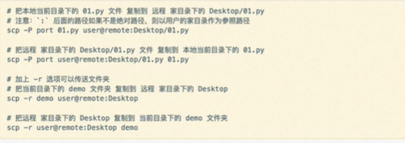

内核（kernel）是系统的心脏，是运行程序和管理像磁盘和打印机登硬件设备的核心程序，它提供了一个在裸设备与应用程序间的抽象层。

### Linux文件和目录结构
* `/：`根目录，一般根目录下只存放目录，在linux下有且只有一个根目录，所有的东西都是从这里开始的。当在终端里输入/home​，其实是在告诉电脑，先从/（根目录）开始，再进入home目录  

* `/bin、/usr/bin`: 可执行二进制文件的目录，如常用的命令`ls 、tar、mv、cat`等  

* `/dev`:  放置linux下的设备文件，访问该目录下的某个文件，相当于访问某个设备，常用的是挂载光驱`mount/dev/cdrom/mnt ` 

* `/boot`: 放置linux系统启动时用的一些文件，如linux的内核文件:`/boot/vmlinuz`，系统引导管理器：`/boot/grub  `

* `/etc`: 系统配置文件存放的目录, 不建议在此目录存放可执行文件

* `/home`: 系统默认的用户家目录,新增用户账号时, 用户的家目录都存放此目录下  

* `/lib、/usr/lib、/usr/local/lib`: 系统使用的函数库的目录，程序在执行过程中，需要调用一些额外的参数时需要函数库的协助 

* `/lost*fount`: 系统产生错误时，会将一些遗失的片段放置于此目录下  

* `/mnt: /media`: 光盘默认挂载点，通常将光盘挂载于/mnt/cdrom下，也可以选择任意位置挂载  

* `/opt`: 给主机额外安装软件所摆放的目录  

* `/proc`: 此目录的数据都在内存中，如系统核心、外部设备、网络状态，由于数据都存放在内存中，所以不占用磁盘空间，比较重要的文件有`/proc/cpuinfo、/proc/dma、/proc/net/`等  

* `/root`: 系统管理员root的家目录  

在职场中，大量的服务器维护工作都是在远程 通过ssh客户端来完成的，并没有图形界面、所有的维护工作都需要命令来完成

小技巧：
`ctrl + shift + = ` 放大终端窗口的字体显示 
`ctrl + - `  缩小终端窗口中的字体显示

### 常用的Linux指令
| 序号 | 命令           | 对应英文             | 作用                     |
| ---- | -------------- | -------------------- | ------------------------ |
| 01   | ls             | list                 | 查看当前文件夹下的内容   |
| 02   | pwd            | print work directory | 查看当前所在文件夹       |
| 03   | cd [目录名]    | change directory     | 切换文件夹               |
| 04   | touch [文件名] | touch                | 如果文件不存在，新建文件 |
| 05   | mkdir [目录名] | make diretory        | 创建目录                 |
| 06   | rm [文件名]    | remove               | 删除指定的文件名         |
| 07   | clear          | clear                | 清屏                     |

自动补全 
在敲出文件/目录/命令 等等，可以`tab`补全

Linux终端命令格式 
`command [-option] [parameter]`

查阅命令帮助信息（知道）
1. `help  command --help ` 
2. `man man command`

| 操作键  | 功能                 |
| ------- | -------------------- |
| 空格键  | 显示手册页的下一屏   |
| Enter键 | 一次滚动手册页的一行 |
| b       | 回滚一屏             |
| f       | 前滚一屏             |
| q       | 退出                 |
| /word   | 搜索word字符串       |

Linux下文件或者目录名称最长可以有256个字符
以.开头的文件为隐藏文件，需要用-a 参数才能显示
`.`代表当前目录 
`..`代表上一级目录 

#### ls的详细介绍
ls列出目录下的内容，选项如下

| 参数 | 含义                             |
| ---- | -------------------------------- |
| -a   | 显示指定目录下所有子目录与文件   |
| -l   | 以列表方式显示文件的详细信息     |
| -h   | 配合-l以人性化的方式显示文件大小 |

ls通配符的使用

| 通配符 | 含义                           |
| ------ | ------------------------------ |
| .      | 代表任意个数个字符             |
| ?      | 代表任意一个字符，至少1个      |
| []     | 表示可以匹配字符组中的任意一个 |
| [abc]  | 匹配a、b、c中的任意一个        |
| [a-f]  | 匹配从a到f范围内的任意一个字符 |

#### cd的详细介绍

cd是英文单词change directory 的简写，其功能为更改当前的工作目录，也是用户最常用的命令之一  

**注意**： linux所有的目录和文件名都是大小写敏感的

| 命令  | 含义                                     |
| ----- | ---------------------------------------- |
| cd    | 切换到当前用户的主目录（/home/用户目录） |
| cd ~  | 切换到当前用户的主目录（/home/用户目录） |
| cd .  | 保持在当前目录不变                       |
| cd .. | 切换到上级目录                           |
| cd -  | 可以在最近两次工作目录之间来回切换       |

（~波浪号代表用户家目录)

相对路径：在输入路径时，最前面不是/或者~，表示相对当前目录 所在的目录位置 
绝对路劲：在输入路径时，最前面是/或者~，表示 根目录/家目录开始的具体目录位置

#### touch的详细介绍
创建文件或者修改文件时间 
-如果文件不存在，可以创建一个空白文件 
-如果文件已经存在，可以修改文件的末次修改日期  

#### mkdir的详细介绍
创建一个新的目录 
`-p `可以递归创建目录 
新建目录的名称 不能与当前目录中 已有的目录或文件 同名 

#### rm的详细介绍
删除文件或目录 
使用rm命令要小心，因为文件删除后不能恢复 
选项
`-f`强制删除，忽略不存在的文件，无需提示 
`-r` 递归地删除目录下的内容，删除文件夹时必须加此参数

#### 拷贝和移动文件
| 序号 | 命令               | 对应英文 | 作用                              |
| ---- | ------------------ | -------- | --------------------------------- |
| 01   | tree[目录名]       | tree     | 以树状图列出文件目录结构          |
| 02   | cp 源文件 目标文件 | copy     | 复制文件或者目录                  |
| 03   | mv 源文件 目标文件 | move     | 移动文件或目录/文件或者目录重命名 |

##### tree

tree命令可以树状图列出文件目录结构 
选项 
`-d`  只显示目录  

##### cp
cp命令的功能是将给出的文件或目录复制到另一个文件或目录中，相当于DOS底下的copy命令 

| 选型 | 含义                                                         |
| ---- | ------------------------------------------------------------ |
| -f   | 已经存在的目标文件直接覆盖，不会提示                         |
| -i   | 覆盖文件前提示                                               |
| -r   | 若给出的源文件是目录文件，则cp将递归复制该目录下的所有子目录和文件，目标文件必须为一个目录名。 |

cp 复制文件路径即文件  目标文件

##### mv
`mv` 源文件 目标文件 
`-i` 覆盖文件前提示 
可以起到重命名的作用 


#### 查看文件内容


##### cat
`cat` 命令可以用来查看文件内容、创建文件、文件合并、追加文件内容等功能  
`cat` 会一次显示所有的内容，适合查看内容较少的文本文件  

##### more 
more命令可以用于分屏显示文件内容，每次只显示一页内容 
适合查看内容较多的文本文件 
使用more的操作键 
空格键  显示手册页的下一屏 


##### grep

Linux系统中`grep`命令是一种强大的文本搜索工具  
`grep`允许对文本文件进行 模式查找，所谓模式查找，又被称为正则表达式  


常用的两种模式查找  


#### 其他

##### `echo` 文字内容 
`echo`会在终端中显示参数指定的文字，通常会和 重定向联合使用  

##### 重定向`>`和`>>`  
`Linux`允许将命令执行结果，重定向到一个文件  
将本应显示在终端上的内容输出/追加到指定文件中  
其中  
`>`表示输出，会覆盖文件原有的内容  
`>>`表示追加，会将内容追加到已有文件的末尾  

##### 管道（二次处理）`| `
linux允许将一个命令的输出 可以通过管道 作为另一个命令的输入  
可以理解现实生活中的管子，一头塞东西进去，另一头取出来，这里的
`|` 分为左右两端，左端塞东西（写） 右端取东西（读） 

常用的管道命令有： 
more：分屏显示内容 
grep：在命令执行结果的基础上查询指定的文本  

### 远程管理常用命令

#### 关机/重启
`shutdown 选项 时间` 
`shutdown`命令可以安全关闭或者重新启动系统 
`shutdown -r 时间`  可以重新启动  `shutdown -r now` 立即重启  

#### 查看或配置网卡信息
网卡 
网卡是一个专门负责网络通讯的硬件设备 
IP地址是设置在网卡上的地址信息 
我们可以把电脑 比作 电话，网卡相当于SIM卡，IP地址相当于电话号码  

IP地址  
每台联网的电脑上都有IP地址，是保证电脑之间正常通讯的重要设置  
注意：每台电脑的IP地址不能相同，否则会出现IP地址冲突，并且没有办法正常通讯  

ifconig可以查看/配置计算机当前的  


更方便对应ip地址，可输入：`ifconfig | grep inet
ping`
检测到目标主机是否正常连接 
`ping IP`地址
检测本地网卡工作正常 
`ping  127.0.0.1` 
`ping` 一般用于检测当前计算机于目标计算机之间的网络是否通畅，数值越大，速度越慢  

#### 远程登陆和复制文件

##### ssh基础（重点）
在Linux中SSH是非常常用的工具，通过SSH 客户端 我们可以连接到运行了SSH服务器的远程机器上 
数据传输是加密的，可以防止信息泄露 
数据传输是压缩的，可以提高传输速度 
SSH客户端是一种使用Secure Shell（SSH）协议连接到远程计算机的软件程序 
SSH是目前较可靠，专为远程登录会话和其他网络服务 提供安全性的协议  

1. 域名和端口号
域名：由一串用点分隔的名字组成，例如：`www.itcast.cn`是IP地址的别名，方便用户记忆 
端口号：通过IP地址可以找到网络上的计算机 
而通过端口号可以找到计算机上运行的应用程序 
SSH服务器的默认端口号是22，如果是默认端口号，在连接的时候可以省略 
常见服务端口号如下：`22 80 443`

2. ssh客户端的简单使用  
`ssh [-p port] user@remote`
user 是远程机器上的用户名。如果不指定的话默认为当前用户  
remote 是远程机器的地址，可以是IP/域名，或者是后面会提到的别名  
port 是SSH Server监听的端口，如果不指定，就默认为22  
使用exit退出当前用户的登录  
注意：ssh这个终端命令只能在Linux或者Unix系统下使用  
如果在Windows系统中，可以安装Putty或者Xshell客户端软件即可 


##### scp（掌握）
 scp就是secure copy，是一个在Linux下用来进行远程拷贝文件的命令（跟在ip后面冒号不可省略）  
它的地址格式与ssh基本相同，需要注意的是，在指定端口时用的是大写的-P而不是小写的  

如果在Windows系统中，可以安装Putty，使用pscp命令行工具或者安装Filezilla使用FTP进行文件传  

##### SSH高级（知道)  
1. 免密码登陆  
步骤：  
配置公钥  
执行ssh-keygen即可生成SSH钥匙，一路回车即可  
上传公钥到服务器  
执行ssh-copy-id -P port user@remote,可以让远程服务器记住我们的公钥  


2）配置别名
每次都输入ssh -P port user@remote,时间久了会觉得很麻烦，特别是当user，port和remote都要输入，而且还不好记忆  
而配置别名可以让我们进一步偷懒，比如用ssh mac来替代上面一长串，那么就在~/.ssh/config里面追加以下内容  
```
Host myserver
HostName ip地址
User ithrima
port 22
```
保存之后，即可用ssh mac 实现远程登录了，scp同样可以使用  

