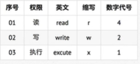
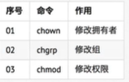

### 用户 和 权限 的基本概念
基本概念：
用户是在Linux系统工作中重要的一环，用户管理包括用户 和组管理  
在Linux系统中，不论是由本机或是远程登录系统，每个系统都必须要有一个账号，并且对于不同的系统资源拥有不同的使用权限  
在Linux中，可以指定每一个用户 针对 不同的文件和目录 的 不同权限
对 文件和目录的权限包括：   

#### 组
为了方便用户管理，提出了组的概念，在实际应用中，可以针对组设置好权限，然后将不同的用户添加 到对应的组中，从而不用依次为每一个用户设置权限   

#### ls-l扩展

ls-l可以查看文件夹下文件的详细信息，从左到右依次是：  
权限，读一个字符如果是d 表示目录  
硬链接数 通俗地讲，就是有多少钟方式，可以访问当前的目录/文件  
拥有者，家目录下 文件/目录的拥有者通常都是当前用户  
组，在Linux中，很多时候，会出现组名和用户名相同的情况  
大小  
时间  
名称  

#### chmod简单使用（重要）
chmod可以修改 用户/组 对 文件/目录的权限  
命令格式如下：  
`chmod +/- rwx 文件名|目录名`  

#### 超级用户
Linux系统中root账号通常用于系统的维护和管理，对操作系统的所有资源 具有所有访问权限  
在大多数版本的linux中，都不推荐直接使用root账号登录系统  
在Linux安装的过程中，系统会自动创建一个用户账号，而这个默认的用户就称为标准用`sudo `  
su是 substitute user 的缩写，表示使用另一个用户的身份  
sudo命令用来以其他身份来执行命令，预设的身份是 root  
用户使用sudo时，必须先输入密码。之后会有5分钟的有效期限，超过期限必须重新输入密码  

#### 组管理 终端命令
创建组/删除组的终端命令都需要通过sudo来执行  

#### 用户管理 终端命令

创建用户时，如果忘记添加-m选项指定新用户的家目录--最简单的方法就是删除用户，重新创建  
创建用户时，默认会创建一个和用户名同名的组名  
用户信息保存在/etc/passwd文件中  

#### 查看用户信息

passwd文件  
/etc/passwd文件存放的时用户的信息，由6个分号组成的7个信息，分别是  

1. 用户名
2. 密码（x. 表示加密的密码）
3. UID（用户标识）
4. GID（组标识）
5. 用户全名或本地账号
6. 家目录
7. 登录使用的Schell，就是登录之后，使用的终端命令，Ubuntu默认是dash  

usermod
usermod可以来设置用户的主组/附加组 和登录Shell 命令格式下：  
主组：通常在新建用户指定，在etc/passwd的第四列GID对应的组  
附加组：在etc/group中最后一列表示该组的用户列表，用于指定用户的附加权限  
（设置了用户的附加组之后，需要重新登录才能生效）  

（默认使用useradd添加的用户是没有权限使用sudo以及root身份执行命令的，可以使用以下命令，将用户添加到sudo附加组中)  
`usermod -G sudo 用户名`

which（重要）  
提示  
`/etc/passwd` 是用于保存用户信息的文件  
`/usr/bin/passwd` 是用于修改用户密码的程序  
`which`命令可以查看执行命令的位置  

#### 切换用户

su 不接用户名，可以切换到root。但是不推荐使用，因为不安全  
exit示意图如下：  

#### 修改文件权限

命令的格式如下：  
 
hmod在设置权限的时候，可以简单的使用三个数字分别对应拥有者/组和其他 用户的权限  
直接修改文件|目录 读【写】执行权限，但是不能精确到拥有者【组】其他chmod +/-rwx 文件名|目录名  

### 系统信息相关命令

本节内容主要是为了方便通过远程终端维护服务器时，查看服务器上当前 系统日期和时间/磁盘空间占用情况/程序执行情况  
本小节学习的终端命令基本都是查询命令，通过这些命令对系统资源的使用情况有个了解  

#### 时间和日期

#### 磁盘信息

`-h `以人性化方式显示文件大小  

#### 进程信息
所谓进程就是 通俗地说就是 当前正在执行的一个程序  
默认只会显示当前用户通过终端启动的应用程序  
ps选项说明功能    

使用kill命令的时候，最好只终止当前用户开启的进程，而不要终止root身份开启的进程  
否则可能导致系统崩溃  
要推出top 输入一个q即可  

### 其他命令
目标：  
查找文件：`find`   
软链接：`ln`  
打包和压缩： `tar`  
软件安装：`apt-get`

#### 查找文件 
find命令功能非常强大，通常用来在 特定目录下 搜索 符合条件的文件  
`find 【路径】 - name “*.py” ` 查找指定路径下扩展名是 .py 的文件，包括子目录  
* 如果省略路径，表示在当前文件夹下查找
* 之前学习的通配符，在使用find命令时同时使用

#### 软链接 
`ln -s` 被链接的源文件  链接文件  
建立文件的软链接，用通俗的方式讲类似于 Windows下的快捷方式
注意：  
没有 -s选项建立的是一个硬链接文件，两个文件占用相同大小的硬盘空间，工作中机会不会建立文件的硬链接  
源文件要使用绝对路径，不能使用相对路径，这样方便移动链接文件后，仍能够正常使用  

硬链接
在Linux中，文件名和文件数据是分开存储的  
  
在linux中，只有文件的硬链接数==0才会被删除
使用ls -l可以查看一个文件的硬链接的数量   

#### 打包压缩
打包压缩是日常工作中备份文件的一种方式在不同的操作系统中，常用的打包方式是不同的  
windows 常用rar   
mac常用 zip  
linux常用tar.gz  
打包/解包  
tar是Linux中常用的备份工具，此命令可以把一系列文件打包到一个大文件中，也可以把一个打包的大文件恢复成一系列文件  
tar的命令格式如下：  
#打包文件  
`tar -cvf 打包文件.tar 被打包文件/路径....`  
#解包文件  
`tar -xvf 打包文件.tar`  

1. 压缩/解压缩  
tar与gzip命令结合可以实现文件的打包和压缩  
tar只负责打包，但不压缩  
用gzip压缩tar打包后的文件，其扩展名一般用xxx.tar.gz  
在Linux中，最常见的压缩文件格式就是xxx.tar.gz  
在tar命令中，有一个-z的选项可以调用gzip。从而方便的实现压缩和解压缩的功能  

C 解压缩到指定的路径，要解压缩的目录必须存在 
2. bzip2  
tar和bzip2命令结合使用同样可以打包和压缩，其扩展名为xxx.tar.bz2  
在tar命令中有个选项-j可以调用bzip2，从而可以方便的实现压缩和解压缩的功能  

#### 通过apt安装/卸载/更新软件包
apt是Advanced Packaging Tool, 是  
