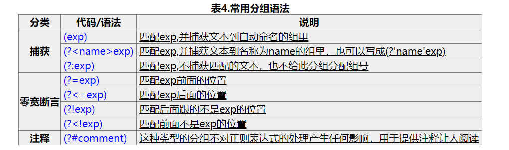
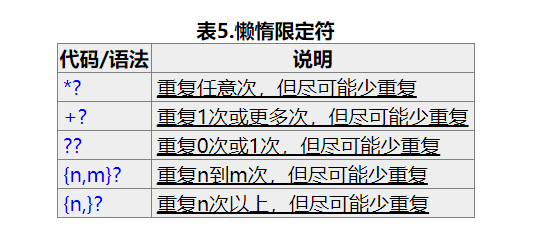
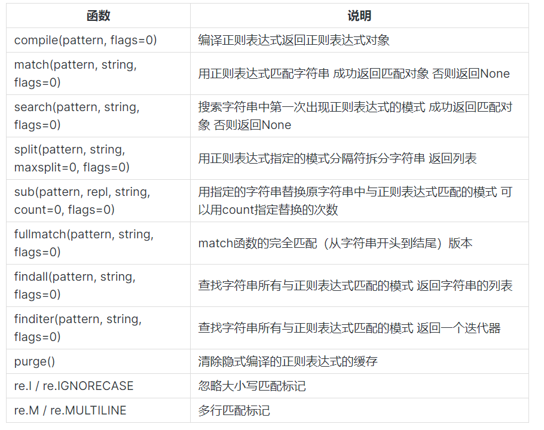

# 正则表达式
## 概念
正则表达式用于匹配搜索相应的字符，有两个知识点要学：
* 元字符
* 语法格式
## 元字符
常用的元字符有：

| 元字符 | 含义                         |
| ------ | ---------------------------- |
| .      | 匹配除换行符之外的所有字符   |
| \w     | 匹配字母或数字或下划线或汉字 |
| \s     | 匹配任意空白符               |
| \d     | 匹配数字                     |
| \b     | 匹配单词的开始或结束         |
| ^      | 匹配字符串的开始             |
| $      | 匹配字符串的结束             |

## 重复

| 限定符 | 含义             |
| ------ | ---------------- |
| *      | 重复零次或更多次 |
| +      | 重复一次或更多次 |
| ？     | 重复零次或一次   |
| {n}    | 重复n次          |
| {n,}   | 重复n次或更多次  |
| {n,m}  | 重复n次到m次     |

## 字符类
若匹配的字符并不在规定的元字符之内，可以用方括号列出来，例如元音字符或标点符号`[.?;>]`

## 分枝条件
可以设定不同的匹配规则并使用`|`将它们分隔开

## 分组
重复单个字符在字符后面添加相应限定符，重复多个字符需要将字符用小括号括起来

## 反义

| 元字符 | 含义                         |
| ------ | ---------------------------- |
| \W     | 匹配任意不是字母或数字或下划线或汉字 |
| \S     | 匹配任意不是空白符               |
| \D    | 匹配不是数字                     |
| \B     | 匹配不是单词的开始或结束位置         |
| \[^x]      | 匹配除x外的字符             |

## 反向引用、零宽断言、负向零宽断言(加!)
* 反向引用：  
使用小括号规定一个子表达式之后，会被默认分配一个组号，后面可以通过组号调用该表达式`\b(\w+)\b\s+\1\b`   
常用分组语法为:


* 零宽断言：用于查找某些内容之前或之后的部分


## 贪婪与懒惰
* 贪婪，匹配尽可能多符合条件的字符
* 懒惰，匹配尽可能少符合条件的字符



## 平衡组、递归匹配
```txt
<                   #最外层的左括号
  \[^<>\]\*            #它后面非括号的内容
  (
      (
        (?'Open'<)  #左括号，压入"Open"
        \[^<>\]\*      #左括号后面的内容
      )+
      (
        (?'-Open'>) #右括号，弹出一个"Open"
        \[^<>\]\*      #右括号后面的内容
      )+
  )\*
  (?(Open)(?!))     #最外层的右括号前检查
                    #若还有未弹出的"Open"
                    #则匹配失败

>                #最外层的右括号
```

## Python 对正则表达式的支持
