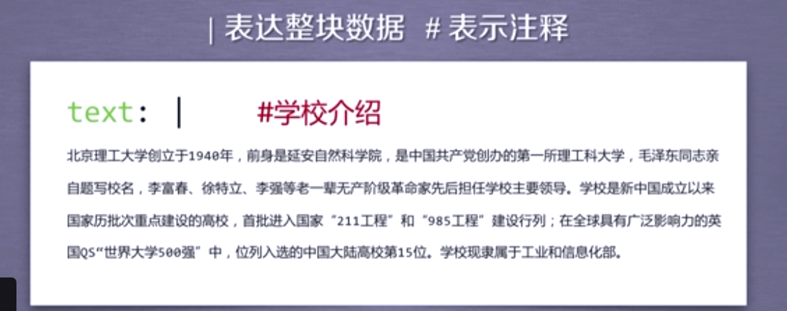

### 集成开发系统
文本工具类    
IDLE是自带的，入门级  
Sublime Text  
专为程序员设计，提高编程体验  
Wine  
收费，适合多人开发   
PyCharm  
简单、集成度较高  
Canopy  
公司维护  
Anaconda  
开源免费，数据分析，科学计算  

### Python网络爬虫与信息提取
equwsts库的安装  
Requests库的7个主要方法  
* `requests.request()`  构造一个请求，支撑以下各方法的基础方法  
* `requests.get()`         获取HTML网页的主要方法，对应于HTTP的GET  *****  
* `requests.head()`      获取HTML网页头信息的方法，对应于HTTP的HEAD  *****  
* `requests.post()`       向HTML网页提交POST请求的方法，对应于HTTP的POST  
* `requests.put()`         向HTML网页提交PUT请求的方法，对应于HTTP的PUT  
* `requests.patch()`     向HTML网页提交局部修改请求，对应于HTTP的PATCH  
* `requests.delete()`    向HTML页面提交删除请求，对应于HTTP的DELETE  

requests.request()    
`requests.get(url)` 返回一个包含服务器资源的Reponse对象（包括爬取返回的所有对象），构造一个向服务器请求资源的request对象
Response对象的属性  
* `r.status_code`     HTTP请求的返回状态，200表示连接成功，404表示失败  
* `r.text`                   HTTP响应内容的字符串形式，即，url对应的页面内容  
* `r.encoding`          从HTTP header中猜测的响应内容编码方式  
* `r.apparent_encoding`         从内容中分析出响应内容的编码方式（备选编码方式）  
* `r.content`             HTTP响应内容的二进制形式  

```
>>> import requests
>>> r = requests.get("http://www.baidu.com") 
>>> r.status_code 200 
>>> r.encoding = 'utf-8' 
>>> r.text
```
`requests.request(url,  **kwarges)`
url: 拟获取页面的url链接  
**kwarge: 12个控制访问的参数:  
paras字典或者字节序列，作为参数增加URL中  
data 字典、字节序列或文件对象，作为Request的内容  
json JSON格式的数据，作为Request的内容  
headers 字典，HTTP定制头（模拟浏览器）  
cookies 字典或CookieJar， Request中的cookie  
auth  元组，支持HTTP认证功能  
files  字典类型，传输文件   
timeout  设定超时时间，秒为单位  
proxies 字典类型，设定访问服务器，可以增加登录认证  
allow_redirects: True/False, 默认为True，重定向开关    
stream: True/False ，默认为True，获取内容立即下载开关  
verify True、False，默认为True，认证SSL证书开关  
cert 本地SSL证书的路径  
`requests.head(url. **kwargs) `  
`r = requests.head('http://httpbin.org/get'')`  
可以用很少的流量获取网络的概要信息  
`requests.post(url, data=None,json=None,**kwargs)`  
`payload = {'key1' : 'value1', 'key2' : 'value2'}`  
`r = requests.post('http://httpbin.org/post', data = payload)`  
向URL POST一个字典，自动编码为form（表单）
如果不提交键对，只提交字符串，则会向ULR POST一个字符串，自动编码为data  
`requests.put(url, data=None,**kwargs)`  
`requests.delete(url, **kwargs)`  
`requests.get(url, params=None, **kwargs)`  


### 爬取网页的通用代码框架
理解requests库的异常  
* `requests,ConnectionError`        网络连接错误异常，如DNS查询失败、拒绝连接等  
* `requests.HTTPError`  HTTP错误异常  
* `requests.URLRequired `            URL缺失异常  
* `requests.TooManyRedircts`       超过最大重定向次数，产生重定向异常  
* `requests.ConnectionTimeout`    连接远程服务器超时异常  
* `requests.Timeout`                      请求URL超时，产生超时异常  
```
import requests
def getHTMLText(url):
    try:
        r = requests.get(url, timeout=30)
        r.raise_for_status() #如果状态不是200，引发HTTPError异常(有效的测试连接返回错误)
        r.encoding = r.apparent_encoding
        return r.text
    except:
        return "产生异常"
if __name__ == "__main__":
    url = "http://www.baidu.com"
    print(getHTMLText(url))
```
### HTTP协议
HTTP, Hypertext Transfer Protocol, 超文本传输协议。  
HTTP是基于“请求与响应” 模式的、无状态的应用层协议。  
HTTP URL实例：  
http://www.bit.edu.cn  
http://220.181.111.188/duty  
HTTP URL的理解：URL是通过HTTP协议存储资源的Internet路径，一个URL对应一个数据资源  
HTTP协议对资源的操作  
GET            请求获得URL位置的资源  
HEAD         请求获取URL位置资源的响应信息报告，即获得该资源的头部信息  
POST         请求向URL位置资源后附加新的数据  
PUT            请求向URL位置存储一个资源，覆盖原URL位置的资源  
PATCH        请求局部更新URL位置的资源，即改变该处资源的部分内容  
DELETE    请求删除URL位置存储的资源  

理解PATCH和PUT的区别：   
假设URL位置有一组数据UserInfo， 包括UserID、UserName等20个字段。  
需求：用户修改了UserName，其他不变。  
*采用PATCH，仅向URL提交UserName的局部更新请求  
*采用PUT，必须将所有20个字段一并提交到URL，未提交的字段被删除
PATCH的最主要好处是节省带宽。  

### 网络爬虫的尺寸：
```
-----------------------------------------------------
小规模，数据量小  中规模，数据规模较大    大规模，搜索引擎
爬取速度不敏感    爬取速度敏感           爬取速度关键
Request库       Scrapy库             定制开发
-----------------------------------------------------
爬取网页 玩转网页  爬取网站，爬取系列网站   爬取全网
```
第一个实例，爬取京东商品信息  
```
import requests
url = "https://item.jd.com/2967929.html"
try:
    r = requests.get(url)
    r.raise_for_status()
    r.encoding r.apparaent_encoding
    print(r.text[:1000])
except:
    print(爬取失败)
```
 第二个实例，爬取亚马逊页面信息
```
import requests
url = "http://www.amazon.cn/gp/product/B01MBL5Z3Y"
try:
    kv = {'user-agent':'Mozilla/5.0'}
    r = requests.get(url,header=kv)
    r.raise_for_status()
    r.encoding = r.apparent_encoding
    print(r.text[1000:2000])
except:
    print("爬取失败") 
```
第三个实例，百度/360搜索
```

import requests
keyword  = "Python"
try:
    kv = {'wd':keyword}
    r = requests.get("http://www.baidu.com/s", params = kv)
    print(r.request.url)
    r.raise_for_status()
    print(len(r.text))
except:
    print("爬取失败")
```
第四个实例，网络图片的爬取和存储
```
import requests
import os #路径操作：os.path子库，处理文件路径及信息、进程管理：启动系统中的其他程序、环境参数：获得系统中软硬件信息等环境参数
url = "http://img0.dili360.com/pic/2020/04/29/5ea8e963e9e4f5663028305.jpg"
root = "/home/liu/Pictures/"
path = root +url.split('/')[-1] #分割 ['http:', '', 'www.baidu.com', 'python', 'image', '123456.jpg']
try:
    if not os.path.exists(root):   #判断path对应文件或目录是否存在，返回True或False
        os.mkdir(root)
    if not os.path.exists(path):
        r = requests.get
        with open(path, 'wb') as f: #'wb'以二进制格式打开一个文件只用于写入。如果该文件已存在则将其覆盖。如果该文件不存在，创建新文件。
            f.write(r.content)
            f.close()
            print("文件保存成功")
    else:
    print(文件已经存在)
except:
    print("爬取失败")
```
第五个实例，IP地址归属地的自动查询
```
import requests
url = "http://m.ip138.com/ip.asp?ip="
try:
    r = requests.get(url+'202.204.80.112')
    r.raise_for_status()
    r.encoding = r.apparent_encoding
    print(r.text[-500:])
except:
    print("爬取失败")
```

### 掌握定向网络数据爬取和网页解析的基本能力

#### Beautiful Soup库的入门和使用
演示HTML页面地址：  
http://python123.io/ws/demo.html  

打开网页的源代码（HTML 5.0）
```
from bs4 import BeautifulSoup #bs4是一个类
soup = BeautifulSoup('<p>data</p>', 'html.parser')  
print(soup.prettify())
```
BeautifulSoup库的基本元素  

BeautifulSoup库是解析、遍历、维护“标签树”的功能库

BeautifulSoup库的引用
BeautifulSoup库，也叫bs4
`from bs4 import BeautifulSoup`  

这三者是等价的关系

```
from bs4 import BeautifulSoup
soup = BeautifulSoup("<html>data<html>", "html.parser")
soup2 = BeautifulSoup(open("/home/liu/Document/demo.htmnl"), html.parser) 
```
BeaytifulSoup库的解析器  
* bs4的HTML解析器   BeautifulSoup(mk, 'html.parser')  安装ps4库  
* lxml 的HTML解析器  BeautifulSoup(mk, 'lxml')             pip install lxml  
* lxml 的XML解析器    BeautifulSoup(mk, 'lxml')            pip install lxml  
* html5lib的解析器      BeautifulSoup(mk. 'html5lib')       pip install html5lib  

BeautifulSoup 类的基本元素  
Tag 标签，最基本的信息组织单元，分别用<>和`</>`表明开头和结尾  
Name  标签的名字  `<p>...</p>`的名字是‘p’，格式：``<tag>.name  
Atrributes 标签的属性，字典形式组织，格式：`<tag>.attrs`  
NavigableString 　标签内非属性字符串，<>...</.>字符串，格式：<tag>string 可以跨越多个标签形式  
Comment  标签内字符串的注释部分，一种特殊的Comment类型  
```python
>>> from bs4 import BeautifulSoup
>>> soup = BeautifulSoup(demo, "html.parser")
>>> print(soup.prettify())
<html>
 <head>
  <title>
   This is a python demo page
  </title>
 </head>
 <body>
  <p class="title">
   <b>
    The demo python introduces several python courses.
   </b>
  </p>
  <p class="course">
   Python is a wonderful general-purpose programming language. You can learn Python from novice to professional by tracking the following courses:
   <a class="py1" href="http://www.icourse163.org/course/BIT-268001" id="link1">
    Basic Python
   </a>
   and
   <a class="py2" href="http://www.icourse163.org/course/BIT-1001870001" id="link2">
    Advanced Python
   </a>
   .
  </p>
 </body>
</html>
>>> from bs4 import BeautifulSoup 
>>> soup = BeautifulSoup(demo, "html.parser")
>>> soup.title
<title>This is a python demo page</title>
>>> tag
Traceback (most recent call last):
  File "<stdin>", line 1, in <module>
NameError: name 'tag' is not defined
>>> tag = soup.a
>>> tag
<a class="py1" href="http://www.icourse163.org/course/BIT-268001" id="link1">Basic Python</a>
>>> soup.a.name
'a'
>>> soup.a.parent.name 
'p'
>>> soup.p.parent.name
'body'
>>> tag = soup.a
>>> tag.attrs
{'href': 'http://www.icourse163.org/course/BIT-268001', 'id': 'link1', 'class': ['py1']}
>>> tag.attrs['class']
['py1']
>>> tag.attrs['href']
'http://www.icourse163.org/course/BIT-268001'
>>> type(tag.attrs)
<class 'dict'>
>>> type(tag)
<class 'bs4.element.Tag'>
>>> soup.a
<a class="py1" href="http://www.icourse163.org/course/BIT-268001" id="link1">Basic Python</a>
>>> soup.a.strong
>>> soup.a.string
'Basic Python'
>>> soup.p
<p class="title"><b>The demo python introduces several python courses.</b></p>
>>> soup.p.string
'The demo python introduces several python courses.'
>>> type(soup.p.string)
<class 'bs4.element.NavigableString'>
>>> newsoup = BeaytifulSoup("<b><!--This is a comment--></b><p>this is not a comment</p>", "html.parser")
Traceback (most recent call last):
  File "<stdin>", line 1, in <module>
NameError: name 'BeaytifulSoup' is not defined
>>> newsoup = BeautifulSoup("<b><!--This is a comment--></b><p>this is not a comment</p>", "html.parser")
>>> newsoup.b.string
'This is a comment'
>>> type(newsoup.p.string)
<class 'bs4.element.NavigableString'>
>>> newsoup.p.string
'this is not a comment'
>>> type(newsoup.p.string)
<class 'bs4.element.NavigableString'>
```
HTML的基本格式  


* contents  子节点的列表，将所有儿子节点存入列表
* children   子节点的迭代类型，与.contents类似，用于循环遍历儿子节点
* descendants   子孙节点的迭代类型，包含所有子孙节点，用于循环遍历
标签树的上行遍历  
* parent  节点的父亲标签
* parents   节点先辈标签的迭代类型，用于循环遍历先辈节点

```python
soup = BeautifulSoup(demo, "html.parser")
for parent in soup.a.parents:
    if parent is None:
        print(parent)
    else:
        print(parent.name)
p
body
html
[document]
```
标签库的平行遍历  
* next_sibling 返回按照HTML文本顺序的下一个平行节点标签  
* previous_sibling 返回按照HTML文本顺序的上一个平行节点标签 
* .next_siblings 迭代类型，返回按照HTML文本顺序的后续所有平行节点标签  
* .previous_siblings 迭代类型， 返回按照HTML文本顺序的前续所有平行节点标签  
* 所有的平行遍历发生在同一个父亲节点之下

```python
for sibling in soup.a.next_siblings:
    print(sibling) #遍历后续节点
    
for sibling in soup.a.previous_siblings:
    print(sibling)#遍历前续节点
```

基于bs4库的HTML格式输出  


```html
>>> print(soup.prettify())
<html>
 <head>
  <title>
   This is a python demo page
  </title>
 </head>
 <body>
  <p class="title">
   <b>
    The demo python introduces several python courses.
   </b>
  </p>
  <p class="course">
   Python is a wonderful general-purpose programming language. You can learn Python from novice to professional by tracking the following courses:
   <a class="py1" href="http://www.icourse163.org/course/BIT-268001" id="link1">
    Basic Python
   </a>
   and
   <a class="py2" href="http://www.icourse163.org/course/BIT-1001870001" id="link2">
    Advanced Python
   </a>
   .
  </p>
 </body>
</html>
```
 bs4库的编码
```html
soup = BeautifulSoup("<p>中文</p>", "html, parser")
soup.p.string
'中文'
print(soup.p.prettify())
<p>
中文
<p/>
```
信息组织与提取方法
信息的标记  
标记的信息可形成信息组织结构，增加了信息维度  
标记后的信息可用于通信、存储或展示  
标记后的结构与信息一样具有重要价值  

HTML可以通过预定义的<>...</>标签形式组织不同类型的信息  
XML eXtensible Markup Language (基于HTML发展而来)  


JSON javaScript Object Notation  
有类型的键值对key:value  


YAML YAML Ain't Markup Language  
无类型键值对 key：value  


XML 最早的通用信息标记语言，可扩展性好，但繁琐          Internet 上的信息交互与传递  
JSON 信息有类型，适合程序处理（js)，相比XML简洁   移动应用云端和节点的信息通信，无注释  
YAML 信息无类型，文本信息比例最高，可读性好       各类系统的配置文件，有注释易读  

信息提取的一般方法
方法一：完整解析信息的 标记形式，再提取关键信息
XML JSON YAML  
需要标记解析器  例如：bs4库的标签树遍历  
优点：信息解析准确  
缺点：提取过程繁琐，速度慢  
方法二：无视任何标记形式，直接搜索关键信息
对信息的文本查找函数即可  
优点： 提取过程简洁，速度较快  
缺点： 提取结果准确性与信息内容相关  
方法三：融合方法：结合形式解析与搜索方法，提取关键信息
XML JSON YAML搜索  
需要标记解析器及文本查找函数  



实例：提取HTML中所有的URL连接  
思路：  
（1）搜索到所有`<a>`标签  
（2）解析`<a>`标签格式，提取href后的链接内容

```bash
>>> soup = BeautifulSoup(demo, "html.parser")
>>> for link in soup.find_all('a'):
...     print(link.get('href'))
... 
http://www.icourse163.org/course/BIT-268001
http://www.icourse163.org/course/BIT-1001870001
```
返回一个列表类型，存储查找的结果  
name：对标签名称的检索字符串  
attrs: 对标签属性值的检索字符串，可标注属性检索  
recursive: 是否对子孙全部检索，默认True  
string:<>...</>中字符串区域的检索字符串  
`<tag>(..) `等价于 `<tag>.find_all(..) `   
`soup(..)`等价于 `soup.find_all(..)`  


### 实例：最好大学排名
功能描述  
输入：大学排名URL链接 http://www.zuihaodaxue.com/zuihaodaxuepaiming2019.html  
输出：大学排名信息的屏幕输出（排名，大学名称，总分）  
技术路线：requests-bs4  
定向爬虫：仅对输入的URL进行爬取，不扩展爬取。  
程序的结构设计：  
步骤一：从网络上获取大学排名网页内容   getHTMLText()  
步骤二：提取网页内容中信息到合适的数据结构   fillUnivList()  
步骤三：利用数据结构展示并输出结果  printUnivList  
实例编写：  


```python
#CrawUnivRankingA.py
import requests
from bs4 import BeautifulSoup
import bs4
 
def getHTMLText(url):
    try:
        r = requests.get(url, timeout=30)
        r.raise_for_status()
        r.encoding = r.apparent_encoding
        return r.text
    except:
        return ""
 
def fillUnivList(ulist, html):
    soup = BeautifulSoup(html, "html.parser")
    for tr in soup.find('tbody').children:
        if isinstance(tr, bs4.element.Tag):
            tds = tr('td')
            ulist.append([tds[0].string, tds[1].string, tds[3].string])
 
def printUnivList(ulist, num):
    print("{:^10}\t{:^6}\t{:^10}".format("排名","学校名称","总分"))
    for i in range(num):
        u=ulist[i]
        print("{:^10}\t{:^6}\t{:^10}".format(u[0],u[1],u[2]))
     
def main():
    uinfo = []
    url = 'https://www.zuihaodaxue.cn/zuihaodaxuepaiming2016.html'
    html = getHTMLText(url)
    fillUnivList(uinfo, html)
    printUnivList(uinfo, 20) # 20 univs
```

中文对齐问题的解决  
采用中文字符的空格填充chr（12288)  

```python
def printUnivList(ulist, num):
    tplt = "{0:^10}\t{1:{3}^10}\t{2:^10}"
    print(tplt.format("排名","学校名称","总分",chr(12288)))
    for i in range(num):
        u=ulist[i]
        print(tplt.format(u[0],u[1],u[2],chr(12288)))
```


