### 正则表达式
regular expression regex  RE  
正则表达式是用来简洁表达一组字符串的表达式  
优点是简洁  
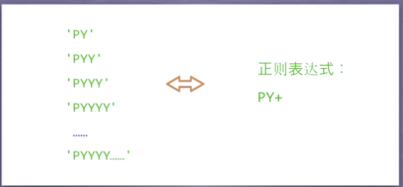
是一种通用的字符串表达框架  
简洁表达一组字符串的表达式  
针对字符串表达“简洁”和“特征”思想的工具  
判断字符串的特征归属  
用处  
表达文本类型的特征（病毒、入侵）  
同时查找或替换一组字符串  
匹配字符串的全部或部分  
使用  
编译：将符合正则表达式语法的字符串转换成正则表达式特征  
语法  
正则表达式是由字符和操作符组成  
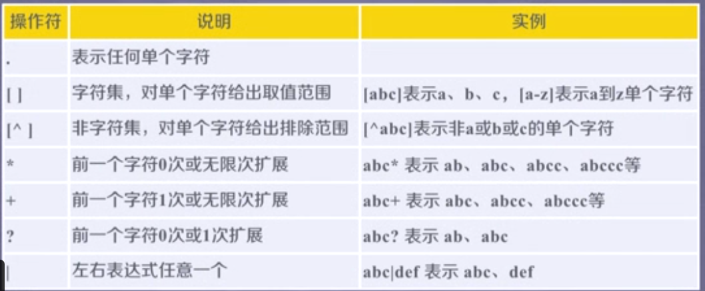
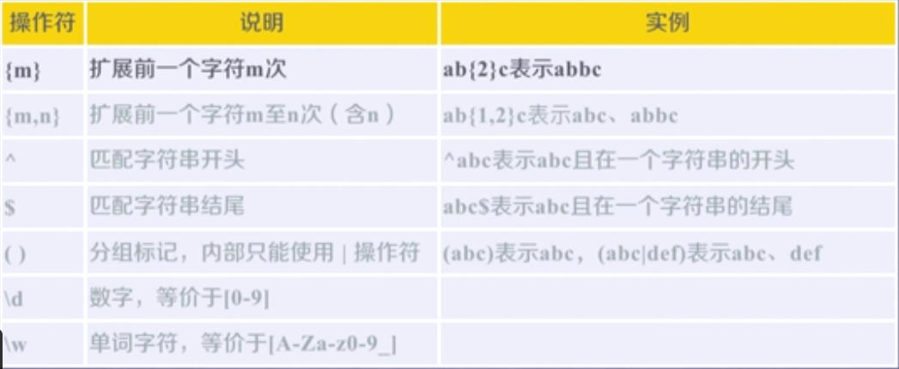
RE库是python的标准库，主要用于字符串的匹配 `import re `   

正则表达式的表示类型  
`raw string `类型（原生字符串类型）  
re库采用raw string类型表示正则表达式，表示为：`r 'text'` 例如` r'[1-9]\d{5}'`  
原生字符串不包含转义符  
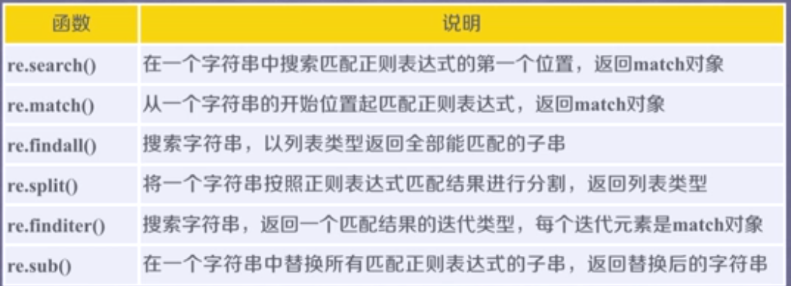
re.search(pattern,string,flag=0)  
在一个字符串中搜索匹配正则表达式的第一个位置，返回match对象  

* pattern：正则表达式的字符串或原生字符串表示  
* string：待匹配的字符串  
* flags：正则表达式使用时的控制标记  

```bash
>>> import re
>>> match = re.search(r'[1-9]\d{5}', 'BIT 100081')
>>> if match:
...     print(match.group(0))#group() 同group（0）就是匹配正则表达式整体结果
... 
100081
```
`re.match(pattern,string,flags=0)`  
从一个字符串的开始位置匹配正则表达式，返回match对象。  
* pattern：正则表达式的字符串或原生字符串表示  
* string：待匹配的字符串  
* flags：正则表达式使用时的控制标记  
```bash
>>> import re
>>> match = re.search(r'[1-9]\d{5}', 'BIT 100081')
>>> if match:
...     print(match.group(0))
... 
100081
>>> import re
>>> match = re.match(r'[1-9]\d{5}', 'BLT 100081')
>>> if match:
...     match.group[0]
... 
>>> match = re.match(r'[1-9]\d{5}', '100081 BLT')
>>> if match:
...     match.group(0)
... 
'100081'
```
 `re.findall(pattern,string,flags=0)`  
搜索字符串，以列表类型返回所有能匹配的子串  

* pattern：正则表达式的字符串或原生字符串表示  
* string：待匹配的字符串  
* flags：正则表达式使用时的控制标记  
```bash
 >>> import re
>>> ls = re.findall(r'[1-9]\d{5}', 'BIL100081 TSU100025')
>>> ls
['100081', '100025']
```
`re.split(pattern,string,maxsplit=0,flags=0)`
将一个字符串按照正则表达式匹配的结果进行分割，返回列表类型  
* pattern：正则表达式的字符串或原生字符串表示  
* string：待匹配的字符串  
* flags：正则表达式使用时的控制标记  
* maxspilt: 最大分割数，剩余部分作为最后一个元素输出  
```bash
>>> import re
>>> ls = re.split(r'[1-9]\d{5}', 'BIL100081 TSU100025')
>>> ls
['BIL', ' TSU', '']
>>> ls = re.split(r'[1-9]\d{5}', 'BIL100081 TSU100025', maxsplit=1) 
>>> ls
['BIL', ' TSU100025'] 
```
`re.finditer(pattern,string,flags=0)`  
搜索字符串，返回一个匹配结果的迭代类型，每个迭代元素是match对象  
* pattern：正则表达式的字符串或原生字符串表示  
* string：待匹配的字符串  
* flags：正则表达式使用时的控制标记
```bash
>>> import re
>>> for m in re.finditer(r'[1-9]\d{5}', 'BIT100081 TSU100084'):
...     if m:
...             print(m.group(0))
... 
100081
100084 
```
`re.sub(pattern,repl,string,count=0,flags=0)`  
在一个字符串中替换所有匹配正则表达式的子串，返回替换后的字符串
* pattern：正则表达式的字符串或原生字符串表示
* repl: 替换字符串的字符串
* string：待匹配的字符串
* count：匹配的最大替换次数
* flags：正则表达式使用时的控制标记
```bash
>>> import re
>>> re,sub(r'[1-9]\d{5}', ':zipcode', 'BLT100081 TSU100084')
>>> re.sub(r'[1-9]\d{5}', ':zipcode', 'BLT100081 TSU100084')
'BLT:zipcode TSU:zipcode'
```
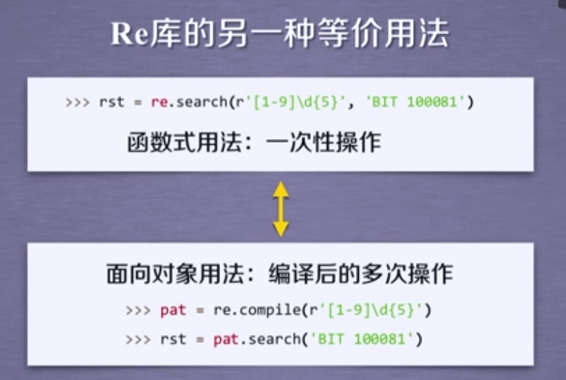
`egex = re.compile(pattern,flags=0)`  
将正则表达式的字符串形式编译成正则表达式对象  
*pattern：正则表达式的字符串或原生字符串表示  

*flags ：正则表达式使用时的控制标记
RE库的match对象  
```bash
RE库的match对象  
>>> import re
>>> match = re.search(r'[1-9]\d{5}', 'BLT 100081')
>>> if match:
...     print(match.group(0))
... 
100081
>>> typr(match)
>>> type(match)
<class '_sre.SRE_Match'>
```
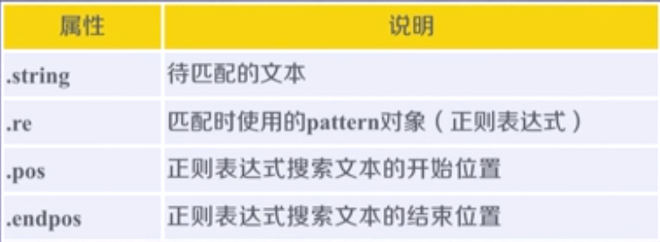
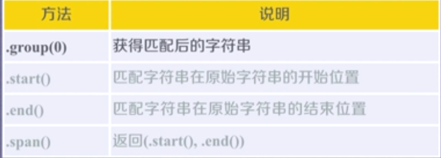

``` bash
>>> import re
>>> m = re.search(r'[1-9]\d', 'BIT100081 TSU100084')
>>> m.string
'BIT100081 TSU100084'
>>> m.re
re.compile('[1-9]\\d')
>>> m.pos
0
>>> m.endpos
19
>>> m.end()
5
>>> m.start()
3
>>> m.span()
(3, 5) 
```
RE库的贪婪匹配和最小匹配 
```python
match = re.search(r'PY.*N', 'PYANBNCNDN' 
match.group(0) #re库默认采用贪婪匹配，即输出匹配最长的子串
match = re.search(r'PY.*？N', 'PYANBNCNDN') #输出最小的匹配
```
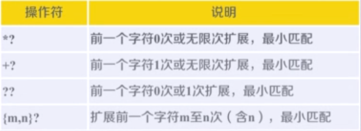

#### 淘宝商店比价定向爬虫
功能描述  
目标：获取淘宝搜索页面的信息，提取其中的商品名称和价格。  
理解：  
淘宝的搜索接口  
翻页的处理  
技术路线：requests-re   

程序的结构设计  
步骤1：提交商品搜索请求，循环获取页面  
步骤2：对于每个页面，提取商品名称和价格信息  
步骤3：将信息输出到屏幕上  
```

#CrowTaobaoPrice.py
import requests
import re
 
def getHTMLText(url):
    try:
        r = requests.get(url, timeout=30)
        r.raise_for_status()
        r.encoding = r.apparent_encoding
        return r.text
    except:
        return ""
     
def parsePage(ilt, html):
    try:
        plt = re.findall(r'\"view_price\"\:\"[\d\.]*\"',html)
        tlt = re.findall(r'\"raw_title\"\:\".*?\"',html)
        for i in range(len(plt)):
            price = eval(plt[i].split(':')[1])
            title = eval(tlt[i].split(':')[1])
            ilt.append([price , title])
    except:
        print("")
 
def printGoodsList(ilt):
    tplt = "{:4}\t{:8}\t{:16}"
    print(tplt.format("序号", "价格", "商品名称"))
    count = 0
    for g in ilt:
        count = count + 1
        print(tplt.format(count, g[0], g[1]))
         
def main():
    goods = '火影忍者'
    depth = 3
    start_url = 'https://s.taobao.com/search?spm=a21bo.2017.201867-links-7.37.5af911d9AriixI&q=' + goods
    infoList = []
    for i in range(depth):
        try:
            url = start_url + '&s=' + str(44*i)
            html = getHTMLText(url)
            parsePage(infoList, html)
        except:
            continue
    printGoodsList(infoList)
     
main()
```
#### 股票数据定向爬虫
目标：获取上交所和深交所所有股票的名称和交易信息  
输出：保存到文件中   
技术路线：requests-bs4-re  
选取原则：股票信息静态存在于HTML页面中，非js代码生成，没有robots协议限制  
选取方法：浏览器F12，源代码查看等  
选取心态：不要纠结于某个网站，多找信息源尝试
程序的结构设计  
步骤1：从东方财富网获取股票列表  
步骤2：根据股票列表逐个到百度股票获取个股信息  
步骤3：将结果存储到文件  
```python
#CrawBaiduStocksB.py
import requests
from bs4 import BeautifulSoup
import traceback
import re
 
def getHTMLText(url, code="utf-8"):
    try:
        r = requests.get(url)
        r.raise_for_status()
        r.encoding = code
        return r.text
    except:
        return ""
 
def getStockList(lst, stockURL):
    html = getHTMLText(stockURL, "GB2312")
    soup = BeautifulSoup(html, 'html.parser') 
    a = soup.find_all('a')
    for i in a:
        try:
            href = i.attrs['href']          #<a> 标签的 href 属性用于指定超链接目标的 URL
            lst.append(re.findall(r"[s][hz]\d{6}", href)[0])
        except:
            continue
 
def getStockInfo(lst, stockURL, fpath):
    count = 0
    for stock in lst:
        url = stockURL + stock + ".html"
        html = getHTMLText(url)
        try:
            if html=="":
                continue
            infoDict = {}
            soup = BeautifulSoup(html, 'html.parser')
            stockInfo = soup.find('div',attrs={'class':'stock-bets'})
 
            name = stockInfo.find_all(attrs={'class':'bets-name'})[0]
            infoDict.update({'股票名称': name.text.split()[0]})
             
            keyList = stockInfo.find_all('dt')
            valueList = stockInfo.find_all('dd')
            for i in range(len(keyList)):
                key = keyList[i].text
                val = valueList[i].text
                infoDict[key] = val
             
            with open(fpath, 'a', encoding='utf-8') as f:
                f.write( str(infoDict) + '\n' )
                count = count + 1
                print("\r当前进度: {:.2f}%".format(count*100/len(lst)),end="")
        except:
            count = count + 1
            print("\r当前进度: {:.2f}%".format(count*100/len(lst)),end="")print('*',end = ' ')
            #end值为空格
            #print('*',end = '')#end值为空字符串
            #print('*',end = '')#end值为空字符串
            #print('')#end值为默认值（换行\n）
            #print('*',end = '1')#end值为字符串‘1’
            #print('*',end = '12')#end值为字符串‘12’
            continue
 
def main():
    stock_list_url = 'https://quote.eastmoney.com/stocklist.html'
    stock_info_url = 'https://gupiao.baidu.com/stock/'
    output_file = 'D:/BaiduStockInfo.txt'
    slist=[]
    getStockList(slist, stock_list_url)
    getStockInfo(slist, stock_info_url, output_file)
 
main()
```

### Scrapy 框架与实例 
Scrapy是功能强大的爬虫框架  
爬虫框架是实现爬虫功能的一个软件结构和功能组件集合  
爬虫框架是一个半成品，能够帮助用户实现专业网络爬虫  
`Downloader Middleware`  
目的：实施Engine、Scheduler和Downlaoder之间进行用户可配置的控制  
功能：修改、丢弃、新增请求或者响应    
`Spider`（用户主要编写模块）  
解析Downloader返回的响应（Response）  
产生爬取项（scrapyed item）  
产生额外的爬取请求（Requests）  
`Item Pipelines`（需要用户自己编写代码）  
以流水线方式处理Spider产生的爬取项  
由一组操作顺序组成，类似流水线，每个操作是一个Item Pipeline类型  
可能操作包括：清理、检验和查重爬取项中的HTML数据、将数据存储到数据库  
`Spider Middleware`
目的：对请求和爬取项的再处理  
功能：修改、丢弃、新增请求或者爬取项  
用户可以编写配置代码  
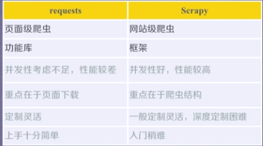
Scrapy命令行格式：  
`>scrapy<command>[options][args]`
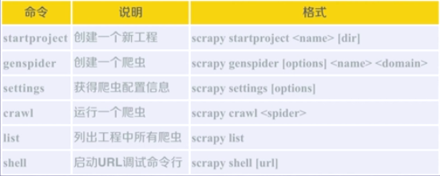
产生步骤：  

1. 建立一个Scapy爬虫工程  
2. 在工程中产生一个Scrapy爬虫  
3. 配置产生的spider爬虫  
4. 运行爬虫，获取网页  
```bash
oot@liu-PC:/home/liu/Documents/learn# scrapy startproject scrapydemo
New Scrapy project 'scrapydemo', using template directory '/usr/lib/python3/dist-packages/scrapy/templates/project', created in:
 /home/liu/Documents/learn/scrapydemo
You can start your first spider with:
 cd scrapydemo
 scrapy genspider example example.com
root@liu-PC:/home/liu/Documents/learn# cd scrapydemo/
root@liu-PC:/home/liu/Documents/learn/scrapydemo# scrapy genspider demo python123.io
Created spider 'demo' using template 'basic' in module:
 scrapydemo.spiders.demo
```
```python
 -*- coding: utf-8 -*-
import scrapy


class DemoSpider(scrapy.Spider):
    name = 'demo'
    #allowed_domains = ['python123.io']
    start_urls = ['http://python123.io/ws/demo.html']

    def parse(self, response):
        fname = response.url.split('/')[-1]
        with open(fname, 'wb') as f:
            f.write(response.body)
        self.log('Saved file %s.' % name) 
```
`scrapy crawl  demo `运行爬虫  
parse()用于处理响应，解析内容形成字典，发现新的URL爬取请求

#### Yield关键字
生成器是一个不断产生值的函数  
包含yield语句的函数是一个生成器  
生成器每次产生一个值（yield语句），函数被冻结，被唤醒后再产生一个值   

```python
def gen(n):
    for i in range(n):
        yield i**2
        #产生一个小于n的所有整数的平方值 
```
生成器相比一次列出所有内容的优势  
更节省存储空间  
响应更迅速  
使用更灵活  

Scrapy爬虫的使用步骤：  
步骤1：创建一个工程和Spider模板  
步骤2：编写Spider  
步骤3：编写Item Pipeline  
步骤4：优化配置策略  

爬虫的数据类型：Request 类、Response类、Item类  
Request类 `class scrapy.http.Request() `  
Request对象表示一个HTTP请求  
由spider生成，由Downlaoder执行  
* url               Request对应请求的URL地址
* method       对应的请求方法， ‘GET’ ‘POST’等
* header        字典类型风格的请求头
* body           请求内容主体，字符串类型
* meta           用户添加的扩展信息，在Scrapy内部模块间传递信息使用  
* copy()         复制该请求  

`Response类 class scrapy.http.Response()`  
Response对象表示一个HTTP响应  
由Downlaoder生成，由spider处理  
* url               Request对应请求的URL地址
* status         HTTP状态码，默认是200
* header       Response对应的头部信息
* body           Response对应的内容主体信息，字符串类型
* flag             一组标记
* request       产生Response类型对应的Request对象
* copy()         复制该响应

Item类 `class scrapy.item.Item()`  
Item对象表示一个从HTML页面中提取的信息内容  
由Spider生成，由Item Pipeline处理  
Item类似于字典类型，可以按照字典类型操作  

Scrapy爬虫支持多种HTML信息提取方法  
Beautiful Soup  
Ixml  
re  
XPath Selector  
CSS Selector  

`<HTML>.css('a::attr(href)').extract `  # a:标签名称  href：标签属性

#### 股票数据Scrapy爬虫实例
功能描述：   
技术路线：Scrapy   
目标：获取上交所和深交所所有股票的名称和交易信息   
输出：保存到文件中   

获取股票列表： 
东方财富网：http://quote.eastmoney.com/stocklist.html  
获取个股信息：  
百度股票： https://gupiao.baidu.com/stock/  
单个股票：https://gupiao.baidu.com/stock/sz002439.html  
步骤：  
1.建立工程和Spider模板  
```bash
scrapy startproject BaiduStocks
cd BaiduStocks
scrapy genspider stocks baidu.com
进一步修改spider/stocks.py文件
```
2.编写Spider  
配置stocks.py文件  
修改对返回页面的处理  
修改对新增URL爬取请求的处理  
```python
# -*- coding: utf-8 -*-
import scrapy
import re

class StocksSpider(scrapy.Spider):
    name = 'stocks'
    start_urls = ['http://quote.eastmoney.com/stocklist.html']

    def parse(self, response):
        for href in response.css('a::attr(href)').extract():
            try:
                stock = re.findall(r"[s][hz]\d{6}", href)[0]
                url = 'https://gupiao.baidu.com/stock' + stock +'.html'
                yield scrapy.Request(url, callback=self.parse_stock)#回调函数，异步进程
            except:
                continue

    def parse_stock(self,response):
        infoDict = {}
        stockInfo = response.css('.stock-bets')
        name = stockInfo.css('.bets-name').extract()[0]
        keyList = stockInfo.css('dt').extract()
        valueList = stockInfo.css('dd').extract()
        for i in range(len(keyList)):
            key = re.findall(r'>.*</d>', keyList[i])[0][1:-5]
            try:
                val = re.findall(r'\d+\.?.*</dd>', valueList[i])[0][0:-5]
            except:
                val = '--'
            infoDict[key]=val

        infoDict.update(
            {'股票名称':re.findall('\s.*\(',name)[0].split()[0] +\
            re.findall('\>.*\<', name)[0][1:-1]})
        yield infoDict 
```
3.编写ITEM Pipelines  
配置pipelines.py文件  
定义对爬取项（Scraped Item）的处理类  
```python

# -*- coding: utf-8 -*-

# Define your item pipelines here
#
# Don't forget to add your pipeline to the ITEM_PIPELINES setting
# See: https://doc.scrapy.org/en/latest/topics/item-pipeline.html


class BaidustocksPipeline(object):
    def process_item(self, item, spider):
        return item

class BaidustocksInfoPipeline(object):
    def open_spider(self,spider):
        self.f = open('BaiduStockInfo.txt', 'w')

    def close_spider(self,spider):
        self.f.close()
    
    def process_item(self, item, spider):
        try:
            line = str(dict(item)) + '\n'
            self.f.write(line)
        except:
            pass
        return item
```
配置ITEM_PIPELINES选项  
```xml
ITEM_PIPELINES = {
    'BaiduStocks.pipelines.BaidustocksInfoPipeline': 300,
}
```
#### 优化实例
配置并发连接选项  
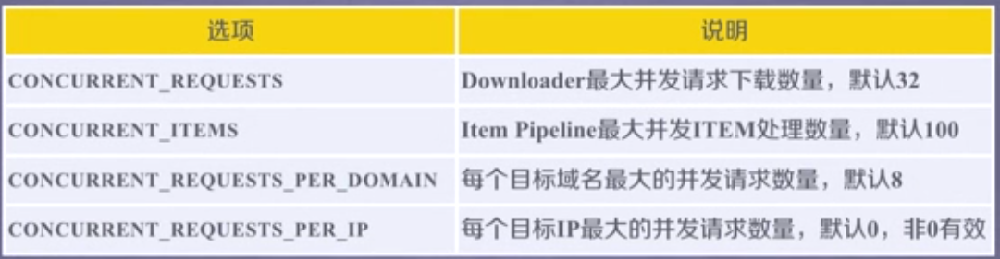
