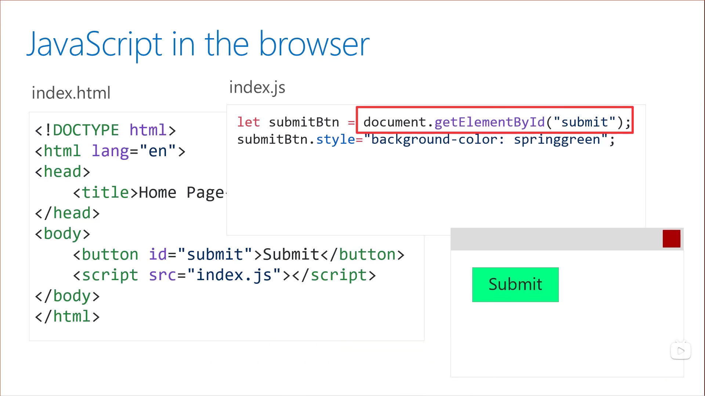
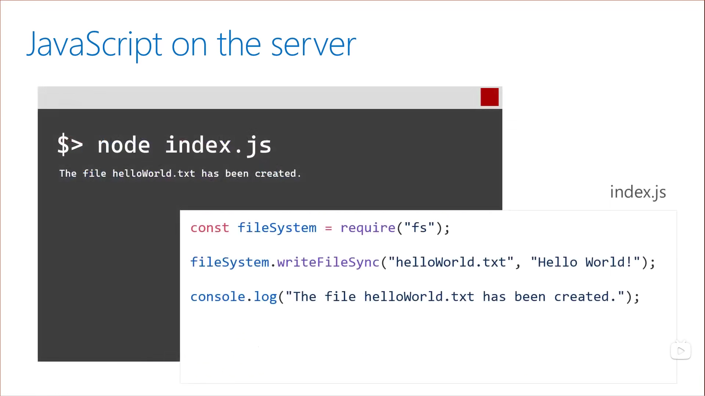
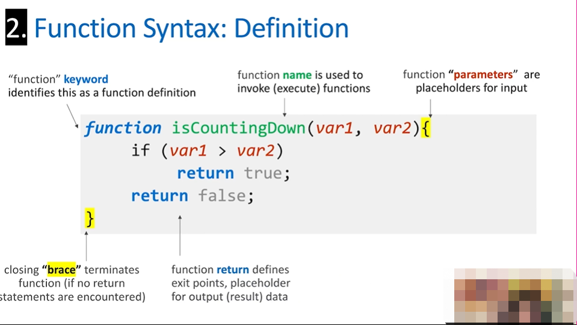

# JavaScript基础

JS是一种实时编译运行的动态类型语言，不需要额外编译就可以运行，而且设置变量也不必指定类型，例如`var x=0`，JS会通过`0`知道x为整数类型。

1. Client：构建网页浏览器应用，与网页元素交互，DOM(Document Object Model)，JS可以在浏览器上访问的函数和对象。



2. Server：称作Node.js，使用JavaScript执行应用程序，使用node执行JS，服务器端没有DOM，而有包的概念，其中一些构建在Node中，例如和文件系统交互，有个第三方包叫做npm，包含一切可以用到的函数和功能。



3. Native：电脑或者手机端应用开发(facebook) 

## JS注释

* 可以使用`//`进行单行注释
* 可以使用`/* ... */`进行多行注释
* 快捷键`Ctrl+/`进行选中代码的快速注释/去除注释

最好的注释就是不需要注释就可以读懂

```javascript
function reverseString(value){
    let reversedValue = "";
    value.split("").forEach((char) => {
        reversedValue = char + reversedValue;
    });
    return reversedValue;
}

console.log(reverseString("Reverse Me"));
```

## 三种变量声明方式

1. `var one = 1;` var是有函数作用域的变量声明，表示定义的变量在该函数内处处有效，甚至在定义之前也可以使用，因为定义是全局有效的，除此之外，变量在作用域也是可以改动的(值和数据类型)
2. `let two = 2;` let是块作用域，定义的变量只能在块中起作用，let只能在被定义之后使用
3. `const three =3;` const也是块作用域，也只能在被定义之后使用，只能设置值，不能重置值，用来表示常量

> what to use when? `const`by default; `let` by loops; 

## 字符串的表示

单引号或双引号都可以标识文本

```javascript
const place = "World";
const greeting = 'Hello';
console.log("%s,%s,",greeting,place);
```

除了单引号和双引号可以表示字符串以外，也可以使用反引号 模板字符串

```javascript
const place = "World";
const greeting = "Hello";
console.log(`${place},${greeting}`);
```

## 字符串拼接

使用`+`来拼接字符串

```javascript
let str1 = "Hello ";
let str2 = "World!";

console.log(str1 + str2);
console.log(str1 + "Big " + str2);
```

进行字符串拼接时要注意保证相同的数字类型

```javascript
let num1 = 1;
let num2 = "1";
console.log(num1+num2);
console.log(num1+1);
```

```bash
11
2
```

## 模板字符串

反引号+${value}

```javascript
let str1 = "JavaScript";
let str2 = "fun";

console.log(`I am writing code in ${str1}`);
console.log('Formatting in ${str1} is ${str2}!');
```

## 数据类型

JS是一门弱类型语言，变量的类型由赋值决定，简单灵活

* 普通数据类型：数字(浮点数整数没有区别)、字符串、布尔、日期、函数、对象和数组
* 特殊数据类型：NaN、null、undefined

两个操作符

* typeof：返回一个原始数据类型的字符串
* instanceof：返回一个是否是该数据类型的布尔值，基本数据类型必须是构造函数构造出来的，才会相等，直接赋值不会相等。

```javascript
const people = ["Aaron","Mel","John"];
const one =1;
const two = new Number(2);
const str = "Hello World";
const b = true;
const person = {
    firstName:"Aaron",
    lastName:"Powell"
};
function sayHello(person){
    console.log("Hello " + person.firstName);
}

console.log("--typeof--");
console.log(typeof people);
console.log(typeof one);
console.log(typeof two);
console.log(typeof str);
console.log(typeof b);
console.log(typeof person);
console.log(typeof sayHello);

console.log(people instanceof Array);
console.log(one instanceof Number);
console.log(two instanceof Number);
console.log(str instanceof String);
console.log(b instanceof Boolean);
console.log(person instanceof Object);
console.log(sayHello instanceof Function);
```

输出

```bash
--typeof--
object  
number  
object  
string  
boolean 
object  
function
--instancof--
true 
false
true 
false
false
true
true
```

数据类型使用`===`来进行安全校验，推荐使用其来进行类型比较

```javascript
let x = 0 == ' ';   //true,  两边类型强制转换为布尔型
let x = 0 === ' ';  //false, 类型安全校验，不会强制改变
```

## 数学运算

基本数学运算

```javascript
let num1 = 100;

console.log(num1 + 25);
console.log(num1 - 100);
console.log(num1 * 100);
console.log(num1/1500);
```

其他数学运算

```javascript
let num1 = 100;
console.log(num1 % 1500); // 取余
console.log(++num1); //自增运算
console.log(--num1); //自减运算
```

如果需要更多的数学功能，使用Math对象

```javascript
let num1 = 100;
console.log(Math.PI);
console.log(Marh.sqrt(num1)); //开根号
```

## 字符串和数学类型转换

* `parseInt()`和`parseFloat()` 将数字字符串转换为数字。 添加非数字字符可能会产生意外结果。`parseFloat()`用于浮点数、带小数点的数字。
* `toString()`将数字转化为数字字符串

 ## 异常处理

* Exception：代码执行过程中的中断，何处何时出错
* Error：代码中的错误，例如语法错误

抛出异常可以附加一些额外信息

```javascript
try{
    criticalCode();
}
catch(ex){
    console.log("Got an error");
    logError(ex);
}
finally{
    console.log("Code that always will run")
}
```

## Date对象

包含日期和时间，JS内部存储的时间是1970.0101以来的毫秒数(时间戳)

 ```javascript
 //得到现在的时间
 const now = new Date();
 //设置一个特定的时间点,JS中的月份是从0开始的
 const randomDate = new Date(2015,3,12,6,25,58);//2015年4月12日6点25分58秒
 //指定年月日
 const win95Launch = new Date(1995,7,24);//1995年8月24号
 
 console.log(randomDate);
 console.log(win95Launch);
 ```

设定时间值

```javascript
const now = new Date();

now.setFullYear(2014);
now.setMonth(3);
now.setDate(4);

now.setHours(4);
now.setMinutes(24);
now.setSeconds(46);

console.log(now);
```

得到时间值

```javascript
const now = new Date();
//所有的set函数设置的值都可以得到
console.log(now.getMonth());
//得到时间戳
console.log(now.getTime());
//day of the week(Sunday = 0)
console.log(now.getDay());
```

## 比较操作符

常用比较操作符`< ,<=, >, >=` 

自动数据类型转化可能会导致代码中出现一些错误：

* `==`：在这种情况下，不会考虑数据类型 `'42'==42 test as true`
* `===`：会比较值和类型 `'42'===42 test as false`
* `!=`：不会考虑数据类型
* `!==`：会比较值和类型

## if语句

条件表示

```javascript
const status = 200;
if(status === 200){
    console.log('OK!');
}else if(status ===400){
    console.log('Error!');
}else{
    console.log('Unknow status');
}
```

三元函数

```javascript
const message = (status === 200) ? 'OK':'Error';
```

## 逻辑运算

以下情况在布尔判断中会被判断为false

* 字符串：空字符串
* 对象：Null或者没有定义的对象
* 数字：0

前面加`!`可以取反

* 与运算：`x&y` 、`x&&y`
* 或运算：`x|y`、`x||y`

双运算符是短路运算符，其作用是会自动跳过后边，如果第一个为真或假，没必要再往后判断就会跳过后面的条件；

```javascript
const status = 200;
if(status === 200){
    console.log('OK!');
} else if(status === 400 || status ===500){
    console.log('Error!');
} else{
    console.log('Unknown status');
}
```

`Switch...case...`语句

```javascript
const status = 200;
switch (status){
    case 200:
        console.log('OK!');
        break;
    case 400:
    case 500:
        console.log('Error!');
        break;
    default:
        console.log('Unknown value');
        break;
}
```

## 数组

数组是聚集值的列表，数组的好处在于可以存储很多不同数据类型的值，当一个值添加进数组，会分配到一个指定数字Index(索引)，index可以引用和访问数组中的值，数组还有个特别的属性，可以知道其长度。

创建数组

```javascript
let arrayLength = 5;
let arr1 = [];
let arr2 = Array(arrayLength);//这种方式必须给出数组长度
```

可以在创建时向数组中添加数组

```javascript
let arr1 = ["A",true,2];
console.log(arr1[0]);
console.log(arr1[1]);
```

也可以在数组创建后通过索引来向数组中添加数据。

```javascript
let arrayLength = 2;
let arr2 = Array(arrayLength);
arr2[0] = "Value at index 0";
console.log(arr2[0]);
console.log(arr2[1]); //No value present at index
```

```bash
"Value at index 0"
undefined
```

索引是从0开始的

`push`和`pop`会改动数组结尾的值，添加用`push`，弹出用`pop`。

```javascript
let arr1 = ["A",true,2];
console.log(arr1.push("new value"));
console.log(arr1);
console.log(arr1.pop());//移除最后一个值
console.log(arr1);
```

`shift`和`unshift`做相同的事情，只不过改动的是数组前面的值。

```javascript
let arr1 = ["A",true,2];
console.log(arr1.unshift("new value"));
console.log(arr1);
console.log(arr1.shift());//移除第一个值
console.log(arr1);
```

`concat`可以将两个数组连接成一个新数组

```javascript
let arr1 = ["A",true,2];
let arr2 = ["B",false,3];
let newArr = arr1.concat(arr2)
let newArr2 = arr2.concat([1,2,3])
console.log(newArr);
console.log(newArr2);
```

## 循环

`while`循环，适合知道执行条件的情况

```javascript
const names = ['Justin','Sarah','Christopher'];

let index = 0;
while(index<names.length){
    const name = names[index];
    console.log(name);
    index++;
}
```

`for`循环,适合知道执行次数的情况

```javascript
const name = ['Justin','Sarah','Christopher'];
for(let index = 0;index<names.length;index++){
    const name = names[index];
    console.log(name);
}
```

`for...of...`循环适合用于数组或一些数据集合

```javascript
const names = ['Justin','Sarah','Christopher'];
for(let name of names){
    console.log(name);
}
```

## 函数

可调用、以维护



如果传递的参数个数少于函数需要的参数个数，函数不会报错，而是将没传递的参数定义为undifined.

```javascript
//函数定义
function printHello(){
    console.log("Hello world");
}
//函数调用
let result = printHello("Microsoft!");
console.log(result);
```

## 箭头函数

箭头函数是JS中一种特殊的函数声明，函数通常用关键字function定义，但是箭头函数用`=`后面紧跟着`>`来定义。

* 之前的函数是父级作用域决定函数中的值
* 箭头函数中this上下文会改动，因为箭头函数没有自己的上下文，它的值是从父级继承过来的
* 箭头函数还支持隐式返回值，这意味你不需要使用`return`关键字
* 箭头函数也可以赋值给某个变量，可以写成`const = `
* 我们不可以给函数命名
* 箭头函数的一个好处是减少输入的字符类型或者JS输出的字符数量

```javascript
const add = (a,b) => a + b;
console.log(add(1,2)); //3

const subtract = (a,b) => {
    return a-b;
};
console.log(subtract(2,1));//1
```

上下文是传统JS中调用函数时的位置定义，而在箭头函数中是继承自其父级，如果在回调函数内部调用，例如单击事件或异步操作，就会出现在函数定义的地方将参数传递给回调，这就是上下文。

## JSON

JSON是一种轻量级数据交换格式，不同语言都可以使用

```javascript
//Object format
const book = {
    title:"1984",
    author:"George Orwell",
    isAvailable: false
};
//Convert to JSON
const bookJSON = JSON.stringfy(bookObj);
console.log(bookJSON);
//to Object
var book = JSON.parse(bookJSON);
console.log(book.title);

//序列化JSON为一个JS数组
var jsonArray = '[{"title":"Becoming"},{"title":"1984"}]';

var books = JSON.parse(jsonArray);
console.log(books[1].title);

```


## 对象

1. 什么是对象

   世界就是由各种各样的对象组成，每个对象都拥有自己的属性来描述他们，也有相关联的各种动作。

2. 什么是JavaScript中的对象

   是用代码代替真实对象的一种方式，对象的属性可以称之为其`property`,相关执行的动作称之为其`method`。   

3. 对象的语法和创建

   ```javascript
   const book = {
       title:"1984",
       author:"George Orwell",
       isAvailable:false,
       checkIn: function(){
           this.isAvailable=true;
       },
       checkOut: function(){
           this.isAvailable=false;
       }
   };
   ```

   ```javascript
   const book = new Object();
   book.title = "1984";
   book.author = "George Orwell";
   book.isAvailable = false;
   
   book.checkIn = function(){
       this.isAvailable=true;
   };
   book.checkOut = function(){
       this.isAvailable=false;
   };
   ```

4. 对象的属性，有不可变的名字和可变的值，有两种表示方式：
   * `<object>.<name>`例如`book.title`
   * `<objecy>["name"]`例如 `book["title"]`

5. 对象的方法，访问函数定义或对象本身操作

6. “this”关键字，用于设置运行时上下文，this会绑定对象

## Promise

使用`setTimeout`来进行函数的回调

```javascript
function callback(){
    console.log('Timeout completed');
}

setTimeout(callback,3000); //等待3秒进行回调
```

在程序中处理多个事情十分常见，回调层数过多导致工作结果不是十分的理想

`promise`是一种共有开发模式，向开发者保证当所有代码执行完成的时候，会让开发者知道，可以访问产生的任何结果或者给开发者运行其他代码的机会

```javascript
function promiseTimeout(ms){
    return new Promise((resolve, reject) => {    //创建一个promise对象，作用是调用resolve，不论何时运行成功，当运行失败时调用reject
        setTimeout(resolve, ms);  //使用setTimeout函数，当ms毫秒过去之后，会自动调用resolve
    });
}

promiseTimeout(2000)   //调用函数会返回Promise对象
.then(()=>{                       //then 回调成功，执行resolve方法
    console.log('done');          
    return Promise.resolve(42);   //简写调用传参，成功执行后这个将被传递给下个处理程序
})
.then((reponse)=>{                //上一个的结果，只有上一个执行成功，下一个程序才会被调用
    console.log(reponse);
})
.catch(()=>{           //如果运行失败，调用reject，会捕获异常
    console.log('cool error handling');
})
```

## Async/Await

让异步代码看着像同步的

```javascript
function promiseTimeout(ms){
    return new Promise((resolve,reject)=>{
        setTimeout(resolve,ms);
    });
}

async function simulateLongOperation(){
    await promiseTimeout(1000);
    return 42;
}

async function run(){
    const answer = await simulateLongOperation();
    console.log(answer);
}

run();
```

## 包及操作

包是一系列可复用的代码，也可以包含其他的资源，例如图片、字体等等。包可以是很多形式的，像构建应用用到的库，也可以是工具，甚至可以创建私人包来分享组件，最终你创建的应用也是包。

NPM是世界上最大的软件包，CLI可以帮助我们管理包。


