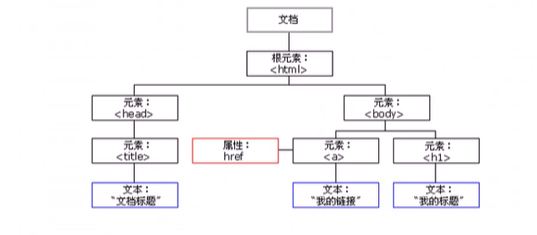
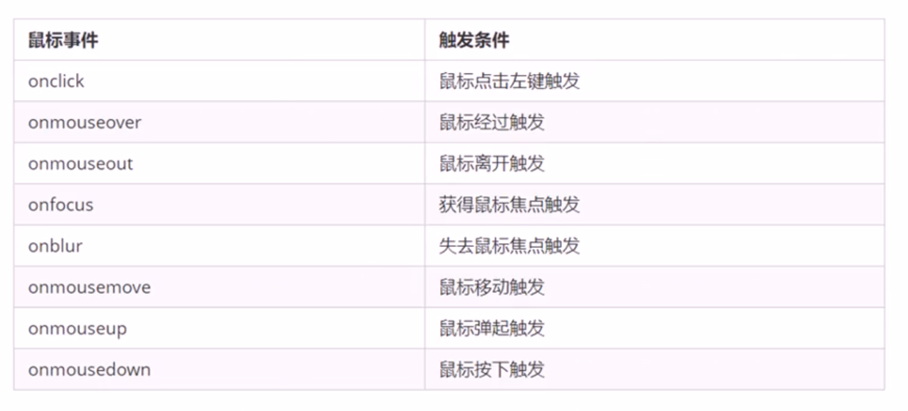
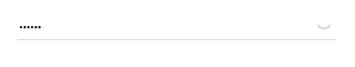
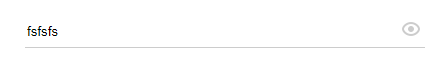
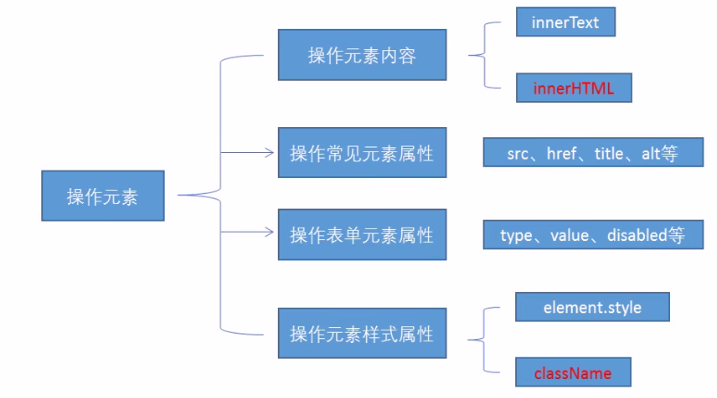

# 前言

API（Application Programming Interface,应用程序编程接口）是一些预先定义的函数，目的是提供应用程序与开发人员基于某软件或硬件得以访问一组例程的能力，而又无需访问源码，或理解内部工作机制的细节。

Web API是**浏览器**提供的一套**浏览器功能**和**页面元素**的API（BOM和DOM）。

MDN详细API：https://developer.mozilla.org/zh-CN/docs/Web/API

# DOM元素操作

## 什么是DOM

文档对象模型（Document Object Model,简称DOM），是W3C组织推荐的处理可扩展标记语言（HTML或者XML）的标准编程接口。

W3C已经定义了一系列的DOM接口，通过这些接口可以改变网页的内容、结构和样式。

### DOM树



* 文档：一个页面就是一个文档，DOM中使用document表示
* 元素：页面中所有标签都是元素，DOM中使用element表示
* 节点：网页中的所有内容都是节点（标签、属性、文本、注释等），DOM中使用node表示

**DOM把以上内容看作对象**

## 获取页面元素

### 根据ID获取元素

[`Document`](https://developer.mozilla.org/zh-CN/docs/Web/API/Document)的方法 [`getElementById()`](https://developer.mozilla.org/zh-CN/docs/Web/API/Document/getElementById)返回一个匹配特定 [ID](https://developer.mozilla.org/en-US/docs/Web/API/Element/id)的元素. 由于元素的 ID 在大部分情况下要求是独一无二的，这个方法自然而然地成为了一个高效查找特定元素的方法。

如果需要查找到那些没有ID 的元素，你可以考虑通过CSS选择器使用 [`querySelector()`](https://developer.mozilla.org/zh-CN/docs/Web/API/Document/querySelector)

语法是

```javascript
var element = document.getElementById(id);
```

返回一个匹配到 ID 的 DOM [`Element`](https://developer.mozilla.org/zh-CN/docs/Web/API/Element) 对象。若在当前 [`Document`](https://developer.mozilla.org/zh-CN/docs/Web/API/Document) 下没有找到，则返回 null。

```html
<!DOCTYPE html>
<html lang="en">

<head>
    <meta charset="UTF-8">
    <meta name="viewport" content="width=device-width, initial-scale=1.0">  
    <meta http-equiv="X-UA-Compatible" content="ie=edge">
    <title>Docment</title>
</head>

<body>
    <div id="time">2021-12-6</div>
    <script>
        //1. 因为我们文档从上往下加载，所以先得有标签，所以我们script写到标签的下面
        //2. get获得element元素by通过 驼峰命名法
        //3. 参数id是大小写敏感的字符串
        //4. 返回的是一个元素对象
        var timer = document.getElementById('time');
        console.log(timer);
        console.log(typeof timer);
        //5. console.dir打印我们返回的元素对象，更好的查看里面的属性和方法
        console.dir(timer);
    </script>
</body>

</html>
```

### 根据标签名获取元素

使用`getElementsByTagName()`方法可以返回带有指定标签名的**对象的集合**

```html
<body>
    <ul>  <!--项目列表-->
        <li>知否知否，应是绿肥红瘦</li>   
        <li>知否知否，应是绿肥红瘦</li>
        <li>知否知否，应是绿肥红瘦</li>
        <li>知否知否，应是绿肥红瘦</li>
        <li>知否知否，应是绿肥红瘦</li>
    </ul>
    <script>
        // 返回的是，获取过来的元素对象的集合，以伪数组的形式存储的
        var list = document.getElementsByTagName('li');
        console.log(list);
        console.log(list[0]);
        for(var i=0;  i<list.length;  i++){
            console.log(list[i]);
        }
    </script>
</body>
```

标签内容变化，获取的对象也会相应变化，如果页面中只有一个`li`，返回的还是伪数组的形式，没有元素就是空的伪数组

还可以获取某个元素(父元素)内部所有指定标签名的子元素

```javascript
element.getElementsByTagName('标签名')；
```

注意：父元素必须是单个对象（必须指明是哪一个元素对象），获取的时候不包括父元素自己。

```html
<body>
    <ol id='ol'>  <!--项目列表-->
        <li>取特定标签下的子标签</li>   
        <li>取特定标签下的子标签</li>
        <li>取特定标签下的子标签</li>
    </ol>
    <script>
        var ol = document.getElementsByTagName('ol');
        console.log(ol[0].getElementsByTagName('li'));
        //一版用下面这种方式
        var  ol = document.getElementById('ol');
        console.log(ol.getElementsByTagName('li'));
    </script>
</body>
```

### H5新增获取元素方式

1. `document.getElementsByClassName('类名');` 根据类名返回元素对象集合
2. `document.querySelector('选择器');` 根据指定选择器返回第一个元素对象
3. `document.querySelectorAll('选择器');` 返回指定选择器的所有元素对象集合 

```html
    <div class="box">盒子1</div>
    <div class="box">盒子2</div>
    <div id='nav'>
        <ul>  <!--项目列表-->
            <li>首页</li>   
            <li>产品</li>
        </ul>
    <script>
        //1. getElementsByClassName 根据类名获得某些元素集合
        var boxs = document.getElementsByClassName('box');
        console.log(boxs);
        // 2. querySelector 返回指定选择器的第一个元素对象
        var firstBox = document.querySelector('.box'); //类名称
        console.log(firstBox); 
        var nav = document.querySelector('#nav');  //元素id
        console.log(nav);
        var li = document.querySelector('li'); //元素标签
        var allBox = document.querySelectorAll('.box');
    </script>
```

### 获取body和html元素

```html
    <script>
        //获取body元素
        var bodyEle = document.body;
        console.log(bodyEle);
        //获取html元素
        var htmlEle = document.documentElement;
        console.log(htmlEle);
    </script>
```

## 给元素注册事件

### 事件概述

JS使我们有能力创建动态页面，而事件是可以被JavaScript侦测到的行为。

简单理解：触发---响应机制

网页中的每个元素都可以产生某些可以触发JS的事件，例如，我们可以在用户点击某按钮时产生一个事件，然后去执行这些操作。

### 事件组成与操作

事件由三部分组成：

* 事件源
* 事件类型
* 事件处理程序

```html
<body>
    <button id = 'btn'>唐伯虎</button>
    <script>
        //1. 事件源获取
        var btn = document.getElementById('btn');
        //2. 绑定事件
        //3. 添加事件处理程序
        btn.onclick = function(){
            alert('点秋香');
        }
    </script>
</body>
```

常见鼠标事件




## 修改元素内容

1. `element.innerText`从起始位置到终止位置的内容，但是它去除html标签，同时空格和换行也会去掉

```html
<body>
    <button>显示当前系统时间</button>
    <div>某个时间</div>
    <script>
        //1. 事件源获取
        var btn = document.querySelector('button');
        var div = document.querySelector('div');
        //2. 注册事件
        //3. 事件处理程序
        btn.onclick = function(){
            div.innerText = getDate();
        }

        function getDate() {
            var date = new Date();
            var year = date.getFullYear();
            var month = date.getMonth() + 1;
            var dates = date.getDate();
            var day = date.getDay();
            var arr = ['星期日','星期一','星期二','星期三','星期四','星期五','星期六'];
            return '今天是：'+ year + '年' + month + '月' + dates +'日 ' + arr[day];
        }
    </script>
</body>
```

2. `element.innerHTML`起始位置到终止位置的全部内容，包括html标签，同时保留空格和换行

```html
<body>
    <button>显示当前系统时间</button>
    <div>某个时间</div>
    <script>
        var div = document.querySelector('div');
        div.innerText = '<strong>今天是</strong> 2021年12月7日'; //不会识别标签，不会加粗
        div.innerHTML = '<strong>今天是</strong> 2021年12月7日'; //会识别html，会加粗
    </script>
</body>
```

## 常用元素的属性操作

1. `innerText` 、`innerHTML` 改变元素内容
2. `src`、`href` 
3. `id`、`alt`、`title`

```html
<body>
    <button id = 'ldh'>刘德华</button>
    <button id = 'zxy'>张学友</button> <br>
    

    <script>
        //修改元素属性 src
        //1. 获取元素
        var ldh = document.getElementById('ldh');
        var zxy = document.getElementById('zxy');
        var img = document.querySelector('img');
        //2. 注册事件 处理程序
        zxy.onclick = function(){
            img.src = 'images/zxy.jpg';
        }
        ldh.onclick = function(){
            img.src = 'image/ldh.jpg';
        }
    </script>
</body>
```

## 分时显示

根据不同时间，页面显示不同图片，同时显示不同的问候语

```html
<body>
    
    <div>上午好</div>
    <script>
        // 根据系统不同时间来判断，所以需要用到日期内置对象
        // 利用多分支语句来设置不同的图片
        // 需要一个图片，并且根据时间修改图片，就需要用到操作元素src属性
        // 需要一个div元素，显示不同问候语，修改元素内容即可
        // 1.获取元素
        var img = document.querySelector('img');
        var div = document.querySelector('div');
        // 2. 得到当前的小时数
        var date = new Date();
        var h = date.getHours();
        // 3. 判断小时数改变图片和文字信息
        if (h < 12) {
            img.src = 'images/s.gif';
            div.innerHTML = '亲，上午好，好好写代码';
        } else if (h < 18) {
            img.src = 'images/x.gif';
            div.innerHTML = '亲，下午好，好好写代码';
        } else {
            img.src = 'images/w.gif';
            div.innerHTML = '亲，晚上好，好好写代码';

        }
    </script>
</body>
```

## 表单元素的属性操作

利用DOM可以操作如下表单元素的属性

`typr、value、checked、selected、disabled` 

```html
<body>
    <button>按钮</button>
    <input type="text" value="输入内容">
    <script>
        // 1. 获取元素
        var btn = document.querySelector('button');
        var input = document.querySelector('input');
        // 2. 注册事件 处理程序
        btn.onclick = function() {
            // input.innerHTML = '点击了';  这个是 普通盒子 比如 div 标签里面的内容
            // 表单里面的值 文字内容是通过 value 来修改的
            input.value = '被点击了';
            // 如果想要某个表单被禁用 不能再点击 disabled  我们想要这个按钮 button禁用
            // btn.disabled = true;
            this.disabled = true;
            // this 指向的是事件函数的调用者 btn
        }
    </script>
</body>
```

## 仿京东显示密码

效果如图





```html
<!DOCTYPE html>
<html lang="en">

<head>
    <meta charset="UTF-8">
    <meta name="viewport" content="width=device-width, initial-scale=1.0">
    <meta http-equiv="X-UA-Compatible" content="ie=edge">
    <title>Document</title>
    <style>
        .box {
            position: relative;
            width: 400px;
            border-bottom: 1px solid #ccc;
            margin: 100px auto;
        }
        .box input{
            width: 370px;
            height: 30px;
            border: 0;
            outline: none;
        }
        .box img {
            position: absolute;
            top: 2px;
            right: 2px;
            width: 24px;
        }
    </style>
</head>

<body>
    <div class="box">
        <label for="">
            
        </label>
        <input type="password" name="" id="pwd">
    </div>
    <script>
        //1.获取元素
        var eye = document.getElementById('eye');
        var pwd = document.getElementById('pwd');
        //2.注册事件 处理程序
        var flag = 0; 
        eye.onclick = function(){
            //点击一次之后，flag一定要变化
            if(flag==0){
                pwd.type = 'text';
                eye.src = 'images/open.png';
                flag = 1;
            } else {
                pwd.type = 'password';
                eye.src = 'images/close.png';
                flag = 0;
            }
        }
    </script>
</body>

</html>
```

## 样式属性操作

我们可以通过JS操作元素的大小、颜色、位置等样式

1. `element.style` 行内样式操作
2. `element.className` 类名样式操作

```html
<head>
    <meta charset="UTF-8">
    <meta name="viewport" content="width=device-width, initial-scale=1.0">
    <meta http-equiv="X-UA-Compatible" content="ie=edge">
    <title>Document</title>
    <style>
        div {
            width: 200px;
            height: 200px;
            background-color: pink;
        }
    </style>
</head>

<body>
    <div></div>
    <script>
        // 1. 获取元素
        var div = document.querySelector('div');
        // 2. 注册事件 处理程序
        div.onclick = function() {
            // div.style里面的属性 采取驼峰命名法 
            this.style.backgroundColor = 'purple';
            this.style.width = '250px';
        }
    </script>
</body>
```

* JS里面的样式采取驼峰命名法，比如`fontSize`、`backgroundColor`
* JS修改`style`样式操作，产生的是行内样式，css权重比较高

## 仿淘宝关闭二维码

利用样式的显示和隐藏完成，`display:none` 隐藏元素 `display:block`显示元素

```html
<!DOCTYPE html>
<html lang="en">

<head>
    <meta charset="UTF-8">
    <meta name="viewport" content="width=device-width, initial-scale=1.0">
    <meta http-equiv="X-UA-Compatible" content="ie=edge">
    <title>Document</title>
    <style>
        .box {
            position: relative;
            width: 74px;
            height: 88px;
            border: 1px solid #ccc;
            margin: 100px auto;
            font-size: 12px;
            text-align: center;
            color: #f40;
            /* display: block; */
        }
        
        .box img {
            width: 60px;
            margin-top: 5px;
        }
        
        .close-btn {
            position: absolute;
            top: -1px;
            left: -16px;
            width: 14px;
            height: 14px;
            border: 1px solid #ccc;
            line-height: 14px;
            font-family: Arial, Helvetica, sans-serif;
            cursor: pointer;
        }
    </style>
</head>

<body>
    <div class="box">
        淘宝二维码
        
        <i class="close-btn">×</i>
    </div>
    <script>
        // 1. 获取元素 
        var btn = document.querySelector('.close-btn');
        var box = document.querySelector('.box');
        // 2.注册事件 程序处理
        btn.onclick = function() {
            box.style.display = 'none';
        }
    </script>
</body>

</html>
```

## 循环精灵图

精灵图的排列是有规律的，利用`for`循环，修改精灵图片的背景位置`background-position` 

```html
<!DOCTYPE html>
<html lang="en">

<head>
    <meta charset="UTF-8">
    <meta name="viewport" content="width=device-width, initial-scale=1.0">
    <meta http-equiv="X-UA-Compatible" content="ie=edge">
    <title>Document</title>
    <style>
        * {
            margin: 0;
            padding: 0;
        }
        
        li {
            list-style-type: none;
        }
        
        .box {
            width: 250px;
            margin: 100px auto;
        }
        
        .box li {
            float: left;
            width: 24px;
            height: 24px;
            background-color: pink;
            margin: 15px;
            background: url(images/sprite.png) no-repeat;
        }
    </style>
</head>

<body>
    <div class="box">
        <ul>
            <li></li>
            <li></li>
            <li></li>
            <li></li>
            <li></li>
            <li></li>
            <li></li>
            <li></li>
            <li></li>
            <li></li>
            <li></li>
            <li></li>
        </ul>
    </div>
    <script>
        // 1. 获取元素 所有的小li 
        var lis = document.querySelectorAll('li');
        for (var i = 0; i < lis.length; i++) {
            // 让索引号 乘以 44 就是每个li 的背景y坐标  index就是我们的y坐标
            var index = i * 44;
            lis[i].style.backgroundPosition = '0 -' + index + 'px';
        }
    </script>
</body>

</html>
```

## 显示隐藏文本框内容

当鼠标点击文本框时，里面的默认文字隐藏，当鼠标离开文本框时，里面的文字显示

1. 首先表单需要2个新事件，获得焦点`onfocus`失去焦点`onblur`
2. 如果获得焦点，判断表单里内容是否为默认文字，如果是默认文字，就清空表单内容
3. 如果失去焦点，判断表单内容是否为空，如果为空，则表单内容改为默认文字

```html
<!DOCTYPE html>
<html lang="en">

<head>
    <meta charset="UTF-8">
    <meta name="viewport" content="width=device-width, initial-scale=1.0">
    <meta http-equiv="X-UA-Compatible" content="ie=edge">
    <title>Document</title>
    <style>
        input {
            color: #999;
        }
    </style>
</head>

<body>
    <input type="text" value="手机">
    <script>
        // 1.获取元素
        var text = document.querySelector('input');
        // 2.注册事件 获得焦点事件 onfocus 
        text.onfocus = function() {
                // console.log('得到了焦点');
                if (this.value === '手机') {
                    this.value = '';
                }
                // 获得焦点需要把文本框里面的文字颜色变黑
                this.style.color = '#333';
            }
            // 3. 注册事件 失去焦点事件 onblur
        text.onblur = function() {
            // console.log('失去了焦点');
            if (this.value === '') {
                this.value = '手机';
            }
            // 失去焦点需要把文本框里面的文字颜色变浅色
            this.style.color = '#999';
        }
    </script>

</body>

</html>
```

## 使用className修改样式属性

通过修改元素的className来更改多个样式

```html
<!DOCTYPE html>
<html lang="en">

<head>
    <meta charset="UTF-8">
    <meta name="viewport" content="width=device-width, initial-scale=1.0">
    <meta http-equiv="X-UA-Compatible" content="ie=edge">
    <title>Document</title>
    <style>
        div {
            width: 100px;
            height: 100px;
            background-color: pink;
        }
        
        .change {
            background-color: purple;
            color: #fff;
            font-size: 25px;
            margin-top: 100px;
        }
    </style>
</head>


<body>
    <div class="first">文本</div>
    <script>
        // 1. 使用 element.style 获得修改元素样式  如果样式比较少 或者 功能简单的情况下使用
        var test = document.querySelector('div');
        test.onclick = function() {
            // this.style.backgroundColor = 'purple';
            // this.style.color = '#fff';
            // this.style.fontSize = '25px';
            // this.style.marginTop = '100px';
            // 让我们当前元素的类名改为了 change

            // 2. 我们可以通过 修改元素的className更改元素的样式 适合于样式较多或者功能复杂的情况
            // 3. 如果想要保留原先的类名，我们可以这么做 多类名选择器
            //this.className = 'change';
            this.className = 'first change';
        }
    </script>
</body>

</html>
```

* 如果修改的样式过多，可以采取操作类名的方式更改元素样式
* class因为是个保留字，因此使用`className`来操作元素类名属性
* `className`会直接更改元素的类名，会覆盖原先的类名，可以使用多类名选择器

## 密码框验证信息

1. 首先判断的事件是表单失去焦点`onblur`
2. 如果输入正确则提示正确的信息，颜色为绿色，小图标变化
3. 如果输入不是6到16位，则提示错误信息颜色为红色 小图标变化
4. 因为里面变化样式较多，我们采取`className`修改样式

```html
<!DOCTYPE html>
<html lang="en">

<head>
    <meta charset="UTF-8">
    <meta name="viewport" content="width=device-width, initial-scale=1.0">
    <meta http-equiv="X-UA-Compatible" content="ie=edge">
    <title>Document</title>
    <style>
        div {
            width: 600px;
            margin: 100px auto;
        }

        .message{
            display: inline-block;
            font-size: 12px;
            color: #999;
            background: url(images/mess.png) no-repeat left center;
            padding-left: 20px;
        }

        .wrong{
            color: red;
            background-image: url(images/wrong.png);
        }

        .right{
            color: green;
            background-image: url(images/right.png);
        }
    </style>
</head>

<body>
    <div class="register">
        <input type="password" class="ipt">
        <p class="message">请输入6~16位密码</p>
    </div>
    <script>
        // 首先判断的事件是表单失去焦点 onblur
        // 如果输入正确则提示正确的信息颜色为绿色小图标变化
        // 如果输入不是6到16位，则提示错误信息颜色为红色 小图标变化
        // 因为里面变化样式较多，我们采取className修改样式
        // 1.获取元素
        var ipt = document.querySelector('.ipt');
        var message = document.querySelector('.message');
        //2. 注册事件 失去焦点
        ipt.onblur = function(){
            //根据表单里面值的长度 
            if(this.value.length < 6 || this.value.length > 16){
                //console.log('错误')；
                message.className = 'message wrong';
                message.innerHTML = '您输入的位数不是6-16位';
            } else{
                message.className = 'message right';
                message.innerHTML = '您输入的值正确';
            }
        }
    </script>
</body>

</html>
```

## 操作元素总结



##  排他思想

如果有同一组元素，我们想要某一个元素实现某种样式，需要用到循环的排他思想算法：

1. 所有元素全部清除样式(干掉其他人)
2. 给当前元素设置样式(留下我自己)
3. 注意顺序不能颠倒

```html

<body>
    <button>按钮1</button>
    <button>按钮2</button>
    <button>按钮3</button>
    <button>按钮4</button>
    <button>按钮5</button>
    <script>
        // 1. 获取所有按钮元素
        var btns = document.getElementsByTagName('button');
        // btns得到的是伪数组  里面的每一个元素 btns[i]
        for (var i = 0; i < btns.length; i++) {
            btns[i].onclick = function() {
                // (1) 我们先把所有的按钮背景颜色去掉  干掉所有人
                for (var i = 0; i < btns.length; i++) {
                    btns[i].style.backgroundColor = '';
                }
                // (2) 然后才让当前的元素背景颜色为pink 留下我自己
                this.style.backgroundColor = 'pink';

            }
        }
        //2. 首先先排除其他人，然后才设置自己的样式 这种排除其他人的思想我们成为排他思想
    </script>
</body>
```

## 百度换肤

```html
<body>
    <ul class="baidu">
        <li></li>
        <li></li>
        <li></li>
        <li></li>
    </ul>
    <script>
        // 1. 获取元素 
        var imgs = document.querySelector('.baidu').querySelectorAll('img');
        // console.log(imgs);
        // 2. 循环注册事件 
        for (var i = 0; i < imgs.length; i++) {
            imgs[i].onclick = function() {
                // this.src 就是我们点击图片的路径   images/2.jpg
                // console.log(this.src);
                // 把这个路径 this.src 给body 就可以了
                document.body.style.backgroundImage = 'url(' + this.src + ')';
            }
        }
    </script>
</body>
```

## 表格隔行变色

1. 用到新的鼠标事件 鼠标经过`onmouseover`  鼠标离开`onmouseout` 
2. 核心思路：鼠标经过tr行，当前行变背景颜色，鼠标离开去掉当前的背景颜色

```html
<head>
    <meta charset="UTF-8">
    <meta name="viewport" content="width=device-width, initial-scale=1.0">
    <meta http-equiv="X-UA-Compatible" content="ie=edge">
    <title>Document</title>
    <style>
        table {
            width: 800px;
            margin: 100px auto;
            text-align: center;
            border-collapse: collapse;
            font-size: 14px;
        }
        
        thead tr {
            height: 30px;
            background-color: skyblue;
        }
        
        tbody tr {
            height: 30px;
        }
        
        tbody td {
            border-bottom: 1px solid #d7d7d7;
            font-size: 12px;
            color: blue;
        }
        
        .bg {
            background-color: pink;
        }
    </style>
</head>

<body>
    <table>
        <thead>
            <tr>
                <th>代码</th>
                <th>名称</th>
                <th>最新公布净值</th>
                <th>累计净值</th>
                <th>前单位净值</th>
                <th>净值增长率</th>
            </tr>
        </thead>
        <tbody>
            <tr>
                <td>003526</td>
                <td>农银金穗3个月定期开放债券</td>
                <td>1.075</td>
                <td>1.079</td>
                <td>1.074</td>
                <td>+0.047%</td>
            </tr>
            <tr>
                <td>003526</td>
                <td>农银金穗3个月定期开放债券</td>
                <td>1.075</td>
                <td>1.079</td>
                <td>1.074</td>
                <td>+0.047%</td>
            </tr>
            <tr>
                <td>003526</td>
                <td>农银金穗3个月定期开放债券</td>
                <td>1.075</td>
                <td>1.079</td>
                <td>1.074</td>
                <td>+0.047%</td>
            </tr>
            <tr>
                <td>003526</td>
                <td>农银金穗3个月定期开放债券</td>
                <td>1.075</td>
                <td>1.079</td>
                <td>1.074</td>
                <td>+0.047%</td>
            </tr>
            <tr>
                <td>003526</td>
                <td>农银金穗3个月定期开放债券</td>
                <td>1.075</td>
                <td>1.079</td>
                <td>1.074</td>
                <td>+0.047%</td>
            </tr>
            <tr>
                <td>003526</td>
                <td>农银金穗3个月定期开放债券</td>
                <td>1.075</td>
                <td>1.079</td>
                <td>1.074</td>
                <td>+0.047%</td>
            </tr>
        </tbody>
    </table>
    <script>
        // 1.获取元素 获取的是 tbody 里面所有的行
        var trs = document.querySelector('tbody').querySelectorAll('tr');
        // 2. 利用循环绑定注册事件
        for (var i = 0; i < trs.length; i++) {
            // 3. 鼠标经过事件 onmouseover
            trs[i].onmouseover = function() {
                    // console.log(11);
                    this.className = 'bg';
                }
                // 4. 鼠标离开事件 onmouseout
            trs[i].onmouseout = function() {
                this.className = '';
            }
        }
    </script>
</body>
```

## 表格全选取消全选

1. 让下面所有复选框的checked属性(选中状态)跟随全选按钮即可
2. 下面复选框需要全部选中， 上面全选才能选中做法： 给下面所有复选框绑定点击事件，每次点击，都要循环查看下面所有的复选框是否有没选中的，如果有一个没选中的， 上面全选就不选中。

 ```html
    <script>
         // 1. 全选和取消全选做法：  让下面所有复选框的checked属性（选中状态） 跟随 全选按钮即可
         // 获取元素
         var j_cbAll = document.getElementById('j_cbAll'); // 全选按钮
         var j_tbs = document.getElementById('j_tb').getElementsByTagName('input'); // 下面所有的复选框
         // 注册事件
         j_cbAll.onclick = function() {
                 // this.checked 它可以得到当前复选框的选中状态如果是true 就是选中，如果是false 就是未选中
                 console.log(this.checked);
                 for (var i = 0; i < j_tbs.length; i++) {
                     j_tbs[i].checked = this.checked;
                 }
             }
             // 2. 下面复选框需要全部选中， 上面全选才能选中做法： 给下面所有复选框绑定点击事件，每次点击，都要循环查看下面所有的复选框是否有没选中的，如果有一个没选中的， 上面全选就不选中。
         for (var i = 0; i < j_tbs.length; i++) {
             j_tbs[i].onclick = function() {
                 // flag 控制全选按钮是否选中
                 var flag = true;
                 // 每次点击下面的复选框都要循环检查者4个小按钮是否全被选中
                 for (var i = 0; i < j_tbs.length; i++) {
                     if (!j_tbs[i].checked) {
                         flag = false;
                         break; // 退出for循环 这样可以提高执行效率 因为只要有一个没有选中，剩下的就无需循环判断了
                     }
                 }
                 j_cbAll.checked = flag;
             }
         }
     </script>
 ```

# 自定义属性的操作

## 获取属性值

* `element.属性` 获取属性值
* `element.getAttribute('属性')` 获取属性值

区别

* `element.属性` 获取内置属性值(元素本身自带的属性)
* `element.getAttribute('属性')`  主要获得自定义的属性（标准）程序员自定义的属性

```html
<body>
    <div id="demo" index="1" class="nav"></div>
    <script>
        var div = document.querySelector('div');
        // 1. 获取元素的属性值
        // (1) element.属性
        console.log(div.id);
        //(2) element.getAttribute('属性')  get得到获取 attribute 属性的意思 我们程序员自己添加的属性我们称为自定义属性 index
        console.log(div.getAttribute('id'));
        console.log(div.getAttribute('index'));
    </script>
</body>
```

## 设置属性值

* `element.属性 = '值'` 设置内置属性值
* `element.setAttribute('属性','值');` 

区别

* `element.属性 = '值'` 设置内置属性值
* `element.setAttribute('属性','值');` 主要设置自定义属性

```html
<body>
    <div id="demo" index="1" class="nav"></div>
    <script>
        var div = document.querySelector('div');
        // 设置元素属性值
        // (1) element.属性= '值'
        div.id = 'test';
        div.className = 'navs';
        // (2) element.setAttribute('属性', '值');  主要针对于自定义属性
        div.setAttribute('index', 2);
        div.setAttribute('class', 'footer'); // class 特殊  这里面写的就是class 不是className
    </script>
</body>
```

## 移除自定义属性

* `element.removeAttribute('属性');` 移除自定义元素的属性

```html
<body>
    <div id="demo" index="1" class="nav"></div>
    <script>
        var div = document.querySelector('div');
        // 移除属性 removeAttribute(属性)    
        div.removeAttribute('index');
    </script>
</body>
```

## Tab栏切换

1. Tab栏切换有2个大的模块
2. 上的模块选项卡，点击某一个，当前这一个底色会是红色，其余不变(排他思想)修改类名的方式
3. 下面的模块内容，会跟随上面的选项卡变化。所以下面模块变化写到点击事件里面
4. 规律：下面的模块显示内容和上面的选项卡一一对应，相匹配。
5. 核心思路：给上面的`tab_list`里面的所有小`li`添加自定义属性，属性值从0开始编号。

```html
<!DOCTYPE html>
<html lang="en">
<head>
    <meta charset="UTF-8">
    <meta name="viewport" content="width=device-width, initial-scale=1.0">
    <meta http-equiv="X-UA-Compatible" content="ie=edge">
    <title>Document</title>
    <style>
        * {
            margin: 0;
            padding: 0;
        }
        
        li {
            list-style-type: none;
        }
        
        .tab {
            width: 978px;
            margin: 100px auto;
        }
        
        .tab_list {
            height: 39px;
            border: 1px solid #ccc;
            background-color: #f1f1f1;
        }
        
        .tab_list li {
            float: left;
            height: 39px;
            line-height: 39px;
            padding: 0 20px;
            text-align: center;
            cursor: pointer;
        }
        
        .tab_list .current {
            background-color: #c81623;
            color: #fff;
        }
        
        .item_info {
            padding: 20px 0 0 20px;
        }
        
        .item {
            display: none;
        }
    </style>
</head>

<body>
    <div class="tab">
        <div class="tab_list">
            <ul>
                <li class="current">商品介绍</li>
                <li>规格与包装</li>
                <li>售后保障</li>
                <li>商品评价（50000）</li>
                <li>手机社区</li>
            </ul>
        </div>
        <div class="tab_con">
            <div class="item" style="display: block;">
                商品介绍模块内容
            </div>
            <div class="item">
                规格与包装模块内容
            </div>
            <div class="item">
                售后保障模块内容
            </div>
            <div class="item">
                商品评价（50000）模块内容
            </div>
            <div class="item">
                手机社区模块内容
            </div>

        </div>
    </div>
    <script>
        // 获取元素
        var tab_list = document.querySelector('.tab_list');
        var lis = tab_list.querySelectorAll('li');
        var items = document.querySelectorAll('.item');
        // for循环绑定点击事件
        for (var i = 0; i < lis.length; i++) {
            // 开始给5个小li 设置索引号 
            lis[i].setAttribute('index', i);
            lis[i].onclick = function() {
                // 1. 上的模块选项卡，点击某一个，当前这一个底色会是红色，其余不变（排他思想） 修改类名的方式

                // 干掉所有人 其余的li清除 class 这个类
                for (var i = 0; i < lis.length; i++) {
                    lis[i].className = '';
                }
                // 留下我自己 
                this.className = 'current';
                // 2. 下面的显示内容模块
                var index = this.getAttribute('index');
                console.log(index);
                // 干掉所有人 让其余的item 这些div 隐藏
                for (var i = 0; i < items.length; i++) {
                    items[i].style.display = 'none';
                }
                // 留下我自己 让对应的item 显示出来
                items[index].style.display = 'block';
            }
        }
    </script>
</body>

</html>
```

## H5自定义属性

**自定义属性目的：是为了保存并使用数据，有些数据可以保存到页面中而不用 保存到数据库中**

自定义属性通过`getAttribute('属性')`获取

但是有些自定义属性很容易引起歧义，不容易分辨

H5新增了自定义属性：

1. H5规定自定义属性`data-`开头作为属性的名称并且赋值，比如`<div data-index= "">`
2. 兼容性获取`element.getAttribute('data-index')`，H5新增`element.dataset.index`或者`element.dataset['index']`

