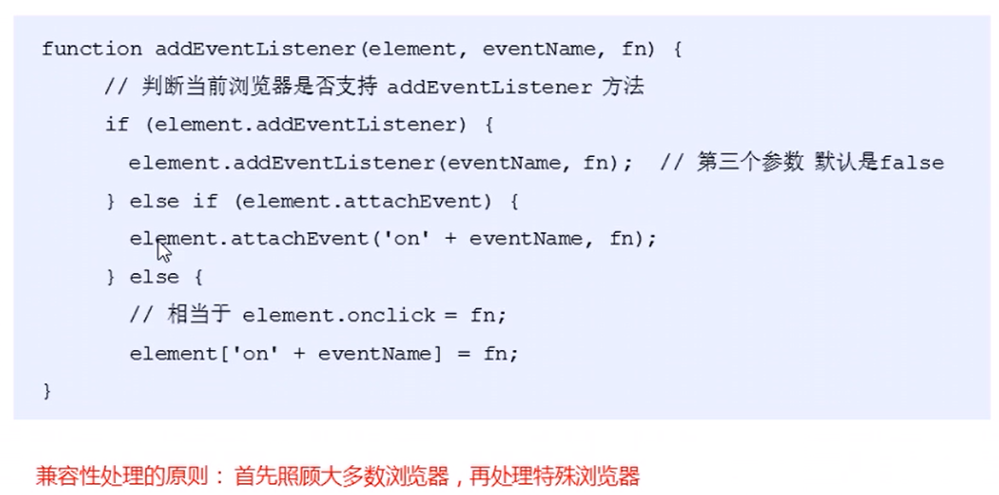

# 节点操作

## 为什么学节点操作

1. 利用DOM提供的方法获取元素
   * `document.getElementById()`
   * `document.getElementsByTagName()`
   * `document.querySelector`等
   * 逻辑性不强、繁琐
2. 利用节点层级关系获取元素
   * 利用父子兄节点关系获取元素
   * 逻辑性强，但是兼容性稍差

两种方式都可以，但是节点操作更加简单

## 节点概述

网页中所用内容都是节点（标签、属性、文本、注释等），在DOM中，节点使用node来表示

HTML DOM树中所有节点都可以通过JS访问，修改、创建和删除


一般的，节点至少拥有`nodeType(节点类型)`、`nodename(节点名称)`和`nodeValue(节点值)`这三个基本属性

* 元素节点`nodeType`为1
* 属性节点`nodeType`为2
* 文本节点`nodeType`为3（文本节点包含文字、空格、换行等）

在开发中，主要操作的还是**元素节点**

## 父级节点

`node.parentNode`

* `parentNode`属性可返回某节点的父节点，注意是**最近一个父节点**

* 如果指定节点没有父节点则返回null

## 子结点

`parentNode.childNodes(标准)`

* `parentNode.childNodes`返回包含指定节点的子节点的集合，该集合为即使更新的集合
* 子结点包含所有的子结点（元素节点，文本节点等）
* 如果只想要获得里面的元素节点，则需要专门处理，所以一般不提倡使用`childNodes`

`parentNode.children(非标准)`

* 是一个只读属性，返回所有子元素节点。它只返回子元素节点，其余节点不返回
* 虽然其是一个非标准，但是各个浏览器都支持使用

`parentNode.firstChild`

* 返回第一个子结点，找不到则返回null，包含所有子结点

`parentNode.lastChild`

* 返回最后一个子结点，找不到则返回null，包含所有子结点

`parentNode.firstElementChild`

* 返回第一个元素节点，找不到则返回null

`parentNode.lastElementChild`

* 返回最后一个子元素节点，找不到则返回null

最后两个方法有兼容性问题，IE9以上才支持

* 一般这样写`parentNode.children[0]`和`parentNode.children[parentNode.children.length-1]`

## 下拉菜单

* 导航栏里面的`li`都要有鼠标经过效果，所以需要循环注册鼠标事件
* 核心原理：当鼠标经过`li`里面的第二个孩子`ul`显示，当鼠标离开，则`ul`隐藏

```html
<!DOCTYPE html>
<html lang="en">

<head>
    <meta charset="UTF-8">
    <meta name="viewport" content="width=device-width, initial-scale=1.0">
    <meta http-equiv="X-UA-Compatible" content="ie=edge">
    <title>Document</title>
    <style>
        * {
            margin: 0;
            padding: 0;
        }
        
        li {
            list-style-type: none;
        }
        
        a {
            text-decoration: none;
            font-size: 14px;
        }
        
        .nav {
            margin: 100px;
        }
        
        .nav>li {
            position: relative;
            float: left;
            width: 80px;
            height: 41px;
            text-align: center;
        }
        
        .nav li a {
            display: block;
            width: 100%;
            height: 100%;
            line-height: 41px;
            color: #333;
        }
        
        .nav>li>a:hover {
            background-color: #eee;
        }
        
        .nav ul {
            display: none;
            position: absolute;
            top: 41px;
            left: 0;
            width: 100%;
            border-left: 1px solid #FECC5B;
            border-right: 1px solid #FECC5B;
        }
        
        .nav ul li {
            border-bottom: 1px solid #FECC5B;
        }
        
        .nav ul li a:hover {
            background-color: #FFF5DA;
        }
    </style>
</head>

<body>
    <ul class="nav">
        <li>
            <a href="#">微博</a>
            <ul>
                <li>
                    <a href="">私信</a>
                </li>
                <li>
                    <a href="">评论</a>
                </li>
                <li>
                    <a href="">@我</a>
                </li>
            </ul>
        </li>
        <li>
            <a href="#">微博</a>
            <ul>
                <li>
                    <a href="">私信</a>
                </li>
                <li>
                    <a href="">评论</a>
                </li>
                <li>
                    <a href="">@我</a>
                </li>
            </ul>
        </li>
        <li>
            <a href="#">微博</a>
            <ul>
                <li>
                    <a href="">私信</a>
                </li>
                <li>
                    <a href="">评论</a>
                </li>
                <li>
                    <a href="">@我</a>
                </li>
            </ul>
        </li>
        <li>
            <a href="#">微博</a>
            <ul>
                <li>
                    <a href="">私信</a>
                </li>
                <li>
                    <a href="">评论</a>
                </li>
                <li>
                    <a href="">@我</a>
                </li>
            </ul>
        </li>
    </ul>
    <script>
        // 1. 获取元素
        var nav = document.querySelector('.nav');
        var lis = nav.children; // 得到4个小li
        // 2.循环注册事件
        for (var i = 0; i < lis.length; i++) {
            lis[i].onmouseover = function() {
                this.children[1].style.display = 'block';
            }
            lis[i].onmouseout = function() {
                this.children[1].style.display = 'none';
            }
        }
    </script>
</body>

</html>
```

## 兄弟节点

`node.nextSibling`

* 返回当前元素的下一个兄弟节点，找不到则返回null。同样，也是包含所有的节点。

`node.previouSibling`

* 返回当前元素的上一个兄弟节点，找不到则返回null。同样，也是包含所有的节点。

`node.nextElementSibling`

* 返回当前元素的下一个兄弟元素节点，找不到则返回null

`node.previousElementSibling`

* 返回当前元素的上一个兄弟元素节点，找不到则返回null

后两个方法IE9以上才能兼容，解决兼容性问题可以自己封装一个函数

## 创建节点与添加节点

`document.createElement('tagName')`方法创建由`tagName`指定的`HTML`元素。因为这些元素原先不存在，是根据我们的需要动态生成的，所以也被称为**动态创建元素节点**

`node.appendChild()`将一个节点添加到指定父节点的子结点列表末尾。

`node.insertBefore(child,指定元素)`将一个节点添加到指定父节点的指定子结点前面。

 ```html
 <body>
     <ul>
         <li>123</li>
     </ul>
     <script>
         // 1. 创建节点元素节点
         var li = document.createElement('li');
         // 2. 添加节点 node.appendChild(child)  node 父级  child 是子级 后面追加元素  类似于数组中的push
         var ul = document.querySelector('ul');
         ul.appendChild(li);
         // 3. 添加节点 node.insertBefore(child, 指定元素);
         var lili = document.createElement('li');
         ul.insertBefore(lili, ul.children[0]);
         // 4. 我们想要页面添加一个新的元素 ： 1. 创建元素 2. 添加元素
     </script>
 </body>
 ```

## 简单版发布留言案例

1. 核心思路：点击按钮之后，就动态创建一个`li`，添加到`ul`里面
2. 创建`li`的同时，把文本域里面的值通过`li.innerHTML`赋值给`li`
3. 如果想要新的留言后面显示就用`appendChild`，如果显示在前面就用`insertBefore`

```html
<!DOCTYPE html>
<html lang="en">

<head>
    <meta charset="UTF-8">
    <meta name="viewport" content="width=device-width, initial-scale=1.0">
    <meta http-equiv="X-UA-Compatible" content="ie=edge">
    <title>Document</title>
    <style>
        * {
            margin: 0;
            padding: 0;
        }
        
        body {
            padding: 100px;
        }
        
        textarea {
            width: 200px;
            height: 100px;
            border: 1px solid pink;
            outline: none;
            resize: none;
        }
        
        ul {
            margin-top: 50px;
        }
        
        li {
            width: 300px;
            padding: 5px;
            background-color: rgb(245, 209, 243);
            color: red;
            font-size: 14px;
            margin: 15px 0;
        }
    </style>
</head>

<body>
    <textarea name="" id=""></textarea>
    <button>发布</button>
    <ul>

    </ul>
    <script>
        // 1. 获取元素
        var btn = document.querySelector('button');
        var text = document.querySelector('textarea');
        var ul = document.querySelector('ul');
        // 2. 注册事件
        btn.onclick = function() {
            if (text.value == '') {
                alert('您没有输入内容');
                return false;
            } else {
                // console.log(text.value);
                // (1) 创建元素
                var li = document.createElement('li');
                // 先有li 才能赋值
                li.innerHTML = text.value;
                // (2) 添加元素
                // ul.appendChild(li);
                ul.insertBefore(li, ul.children[0]);
            }
        }
    </script>
</body>

</html>
```

## 删除节点

`node.removeChild(child)`方法从DOM中删除一个子结点，返回删除的节点

```html
<body>
    <button>删除</button>
    <ul>
        <li>熊大</li>
        <li>熊二</li>
        <li>光头强</li>
    </ul>
    <script>
        // 1.获取元素
        var ul = document.querySelector('ul');
        var btn = document.querySelector('button');
        // 2. 删除元素  node.removeChild(child)
        // ul.removeChild(ul.children[0]);
        // 3. 点击按钮依次删除里面的孩子
        btn.onclick = function() {
            if (ul.children.length == 0) {
                this.disabled = true;
            } else {
                ul.removeChild(ul.children[0]);
            }
        }
    </script>
</body>
```

## 简单版删除留言案例

1. 当我们把文本域里面的值赋值给`li`的时候，多添加一个删除的链接
1. 需要把所有的链接获取过来，当我们点击当前的链接的时候，删除当前链接所在的`li`
1. 阻止链接跳转需要添加`javascript:void(0);`或者`javascript:;`

```html
<!DOCTYPE html>
<html lang="en">

<head>
    <meta charset="UTF-8">
    <meta name="viewport" content="width=device-width, initial-scale=1.0">
    <meta http-equiv="X-UA-Compatible" content="ie=edge">
    <title>Document</title>
    <style>
        * {
            margin: 0;
            padding: 0;
        }
        
        body {
            padding: 100px;
        }
        
        textarea {
            width: 200px;
            height: 100px;
            border: 1px solid pink;
            outline: none;
            resize: none;
        }
        
        ul {
            margin-top: 50px;
        }
        
        li {
            width: 300px;
            padding: 5px;
            background-color: rgb(245, 209, 243);
            color: red;
            font-size: 14px;
            margin: 15px 0;
        }
        
        li a {
            float: right;
        }
    </style>
</head>

<body>
    <textarea name="" id=""></textarea>
    <button>发布</button>
    <ul>

    </ul>
    <script>
        // 1. 获取元素
        var btn = document.querySelector('button');
        var text = document.querySelector('textarea');
        var ul = document.querySelector('ul');
        // 2. 注册事件
        btn.onclick = function() {
            if (text.value == '') {
                alert('您没有输入内容');
                return false;
            } else {
                // console.log(text.value);
                // (1) 创建元素
                var li = document.createElement('li');
                // 先有li 才能赋值
                li.innerHTML = text.value + "<a href='javascript:;'>删除</a>";
                // (2) 添加元素
                // ul.appendChild(li);
                ul.insertBefore(li, ul.children[0]);
                // (3) 删除元素 删除的是当前链接的li  它的父亲
                var as = document.querySelectorAll('a');
                for (var i = 0; i < as.length; i++) {
                    as[i].onclick = function() {
                        // node.removeChild(child); 删除的是 li 当前a所在的li  this.parentNode;
                        ul.removeChild(this.parentNode);
                    }
                }
            }
        }
    </script>
</body>

</html>
```

## 复制节点

`node.cloneNode()`方法返回调用该方法节点的一个副本。也称为克隆节点/拷贝节点

1. 如果方法括号里面为空，默认为`false`浅拷贝， 只复制标签不复制里面的内容
2. `node.cloneNode(true)`括号为`true` 深拷贝 复制标签复制里面的内容

```html
<body>
    <ul>
        <li>1111</li>
        <li>2</li>
        <li>3</li>
    </ul>
    <script>
        var ul = document.querySelector('ul');
        // 1. node.cloneNode(); 括号为空或者里面是false 浅拷贝 只复制标签不复制里面的内容
        // 2. node.cloneNode(true); 括号为true 深拷贝 复制标签复制里面的内容
        var lili = ul.children[0].cloneNode(true);
        ul.appendChild(lili);
    </script>
</body>
```

## 动态生成表格

1. 因为里面的学生数据都是动态的，我们需要js动态生成。这里我们模拟数据，自己定义好数据。数据我们采取对象形式存储。
2. 所有的数据都是放在`tbody`里面的行里面。
3. 因为行很多，我们需要循环创建多个行。

```html
<body>
    <table cellspacing="0">
        <thead>
            <tr>
                <th>姓名</th>
                <th>科目</th>
                <th>成绩</th>
                <th>操作</th>
            </tr>
        </thead>
        <tbody>

        </tbody>
    </table>
    <script>
        // 1.先去准备好学生的数据
        var datas = [{
            name: '魏璎珞',
            subject: 'JavaScript',
            score: 100
        }, {
            name: '弘历',
            subject: 'JavaScript',
            score: 98
        }, {
            name: '傅恒',
            subject: 'JavaScript',
            score: 99
        }, {
            name: '明玉',
            subject: 'JavaScript',
            score: 88
        }, {
            name: '大猪蹄子',
            subject: 'JavaScript',
            score: 0
        }];
        // 2. 往tbody 里面创建行： 有几个人（通过数组的长度）我们就创建几行
        var tbody = document.querySelector('tbody');
        for (var i = 0; i < datas.length; i++) { // 外面的for循环管行 tr
            // 1. 创建 tr行
            var tr = document.createElement('tr');
            tbody.appendChild(tr);
            // 2. 行里面创建单元格(跟数据有关系的3个单元格) td 单元格的数量取决于每个对象里面的属性个数  for循环遍历对象 datas[i]
            for (var k in datas[i]) { // 里面的for循环管列 td
                // 创建单元格 
                var td = document.createElement('td');
                // 把对象里面的属性值 datas[i][k] 给 td  
                // console.log(datas[i][k]);
                td.innerHTML = datas[i][k];
                tr.appendChild(td);
            }
            // 3. 创建有删除2个字的单元格 
            var td = document.createElement('td');
            td.innerHTML = '<a href="javascript:;">删除 </a>';
            tr.appendChild(td);

        }
        // 4. 删除操作 开始 
        var as = document.querySelectorAll('a');
        for (var i = 0; i < as.length; i++) {
            as[i].onclick = function() {
                // 点击a 删除 当前a 所在的行(链接的爸爸的爸爸)  node.removeChild(child)  
                tbody.removeChild(this.parentNode.parentNode)
            }
        }
        // for(var k in obj) {
        //     k 得到的是属性名
        //     obj[k] 得到是属性值
        // }
    </script>
</body>
```

## 三种动态创建元素区别

* `document.write()` 是直接将内容写入页面的内容流，但是文档流执行完毕，会导致页面全部重绘，不实用
* `element.innerHTML()` 是将内容写入某个DOM节点，不会导致页面重绘，创建多个元素效率更高（不要拼接字符串，采取数组形式拼接），结构稍微复杂。
* `document.createElement()` 创建多个元素效率稍微低一点点，但是结构更清晰。

```html
<script>
    function fn() {
        var d1 = +new Date();
        var array = [];
        for (var i = 0; i < 1000; i++) {
            array.push('<div style="width:100px; height:2px; border:1px solid blue;"></div>');
        }
        document.body.innerHTML = array.join('');
        var d2 = +new Date();
        console.log(d2 - d1);
    }
    fn();
</script>
```

# DOM事件

## 注册事件概述

给元素添加事件，称为**注册事件**或者**绑定事件**

注册事件有两种方式：**传统方式**和**方法监听注册方式**

**传统注册方式**

* 利用`on`开头的事件`onclick`
* `<button onclick="alert('hi')">按钮</button>`
* `btn.onclick=function(){}`
* 特点：注册事件的**唯一性**
* 同一个元素同一个事件只能设置一个处理函数，最后注册的处理函数将会覆盖前面注册的处理函数

**方法监听注册方式**

* w3c标准 推荐方式
* `addEventListener()`它是一个方法
* IE9之前的IE不支持此方法，可以使用`attachEvent()`代替
* 特点：同一个元素同一个事件可以注册多个监听器

## 事件监听方式

`eventTarget.addEventListener(type,listener[,useCapture])`

该方法将指定的监听器注册到`eventTarget（目标对象）上`，当该对象触发指定的事件时，就会执行事件处理函数

该方法接收三个参数：

* `type`：事件类型字符串，比如`click`、`mouseover`，注意这里不要带`on`
* `listener`: 事件处理函数，事件发生时，会调用该监听函数
* `useCapture`：可选参数，是一个布尔值，默认是`false`。

```html
<body>
    <button>传统注册事件</button>
    <button>方法监听注册事件</button>
    <button>ie9 attachEvent</button>
    <script>
        var btns = document.querySelectorAll('button');
        // 1. 传统方式注册事件
        btns[0].onclick = function() {
            alert('hi');
        }
        btns[0].onclick = function() {
                alert('hao a u');
            }
            // 2. 事件侦听注册事件 addEventListener 
            // (1) 里面的事件类型是字符串 必定加引号 而且不带on
            // (2) 同一个元素 同一个事件可以添加多个侦听器（事件处理程序）
        btns[1].addEventListener('click', function() {
            alert(22);
        })
        btns[1].addEventListener('click', function() {
                alert(33);
            })
            // 3. attachEvent ie9以前的版本支持
        btns[2].attachEvent('onclick', function() {
            alert(11);
        })
    </script>
</body>
```



## 删除事件

1. 传统注册事件`eventTarget.onclick = null;`
2. 方法监听注册方式
   * `eventTarget.removeEventListener(type,listener[,useCapture]);`
   * `eventTarget.detachEvent(eventNameWithOn, callback)`

```html
<body>
    <div>1</div>
    <div>2</div>
    <div>3</div>
    <script>
        var divs = document.querySelectorAll('div');
        divs[0].onclick = function() {
                alert(11);
                // 1. 传统方式删除事件
                divs[0].onclick = null;
            }
            // 2. removeEventListener 删除事件
        divs[1].addEventListener('click', fn) // 里面的fn 不需要调用加小括号

        function fn() {
            alert(22);
            divs[1].removeEventListener('click', fn);
        }
        // 3. detachEvent
        divs[2].attachEvent('onclick', fn1);

        function fn1() {
            alert(33);
            divs[2].detachEvent('onclick', fn1);
        }
    </script>
</body>
```


## DOM事件流

**事件流**描述的是从页面中接收事件的顺序

**事件**发生时会在元素节点之间按照特定的顺序传播，这个传播过程即DOM事件流

比如我们给一个`div`注册了点击事件：


DOM事件流分为3个阶段

1. 捕获阶段
2. 当前目标阶段
3. 冒泡阶段

**事件冒泡**：IE最早提出，事件开始时由最具体的元素接收，然后逐级向上传播到DOM最顶层节点的过程

**事件捕获**：网景最早提出，由DOM最顶层节点开始，然后逐级向下传播到最具体的元素接收的过程。

我们向水中扔一块石头，首先会有一个下降的过程，这个过程就可以理解为从最顶层向事件发生的最具体元素(目标点)的捕获过程；之后会产生泡泡，会在最低点（最具体元素）之后漂浮到水面上，这个过程相当于事件冒泡。


**注意**

* JS代码中只能执行捕获或者冒泡的其中一个阶段
* `onclick`和`attachEvent`只能得到冒泡阶段
* `addEventListener(type,listener[,useCapture])`第三个参数如果是`true`，表示在事件捕获阶段调用事件处理程序；如果是`false`，表示在事件冒泡阶段调用事件处理程序。
* 在实际开发中很少使用事件捕获，更关注事件冒泡
* 有些事件是没有冒泡的，比如`onblur、onfocus、onmouseenter、onmouseleave`

```html
<body>
    <div class="father">
        <div class="son">son盒子</div>
    </div>
    <script>
        // dom 事件流 三个阶段
        // 1. JS 代码中只能执行捕获或者冒泡其中的一个阶段。
        // 2. onclick 和 attachEvent（ie） 只能得到冒泡阶段。
        // 3. 捕获阶段 如果addEventListener 第三个参数是 true 那么则处于捕获阶段  document -> html -> body -> father -> son
        // var son = document.querySelector('.son');
        // son.addEventListener('click', function() {
        //     alert('son');
        // }, true);
        // var father = document.querySelector('.father');
        // father.addEventListener('click', function() {
        //     alert('father');
        // }, true);
        // 4. 冒泡阶段 如果addEventListener 第三个参数是 false 或者 省略 那么则处于冒泡阶段  son -> father ->body -> html -> document
        var son = document.querySelector('.son');
        son.addEventListener('click', function() {
            alert('son');
        }, false);
        var father = document.querySelector('.father');
        father.addEventListener('click', function() {
            alert('father');
        }, false);
        document.addEventListener('click', function() {
            alert('document');
        })
    </script>
</body>
```

## 事件对象

`event`对象代表事件的状态，比如键盘按键的状态、鼠标的位置、鼠标按钮的状态。

1. `event` 就是一个事件对象 写到我们侦听函数的 小括号里面 当形参来看；
2. 事件对象只有有了事件才会存在，它是系统给我们自动创建的，不需要我们传递参数；
3. 事件对象 是 我们事件的一系列相关数据的集合 跟事件相关的 比如鼠标点击里面就包含了鼠标的相关信息，鼠标坐标啊，如果是键盘事件里面就包含的键盘事件的信息 比如 判断用户按下了那个键；
4. 这个事件对象我们可以自己命名 比如 `event 、 evt、 e；`；
5. 事件对象也有兼容性问题 ie678 通过 `window.event` 兼容性的写法  `e = e || window.event;`。

```html

<body>
    <div>123</div>
    <script>
        // 事件对象
        var div = document.querySelector('div');
        div.onclick = function(e) {
                // console.log(e);
                // console.log(window.event);
                // e = e || window.event;
                console.log(e);
            }
    </script>
</body>
```

## 事件对象常见属性和方法


```html
<body>
    <div>123</div>
    <ul>
        <li>abc</li>
        <li>abc</li>
        <li>abc</li>
    </ul>
    <script>
        // 常见事件对象的属性和方法
        // 1. e.target 返回的是触发事件的对象（元素）  this 返回的是绑定事件的对象（元素）
        // 区别 ： e.target 点击了那个元素，就返回那个元素 this 那个元素绑定了这个点击事件，那么就返回谁
        var div = document.querySelector('div');
        div.addEventListener('click', function(e) {
            console.log(e.target);
            console.log(this);

        })
        var ul = document.querySelector('ul');
        ul.addEventListener('click', function(e) {
                // 我们给ul 绑定了事件  那么this 就指向ul  
                console.log(this);
                console.log(e.currentTarget);

                // e.target 指向我们点击的那个对象 谁触发了这个事件 我们点击的是li e.target 指向的就是li
                console.log(e.target);

            })
            // 了解兼容性
            // div.onclick = function(e) {
            //     e = e || window.event;
            //     var target = e.target || e.srcElement;
            //     console.log(target);

        // }
        // 2. 了解 跟 this 有个非常相似的属性 currentTarget  ie678不认识
    </script>
</body>
```

## 阻止默认事件

阻止默认行为事件

```html
<body>
    <div>123</div>
    <a href="http://www.baidu.com">百度</a>
    <form action="http://www.baidu.com">
        <input type="submit" value="提交" name="sub">
    </form>
    <script>
        // 常见事件对象的属性和方法
        // 1. 返回事件类型
        var div = document.querySelector('div');
        div.addEventListener('click', fn);
        div.addEventListener('mouseover', fn);
        div.addEventListener('mouseout', fn);

        function fn(e) {
            console.log(e.type);

        }
        // 2. 阻止默认行为（事件） 让链接不跳转 或者让提交按钮不提交
        var a = document.querySelector('a');
        a.addEventListener('click', function(e) {
                e.preventDefault(); //  dom 标准写法
            })
            // 3. 传统的注册方式
        a.onclick = function(e) {
            // 普通浏览器 e.preventDefault();  方法
            // e.preventDefault();
            // 低版本浏览器 ie678  returnValue  属性
            // e.returnValue;
            // 我们可以利用return false 也能阻止默认行为 没有兼容性问题 特点： return 后面的代码不执行了， 而且只限于传统的注册方式
            return false;
            alert(11);
        }
    </script>
</body>
```

## 阻止冒泡

事件冒泡：开始时由最具体的元素接收，然后逐级向上传播到DOM最顶层节点

事件冒泡本身的特性，会带来坏处也会带来好处

* 标准写法：利用事件对象里面的`stopPropagation()`方法
* 非标准写法：IE6-8利用事件对象`cancelBubble`属性

```html
<body>
    <div class="father">
        <div class="son">son儿子</div>
    </div>
    <script>
        // 常见事件对象的属性和方法
        // 阻止冒泡  dom 推荐的标准 stopPropagation() 
        var son = document.querySelector('.son');
        son.addEventListener('click', function(e) {
            alert('son');
            e.stopPropagation(); // stop 停止  Propagation 传播
            e.cancelBubble = true; // 非标准 cancel 取消 bubble 泡泡
        }, false);

        var father = document.querySelector('.father');
        father.addEventListener('click', function() {
            alert('father');
        }, false);
        document.addEventListener('click', function() {
            alert('document');
        })
    </script>
</body>
```

## 事件委托

班里有100个学生，快递员有100个快递，学生们需要分别领取自己的快递

解决方案：快递员把100个快递，**委托**给班主任，班主任把这些快递放到办公室里，同学们下课自行领取即可

**事件委托**也称为事件代理，在`jQuery`里面称为事件委派

**原理：不是每个子节点单独设置事件监听器，而是事件监听器设置在其父节点上，然后利用冒泡原理影响设置每个子节点**

案例：给`ul`注册点击事件，然后利用事件对象的target来找到当前点击的`li`，因为点击`li`,事件会冒泡到`ul`上，`ul`有注册事件，就会触发事件监听器。

**作用：我们只操作了一次DOM，提高了程序性能**

```html

<body>
    <ul>
        <li>知否知否，点我应有弹框在手！</li>
        <li>知否知否，点我应有弹框在手！</li>
        <li>知否知否，点我应有弹框在手！</li>
        <li>知否知否，点我应有弹框在手！</li>
        <li>知否知否，点我应有弹框在手！</li>
    </ul>
    <script>
        // 事件委托的核心原理：给父节点添加侦听器， 利用事件冒泡影响每一个子节点
        var ul = document.querySelector('ul');
        ul.addEventListener('click', function(e) {
            // alert('知否知否，点我应有弹框在手！');
            // e.target 这个可以得到我们点击的对象
            e.target.style.backgroundColor = 'pink';
        })
    </script>
</body>
```

##  禁止选中文字和禁止右键菜单

1. 禁止鼠标右键菜单

   `contextmenu`主要控制应该何时显示上下文菜单

   ```javascript
   document.addEventListener('contextmenu',function(e){
       e.preventDefault();
   })
   ```

2. 禁止鼠标选中(selectstart 开始选中)

   ```javascript
   document.addEventListener('selectstart', function(e){
       e.preventDefault();
   })
   ```

## 鼠标事件对象

`event`对象代表事件的状态，跟事件相关的一系列信息的集合。现阶段我们主要是用 鼠标事件对象`MouseEvent`和键盘事件对象`KeyboardEvent`


```html
<body>
    <script>
        // 鼠标事件对象 MouseEvent
        document.addEventListener('click', function(e) {
            // 1. client 鼠标在可视区的x和y坐标
            console.log(e.clientX);
            console.log(e.clientY);
            console.log('---------------------');

            // 2. page 鼠标在页面文档的x和y坐标
            console.log(e.pageX);
            console.log(e.pageY);
            console.log('---------------------');

            // 3. screen 鼠标在电脑屏幕的x和y坐标
            console.log(e.screenX);
            console.log(e.screenY);

        })
    </script>
</body>
```

## 跟随鼠标

1. 鼠标不断移动，使用鼠标移动事件
2. 在页面中移动，给`document`注册事件
3. 图片要移动距离，而且不占位置，我们使用绝对定位即可

```javascript
<body>
    
    <script>
        var pic = document.querySelector('img');
        document.addEventListener('mousemove', function(e) {
            // 1. mousemove只要我们鼠标移动1px 就会触发这个事件
            // console.log(1);
            // 2.核心原理： 每次鼠标移动，我们都会获得最新的鼠标坐标， 把这个x和y坐标做为图片的top和left 值就可以移动图片
            var x = e.pageX;
            var y = e.pageY;
            console.log('x坐标是' + x, 'y坐标是' + y);
            //3 . 千万不要忘记给left 和top 添加px 单位
            pic.style.left = x - 50 + 'px';
            pic.style.top = y - 40 + 'px';


        });
    </script>
</body>
```

## 常用键盘事件


```html
<body>
    <script>
        // 常用的键盘事件
        //1. keyup 按键弹起的时候触发 
        // document.onkeyup = function() {
        //         console.log('我弹起了');

        //     }
        document.addEventListener('keyup', function() {
            console.log('我弹起了');
        })

        //3. keypress 按键按下的时候触发  不能识别功能键 比如 ctrl shift 左右箭头啊
        document.addEventListener('keypress', function() {
                console.log('我按下了press');
            })
            //2. keydown 按键按下的时候触发  能识别功能键 比如 ctrl shift 左右箭头啊
        document.addEventListener('keydown', function() {
                console.log('我按下了down');
            })
            // 4. 三个事件的执行顺序  keydown -- keypress -- keyup
    </script>
</body>
```

## 键盘事件对象

可以通过`keycode`属性来获取按键对象的ASCII码(该属性目前已废弃)

```html
<body>
    <script>
        // 键盘事件对象中的keyCode属性可以得到相应键的ASCII码值
        // 1. 我们的keyup 和keydown事件不区分字母大小写  a 和 A 得到的都是65
        // 2. 我们的keypress 事件 区分字母大小写  a  97 和 A 得到的是65
        document.addEventListener('keyup', function(e) {
            // console.log(e);
            console.log('up:' + e.keyCode);
            // 我们可以利用keycode返回的ASCII码值来判断用户按下了那个键
            if (e.keyCode === 65) {
                alert('您按下的a键');
            } else {
                alert('您没有按下a键')
            }

        })
        document.addEventListener('keypress', function(e) {
            // console.log(e);
            console.log('press:' + e.keyCode);

        })
    </script>
</body>
```

## 京东搜索框输入光标定位

1. 核心思路：检测用户是否按下了s键，如果按下了s键，就把光标定位到搜索框里面
2. 使用键盘事件对象里面的`keyCode`判断用户按下的是否是s键
3. 搜索框获得焦点：使用JS里面的focus方法

```html
<body>
    <input type="text">
    <script>
        // 核心思路： 检测用户是否按下了s 键，如果按下s 键，就把光标定位到搜索框里面
        // 使用键盘事件对象里面的keyCode 判断用户按下的是否是s键
        // 搜索框获得焦点： 使用 js 里面的 focus() 方法
        var search = document.querySelector('input');
        document.addEventListener('keyup', function(e) {
            // console.log(e.keyCode);
            if (e.keyCode === 83) {
                search.focus();
            }
        })
    </script>
</body>
```

## 模拟京东快递查询单号

```html
<!DOCTYPE html>
<html lang="en">

<head>
    <meta charset="UTF-8">
    <meta name="viewport" content="width=device-width, initial-scale=1.0">
    <meta http-equiv="X-UA-Compatible" content="ie=edge">
    <title>Document</title>
    <style>
        * {
            margin: 0;
            padding: 0;
        }
        
        .search {
            position: relative;
            width: 178px;
            margin: 100px;
        }
        
        .con {
            display: none;
            position: absolute;
            top: -40px;
            width: 171px;
            border: 1px solid rgba(0, 0, 0, .2);
            box-shadow: 0 2px 4px rgba(0, 0, 0, .2);
            padding: 5px 0;
            font-size: 18px;
            line-height: 20px;
            color: #333;
        }
        
        .con::before {
            content: '';
            width: 0;
            height: 0;
            position: absolute;
            top: 28px;
            left: 18px;
            border: 8px solid #000;
            border-style: solid dashed dashed;
            border-color: #fff transparent transparent;
        }
    </style>
</head>

<body>
    <div class="search">
        <div class="con">123</div>
        <input type="text" placeholder="请输入您的快递单号" class="jd">
    </div>
    <script>
        // 快递单号输入内容时， 上面的大号字体盒子（con）显示(这里面的字号更大）
        // 表单检测用户输入： 给表单添加键盘事件
        // 同时把快递单号里面的值（value）获取过来赋值给 con盒子（innerText）做为内容
        // 如果快递单号里面内容为空，则隐藏大号字体盒子(con)盒子
        var con = document.querySelector('.con');
        var jd_input = document.querySelector('.jd');
        jd_input.addEventListener('keyup', function() {
                // console.log('输入内容啦');
                if (this.value == '') {
                    con.style.display = 'none';
                } else {
                    con.style.display = 'block';
                    con.innerText = this.value;
                }
            })
            // 当我们失去焦点，就隐藏这个con盒子
        jd_input.addEventListener('blur', function() {
                con.style.display = 'none';
            })
            // 当我们获得焦点，就显示这个con盒子
        jd_input.addEventListener('focus', function() {
            if (this.value !== '') {
                con.style.display = 'block';
            }
        })
    </script>
</body>
```


