# JavaScript的BOM知识

## BOM概述

BOM（Browser Object Model）即**浏览器对象模型**，它提供了独立于内容而与**浏览器窗口进行交互的对象**，其核心是**window**

BOM由一系列相关的对象构成，并且每个对象都提供了很多方法和属性

BOM缺乏标准，JavaScript语法的标准化组织是ECMA，DOM的标准化组织是W3C，BOM最初是Netscape浏览器标准的一部分。

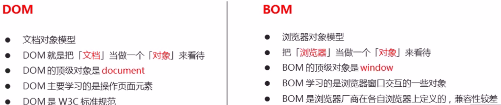

## BOM的构成

BOM比DOM更大，它包含DOM

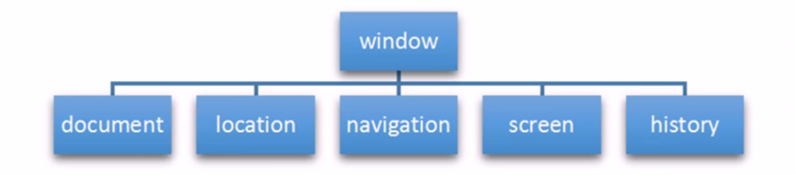

**window对象是浏览器中的顶级对象，它具有双重角色**

1. 它是JS访问浏览器窗口的一个接口。
2. 它是一个全局对象。定义在全局作用域的变量、函数都会变成window对象的属性和方法。
3. 在调用的时候可以省略window，前面学习的对话框都属于window对象方法，如`alert()`、`prompt()`等

**注意：window下的一个特殊属性window.name**

## 页面加载事件

```javascript
window.onload = function(){}
window.addEventListener("load",function(){});
```

`window.onload`是窗口（页面）加载事件，当文档内容完全加载完成会触发该事件（包括图像、脚本文件、CSS文件等），就调用的处理函数。

1. 有了`window.onload`就可以把JS代码写到页面元素的上方，因为`onload`是等页面内容全部加载完毕，再去执行处理函数。
2. `window.onload`传统注册方式只能写一次，如果有多个，会以最后一个`window.onload`为准
3. 如果使用`addEventListener`则没有限制

```javascript
document.addEventListener('DOMContentLoaded',function(){})
```

`DOMContentLoaded`事件触发时，仅当DOM加载完成，不包括样式表、图片、flash等等。IE9以上支持

如果页面图片很多的话，从用户访问到`onload`触发可能需要较长的时间，交互效果就不能实现，必然影响用户的体验，此时用DOMContentLoaded事件比较合适。

## 调整窗口大小事件

```javascript
window.onresize = function(){}
window.addEventListener("resize",function(){});
```

`window.onresize`是调整窗口大小加载事件，当触发时就调用的处理函数

我们经常利用这个事件完成响应式布局。`window.innerWidth`是当前屏幕的宽度

```html
<body>
    <script>
        window.addEventListener('load', function() {
            var div = document.querySelector('div');
            window.addEventListener('resize', function() {
                console.log(window.innerWidth);

                console.log('变化了');
                if (window.innerWidth <= 800) {
                    div.style.display = 'none';
                } else {
                    div.style.display = 'block';
                }
            })
        })
    </script>
    <div></div>
</body>
```

## setTimeout定时器

`window.setTimeout(调用函数,[延迟的毫秒数]);`方法用于设置一个定时器，该定时器在定时器到期后执行调用函数。

```html
<body>
    <script>
        // 1. setTimeout 
        // 语法规范：  window.setTimeout(调用函数, 延时时间);
        // 1. 这个window在调用的时候可以省略
        // 2. 这个延时时间单位是毫秒 但是可以省略，如果省略默认的是0
        // 3. 这个调用函数可以直接写函数 还可以写 函数名 还有一个写法 '函数名()'
        // 4. 页面中可能有很多的定时器，我们经常给定时器加标识符 （名字)
        // setTimeout(function() {
        //     console.log('时间到了');

        // }, 2000);
        function callback() {
            console.log('爆炸了');

        }
        var timer1 = setTimeout(callback, 3000);
        var timer2 = setTimeout(callback, 5000);
        // setTimeout('callback()', 3000); // 我们不提倡这个写法
    </script>
</body>
```

1. window可以省略
2. 这个调用函数可以直接写函数，或者写函数名或者采取字符串`函数名()`三种形式。第三种不推荐。
3. 延迟的毫秒数省略默认是0，如果写，必须是毫秒

## 回调函数及案例

`setTimeout()`这个调用函数我们也称为**回调函数callback**

普通函数是按照代码顺序直接调用

而这个函数，**需要等待**时间，时间到了才去调用这个函数，因此称为回调函数，之前所说的`element.onclick=function(){}`或者`element.addEventListener("click",fn)`也是回调函数

```html
<body>
    
    <script>
        var ad = document.querySelector('.ad');
        setTimeout(function() {
            ad.style.display = 'none';
        }, 5000);
    </script>
</body>
```

## 清除定时器

`window.clearTimeout(timeoutID)`，在调用函数之前停止调用函数的计时

```html
<body>
    <button>点击停止定时器</button>
    <script>
        var btn = document.querySelector('button');
        var timer = setTimeout(function() {
            console.log('爆炸了');

        }, 5000);
        btn.addEventListener('click', function() {
            clearTimeout(timer);
        })
    </script>
</body>
```

## setInterval定时器

`window.setInterval(回调函数,[间隔的毫秒数]);`方法重复调用一个函数，每隔这个时间，就去调用一次回调函数

1. windows可以省略。
2. 这个调用函数可以**直接写函数，或者写函数名**或者采取字符串`函数名()`三种形式。
3. 间隔的毫秒数省略默认是0，如果写，必须是毫秒，表示每隔多少毫秒就自动调用这个函数。
4. 因为定时器可能有很多，所以我们经常给定时器赋值一个 标识符。

```html
<body>
    <script>
        // 1. setInterval 
        // 语法规范：  window.setInterval(调用函数, 延时时间);
        setInterval(function() {
            console.log('继续输出');

        }, 1000);
        // 2. setTimeout  延时时间到了，就去调用这个回调函数，只调用一次 就结束了这个定时器
        // 3. setInterval  每隔这个延时时间，就去调用这个回调函数，会调用很多次，重复调用这个函数
    </script>
</body>
```

## 倒计时效果

1. 这个倒计时是不断变化的，因此需要定时器来自动变化(setInterval)
2. 三个黑色盒子里面分别存放时分秒
3. 三个黑色盒子利用`innerHTML`放入计算的小时分钟秒数
4. 第一次执行也是间隔毫秒数，因此刚刷新页面会有空白
5. 最好采取封装函数的方式，这样可以先调用一次这个函数，防止刚开始刷新页面有空白问题

```html
<body>
    <div>
        <span class="hour">1</span>
        <span class="minute">2</span>
        <span class="second">3</span>
    </div>
    <script>
        // 1. 获取元素 
        var hour = document.querySelector('.hour'); // 小时的黑色盒子
        var minute = document.querySelector('.minute'); // 分钟的黑色盒子
        var second = document.querySelector('.second'); // 秒数的黑色盒子
        var inputTime = +new Date('2019-5-1 18:00:00'); // 返回的是用户输入时间总的毫秒数
        countDown(); // 我们先调用一次这个函数，防止第一次刷新页面有空白 
        // 2. 开启定时器
        setInterval(countDown, 1000);

        function countDown() {
            var nowTime = +new Date(); // 返回的是当前时间总的毫秒数
            var times = (inputTime - nowTime) / 1000; // times是剩余时间总的秒数 
            var h = parseInt(times / 60 / 60 % 24); //时
            h = h < 10 ? '0' + h : h;
            hour.innerHTML = h; // 把剩余的小时给 小时黑色盒子
            var m = parseInt(times / 60 % 60); // 分
            m = m < 10 ? '0' + m : m;
            minute.innerHTML = m;
            var s = parseInt(times % 60); // 当前的秒
            s = s < 10 ? '0' + s : s;
            second.innerHTML = s;
        }
    </script>
</body>
```

## 消除间隔定时器

`window.clearInterval(intervalID);` 方法取消了先前通过调用`setInterval()`建立的定时器。

**注意**

1. `window`可以省略
2. 里面的参数就是定时器的标识符

```html

<body>
    <button class="begin">开启定时器</button>
    <button class="stop">停止定时器</button>
    <script>
        var begin = document.querySelector('.begin');
        var stop = document.querySelector('.stop');
        var timer = null; // 全局变量  null是一个空对象
        begin.addEventListener('click', function() {
            timer = setInterval(function() {
                console.log('ni hao ma');

            }, 1000);
        })
        stop.addEventListener('click', function() {
            clearInterval(timer);
        })
    </script>
</body>
```

## 发送短信案例

1. 按钮点击之后，会禁用 `disabled` 为`true` 
2. 同时按钮里面的内容会变化， 注意 `button` 里面的内容通过 `innerHTML`修改
3. 里面秒数是有变化的，因此需要用到定时器
4. 定义一个变量，在定时器里面，不断递减
5. 如果变量为`0` 说明到了时间，我们需要停止定时器，并且复原按钮初始状态

```html
<body>
    手机号码： <input type="number"> <button>发送</button>
    <script>
        var btn = document.querySelector('button');
        var time = 3; // 定义剩下的秒数
        btn.addEventListener('click', function() {
            btn.disabled = true;
            var timer = setInterval(function() {
                if (time == 0) {
                    // 清除定时器和复原按钮
                    clearInterval(timer);
                    btn.disabled = false;
                    btn.innerHTML = '发送';
                    time = 3; //这个3需要重新开始
                } else {
                    btn.innerHTML = '还剩下' + time + '秒';
                    time--;
                }
            }, 1000);

        })
    </script>
</body>
```

## this的指向问题

`this`的指向在函数定义的时候是确定不了的，只有函数执行的时候才能确定`this`到底指向谁，一般情况下，`this`的最终指向的是调用它的对象。

```html
<body>
    <button>点击</button>
    <script>
        // this 指向问题 一般情况下this的最终指向的是那个调用它的对象

        // 1. 全局作用域或者普通函数中this指向全局对象window（ 注意定时器里面的this指向window）
        console.log(this);

        function fn() {
            console.log(this);

        }
        window.fn();
        window.setTimeout(function() {
            console.log(this);

        }, 1000);
        // 2. 方法调用中谁调用this指向谁
        var o = {
            sayHi: function() {
                console.log(this); // this指向的是 o 这个对象

            }
        }
        o.sayHi();
        var btn = document.querySelector('button');
        // btn.onclick = function() {
        //     console.log(this); // this指向的是btn这个按钮对象

        // }
        btn.addEventListener('click', function() {
                console.log(this); // this指向的是btn这个按钮对象

            })
            // 3. 构造函数中this指向构造函数的实例
        function Fun() {
            console.log(this); // this 指向的是fun 实例对象

        }
        var fun = new Fun();
    </script>
</body>
```

## JS执行机制

JS的一大特点就是**单线程**，也就是说，**同一时间只能做一件事情**。

为了解决这个问题，利用多核CPU和计算能力，H5提出`Web Worker`标准，允许JS脚本创建多个线程，于是JS中出现了**同步**和**异步**。

**同步**：前一个任务结束后再执行后一个任务，程序的执行顺序与任务的排列顺序是一致的、同步的。比如做饭的同步做法：我们要烧水煮饭，等水开了，再去切菜，炒菜。

**异步**：你在做一件事情的时候，因为这件事情会花费很长时间，在做这件事情的同时，你还可以去处理其他事情。比如做饭的异步做法，我们在烧水的同时，利用这10分钟去切菜、炒菜。

## 同步异步执行

同步任务：同步任务都在主线程上个执行，形成一个**执行栈**

异步任务：JS的异步是通过回调函数实现的，一般而言，异步任务有以下三种类型：

1. 普通事件：如`click`、`resize`等
2. 资源加载，如`load`、`error`等
3. 定时器，包括`setInterval`、`setTimeout`等

异步任务相关的`回调函数`添加到**任务队列**（消息队列）中

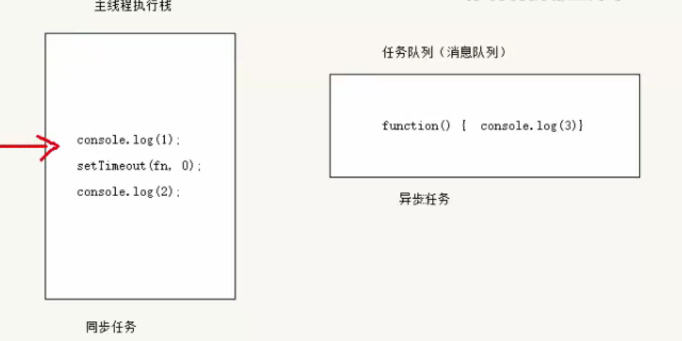

1. 先执行栈中的同步任务
2. 异步任务（回调函数）放入任务队列中
3. 一旦执行栈中的所有同步任务执行完毕，系统就会按次序读取任务队列中的异步任务，于是被读取的异步任务结束等待状态，进入执行栈，开始执行。

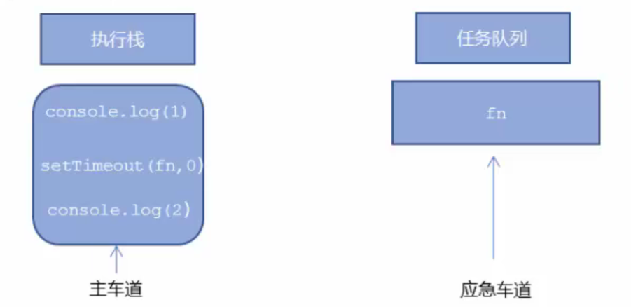

当有多个异步任务时，会提交异步进程处理（等待时间完毕）之后再进入消息队列

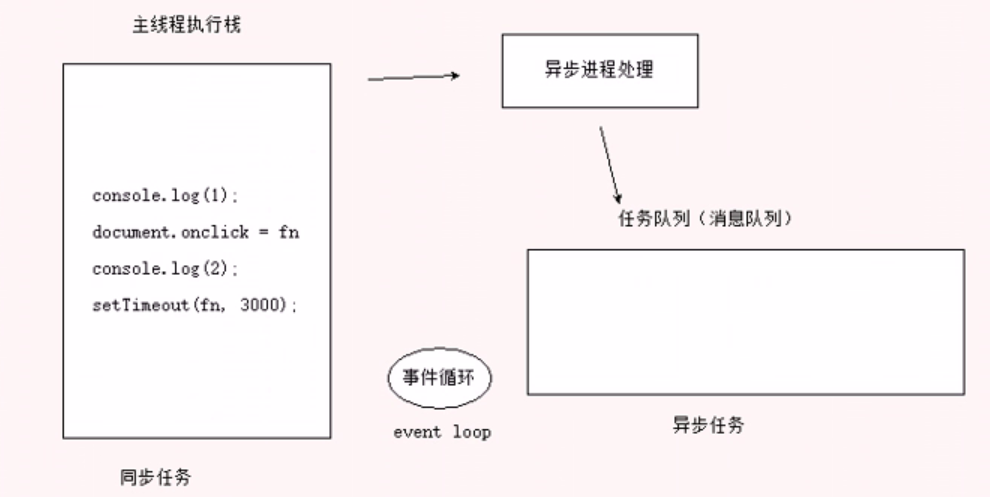

由于主线程不断的重复获得任务、执行任务、再获取任务、再执行，所以这种机制被称为**事件循环**

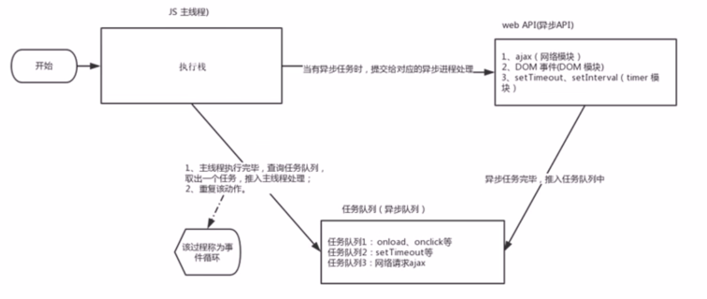

## Location对象

`统一资源定位符（Uniform Resource Locator, URL）`是互联网上标准资源的地址。互联网上的每个文件都有一个唯一的URL，它包含的信息指出文件的位置以及浏览器应该怎么处理它。

```bash
protocol://host[:post]/path/[?query]#fragment
http://www.itcast.cn/index.html?name = amdy&age=18#link
```

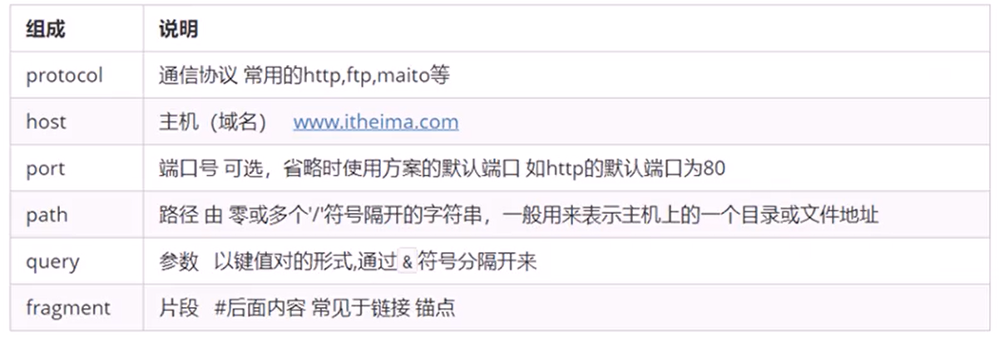

location的对象属性

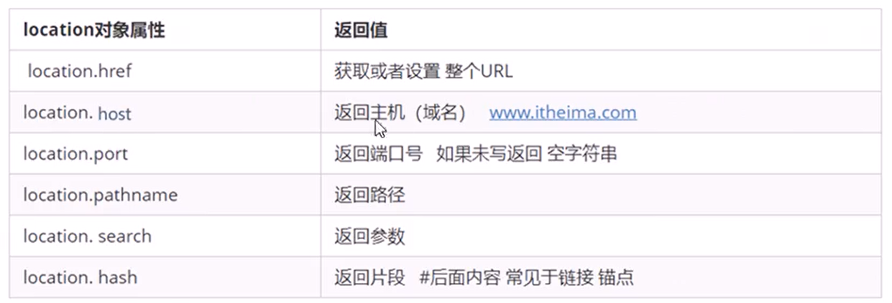

## 5秒钟自动跳转页面

1. 利用定时器做倒计时效果
2. 时间到了，就跳转页面。使用`location.href`

```html
<body>
    <button>点击</button>
    <div></div>
    <script>
        var btn = document.querySelector('button');
        var div = document.querySelector('div');
        btn.addEventListener('click', function() {
            // console.log(location.href);
            location.href = 'http://www.itcast.cn';
        })
        var timer = 5;
        setInterval(function() {
            if (timer == 0) {
                location.href = 'http://www.itcast.cn';
            } else {
                div.innerHTML = '您将在' + timer + '秒钟之后跳转到首页';
                timer--;
            }

        }, 1000);
    </script>
</body>
```

## 获取URL参数

主要练习数据在不同页面的相互传递

1. 第一个登录页面，里面有提交表单，`action`提交到了`index.html`页面
2. 第二个页面，可以使用第一个页面的参数，这样实现了一个数据不同页面之间的传递效果
3. 第二个页面之所以可以使用第一个页面的数据，是利用了URL里面的`location.search`参数
4. 在第二个页面中，需要把这个参数提取
5. 第一步去掉`?`利用`substr`
6. 第二步利用`=`号分割键和值 `split('=')`

```html
<body>
    <form action="index.html">
        用户名： <input type="text" name="uname">
        <input type="submit" value="登录">
    </form>
</body>
```

```html
<body>
    <div></div>
    <script>
        console.log(location.search); // ?uname=andy
        // 1.先去掉？  substr('起始的位置'，截取几个字符);
        var params = location.search.substr(1); // uname=andy
        console.log(params);
        // 2. 利用=把字符串分割为数组 split('=');
        var arr = params.split('=');
        console.log(arr); // ["uname", "ANDY"]
        var div = document.querySelector('div');
        // 3.把数据写入div中
        div.innerHTML = arr[1] + '欢迎您';
    </script>
</body>
```

## location对象方法

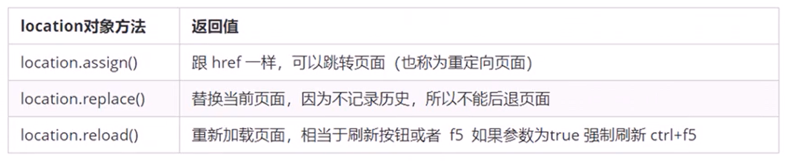

```html
<body>
    <button>点击</button>
    <script>
        var btn = document.querySelector('button');
        btn.addEventListener('click', function() {
            // 记录浏览历史，所以可以实现后退功能
            // location.assign('http://www.itcast.cn');
            // 不记录浏览历史，所以不可以实现后退功能
            // location.replace('http://www.itcast.cn');
            location.reload(true);
        })
    </script>
</body>
```

## navigator对象

`navigator`对象包含有关浏览器的信息，它有很多属性，我们最常用的是`userAgent`，该属性可以返回由客户机发送服务器的`user-agent`头部的值。

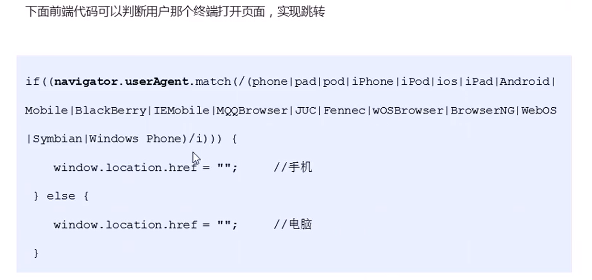

## history对象

`window`对象给我们提供了一个`history`对象，与浏览器历史记录进行交互。该对象包含用户（在浏览器窗口中）访问过的URL。

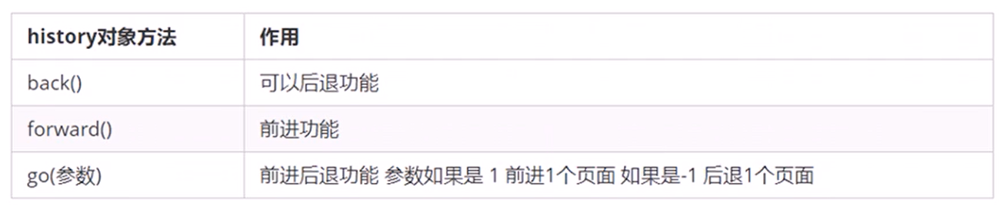

