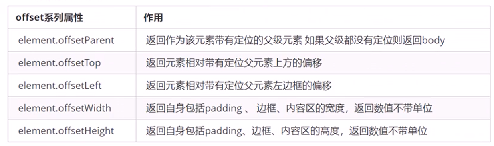
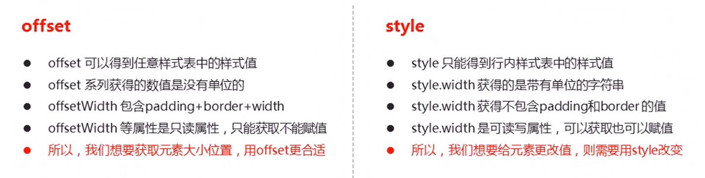
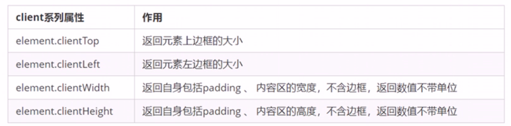
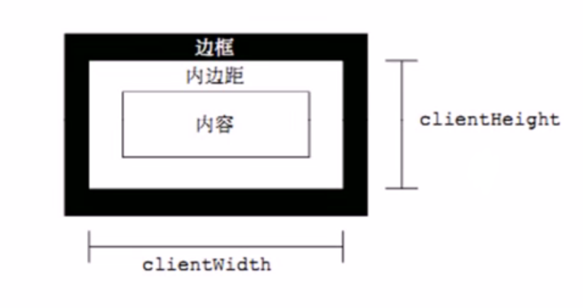
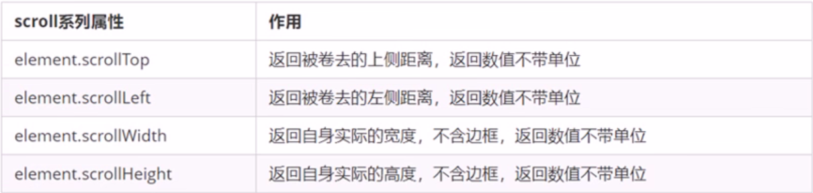
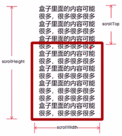
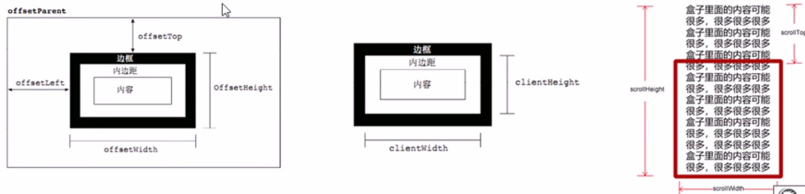

# PC端网页特效

## 元素偏移量offset

offset翻译过来就是偏移量，我们使用offset系列相关属性可以**动态的**得到该元素的位置(偏移)、大小等。

* 获得元素距离带有定位父元素的位置
* 获得元素自身的大小（宽度高度）
* 注意：返回的数值都不带单位



```html
<body>
    <div class="father">
        <div class="son"></div>
    </div>
    <div class="w"></div>
    <script>
        // offset 系列
        var father = document.querySelector('.father');
        var son = document.querySelector('.son');
        // 1.可以得到元素的偏移 位置 返回的不带单位的数值  
        console.log(father.offsetTop);
        console.log(father.offsetLeft);
        // 它以带有定位的父亲为准  如果么有父亲或者父亲没有定位 则以 body 为准
        console.log(son.offsetLeft);
        var w = document.querySelector('.w');
        // 2.可以得到元素的大小 宽度和高度 是包含padding + border + width 
        console.log(w.offsetWidth);
        console.log(w.offsetHeight);
        // 3. 返回带有定位的父亲 否则返回的是body
        console.log(son.offsetParent); // 返回带有定位的父亲 否则返回的是body
        console.log(son.parentNode); // 返回父亲 是最近一级的父亲 亲爸爸 不管父亲有没有定位
    </script>
</body>
```

## offset与style区别



## 获取鼠标在盒子内的坐标

1. 我们在盒子内点击， 想要得到鼠标距离盒子左右的距离。
2. 首先得到鼠标在页面中的坐标（ e.pageX, e.pageY）
3. 其次得到盒子在页面中的距离(box.offsetLeft, box.offsetTop)
4. 用鼠标距离页面的坐标减去盒子在页面中的距离， 得到鼠标在盒子内的坐标

```html

<body>
    <div class="box"></div>
    <script>
        var box = document.querySelector('.box');
        box.addEventListener('mousemove', function(e) {
            // console.log(e.pageX);
            // console.log(e.pageY);
            // console.log(box.offsetLeft);
            var x = e.pageX - this.offsetLeft;
            var y = e.pageY - this.offsetTop;
            this.innerHTML = 'x坐标是' + x + ' y坐标是' + y;
        })
    </script>
</body>
```

## 模态框拖拽

1. 点击弹出层，会弹出模态框，并且显示灰色半透明的遮挡层

2. 点击关闭按钮，可以关闭模态框，并且同时关闭灰色半透明遮挡层

3. 鼠标放到模态框最上面一行，可以按住鼠标拖拽模态框在页面中移动

4. 鼠标松开，可以停止拖动模态框移动

   ***

* 点击弹出层，模态框和遮挡层就会显示出来`dispaly:block;`
* 点击关闭按钮，模态框和遮挡层就会隐藏起来`display:none;`
* 在页面中拖拽的原理：鼠标按下并且移动，之后松开鼠标
* 触发事件是鼠标按下`mousedown`，鼠标移动`mousemove`鼠标松开`mouseup`
* 拖拽过程：鼠标移动过程中，获得最新的值赋值给模态框的left和top值，这样模态框就可以跟着鼠标走了
* 鼠标按下触发的事件源是 最上面一行，就是`id`为`title`
* 鼠标的坐标 减去 鼠标在盒子内的坐标，才是模态框真正的位置
* 鼠标按下，我们要得到鼠标在盒子内的坐标
* 鼠标移动，就让模态框的坐标设置为：鼠标坐标减去盒子坐标即可，注意移动事件写到按下事件里面
* 鼠标松开，就停止拖拽，就是可以让鼠标移动事件解除

```html
<body>
    <div class="login-header"><a id="link" href="javascript:;">点击，弹出登录框</a></div>
    <div id="login" class="login">
        <div id="title" class="login-title">登录会员
            <span><a id="closeBtn" href="javascript:void(0);" class="close-login">关闭</a></span>
        </div>
        <div class="login-input-content">
            <div class="login-input">
                <label>用户名：</label>
                <input type="text" placeholder="请输入用户名" name="info[username]" id="username" class="list-input">
            </div>
            <div class="login-input">
                <label>登录密码：</label>
                <input type="password" placeholder="请输入登录密码" name="info[password]" id="password" class="list-input">
            </div>
        </div>
        <div id="loginBtn" class="login-button"><a href="javascript:void(0);" id="login-button-submit">登录会员</a></div>
    </div>
    <!-- 遮盖层 -->
    <div id="bg" class="login-bg"></div>
    <script>
        // 1. 获取元素
        var login = document.querySelector('.login');
        var mask = document.querySelector('.login-bg');
        var link = document.querySelector('#link');
        var closeBtn = document.querySelector('#closeBtn');
        var title = document.querySelector('#title');
        // 2. 点击弹出层这个链接 link  让mask 和login 显示出来
        link.addEventListener('click', function() {
                mask.style.display = 'block';
                login.style.display = 'block';
            })
            // 3. 点击 closeBtn 就隐藏 mask 和 login 
        closeBtn.addEventListener('click', function() {
                mask.style.display = 'none';
                login.style.display = 'none';
            })
            // 4. 开始拖拽
            // (1) 当我们鼠标按下， 就获得鼠标在盒子内的坐标
        title.addEventListener('mousedown', function(e) {
            var x = e.pageX - login.offsetLeft;
            var y = e.pageY - login.offsetTop;
            // (2) 鼠标移动的时候，把鼠标在页面中的坐标，减去 鼠标在盒子内的坐标就是模态框的left和top值
            document.addEventListener('mousemove', move)

            function move(e) {
                login.style.left = e.pageX - x + 'px';
                login.style.top = e.pageY - y + 'px';
            }
            // (3) 鼠标弹起，就让鼠标移动事件移除
            document.addEventListener('mouseup', function() {
                document.removeEventListener('mousemove', move);
            })
        })
    </script>
</body>
```

## 京东放大镜案例

1. 整个案例可以分为三个功能模块
2. 鼠标经过小图片盒子，黄色的遮挡层和 大图片盒子显示，离开隐藏2个盒子功能
3. 黄色的遮挡层跟随鼠标功能
4. 移动黄色遮挡层，大图片跟随移动功能

```javascript
window.addEventListener('load', function() {
    var preview_img = document.querySelector('.preview_img');
    var mask = document.querySelector('.mask');
    var big = document.querySelector('.big');
    // 1. 当我们鼠标经过 preview_img 就显示和隐藏 mask 遮挡层 和 big 大盒子
    preview_img.addEventListener('mouseover', function() {
        mask.style.display = 'block';
        big.style.display = 'block';
    })
    preview_img.addEventListener('mouseout', function() {
            mask.style.display = 'none';
            big.style.display = 'none';
        })
        // 2. 鼠标移动的时候，让黄色的盒子跟着鼠标来走
    preview_img.addEventListener('mousemove', function(e) {
        // (1). 先计算出鼠标在盒子内的坐标
        var x = e.pageX - this.offsetLeft;
        var y = e.pageY - this.offsetTop;
        // console.log(x, y);
        // (2) 减去盒子高度 300的一半 是 150 就是我们mask 的最终 left 和top值了
        // (3) 我们mask 移动的距离
        var maskX = x - mask.offsetWidth / 2;
        var maskY = y - mask.offsetHeight / 2;
        // (4) 如果x 坐标小于了0 就让他停在0 的位置
        // 遮挡层的最大移动距离
        var maskMax = preview_img.offsetWidth - mask.offsetWidth;
        if (maskX <= 0) {
            maskX = 0;
        } else if (maskX >= maskMax) {
            maskX = maskMax;
        }
        if (maskY <= 0) {
            maskY = 0;
        } else if (maskY >= maskMax) {
            maskY = maskMax;
        }
        mask.style.left = maskX + 'px';
        mask.style.top = maskY + 'px';
        // 3. 大图片的移动距离 = 遮挡层移动距离 * 大图片最大移动距离 / 遮挡层的最大移动距离
        // 大图
        var bigIMg = document.querySelector('.bigImg');
        // 大图片最大移动距离
        var bigMax = bigIMg.offsetWidth - big.offsetWidth;
        // 大图片的移动距离 X Y
        var bigX = maskX * bigMax / maskMax;
        var bigY = maskY * bigMax / maskMax;
        bigIMg.style.left = -bigX + 'px';
        bigIMg.style.top = -bigY + 'px';

    })
})
```

## 元素可视区client系列

`client`翻译过来就是客户端，我们使用`client`系列的相关属性来获取元素可视区的相关信息。通过client系列的相关属性可以动态的得到该元素的边框、元素大小等。



```html
<head>
    <meta charset="UTF-8">
    <meta name="viewport" content="width=device-width, initial-scale=1.0">
    <meta http-equiv="X-UA-Compatible" content="ie=edge">
    <title>Document</title>
    <style>
        div {
            width: 200px;
            height: 200px;
            background-color: pink;
            border: 10px solid red;
            padding: 10px;
        }
    </style>
</head>

<body>
    <div></div>
    <script>
        // client 宽度 和我们offsetWidth 最大的区别就是 不包含边框
        var div = document.querySelector('div');
        console.log(div.clientWidth);
    </script>
</body>
```




## 立即执行函数

不需要调用，立马能够自己执行的函数

```html

<body>
    <script>
        // 1.立即执行函数: 不需要调用，立马能够自己执行的函数
        function fn() {
            console.log(1);

        }
        fn();
        // 2. 写法 也可以传递参数进来
        // 1.(function() {})()    或者  2. (function(){}());
        (function(a, b) {
            console.log(a + b);
            var num = 10;
        })(1, 2); // 第二个小括号可以看做是调用函数
        (function sum(a, b) {
            console.log(a + b);
            var num = 10; // 局部变量
        }(2, 3));
        // 3. 立即执行函数最大的作用就是 独立创建了一个作用域, 里面所有的变量都是局部变量 不会有命名冲突的情况
    </script>
</body>
```

主要作用是创建了独立的作用域，不存在命名冲突的问题

## 元素滚动scroll系列

scroll翻译过来就是滚动的，我们使用scroll系列的相关属性可以动态的得到该元素的大小、滚动距离等。



```html
<body>
    <div>
        我是内容 我是内容 我是内容 我是内容 我是内容 我是内容 我是内容 我是内容 我是内容 我是内容 我是内容 我是内容 我是内容 我是内容 我是内容 我是内容 我是内容 我是内容 我是内容 我是内容 我是内容 我是内容 我是内容 我是内容 我是内容 我是内容 我是内容 我是内容 我是内容 我是内容 我是内容 我是内容 我是内容 我是内容
    </div>
    <script>
        // scroll 系列
        var div = document.querySelector('div');
        console.log(div.scrollHeight);
        console.log(div.clientHeight);
        // scroll滚动事件当我们滚动条发生变化会触发的事件
        div.addEventListener('scroll', function() {
            console.log(div.scrollTop);

        })
    </script>
</body>
```



## 淘宝固定侧边栏

1. 原先侧边栏是绝对定位
2. 当页面滚动到一定位置，侧边栏改为固定定位
3. 页面继续滚动，会让返回顶部显示出来

```html
<body>
    <div class="slider-bar">
        <span class="goBack">返回顶部</span>
    </div>
    <div class="header w">头部区域</div>
    <div class="banner w">banner区域</div>
    <div class="main w">主体部分</div>
    <script>
        //1. 获取元素
        var sliderbar = document.querySelector('.slider-bar');
        var banner = document.querySelector('.banner');
        // banner.offestTop 就是被卷去头部的大小 一定要写到滚动的外面
        var bannerTop = banner.offsetTop
            // 当我们侧边栏固定定位之后应该变化的数值
        var sliderbarTop = sliderbar.offsetTop - bannerTop;
        // 获取main 主体元素
        var main = document.querySelector('.main');
        var goBack = document.querySelector('.goBack');
        var mainTop = main.offsetTop;
        // 2. 页面滚动事件 scroll
        document.addEventListener('scroll', function() {
            // console.log(11);
            // window.pageYOffset 页面被卷去的头部
            // console.log(window.pageYOffset);
            // 3 .当我们页面被卷去的头部大于等于了 172 此时 侧边栏就要改为固定定位
            if (window.pageYOffset >= bannerTop) {
                sliderbar.style.position = 'fixed';
                sliderbar.style.top = sliderbarTop + 'px';
            } else {
                sliderbar.style.position = 'absolute';
                sliderbar.style.top = '300px';
            }
            // 4. 当我们页面滚动到main盒子，就显示 goback模块
            if (window.pageYOffset >= mainTop) {
                goBack.style.display = 'block';
            } else {
                goBack.style.display = 'none';
            }

        })
    </script>
</body>
```

## 三大系列比较总结

1. `element.offsetWidth` 返回自身包括`padding`、边框、内容区的宽度，返回数值不带单位
2. `element.clientWidh` 返回自身包括`padding`、内容区的宽度、不含边框、返回数值不带单位
3. `element.scrollWidth`返回自身实际的宽度、不含边框，返回数值不带单位



* offset系列经常用于获得元素位置`offsetLeft offsetTop`
* client经常用于获取元素大小 `clientWidth clientHeight`
* scroll经常用于获取滚动距离 `scrollTop scrollLeft`
* **注意页面滚动给的距离通过**`window.pageXOffset`获得

## mouseover与mouseenter区别

* 当鼠标移动到元素上时就会触发mouseenter事件
* 类似mouseover，它们两者之间的差别是
* mouseover鼠标经过自身盒子会触发，经过子盒子还会触发。mouseenter只会经过自身 盒子触发
* 之所以这样，就是因为mouseenter不会冒泡
* 跟mouseenter搭配，鼠标离开mouseleave同样不会冒泡

##  动画实现原理

**核心原理**：通过定时器`setInterval()`不断移动盒子位置

1. 获得盒子当前位置
2. 让盒子在当前位置加上一个移动距离
3. 利用定时器不断重复这个操作
4. 加一个结束定时器的条件
5. 注意此元素需要添加定位，才能使用`element.style.left`

```html
<body>
    <div></div>
    <script>
        // 动画原理
        // 1. 获得盒子当前位置  
        // 2. 让盒子在当前位置加上1个移动距离
        // 3. 利用定时器不断重复这个操作
        // 4. 加一个结束定时器的条件
        // 5. 注意此元素需要添加定位， 才能使用element.style.left
        var div = document.querySelector('div');
        var timer = setInterval(function() {
            if (div.offsetLeft >= 400) {
                // 停止动画 本质是停止定时器
                clearInterval(timer);
            }
            div.style.left = div.offsetLeft + 1 + 'px';
        }, 30);
    </script>
</body>
```

## 动画函数简单封装

注意函数要传递两个参数，**动画对象**和**移动到的距离**

```html
<body>
    <div></div>
    <span>夏雨荷</span>
    <script>
        // 简单动画函数封装obj目标对象 target 目标位置
        function animate(obj, target) {
            var timer = setInterval(function() {
                if (obj.offsetLeft >= target) {
                    // 停止动画 本质是停止定时器
                    clearInterval(timer);
                }
                obj.style.left = obj.offsetLeft + 1 + 'px';

            }, 30);
        }

        var div = document.querySelector('div');
        var span = document.querySelector('span');
        // 调用函数
        animate(div, 300);
        animate(span, 200);
    </script>
</body>
```

## 给不同对象添加不同定时器

1. 给不同的元素指定了不同的定时器，避免重复内存过多消耗
2. 当我们不断的点击按钮，这个元素的速度会越来越快，因为开启了太多的定时器，解决方案就是 让我们元素只有一个定时器执行，先清除以前的定时器，只保留当前的一个定时器执行

```html
<body>
    <button>点击夏雨荷才走</button>
    <div></div>
    <span>夏雨荷</span>
    <script>
        // var obj = {};
        // obj.name = 'andy';
        // 简单动画函数封装obj目标对象 target 目标位置
        // 给不同的元素指定了不同的定时器
        function animate(obj, target) {
            // 当我们不断的点击按钮，这个元素的速度会越来越快，因为开启了太多的定时器
            // 解决方案就是 让我们元素只有一个定时器执行
            // 先清除以前的定时器，只保留当前的一个定时器执行
            clearInterval(obj.timer);
            obj.timer = setInterval(function() {
                if (obj.offsetLeft >= target) {
                    // 停止动画 本质是停止定时器
                    clearInterval(obj.timer);
                }
                obj.style.left = obj.offsetLeft + 1 + 'px';

            }, 30);
        }

        var div = document.querySelector('div');
        var span = document.querySelector('span');
        var btn = document.querySelector('button');
        // 调用函数
        animate(div, 300);
        btn.addEventListener('click', function() {
            animate(span, 200);
        })
    </script>
</body>
```

## 缓动动画原理

缓动动画就是让元素运动速度有所变化，最常见的是让速度慢慢停下来

1. 让盒子每次移动的距离慢慢变小，速度就会慢慢落下来
2. 核心算法：(目标值-现在的位置)/10 作为每次移动的距离步长
3. 停止的条件是：让当前盒子位置等于目标位置就停止计时器
4. 注意步长值需要取整，否则有小数永远不等于额定值

```html
<body>
    <button class="btn500">点击夏雨荷到500</button>
    <button class="btn800">点击夏雨荷到800</button>
    <span>夏雨荷</span>
    <script>
        // 缓动动画函数封装obj目标对象 target 目标位置
        // 思路：
        // 1. 让盒子每次移动的距离慢慢变小， 速度就会慢慢落下来。
        // 2. 核心算法：(目标值 - 现在的位置) / 10 做为每次移动的距离 步长
        // 3. 停止的条件是： 让当前盒子位置等于目标位置就停止定时器
        function animate(obj, target) {
            // 先清除以前的定时器，只保留当前的一个定时器执行
            clearInterval(obj.timer);
            obj.timer = setInterval(function() {
                // 步长值写到定时器的里面
                // 把我们步长值改为整数 不要出现小数的问题
                // var step = Math.ceil((target - obj.offsetLeft) / 10);
                var step = (target - obj.offsetLeft) / 10;
                step = step > 0 ? Math.ceil(step) : Math.floor(step);
                if (obj.offsetLeft == target) {
                    // 停止动画 本质是停止定时器
                    clearInterval(obj.timer);
                }
                // 把每次加1 这个步长值改为一个慢慢变小的值  步长公式：(目标值 - 现在的位置) / 10
                obj.style.left = obj.offsetLeft + step + 'px';

            }, 15);
        }
        var span = document.querySelector('span');
        var btn500 = document.querySelector('.btn500');
        var btn800 = document.querySelector('.btn800');

        btn500.addEventListener('click', function() {
            // 调用函数
            animate(span, 500);
        })
        btn800.addEventListener('click', function() {
                // 调用函数
                animate(span, 800);
            })
            // 匀速动画 就是 盒子是当前的位置 +  固定的值 10 
            // 缓动动画就是  盒子当前的位置 + 变化的值(目标值 - 现在的位置) / 10）
    </script>
</body>
```

## 缓动动画添加回调函数

**回调函数原理**：函数可以作为一个参数，将这个函数作为参数传到另一个函数里面，当那个函数执行完之后，再执行传进去的这个函数，这个过程就叫做**回调**。

回调函数写的位置：定时器结束的位置

```html
<body>
    <button class="btn500">点击夏雨荷到500</button>
    <button class="btn800">点击夏雨荷到800</button>
    <span>夏雨荷</span>
    <script>
        // 缓动动画函数封装obj目标对象 target 目标位置
        // 思路：
        // 1. 让盒子每次移动的距离慢慢变小， 速度就会慢慢落下来。
        // 2. 核心算法：(目标值 - 现在的位置) / 10 做为每次移动的距离 步长
        // 3. 停止的条件是： 让当前盒子位置等于目标位置就停止定时器
        function animate(obj, target, callback) {
            // console.log(callback);  callback = function() {}  调用的时候 callback()

            // 先清除以前的定时器，只保留当前的一个定时器执行
            clearInterval(obj.timer);
            obj.timer = setInterval(function() {
                // 步长值写到定时器的里面
                // 把我们步长值改为整数 不要出现小数的问题
                // var step = Math.ceil((target - obj.offsetLeft) / 10);
                var step = (target - obj.offsetLeft) / 10;
                step = step > 0 ? Math.ceil(step) : Math.floor(step);
                if (obj.offsetLeft == target) {
                    // 停止动画 本质是停止定时器
                    clearInterval(obj.timer);
                    // 回调函数写到定时器结束里面
                    if (callback) {
                        // 调用函数
                        callback();
                    }
                }
                // 把每次加1 这个步长值改为一个慢慢变小的值  步长公式：(目标值 - 现在的位置) / 10
                obj.style.left = obj.offsetLeft + step + 'px';

            }, 15);
        }
        var span = document.querySelector('span');
        var btn500 = document.querySelector('.btn500');
        var btn800 = document.querySelector('.btn800');

        btn500.addEventListener('click', function() {
            // 调用函数
            animate(span, 500);
        })
        btn800.addEventListener('click', function() {
                // 调用函数
                animate(span, 800, function() {
                    // alert('你好吗');
                    span.style.backgroundColor = 'red';
                });
            })
            // 匀速动画 就是 盒子是当前的位置 +  固定的值 10 
            // 缓动动画就是  盒子当前的位置 + 变化的值(目标值 - 现在的位置) / 10）
    </script>
</body>
```

## 动画函数的使用

因为以后经常使用这个动画函数，可以单独封装到一个JS文件里面，使用的时候引用这个JS文件即可。

```javascript
function animate(obj, target, callback) {
    // console.log(callback);  callback = function() {}  调用的时候 callback()

    // 先清除以前的定时器，只保留当前的一个定时器执行
    clearInterval(obj.timer);
    obj.timer = setInterval(function() {
        // 步长值写到定时器的里面
        // 把我们步长值改为整数 不要出现小数的问题
        // var step = Math.ceil((target - obj.offsetLeft) / 10);
        var step = (target - obj.offsetLeft) / 10;
        step = step > 0 ? Math.ceil(step) : Math.floor(step);
        if (obj.offsetLeft == target) {
            // 停止动画 本质是停止定时器
            clearInterval(obj.timer);
            // 回调函数写到定时器结束里面
            // if (callback) {
            //     // 调用函数
            //     callback();
            // }
            callback && callback();
        }
        // 把每次加1 这个步长值改为一个慢慢变小的值  步长公式：(目标值 - 现在的位置) / 10
        obj.style.left = obj.offsetLeft + step + 'px';

    }, 15);
}
```

引用动画函数

```html
<head>
    <meta charset="UTF-8">
    <meta name="viewport" content="width=device-width, initial-scale=1.0">
    <meta http-equiv="X-UA-Compatible" content="ie=edge">
    <title>Document</title>
    <style>
        .sliderbar {
            position: fixed;
            right: 0;
            bottom: 100px;
            width: 40px;
            height: 40px;
            text-align: center;
            line-height: 40px;
            cursor: pointer;
            color: #fff;
        }
        
        .con {
            position: absolute;
            left: 0;
            top: 0;
            width: 200px;
            height: 40px;
            background-color: purple;
            z-index: -1;
        }
    </style>
    <script src="animate.js"></script>
</head>

<body>
    <div class="sliderbar">
        <span>←</span>
        <div class="con">问题反馈</div>
    </div>

    <script>
        // 1. 获取元素
        var sliderbar = document.querySelector('.sliderbar');
        var con = document.querySelector('.con');
        // 当我们鼠标经过 sliderbar 就会让 con这个盒子滑动到左侧
        // 当我们鼠标离开 sliderbar 就会让 con这个盒子滑动到右侧
        sliderbar.addEventListener('mouseenter', function() {
            // animate(obj, target, callback);
            animate(con, -160, function() {
                // 当我们动画执行完毕，就把 ← 改为 →
                sliderbar.children[0].innerHTML = '→';
            });

        })
        sliderbar.addEventListener('mouseleave', function() {
            // animate(obj, target, callback);
            animate(con, 0, function() {
                sliderbar.children[0].innerHTML = '←';
            });

        })
    </script>
</body>
```

## 网页轮播图

1. 鼠标经过轮播图模块，左右按钮显示，离开隐藏左右按钮
2. 点击右侧按钮一次，图片往左播放一张，以此类推，左侧按钮同理
3. 图片播放的同时，下面小圆圈模块跟随着一起变化
4. 点击小圆圈，可以播放响应图片
5. 鼠标不经过轮播图，轮播图也会自动播放图片
6. 鼠标经过轮播图模块，自动播放停止

## 节流阀以及逻辑中断应用

防止轮播图按钮连续点击造成播放过快。

节流阀目的：当上一个函数动画内容执行完毕，再去执行下一个函数动画，让事件无法连续触发

核心实现思路：利用回调函数，添加一个变量来控制，锁住函数和解锁函数

```javascript
window.addEventListener('load', function() {
    // 1. 获取元素
    var arrow_l = document.querySelector('.arrow-l');
    var arrow_r = document.querySelector('.arrow-r');
    var focus = document.querySelector('.focus');
    var focusWidth = focus.offsetWidth;
    // 2. 鼠标经过focus 就显示隐藏左右按钮
    focus.addEventListener('mouseenter', function() {
        arrow_l.style.display = 'block';
        arrow_r.style.display = 'block';
        clearInterval(timer);
        timer = null; // 清除定时器变量
    });
    focus.addEventListener('mouseleave', function() {
        arrow_l.style.display = 'none';
        arrow_r.style.display = 'none';
        timer = setInterval(function() {
            //手动调用点击事件
            arrow_r.click();
        }, 2000);
    });
    // 3. 动态生成小圆圈  有几张图片，我就生成几个小圆圈
    var ul = focus.querySelector('ul');
    var ol = focus.querySelector('.circle');
    // console.log(ul.children.length);
    for (var i = 0; i < ul.children.length; i++) {
        // 创建一个小li 
        var li = document.createElement('li');
        // 记录当前小圆圈的索引号 通过自定义属性来做 
        li.setAttribute('index', i);
        // 把小li插入到ol 里面
        ol.appendChild(li);
        // 4. 小圆圈的排他思想 我们可以直接在生成小圆圈的同时直接绑定点击事件
        li.addEventListener('click', function() {
            // 干掉所有人 把所有的小li 清除 current 类名
            for (var i = 0; i < ol.children.length; i++) {
                ol.children[i].className = '';
            }
            // 留下我自己  当前的小li 设置current 类名
            this.className = 'current';
            // 5. 点击小圆圈，移动图片 当然移动的是 ul 
            // ul 的移动距离 小圆圈的索引号 乘以 图片的宽度 注意是负值
            // 当我们点击了某个小li 就拿到当前小li 的索引号
            var index = this.getAttribute('index');
            // 当我们点击了某个小li 就要把这个li 的索引号给 num  
            num = index;
            // 当我们点击了某个小li 就要把这个li 的索引号给 circle  
            circle = index;
            // num = circle = index;
            console.log(focusWidth);
            console.log(index);

            animate(ul, -index * focusWidth);
        })
    }
    // 把ol里面的第一个小li设置类名为 current
    ol.children[0].className = 'current';
    // 6. 克隆第一张图片(li)放到ul 最后面
    var first = ul.children[0].cloneNode(true);
    ul.appendChild(first);
    // 7. 点击右侧按钮， 图片滚动一张
    var num = 0;
    // circle 控制小圆圈的播放
    var circle = 0;
    // flag 节流阀
    var flag = true;
    arrow_r.addEventListener('click', function() {
        if (flag) {
            flag = false; // 关闭节流阀
            // 如果走到了最后复制的一张图片，此时 我们的ul 要快速复原 left 改为 0
            if (num == ul.children.length - 1) {
                ul.style.left = 0;
                num = 0;
            }
            num++;
            animate(ul, -num * focusWidth, function() {
                flag = true; // 打开节流阀
            });
            // 8. 点击右侧按钮，小圆圈跟随一起变化 可以再声明一个变量控制小圆圈的播放
            circle++;
            // 如果circle == 4 说明走到最后我们克隆的这张图片了 我们就复原
            if (circle == ol.children.length) {
                circle = 0;
            }
            // 调用函数
            circleChange();
        }
    });

    // 9. 左侧按钮做法
    arrow_l.addEventListener('click', function() {
        if (flag) {
            flag = false;
            if (num == 0) {
                num = ul.children.length - 1;
                ul.style.left = -num * focusWidth + 'px';

            }
            num--;
            animate(ul, -num * focusWidth, function() {
                flag = true;
            });
            // 点击左侧按钮，小圆圈跟随一起变化 可以再声明一个变量控制小圆圈的播放
            circle--;
            // 如果circle < 0  说明第一张图片，则小圆圈要改为第4个小圆圈（3）
            // if (circle < 0) {
            //     circle = ol.children.length - 1;
            // }
            circle = circle < 0 ? ol.children.length - 1 : circle;
            // 调用函数
            circleChange();
        }
    });

    function circleChange() {
        // 先清除其余小圆圈的current类名
        for (var i = 0; i < ol.children.length; i++) {
            ol.children[i].className = '';
        }
        // 留下当前的小圆圈的current类名
        ol.children[circle].className = 'current';
    }
    // 10. 自动播放轮播图
    var timer = setInterval(function() {
        //手动调用点击事件
        arrow_r.click();
    }, 2000);

})
```

## 返回顶部

滚动窗口至文档中的特定位置

`window.scroll(x,y)`

1. 带有动画的返回顶部
2. 此时可以继续使用我们封装的动画函数
3. 只需要把所有的`left`相关的值改为跟页面垂直滚动距离相关就可以了
4. 页面滚动了多少，可以通过`window.pageYOffset`得到

```html
<body>
    <div class="slider-bar">
        <span class="goBack">返回顶部</span>
    </div>
    <div class="header w">头部区域</div>
    <div class="banner w">banner区域</div>
    <div class="main w">主体部分</div>
    <script>
        //1. 获取元素
        var sliderbar = document.querySelector('.slider-bar');
        var banner = document.querySelector('.banner');
        // banner.offestTop 就是被卷去头部的大小 一定要写到滚动的外面
        var bannerTop = banner.offsetTop
            // 当我们侧边栏固定定位之后应该变化的数值
        var sliderbarTop = sliderbar.offsetTop - bannerTop;
        // 获取main 主体元素
        var main = document.querySelector('.main');
        var goBack = document.querySelector('.goBack');
        var mainTop = main.offsetTop;
        // 2. 页面滚动事件 scroll
        document.addEventListener('scroll', function() {
                // console.log(11);
                // window.pageYOffset 页面被卷去的头部
                // console.log(window.pageYOffset);
                // 3 .当我们页面被卷去的头部大于等于了 172 此时 侧边栏就要改为固定定位
                if (window.pageYOffset >= bannerTop) {
                    sliderbar.style.position = 'fixed';
                    sliderbar.style.top = sliderbarTop + 'px';
                } else {
                    sliderbar.style.position = 'absolute';
                    sliderbar.style.top = '300px';
                }
                // 4. 当我们页面滚动到main盒子，就显示 goback模块
                if (window.pageYOffset >= mainTop) {
                    goBack.style.display = 'block';
                } else {
                    goBack.style.display = 'none';
                }

            })
            // 3. 当我们点击了返回顶部模块，就让窗口滚动的页面的最上方
        goBack.addEventListener('click', function() {
            // 里面的x和y 不跟单位的 直接写数字即可
            // window.scroll(0, 0);
            // 因为是窗口滚动 所以对象是window
            animate(window, 0);
        });
        // 动画函数
        function animate(obj, target, callback) {
            // console.log(callback);  callback = function() {}  调用的时候 callback()

            // 先清除以前的定时器，只保留当前的一个定时器执行
            clearInterval(obj.timer);
            obj.timer = setInterval(function() {
                // 步长值写到定时器的里面
                // 把我们步长值改为整数 不要出现小数的问题
                // var step = Math.ceil((target - obj.offsetLeft) / 10);
                var step = (target - window.pageYOffset) / 10;
                step = step > 0 ? Math.ceil(step) : Math.floor(step);
                if (window.pageYOffset == target) {
                    // 停止动画 本质是停止定时器
                    clearInterval(obj.timer);
                    // 回调函数写到定时器结束里面
                    // if (callback) {
                    //     // 调用函数
                    //     callback();
                    // }
                    callback && callback();
                }
                // 把每次加1 这个步长值改为一个慢慢变小的值  步长公式：(目标值 - 现在的位置) / 10
                // obj.style.left = window.pageYOffset + step + 'px';
                window.scroll(0, window.pageYOffset + step);
            }, 15);
        }
    </script>
</body>
```

## 筋斗云导航栏

1. 鼠标经过某个小`li`，筋斗云跟到当前小`li`位置

2. 鼠标离开这个小`li`，筋斗云复原为原来的位置

3. 鼠标点击了某个小`li`，筋斗云就会留在点击这个小`li`的位置

   * 利用动画函数做动画效果
   * 原先筋斗云起始位置是0
   * 鼠标经过某个小`li`，把当前小`li`的offsetLeft位置 作为目标值即可
   * 鼠标离开某个小`li`，就把目标值设为0
   * 如果点击了某个小`li`，就把`li`当前的位置存储起来，作为筋斗云的起始位置

   ```html
   <script src="animate.js"></script>
       <script>
           window.addEventListener('load', function() {
               // 1. 获取元素
               var cloud = document.querySelector('.cloud');
               var c_nav = document.querySelector('.c-nav');
               var lis = c_nav.querySelectorAll('li');
               // 2. 给所有的小li绑定事件 
               // 这个current 做为筋斗云的起始位置
               var current = 0;
               for (var i = 0; i < lis.length; i++) {
                   // (1) 鼠标经过把当前小li 的位置做为目标值
                   lis[i].addEventListener('mouseenter', function() {
                       animate(cloud, this.offsetLeft);
                   });
                   // (2) 鼠标离开就回到起始的位置 
                   lis[i].addEventListener('mouseleave', function() {
                       animate(cloud, current);
                   });
                   // (3) 当我们鼠标点击，就把当前位置做为目标值
                   lis[i].addEventListener('click', function() {
                       current = this.offsetLeft;
                   });
               }
           })
       </script>
   ```

   


 


