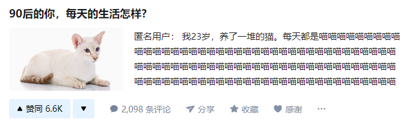
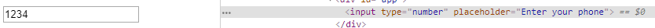

[深入理解Vue.js实战 (godbasin.github.io)](https://godbasin.github.io/vue-ebook/)

# Vue框架介绍

Vue 是一套用于构建用户界面的渐进式框架。与其它大型框架不同的是，Vue 被设计为可以自底向上逐层应用。Vue 的核心库只关注视图层，不仅易于上手，还便于与第三方库或既有项目整合。但 Vue 并不只是一个简单的视图库，通过与一系列周边工具的配合，它也可以轻易地构建大型应用。

**模板引擎**

模板引擎大概是 Vue 里最主要、又最核心的一个能力。前面也讲到，在模板引擎还没有出现的时候，前端需要手动更新前端页面的内容。

我们在 Vue 里渲染一块内容，一般会有以下流程：
(1) 解析语法生成 AST。
(2) 根据 AST 结果，完成 data 数据初始化。
(3) 根据 AST 结果和 data 数据绑定情况，生成虚拟 DOM。
(4) 将虚拟 DOM 生成真正的 DOM 插入到页面中，此时页面会被渲染。

## 解析语法生成 AST

抽象语法树（Abstract Syntax Tree）也称为 AST 语法树，指的是源代码语法所对应的树状结构。也就是说，对于一种具体编程语言下的源代码，通过构建语法树的形式将源代码中的语句映射到树中的每一个节点上。

其实我们的 DOM 结构树，也是 AST 的一种，把 HTML DOM 语法解析并生成最终的页面。而模板引擎中常用的，则是将模板语法解析，分别生成 HTML DOM，使用像 HTML 拼接这样的方式（在对应的位置绑定变量、指令解析获取拼接逻辑等等），同时配合事件的管理、虚拟 DOM 的设计，可以最大化地提升页面的性能。

### 捕获特定语法

生成 AST 的过程涉及到编译器的原理，一般经过以下过程（参考维基百科）：

(1) 语法分析。
语法分析的任务是在词法分析的基础上将单词序列组合成各类语法短语，如“程序”，“语句”，“表达式”等等。语法分析程序判断源程序在结构上是否正确，源程序的结构由上下文无关文法描述。例如 Vue 框架中，有`v-if`/`v-for`这样的指令，也有`<my-custom-component>`这样的自定义 DOM 标签，还有`@click`/`:props`这样的简化绑定语法，模板引擎需要将它们一一解析出来，并相应地进行后续的处理。

(2) 语义分析。
语义分析是编译过程的一个逻辑阶段，语义分析的任务是对结构上正确的源程序进行上下文有关性质的审查，进行类型审查。语义分析是审查源程序有无语义错误，为代码生成阶段收集类型信息，一般类型检查也会在这个过程中进行。在 Vue 框架中，例如我们绑定了某个不存在的变量或者事件，又或者是使用了某个未定义的自定义组件等，都会在这个阶段进行报错提示。

(3) 生成 AST。
AST 的结构则根据使用者需要定义，1.1.2 节中生成的一些 AST 对象都是本人根据需要假设定义的，并不完全是 Vue 中最终的实现效果。

Vue 里到底是怎样处理的呢，语法分析、语义分析基本上是通过正则的方式来处理，生成 AST 的部分我们可以看一下简化后的源码，其实就是将解析出来的元素、指令、属性、父子节点关系等内容进行处理，得到一个 AST 对象。

### DOM元素捕获

捕获一个`<div>`元素，然后生成一个`<div>`元素，例如开发者写了以下这么一段模板，我们可以对它们进行捕获：

```html
<div>
  <a>123</a>
  <p>456<span>789</span></p>
</div>
```

捕获后我们或许可以得到这样的一个对象：

```js
thisDiv = {
  dom: {
    type: "dom",
    ele: "div",
    nodeIndex: 0,
    children: [
      {
        type: "dom",
        ele: "a",
        nodeIndex: 1,
        children: [{ type: "text", value: "123" }]
      },
      {
        type: "dom",
        ele: "p",
        nodeIndex: 2,
        children: [
          { type: "text", value: "456" },
          {
            type: "dom",
            ele: "span",
            nodeIndex: 3,
            children: [{ type: "text", value: "789" }]
          }
        ]
      }
    ]
  }
};
```

我们最终会根据 AST 对象生成真实的页面片段和逻辑，实现过程其实也是将很多的特殊标识（例如元素 ID、属性标记等）打到该元素上，同时配合一些 Javascript 的元素选择方式、事件监听方式等，来将这个元素动态化（支持内容更新、节点更新）而实现最终的页面效果。

```js
// 生成一个元素
function genElement(el: ASTElement): string {
  // 根据该元素是否有相关的指令、属性语法对象，来进行对应的代码生成
  if (el.staticRoot && !el.staticProcessed) {
    return genStatic(el);
  } else if (el.once && !el.onceProcessed) {
    return genOnce(el);
  } else if (el.for && !el.forProcessed) {
    return genFor(el);
  } else if (el.if && !el.ifProcessed) {
    return genIf(el);
  } else if (el.tag === "template" && !el.slotTarget) {
    return genChildren(el) || "void 0";
  } else if (el.tag === "slot") {
    return genSlot(el);
  } else {
    // component或者element的代码生成
    let code;
    if (el.component) {
      code = genComponent(el.component, el);
    } else {
      const data = el.plain ? undefined : genData(el);

      const children = el.inlineTemplate ? null : genChildren(el, true);
      code = `_c('${el.tag}'${
        data ? `,${data}` : "" // data
      }${
        children ? `,${children}` : "" // children
      })`;
    }
    // 模块转换
    for (let i = 0; i < transforms.length; i++) {
      code = transforms[i](el, code);
    }
    // 返回最后拼装好的可执行的代码
    return code;
  }
}
```

### 模板引擎赋能

原本就是一个`<div>`，经过 AST 生成一个对象，最终还是生成一个`<div>`，这是多余的步骤吗？不是的，在这个过程中我们可以实现一些功能：
(1) 排除无效 DOM 元素，并在构建过程可进行报错。
(2) 使用自定义组件的时候，可匹配出来。
(3) 可方便地实现数据绑定、事件绑定等功能。
(4) 为虚拟 DOM Diff 过程打下铺垫。
(5) HTML 转义（预防 XSS 漏洞）。

通过通用的模板引擎，我们能处理掉很多低效又重复的工作，例如浏览器兼容、全局事件的统一管理和维护、模板更新的虚拟 DOM 机制、树状组织管理组件，而留给开发者的事情就可以少之又少。

## 虚拟DOM

虚拟 DOM 大概可分成三个过程：
(1) 用 JS 对象模拟 DOM 树，得到一棵虚拟 DOM 树。
(2) 当页面数据变更时，生成新的虚拟 DOM 树，比较新旧两棵虚拟 DOM 树的差异。
(3) 把差异应用到真正的 DOM 树上。

### 用 JS 对象模拟 DOM 树

一个真正的 DOM 元素非常庞大，拥有很多的属性值。因为一个 DOM 节点它包括了太多太多的属性、元素和事件对象，实际上我们并不是全部都会用到，通常包括节点内容、元素位置、样式、节点的添加删除等方法。所以，我们通过用 JS 对象表示 DOM 元素的方式，可以大大降低了比较差异的计算量。

看一下 Vue 源码，我们会发现 VNode 只有这些属性：

```js
tag: string | void;
data: VNodeData | void;
children: ?Array<VNode>;
text: string | void;
elm: Node | void;
ns: string | void;
context: Component | void; // rendered in this component's scope
key: string | number | void;
componentOptions: VNodeComponentOptions | void;
componentInstance: Component | void; // component instance
parent: VNode | void; // component placeholder node
// strictly internal
raw: boolean; // contains raw HTML? (server only)
isStatic: boolean; // hoisted static node
isRootInsert: boolean; // necessary for enter transition check
isComment: boolean; // empty comment placeholder?
isCloned: boolean; // is a cloned node?
isOnce: boolean; // is a v-once node?
asyncFactory: Function | void; // async component factory function
asyncMeta: Object | void;
isAsyncPlaceholder: boolean;
ssrContext: Object | void;
fnContext: Component | void; // real context vm for functional nodes
fnOptions: ?ComponentOptions; // for SSR caching
devtoolsMeta: ?Object; // used to store functional render context fordevtools
fnScopeId: ?string; // functional scope id support
```

###  比较新旧两棵虚拟 DOM 树的差异

虚拟 DOM 中，差异对比也是很关键的一步，这里简单说一下。当状态变更的时候，重新构造一棵新的对象树。然后用新的树和旧的树进行比较，记录两棵树差异。通常来说这样的差异需要记录：

- 需要替换掉原来的节点
- 移动、删除、新增子节点
- 修改了节点的属性
- 对于文本节点的文本内容改变


### 把差异应用到真正的 DOM 树上

经过差异对比之后，我们能获得一组差异记录，接下里我们需要使用它。差异记录要应用到真正的 DOM 树上，需要进行一些操作，例如节点的替换、移动、删除，文本内容的改变等。

我们来看一下，在 Vue 中是怎么进行 DOM Diff 的，虽然代码里很多函数没贴出来，但其实看函数名也可以大概理解都是什么作用，例如`updateChildren`、`addVnodes`、`removeVnodes`、`setTextContent`等，大致是个对比差异然后更新的操作：

```js
// 简单看这段代码感受下
// 对比差异然后更新
const oldCh = oldVnode.children;
const ch = vnode.children;
if (isDef(data) && isPatchable(vnode)) {
  for (i = 0; i < cbs.update.length; ++i) cbs.update[i](oldVnode, vnode);
  if (isDef((i = data.hook)) && isDef((i = i.update))) i(oldVnode, vnode);
}
if (isUndef(vnode.text)) {
  if (isDef(oldCh) && isDef(ch)) {
    if (oldCh !== ch)
      updateChildren(elm, oldCh, ch, insertedVnodeQueue, removeOnly);
  } else if (isDef(ch)) {
    if (process.env.NODE_ENV !== "production") {
      checkDuplicateKeys(ch);
    }
    if (isDef(oldVnode.text)) nodeOps.setTextContent(elm, "");
    addVnodes(elm, null, ch, 0, ch.length - 1, insertedVnodeQueue);
  } else if (isDef(oldCh)) {
    removeVnodes(elm, oldCh, 0, oldCh.length - 1);
  } else if (isDef(oldVnode.text)) {
    nodeOps.setTextContent(elm, "");
  }
} else if (oldVnode.text !== vnode.text) {
  nodeOps.setTextContent(elm, vnode.text);
}
if (isDef(data)) {
  if (isDef((i = data.hook)) && isDef((i = i.postpatch))) i(oldVnode, vnode);
}
```

页面的更新有两种方式：字符串模板和节点模板。而字符串模板`innerHTML`的方式会消耗比较多的计算，节点模板的方式又需要管理特别多的节点信息和引用保存，**使用虚拟 DOM 则可以有效地降低浏览器计算和性能**。

## 数据绑定

在 Vue 中，最基础的模板语法是数据绑定，例如：

```html
<div>{{ message }}</div>
```

这里使用插值表达式`{{}}`绑定了一个`message`的变量，开发者在 Vue 实例`data`中绑定该变量：

```js
new Vue({
  data: {
    message: "测试文本"
  }
});
```

最终页面展示内容为`<div>测试文本</div>`。这是怎么做到的呢？

### 数据绑定的实现

这种使用双大括号来绑定变量的方式，我们称之为数据绑定。它是怎么实现的呢，前面也有大致提到，数据绑定的过程其实不复杂：
(1) 解析语法生成 AST。
(2) 根据 AST 结果生成 DOM。
(3) 将数据绑定更新至模板。

上面在 Vue 里的代码片段`<div></div>`通过 DOM 元素捕获，解析后获得这样一个 AST 对象

```js
thisDiv = {
  dom: {
    type: "dom",
    ele: "div",
    nodeIndex: 0,
    children: [{ type: "text", value: "" }]
  },
  binding: [{ type: "dom", nodeIndex: 0, valueName: "message" }]
};
```

在生成一个 DOM 的时候，同时添加对`message`的监听，数据更新时我们会找到对应的`nodeIndex`，更新值：

```js
// 假设这是一个生成 DOM 的过程，包括 innerHTML 和事件监听
function generateDOM(astObject) {
  const { dom, binding = [] } = astObject;
  // 生成DOM，这里假装当前节点是baseDom
  baseDom.innerHTML = getDOMString(dom);
  // 对于数据绑定的，来进行监听更新吧
  baseDom.addEventListener("data:change", (name, value) => {
    // 寻找匹配的数据绑定
    const obj = binding.find(x => x.valueName == name);
    // 若找到值绑定的对应节点，则更新其值。
    if (obj) {
      baseDom.find(`[data-node-index="${obj.nodeIndex}"]`).innerHTML = value;
    }
  });
}

// 获取DOM字符串，这里简单拼成字符串
function getDOMString(domObj) {
  // 无效对象返回''
  if (!domObj) return "";
  const { type, children = [], nodeIndex, ele, value } = domObj;
  if (type == "dom") {
    // 若有子对象，递归返回生成的字符串拼接
    const childString = "";
    children.forEach(x => {
      childString += getDOMString(x);
    });
    // dom对象，拼接生成对象字符串
    return `<${ele} data-node-index="${nodeIndex}">${childString}</${ele}>`;
  } else if (type == "text") {
    // 若为textNode，返回text的值
    return value;
  }
}
```

这样，我们就能在`message`变量更新的时候，通过该变量关联的引用，来自动更新对应展示的内容。而要知道`message`变量什么时候进行了改变，我们需要对数据进行监听。

### 数据更新监听

在 Vue 中，主要是依赖了`Getter/Setter`:

```js
Object.defineProperty(obj, key, {
  enumerable: true,
  configurable: true,
  // getter
  get: function reactiveGetter() {
    const value = getter ? getter.call(obj) : val;
    if (Dep.target) {
      dep.depend();
      if (childOb) {
        childOb.dep.depend();
        if (Array.isArray(value)) {
          dependArray(value);
        }
      }
    }
    return value;
  },
  // setter，最终更新后会通知噢
  set: function reactiveSetter(newVal) {
    const value = getter ? getter.call(obj) : val;
    if (newVal === value || (newVal !== newVal && value !== value)) {
      return;
    }
    if (process.env.NODE_ENV !== "production" && customSetter) {
      customSetter();
    }
    if (getter && !setter) return;
    if (setter) {
      setter.call(obj, newVal);
    } else {
      val = newVal;
    }
    childOb = !shallow && observe(newVal);
    dep.notify();
  }
});
```

## XSS漏洞填补

模板引擎还可以协助预防下 XSS 相关漏洞。我们知道，XSS 的整个攻击过程大概为：
(1) 通常页面中包含的用户输入内容都在固定的容器或者属性内，以文本的形式展示。
(2) 攻击者利用这些页面的用户输入片段，拼接特殊格式的字符串，突破原有位置的限制，形成了代码片段。
(3) 攻击者通过在目标网站上注入脚本，使之在用户的浏览器上运行，从而引发潜在风险。

避免 XSS 的方法之一主要是**将用户所提供的内容进行过滤**，而大多数模板引擎会自带 HTML 转义功能。在 Vue 中，默认的数据绑定方式（双大括号、`v-bind`等）会进行 HTML 转义，将数据解释为普通文本，

# Vue环境快速搭建

一般来说，前端使用 Vue 框架有两种方式：
(1) 简单的页面，可以通过`<script>`引入 CDN 资源来使用。
(2) 从项目可维护和拓展性上看，搭建本地调试环境来构建 Vue 项目会更合适。

##  直接引入CDN

在前端页面中引入一段 Javascript 代码片段，通过`<script>`标签，把源文件的地址引入，浏览器在解析到`<script>`标签的时候，就会自动去请求获取到相关的资源、然后进行解析。

```javascript
<!-- 参考 code/2/1-import-cdn.html 文件 -->
<!DOCTYPE html>
<html lang = "en-US">
    <head>
        <meta charset="utf-8" />
        <meta name="viewport" content="width=device-width, initial-scale=1"/>
        <title>Vue直接引入Script资源</title>
        <!--引入CDN资源-->
        <script src="https://cdn.jsdelivr.net/npm/vue/dist/vue.js"></script>
    </head>
    <body>
        <div id = "app">{{ message }}</div>
        <script>
            //初始化 Vue 实例
            new Vue({
                el:"#app",
                data(){
                    return{
                        message:"欢迎来到Vue的世界"
                    };
                }
            });
        </script>
    </body>
</html>
```

浏览器在解析了 Vue 框架的代码并执行之后，我们通过`new Vue()`启动了一个 Vue 根实例，而`<div id="app"></div>`中使用双括号`{{}}`绑定的`message`变量也被替换成了对应的值。

## Vue CLI脚手架

Vue CLI 致力于将 Vue 生态中的工具基础标准化。它确保了各种构建工具能够基于智能的默认配置即可平稳衔接，这样你可以专注在撰写应用上，而不必花好几天去纠结配置的问题。使用方式很简单：

### 快速创建项目

脚手架可以让你快速地生成示例代码、搭建本地环境，也可以更新依赖的版本等，避免了每个开发者自行调整开发环境、打包逻辑等配置。Vue cli 也提供了这样的能力：对 Babel、TypeScript、ESLint、PostCSS、PWA、单元测试和 End-to-end 测试提供开箱即用的支持。

```bash
// 安装脚手架
npm install -g @vue/cli
// 脚手架生成 vue 项目，同时会自动安装依赖
vue create vue-cli-demo
```

进入项目文件夹后，使用`npm run server`即可启动命令


## CLI与Webpack介绍

Vue CLI 服务是构建于 webpack 和 webpack-dev-server 之上的，它包含了：

- 加载其它 CLI 插件的核心服务
- 一个针对绝大部分应用优化过的内部的 webpack 配置
- 项目内部的 vue-cli-service 命令，提供 serve、build 和 inspect 命令

要理解 CLI 的一些配置，我们先要来理解一下 Webpcak 的一些概念。本质上，Webpack 是一个现代 JavaScript 应用程序的静态模块打包器(module bundler)。当 Webpack 处理应用程序时，它会递归地构建一个依赖关系图(dependency graph)，其中包含应用程序需要的每个模块，然后将所有这些模块打包成一个或多个 bundle。

**四个核心概念：入口(entry)、输出(output)、loader、插件(plugins)。**

### 入口(entry)

入口(entry)将您应用程序的入口起点认为是根上下文(contextual root)或 app 第一个启动文件。在 Vue 中是`new Vue()`位置所在的文件。Vue CLI 的默认入口文件是`./src/main.js`

### 出口(output)

出口(output)属性描述了如何处理归拢在一起的代码(bundled code)，在哪里打包应用程序。简单来说，就是最终打包好的代码放哪。一般需要以下两点配置：
(1) filename: 编译文件的文件名(main.js/bundle.js/index.js 等)。
(2) path：对应一个绝对路径，此路径是你希望一次性打包的目录。

### loader

Webpack 把每个文件(.css, .html, .scss, .jpg, etc.) 都作为模块处理，但 Webpack 只理解 JavaScript。Webpack 将所有的模块打包一起，每个模块添加标记 id，通过这样一个 id 去获取所需模块的代码。而我们的 loader 的作用，就是把不同的模块和文件转换为这样一个模块，打包进去。

loader 支持链式传递。能够对资源使用流水线(pipeline)。loader 链式地按照先后顺序进行编译，从后往前，最终需要返回 javascript。不同的应用场景需要不同的 loader，这里我简单介绍几个常用的（loader 使用前都需要安装，请自行查找依赖安装）。

### 插件

plugin 可以携带参数/选项，需要在 wepback 配置中，向 plugins 属性传入`new`实例。这里也介绍几个常用的插件：

**HtmlwebpackPlugin**
功能有下：

- 为 html 文件中引入的外部资源如 script、link 动态添加每次 compile 后的 hash，防止引用缓存的外部文件问题
- 可以生成创建 html 入口文件，比如单页面可以生成一个 html 文件入口
- 但其实最常使用的，无非是把 index.html 页面插入（因为入口文件为 js 文件）

```js
// HtmlwebpackPlugin使用方式示例
new HtmlwebpackPlugin({
  template: path.resolve(__dirname, "src/index.html"),
  inject: "body"
});
```

**CommonsChunkPlugin**
提取代码中的公共模块，然后将公共模块打包到一个独立的文件中，以便在其他的入口和模块中使用。

**webpack.ProvidePlugin**
定义标识符，当遇到指定标识符的时候，自动加载模块。适合引入的全局变量，像我们常用的 jQuery：

```js
// webpack.ProvidePlugin使用方式示例
new webpack.ProvidePlugin({
  jQuery: "jquery",
  $: "jquery"
});
```

**ExtractTextPlugin**
可以将样式从 js 中抽出，生成单独的.css 样式文件。即把所以的 css 打包合并：

```js
// ExtractTextPlugin使用方式示例
new ExtractTextPlugin("style.css", {
  allChunks: true // 提取所有的chunk（默认只提取initial chunk，而上面CommonsChunkPlugin已经把部分抽离了）
});
```

看到这些插件，我们可以很快地理解一些 CLI 的基本情况：
(1) public/index.html 文件是一个会被 html-webpack-plugin 处理的模板。在构建过程中，资源链接会被自动注入。
(2) `<link rel="preload">`用来指定页面加载后很快会被用到的资源，所以在页面加载的过程中，我们希望在浏览器开始主体渲染之前尽早 preload。默认情况下，一个 Vue CLI 应用会为所有初始化渲染需要的文件自动生成 preload 提示。
(3) `<link rel="prefetch">`用来告诉浏览器在页面加载完成后，利用空闲时间提前获取用户未来可能会访问的内容。默认情况下，一个 Vue CLI 应用会为所有作为 async chunk 生成的 JavaScript 文件自动生成 prefetch 提示。
(4) 任何放置在 public 文件夹的静态资源都会被简单的复制，而不经过 webpack。你需要通过绝对路径来引用它们。

### 解析(resolve)

这些选项能设置模块如何被解析，因为这里会使用到所以也介绍一下用到的：

- resolve.extensions
  - 自动解析确定的扩展。默认值为：`[".js", ".json"]`
- resolve.modules
  模块将在 resolve.modules 中指定的所有目录内搜索。
- resolve.alias
  - 创建`import`或`require`的别名，来确保模块引入变得更简单。如果使用 typescript 的话，我们还需要配置 tsconfig.json

### 在 Vue CLI 里配置 Webpack

虽然 Vue CLI 里初始化了很多 Webpack 的配置，也内置了很多 Loader、Plugin，但如果我们需要自己进行一些 Webpack 配置的时候，CLI 也开放了接口给我们使用。调整 webpack 配置有几种种方式。

(1) 最简单的方式就是在 vue.config.js 中的 configureWebpack 选项提供一个对象：

```js
// vue.config.js
module.exports = {
  configureWebpack: {
    plugins: [
      // 没办法，我还是需要使用jQuery
      new webpack.ProvidePlugin({
        jQuery: "jquery",
        $: "jquery"
      })
    ]
  }
};
```

(2)如果你需要基于环境有条件地配置行为，或者想要直接修改配置，那就换成一个函数 (该函数会在环境变量被设置之后懒执行)。该方法的第一个参数会收到已经解析好的配置。在函数内，你可以直接修改配置，或者返回一个将会被合并的对象：

```js
// vue.config.js
module.exports = {
  configureWebpack: config => {
    if (process.env.NODE_ENV === "production") {
      // 为生产环境修改配置...
    } else {
      // 为开发环境修改配置...
    }
  }
};
```

(3)在 vue.config.js 中的 chainWebpack 修改，允许我们更细粒度的控制其内部配置。例如:

```js
// vue.config.js
module.exports = {
  filenameHashing: false,
  chainWebpack: config => {
    // 我不想要预加载的preload和prefetch
    // delete删除HTML相关的preload和prefetch webpack插件
    config.plugins.delete("preload");
    config.plugins.delete("prefetch");

    // 我想要使用typescript
    // 加个loader
    config
      .rule("ts")
      .test(/\.ts$/)
      .use("ts-loader");
  }
};
```

### 更多配置和使用方法

**快速原型开发**

前面提到，如果只是写一段简单的代码来跑 Demo，还得在本地生成个 HTML 文件然后在浏览器打开。当然，使用在线平台来写代码会更方便。那如果是 Vue 的代码呢？我们不光要生成个 Vue 文件，同时还得搭配一整套环境来测试，这个时候，我们就可以使用 Vue CLI 的快速原型开发了。例如还是这个代码：

```html
<!-- App.vue -->
<template>
  <div>{{ message }}</div>
</template>

<script>
  export default {
    data() {
      return {
        message: "欢迎来到Vue的世界"
      };
    }
  };
</script>
```

使用快速原型开发，需要先额外安装一个全局的扩展

```bash
npm install -g @vue/cli-service-global
```

然后在目录下可以使用`vue serve`和`vue build`命令对单个*.vue 文件进行快速原型开发。这里我们在 App.vue 目录文件下运行`vue serve App.vue`:


**其他配置**

除了前面讲到的一些 Webpack 配置，Loader、Plugins 相关的，我们还有一些可能会用到的其他配置。其实更多的可能是比较基础的配置：

```js
module.exports = {
  publicPath: "/", // 部署应用包时的基本 URL
  outputDir: "dist", // 当运行 vue-cli-service build 时生成的生产环境构建文件的目录
  assetsDir: "", // 放置生成的静态资源 (js、css、img、fonts) 的 (相对于 outputDir 的) 目录
  indexPath: "index.html", // 指定生成的 index.html 的输出路径 (相对于 outputDir)
  filenameHashing: true, // 默认情况下，生成的静态资源在它们的文件名中包含了 hash 以便更好的控制缓存
  pages: undefined, // 在 multi-page 模式下构建应用
  lintOnSave: true, // 是否在开发环境下通过 eslint-loader 在每次保存时 lint 代码

  // 如果这个值是一个对象，则会通过 webpack-merge 合并到最终的配置中
  // 如果这个值是一个函数，则会接收被解析的配置作为参数。该函数及可以修改配置并不返回任何东西，也可以返回一个被克隆或合并过的配置版本
  configureWebpack: undefined,

  // 是一个函数
  // 会接收一个基于 webpack-chain 的 ChainableConfig 实例。允许对内部的 webpack 配置进行更细粒度的修改
  chainWebpack: undefined,

  devServer: undefined // 所有 webpack-dev-server 的选项都支持
};
```

# Vue基础介绍

## Vue实例

讲 Vue 的基础，当然得先从实例说起。要怎么理解实例两个字？在 Vue 里，可以理解为每一个通过用 Vue 函数创建的，都是一个 Vue 实例：

```js
// new Vue返回一个Vue实例
var vm = new Vue({
  // 选项
});
```

一个 Vue 应用由一个通过`new Vue()`创建的根 Vue 实例，以及可选的嵌套的、可复用的组件树组成。所以 Vue 实例是属于 Vue 应用的一部分，与组件树组成了 Vue 应用：

```js
// 一个Vue应用，由根实例+组件树组成
根实例
└─ 根组件 // 此行开始，为组件树
   ├─ 组件1
   │  ├─ 组件1-1
   │  └─ 组件1-2
   └─ 组件2
      ├─ 组件2-1
      └─ 组件2-2
```

### 生命周期钩子

 Vue 中要渲染一块页面内容的时候，会有这么几个过程：
（1) 解析语法生成 AST。
（2) 根据 AST 结果，完成 data 数据初始化。
（3) 根据 AST 结果和 data 数据绑定情况，生成虚拟 DOM。
（4) 将虚拟 DOM 生成真正的 DOM 插入到页面中，此时页面会被渲染。

当我们绑定的数据进行更新的时候，又会产生以下这些过程：
(5) 框架接收到数据变更的事件，根据数据生成新的虚拟 DOM 树。比较新旧两棵虚拟 DOM 树，得到差异。
(6) 把差异应用到真正的 DOM 树上，即根据差异来更新页面内容。

当我们清空页面内容时，还有：
(7) 注销实例，清空页面内容，移除绑定事件、监听器等。

所以在整个页面或是某块页面内容（组件）中，Vue 提供了以下的一些关键的生命周期钩子：

| 生命周期钩子    | 说明                                                         | 对应上述步骤   |
| --------------- | ------------------------------------------------------------ | -------------- |
| `beforeCreate`  | 初始化实例前，`data`、`methods`等不可获取                    | 1 之后，2 之前 |
| `created`       | 实例初始化完成，此时可获取`data`里数据和`methods`事件，无法获取 DOM | 2 之后，3 之前 |
| `beforeMount`   | 虚拟 DOM 创建完成，此时未挂载到页面中，`vm.$el`可获取未挂载模板 | 3 之后，4 之前 |
| `mounted`       | 数据绑定完成，真实 DOM 已挂载到页面，`vm.$el`可获取真实 DOM  | 4 之后         |
| `beforeUpdate`  | 数据更新，DOM Diff 得到差异，未更新到页面                    | 5 之后，6 之前 |
| `updated`       | 数据更新，页面也已更新                                       | 6 之后         |
| `beforeDestroy` | 实例销毁前                                                   | 7 之前         |
| `destroyed`     | 实例销毁完成                                                 | 7 之后         |


 Vue 生命周期说明补充前半部分


### Vue实例基本选项说明

Vue 实例提供了非常丰富的选项（`new Vue()`时传入的选项），除了上面介绍的生命周期之外，最常见的大概是这几个了：


Vue 实例中的这些选项，大多数都可以作为全局实例属性来获取或者访问:

```js
const vm = new Vue({
  // ...一些选项
});

vm.$data; // 获取 data
vm.$props; // 获取 props
vm.$el; // 获取挂载元素
vm.$options; // 获取 Vue 实例的初始选项
vm.$parent; // 获取父实例
vm.$root; // 获取根实例
vm.$children; // 获取当前实例的直接子组件
vm.$refs; // 获取持有注册过 ref 特性 的所有 DOM 元素和组件实例

vm.$watch; // 观察 Vue 实例变化的一个表达式或计算属性函数
vm.$set; // 向响应式对象中添加一个属性，并确保这个新属性同样是响应式的，且触发视图更新
vm.$delete; // 删除对象的属性。如果对象是响应式的，确保删除能触发更新视图
```

### DOM相关选项

**el**

Vue 实例中，`el`选项提供一个页面中已存在的 DOM 元素作为实例的挂载目标。挂载的意思是，在选中的该元素所在的位置进行页面渲染，该元素会被替换成需要渲染的页面内容。我们可以传入一个 CSS 选择器，也可以传入一个 DOM 元素。例如，页面中有一个 id 为#app 的元素，如果我们希望以`<div id="app"></div>`该元素作为 Vue 实例的挂载目标，以下方式都是可以的：

```js
new Vue({
  // 1. 传入 Element 元素方式一
  el: document.getElementById("app"),

  // 2. 传入 Element 元素方式二
  el: document.getElementsByTagName("div")[0],

  // 3. 传入 CSS 选择器方式一
  el: "#app",

  // 4. 传入 CSS 选择器方式二
  // 最好选择唯一的元素，不推荐该方式
  el: "div"
});
```

在实例挂载之后，元素可以用`vm.$el`访问。当然，前面生命周期中我们讲了，需要在`mounted`之后才能获取到，如果在实例化时存在这个选项，实例将立即进入编译过程，否则，需要显式调用`vm.$mount()`手动开启编译。

如果 render 函数和 template 属性都不存在，挂载 DOM 元素的 HTML 会被提取出来用作模板，此时，必须使用 Runtime + Compiler 构建的 Vue 库。我们来理解下这句话：

- 编译器（Compiler）: 我们可以理解为用来将模板字符串编译成为 JavaScript 渲染函数的代码，也就是第1章内容中的 AST 解析部分
- 运行时（Runtime）: 用来创建 Vue 实例、渲染并处理虚拟 DOM 等的代码，也就是第1章中 AST 以外的部分

在特殊情况下，有需要运行时解析编译的情况，如在线平台编写代码的时候，我们需要引入编译器的 Vue 库，该部分占完整版（Runtime + Compiler）的 30%。

**template**

给 Vue 实例提供字符串模板，该模板将会替换挂载的元素，我们来看一个简单的代码片段：

```html
<body>
  <div id="app"></div>
  <script>
    new Vue({
      el: "#app",
      template: "<p>{{ message }}</p>",
      data() {
        return {
          message: "欢迎来到Vue的世界"
        };
      },
      beforeMount() {
        console.log("beforeMount", this.$el);
      },
      mounted: function() {
        console.log("mounted", this.$el);
      }
    });
  </script>
</body>
```

这里挂载的元素指的是`<div id="app"></div>`，当我们使用了 template 选项之后，我们在页面中可以看到最终页面中的内容是 template 中的内容，此时`<div id="app"></div>`已经被替换成 template 中的`<p></p>`，并将 message 中的内容替换成绑定的数据了：


我们也能看到，在`beforeMount`生命周期中，`vm.$el`获取的是挂载的元素模板，而在`mounted`生命周期后则变成了 template 中的真实 DOM 元素：


如果 Vue 选项中包含 render 渲染函数，则 template 将被忽略，我们来看看渲染函数。

**render**

字符串模板 template 的代替方案，该渲染函数接收一个`createElement`方法作为第一个参数用来创建 VNode。[第1章](https://godbasin.github.io/vue-ebook/vue-ebook/1.html)中我们有讲到 Vue 里使用了虚拟 DOM，而`createElement`创建的便是虚拟 DOM，在 Vue 里称为 VNode。要怎么用呢，例如我们可以实现一个`v-if`的能力：

```js
new Vue({
  // 该段实现:
  // <p v-if="condition">condition work!</p>
  // <p v-else>condition not work!</p>
  render: function (createElement) {
    if (this.condition) {
      return createElement('p', "condition work!")
    } else {
      return createElement('p', 'condition not work!')
    }
  }
  // 该段实现:
  // <ul><li v-for="item in items">{{item}}</li></ul>
  render: function (createElement) {
    return createElement('ul', this.items.map(function (item) {
      return createElement('li', item)
    }))
  }
});
```

一般来说，我们可以结合 JSX 来使用（需要添加 Babel 插件噢）：

```js
import MyComponent from "./MyComponent.vue";

new Vue({
  render: function(h) {
    return (
      <MyComponent>
        <p>Hello world!</p>
      </MyComponent>
    );
  }
});
```

## 常用模板语法

关于数据绑定、事件绑定，其实也是一种 Vue 提供的方便开发者使用的模板语法。在底层的实现上，Vue 将模板编译成虚拟 DOM 渲染函数。结合响应系统，Vue 能够智能地计算出最少需要重新渲染多少组件，并把 DOM 操作次数减到最少。

### 数据绑定

**插值**

数据绑定在 Vue 里有最基础的几种方式

| 语法                 | 说明                                             |
| -------------------- | ------------------------------------------------ |
| 插值语法`{{}}`       | 文本插值，可配合过 Javascript 表达式和过滤器使用 |
| `v-once`             | 一次性插值，数据改变时插值处的内容不会更新       |
| `v-html`             | 可输出真正的 HTML，不会被转义为普通文本          |
| `v-bind:`（简写`:`） | 可用于绑定 DOM 属性、或一个组件 prop 到表达式    |

(1) `v-once`在`mounted`生命周期之后，不可再更改。
(2) `v-html`请只对可信内容使用 HTML 插值，绝不要对用户提供的内容使用插值，因为它很容易导致 XSS 攻击

**JavaScript表达式**

Vue 中支持完全的 Javascript 表达式（请注意不是语句噢），因为我们可以直接在模板中做很多数据的处理和逻辑判断：

```html
{{ price * 100 + 2000 }} {{ message.split('').reverse().join('') }} {{ type ===
'group' ? '团队' : '个人' }}

<div v-bind:class="isActived ? 'actived' : ''"></div>

<div v-bind:index="'item-' + index"></div>

<!-- 以下是语句，不是表达式 -->
{{ var message = "123" }} {{ if(type === 'group') { return '团队' } }}
```

**v-bind**

其实`v-bind`也是插值的一种，只不过它的使用方式更加灵活和多变。

```html
<!-- 绑定一个属性 -->

<!-- 缩写 -->

<!-- 最终会生成 `` 这样的模板 -->

<!-- 动态特性名 (2.6.0+) -->
<button v-bind:[key]="value"></button>
<!-- 动态特性名缩写 (2.6.0+) -->
<button :[key]="value"></button>
<!-- 最终会生成 `<button ${key}="${value}">` 这样的模板 -->

<!-- 内联字符串拼接 -->


<!-- class 绑定 -->
<div :class="{ red: isRed }"></div>
<div :class="[classA, classB]"></div>
<div :class="[classA, { classB: isB, classC: isC }]">
  <!-- style 绑定 -->
  <div :style="{ fontSize: size + 'px' }"></div>
  <div :style="[styleObjectA, styleObjectB]"></div>

  <!-- 绑定一个有属性的对象 -->
  <div v-bind="{ id: someProp, 'other-attr': otherProp }"></div>
</div>
```

除了 style 绑定、class 绑定以及一些常用属性 src 等绑定在日常开发中会使用较多外，还有一个重要的 prop 绑定，用于向子组件传递数据，例如我们有这么一个组件：

```js
Vue.component("my-text", {
  props: ["text"],
  template: "<p>{{ text }}</p>"
});
```

则可以通过`<my-text :text="myText"></my-text>`的方式使用。

**data**

`data`是 Vue 实例的数据对象，是上述所有数据绑定的数据来源。

```js
var vm = new Vue({
  // 1. 接受返回对象的函数
  data() {
    return {
      message: "欢迎来到Vue的世界"
    };
  },
  // 2. 也可以直接棒对象
  data: {
    message: "欢迎来到Vue的世界"
  }
});
```

我们已经知道，Vue 里数据的变更检测是来自于 getter/setter，从而让`data`的属性能够响应数据变化。前面我们也讲到，Vue 将遍历 data 选项的 JavaScript 对象所有的属性，并使用`Object.defineProperty`把这些属性全部转为 getter/setter

由于 Vue 会在初始化实例时对属性执行 getter/setter 转化，所以属性必须在 data 对象上存在才能让 Vue 将它转换为响应式的。换句话说，只有当实例被创建时就已经存在于`data`中的属性才是响应式的（新增的属性等都不会触发视图的更新）。问题也是很显然，Vue 无法检测到对象属性的添加或删除，也无法检测一些特殊的数组变动：

```js
// 只有这些操作会通知变更噢
const methodsToPatch = [
  "push",
  "pop",
  "shift",
  "unshift",
  "splice",
  "sort",
  "reverse"
];

// 拦截上述这些操作方法，然后通知变更
methodsToPatch.forEach(function(method) {
  // cache original method
  const original = arrayProto[method];
  def(arrayMethods, method, function mutator(...args) {
    const result = original.apply(this, args);
    const ob = this.__ob__;
    let inserted;
    switch (method) {
      case "push":
      case "unshift":
        inserted = args;
        break;
      case "splice":
        inserted = args.slice(2);
        break;
    }
    if (inserted) ob.observeArray(inserted);
    // notify change
    ob.dep.notify();
    return result;
  });
});
```

所以在更新`data`中绑定的对象或者数组的时候需要注意，除了使用可触发变更检测的特殊方法之外，也可以使用`vm.$set`(`Vue.set`)实例方法。`vm.$set`(`Vue.set`)用于向响应式对象中添加一个属性，并确保这个新属性同样是响应式的，且触发视图更新：

```js
// 更新数组
vm.$set(vm.items, indexOfItem, newValue);

// 更新对象
vm.$set(vm.someObject, keyOfObject, newValue);
```

### 过滤器

Vue 中可以自定义过滤器，可被用于一些常见的文本格式化，支持全局定义和组件中定义。

```js
// 全局定义
// 千分位处理
Vue.filter('thousandth', function (value) {
  if (!value) return '';
  return value && value.toString().replace(/^(-?\d+?)((?:\d{3})+)(?=\.\d+$|$)/, function (all, pre, groupOf3Digital) {
    return pre + groupOf3Digital.replace(/\d{3}/g, ',$&')
  });
})

// 局部定义
// 乘以倍数
filters: {
  multiply: function (value, times) {
    if (!value) return '';
    return value * ( parseInt(times) || 1);
  }
}
```

过滤器可以用在两个地方：双花括号插值和`v-bind`表达式。

```html
<!-- 在双花括号中 -->
{{ number | thousandth }}

<!-- 在 `v-bind` 中 -->
<div v-bind:text="number | thousandth"></div>

<!-- 支持串联，可接受传参 -->
{{ number | multiply(1000) | thousandth }}
```

### 事件绑定

可以用`v-on`指令监听 DOM 事件，并在触发时运行一些 JavaScript 代码，可用`@`缩写。

```html
<template>
  <button v-on:click="addCounter">Add 1</button>
  <!-- 以下为缩写 -->
  <button @click="addCounter">Add 1</button>
  <p>The button above has been clicked {{ counter }} times.</p>
</template>

<script>
  export default {
    data() {
      return {
        counter: 0
      };
    },
    methods: {
      addCounter() {
        this.counter += 1;
      }
    }
  };
</script>
```

#### 事件修饰符

Vue 为`v-on`提供了事件修饰符：

| 修饰符                                               | 说明                                        |
| :--------------------------------------------------- | ------------------------------------------- |
| `.stop`                                              | `event.stopPropagation()`，阻止事件继续传播 |
| `.prevent`                                           | `event.preventDefault()`，阻止默认事件      |
| `.capture`                                           | 添加事件监听器时使用事件捕获模式            |
| `.once`                                              | 只绑定一次                                  |
| `.enter`/`.tab`/`.esc`/`.space`/`.ctrl`/`.[keyCode]` | 按键修饰符                                  |

使用方式很简单，在绑定事件后面加上修饰符就可以：

```html
<!-- 阻止单击事件继续传播 -->
<a v-on:click.stop="doThis"></a>

<!-- 提交事件不再重载页面 -->
<form v-on:submit.prevent="onSubmit"></form>

<!-- Alt + C -->
<input @keyup.alt.67="clear" />
```

## 计算属性和侦听器

### computed

有时候我们需要对绑定的数据进行一些处理，通常使用前面说过的插值的 Javascript 表达式、过滤器都可以处理完毕，但有些时候需要稍微复杂一点的逻辑计算，这种情况我们可以使用计算属性。计算属性的结果会被缓存，除非依赖的响应式属性变化才会重新计算，计算属性支持读取设置：

```js
var vm = new Vue({
  data: { a: 1 },
  computed: {
    // 仅读取
    aDouble: function() {
      return this.a * 2;
    },
    // 读取和设置
    aPlus: {
      get: function() {
        return this.a + 1;
      },
      set: function(v) {
        this.a = v - 1;
      }
    }
  }
});
vm.aPlus; // => 2
vm.aPlus = 3;
vm.a; // => 2
vm.aDouble; // => 4
```

### watch

侦听器用来监听某些数据变化，观察 Vue 实例变化的一个表达式或计算属性函数。Vue 实例将会在实例化时调用`$watch()`，遍历 watch 对象的每一个属性。`watch`支持的方式有好几种，回调函数得到的参数为新值和旧值：

```js
var vm = new Vue({
  data: {
    a: 1,
    b: 2,
    c: 3,
    d: 4,
    e: {
      f: {
        g: 5
      }
    }
  },
  watch: {
    a: function(val, oldVal) {
      console.log("new: %s, old: %s", val, oldVal);
    },
    // 方法名
    b: "someMethod",
    // 该回调会在任何被侦听的对象的 property 改变时被调用，不论其被嵌套多深
    c: {
      handler: function(val, oldVal) {
        /* ... */
      },
      deep: true
    },
    // 该回调将会在侦听开始之后被立即调用
    d: {
      handler: "someMethod",
      immediate: true
    },
    e: [
      "handle1",
      function handle2(val, oldVal) {
        /* ... */
      },
      {
        handler: function handle3(val, oldVal) {
          /* ... */
        }
        /* ... */
      }
    ],
    // watch vm.e.f's value: {g: 5}
    "e.f": function(val, oldVal) {
      /* ... */
    }
  },
  methods: {
    someMethod() {}
  }
});
vm.a = 2; // => new: 2, old: 1
```

# Vue 组件的使用

## 组件系统

### 什么是组件

**组件可以扩展 HTML 元素，封装可重用的代码**

```html
<!--长这样-->
<my-component></my-component>
```

**合理的抽象**

几乎任意类型的应用界面都可以抽象为一个组件树，例如 Github 上 Vue 主页，我们能看到页面能划分成一块块的内容块，其中有些也可以看作组件。

一般来说，这样的一个管理页面，我们可以抽象成这样的组件树：


以代码的方式来表达这样的组件树，通常的代码呈现是：

```html
<div id="app">
  <app-header>
    <header-search></header-search>
    <header-nav></header-nav>
    <header-aside></header-aside>
  </app-header>
  <app-view>
    <group-info></group-info>
    <app-tab></app-tab>
    <app-tab-container>
      <project-card></project-card>
      <card-list></card-list>
    </app-tab-container>
  </app-view>
</div>
```

## 组件使用

组件是可复用的 Vue 实例，所以它们与`new Vue()`接收相同的选项，例如`data`、`computed`、`watch`、`methods`以及生命周期钩子等生命周期一致，可以参考第3章。除了`el`这种是根实例特有的选项。

### 注册方式

为了能在模板中使用，这些组件必须先注册以便 Vue 能够识别。Vue 中有两种组件的注册类型：全局注册和局部注册。

**组件名**

HTML 中的特性名是大小写不敏感的，所以浏览器会把所有大写字符解释为小写字符。在 Vue 中，组件命名有两种方式：
(1) 使用短横线分隔(kebab-case)命名。当使用 kebab-case 定义一个组件时，你也必须在引用这个自定义元素时使用 kebab-case，如`<my-component></my-component>`。
(2) 使用大驼峰(PascalCase)。当使用 PascalCase 定义一个组件时，既可以使用 PascalCase 也可以使用 kebab-case 来引用，像`<my-component></my-component>`和`<MyComponent></MyComponent>`。

**全局注册**

全局注册可以通过`Vue.component()`的方式进行，该方法第一个参数要传入组件的名称，第二个参数传入该组件的选项：

```js
Vue.component("my-button", {
  // 选项
  // 除了 el 以外，组件的选项与 Vue 实例相同
});
```

**局部注册**

局部注册可通过在实例中的`components`选项进行配置：

```js
// 获取组件
import MyButton from "../../../components/my-button";

new Vue({
  components: { MyButton }
});
```

而以这种方式使用组件的时候，则需要在组件里通过`name`选项进行命名：

```js
// my-button.vue
new Vue({
  name: "my-button"
});
```

这种方式定义的组件，如果也进行了全局注册，其命名会以全局注册的名字为准，也就是全局注册的命名优先级更高。

### 单文件组件

一个组件是一些逻辑和功能完整的代码片段组成的，同时也包括了 HTML、CSS 和 Javascript 的代码。在 Vue 里，我们常常使用单文件组件，使用.vue 后缀命名的文件，一般也包括这三部分：

```html
<template>
  <!-- 组件模板 -->
</template>

<script>
  // 组件逻辑
  // 在.vue文件中，需要默认export一个Vue实例
  export default {
    name: "MyComponent"
  };
</script>

<style>
  /* 组件样式 */
</style>
```

通过这种方式，我们可以更方便地在项目中管理组件和文件。这里的样式，我们还可以通过添加`scoped`属性的方式`<style scoped>`，来增加组件的样式作用域。

单文件组件是 Vue 里推荐的使用方式，如果开发者不习惯在一个页面中同时维护着 HTML、CSS 和 Javascript 的话，也可以通过 src 属性等方式来引入：

```html
<!-- my-component.vue -->
<template>
  <div>This will be pre-compiled</div>
</template>
<script src="./my-component.js"></script>
<style src="./my-component.css"></style>
```

## 组件间通信

大多数情况下，我们会将部分的代码抽象成组件，是因为该部分的内容在别处也有使用到，而抽象成组件，可以提供更简单的复用方式。例如常用的按钮，我们可以对它进行封装。在 Vue 实例的选项中，我们可以用一个`props`选项将其包含在该组件可接受的 prop 列表中：

```html
<template>
  <button
    class="my-button"
    @click="handleClick"
    :disabled="disabled || loading"
    :type="type"
    :class="[
      type ? 'my-button--' + type : '',
      buttonSize ? 'my-button--' + buttonSize : '',
      {
        'is-disabled': disabled,
        'is-loading': loading
      }
    ]"
  >
    <i class="el-icon-loading" v-if="loading"></i>
    <i :class="icon" v-if="icon && !loading"></i>
    <span v-if="$slots.default"><slot></slot></span>
  </button>
</template>
<script>
  export default {
    name: "MyButton",
    props: {
      // 按钮类型，如info、warn、error等
      type: {
        type: String,
        default: "default"
      },
      // icon类型，匹配样式
      icon: {
        type: String,
        default: ""
      },
      loading: Boolean, // 是否在加载中
      disabled: Boolean // 是否不可用
    },

    methods: {
      // 点击触发click事件
      handleClick(evt) {
        this.$emit("click", evt);
      }
    }
  };
</script>
```

可以看到，该组件封装了按钮类型、图标和状态，通过 prop 提供给外部配置使用。Prop 是我们可以在组件上注册的一些自定义特性，常常用于接收来自父组件的数据/属性值，我们可以直接在需要的地方使用：

```html
<my-button>原按钮</my-button>
<!-- 可以像这样给 prop 传入一个静态的值 -->
<my-button type="info" icon="config">提示样式按钮（带管理图标）</my-button>
<!-- 也可以通过 v-bind 动态赋值 -->
<my-button type="info" :loading="true">提示样式按钮（加载中）</my-button>
<my-button type="error" :disabled="true">错误样式按钮（不可用）</my-button>
```

一个组件默认可以拥有任意数量的 prop，任何值都可以传递给任何 prop。

**Prop 命名**

前面我们讲过在 Vue 中组件的命名，包括短横线分隔(kebab-case)和大驼峰(PascalCase)。我们知道，HTML 中的特性名是大小写不敏感的，因此 PascalCase 的 prop 名需要使用其等价的 kebab-case 来使用：

```js
Vue.component("my-component", {
  // 在 JavaScript 中是 camelCase 的
  props: ["myMessage"],
  template: "<p>{{ myMessage }}</p>"
});
<!-- 在 HTML 中是 kebab-case 的 -->
<my-component my-message="test"></my-component>
```

**Prop 类型**

`props`可以是简单的数组，或者使用对象作为替代，对象允许配置高级选项，如类型检测、自定义验证和设置默认值等等：

| `props`高级选项 | 作用                                             | 说明                                                         |
| --------------- | ------------------------------------------------ | ------------------------------------------------------------ |
| `type`          | 会检查该 prop 是否是给定的类型，否则抛出警告     | 可以是下列原生构造函数中的一种：`String`、`Number`、`Boolean`、`Array`、`Object`、`Date`、`Function`、`Symbol`、任何自定义构造函数、或上述内容组成的数组 |
| `default`       | 为该 prop 指定一个默认值                         | 如果该 prop 没有被传入，则换做用这个值，对象或数组的默认值必须从一个工厂函数返回 |
| `required`      | 定义该 prop 是否是必填项，默认为`false`          | 在非生产环境中，如果这个值为`true`且该`prop`没有被传入的，则一个控制台警告将会被抛出 |
| `validator`     | 自定义验证函数会将该 prop 的值作为唯一的参数代入 | 在非生产环境下，如果该函数返回一个`false`的值 (也就是验证失败)，一个控制台警告将会被抛出 |

```js
Vue.component("my-component", {
  // 简单的数组
  props: ["propA", "propB", "propC", "propD", "propE", "propF"],
  // 高级配置
  props: {
    // 基础的类型检查 (`null` 和 `undefined` 会通过任何类型验证)
    propA: Number,
    // 多个可能的类型
    propB: [String, Number],
    // 必填的字符串
    propC: {
      type: String,
      required: true
    },
    // 带有默认值的数字
    propD: {
      type: Number,
      default: 100
    },
    // 带有默认值的对象
    propE: {
      type: Object,
      // 对象或数组默认值必须从一个工厂函数获取
      default: function() {
        return { message: "hello" };
      }
    },
    // 自定义验证函数
    propF: {
      validator: function(value) {
        // 这个值必须匹配下列字符串中的一个
        // 当 prop 验证失败的时候，(开发环境构建版本的) Vue 将会产生一个控制台的警告。
        return ["success", "warning", "danger"].indexOf(value) !== -1;
      }
    }
  }
});
```

### 父子组件通信

所有的 prop 都使得其父子 prop 之间形成了一个单向下行绑定：父级 prop 的更新会向下流动到子组件中，但是反过来则不行。除了父组件给子组件传递数据之外，有时候我们也需要在子组件中和父级组件进行沟通。在 Vue 中，父级组件可以像处理原生的 DOM 事件一样通过`v-on`监听子组件实例的任意事件。

#### 自定义事件

上一章我们在介绍 Vue 常用的模板语法时，也讲到了事件绑定。除了原生的 DOM 事件之外，Vue 里还提供了自定义事件系统。子组件可以通过调用内建的`$emit`方法，并传入事件名称来触发一个事件：

```html
<button v-on:click="$emit('test')">test</button>
<!-- $emit 可以通过参数传值 -->
<button v-on:click="$emit('plus', 1)">Plus One</button>
```

这时候，父组件可以通过`v-on`监听(参数值将会作为参数传入这个方法）

```html
<my-button @plus="handlePlus">自定义按钮</my-button>

<script>
  export default {
    methods: {
      handlePlus(num) {
        this.menberNum += num;
      }
    }
  };
</script>
```

通过 prop 和自定义事件，已经可以实现了父子组件间的双向通信了。

### slot 插槽

Vue 实现了一套内容分发的 API，将`<slot>`元素作为承载分发内容的出口。这个自定义的`<slot>`元素，可以让我们向一个组件传递自定义的内容。

```html
<template>
  <button class="my-button">
    <i class="el-icon-loading" v-if="loading"></i>
    <i :class="icon" v-if="icon && !loading"></i>
    <span>
      <slot></slot>
    </span>
  </button>
</template>
```

我们可以给该组件添加内容，添加的内容会替换`<slot></slot>`：

```html
<my-button>按钮</my-button>
<!-- 最终会变成这样 -->
<button><span>按钮</span></button>

<my-button><a>test</a>按钮</my-button>
<!-- 最终会变成这样 -->
<button><span><a>test</a>按钮</span></button>

<my-button loading><a>test</a>按钮</my-button>
<!-- 最终会变成这样 -->
<button><i class="el-icon-loading"></i><span><a>test</a>按钮</span></button>
```

**默认内容**

我们可以在`<slot></slot>`元素里，为一个插槽设置具体的后备 (也就是默认的) 内容：

```html
<template>
  <button class="my-button">
    <slot>button</slot>
  </button>
</template>
```

我们在使用的时候，会这样渲染：

```html
<my-button>按钮</my-button>
<!-- 最终会变成这样 -->
<button>按钮</button>

<my-button></my-button>
<!-- 在没有提供内容的时候被渲染 -->
<!-- 最终会变成这样 -->
<button>button</button>
```

**具名插槽**

有时我们需要多个插槽，`<slot>`元素可以通过 name 特性来定义额外的插槽。

```html
<!-- my-dialog.vue -->
<div class="dialog-container">
  <header>
    <!-- 弹窗头部内容 -->
    <slot name="header">提示</slot>
  </header>
  <main>
    <!-- 弹窗主要内容 -->
    <!-- 一个不带 name 的 <slot> 出口会带有隐含的名字“default” -->
    <!-- 相当于 <slot name="default"></slot> -->
    <slot></slot>
  </main>
  <footer>
    <!-- 弹窗底部内容，通常是按钮 -->
    <slot name="footer">
      <!-- 设置了默认内容 -->
      <button @click="$emit('confirm')">确定</button>
    </slot>
  </footer>
</div>
```

使用的时候，我们可以在一个`<template>`元素上使用`v-slot`指令（注意`v-slot`只能添加在一个`<template>`上，只有默认插槽时，组件的标签才可以被当作插槽的模板来使用）

```html
<my-dialog>确认要关闭吗？</my-dialog>
<!-- 任何没有被包裹在带有 v-slot 的 <template> 中的内容都会被视为默认插槽的内容 -->
<!-- 最终会变成这样 -->
<div class="dialog-container">
  <header>提示</header>
  <main>确认要关闭吗？</main>
  <footer>
    <button @click="$emit('confirm')">确定</button>
  </footer>
</div>

<my-dialog>
  <template v-slot:header>请确认</template>
  <template>确认要关闭吗？</template>
  <template v-slot:footer>
    <button>确定</button>
    <button>取消</button>
  </template>
</my-dialog>
<!-- 最终会变成这样 -->
<div class="dialog-container">
  <header>请确认</header>
  <main>确认要关闭吗？</main>
  <footer>
    <button>确定</button>
    <button>取消</button>
  </footer>
</div>
```

`v-slot`也有缩写，即把参数之前的所有内容 (`v-slot:`) 替换为字符`#`

## 组件的自我修养

组件的划分通常分成两个方式：
(1) 【设计上】视觉和交互上是一个完整的组件。
(2) 【实现上】写代码的时候，可重复的内容即可视为一个组件。

### 通过视觉和交互划分

第一个角度，**（设计上）视觉和交互上是一个完整的组件**。

通常来说，组件的划分，与视觉、交互等密切相关，我们可通过功能、独立性来判断是否适合作为一个组件。这里挑了个视频网站的样式


如果用代码表示，这样一张卡片的使用应该是：

```html
<card url="xxx" title="喵喵喵" text="喵喵喵喵喵" info="58:43"></card>
```

### 通过代码复用划分

第二个角度，**（实现上）写代码的时候，可重复的内容即可视为一个组件**。


这里，我们能看到这种卡片形式的内容，存在页面中的各个地方。而框住的这一整块内容，在代码实现上其实是一致的，所以我们也可以同样将他们划分为一个组件。这样的话，用代码表示应该是：

```html
<card-container title="你喜欢的类型，这里都有">
  <card
    v-for="card in cardList1"
    :url="card.url"
    :title="card.title"
    :text="card.text"
    :info="card.info"
  ></card>
</card-container>
<card-container title="你不喜欢的类型，这里也有">
  <card
    v-for="card in cardList2"
    :url="card.url"
    :title="card.title"
    :text="card.text"
    :info="card.info"
  ></card>
```

### 组件的封装

个人认为，一个称职的组件，是以下形式的：

| 能力描述                                                     | Vue 中对应属性        |
| ------------------------------------------------------------ | --------------------- |
| 组件内维护自身的数据和状态                                   | `data`                |
| 组件内维护自身的事件                                         | `methods`             |
| 通过提供配置的方式，来控制展示，或者控制执行逻辑             | `props`               |
| 通过一定的方式（事件触发/监听、API 提供），提供与外界（如父组件）通信的方式 | `$emit`、`$on`、`ref` |

笼统地概括下，就是我们尽量需要把组件进行隔离，拥有独立的个体空间，同时保持与外界适当的联系。

### 独立的组件

组件的独立性，可以包括以下几个方面：

- 维护自身的数据和状态、作用域
- 维护自身的事件



这是个独立的卡片，它拥有以下的数据、状态和事件：
(1) 内容数据，包括标题、文字、图片、点赞数、评论数、日期等。
(2) 状态数据，是否已点赞、是否已收藏、是否详细展示内容、是否展示评论等。
(3) 事件，包括点击分享、收藏、点赞、回复等等。

```html
<template>
  <div>
    <h2>{{cardInfo.question}}</h2>
    <div :class="isContextShown ? 'content-detail' : 'content-brief'">
      <div v-if="cardInfo.withImage"></div>
      <div>{{cardInfo.content}}</div>
    </div>
    <div>
      <span @click="likeIt()">点赞</span>
      <span @click="keepIt()">收藏</span>
    </div>
  </div>
</template>
<script>
  export default {
    name: "my-card",
    props: {
      // 传入卡片信息
      cardInfo: {
        type: Object,
        default: () => {}
      }
    },
    data() {
      return {
        isContextShown: false // 是否省略
      };
    },
    methods: {
      likeIt() {}, // 点赞
      keepIt() {} // 收藏
    },
    mounted() {}
  };
</script>
```

简化后大概就是这样一个组件。我们来看看数据这部分，正如前面说过组件和数据抽离，那么我们可以获取到两部分的内容：
(1) 通过`props`从外部注入的数据，例如这个卡片的问题、回答、是否带图片、是否已收藏、是否已点赞等等。
(2) 组件自己维护的数据`data`，例如这个卡片是被展开还是被省略。

两部分的数据划分，区别常常在于这个状态是否依赖外界，或是与外界有联系。如果我们一整个页面里有很多的卡片，但同时只允许展开一个，这种情况下我们可以选择把`isContextShown`也放到`props`里，通过外部控制。

### 组件与外界

我们在保持组件独立性的时候，当然还需要考虑它与外界的交互，主要包括两个方面。

**(1) 对外提供配置项，来控制展示以及具体功能。**

这里最简单的，我们每个卡片都需要传入内容，我们一次性拉取列表数据，并传入每个卡片，在 Vue 中可以使用 props。

**(2) 对外提供查询接口，可从外界获取组件事件和状态。**

这个的话，更多时候我们是通过事件等方式来告诉外界一些事情。我们前面也做了个假设，一个页面只允许一个卡片内容处于详细展开状态，除了把`isContextShown`放到外部控制的方法之外，我们还需要通过事件通知外部该状态的变更

```html
<template>
  <div>
    <h2>{{cardInfo.question}}</h2>
    <div
      @click="toggleContext()"
      :class="cardInfo.isContextShown ? 'content-detail' : 'content-brief'"
    >
      <div v-if="cardInfo.withImage"></div>
      <div>{{cardInfo.content}}</div>
    </div>
    <div>
      <span @click="likeIt()">点赞</span>
      <span @click="keepIt()">收藏</span>
    </div>
  </div>
</template>
<script>
  export default {
    name: "my-card",
    props: {
      // (1) 对外提供配置项，来控制展示以及具体功能
      cardInfo: {
        type: Object,
        default: () => {}
      }
    },
    methods: {
      likeIt() {},
      keepIt() {},
      toggleContext() {
        // (2) 通过事件通知，通知外界状态变更，以及最新的状态
        this.$emit("toggle", this.cardInfo);
      }
    },
    mounted() {}
  };
</script>
```

```html
<template>
  <my-card
    v-for="card in cardList"
    :cardInfo="card"
    @toggle="toggleCard"
  ></my-card>
</template>
<script>
  export default {
    data() {
      return {
        cardList: [
          // ...此处省略
        ]
      };
    },
    methods: {
      toggleCard($event) {
        const cardInfo = $event.target.value;
        if (cardInfo.isContextShown) {
          // 如果该卡片原先未省略状态，展开后把其他卡片也省略
          this.cardList = this.cardList.map(card => {
            return {
              ...card,
              isContextShown: cardInfo.id === card.id
            };
          });
        } else {
          // 如果该卡片原先展开状态，则把该卡片省略就可以
          const cardIndex = this.cardList.findIndex(x => x.id === cardInfo.id);
          // Vue不能检测以下数组的变动，故需要使用Vue.set
          Vue.set(this.cardList, cardIndex, {
            ...cardInfo,
            isContextShown: false
          });
        }
      }
    }
  };
</script>
```

# 常用指令和自定义指令

## 常用指令

### 条件渲染

条件渲染相关指令主要包括`v-if`、`v-else-if`、`v-else`、`v-show`这几个，用于条件性地渲染、隐藏一块内容。

**v-if**

```html
<div v-if="type === 'A'">Type A</div>
<div v-else-if="type === 'B'">Type B</div>
<div v-else>Default Type</div>
```

模板最终生成，我们可以这样理解：

```js
function genThisHTML(scopeData) {
  // scopeData 为 Vue 实例里绑定的 data 数据
  if (scopeData.type === "A") {
    return `<div>Type A</div>`;
  } else if (scopeData.type === "B") {
    return `<div>Type B</div>`;
  } else {
    return `<div>Default Type</div>`;
  }
}
```

条件渲染指令其实是将常见的 Javascript 语法，通过 HTML 属性的形式附加在模板里，然后在 Vue 编译器编译的时候识别出来，然后匹配对应的执行逻辑。

**key**

使用`v-if`指令有个需要注意的地方是在 Diff 过程中会优先使用现有的元素进行调整，而并非删除原有的元素再重新插入一个元素。这样的算法背景下，当我们绑定的数据发生变更时，可能会存在这样的情况：

```html
<template v-if="type === 'phone'">
  <input type="number" placeholder="Enter your phone" />
</template>
<template v-else>
  <input type="text" placeholder="Enter something" />
</template>
```

当我们的`type`从`phone`切换到其他值的时候，该`<input>`元素只会更新属性值`type`和`placeholder`，但原先输入的内容还在：


如果我们希望能精确命中对应的元素，可以通过绑定`key`的方式

```html
<template v-if="type === 'phone'">
  <input type="number" placeholder="Enter your phone" key="phone" />
</template>
<template v-else>
  <input type="text" placeholder="Enter something" key="something-else" />
</template>
```

这种情况下，input 会根据`key`是否匹配，来控制是否重新渲染（即移除元素再重新插入）




**v-show**

`v-show`和`v-if`不一样，`v-if`会在条件具备的时候才进行渲染，而`v-show`的逻辑是一定渲染，但在条件具备的时候才显示：

```html
<div v-show="isShow">Something</div>
```

```js
function genVShowHTML(scopeData) {
  // scopeData 为 Vue 实例里绑定的 data 数据
  // 这里的 hide 类名具有样式 display: none;
  return `<div ${scopeData.isShow ? "" : 'class="hide"'}>Something</div>`;
}
```

一般来说，`v-if`有更高的切换开销（因为要不停地重新渲染），而`v-show`有更高的初始渲染开销。因此，如果需要非常频繁地切换，则使用`v-show`较好；如果在运行时条件很少改变，则使用`v-if`较好。

### 列表渲染

**v-for**

`v-for`指令需要使用`item in items`形式的特殊语法，除了遍历数组以外，`v-for`还能遍历对象、数字：

```html
<!-- 遍历数组时 -->
<!-- 其中 items 是源数据数组，而 item 则是被迭代的数组元素的别名，可选的第二个参数 index 为当前项的索引 -->
<ul>
  <li v-for="(item, index) in items">
    {{index}}: {{ item.message }}
  </li>
</ul>

<!-- 遍历对象时 -->
<!-- 在遍历对象时，会按 Object.keys() 的结果遍历 -->
<!-- 其中 object 是源数据对象，而 value 则是被遍历的对象值，可选的第二个参数 key 为当前值的键名，可选的第三个参数 index 为当前项的索引 -->
<div v-for="(value, key, index) in object">
  {{ index }}.{{ key }}: {{ value }}
</div>

<!-- 还能遍历数字 -->
<p v-for="n in 10">{{n}}</p>
```

**key**

同样的，由于 Vue 中虚拟 DOM 的 Diff 方法和更新页面的方式，`v-for`指令渲染也会存在上面`v-if`一样的问题，即 input 这样的依赖临时 DOM 状态或子组件状态的元素，需要使用`key`来绑定使得可以重新渲染：

```html
<div v-for="item in items" v-bind:key="item.id">
  <!-- 内容 -->
</div>
```

**数据更新检测**

在 Vue 中，当我们在`data`里绑定对象或者数组的时候，需要注意以下问题：
(1) `data`中的对象：Vue 无法检测到对象属性的添加或删除，当实例被创建时就已经存在于`data`中的属性才是响应式的，新增的属性等都不会触发视图的更新。
(2) `data`中的数组：除了特殊的数组操作如`push()`、`pop()`、`shift()`、`unshift()`、`splice()`、`sort()`、`reverse()`这些方法之外，数组中某个元素被替换、更新这种操作是无法触发视图更新的

对于上面这两种情况，我们一般可以使用以下处理方式：

```js
// 数组处理方法1: 返回新数组
this.items = [...this.items, newItem];
// 数组处理方法2: Vue.set 或 vm.$set
Vue.set(vm.items, indexOfItem, newValue);
vm.$set(vm.items, indexOfItem, newValue);

// 对象处理方法1: 返回新对象
this.object = { ...this.object, key: newValue };
// 对象处理方法2: Vue.set 或 vm.$set
Vue.set(vm.object, key, value);
vm.$set(vm.object, key, value);
```

另外，当`v-if`与`v-for`处于同一节点，`v-for`的优先级比`v-if`更高，这意味着`v-if`将分别重复运行于每个`v-for`循环中。

### 表单绑定

**v-model**

`v-model`指令在表单`<input>`、`<textarea>`及`<select>`元素上创建双向数据绑定。实际上`v-model`是语法糖，它负责监听用户的输入事件以更新数据，并对一些极端场景进行一些特殊处理：

```html
<template>
  <input v-model="val" />
  <!-- v-model 指令其实是下面的语法糖 -->
  <input :value="val" @input="updateValue" />
  <!-- 也可以这么写 -->
  <input :value="val" @input="val = $event.target.value" />
</template>
<script>
  export default {
    data() {
      return {
        val: ""
      };
    },
    methods: {
      updateValue(event) {
        this.val = event.target.value;
      }
    }
  };
</script>
```

**使用Tips**

当`v-model`使用在多选或者选择框上时，需要注意的是：
(1) 多选时，`v-model`会绑定到一个数组。
(2) 对于单选按钮，复选框及选择框的选项，`v-model`绑定的值通常是静态字符串。
(3) 复选框可以使用`true-value`和`false-value`来设置绑定的值。

```html
<!-- 当选中时，`picked` 为字符串 "a" -->
<input type="radio" v-model="picked" value="a" />

<!-- `toggle` 为 true 或 false -->
<input type="checkbox" v-model="toggle" />
<!-- `toggle` 为 'yes' 或 'no' -->
<input type="checkbox" v-model="toggle" true-value="yes" false-value="no" />

<!-- 当选中第一个选项时，`selected` 为字符串 "abc" -->
<select v-model="selected">
  <option value="abc">ABC</option>
</select>
```

**修饰符**

除此之外，`v-model`还支持修饰符：

`v-model`修饰符

| 修饰符    | 说明                                                         |
| --------- | ------------------------------------------------------------ |
| `.lazy`   | `v-model`在每次`input`事件触发后将输入框的值与数据进行同步，转变为使用`change`事件进行同步 |
| `.number` | 自动将用户的输入值转为数值类型                               |
| `.trim`   | 自动过滤用户输入的首尾空白字符                               |

**自定义 v-model**

我们在很多场景下，需要对一些表单组件封装一些逻辑，如日期选择、常见的搜索功能等。前面也说过，`v-model`是语法糖：

```html
<input v-model="something" />
<!-- 其实相当于下面的简写 -->
<input :value="something" @input="something = $event.target.value" />
```

所以我们如果需要自定义`v-model`，需要做两个事情：
(1) 接受一个`value` prop。
(2) 在有新的值时触发`input`事件并将新值作为参数。

默认情况下，一个组件的`v-model`会使用`value`Prop 和`input`事件。但是诸如单选框、复选框之类的输入类型可能把`value`用作了别的目的。

```js
Vue.component("my-checkbox", {
  model: {
    prop: "checked", // 绑定的值
    event: "change" // 自定义事件
  },
  props: {
    checked: Boolean,
    // 这样就允许拿 `value` 这个 prop 做其它事了
    value: String
  }
  // ...
});
```

### 指令解析

在 Vue 中，指令是一种符合 HTML 规范的模板语法，在 AST 解析的时候，会识别匹配内置指令或是自定义指令，来进行对应的逻辑处理。Vue 指令是模板语法，最终将指令转变成逻辑来拼接和维护真正的模板。

## 自定义指令

除了内置指令以外，Vue 也支持自定义指令。通常我们会在需要给某个元素添加简单的事件处理逻辑的时候，会使用到自定义指令。

### 使用场景

我们来看看简单的一个表单自动聚焦的例子：

```js
// 注册一个全局自定义指令 `v-focus`
// 当然这里也支持通过 Vue 选项来进行局部注册指令
Vue.directive("focus", {
  // 当被绑定的元素插入到 DOM 中时
  inserted: function(el) {
    // 聚焦元素
    el.focus();
  }
});
```

然后我们可以在模板中任何元素上使用新的`v-focus`属性：

```html
<!-- 当页面加载时，该元素将获得焦点 -->
<input v-focus />
```

### 钩子函数

自定义指令中一般会用到的钩子函数，除了上面例子中的`inserted`，基本上会使用到的包括：

| 钩子函数           | 说明                                                         |
| ------------------ | ------------------------------------------------------------ |
| `bind`             | 只调用一次，指令第一次绑定到元素时调用                       |
| `inserted`         | 被绑定元素插入父节点时调用 (仅保证父节点存在，但不一定已被插入文档中) |
| `update`           | 所在组件的 VNode 更新时调用，但是可能发生在其子 VNode 更新之前（指令的值通过比较更新前后的值来忽略不必要的模板更新） |
| `componentUpdated` | 指令所在组件的 VNode 及其子 VNode 全部更新后调用             |
| `unbind`           | 只调用一次，指令与元素解绑时调用                             |

# Vue 动画

## transition 组件

`<transition>`元素作为单个元素/组件的过渡效果，它只会把过渡效果应用到其包裹的内容上，而不会额外渲染 DOM 元素，也不会出现在检测过的组件层级中。

### Vue 过渡常用方式

Vue 过渡主要分为两类：**CSS 动画**和**Javascript 动画**。

根据官方描述，Vue 在插入、更新或者移除 DOM 时，提供多种不同方式的应用过渡效果，举例如下：

- 在 CSS 过渡和动画中自动应用 class（CSS 动画）
- 可以配合使用第三方 CSS 动画库，如 Animate.css（CSS 动画）
- 在过渡钩子函数中使用 JavaScript 直接操作 DOM（Javascript 动画）
- 可以配合使用第三方 JavaScript 动画库，如 Velocity.js（Javascript 动画）

### 动画过渡的方法和原理

**强大的 requestAnimationFrame**

使用 requestAnimationFrame，就是跟着浏览器的绘制频率走，浏览器页面每次要重绘，就会通知 requestAnimationFrame，然后把需要绘制的内容一起带上进行绘制，这是资源非常高效的一种利用方式。

```js
window.requestAnimationFrame(callback);
```

**callback**

一个在每次需要重新绘制动画时调用的包含指定函数的参数。这个回调函数有一个传参，DOMHighResTimeStamp，指示从触发 requestAnimationFrame 回调到现在（重新渲染页面内容之前）的时间。

**返回值**

一个 long 整数，请求 ID，也是回调列表中唯一的标识。可以传此值到`window.cancelAnimationFrame()`以取消回调函数。

```js
// binding to window is necessary to make hot reload work in IE in strict mode
// 此处在不兼容时使用setTimeout进行向下兼容
const raf =
  inBrowser && window.requestAnimationFrame
    ? window.requestAnimationFrame.bind(window)
    : setTimeout;

export function nextFrame(fn: Function) {
  raf(() => {
    raf(fn);
  });
}
```

`nextFrame`就是 Vue 中用来 CSS 动画过渡的方法，可以在下一次重绘之前进行一些处理。

**关键的 transitionend 和 animationend**

这两个分别是 CSS 动画中的结束事件，transitionend 是 CSStransition（如 transform/scale 等）结束的触发事件，animationend 则是 CSS 动画（keyframe）结束的触发事件。

**transitionend**
transitionend 事件会在 CSS transition 结束后触发。以下两种情况不会触发：
(1) 当 transition 完成前移除 transition 时，比如移除 css 的 transition-property 属性。
(2) 在 transition 完成前设置 display 为"none"。

使用方式如下：

```js
// 在指定的元素上监听transitionend事件
element.addEventListener("transitionend", callback, false);
```

**animationend**
animationend 事件会在一个 CSS 动画完成时触发。与 transitionend 相似，animationend 的触发不包括完成前就已终止的情况，例如元素变得不可见或者动画从元素中移除。

使用方式如下：

```js
// 在指定的元素上监听animationend事件
element.addEventListener("animationend", callback, false);
```

Vue 的 CSS 过渡中会使用到这两个事件，后续会讲到。相比 CSS transition，CSS 动画还有相关的事件，包括：

- **animationstart**: animationstart 事件会在 CSS 动画开始时触发。如果有 animation-delay 延时，事件会在延迟时效过后立即触发
- **animationiteration**: 循环动画中，在每次循环结束时触发
- **animationcancel**: animationcancel 事件会在 CSS 异常终止时触发（即在未触发 animationend 事件的情况下停止运行）

### transition 组件

Vue 提供了 transition 的封装组件，可以给元素和组件添加 entering/leaving 过渡。

**transition的使用**

我们看看有哪些情况下可以使用 transition：

- 条件渲染 (使用`v-if`)
- 条件展示 (使用`v-show`)
- 动态组件
- 组件根节点

transition 的封装组件，主要是结合组件生命周期，在一些特殊逻辑（如`v-if`、`v-show`、`v-for`）里增加钩子，来触发动画的实现。

```html
<!-- transition的使用 -->
<div id="demo">
  <button v-on:click="show = !show">
    Toggle
  </button>
  <transition name="fade">
    <p v-if="show">hello</p>
  </transition>
</div>
```

```css
/* 简单的css transition实现动画 */
.fade-enter-active,
.fade-leave-active {
  transition: opacity 0.5s;
}
.fade-enter, .fade-leave-to /* .fade-leave-active below version 2.1.8 */ {
  opacity: 0;
}
```

(1) `v-if`绑定值的变更，导致插入或删除包含在 transition 组件中的元素。
(2) 自动嗅探目标元素是否应用了 CSS 过渡或动画。这里的确使用 CSS 过渡，于是会在元素添加时添加 CSS 类名，并判断动画加载完之后删除 CSS 类名。
(3) 如果过渡组件提供了 JavaScript 钩子函数，这些钩子函数将在恰当的时机被调用。（这里由于没有使用到，故不会执行）
(4) 如果没有找到 JavaScript 钩子并且也没有检测到 CSS 过渡/动画，DOM 操作 (插入/删除) 在下一帧中立即执行。（当然在我们的例子中，这一步也不会生效）

## CSS 过渡与动画

### CSS transition

CSS transitions 提供了一种在更改 CSS 属性时控制动画速度的方法。 其可以让属性变化成为一个持续一段时间的过程，而不是立即生效的。比如，将一个元素的颜色从白色改为黑色，通常这个改变是立即生效的，使用 CSS transitions 后该元素的颜色将逐渐从白色变为黑色，按照一定的曲线速率变化。这个过程可以自定义。

通常将两个状态之间的过渡称为**隐式过渡（implicit transitions）**，因为开始与结束之间的状态由浏览器决定。

**ransition 使用**

CSS transitions 可以决定哪些属性发生动画效果 (明确地列出这些属性)，何时开始 (设置 delay），持续多久 (设置 duration) 以及如何动画 (定义 timing funtion，比如匀速地或先快后慢)。

```css
div {
  transition: <property> <duration> <timing-function> <delay>;
}
```

| 属性名          | 说明                                                         |
| --------------- | ------------------------------------------------------------ |
| property        | 指定哪个或哪些 CSS 属性用于过渡。只有指定的属性才会在过渡中发生动画，其它属性仍如通常那样瞬间变化。all 则为全部属性 |
| duration        | 指定过渡的时长。或者为所有属性指定一个值，或者指定多个值，为每个属性指定不同的时长 |
| timing-function | 指定一个函数，定义属性值怎么变化。常用如 linear、ease        |
| delay           | 指定延迟，即属性开始变化时与过渡开始发生时之间的时长         |

```css
.short-for-transition {
  transition: margin-left 4s ease 2s;
}

.transition-detail {
  transition-property: margin-left;
  transition-duration: 4s;
  transition-timing-function: ease;
  transition-delay: 2s;
}
```

### Vue 与 CSS transition

我们在 transition 上设置了 name 的值为 fade，然后效果是 Vue 匹配对应的 fade-status 的类名。下面我们来讲解下上述代码都做了什么。

| 类名             | 定义                                   | 说明                                                         |
| ---------------- | -------------------------------------- | ------------------------------------------------------------ |
| `v-enter`        | 定义进入过渡的开始状态                 | 在元素被插入时生效，在下一个帧移除                           |
| `v-enter-active` | 定义过渡的状态                         | 在元素整个过渡过程中作用，在元素被插入时生效，在 transition/animation 完成之后移除 这个类可以被用来定义过渡的过程时间，延迟和曲线函数 |
| `v-enter-to`     | (2.1.8 版及以上)定义进入过渡的结束状态 | 在元素被插入一帧后生效 (与此同时`v-enter`被删除)，在 transition/animation 完成之后移除 |
| `v-leave`        | 定义离开过渡的开始状态                 | 在离开过渡被触发时生效，在下一个帧移除                       |
| `v-leave-active` | 定义过渡的状态                         | 在元素整个过渡过程中作用，在离开过渡被触发后立即生效，在 transition/animation 完成之后移除 这个类可以被用来定义过渡的过程时间，延迟和曲线函数 |
| `v-leave-to`     | (2.1.8 版及以上)定义离开过渡的结束状态 | 在离开过渡被触发一帧后生效 (与此同时`v-leave`被删除)，在 transition/animation 完成之后移除 |


**实现逻辑**

所以结合之前的猜想和 Vue 的源码，能大概得到这里的实现方式：
(1) transition 组件关注子元素是否展示，包括使用`v-if`/`v-else`/`v-for`等指令绑定数据生成的元素。
(2) 当元素状态变更（display -> none 或 none -> display）时，预埋的钩子检测是否应用了 CSS 过渡。
(3) 若使用了 CSS 过渡，则分两种情况讨论。

**进入动画**

当新元素插入时，我们按照以下方式实现进入动画：
(1) 当元素插入完成后（mounted），给元素添加对应 v-enter 和 v-enter-active 类名，此时元素开始动画过渡。
(2) 同时通过 requestAnimationFrame 来指定下一帧绘制前，给元素添加 v-enter-to 类名，同时移除 v-enter 类名。
(3) 设置动画结束时间，或者通过 transitionend 事件监听，在过渡结束后，移除 v-enter-to 和 v-enter-active 类名。

**离开动画**

当新元素被删除时，我们按照以下方式实现离开动画：
(1) 当元素删除前（beforeDestroy），给元素添加对应 v-leave 和 v-leave-active 类名，此时元素开始动画过渡。
(2) 同时通过 requestAnimationFrame 来指定下一帧绘制前，给元素添加 v-leave-to 类名，同时移除 v-leave 类名。
(3) 设置动画结束时间，或者通过 transitionend 事件监听，在过渡结束后，移除 v-leave-to 和 v-leave-active 类名，同时执行元素删除操作。

### CSS animation

CSS animations 使得可以将从一个 CSS 样式配置转换到另一个 CSS 样式配置。动画包括两个部分:描述动画的样式规则和用于指定动画开始、结束以及中间点样式的关键帧。

创建动画序列，需要使用 animation 属性或其子属性，该属性允许配置动画时间、时长以及其他动画细节。和 transition 不一样的是，该属性不能配置动画的实际表现，动画的实际表现是由`@keyframes`规则实现。

**使用animation**

| 属性名                    | 说明                                                         |
| ------------------------- | ------------------------------------------------------------ |
| animation-delay           | 设置延时，即从元素加载完成之后到动画序列开始执行的这段时间   |
| animation-direction       | 设置动画在每次运行完后是反向运行还是重新回到开始位置重复运行 |
| animation-duration        | 设置动画一个周期的时长                                       |
| animation-iteration-count | 设置动画重复次数， 可以指定 infinite 无限次重复动画          |
| animation-name            | 指定由@keyframes 描述的关键帧名称                            |
| animation-play-state      | 允许暂停和恢复动画                                           |
| animation-timing-function | 设置动画速度， 即通过建立加速度曲线，设置动画在关键帧之间是如何变化 |
| animation-fill-mode       | 指定动画执行前后如何为目标元素应用样式                       |

```css
/* @keyframes duration | timing-function | delay |
   iteration-count | direction | fill-mode | play-state | name */
animation: 3s ease-in 1s 2 reverse both paused slidein;

/* @keyframes duration | timing-function | delay | name */
animation: 3s linear 1s slidein;

/* @keyframes duration | name */
animation: 3s slidein;
```

**关键帧动画**

一旦完成动画的时间设置， 接下来就需要定义动画的表现。通过使用`@keyframes`建立两个或两个以上关键帧来实现。每一个关键帧都描述了动画元素在给定的时间点上应该如何渲染。

因为动画的时间设置是通过 CSS 样式定义的，**关键帧使用 percentage 来指定动画发生的时间点。0%表示动画的第一时刻，100%表示动画的最终时刻。\**因为这两个时间点十分重要，所以还有特殊的别名：\*\*from\*\*和\**to**。当然，也可包含额外可选的关键帧，描述动画开始和结束之间的状态。

```css
.clouldmove {
  position: absolute;
  width: 20%;
  margin: 5%;
  float: left;
  margin-left: 70%;
  top: 0;
  animation-name: ClouldMove;
  animation-duration: 8s;
  animation-timing-function: linear;
  animation-iteration-count: infinite;
  animation-direction: alternate;
  animation-play-state: running;
}
@keyframes ClouldMove {
  0% {
    left: 0;
  }
  25% {
    left: 5%;
  }
  50% {
    left: 0;
  }
  75% {
    left: 5%;
  }
  100% {
    left: 0;
  }
}
```

**animation 事件监听器**

上面我们讲到了 transitionend，animation 比它还多了些事件。

```js
// animationstart事件在动画一开始时就被触发
e.addEventListener("animationstart", listener, false);
// 每个周期完成后（除了最后一个周期），会触发animationiteration事件
e.addEventListener("animationend", listener, false);
// 最后一个周期完成后，不会触发animationiteration事件，而触发animationend事件
e.addEventListener("animationiteration", listener, false);
```

对于 Vue 来说，不管是 transition 还是 animation，都是通过 CSS 和类名来实现动画的，所以基本逻辑原理相似，除去动画结束监听的事件不一样而已，所以这里也不过多讲解了。

## Javascript 钩子

### 完整的钩子信息

```html
<transition
  v-on:before-enter="beforeEnter"
  v-on:enter="enter"
  v-on:after-enter="afterEnter"
  v-on:enter-cancelled="enterCancelled"
  v-on:before-leave="beforeLeave"
  v-on:leave="leave"
  v-on:after-leave="afterLeave"
  v-on:leave-cancelled="leaveCancelled"
>
  <!-- ... -->
</transition>
```

**初始渲染**

Vue 的动画提供了一个初始渲染的开关，指的是第一次展示（而不是第一次切换）的时候是否需要动画效果。

**实现逻辑**

(1) 检测组件是否使用了 Javascript 钩子。
(2) 若使用了 Javascript 钩子，则这些钩子函数将在恰当的时机被调用。

## 多元素/组件过渡

这里的多元素过渡，通常指的是 v-if 和 v-else 等指令绑定元素状态切换的动画效果。

这个就跟`v-for`中绑定`key`是差不多原理的，总之是追踪元素，然后来进行操作或是优化更新算法。使用方式如下：

```html
<transition>
  <button v-if="docState === 'saved'" key="saved">
    Edit
  </button>
  <button v-if="docState === 'edited'" key="edited">
    Save
  </button>
  <button v-if="docState === 'editing'" key="editing">
    Cancel
  </button>
</transition>
```

### 多组件过渡

多个组件的过渡要使用动态组件。什么是动态组件呢？通过使用保留的 component 元素，并对其 is 特性进行动态绑定，你可以在同一个挂载点动态切换多个组件：

```html
<component v-bind:is="currentView">
  <!-- 组件在 vm.currentview 变化时改变！ -->
</component>
```

```javascript
var vm = new Vue({
  el: "#example",
  data: {
    currentView: "home"
  },
  components: {
    home: {
      /* ... */
    },
    posts: {
      /* ... */
    },
    archive: {
      /* ... */
    }
  }
});
```

### 过渡模式

多元素和多组件的过渡中，会有上一个的离开以及下一个的进入的情况，于是便有了这个过渡模式。Vue 提供了以下过渡模式：

- **in-out**：新元素先进行过渡，完成之后当前元素过渡离开。
- **out-in**：当前元素先进行过渡，完成之后新元素过渡进入。

```html
<transition name="fade" mode="out-in">
  <!-- ... the buttons ... -->
</transition>
```

### 实现逻辑

其实多元素和组件的过渡，大致总体是跟单个元素的过渡相似的，大概是多了切换的过程，也就是一个结束另外一个开始的过渡。

## FLIP 与列表过渡

### 什么是 FLIP

FLIP 代表 First、Last、Invert、Play

| 字母代表 | 说明                                                         |
| -------- | ------------------------------------------------------------ |
| First    | 元素参与 transtion 的初始状态                                |
| Last     | 元素的最终状态                                               |
| Invert   | 清楚了元素从开始到结束是如何改变的，如它的 width、height、opacity。下一步，你应用 transform 和 opacity 的变化来扭转或反转它们。如果元素已经向下移动到初始和结束状态之间的 90px，然后在 Y 轴上应用 transform -90px。这让元素看起来仍然在初始的位置，所以元素并没有达到最终的位置 |
| Play     | 为你之前改变的属性开启过渡，然后移除反转的改变。因为当移除 transform 和 opacity 时，元素都在它们的最终位置。这会缓解从伪造的初始位置到最终位置的计算量。 |

### 如何理解 FLIP

**动画的性能**

故事要从很多年前说起，当年 CSS3 还没普遍兼容，我们使用着最原始的 jQuery 来做动画。那时候怎么做的呢？通常是通过定时器和直接改变元素的 style 来实现动画的，jQuery 的话，一般就是用`.animate()`来做的。

但是这样做会有什么问题呢？这要从浏览器渲染说起，这里描述下两个概念：

- **Repaint**：屏幕的一部分要重画，比如某个 CSS 的背景色变了。但是元素的几何尺寸没有变。
- **Reflow**：意味着元件的几何尺寸变了，我们需要重新验证并计算 Render Tree。是 Render Tree 的一部分或全部发生了变化。

简单说就是，Reflow 的成本比 Repaint 的成本高得多的多。而我们手动设置这些动画的时候，则可能会中了死穴。但是不是所有属性动画消耗的性能都一样，其中消耗最低的是 transform 和 opacity 两个属性（当然还有会触发 Composite 的其他 CSS 属性），其次是 Paint 相关属性。所以从某种角度来说，我们使用 CSS3 的 transform 这些属性，是可以优化动画性能的。

**元素的样式规整**

更多的情况是，我们在计算动画时，通常很难计算最终状态，例如一些元素的重新排列，而我们又希望能有个过渡动画的时候。

通常来说，我们如果真的需要完整地计算整个样式过渡的动画，很多时候只能将元素设置`position: absolute/fixed`这样实现，但是这样存在很多性能、兼容和响应式问题，不好维护同时也不够灵活。

**FLIP 过渡**

FLIP，本质上它是一个准则，而不是一个框架或库。这是对动画的一种思考，试图在浏览器中能更轻易地让动画达到 60 fps（关于后者，这里先不做过多讨论哈）。

FLIP 将动画翻转，可以这样理解：
(1) 正常动画过渡，会计算最终 B 状态，再减去初始 A 状态，然后根据想要的过渡时间，定时器设置每段时间的变化，应用到元素上。
(2) FLIP 的做法是，A 状态到 B 状态，不用手动计算每一帧的改变，而是计算从 B 到 A 的反向动画，然后下一帧直接切换 B 状态，在把反向动画应用在 B 上。

其实真实元素是直接从 A->B，但是由于在 B 状态上加了反向动画，所以用户看起来像是过渡。

```js
// 获取初始位置A
var first = el.getBoundingClientRect();

// 将其移动到最终位置B
el.classList.add("totes-at-the-end");

// 获取最终位置B
var last = el.getBoundingClientRect();

// 翻转，计算B->A需要的移动
var invert = first.top - last.top;

// 从翻转的位置到最终位置
var player = el.animate(
  [
    { transform: "translateY(" + invert + "px)" },
    { transform: "translateY(0)" }
  ],
  {
    duration: 300,
    easing: "cubic-bezier(0,0,0.32,1)"
  }
);

// 动画结束后做一些处理，如移除样式什么的。
```

### 列表过渡

**transition-group 组件**

前面我们讲到 transition 组件，多半用于单个节点，或者是同一时间中只渲染单个节点的情况。

这里我们要渲染多个节点的过渡效果，需要用到 transition-group 组件：

- 不同于 transition（transition 不会转换为真实元素），它会以一个真实元素呈现：默认为一个 `<span>`。你也可以通过 tag 特性更换为其他元素
- 内部元素总是需要提供唯一的 key 属性值（transition 是当有相同标签名的元素切换时，需要通过 key 特性设置唯一的值来标记）

```html
<div id="list-demo" class="demo">
  <button v-on:click="add">Add</button>
  <button v-on:click="remove">Remove</button>
  <transition-group name="list" tag="p">
    <span v-for="item in items" v-bind:key="item" class="list-item">
      {{ item }}
    </span>
  </transition-group>
</div>
```

我们每次随机添加两个、删除两个：

```js
new Vue({
  el: "#list-demo",
  data: {
    items: [1, 2, 3, 4, 5, 6, 7, 8, 9],
    nextNum: 10
  },
  methods: {
    randomIndex: function() {
      return Math.floor(Math.random() * this.items.length);
    },
    add: function() {
      this.items.splice(this.randomIndex(), 0, this.nextNum++);
      this.items.splice(this.randomIndex(), 0, this.nextNum++);
    },
    remove: function() {
      this.items.splice(this.randomIndex(), 1);
      this.items.splice(this.randomIndex(), 1);
    }
  }
});
.list-item {
  display: inline-block;
  margin-right: 10px;
}
.list-enter-active, .list-leave-active {
  transition: all 1s;
}
.list-enter, .list-leave-to
/* .list-leave-active for below version 2.1.8 */ {
  opacity: 0;
  transform: translateY(30px);
}
```

### 排序过渡

(1) 新增的元素有进入动画。
(2) 移除的元素有离开动画。
(3) 位置移动的元素有移动动画（使用FLIP实现）。

### 列表交错过渡

设置延时，给元素设置顺序延时的动画效果，通过 data 属性与 JavaScript 通信就可以实现啦。大概就是获取元素的序号，计算延时，然后设置定时器动画。

# Vue Router 路由搭建应用

页面的跳转、局部内容的刷新是 web 应用中使用最多的场景。

## 前端路由

服务端处理来自浏览器的请求时，要根据不同的 URL 路由拼接出对应的视图页面，通过 Http 返回给浏览器进行解析渲染。使用这种方式加载页面，整个页面都需要重新加载，导致体验不够友好。Web 应用则是使用了这种局部刷新的能力，在路由信息变更的时候进行局部页面内容的刷新（而不是重新加载一个完整的页面）

### 路由实现

前端路由的实现，一般包括两种模式：History 模式和 Hash 模式。

**History模式**

History 的路由模式，依赖了一个关键的属性**window.history**。

`window.history`是一个只读属性，用来获取 History 对象的引用。History 对象提供了操作浏览器会话历史（浏览器地址栏中访问的页面，以及当前页面中通过框架加载的页面）的接口，使用`window.history`我们可以实现以下与路由相关的重要能力：

1. 在 history 中跳转
   使用`window.history.back()`、`window.history.forward()`和`window.history.go()`方法来完成在用户历史记录中向后和向前的跳转。

2. 添加和修改历史记录中的条目
   HTML5 引入了`history.pushState()`和`history.replaceState()`方法，它们分别可以添加和修改历史记录条目。这两个 API 都会操作浏览器的历史栈，而不会引起页面的刷新。区别在于，`pushState()`会增加一条新的历史记录，而`replaceState()`则会替换当前的历史记录：

   ```js
   /**
    * parameters
    * @state {object} 状态对象 state 是一个 JavaScript 对象，一般是JSON格式的对象字面量
    * @title {string} 可以理解为 document.title，在这里是作为新页面传入参数的
    * @url {string} 该参数定义了增加或改变的历史 URL 记录，可以是相对路径或者绝对路径，url的具体格式可以自定
    */
   history.pushState(state, title, url); // 向浏览器历史栈中增加一条记录
   history.replaceState(state, title, url); // 替换历史栈中的当前记录
   ```

3. 监听 popstate 事件
   当同一个页面在历史记录间切换时，就会产生`popstate`事件，`popstate`事件会被传递给`window`对象，所以页面路由切换通常会与`window.onpopstate`配合使用。

   上面介绍的`history.pushState()`或者`history.replaceState()`调用不会触发`popstate`事件，`popstate`事件只会在浏览器某些行为下触发, 比如点击后退、前进按钮(或者在 JavaScript 中调用`history.back()`、`history.forward()`、`history.go()`方法)。所以我们可以结合`popstate`事件、`pushState()`和`replaceState()`来完成完整的路由监听和修改能力。

**Hash模式**

History 模式需要依赖 HTML5 History API（IE10 以上），以及服务器的配置来支持，所以也有不少的开发者会使用 Hash 模式来管理 Web 应用的路由。而 Hash 模式主要依赖 Location 对象的 hash 属性（`location.hash`）和`hashchange`事件。

History 模式需要依赖 HTML5 History API（IE10 以上），以及服务器的配置来支持，所以也有不少的开发者会使用 Hash 模式来管理 Web 应用的路由。

(1)Location 对象

`window.location`用来获取 Location 对象的引用。Location 对象存储在 Window 对象的 Location 属性中，表示当前 Web 地址。

| Location 属性 | 描述                                      | 示例`https://www.test.com/en-US/search?q=URL#search-results` |
| ------------- | ----------------------------------------- | ------------------------------------------------------------ |
| hash          | 设置或返回从井号(#)开始的 URL（锚）       | `#search-results`                                            |
| host          | 设置或返回主机名和当前 URL 的端口号       | `www.test.com`                                               |
| hostname      | 设置或返回当前 URL 的主机名               | `www.test.com`                                               |
| href          | 设置或返回完整的 URL                      | `https://www.test.com/en-US/search?q=URL#search-results`     |
| pathname      | 设置或返回当前 URL 的路径部分             | `/en-US/search`                                              |
| port          | 设置或返回当前 URL 的端口号               | 默认 80 端口                                                 |
| protocol      | 设置或返回当前 URL 的协议                 | `https:`                                                     |
| search        | 设置或返回从问号(?)开始的 URL（查询部分） | `?q=URL`                                                     |

`location.hash`的设置和获取，并不会造成页面重新加载，利用这一点，我们可以记录页面关键信息的同时，提升页面体验。

(2)hashchange事件

当一个窗口的 hash 改变时就会触发`hashchange`事件。`hashchange`事件对象有两个属性，`newURL`为当前页面新的 URL，`oldURL`为当前页面旧的 URL。

Hash 模式通过`window.onhashchange`监听基于 hash 的路由变化，来进行页面更新处理的。部分浏览器不支持`onhashchange`事件，我们可以自行使用定时器检测和触发的方式来进行兼容

### 路由的实现原理

**路由实现步骤**

一般来说，路由都是通过 History API、Location API 和相关的事件监听实现。我们以 Hash 模式为例，如果要实现路由变化的时候加载相应的内容，步骤大概分为三步：
(1) 设置监听器，监听`popstate`或者`hashchange`事件。
(2) 通过 hash（location.href.hash）获取当前的路由位置。
(3) 根据当前匹配路径，判断后加载对应模块。

**Vue Router 实现**

Vue Router 路由模式


在 Vue Router 中路由模式的使用方式被抹平了，不管是 History 模式还是 Hash 模式，最终暴露出来的都是通用的`go()`、`push()`、`replace()`、`ensureURL()`、`getCurrentLocation()`这几种方法。

## 快速接入 Vue Router

### 安装和使用

跟 Vue 一样，Vue Router 也提供了 CDN 的在线资源。虽然我们也可以使用引入 CDN 资源的方式来进行开发，但是一般来说要用到 Vue Router 的应用都会稍微复杂点，也不适合在一个文件里维护了。所以我们直接介绍依赖安装的方式，同时 Vue CLI 也提供了 vue + vue-router 的快速安装模板，大家也可以去试试看。

1. 安装依赖

我们通过 npm 来安装 Vue Router（当然也可以使用 yarn）：

```powershell
# 安装依赖
npm install vue-router
```

2. 引入 vue-router

在 Vue 中，我们可以通过插件的方式来使用一些工具库、组件系统等。我们需要通过全局方法`Vue.use()`使用插件（要在调用`new Vue()`启动应用之前完成）。Vue Router 同样通过插件的方式提供，所以我们可以这样来使用：

```js
// main.js
import Vue from "vue";
// 引入 vue-router
import VueRouter from "vue-router";
Vue.use(VueRouter); // 使用 vue-router
// 后面是 new Vue() 相关逻辑
```

事实上，Vue.js 官方提供的一些插件(例如这里的 vue-router)，在检测到 Vue 是可访问的全局变量时会自动调用`Vue.use()`，所以这里其实也可以省略的。

### 路由设计与配置

我们在使用路由功能前，需要先设计一下我们的应用里有哪些页面


为了配对上面的这样一段路由关系，我们需要给 Vue Router 配上路由关系

```js
//main.js
import Vue from "vue";
// 引入 vue-router
import VueRouter from "vue-router";
Vue.use(VueRouter); // 使用 vue-router

// 配置路由信息
const routes = [
  // 以 / 开头的嵌套路径会被当作根路径
  {
    path: "/home",
    component: Home,
    name: "Home",
    children: [
      { path: "page1", component: Page1, name: "Page1" },
      { path: "page2", component: Page2, name: "Page2" }
    ]
  },
  // 通配符 * 会匹配所有路径
  // 路由 { path: '*' } 通常用于客户端 404 错误
  // 含有通配符的路由应该放在最后
  { path: "*", redirect: { name: "Home" } }
];

const router = new VueRouter({
  routes // （缩写）相当于 routes: routes
});

// 启动一个 Vue 应用
new Vue({
  el: "#app",
  router, // 传入路由能力
  render: h => h(App)
});

```

我们需要在 App 组件中，使用`<router-view>`添加最顶层的出口，渲染最高级路由匹配到的组件：

```html
<!-- App.vue -->
<template>
  <!-- 使用 <router-view></router-view> 来渲染最高级路由匹配到的组件 -->
  <router-view></router-view>
</template>
```

同时，我们需要在 Home 页面中使用`<router-view>`来展示子路由界面：

```html
<!-- Home.vue -->
<template>
  <div>
    <div>Home</div>
    <div>
      <router-link :to="{ name: 'Page1'}" tag="button">goto Page1</router-link>
      <router-link :to="{ name: 'Page2'}" tag="button">goto Page2</router-link>
    </div>
    <!-- 子路由界面 -->
    <!-- 如果路由为 /home/page1，此处是 Page1 组件 -->
    <!-- 如果路由为 /home/page2，此处是 Page2 组件 -->
    <router-view></router-view>
  </div>
</template>
```

`<router-view>`其实可以理解为占位符，而占位的内容是匹配到的路由信息对应的组件，这个组件会替代`<router-view>`进行渲染。一个被渲染组件同样可以包含自己的嵌套`<router-view>`，我们只需要保证在`routes`中的路由配置信息和我们的嵌套关系保持一致就可以。

这里还出现了`<router-link>`元素，它是 Vue Router 中的一种导航方式，可以理解为加了路由能力的`<a>`标签。

**路由配置参数**

匹配到对应路由的时候该加载什么组件、是否使用了路由钩子、是否要重定向等，都可以通过`routes`来配置。我们来看看路由配置`routes`的参数都包括哪些：

```js
interface RouteConfig = {
  path: string, // 匹配的路径
  component?: Component, // 命中的组件，会加载在父组件/根页面下的 <router-view> 所在位置
  name?: string, // 命名路由，相当于给路由起个名字
  components?: { [name: string]: Component }, // 命名视图组件，需要渲染多个组件的时候可以使用
  redirect?: string | Location | Function, // 重定向到某个路由
  props?: boolean | Object | Function,
  alias?: string | Array<string>,
  children?: Array<RouteConfig>, // 嵌套路由，像 routes 配置一样的路由配置数组
  beforeEnter?: (to: Route, from: Route, next: Function) => void, // 进入路由的钩子
  meta?: any,

  // 2.6.0+
  caseSensitive?: boolean, // 匹配规则是否大小写敏感？(默认值：false)
  pathToRegexpOptions?: Object // 编译正则的选项
}
```

### 导航方式

在 Vue Router 中，有两种导航方式：
(1) `router`编程式导航。
(2) `<router-link>`声明式导航。

**编程式导航**

Vue Router 提供了`router`的实例方法，通过编写代码来实现导航功能。在 Vue 实例内部，你可以通过`$router`访问路由实例，我们来看看该实例提供的一些方法。

**router.push**
想要导航到不同的 URL，则使用`router.push`方法。这个方法会向 history 栈添加一个新的记录，所以，当用户点击浏览器后退按钮时，则回到之前的 URL。使用方式如下：

```js
// 字符串
router.push("/home");
// 对象
router.push({ path: "/home" });
// 命名的路由
router.push({ name: "Home" });
```

**router.replace**
跟`router.push`很像，唯一的不同就是，它不会向 history 添加新记录，而会替换掉当前的 history 记录。

**router.go(n)**
这个方法的参数是一个整数，意思是在 history 记录中向前（正整数）或者后退（负整数）多少步，类似`window.history.go(n)`:

```js
// 在浏览器记录中前进一步，等同于 history.forward()
router.go(1);
// 后退一步记录，等同于 history.back()
router.go(-1);
```

前面我们有讲到，Hash 模式和 History 模式的路由方法差异被封装和抹平了，所以 Vue Router 的导航方法(`push`、`replace`、`go`)在各类路由模式 mode(`history`、`hash`和`abstract`)下表现一致。

**声明式导航**

`<router-link>`组件支持用户在具有路由功能的应用中 (点击) 导航。通过`to`属性指定目标地址，默认渲染成带有正确链接的`<a>`标签，可以通过配置`tag`属性生成别的标签。另外，当目标路由成功激活时，链接元素自动设置一个表示激活的 CSS 类名。

| `<router-link>`Props | 说明                                                         | 类型                                      |
| -------------------- | ------------------------------------------------------------ | ----------------------------------------- |
| `to`                 | 表示目标路由的链接。当被点击后，内部会立刻把`to`的值传到`router.push()`，所以这个值可以是一个字符串或者是描述目标位置的对象 | `string`/`Location`                       |
| `replace`            | 当点击时，会调用`router.replace()`而不是`router.push()`，于是导航后不会留下 history 记录 | `boolean`（默认`false`）                  |
| `tag`                | 指定`<router-link>`渲染成某种标签。同样它还是会监听点击，触发导航 | `string`（默认`"a"`）                     |
| `active-class`       | 设置链接激活时使用的 CSS 类名                                | `string`（默认`"router-link-active"`）    |
| `event`              | 声明可以用来触发导航的事件                                   | `string`/`Array<string>`（默认`"click"`） |

### 路由传参

有些时候，我们需要在 URL 上带一些参数来标识当前内容。因为页面逻辑是通用的，只有内容不一样，这些内容的数据常常是根据某个 ID 来从后台获取，例如根据 ID 从后台获取某本书的详细信息。如果我们希望刷新页面的时候该 ID 不会丢失，则需要把这个标识带到我们的 URL 里。通常我们有两种方式来携带：
(1) `/page/detail?id=123`，在 Vue Router 中用`query`表示。
(2) `/page/detail/123`，在 Vue Router 中用`params`表示。

params 的传参模式，我们需要首先在路由配置中进行特殊的配置（冒号":"标记）。一个“路径参数”(param)使用冒号`:`标记。当匹配到一个路由时，参数值会被设置到`$route.params`，可以在每个组件内使用。

```js
// 编程式导航传参
this.$router.push({ name: "Page1", params: { id: 123 } });
// 会跳转到 /home/page1/123
<!-- 声明式导航传参 -->
<router-link :to="{ name: 'Page1', params: {id: 1234}}">goto Page1</router-link>
<!-- 点击会跳转到 /home/page1/1234 -->
```

query 的传参模式，我们不需要像 params 传参一样使用`/xxxx/:xxx`这样更改路由配置，只需要在导航的时候传参。

```js
// 编程式导航传参
this.$router.push({ name: "Page2", query: { id: 123 } });
// 会跳转到 /home/page2?id=123
<!-- 声明式导航传参 -->
<router-link :to="{ name: 'Page2', query: {id: 1234}}">goto Page2</router-link>
<!-- 点击会跳转到 /home/page2?id=1234 -->
```

在使用这样的方式导航之后，参数值会被设置到`$route.query`，同样支持在每个组件内使用：

```html
<!-- Page2.vue -->
<template>
  <!-- $route 可直接注入到模板 -->
  <div>{{ $route.query.id }}</div>
</template>
<script>
  export default {
    data() {
      return {};
    },
    mounted() {
      // 每个组件中都可以通过 this.$route 获取路由信息
      console.log(this.$route.query);
    }
  };
</script>
```

## Vue Router 进阶

当我们使用单个组件绑定多个路由（或者多个路由参数）的时候，路由的跳转并不能再次触发组件的重建（因此无法重新触发一些生命周期钩子），此时我们需要对路由进行监视。

这个时候，我们可以通过`watch`(监测变化)`$route`对象，来对路由参数的变化作出响应：

```html
<template>
  <div>
    <div>Detail</div>
    <div>{{$route.query.id ? '修改' : '新建'}}</div>
    <div>name: <input v-model="detail.name" /></div>
    <div>text: <input v-model="detail.text" /></div>
  </div>
</template>

<script>
  // 下面是 Vue 组件
  export default {
    data() {
      return {
        detail: {
          name: "",
          text: ""
        }
      };
    },
    watch: {
      $route(to, from) {
        // 对路由变化作出响应，更新参数
        this.updateDetail();
      }
    },
    methods: {
      updateDetail() {
        const id = this.$route.query.id;
        if (id) {
          // 传入 id 则意味着修改，需要获取并录入原先内容
          this.detail = {
            name: `name-${id}`,
            text: `text-${id}`
          };
        } else {
          // 未传入 id 则意味着新建，需要重置原有内容
          this.detail = {
            name: "",
            text: ""
          };
        }
      }
    }
  };
</script>
```

，我们可以通过 watch `$route`，在每次路由更新之后，重新获取 id 然后更新对应的内容。但上面这种做法依然存在问题，如果我们的路由从`detail?id=123`变成了`detail?id=123&test=hahaha`，`$route`会触发侦听器，但是我们的 id 其实并没有变更，而这个时候由于重新获取内容，会覆盖掉我们正在编辑的内容。为了避免这种情况，我们可以通过参数`(to, from)`来检测是否不一致。

```js
export default {
  watch: {
    $route(to, from) {
      // 对路由变化作出响应
      // 只有 id 值变更的时候，才进行更新
      if (to.query.id !== from.query.id) {
        this.updateDetail();
      }
    }
  }
};
```

### 路由鉴权

Vue Router 提供了导航守卫的功能，主要用来通过跳转或取消的方式守卫导航。守卫导航可以理解为，我们需要进入某个路由页面，而守卫导航的职责是负责检查我们有没有通行证，有就放行，没有就进行拦截。导航守卫经常用在权限和条件控制中，例如管理者的某个操作界面/路由，只有拥有管理者权限的人才能进入。这个过程我们简单称作路由鉴权。

```js
const router = new VueRouter({ ... })

// 这里我们注册一个前置守卫
router.beforeEach((to, from, next) => {
  if (to.name !== "Login") {
    // 非 login 页面，检查是否登录
    // 这里简单前端模拟是否填写了用户名，真实环境需要走后台登录，缓存到本地
    if (!isLogin) {
      // 未登录则需要跳转到登录页面
      next({ name: "Login" })
    }
  }
  // 其他情况正常执行
  next()
});
```

我们能看到，当用户去往的页面并非登录页面、同时该用户属于未登录状态的情况下，守卫会将用户转到登录页面，其他情况下正常访问。

在这里，`beforeEach`是 Vue Router 的全局前置守卫，而在 Vue Router 中还有全局解析守卫`beforeResolve`、全局后置守卫`afterEach`、路由配置的`beforeEnter`前置守卫、每个组件都拥有的守卫（`beforeRouteEnter`、`beforeRouteUpdate`、`beforeRouteLeave`），每个守卫（除了`afterEach`）的参数都是一样的`(to, from, next)`：

| 参数名 | 说明                                |
| ------ | ----------------------------------- |
| `to`   | 即将要进入的目标 Route 路由对象     |
| `from` | 当前导航正要离开的 Route 路由对象   |
| `next` | 一定要调用该方法来 resolve 这个钩子 |

`next`的使用方式如下：

```js
// 进行管道中的下一个钩子
// 如果全部钩子执行完了，则导航的状态就是confirmed(确认的)
next()

// 中断当前的导航
// 如果浏览器的 URL 改变了，那么 URL 地址会重置到 from 路由对应的地址
next(false)

// 当前的导航被中断，然后进行一个新的导航，跳转到一个不同的地址
// 可以向 next 传递任意位置 router.push 中的选项
next('/')
next({ path: '/' })

// (2.4.0+) 终止导航
// 传入一个 Error 实例，导航会被终止且该错误会被传递给 router.onError() 注册过的回调
next(error):
```

守卫是异步解析执行，此时导航在所有守卫`resolve`完之前一直处于等待中。

| 序号 | 流程                                                       | 说明                                                         |
| ---- | ---------------------------------------------------------- | ------------------------------------------------------------ |
| 1    | 导航被触发                                                 | -                                                            |
| 2    | 在失活的组件里调用`beforeRouteLeave`离开守卫               | `beforeRouteLeave`: 导航离开该组件的对应路由时调用           |
| 3    | 调用全局的`beforeEach`守卫                                 | `beforeEach`: 当一个导航触发时，全局前置守卫按照创建顺序调用 |
| 4    | 在重用的组件里调用`beforeRouteUpdate`守卫                  | `beforeRouteUpdate`: 在当前路由改变，但是该组件被复用时调用  |
| 5    | 在路由配置里调用`beforeEnter`                              | 如果路由配置`route`里有设置，则会调用                        |
| 6    | 解析异步路由组件                                           | -                                                            |
| 7    | 在被激活的组件里调用`beforeRouteEnter`                     | `beforeRouteEnter`: 在渲染该组件的对应路由被 confirm 前调用  |
| 8    | 调用全局的`beforeResolve`守卫                              | `beforeResolve`: 在导航被确认之前，同时在所有组件内守卫和异步路由组件被解析之后，解析守卫就被调用 |
| 9    | 导航被确认，导航状态为 confirmed                           | -                                                            |
| 10   | 调用全局的`afterEach`钩子                                  | `afterEach`钩子不会接受`next`函数也不会改变导航本身          |
| 11   | 触发 DOM 更新                                              | -                                                            |
| 12   | 用创建好的实例调用`beforeRouteEnter`守卫中传给`next`的回调 | -                                                            |

### 路由懒加载

懒加载是前端性能优化中很重要的一个能力。懒加载的出现，是因为我们使用工具进行代码打包，而打包过程会把整个应用的逻辑都打包到一起，这种情况下 JavaScript 包会变得非常大，影响页面加载。

Vue Router 提供了很简单的配置方式，来允许我们把不同路由对应的组件分割成不同的代码块。当对应的路由被访问的时候，Vue Router 才会加载对应组件，这样就能大大减小首页的代码包大小，加快加载速度。使用方式是：
(1) 将异步组件定义为返回一个 Promise 的工厂函数，该函数返回的 Promise 需要 resolve 组件本身。
(2) 使用动态`import`语法来定义代码分块点（依赖了 Webpack 的代码分割功能）。

默认官方脚手架 Vue CLI 使用的是 Babel，我们需要添加`syntax-dynamic-import`插件，才能使 Babel 可以正确地解析语法，进行代码分割。简单来说，就是这样：

```js
// 实现 Page2 页面懒加载
// 不会被打包到主包中，当匹配到对应的路由时候，才会被加载
const Page2 = () => import("./Page2.vue");
```

如果我们需要把几个组件都打包到一起，使用相同的`webpackChunkName`就可以实现：

```js
const Page1 = () => import(/* webpackChunkName: "page" */ "./Page1.vue");
const Page2 = () => import(/* webpackChunkName: "page" */ "./Page2.vue");
```


