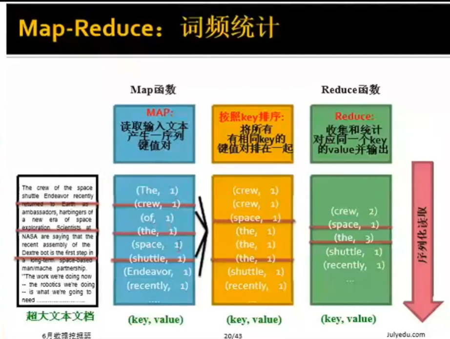
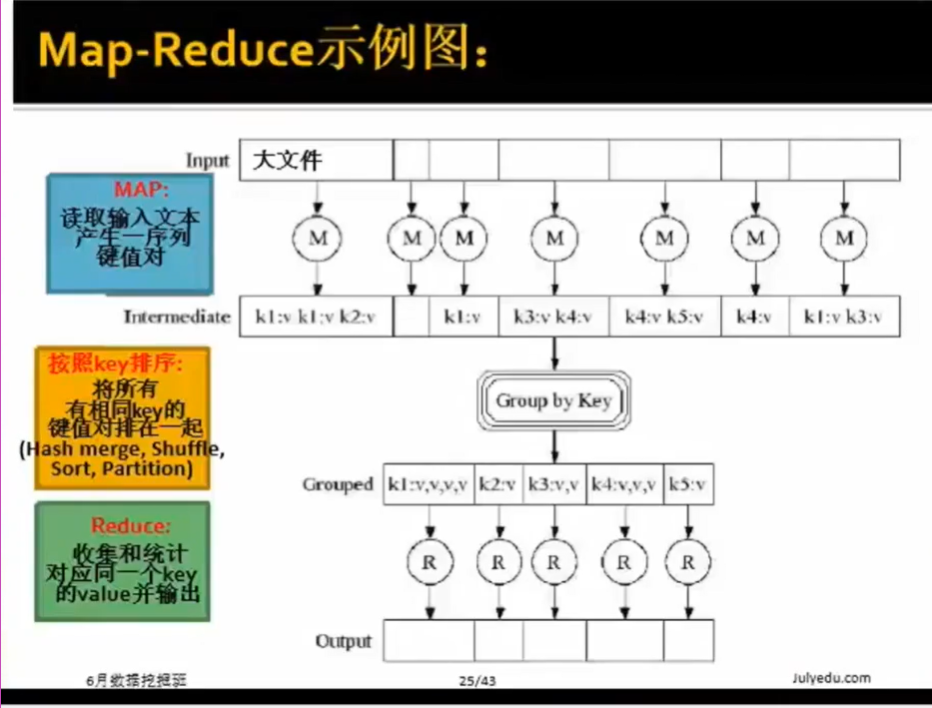
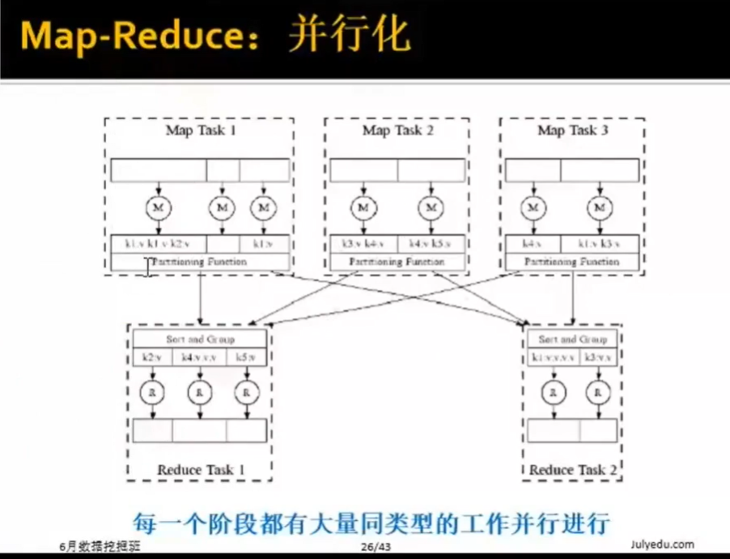
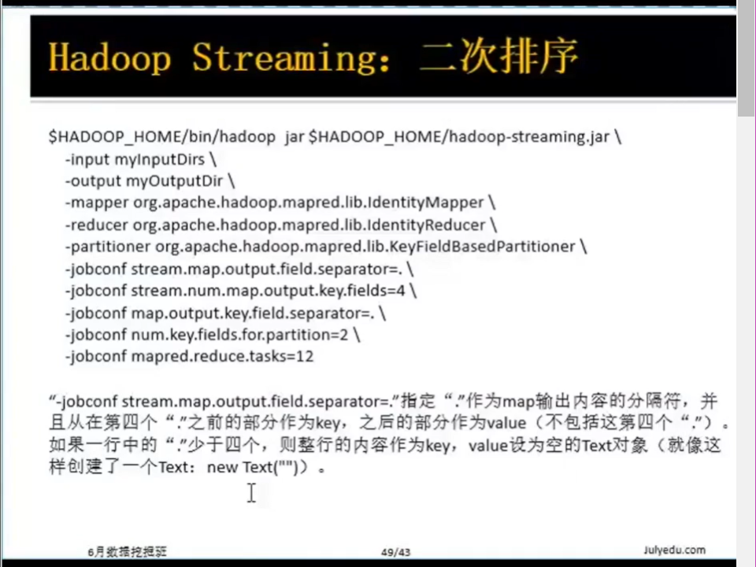
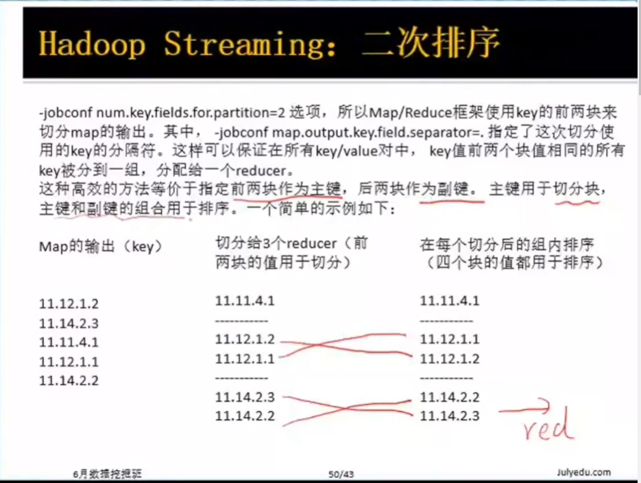

# 海量数据的分布式处理
## 集群的架构
* 每一个rack包含16到64个linux节点，同一个rack上的任意两个节点之间的带宽为1Gbps，rack之间的主干网连接带宽2-10Gbps  
* 集群计算需要面对的问题
  * 节点故障
    * 1000台服务器的集群=>平均故障率1次/天
    * 100万台服务器的集群=>平均故障率1000此/天  
    如何保持数据的连续性，即在某些节点故障的情形下不影响依旧能够使用数据。
  * 网络带宽瓶颈
    * 网络带框=1Gbps
    * 移动10TB数据需要花费将近一天的时间
  * 分布式编程非常复杂
    * 需要一个简单的模型能够隐去所有的复杂性
* Map-Reduce
  * Map-Reduce集群运算时问题的解决方案
    * 在多节点上冗余地存储数据，以保证数据的持续性和一直可取性
    * 将计算移向数据端，以最大程度减少数据移动
    * 简单的程序模型隐藏所有的复杂度
* 冗余化数据存储结构    
  * 分布式文件存储系统
    * 提供全局的文件命名空间，冗余度和可获取性
  * 典型的应用场景与模式
    * 超大级别的数据量(100GB到100TB级别)
    * 数据很少就地整个被替换
    * 最常见的操作为读取和追加数据
* 分布式文件系统
  * 数据以“块状”形式在多台机器上存储
  * 每个数据块都会重复地在多台机器上存储
  * 保证数据的持续性和随时可取性
  * 服务器块同时也用作计算服务器，把运算挪向数据处
  * 服务器块：
    * 文件被分作16-64MB大小的连续块
    * 每个文件块会被重复地存储2到3次
    * 尽量保证重复的数据块在不同的机架上
  * 主节点
    * Hadoop的HDFS里叫做Name节点
    * 存储元数据记录文件存储结构和地址
    * 也可以重复
  * 文件访问的客户端库
    * 询问主节点以获取块服务器地址
    * 直接连接相应服务器块获取数据  
## 计算示例
### 热身练习：
1. 有个超大的文本文件
2. 我们需要统计每个文本的词，所出现的次数
3. 实际应用场景
   * 从web服务器日志中找出高频热门url
   * 搜索词统计

练习：词频统计
* 文件本身太大无法全部载入内存
* Linux命令：words(doc.txt)|sort|uniq -c
  * 其中words命令输出一个文本内容中所有词，一个一行（罗列、排序、数频数）
* **Map**
  * 逐个文件进行扫描
  * 扫描的同时抽取出我们感兴趣的内容(key)
* **Group by key**
  * 排序和洗牌
* **Reduce**
  * 聚合、总结、过滤或转换
  * 写入结果

>总体框架都和上述描述过程一致，只是Map和Reduce函数要根据具体问题具体实现。



### Map-Reduce步骤
* 输入：一些键值对
   * Map(k,v)$\rightarrow$<k',v'>
     * 对一个键值对输入产生一序列中间键值对
     * Map函数将对所有输入键值对操作
   * Ruduce(k',\<v'\>*) $\rightarrow$<k',v''>*
     * 所有有相同key k'的值v'被reduce到一起
     * Reduce函数对每一个不同的Key k'进行操作





* Map-Reduce:环境 (重复存储不会重复计算)：
  * 对原始数据进行分区(partition)
  * 调度程序在一系列的机器集群上都并行运行
  * 执行中间过程的group by key步骤
  * 处理运行过程中的特发节点故障
  * 处理并行运行过程中的节点与节点之间的通信

### 数据流
输入和输出都被存储在
**分布式文件系统(DFS)**上：
* 实际调度操作时，调度器会尽可能将map任务移至靠近数据物理存储的节点上
* **中间结果**将会被存储在Map和Reduce操作的本地文件系统上
* 实际运行过程中，**一个Map-Reduce产生的结果，很有可能作为另一个Map-Reduce任务的输入** 

**主节点主要负责系统的协调**
* 任务状态：等待初始，进行中，完成
* 一旦有能工作的worker，待初始任务被调度运行起来
* 一个Map任务完成后，它会向主节点发送它产生的R个中间文件的位置和大小，每个文件对应一个reducer
* 主节点将这些信息传送至reducer

**处理节点故障**
* Map任务节点故障
 * 所有运行中和已经完成的map任务，都被重置为待初始
 * 所有这些待初始Map任务，将重新被分配到能工作的节点worker上。
* Reduce任务节点故障
 * 只用运行中而未完成的reduce任务被设定为待初始
 * 这些待初始reduce任务被重新分配至其他的worker上。
* 主节点故障
 * 整个Map-Reduce任务中断，同时通知客户端管理员

**启动多少个Map和Reduce任务呢？**
* M个Map任务和R个Reduce任务
* 实际操作经验法则：
 * 通常情况下我们会让M远大于集群中的节点数
 * 通常设置为一个分布式文件系统块一个Map任务
 * 提升动态加载平衡，同时加速节点故障时的任务恢复
* 通常R比M要小
 * 因为输出要分布在R个文件上

### Map-Reduce改进
很多时候一个Map任务为同一个key k会产生形如(k,v1),(k,v2)的键值对：
  * 例如：词频统计任务中的高频词产生的中间结果
1. 我们通过在Mapper中，进行预聚合(pre-aggregating)操作，来节约网络的时间成本。
  * 合并(k.list(v1))$\rightarrow$v2 
  * 合并器(combiner)通常和reduce函数是一致的
  * 以词频统计为例：
   * 合并器(Combiner)预先合并了单个mapper(单个节点)中的键值对。
   * 优点：后续步骤只需要传输和重组更少的数据即可

>注意：只用在满足**交换律**和**结合律**的条件下combiner才能起作用 {Sum(求和) Average(求平均) Median(求中间值)}

2. 分区函数
  * 控制键值对是如何分区/划分的
   * 保证指定key对应的键值对都分配到同一个reduce的worker中
  * 系统有默认的分区函数
   * hash(key) mod R
  * 有时候自己指定划分分区的hash函数是很有用的
   * 例如，定义`hash(hostname(URL)) mod R`可以确保所有同一个host的URL在同一个输出文件

```shell
# cat doc.txt
a b c d
d b b c
a c
e f b
# cat doc.txt | python map.py
a
b
c
d
d
b
b
c
a
c
e
f
b
# cat doc.txt | python map.py | sort
a
a
b
b
c
c
c
d
d
e
f
# cat doc.txt|python map.py|sort|python reduce.py
a 2
b 4
c 3
d 2
e 1
f 1
# cat doc.txt|python map.py|sort|python reduce.py >out.txt
```
map.py
```python
import os
import sys
import re
if __name__ == '__main__':
#__name__是当前模块名，，而当模块被直接运行时模块名为__main__
#当模块被直接运行时，以下代码块将被运行，当模块是被导入时，代码块不被运行。
   handler = sys.stdin #标准输入
   for line in handler:
      if not line:
        continue
      terms = line.strip().split(" ")#strip()方法用于移除字符串头尾指定的字符(默认为空格或换行符)
      for i in terms:
        print(i)      
```
reduce.py
```python
import os
import sys
import re

if __name__ == '__main__':
  handler = sys.stdin
  old_key = ""
  count = 0
  for line in handler:
      if not line:
        continue
      terms = line.strip().split(" ")
      key = terms[0]
      if key != old_key:
         if old_key:
            print (old_key, count)
            count = 0
      old_key = key
      count += 1
  if old_key:
     print(old_key,count)
     count = 0    
```
map2.py 改进
```python
import os
import sys
import re

if __name__ =='__main__':
    handler = sys.stdin
    for line in handler:
        if not line:
           continue
        terms = line.srip().split(" ")
        wdict = {}
        for i in terms:
           if i not in wdict:
               wdict[i] = 1
           else:
               wdict[i] += 1
        for j in wdict:
           print(j, wdict[j])
```
reduce2.py
```python
import os
import sys
import re

if __name__ == '__main__':
   handler = sys.stdin
   old_key = ""
   count = 0
   for line in handler:
       if not line:
          continue
       terms = line.strip().split()
       key = terms[0]
       value = int(terms[1])
       if key != old_key:
          if old_key:
            print(old_key,count)
            count = 0
       old_key = key
       count +=value
   if old_key:
      print(old_ky,count)
      count = 0
```
### Map-Reduce系统
1. Google MapReduce
   * 使用google文件系统（GFS）用于稳定存储
   * google之外不开放使用
2. Hadoop
   * 使用java实现的Map-Reduce开源框架
   * 使用HDFS进行稳定存储
3. Hive、Pig
   * 在Hadoop的Map-Reduce之上提供的类SQL数据提取操作功能
### 云计算
* 按小时计费的租赁计算系统
   * 可能会提供额外的服务：例如持续性存储
* 例如，亚马逊提供的“Elastic Compute Cloud”
   * S3(稳定性存储)
   * Elastic Map Reduce(EMR)
>面试题1：一个很大的2D矩阵，如果某点的值，由它周围某些点的值决定，例如下一时刻(i,j)的值取当前时刻它的8邻点的平均，那么怎么用MapReduce来实现。
>答案1：以下标对作为map的key，遇到(i,j),生成(i-1,j),(i,j-1),etc；然后在reduce时merge相同的key，并计算value。
>面试题2：找朋友
第一字母表示本人，其他是他的朋友，找出有共同朋友的人和共同朋友是谁
A B C D E F
B A C D E
C A B E
D A B E 
E A B C D
F A

### Hadoop Streaming
Hadoop streaming是Hadoop的一个工具，它帮助用户创建和运行一类特殊的map/reduce作业，这些特殊的map/reduce作业是由一些可执行文件或脚本文件充当mapper或者reducer。例如
```shell
$HADOOP_HOME/bin/hadoop jar $HADOOP_HOME/bin/hadoop-straming.jar\
-input mtinputDirs\
-output myOutputDir\
-mapper myPythonScript.py\
-reducer/bin/wc\
-file myPythonScript.py
```

 


### 经验分享
* 如果是前两块作为key的话，其实可以考虑前期直接将前两个直接写成一个key
  * 这样的好处是直接在mapreduce内部脚本中就能看到操作的全过程了。
  * 方便省事
* 一般来说在Map里对key进行转换，在reduce里对value进行转换
  * 比如电商领域中以订单维度的数据转换为用户维度的数据
  * 比如以用户维度转换为城市维度
  * 如果reduce的计算符合结合律和交换律，在map中可以提前做，正因为key做了转换才在map里做，否则没必要
  * 如果没有对key的转换则一般直接用cat
* Merge相同key不用value的数据可以在key后面加datatype
  * 同一个用户数据来源于不同的表，需要将这些表整合起来 