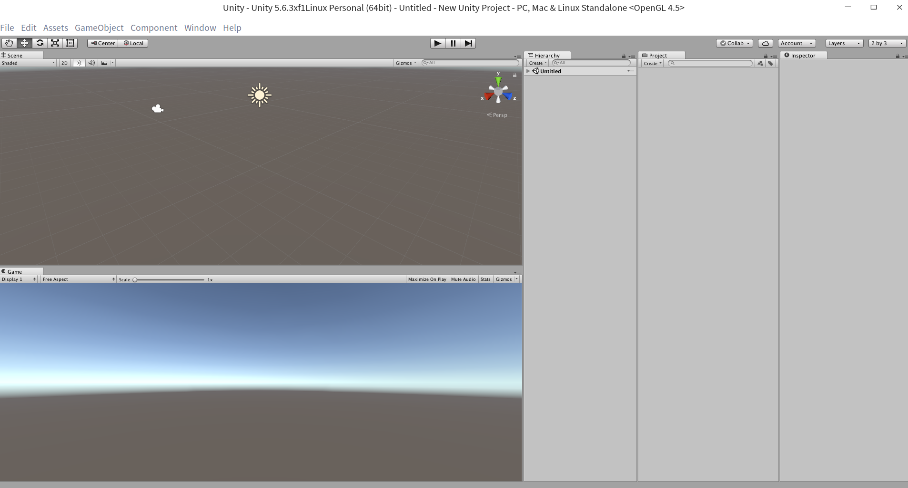
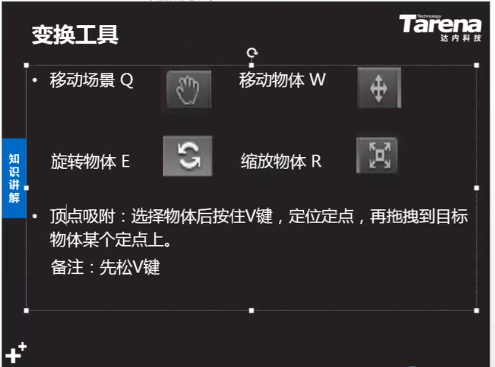
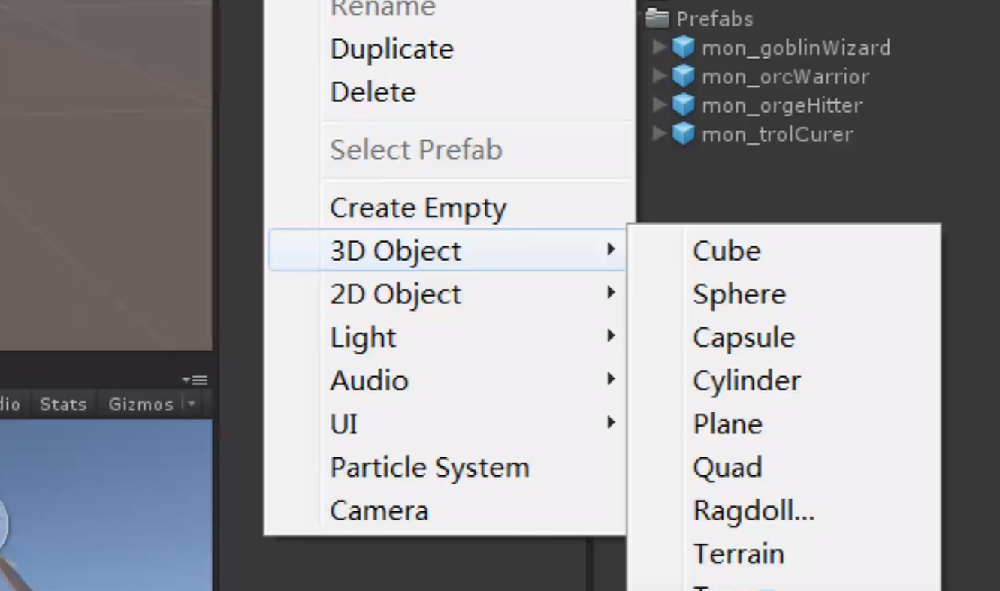
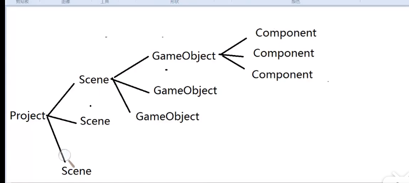
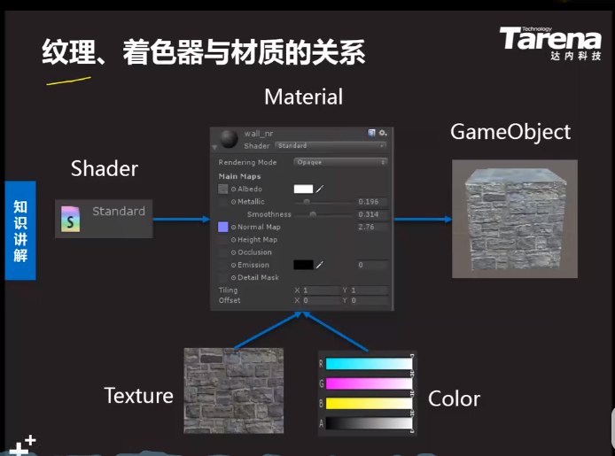
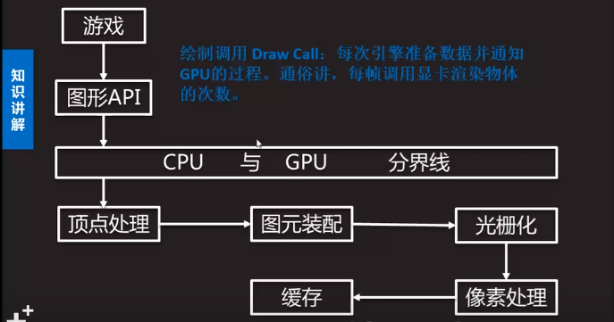

### Unity3D介绍
创建游戏和三维互动内容的开发工具 
Virtual Reality（VR）利用电脑模拟产生一个三维空间的虚拟世界，并提供视觉、听觉、触觉等感官的模拟。使用者通过各种输入设备与虚拟环境中的事物进行交互，从而产生身临其境的体验。 
游戏引擎，程序的框架，一款游戏最核心的代码，包含：渲染引擎、碰撞检测系统、音效、脚本引擎、动画系统、人工智能、网络引擎、以及场景管理。使用游戏引擎，开发者可以重用已有的核心技术，将精力集中在游戏逻辑和设计上，从而简单快速的创建游戏。  

* Unity环境搭建
* C#语言基础
* Unity API
* 物理引擎1
* 3D数学基础
* UGUI  
* Unity高级组件
* IO，协程，多线程
* Unity高级组件应用
* 常用数据结构
* AR项目、VR项目
* NGUI-ARPG项目贯穿
* 美术资源性能优化
* Shader
* 面向对象
* 类库开发
* 设计模式
* 人工智能
* 美术规范及优化
* XML及Json
* 数据库
* 项目制作

#### 面板介绍
**project** 工程素材文件、资源，直接拖进去（Assets文件夹。右键可以导出unity包 同样也可以导入。  

**Hierarchy** 放游戏对象，从资源中拖过来，创建对象，使用对象。 
**Scene** 对游戏对象进行操作，旋转、平移等：  

1. 按下鼠标滚轮拖动场景，滑动滚轮缩放场景。
2. 鼠标右键旋转场景，点击“小手”后，通过左键移动场景。
3. 点击右键的同时按下W/S/A/D/Q/E可实现场景漫游。
4. 在Scene面板中选中物体后按F键，或在Hierarchy面板双击物体，可将物体设置为场景视图的中心。
5. 按住alt键同时通过鼠标左键围绕某物体旋转场景，鼠标右键缩放场景。  

**Game**面板 游戏运行之后进行预览 
播放暂停键，运行暂停游戏 
**Inspector**面板，显示当前选定的游戏对象附加的组件及其属性信息。为重要游戏物体选择图标。 

#### 摆放物体
放置单面平板

放置完之后点reset，使之置于零点，便于开发 
变换切换：  

* 左边是改变游戏对象的轴心点 
  Center:设置轴心点在物体的中心 
  Pivot：使用物体本身的轴心  
* 右边是改变物体的坐标，Global：世界坐标;Local：自身坐标  

#### 创建物体
**场景Scene**：一组相关联的游戏对象的集合，通常游戏中每个关卡就是一个场景，用于展现当前关卡中所有的物体。 
**游戏对象GameObject**：运行时出现在场景中的游戏物体;是一种容器，可以挂载组件;父子物体，在Hierarchy面板中，将一个物体拖拽到另一个物体中。子物体将继承父物体的移动，旋转和缩放属性，但子物体不影响父物体。 
**组件Component**：是游戏的功能模块；每个组件都是一个类的实例。

* Transform变换组件：决定物体位置、旋转、缩放比例。
* Mesh Filter网格过滤器：用于从资源中获取网格信息。
* Mesh Renderer网格渲染器：从网络过滤器中获得几何形状，再根据变化组件定义的位置进行渲染
* 网格过滤器和网格渲染器联合使用，使模型显示到屏幕上。  

创建一个立方体：  
1. 创建空物体：GameObject-Create Empty。
2. 创建网格过滤器：Component-Mesh-MeshFilter 设置Mesh属性。
3. 创建网格渲染器：Component-Mesh-Mesh Renderer 设置材质Material属性。

#### 材质
材质：物体的质地，指色彩、纹理、光滑度、透明度、反射率、发光度等等。实际就是Shader的实例。  
Shader着色器：专门用来渲染3D图形的技术，可以使纹理以某种方式展现。实际上就是一段嵌入到渲染管线中的程序，可以控制GPU运算图像效果的算法。  
Texture纹理：附加到物体表面的贴图。  
在资源中右键创建  
* 渲染模式
  Opaque 不透明，默认选项
  Transparent 透明，用于半透明和全透明物体，如玻璃
  Cutout 镂空，用于完全透明或完全不透明物体，如栅栏
  Fade渐变，用于需要淡入淡出的物体。

Main Maps

* Albedo 基础贴图：决定物体表面纹理与颜色。
* Metallic金属：使用金属特性模拟外观。
* Specular 镜面反射：使用镜面特性模拟外观
* Smoothness光滑度：设置物体表面光滑程度。
* Normal Map 法线贴图：描述物体表面凹凸程度。
* Emission 自发光：控制物体表面自发光颜色和贴图。  
  --None 不影响环境  
  --Realitime 实时动态改变  
  --Backed 烘焙生效  
* Tiling 平铺：沿着不同的轴，纹理平铺个数。
* Offset 偏移：滑动纹理。

物体轮廓  
1. 创建材质Outline
2. 指定着色器 BasicOutline
3. 指定纹理 Texture
4. 设置到物体中  

#### 摄像机
* 附加了摄像机Camera组件的游戏对象
* 向玩家捕获和显示世界的设备
* 场景中的摄像机不受限制
  

摄像机组件：
* Transform 变换组件
* Camera 摄像机：向玩家捕获和显示世界
* Flare Layer 耀斑层：激活可显示光源耀斑
* GUI Layer：激活可渲染二维GUI元素
* Audio Listener音频监听器：接收场景输入的音频源Audio Source 并通过计算机的扬声器播放声音。

使用天空盒
* 设置摄像机Clear Flags 属性为Skybox
* 方式一：摄像机添加组件Skybox
* 方法二：光照窗口
  Window-Lighting-Environment Lighting --Skybox可作为反射源将天空色彩反射到场景中的物体。

天空盒材质种类：6 Sided、Procedural、Cubemap  
属性：
* Clear Flags 清除标识：决定屏幕的空白部分如何处理
   Skybox 天空盒：空白部分显示天空盒图案
   Solid Color 纯色：空白部分显示背景颜色
   Depth Only 仅深度：画中画效果时，小画面摄像机选择该项可清除屏幕空部分信息只保留物体颜色信息
   Don`t Clear 不清除：不清除任何颜色或者深度缓存。
* Background 背景：所有元素绘制后，没有天空盒的情况下，剩余屏幕的颜色。
* Culling Mask 选择屏蔽层：选择要照射的蹭Layer。
* Projection 投射方式：
   Perspective透视：透视图，物体具有近大远小效果   
   Orthographic正交：摄像机会均匀地渲染物体，没有透视感，通常小地图使用。
* Size大小（正交模式）：摄像机视口的大小
* Field of view 视野（透视模式）：设置相机视野的远近距离
* Field of view 裁剪面：相机从开始到结束渲染的距离
     Near近：绘制的最近点  
     Far远：绘制的最远点
* Viewport Rect 视口矩形：标明这台相机视图将会在屏幕上绘制的屏幕坐标。
   X：摄像机视图的开始水平位置
   Y：摄像机视图的开始垂直位置
   W宽度：摄像机输出在屏幕上的宽度
   H高度：摄像机输出在屏幕上的高度
* Depth 深度：相机在渲染顺序上的位置。具有较低深度的摄像机将在较高深度的摄像机之前渲染。  

#### 渲染管线
图形数据在GPU上经过运算处理，最后输出到屏幕的过程。  

顶点处理：接收模型顶点的数据;坐标系转换。 
图元装配：组装面，连接相邻的顶点，绘制为三角面。 
光栅化： 计算三角面上的像素，并为后面着色阶段提供合理的插值参数。 
像素处理：对每个像素区域进行着色。写入到缓存中。 
缓存：一个存储像素数据的内存块，最重要的缓存是帧缓存与深度缓存。帧缓存：存储每个像素的色彩，即渲染后的图像。帧缓存常常在显存中，显卡不断读取并输出到屏幕中。深度缓存z-buffer：存储像素的深度信息，即物体到摄像机的距离。光栅化时便于计算各像素的深度值，如果新的深度值比现有值更近，则像素颜色被写到帧缓存，并替换深度缓存。    

即时遮挡剔除
* 即时遮挡剔除Instant Occlusion Culling
* 遮挡剔除：当物体被送进渲染流水线之前，将摄像机视角内看不到的物体进行剔除，从而减少了每帧渲染数据量，提高渲染性能。

LOD  
* 多细节层次 Level of Detail
  LOD技术指的是根据物体模型的节点在显示环境中所处的位置和重要度，决定物体渲染的资源分配，降低非重要物体的面数和细节度，从而获得高效率的渲染运算。

#### 光照系统
Global Illumination
* 简称GI，即全局光照
* 能够计算直接光、间接光、环境光以及反射光的光照系统。
* 通过GI算法可以使渲染出来的光照效果更为真实丰富。

直接光照：
* 从光源直接发出的光，通过Light组件实现
* Type类型：灯光对象的当前类型 
  --Directional Light 平行光：平行发射光线，可以照射场景里所有物体，用于模拟太阳。 
  --Point Light点光源：在灯光位置上向四周发射光线，可以照射其范围内的所有对象，用于模拟灯泡。 
  --Spot Light聚光灯：在灯光位置上向圆锥区域发射光线，只有在这个区域内的物体才会受到光线照射，用于模拟探照灯。 
  --Area Light区域光：由一个面向一个方向发射光线，只照射该区域内的物体，仅烘焙时有效，用在光线较为集中的区域。 
  --Range范围：光从物体的中心发射的范围。仅适用于点光源和聚光灯。 
  --Spot Angle 聚光角度：灯光的聚光角度，只适用于聚光灯。 
  --Color颜色：光线的明亮程度。 
  --Intensity强度：光线的明亮程度。
  --Culling Mask 选择遮蔽层：选择要照射的层Layer。
* Shadow Type阴影类型：Hard硬阴影、Soft软阴影 
  --Strength 硬度：阴影的黑暗程度。 
  --Resolution 分辨率：设置阴影的细节程度。 
  --Bias 偏移：物体与阴影的偏移。  
* 通过Mesh Renderer组件启用禁用阴影 
  --Cast/Receive Shadows 当前物体是否投射/接收阴影。 
  --Off 不投射阴影，On投射阴影，Two Sided 双面阴影，Shadows Only 隐藏物体只投射阴影
* 阴影剔除：设置显示阴影的距离 
  Edit->Project Settings->Quality->Shadows Disdance  

环境光照：  
* 作用于场景内所有物体的光照，通过Environment Lighting中的Ambient控制。
* Ambient Source 环境光源 
  --Skybox通过天空盒颜色设置环境光照 
  --Gradient梯度颜色 
  Sky 天空颜色、Equator 地平线颜色、Ground 地面颜色 
  --Ambient Color纯色  
* Ambient Intensity 环境光强度     
* Ambient GI 环境光GI模式 
  --Realtime 实时更新，环境光源会改变选择此项 
  --Backed  烘焙，环境光源不会改变选择此项。  

反射光照
* 根据天空盒或立方体贴图计算的作用于所有物体的反射效果，通过Environment Lighting中Reflection控制。
* Reflection Source反射源 
  --Skybox天空盒 
  Resolution 分辨率 Compression 是否压缩 
  --Custom 自定义 
  Cubemap 立方体贴图  
* Reflection Intensity 反射强度  
* Reflection Bounces 使用Reflection Probe 后允许不同游戏对象间来回反弹的次数。  

间接光照
* 物体表面在接受关照之后反射出来的光。  
* 通过Light组件中Bounce Intensity反弹强度控制。
* 可以通过Scene面板中Irradiance模式查看间接光照。
* 注意：只有标记Lightmaping Static的物体才能产生间接反弹光照。

Realtime GI
* 所谓实时是指在运行期间任意修改光源，而所有的变化可以立即更新。
* 正是由于Unity5引入了实时全局光照技术Enlighten系统，才可以在运行时产生间接光照，使场景更为真实丰富     
  操作步骤：  
  1. 游戏对象设置为Lightmaping Static
  2. 启用Lighting面板的Precomputed Realtime GI
  3. 点击Build按钮（如果勾选Auto编辑器会自动检测场景的改动修复光照效果） 
  

烘焙Lightmap
* 当场景包含大量物体时，实时光照和阴影对游戏性能有很大影响。使用烘焙技术，可以将光线效果预渲染成贴图再作用到物体上模拟光照，从而提高性能。
  1. 游戏对象设置为Lightmaping Static
  2. 设置Light组件Baking属性
  3. 启用Lighting面板的Baked GI
  4. 点击Build按钮（如果勾选Auto编辑器会景的改动修复光照效果  
 * Light组件Baking属性：烘焙模式 
     --Realtime 仅实时光照时起作用 
     --Baked 仅烘焙时起作用 
     --Mixed 混合，烘焙和实时光照都起作用 
     可以通过Scene面板的Baked模式查看光照贴图。  

光源侦测Light Probes
* 由于LightMapping只能作用于static物体，所以导致运动的物体与场景中的光线无法融合在一起，显得非常不真实。而Light Probes组件可以通过Probe收集光影信息，然后对运动物体邻近的几个Probe进行插值运算，最后将光照作用到物体上。  
  

