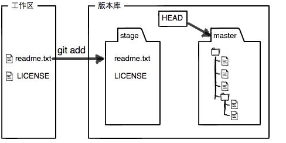

### 初始化仓库
* 初始化一个Git仓库，使用`git init`命令。 
添加文件到Git仓库，分两步：  
   1.  使用命令git add <file>，注意，可反复多次使用，添加多个文件；
   2. 使用命令git commit -m <message>，完成。

* 要随时掌握工作区的状态，使用`git status`命令。 
如果`git status`告诉你有文件被修改过，用`git diff`可以查看修改内容。

* HEAD指向的版本就是当前版本，因此，Git允许我们在版本的历史之间穿梭，使用命令`git reset --hard commit_id`。 
(HEAD^是指的上一个版本HEAD^^指的是上上个版本)

* 穿梭前，用`git log`可以查看提交历史，以便确定要回退到哪个版本。  

* 要重返未来，用`git reflog`查看命令历史，以便确定要回到未来的哪个版本。 
	
	
* 每次修改，如果不用`git add`到暂存区，那就不会加入到commit中 

* 当你改乱了工作区某个文件的内容，想直接丢弃工作区的修改时，用命令`git checkout -- file`。    
* 当你不但改乱了工作区某个文件的内容，还添加到了暂存区时，想丢弃修改，分两步，第一步用命令`git reset HEAD <file>`，就回到了场景1，第二步按场景1操作。      
* 已经提交了不合适的修改到版本库时，想要撤销本次提交，参考版本回退一节，不过前提是没有推送到远程库。  

* 命令`git rm`用于删除一个文件。如果一个文件已经被提交到版本库，那么你永远不用担心误删，但是要小心，你只能恢复文件到最新版本，你会丢失最近一次提交后你修改的内容.  

* `git checkout`其实是用版本库里的版本替换工作区的版本，无论工作区是修改还是删除，都可以“一键还原”。 

### 关联远程库推送
* 要关联一个远程库，使用命令`git remote add origin git@server-name:path/repo-name.git`；  
* 关联后，使用命令`git push -u origin master`第一次推送master分支的所有内容；  
* 此后，每次本地提交后，只要有必要，就可以使用命令`git push origin master`推送最新修改；  

分布式版本系统的最大好处之一是在本地工作完全不需要考虑远程库的存在，也就是有没有联网都可以正常工作，而SVN在没有联网的时候是拒绝干活的！当有网络的时候，再把本地提交推送一下就完成了同步，真是太方便了！

### 克隆远程库项目
* 从远程库克隆
 `git clone git@github.com:Mango/gitskills.git`
* 要克隆一个仓库，首先必须知道仓库的地址然后使用`git clone  git@`  

### 分支的使用
Git鼓励大量使用分支：
* 查看分支：`git branch`
* 创建分支：`git branch <name>`
* 切换分支：`git checkout <name>或者git switch <name>`
* 创建+切换分支：`git checkout -b <name>或者git switch -c <name>`
* 合并某分支到当前分支：`git merge <name>`
* 删除分支：`git branch -d <name>`  

当Git无法自动合并分支时，就必须首先解决冲突。解决冲突后，再提交，合并完成。  
解决冲突就是把Git合并失败的文件手动编辑为我们希望的内容，再提交。  

* 用`git log --graph`命令可以看到分支合并图。
  

在实际开发中，我们应该按照几个基本原则进行分支管理：  
首先，master分支应该是非常稳定的，也就是仅用来发布新版本，平时不能在上面干活；  
那在哪干活呢？干活都在dev分支上，也就是说，dev分支是不稳定的，到某个时候，比如1.0版本发布时，再把dev分支合并到master上，在master分支发布1.0版本；  
你和你的小伙伴们每个人都在dev分支上干活，每个人都有自己的分支，时不时地往dev分支上合并就可以了。  

* Git分支十分强大，在团队开发中应该充分应用。  
合并分支时，加上`--no-ff`参数就可以用普通模式合并，合并后的历史有分支，能看出来曾经做过合并，而fast forward合并就看不出来曾经做过合并。  
* 修复bug时，我们会通过创建新的bug分支进行修复，然后合并，最后删除；  
当手头工作没有完成时，先把工作现场`git stash`一下，然后去修复bug，修复后，再`git stash pop`，回到工作现场；  
在master分支上修复的bug，想要合并到当前dev分支，可以用`git cherry-pick <commit>`命令，把bug提交的修改“复制”到当前分支，避免重复劳动。  

* 开发一个新feature，最好新建一个分支；  
如果要丢弃一个没有被合并过的分支，可以通过`git branch -D <name>`强行删除。

* 多人协作的工作模式通常是这样：  
首先，可以试图用`git push origin <branch-name>`推送自己的修改；  
如果推送失败，则因为远程分支比你的本地更新，需要先用`git pull`试图合并；  
如果合并有冲突，则解决冲突，并在本地提交；  
没有冲突或者解决掉冲突后，再用`git push origin <branch-name>`推送就能成功！  
如果`git pull`提示`no tracking information`，则说明本地分支和远程分支的链接关系没有创建，用命令`git branch --set-upstream-to <branch-name> origin/<branch-name>`。  
这就是多人协作的工作模式，一旦熟悉了，就非常简单。

* 查看远程库信息，使用`git remote -v`；  
本地新建的分支如果不推送到远程，对其他人就是不可见的；  

* 从本地推送分支，使用`git push origin branch-name`，如果推送失败，先用`git pull`抓取远程的新提交；  
* 在本地创建和远程分支对应的分支，使用`git checkout -b branch-name origin/branch-name`，本地和远程分支的名称最好一致；    
* 建立本地分支和远程分支的关联，使用`git branch   --set-upstream branch-name origin/branch-name`；  
从远程抓取分支，使用`git pull`，如果有冲突，要先处理冲突。  

rebase操作可以把本地未push的分叉提交历史整理成直线；  
rebase的目的是使得我们在查看历史提交的变化时更容易，因为分叉的提交需要三方对比。 

### 标签
* tag就是一个让人容易记住的有意义的名字，它跟某个commit绑在一起
命令`git tag <tagname>`用于新建一个标签，默认为HEAD，也可以指定一个commit id；  
命令`git tag -a <tagname> -m "blablabla...`"可以指定标签信息；  
命令`git tag`可以查看所有标签。    
用命令`git show <tagname>`可以看到说明文字
命令`git push origin <tagname>`可以推送一个本地标签；  
命令`git push origin --tags`可以推送全部未推送过的本地标签；
命令`git tag -d <tagname>`可以删除一个本地标签；   
命令`git push origin :refs/tags/<tagname>`可以删除一个远程标签。 

## 最后
在GitHub上，可以任意Fork开源仓库；
自己拥有Fork后的仓库的读写权限；
可以推送pull request给官方仓库来贡献代码。

让Git显示颜色，会让命令输出看起来更醒目：
`git config --global color.ui true`