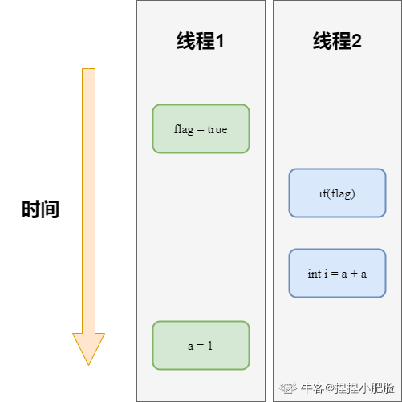

## 进程-线程-并行-并发
### * 进程与线程的概念
线程是处理器任务调度和执行的基本单位，进程是操作系统资源分配的基本单位。

进程是程序的一次执行过程，是系统运行的基本单位。线程是一个比进程更小的执行单位，一个进程可以包含多个线程。

Java 程序天生就是多线程程序，我们可以通过 JMX 来看一下一个普通的 Java 程序有哪些线程，代码如下。

```java
public class MultiThread { public static void main(String[] args) { 
	// 获取 Java 线程管理 
	MXBean ThreadMXBean threadMXBean = ManagementFactory.getThreadMXBean(); 
	// 不需要获取同步的 monitor 和 synchronizer 信息，仅获取线程和线程堆栈信息 
	ThreadInfo[] threadInfos = threadMXBean.dumpAllThreads(false, false); 
	// 遍历线程信息，仅打印线程 ID 和线程名称信息 
	for (ThreadInfo threadInfo : threadInfos) 
	{ System.out.println("[" + threadInfo.getThreadId() + "] " + threadInfo.getThreadName()); } } }
```

```shell
[5] Attach Listener //添加事件 
[4] Signal Dispatcher // 分发处理给 JVM 信号的线程 
[3] Finalizer //调用对象 finalize 方法的线程 
[2] Reference Handler //清除 reference 线程 
[1] main //main 线程,程序入口
```

**一个 Java 程序的运行是 main 线程和多个其他线程同时运行**

### * 进程与线程之间的关系

* 线程是一个比进程更小的执行单位，一个进程可以包含多个线程。
  
* 内存分配：进程之间的地址空间和资源是相互独立的，同一个进程之间的线程会共享线程的地址空间和资源（堆和方法区）。

* 资源开销：每个进程具备各自的数据空间，进程之间的切换会有较大的开销。属于同一进程的线程会共享堆和方法区，同时具备私有的虚拟机栈、本地方法栈、程序计数器，线程之间的切换资源开销较小。

### * 并发和并行的区别
1. 并发： 同一时间段，多个任务都在执行（单位时间内不一定同时执行）
2. 并行：单位时间内，多个任务同时执行

### * 多线程的优缺点
* 提高程序的**执行效率**、提高程序**运行速度**

* 并发编程并不总是能提⾼程序运⾏速度的，而且并发编程可能会遇到很多问题，比如：**内存泄漏**、**上下文切换**、**死锁**还有**受限于硬件和软件的资源闲置**问题。

### * 线程生命周期和状态
Java 线程在运⾏的⽣命周期中的指定时刻只可能处于下⾯ 6 种不同状态的其中⼀个状态


### * 什么是上下文切换
当前任务在执行完CPU时间片切换到另一个任务之前会先保存自己的状态，以便下次再切换回这个任务时，可以再加载这个任务的状态。**任务从保存到再加载的过程就是一次上下文切换**

上下文切换对于系统而言意味着消耗大量的CPU时间，可能是操作系统中时间消耗最大的操作。 

### * Java中守护线程和用户线程的区别
任何线程都可以设置为守护线程和用户线程，通过方法`Thread.setDaemon(bool on)` 设置，`true`则是将该线程设置为守护线程，`false`则是将该线程设置为用户线程。同时，`Thread.setDaemon()`必须在`Thread.start()`之前调用，否则运行时会抛出异常。

* 用户线程：平时使用到的线程均为用户线程。
* 用户线程：当任何一个用户线程未结束，Java虚拟机是不会结束的。
* 守护线程：用来服务用户线程的线程，例如垃圾回收线程。
* 守护线程：如何只剩守护线程未结束，Java虚拟机结束。

守护线程和用户线程的区别主要在于线程结束后Java虚拟机是否存活。

### * 什么是线程死锁？如何避免死锁
多个线程同时被阻塞，它们中的⼀个或者全部都在等待某个资源被释放。由于线程被⽆限期地阻塞，因此程序不可能正常终⽌。

产生各部分死锁的必备条件：
1. 互斥条件：该资源任意一个时刻只由一个线程占用
2. 请求与保持条件：一个进程因请求资源而阻塞，对已获得的资源保持不放
3. 不剥夺条件：线程已获得的资源在未使用完之前不能被其它线程强行剥夺
4. 循环等待条件：若干进程之间形成一种头尾相接的循环等待资源关系

避免死锁的方法主要是破坏死锁产生的条件。

-   破坏请求与保持条件：一次性申请所有的资源。
-   破坏不剥夺条件：线程在申请不到所需资源时，主动放弃所持有的资源
-   破坏循环等待条件：按顺序来申请资源。

### * Java中的死锁、活锁、饥饿区别？
**活锁**：任务或者执行者没有被阻塞，由于某些条件没有被满足，导致线程一直重复尝试、失败、尝试、失败。

活锁和死锁的区别：
-   活锁是在不断地尝试、死锁是在一直等待。
-   活锁有可能自行解开、死锁无法自行解开。

**饥饿**：一个或者多个线程因为种种原因无法获得所需要的资源， 导致一直无法执行的状态。活锁就是在忙式等待条件下发生的饥饿，忙式等待就是不进入等待状态的等待。

产生饥饿的原因：
-   高优先级的线程占用了低优先级线程的CPU时间
-   线程被永久堵塞在一个等待进入同步块的状态，因为其他线程总是能在它之前持续地对该同步块进行访问。
-   线程在等待一个本身也处于永久等待完成的对象(比如调用这个对象的`wait()`方法)，因为其他线程总是被持续地获得唤醒。

### *  创建线程一共有几种方法
-   继承`Thread`类创建线程
-   实现`Runnable`接口创建线程
-   使用`Callable`和`Future`创建线程
-   使用线程池例如用`Executor`框架

### *  实现Runnable接口和Callable接口的区别
Runnable 接⼝不会返回结果或抛出检查异常，但是Callable接⼝可以。所以，如果任务不需要返回结果或抛出异常推荐使⽤Runnable接⼝，这样代码看起来会更加简洁。
```java
//Runnable.java
public interface Runnable
{
	/**
	*被线程执行，没有返回值也无法抛出异常
	*/
	public abstract void run();
}
//Callable.java
@FunctionalInterface
public interface Callable<V>
{
    /**
	* 计算结果，或在无法这样做时抛出异常
	* @return 计算得出的结果
	* @throws 如果无法计算结果，则抛出异常
	*/
	V call() throws Exception;
}
```

### * 线程的run()和start()有什么区别？
-   线程是通过`Thread`对象所对应的方法`run()`来完成其操作的，而线程的启动是通过`start()`方法执行的。
-   `run()`方法可以重复调用，`start()`方法只能调用一次

### * 为什么调用start()方法时会执行run()方法，为什么不直接调用run方法
调用start方法可以启动线程并使线程进入就绪状态，而run方法只是thread的一个普通方法，直接调用还是在主线程里执行。       

## 线程同步与调度
### * 线程同步及调度相关的方法？   
*  `wait()`：使一个线程处于等待（阻塞）状态，并且释放所持有的对象的锁；
*  `sleep()`：使当前线程进入指定毫秒数的休眠，暂停执行，需要处理`Interrupted-Exception`。
*  `notify()`：唤醒一个处于等待状态的线程，当然在调用此方法的时候，并不能确切的唤醒某一个等待状态的线程，而是由 JVM 确定唤醒哪个线程，而且与优先级无关。
*  `notifyAll()`：唤醒所有处于等待状态的线程，该方法并不是将对象的锁给所有线程，而是让它们竞争，只有获得锁的线程才能进入就绪状态。  
*  `jion()`：与`sleep()`方法一样，是一个可中断的方法，在一个线程中调用另一个线程的`join()`方法，使得当前的线程挂起，直到执行`join()`方法的线程结束。例如在B线程中调用A线程的`join()`方法，B线程进入阻塞状态，直到A线程结束或者到达指定的时间。
*  `yield()`：提醒调度器愿意放弃当前的CPU资源，使得当前线程从`RUNNING`状态切换到`RUNABLE`状态。

### * sleep()方法和wait()方法
* 两者最主要的区别在于：**sleep方法没有释放锁，而wait方法释放了锁**
* 两者都可以暂停线程的执行
* Wait通常被用于线程间交互/通信，sleep通常被用于暂停执行
* wait()方法被调用后，线程不会自动苏醒，需要别的线程调用同一个对象上的`notify()`或者`notifyAll()`方法。`sleep()`方法执行完成后，线程会自动苏醒。或者可以使用wait(long timeout)超时后线程会自动苏醒。   

### * sleep()方法和yield()方法
*   `sleep()`方法使得当前线程暂停指定的时间，没有消耗CPU时间片。
*   `sleep()`使得线程进入到阻塞状态，`yield()`**只是对CPU进行提示**，如果CPU没有忽略这个提示，会使得线程上下文的切换，进入到就绪状态。
*   `sleep()`一定会完成给定的休眠时间，`yield()`不一定能完成。
*   `sleep()`需要抛出InterruptedException，而`yield()`方法无需抛出异常。

### * wait()方法一般在循环块中使用还是if块中使用？
线程要在循环中使用，否则可能会出现虚假唤醒的可能
```java
synchronized(obj){    
	while(<condition does not hold>){
		obj.wait();    
	}    
	//满足while中的条件后执行业务逻辑
}
```

如果`while`换成`if`
```java
synchronized(obj){
	if(<condition does not hold>){
		obj.wait();    
	}    
	//满足while中的条件后执行业务逻辑
}
```

### * 线程通信的方法有哪些？
1. **共享内存** volatile
2. **消息传递**  wait/notify等待通知方式、join方式
3.  **管道流** 管道输入输出流的形式
4.  **信号量**

### * Java如何实现两个线程之间的通信和协作
*  `syncrhoized`加锁的线程的`Object`类的`wait()`/`notify()`/`notifyAll()`
*  `ReentrantLock`类加锁的线程的`Condition`类的`await()`，`signal()`，`signalAll()`。
*  通过管道进行线程间通信：1）字节流；2）字符流 ，就是一个线程发送数据到输出管道，另一个线程从输入管道读数据。

### * wait()、notify()、notifyAll()为什么定义在Object类中
因为这些方法在操作同步线程时，都必须要**标识他们操作线程的锁**，只有同一个锁上的被等待线程，可以被同一个锁上的notify()或notifyAll()唤醒，不可以对不同锁中的线程进行唤醒，也就是说等待和唤醒必须是同一锁。而锁可以是任意对象，所以可以被任意对象调用的方法是定义在Object类中。

### * 为什么wait()，notify()和notifyAll()必须在同步方法或者同步块中被调用？
因为`wait()`暂停的是持有锁的对象，`notify()`或`notifyAll()`唤醒的是等待锁的对象。所以`wait()`、`notify()`、`notifyAll()`都需要线程持有锁的对象，进而需要在同步方法或者同步块中被调用。

### * 为什么Thread类的sleep()和yield()方法是静态的？
`sleep()`和`yield()`都是需要正在执行的线程调用的，那些本来就阻塞或者等待的线程调用这个方法是无意义的，所以这两个方法是静态的。

### * 如何停止一个正在同步的线程
*   中断：`Interrupt`方法中断线程
*   使用`volatile boolean`标志位停止线程：在线程中设置一个`boolean`标志位，同时用`volatile`修饰保证可见性，在线程里不断地读取这个值，其他地方可以修改这个`boolean`值。
*   使用`stop()`方法停止线程，但该方法**已经被废弃**。因为这样线程不能在停止前保存数据，会出现数据完整性问题。

### * 如何唤醒一个被阻塞的线程
如果线程是由于`wait()`、`sleep()`、`join()`、`yield()`等方法进入阻塞状态的，是可以进行唤醒的。如果线程是IO阻塞是无法进行唤醒的，因为IO是操作系统层面的，Java代码无法直接接触操作系统。 
-   `wait()`：可用`notify()`或`notifyAll()`方法唤醒。
-   `sleep()`：调用该方法使得线程在指定时间内进入阻塞状态，等到指定时间过去，线程再次获取到CPU时间片进而被唤醒。
-   `join()`：当前线程A调用另一个线程B的`join()`方法，当前线程转A入阻塞状态，直到线程B运行结束，线程A才由阻塞状态转为可执行状态。
-   `yield()`：使得当前线程放弃CPU时间片，但随时可能再次得到CPU时间片进而激活。

### * 同步方法和同步块哪个效果更好？
同步块更好些，因为它锁定的范围更灵活些，只在需要锁住的代码块锁住相应的对象，而同步方法锁住了整个对象。

### * 线程同步与互斥
-   线程的互斥是指某一个资源只能被一个访问者访问，具有**唯一性和排他性**。但访问者对资源访问的顺序是乱序的。
-   线程的同步是指在**互斥的基础上**使得访问者对资源进行**有序访问**。

### * 线程同步的实现方法
*  同步方法
*  同步代码块
*  `wait()`和`notify()`
*  使用volatile实现线程同步
*  使用重入锁实现线程同步
*  使用局部变量实现线程同步
*  使用阻塞队列实现线程同步

### * 在Java程序中如何保证线程的运行安全(特性)
线程安全问题 主要体现在原子性、可见性和有序性
*  原子性：一个或者多个操作在 CPU 执行的过程中不被中断的特性。线程切换带来的原子性问题。
*  可见性：一个线程对共享变量的修改，另外一个线程能够立刻看到。缓存导致的可见性问题。  
*  有序性：程序执行的顺序按照代码的先后顺序执行。编译优化带来的有序性问题。

解决方法：
*   原子性问题：可用JDK `Atomic`开头的原子类、`synchronized`、`LOCK`来解决
*   可见性问题：可用`synchronized`、`volatile`、`LOCK`来解决
*   有序性问题：可用`Happens-Before` 规则来解决

### * 线程类的构造方法、静态块是被哪个线程调用的？ 
线程类的构造方法、静态块是被new这个线程类所在的线程所调用的，而run()方法里面的代码才是被线程自身所调用的。

### * 如何让三个线程按顺序执行
* synchronized+wait/notify   
基本思路就是线程A、线程B、线程C三个线程同时启动，因为变量num的初始值为0，所以线程B或线程C拿到锁后，进入while()循环，然后执行wait()方法，线程线程阻塞，释放锁。只有线程A拿到锁后，不进入while()循环，执行num++，打印字符A，最后唤醒线程B和线程C。此时num值为1，只有线程B拿到锁后，不被阻塞，执行num++，打印字符B，最后唤醒线程A和线程C，后面以此类推。
```java
class Wait_Notify_ACB {    
	private int num;    
	private static final Object LOCK = new Object();    
	private void printABC(String name, int targetNum) {
		synchronized (LOCK) {
			while (num % 3 != targetNum) {
				try {
					LOCK.wait();                    
				} catch (InterruptedException e) {
					e.printStackTrace();                    
				}                
			}                
			num++;                
			System.out.print(name);
			LOCK.notifyAll();            
		}    
	}        
	public static void main(String[] args) {        
		Wait_Notify_ACB  wait_notify_acb = new Wait_Notify_ACB ();
		new Thread(() -> 
				   {wait_notify_acb.printABC("A", 0);}, "A").start();
		new Thread(() -> 
				   {wait_notify_acb.printABC("B", 1);}, "B").start();
		new Thread(() -> 
				   {wait_notify_acb.printABC("C", 2);}, "C").start();    }
}
```

* join方法
join()方法：在A线程中调用了B线程的join()方法时，表示只有当B线程执行完毕时，A线程才能继续执行。基于这个原理，我们使得三个线程按顺序执行，然后循环多次即可。无论线程1、线程2、线程3哪个先执行，最后执行的顺序都是线程1——>线程2——>线程3。

```java
class Join_ABC {    
	public static void main(String[] args) throws InterruptedException {
		for (int i = 0; i < 10; i++) {
			Thread t1 = new Thread(new printABC(null),"A");
			Thread t2 = new Thread(new printABC(t1),"B");
			Thread t3 = new Thread(new printABC(t2),"C");
			t0.start();
			t1.start();
			t2.start();            
			Thread.sleep(10);
			//这里是要保证只有t1、t2、t3为一组，进行执行才能保证t1->t2->t3的执行顺序。        
		}    
	}    
	
	static class printABC implements Runnable{        
		private Thread beforeThread;        
		public printABC(Thread beforeThread) {
			this.beforeThread = beforeThread;        
		}        
		@Override        
		public void run() {            
			if(beforeThread!=null) {                
				try {                    
					beforeThread.join();                    
					System.out.print(Thread.currentThread().getName());
				}catch(Exception e){
					e.printStackTrace();
				}            
			}else {
				System.out.print(Thread.currentThread().getName());
			}        
		}    
	}
}
```

* Lock方法  
管哪个线程拿到锁，只有符合条件的才能打印
```java
 class Lock_ABC {    
	 private int num;   
	 // 当前状态值：保证三个线程之间交替打印    
	 private Lock lock = new ReentrantLock();
	 private void printABC(String name, int targetNum) {
		 for (int i = 0; i < 10; ) {
			 lock.lock();
			 if (num % 3 == targetNum) {
				 num++;                
				 i++;                
				 System.out.print(name);            
			 }            
			 lock.unlock();       
		 }    
	 }    
	 public static void main(String[] args) {
		 Lock_ABC lockABC = new Lock_ABC();        
		 new Thread(() -> 
					{lockABC.printABC("A", 0);}, "A").start();
		 new Thread(() -> 
					{lockABC.printABC("B", 1);}, "B").start();
		 new Thread(() -> 
					{lockABC.printABC("C", 2);}, "C").start();    
	 }
 }
```

* Lock+Condition
精准唤醒线程
```java
class LockConditionABC {    
	private int num;    
	private static Lock lock = new ReentrantLock();    
	private static Condition c1 = lock.newCondition();    
	private static Condition c2 = lock.newCondition();    
	private static Condition c3 = lock.newCondition();    
	private void printABC(String name, int targetNum, Condition currentThread, Condition nextThread) 
	{        
		for (int i = 0; i < 10; ) {
			lock.lock();            
			try {                
				while (num % 3 != targetNum) {
					currentThread.await();                
				}                
				num++;                
				i++;                
				System.out.print(name);
				nextThread.signal();            
			} catch (Exception e) {
				e.printStackTrace();            
			} finally {
				lock.unlock();            
			}        
		}    
	}
	
	public static void main(String[] args) {
		LockConditionABC print = new LockConditionABC();
		new Thread(() -> 
				   {print.printABC("A", 0, c1, c2);}, "A").start();
		new Thread(() -> 
				   {print.printABC("B", 1, c2, c3);}, "B").start();
		new Thread(() -> 
				   {print.printABC("C", 2, c3, c1);}, "C").start();
	}
}
```

* 信号量唤醒
Semaphore：用来控制同时访问某个特定资源的操作数量，或者同时执行某个制定操作的数量。Semaphore内部维护了一个计数器，其值为可以访问的共享资源的个数。

一个线程要访问共享资源，先使用acquire()方法获得信号量，如果信号量的计数器值大于等于1，意味着有共享资源可以访问，则使其计数器值减去1，再访问共享资源。如果计数器值为0,线程进入休眠。

当某个线程使用完共享资源后，使用release()释放信号量，并将信号量内部的计数器加1，之前进入休眠的线程将被唤醒并再次试图获得信号量。

```java
class SemaphoreABC {    
	private static Semaphore s1 = new Semaphore(1);  
	//先打印A，所以设s1中的计数器值为1    
	private static Semaphore s2 = new Semaphore(0);    
	private static Semaphore s3 = new Semaphore(0);        
	private void printABC(String name, Semaphore currentThread, Semaphore nextThread) { 
		for (int i = 0; i < 10; i++) { 
			try {               
				currentThread.acquire();   
				//阻塞当前线程，即调用当前线程acquire()，计数器减1为0
				System.out.print(name); 
				nextThread.release();    
				//唤醒下一个线程，即调用下一个线程线程release()，计数器加1
			} catch (InterruptedException e) { 
				e.printStackTrace();            }
		}    
	}    
	
	public static void main(String[] args) throws InterruptedException { 
		SemaphoreABC printer = new SemaphoreABC();
		new Thread(() -> {printer.printABC("A", s1, s2);}, "A").start();
		Thread.sleep(10);        
		new Thread(() -> {printer.printABC("B", s2, s3);}, "B").start();
		Thread.sleep(10);        
		new Thread(() -> {printer.printABC("C", s3, s1);}, "C").start();
	}
}
```

## synchronized关键字
### * 什么是synchronized关键字
在多线程的环境下，多个线程同时访问共享资源会出现一些问题，而synchronized关键字则是用来保证线程同步的。

### * synchronized关键字可以实现什么类型的锁？
*   悲观锁：synchronized关键字实现的是悲观锁，每次访问共享资源时都会上锁。
*   非公平锁：synchronized关键字实现的是非公平锁，即线程获取锁的顺序并不一定是按照线程阻塞的顺序。
*   可重入锁：synchronized关键字实现的是可重入锁，即已经获取锁的线程可以再次获取锁。
*   独占锁或者排他锁：synchronized关键字实现的是独占锁，即该锁只能被一个线程所持有，其他线程均被阻塞

### * synchronized关键字的使用方式
synchronizesd主要有三种使用方式：修饰普通同步方法、修饰静态同步方法、修饰同步方法块。
* 修饰普通同步方法（实例方法）
```java
class syncTest implements Runnable {   
	private static int i = 0;   
	//共享资源    
	private synchronized void add() {
		i++;    
	}    
	@Override    
	public void run() {
		for (int j = 0; j < 10000; j++) {
			add();        
		}    
	}    
	public static void main(String[] args) throws Exception {
		syncTest syncTest = new syncTest();        
		Thread t1 = new Thread(syncTest);        
		Thread t2 = new Thread(syncTest);        
		t1.start();        
		t2.start();        
		t1.join();        
		t2.join();        
		System.out.println(i);    
	}
}
```

* 修饰静态方法
```java
class syncTest implements Runnable {    
	private static int i = 0;   
	//共享资源    
	private static synchronized void add() {        
		i++;    
	}    
	
	@Override    
	public void run() {        
		for (int j = 0; j < 10000; j++) {
			add();        
		}    
	}    
	public static void main(String[] args) throws Exception {
		//        
		syncTest syncTest = new syncTest();        
		Thread t1 = new Thread(new syncTest());       
		Thread t2 = new Thread(new syncTest());       
		t1.start();      
		t2.start();      
		t1.join();     
		t2.join();       
		System.out.println(i);   
	}
}
```

* 修饰同步代码代码块
```java
class syncTest implements Runnable {   
	static int i = 0;   
	//共享资源    
	@Override    
	public void run() {
		//其他操作.......
		synchronized (this){ 
			//this表示当前对象实例，这里还可以使用syncTest.class，表示class对象锁            
			for (int j = 0; j < 10000; j++) { 
				i++;            
			}        
		}    
	}    
	public static void main(String[] args) throws Exception { 
		syncTest syncTest = new syncTest();      
		Thread t1 = new Thread(syncTest);      
		Thread t2 = new Thread(syncTest);      
		t1.start();    
		t2.start();     
		t1.join();     
		t2.join();    
		System.out.println(i);   
	}
}
```

###  * synchronized 关键字的底层原理
Java虚拟机是通过进入和退出Monitor对象来实现代码块同步和方法同步的，代码块同步使用的是monitorenter 和 monitorexit 指令实现的，而方法同步是通过Access flags后面的标识来确定该方法是否为同步方法。

**具体流程**
synchronized 底层对应的 JVM 模型为 `objectMonitor`，使用了 3 个双向链表来存放被阻塞的线程：`_cxq（Contentionqueue）`、`_EntryList（EntryList）`、`_WaitSet（WaitSet）`

1. 当线程获取锁失败进入阻塞后，首先会被加入到 `_cxq` 链表，`_cxq` 链表的节点会在某个时刻被进一步转移到 `_EntryList`
2. 当持有锁的线程释放锁后，`_EntryList` 链表头结点的线程会被唤醒，该线程称为 successor（假定继承者），然后该线程会尝试抢占锁
3. 当我们调用 wait() 时，线程会被放入 `_WaitSet`，直到调用了 `notify()，notifyAll()` 后，线程才被重新放入 `_cxq`或 `_EntryList`，默认放入 `_cxq` 链表头部。

### * Jdk1.6 为什么要对synchronized进行优化？
因为Java虚拟机是通过进入和退出Monitor对象来实现代码块同步和方法同步的，而Monitor是依靠底层操作系统的Mutex Lock来实现的，操作系统实现线程之间的切换需要从用户态转换到内核态，这个切换成本比较高，对性能影响较大。

### * JDK1.6之后的synchronized关键字底层做了哪些优化
JDK1.6 对锁的实现引⼊了⼤量的优化，如偏向锁、轻量级锁、⾃旋锁、适应性⾃旋锁、锁消除、锁粗化等技术来减少锁操作的开销。 锁主要存在四种状态，依次是：⽆锁状态、偏向锁状态、轻量级锁状态、重量级锁状态，他们会随着竞争的激烈⽽逐渐升级。注意锁可以升级不可降级，这种策略是为了提⾼获得锁和释放锁的效率。  

### * synchronized和ReentrantLock的区别
1. 两者都是可重入型锁
2. synchronized 依赖于JVM而ReentrantLock依赖于API
3. ReentrantLock ⽐ synchronized 增加了⼀些⾼级功能
   * 等待可中断
   * 可实现公平锁
   * 可实现选择性通知（锁绑定多个条件）

## volatile 关键字
### * volatile的作用是什么
1. 保证了内存的可见性
2. 防止指令重排

### * JVM内存模型


这里的本地内存并不是真实存在的，只是Java内存模型的一个抽象概念，它包含了控制器、运算器、缓存等。同时Java内存模型规定，线程对共享变量的操作必须在自己的本地内存中进行，不能直接在主内存中操作共享变量。这就可能造成一个线程在主存中修改了一个变量的值，而另外一个线程还继续使用它在寄存器中的变量值的拷贝，造成**数据的不一致**。

要解决这个问题，就需要把变量声明为 **`volatile`** ，这就指示 JVM，这个变量是共享且不稳定的，每次使用它都到主存中进行读取。

### * 为什么会发生指令重排
这样做的目的是为了提高性能
像这段代码，不断地交替读取a和b，会导致寄存器频繁交替存储a和b，使得代码性能下降
```java
int a = 1;
int b = 2;
int a1 = a;
int b1 = b;
int a2 = a + a;
int b2 = b + b;
......
```
可对其进入如下重排序。
```java
int a = 1;
int b = 2;
int a1 = a;
int a2 = a + a;
int b1 = b;
int b2 = b + b;
......
```

### * 指令重排带来的问题
单线程程序中，重排序并不会影响程序的运行结果，在多线程代码中，重排序会破坏多线程程序的语义。



### * as-if-serial规则和happens-before规则
* as-if-serial定义：无论编译器和处理器如何进行重排序，单线程程序的执行结果不会改变。
* happens-before定义：一个操作happens-before另一个操作，表示第一个的操作结果对第二个操作可见，并且第一个操作的执行顺序也在第二个操作之前。但这并不意味着Java虚拟机必须按照这个顺序来执行程序。如果重排序的后的执行结果与按happens-before关系执行的结果一致，Java虚拟机也会允许重排序的发生。

happens-before关系保证了同步的多线程程序的执行结果不被改变，as-if-serial保证了单线程内程序的执行结果不被改变。

### *  synchronized 关键字和 volatile 关键字的区别
1. volatile关键字是线程同步的轻量级实现，所以volatile性能肯定⽐synchronized关键字要好。 但是volatile关键字只能⽤于变量⽽synchronized关键字可以修饰⽅法以及代码块。
2. 多线程访问volatile关键字不会发⽣阻塞，⽽synchronized关键字可能会发⽣阻塞
3. volatile关键字能保证数据的可见性，但不能保证数据的原子性。synchronized关键字两者都能保证。
4. volatile关键字主要用于解决变量在多个线程之间的可见性，⽽ synchronized关键字解决的是 多个线程之间访问资源的同步性

## ThreadLocal类
### * TreadLocal概念及应用
ThreadLocal是 JDK java.lang 包下的一个类，ThreadLocal为变量在每个线程中都创建了一个副本，那么每个线程可以访问自己内部的副本变量，并且不会和其他线程的局部变量冲突，实现了线程间的数据隔离。

ThreadLocal的应用场景主要有以下几个方面：
1. 保存线程上下文信息，在需要的地方可以获取
2. 线程间数据隔离
3. 数据库连接

### * TreadLocal原理

线程变量是放在了当前线程的 `ThreadLocalMap` 中，并不是存在`ThreadLocal`上， `ThreadLocal`可以理解为只是 `ThreadLocalMap`的封装，传递了变量值。 `ThrealLocal `类中可以通过 `Thread.currentThread()`获取到当前线程对象后，直接通过 `getMap(Thread t)` 可以访问到该线程的 `ThreadLocalMap` 对象.

`ThreadLocal` 内部维护的是⼀个类似 Map 的 `ThreadLocalMap` 数据结构， key 为当前对象的`Thread`对象，值为`Object`对象。

`ThreadLocalMap`是`ThreadLocal`的静态内部类


### * TreadLocal内存泄漏
`TreadLocal`存在内存泄漏的问题，因为key为弱引用，而value为强引用。所以，如果`ThreadLocal`没有被外部强引用的情况下，key被清理掉而value没有，则value永远无法被GC回收，这个时候产生内存泄露。

ThreadLocalMap实现中已经考虑了这种 情况，在调⽤ set() 、 get() 、 remove() ⽅法的时候，会清理掉 key 为 null 的记录。使⽤完 ThreadLocal ⽅法后 最好⼿动调⽤ remove() ⽅法


## 线程池
### * 线程池概念及优势
线程池是一种多线程处理形式，处理过程中将任务提交到线程池，任务的执行交给线程池来管理。

线程池提供了一种限制和管理资源，每个线程池还维护一些基本统计信息，例如已完成任务的数量。
* 降低资源消耗： 通过重复利用已创建的线程降低线程创建和销毁造成的消耗
* 提高响应速度： 当任务到达时，任务不需要等到线程创建就能立即执行
* 提高线程的可管理性： 线程是稀缺资源，如果无限制的创建，不仅会消耗系统资源，还会降低系统的稳定性，使用线程池可以进行统一的分配，调优和监控

### * 创建线程池
通过Executor 框架的⼯具类Executors来实现
* **FixedThreadPool**:该方法返回一个固定线程数量的线程池。该线程池中的线程数量始终不变。当有⼀个新的任务提交时，线程池中若有空闲线程，则⽴即执行。若没有，则新的任务会被暂存在⼀个任务队列中，待有线程空闲时，便处理在任务队列中的任务。
* **SingleThreadExecutor**： 方法返回⼀个只有⼀个线程的线程池。若多余⼀个任务被提交到该线程池，任务会被保存在⼀个任务队列中，待线程空闲，按先入先出的顺序执行队列中的任务。
* **CachedThreadPool**： 该方法返回⼀个可根据实际情况调整线程数量的线程池。线程池的线程数量不确定，但若有空闲线程可以复用，则会优先使用可复用的线程。若所有线程均在工作，又有新的任务提交，则会创建新的线程处理任务。所有线程在当前任务执行完毕后，将返回线程池进行复用。   
* **newScheduledThreadPool**：线程池支持定时以及周期性执行任务。

### * 执行execute()方法和submit()方法的区别是什么
1. execute() ⽅法⽤于提交不需要返回值的任务，所以⽆法判断任务是否被线程池执⾏成功与否；
2. submit() ⽅法⽤于提交需要返回值的任务。线程池会返回⼀个Future 类型的对象，通过这个 Future 对象可以判断任务是否执行成功，并且可以通过 Future 的 get() 方法来获取返回值， get() 方法会阻塞当前线程直到任务完成，⽽使⽤ get（long timeout，TimeUnit unit） 方法则会阻塞当前线程⼀段时间后⽴即返回，这时候有可能任务没有执行完。

```java
public Future<?> submit(Runnable task)
{
	if(task == null) throw new NullPointerException();
	RunnableFuture<Void> ftask = newTaskFor(task,null);
	execute(ftask);
	return ftask;
}
```
上面方法调用的newTaskFor方法返回来了一个`FutureTask`对象
```java
protected <T> RunnableFuture<T> newTaskFor(Runnable runnable, T value)
{
	return new FutureTask<T>(runnable, value);
}
```
我们再来看看`execute()`方法：
```java
public void execute(Runnable command)
{
	...
}
```

### * ThreadPoolExecutor类重要参数分析
```java
/**
* 用给定的初始参数创建一个新的ThreadPoolExecutor 
*/
public ThreadPoolExecutor(
	int corePoolSize,
	int maximumPoolSize,
	long keepAliveTime,
	TimeUnit unit,
	BlockingQueue<Runnable> workQueue,
	ThreadFactory threadFactory,
	RejectedExecutionHandler handler)
{
	if(corePoolSize<0 || 
	maximumPoolSize <= 0 ||
	maximumPoolSize < corePoolSize ||
	keepAliveTime < 0)
		throw new IllegalArgumentException();
	if(workQueue ==null || threadFactory == null || handler == null)
		throw new NullPointerException();
	this.corePoolSize = corePoolSize;
	this.maximumPoolSize = maximumPoolSize;
	this.workQueue = workQueue;
	this.keepAliveTime = unit.toNanos(keepAliveTime);
	this.threadFactory = threadFactory;
	this.handler = handler;
}
```
重要参数：
* corePoolSize ：核心线程数定义了最小可以同时运行的线程数量
* maximumPoolSIze：当队列中存放的任务达到队列容量的时候，当前可以同时运行的线程数量变为最大线程数
* workQueue：当新任务来的时候会先判断当前运行的线程数是否达到核心线程数，如果达到的话，新任务就会被存放在队列中

常见参数：
1. KeepAliveTime：当线程池中的线程数量大于`corePoolSize`的时候，如果这时没有了新的任务提交，核心线程外的线程不会立即销毁，而是会等待到规定时间。
2. unit：`keepAliveTime`参数的时间单位
3. threadFactory：executor创建新线程的时候会用到
4. handler：饱和策略。

### * 饱和(拒绝)策略
如果当前同时运行的线程数量达到最⼤线程数量并且队列也已经被放满了任务时，ThreadPoolTaskExecutor 定义⼀些策略：
* ThreadPoolExecutor.**AbortPolicy**：抛出`RejectedExcutionException`来拒绝新任务的处理。  
* ThreadPoolExecutor.**CallerRunsPolicy**:调用执行自己的线程运行任务。但是这种策略会降低对于新任务提交速度，影响程序的整体性能。另外，这个策略喜欢增加队列容量。如果您的应⽤程序可以承受此延迟并且你不能任务丢弃任何⼀个任务请求的话，你可以选择这个策略。
* ThreadPoolExecutor.**DiscardPolicy**：不处理新任务，直接丢弃掉
* ThreadPoolExecutor.**DiscardOldestPolicy**：此策略将丢弃掉最早的未处理的任务请求

### * 线程池执行流程


###  * 一个简单的线程池Demo
`Runnable`+`ThreadPoolExecutor`  
首先创建一个`Runnable`接口的实现类（也可以是Callable）

```java
package practice;  
import java.util.Date;  
  
public class MyRunnable implements Runnable{  
    private String command;  
  
 public MyRunnable(String s){  
        this.command = s;  
 }  
  
    @Override  
 public void run(){  
        System.out.println(Thread.currentThread().getName() + " Start.Time = " + new Date());  
 processCommand();  
 System.out.println(Thread.currentThread().getName() + " End.Time = " + new Date());  
 }  
    private void processCommand(){  
        try {  
            Thread.sleep(5000);  
 } catch (InterruptedException e){  
            e.printStackTrace();  
 }  
    }  
  
    @Override  
 public String toString(){  
        return this.command;  
 }  
}
```
编写测试程序
```java
package practice;  
import java.util.concurrent.ArrayBlockingQueue;  
import java.util.concurrent.ThreadPoolExecutor;  
import java.util.concurrent.TimeUnit;  
  
public class ThreadPoolExecutorDemo {  
    private static final int CORE_POOL_SIZE = 5;  
 private static final int MAX_POOL_SIZE = 10;  
 private static final int QUEUE_CAPACITY = 100;  
 private static final Long KEEP_ALIVE_TIME = 1L;  
 public static void main(String[] args){  
        ThreadPoolExecutor executor = new ThreadPoolExecutor(  
                CORE_POOL_SIZE,  
 MAX_POOL_SIZE,  
 KEEP_ALIVE_TIME,  
 TimeUnit.SECONDS,  
 new ArrayBlockingQueue<>(QUEUE_CAPACITY),  
 new ThreadPoolExecutor.CallerRunsPolicy()  
        );  
  
 for(int i=0; i<10; i++){  
            //创建WorkerThread对象（WorkerThread类实现了Runnable接⼝）  
 Runnable worker = new MyRunnable("" + i);  
 //执行Runnable  
 executor.execute(worker);  
 }  
        //终止线程池  
 executor.shutdown();  
 while(!executor.isTerminated()){  
        }  
        System.out.println("Finished all threads");  
 }  
}
```

```shell
pool-1-thread-1 Start.Time = Sat Jul 03 15:42:38 CST 2021
pool-1-thread-3 Start.Time = Sat Jul 03 15:42:38 CST 2021
pool-1-thread-5 Start.Time = Sat Jul 03 15:42:38 CST 2021
pool-1-thread-2 Start.Time = Sat Jul 03 15:42:38 CST 2021
pool-1-thread-4 Start.Time = Sat Jul 03 15:42:38 CST 2021
pool-1-thread-4 End.Time = Sat Jul 03 15:42:43 CST 2021
pool-1-thread-3 End.Time = Sat Jul 03 15:42:43 CST 2021
pool-1-thread-2 End.Time = Sat Jul 03 15:42:43 CST 2021
pool-1-thread-3 Start.Time = Sat Jul 03 15:42:43 CST 2021
pool-1-thread-2 Start.Time = Sat Jul 03 15:42:43 CST 2021
pool-1-thread-5 End.Time = Sat Jul 03 15:42:43 CST 2021
pool-1-thread-1 End.Time = Sat Jul 03 15:42:43 CST 2021
pool-1-thread-5 Start.Time = Sat Jul 03 15:42:43 CST 2021
pool-1-thread-1 Start.Time = Sat Jul 03 15:42:43 CST 2021
pool-1-thread-4 Start.Time = Sat Jul 03 15:42:43 CST 2021
pool-1-thread-3 End.Time = Sat Jul 03 15:42:48 CST 2021
pool-1-thread-2 End.Time = Sat Jul 03 15:42:48 CST 2021
pool-1-thread-5 End.Time = Sat Jul 03 15:42:48 CST 2021
pool-1-thread-4 End.Time = Sat Jul 03 15:42:48 CST 2021
pool-1-thread-1 End.Time = Sat Jul 03 15:42:48 CST 2021
Finished all threads

Process finished with exit code 0
```

executor.execute(worker) 来提交⼀个任务到线程池中去,execute源码分析：
```java
//存放线程池的运行状态（runState）和线程池内有效线程的数量（workerCount）
private final AtomicInteger ctl = new AtomicInteger(ctlOf(RUNNING,0));
private static int workerCountOf(int c){
	return c & CAPACITY;
}

private final BlockingQueue<Runnable> workQueue;

public void execute(Runnable command){
	//如果任务为null，则抛出异常
	if(command == null)
		throw new NullPointerException();
	//ctl 中保存的线程池当前的一些状态信息
	int c = ctl.get();
	/** 下面会涉及到3步操作
	1.首先判断当前线程池中执行的任务数量是否小于corePoolSize
	如果小于的话，通过addWorker(command true)新建一个线程，并将任务(command)添加到该线程中；然后，启动该线程从而执行任务
	*/
	if(workerCountOf(c)<corePoolSize){
		if(addWorker(command,true))
			return;
		c = ctl.get();
	}
	//2. 如果当前执行的任务数量大于等于corePoolSize的时候就会通过isRunning方法判断线程池状态，线程池处于Running状态 并且队列可以加入任务，该任务才会被加入进去
	if(idRunning(c) && workQueue.offer(command)){
		int recheck = ctl.get(); //再次读取ctl，防止并发
		//再次获得线程池的状态，如果线程池状态不是RUNNING状态就需要从任务队列中移除任务，并尝试判断线程是否全部执行完毕，同时执行拒绝策略。
		if(isRunning(recheck)&& remove(command))
			reject(command);
		else if (workerCountOf(recheck)==0)
			addWorker(null, false);
	}
	//3.通过addWorker(command,false)新建一个线程，并将任务（command）添加到该线程中；然后，启动该线程从而执行任务。
	// 如果addWorker(command, false)执⾏失败，则通过reject()执⾏相应的拒绝策略的内容。
	else if(!addWorker(command,false))
		reject(command);
}
```


## CAS
### * 什么是CAS？
CAS即CompareAndSwap，翻译成中文即比较并替换。Java中可以通过CAS操作来保证原子性，原子性就是不可被中断的一些列操作或者一个操作，简单来说就是一系列操作，要么全部完成，要么失败，不能被中断。

CAS主要包含三个参数（V，N，E）, V 表示要更新的变量（内存值）、E 表示预期值（旧值）、N 表示新值。算法流程是首先比较A和E的值，如果相等，将N值赋值给A，如果不相等说明有其他线程对该变量做了更新。这个参数有的地方也会用（V，A，B）表示，其中A表示预期值，B表示新值。

当多个线程同时操作一个共享变量时，只有一个线程可以对变量进行成功更新，其他线程均会失败，但是失败并不会被挂起，进行再次尝试，也就是自旋。Java中的自旋锁就是利用CAS来实现的。

### * CAS存在的问题
* ABA问题：
在CAS的算法流程中，首先要先比较V的值和E的值，如果相等则进行更新。ABA问题是指，E表示的这个旧值本来是A，然后变成了B，后来又变成了A，但这时有线程来更新，发现E表示的值是A，则直接进行更新了，这样肯定是不对的，但又该怎么解决呢？

ABA的问题的解决方式：ABA的解决方法也很简单，就是利用版本号。给变量加上一个版本号，每次变量更新的时候就把版本号加1，这样即使E的值从A—>B—>A，版本号也发生了变化，这样就解决了CAS出现的ABA问题。基于CAS的乐观锁也是这个实现原理。

* CAS自旋时间过长会给CPU带来非常大的开销，可以采用适应性自旋锁

* 只能保证一个共享变量的原子操作
在操作一个共享变量时，可以通过CAS的方式保证操作的原子性，但如果对多个共享变量进行操作时，CAS则无法保证操作的原子性，这时候就需要用锁了。

### * Atomic原子类
Atomic 是指⼀个操作是不可中断的，原⼦类说简单点就是具有原子/原子操作特征的类
并发包`java.util.concurrent`的原子类都存放在`java.util.concurrent.atomic`下
JUC中的原子类包括：
1. 基本类型
   * AtomicInteger：整型原子类
   * AtomicLong：长整型原子类
   * AtomicBoolean：布尔型原子类

2. 数组类型
使用这个原子的方式是更新数组里的某个元素
* AtomicIntegerArray：整型数组原子类
* AtomicLongArray：长整型数组原子类
* AtomicReferenceArray：引用类型数组原子类

3. 引用类型
* AtomicReference：引用类型原子类
* AtomicStampedReference：原子类更新带有版本号的引用类型。该类将整数值与引用关联起来，可以用于解决原子的更新数据和数据的版本号，可以解决使用CAS进行原子更新时可能出现的ABA问题
* AtomicMarkableReference：原子更新带有标记位的引用类型

4. 对象的属性修改类型
* AtomicIntegerFieldUpdater：原子更新整型字段的更新器
* AtomicLongFieldUpdater：原子更新长整型字段的更新器

### * AtomicInteger类常用方法
```java
public final int get() //获取当前的值 
public final int getAndSet(int newValue)//获取当前的值，并设置新的值
public final int getAndIncrement()//获取当前的值，并⾃增 
public final int getAndDecrement() //获取当前的值，并⾃减 
public final int getAndAdd(int delta) //获取当前的值，并加上预期的值 
boolean compareAndSet(int expect, int update) //如果输⼊的数值等于预期值，则以原⼦⽅式将该值设置为输⼊值（update） 
public final void lazySet(int newValue)//最终设置为newValue,使⽤ lazySet 设置之后可能导致其他线程在之后的⼀⼩段时间内还是可以读到旧的值。
```

使用AtomicInteger之后，不需要对increment方法加锁也可以保证线程安全
```java
class AtomicIntegerTest { 
	private AtomicInteger count = new AtomicInteger(); 
	//使⽤AtomicInteger之后，不需要对该⽅法加锁，也可以实现线程安全。 
	public void increment() 
	{ 
		count.incrementAndGet(); 
	} 
						 
	public int getCount() 
	{
	    return count.get(); 
	} 					
}
```

### * AtomicInteger类的原理
AtomicInteger线程安全原理简单分析
```java
private static final Unsafe unsafe = Unsafe.getUnsafe(); 
private static final long valueOffset; 

static { 
	try 
	{ 
		valueOffset = unsafe.objectFieldOffset (AtomicInteger.class.getDeclaredField("value")); 
	} catch (Exception ex) 
	{
		throw new Error(ex); 
	} 
} 

private volatile int value;
```
* AtomicInteger 类主要利用 `CAS (compare and swap)` +`volatile` 和 `native`方法来保证原子操作，从而避免 `synchronized` 的高开销，执行效率大为提升。CAS的原理是拿期望的值和原本的⼀个值作比较，如果不同则更新成新的值。
* UnSafe 类的 `objectFieldOffset()`⽅法是⼀个本地方法，这个方法是用来拿到“原来的值”的内存地址，返回值是`valueOffset`。
* 另外 `value` 是⼀个`volatile`变量，在内存中可见，因此 JVM 可以保证任何时刻任何线程总能拿到该变量的最新值。

## AQS介绍
### * AQS的概念
AQS的全称为（`AbstractQueuedSynchronizer`），这个类在`java.util.concurrent.locks`包下⾯。

AQS的全称是AbstractQueuedSynchronizer，是一个用来构建锁和同步器的框架，像ReentrantLock，Semaphore，FutureTask都是基于AQS实现的。

### * AQS的原理
AQS核心思想是，如果被请求的共享资源空闲，则将当前请求资源的线程设置为有效的工作线程，并且将共享资源设置为锁定状态。如果被请求的共享资源被占用，那么就需要一套线程阻塞等待以及被唤醒时锁分配的机制，这个机制AQS是用CLH队列锁实现的，即将暂时获取不到锁的线程加入到队列中。

CLH(Craig,Landin,and Hagersten)队列是⼀个虚拟的双向队列（虚拟的双向队列即不存在队列实例，仅存在结点之间的关联关系）。AQS是将每条请求共享资源的线程封装成⼀个CLH锁队列的⼀个结点（Node）来实现锁的分配。  

AQS使用一个int成员变量来表示同步状态，通过内置的FIFO队列来完成获取资源线程的排队⼯作。AQS 使用CAS对该同步状态进行原子操作实现对其值的修改。
`private volatile int state; //共享变量，使用volatile修饰保证线程可见性`  
状态信息通过protected类型的getState，setState，compareAndSetState进行操作

### * AQS两种资源共享方式
* Exclusive(独占)：只有一个线程能执行，如ReentrantLock(可重入锁)。又可分为公平锁和非公平锁
   *  公平锁：按照线程在队列中的排队顺序，先到者先拿到锁
   *  非公平锁：当线程要获取锁时，无视队列顺序直接去抢锁，谁抢到就是谁的
* Share(共享)：多个线程可同时执行，如semaphore/CountDownLatch。  

### * 实现自定义同步器
AQS底层使用了模板方法模式，自定义同步器时需要重写下面几个AQS提供的模板方法：
```java
isHeldExclusively()//该线程是否正在独占资源。只有⽤到condition才需要去实现它。
tryAcquire(int)//独占⽅式。尝试获取资源，成功则返回true，失败则返回 false。 
tryRelease(int)//独占⽅式。尝试释放资源，成功则返回true，失败则返回 false.
tryAcquireShared(int)//共享⽅式。尝试获取资源。负数表示失败；0表示成功， 但没有剩余可⽤资源；正数表示成功，且有剩余资源。 
tryReleaseShared(int)//共享⽅式。尝试释放资源，成功则返回true，失败则返 回false。
```

>以ReentrantLock为例，state初始化为0，表示未锁定状态。A线程lock()时，会调用tryAcquire()独占该锁并将state+1。此后，其他线程再tryAcquire()时就会失败，直到A线程unlock()到state=0（即释 放锁）为⽌，其它线程才有机会获取该锁。当然，释放锁之前，A线程自己是可以重复获取此锁的 （state会累加），这就是可重⼊的概念。但要注意，获取多少次就要释放多么次，这样才能保证state 是能回到零态的。

>再以CountDownLatch以例，任务分为N个⼦线程去执⾏，state也初始化为N（注意N要与线程个数⼀ 致）。这N个⼦线程是并行执行的，每个⼦线程执⾏完后countDown()⼀次，state会CAS(Compare and Swap)减1。等到所有⼦线程都执⾏完后(即state=0)，会unpark()主调⽤线程，然后主调⽤线程就会从 await()函数返回，继续后余动作。

般来说，⾃定义同步器要么是独占⽅法，要么是共享⽅式，他们也只需实现 `tryAcquire -tryRelease` 、 `tryAcquireShared-tryReleaseShared` 中的⼀种即可。但AQS也⽀持⾃定义同步器 同时实现独占和共享两种方式，如 `ReentrantReadWriteLock`

### * AQS组件总结
* `Semaphore(信号量)`-允许多个线程同时访问：`synchronized` 和 `ReentrantLock` 都是⼀次只允许⼀个线程访问某个资源，`Semaphore`(信号量)可以指定多个线程同时访问某个资源。
* `CountDownLatch(倒计时器)`：`CountDownLatch`是⼀个同步⼯具类，⽤来协调多个线程之间的 同步。这个⼯具通常⽤来控制线程等待，它可以让某⼀个线程等待直到倒计时结束，再开始执行。
* `CyclicBarrier(循环栅栏)`：CyclicBarrier 和 CountDownLatch ⾮常类似，它也可以实现线程间的技术等待，但是它的功能比 CountDownLatch 更加复杂和强⼤。主要应用场景和 CountDownLatch 类似。CyclicBarrier 的字面意思是可循环使用（Cyclic）的屏障 （Barrier）。它要做的事情是，让⼀组线程到达⼀个屏障（也可以叫同步点）时被阻塞，直到 最后⼀个线程到达屏障时，屏障才会开门，所有被屏障拦截的线程才会继续干活。


