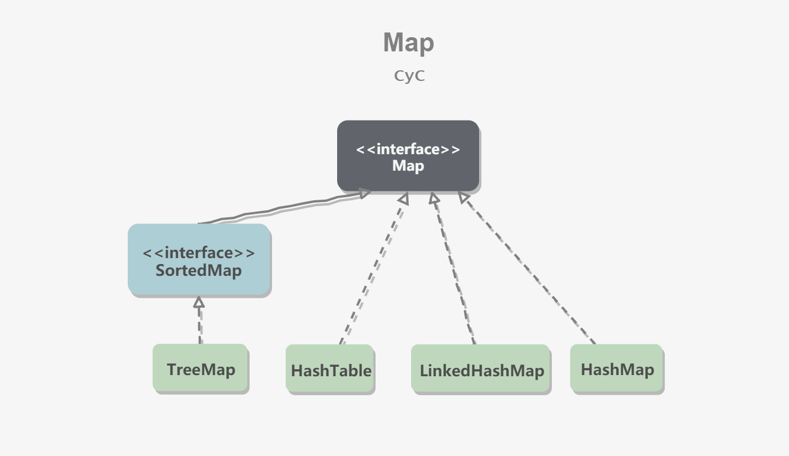

### Java概述
#### * Java学习路线
-   Java基础-->流程控制-->面向对象(包括Java语法)-->Java集合-->Java IO流-->异常-->多线程-->网络编程-->反射
-   JavaWeb基础-->HTML/CSS/JavaScript/jQuery-->Tomcat-->XML/注解->Servlet-->HTTP-->Filter过滤器和监听器-->JSP-->AJAX/JSON-->数据库(MySQL)-->JDBC和DbUtils
-   项目管理和框架-->Maven-->SpringBoot
-   Linux基本命令

#### * java和c++的区别
* 都是面向对象的编程语言，支持封装、多态和继承
* java不提供指针来访问内存，程序内存更加安全
* java的类是单继承的，c++支持多重继承，java的接口支持多继承
* java有自动内存管理垃圾回收机制(GC)，不需要程序员手动释放无用内存
* C++同时支持方法重载和操作符重载，java只支持方法重载

#### * JDK 和 JRE
*   JRE：Java Runtime Environment，Java 运行环境的简称，为 Java 的运行提供了所需的环境。它是一个 JVM 程序，主要包括了 JVM 的标准实现和一些 Java 基本类库。
*   JDK：Java Development Kit，Java 开发工具包，提供了 Java 的开发及运行环境。JDK 是 Java 开发的核心，集成了 JRE 以及一些其它的工具，比如编译 Java 源码的编译器 javac 等。

#### * 面向对象三大特征
**封装**
封装是指把一个对象的状态信息（也就是属性）隐藏在对象内部，不允许外部对象直接访问对象的内部信息。  

**继承**
继承是使用已存在的类的定义作为基础建立新类的技术，新类的定义可以增加新的数据或新的功能，可以使用父类的功能，但不是选择性的继承父类。  

1. 子类拥有父类对象所有的属性和方法（包括私有属性和私有方法，只是拥有，不能访问）
2. 子类可以扩展自己的属性和方法
3. 子类可以用自己的方式实现父类的方法（重写）

**多态**
父类的引用指向子类的实例【动物（猫、狗、猪）】

-   对象类型和引用类型之间具有继承（类）/实现（接口）的关系；
-   引用类型变量发出的方法调用的到底是哪个类中的方法，必须在程序运行期间才能确定；
-   多态不能调用“只在子类存在但在父类不存在”的方法；
-   如果子类重写了父类的方法，真正执行的是子类覆盖的方法，如果子类没有覆盖父类的方法，执行的是父类的方法。

### Java数据类型
#### * java中的基本数据类型是什么？


1. Java 里使用 `long` 类型的数据一定要在数值后面加上 **L**，否则将作为整型解析
2. `char a = 'h'`char :单引号，`String a = "hello"` :双引号。

基本数据类型直接存放在 Java 虚拟机栈中的局部变量表中，而包装类型属于对象类型，我们知道对象实例都存在于堆中。   
局部变量表主要存放了编译期可知的基本数据类型（boolean、byte、char、short、int、float、long、double）、对象引用。

#### * 包装类型
基本类型都有对应的包装类型，基本类型与其对应的包装类型之间的赋值使用自动装箱与拆箱完成。

* 装箱：将基本类型用它们对应的引用类型包装起来；
* 拆箱：将包装类型转换为基本数据类型；
```java
Integer i = 10;  //装箱
int n = i;  //拆箱
```
从字节码中，我们发现装箱其实就是调用了 包装类的`valueOf()`方法，拆箱其实就是调用了 `xxxValue()`方法
```java
Integer i = 10; //等价于Integer i = Integer.valueOf(10)
int n = i; //等价于 int n = i.intValue()
```

#### * 基本类型缓存池
Java 基本类型的包装类的大部分都实现了常量池技术。`Byte`,`Short`,`Integer`,`Long` 这 4 种包装类默认创建了数值 **[-128，127]** 的相应类型的缓存数据，`Character` 创建了数值在[0,127]范围的缓存数据，`Boolean` 直接返回 `True` Or `False`。   

如果超出对应范围仍然会去创建新的对象，缓存的范围区间的大小只是在性能和资源之间的权衡。

两种浮点数类型的包装类 `Float`,`Double` 并没有实现常量池技术。

记住：**所有整型包装类对象之间值的比较，全部使用 equals 方法比较**

new Integer(123) 与 Integer.valueOf(123) 的区别在于：
-   new Integer(123) 每次都会新建一个对象；
-   Integer.valueOf(123) 会使用缓存池中的对象，多次调用会取得同一个对象的引用。

#### * String字符串类型
String 被声明为 final，因此它不可被继承。(Integer 等包装类也不能被继承）
* 在 Java 8 中，String 内部使用 char 数组存储数据
* 在 Java 9 之后，String 类的实现改用 byte 数组存储字符串，同时使用 `coder` 来标识使用了哪种编码

#### * String不可变的好处
1. 可以缓存 hash 值
     * 因为 String 的 hash 值经常被使用，例如 String 用做 HashMap 的 key。不可变的特性可以使得 hash 值也不可变，因此只需要进行一次计算。
2. String Pool 的需要
     * 如果一个 String 对象已经被创建过了，那么就会从 String Pool 中取得引用。只有 String 是不可变的，才可能使用 String Pool。
3. 安全性
     * String 经常作为参数，String 不可变性可以保证参数不可变。例如在作为网络连接参数的情况下如果 String 是可变的，那么在网络连接过程中，String 被改变，改变 String 的那一方以为现在连接的是其它主机，而实际情况却不一定是。
4. 线程安全
     * String不可变性天生具备线程安全，可以在多个线程中安全地使用。 

#### * String, StringBuffer and StringBuilder
1. 可变性
     * String不可变
     * StringBuffer和StringBuilder可变
2. 线程安全
     * String不可变，因此是线程安全的
     * StringBuilder不是线程安全的
     * StringBuffer是线程安全的，内部使用synchronized进行同步

#### * 字符串常量池
字符串常量池（String Pool）保存着**所有字符串字面量**（literal strings），这些字面量在编译时期就确定。不仅如此，还可以**使用 String 的 intern() 方法**在运行过程将字符串添加到 String Pool 中。

当一个字符串调用 intern() 方法时，如果 String Pool 中已经存在一个字符串和该字符串值相等（使用 **equals() 方法**进行确定），那么就会**返回 String Pool 中字符串的引用**；否则，就会在 String Pool 中**添加一个新的字符串，并返回这个新字符串的引用**。

1. 使用`new String("abc")`一共会创建两个字符串对象（前提是 String Pool 中还没有 "abc" 字符串对象）。
     *   "abc" 属于字符串字面量，因此编译时期会在 String Pool 中创建一个字符串对象，指向这个 "abc" 字符串字面量；
     *   而使用 new 的方式会在堆中创建一个字符串对象。
2. 如果是采用 `bbb` 这种字面量的形式创建字符串，会自动地将字符串放入 String Pool 中。
```java
String s5 = "bbb";
String s6 = "bbb";
System.out.println(s5 == s6);  // true
```

在 Java 7 之前，String Pool 被放在运行时常量池中，它属于永久代。而在 Java 7，String Pool 被移到堆中。这是因为永久代的空间有限，在大量使用字符串的场景下会导致 OutOfMemoryError 错误。

#### * 字符型常量和字符串常量的区别
1. 形式: 字符常量是单引号引起的一个字符，字符串常量是双引号引起的 0 个或若干个字符
2. 含义: 字符常量相当于一个整型值( ASCII 值),可以参加表达式运算; 字符串常量代表一个地址值(该字符串在内存中存放位置)
3. 占内存大小 字符常量只占 2 个字节; 字符串常量占若干个字节 (**注意： char 在 Java 中占两个字节**)

### Java运算
#### * 为什么java中只有值传递？
Java 程序设计语言总是采用按值调用。也就是说，**方法得到的是所有参数值的一个拷贝，也就是说，方法不能修改传递给它的任何参数变量的内容。 **

java中方法参数的使用：
1. 一个方法不能修改一个基本数据类型的参数（数值型或布尔型）
2. 一个方法可以改变一个对象参数的状态
3. 一个方法不可以让对象参数引用一个新的对象

#### * Java参数传递
Java 的参数是以值传递的形式传入方法中，而不是引用传递。

以下代码中 Dog dog 的 dog 是一个指针，存储的是对象的地址。在将一个参数传入一个方法时，本质上是将对象的地址以值的方式传递到形参中。
```java
public class Dog {
    String name;
    Dog(String name) {
        this.name = name;
    }
    String getName() {
        return this.name;
    }
    void setName(String name) {
        this.name = name;
    }
    String getObjectAddress() {
        return super.toString();
    }
}
```

在方法中改变对象的字段值会改变原对象该字段值，因为引用的是同一个对象。
```java
class PassByValueExample {
    public static void main(String[] args) {
        Dog dog = new Dog("A");
        func(dog);
        System.out.println(dog.getName());          // B
    }

    private static void func(Dog dog) {
        dog.setName("B");
    }
}
```

但是在方法中将指针引用了其它对象，那么此时方法里和方法外的两个指针指向了不同的对象，在一个指针改变其所指向对象的内容对另一个指针所指向的对象没有影响。
```java
public class PassByValueExample {
    public static void main(String[] args) {
        Dog dog = new Dog("A");
        System.out.println(dog.getObjectAddress()); // Dog@4554617c
        func(dog);
        System.out.println(dog.getObjectAddress()); // Dog@4554617c
        System.out.println(dog.getName());          // A
    }

    private static void func(Dog dog) {
        System.out.println(dog.getObjectAddress()); // Dog@4554617c
        dog = new Dog("B");
        System.out.println(dog.getObjectAddress()); // Dog@74a14482
        System.out.println(dog.getName());          // B
    }
}
```

#### * float 与 double
Java 不能隐式执行向下转型，因为这会使得精度降低。

1.1 字面量属于 double 类型，不能直接将 1.1 直接赋值给 float 变量，因为这是向下转型。
```java
// float f = 1.1;
```

1.1f 字面量才是 float 类型。
```java
float f = 1.1f;
```

#### * 隐式类型转换
因为字面量 1 是 int 类型，它比 short 类型精度要高，因此不能隐式地将 int 类型向下转型为 short 类型。
```java
short s1 = 1;
// s1 = s1 + 1;
```

但是使用 += 或者 ++ 运算符会执行隐式类型转换。
```java
s1 += 1;
s1++;
```

上面的语句相当于将 s1 + 1 的计算结果进行了向下转型：
```java
s1 = (short) (s1 + 1);
```

#### * switch语句
从 Java 7 开始，可以在 switch 条件判断语句中使用 String 对象。
```java
String s = "a";
switch (s) {
    case "a":
        System.out.println("aaa");
        break;
    case "b":
        System.out.println("bbb");
        break;
}
```
switch 不支持 long、float、double，是因为 switch 的设计初衷是对那些只有少数几个值的类型进行等值判断，如果值过于复杂，那么还是用 if 比较合适。

### 关键字与方法
#### * final关键字
1. 数据：声明数据为常量，可以是编译时常量，也可以是在运行时被初始化后不能被改变的常量。
      *   对于基本类型，final 使数值不变；
      *   对于引用类型，final 使引用不变，也就不能引用其它对象，但是被引用的对象本身是可以修改的。

```java
final int x = 1;
// x = 2;  // cannot assign value to final variable 'x'
final A y = new A();
y.a = 1;
```

2. 方法：声明方法不能被子类重写。
     * private 方法隐式地被指定为 final，如果在子类中定义的方法和基类中的一个 private 方法签名相同，此时子类的方法不是重写基类方法，而是在子类中定义了一个新的方法。

3. 类：声明类不允许被继承。

#### * static关键字
1. 静态变量
     * 静态变量：又称为类变量，也就是说这个变量属于类的，类所有的实例都共享静态变量，可以直接通过类名来访问它。静态变量在内存中只存在一份。
     * 实例变量：每创建一个实例就会产生一个实例变量，它与该实例同生共死。
```java
public class A {

    private int x;         // 实例变量
    private static int y;  // 静态变量

    public static void main(String[] args) {
        // int x = A.x;  // Non-static field 'x' cannot be referenced from a static context
        A a = new A();
        int x = a.x;
        int y = A.y;
    }
}
```

2. 静态方法
     * 静态方法在类加载的时候就存在了，它不依赖于任何实例。所以静态方法必须有实现，也就是说它不能是抽象方法。
     * 只能访问所属类的静态字段和静态方法，方法中不能有 this 和 super 关键字，因为这两个关键字与具体对象关联。
```java
public abstract class A {
    public static void func1(){
    }
    // public abstract static void func2();  // Illegal combination of modifiers: 'abstract' and 'static'
}
```

3. 静态语句块
     * 静态语句块在类初始化时运行一次。
```java
public class A {
    static {
        System.out.println("123");
    }

    public static void main(String[] args) {
        A a1 = new A();
        A a2 = new A();
    }
}
```

4. 静态内部类
     * 非静态内部类依赖于外部类的实例，也就是说需要先创建外部类实例，才能用这个实例去创建非静态内部类。而静态内部类不需要。
```java
public class OuterClass {

    class InnerClass {
    }

    static class StaticInnerClass {
    }

    public static void main(String[] args) {
        // InnerClass innerClass = new InnerClass(); // 'OuterClass.this' cannot be referenced from a static context
        OuterClass outerClass = new OuterClass();
        InnerClass innerClass = outerClass.new InnerClass();
        StaticInnerClass staticInnerClass = new StaticInnerClass();
    }
}
```

5. 静态导包
     * 在使用静态变量和方法时不用再指明 ClassName，从而简化代码，但可读性大大降低。
```java
import static com.xxx.ClassName.*
```

6. 初始化顺序
     * 静态变量和静态语句块优先于实例变量和普通语句块，静态变量和静态语句块的初始化顺序取决于它们在代码中的顺序。
     * 存在继承的情况下，初始化顺序为：
          * 父类（静态变量、静态语句块）
          * 子类（静态变量、静态语句块）
          * 父类（实例变量、普通语句块）
          * 父类（构造函数）
          * 子类（实例变量、普通语句块）
          * 子类（构造函数）

#### * 在一个静态方法内调用一个非静态成员
静态方法是属于类的，在类加载的时候就会分配内存，可以通过类名直接访问。而非静态成员属于实例对象，只有在对象实例化之后才存在，然后通过类的实例对象去访问。在类的非静态成员不存在的时候静态成员就已经存在了，此时调用在内存中还不存在的非静态成员，属于**非法操作**。

#### * 成量变量与局部变量的区别
1. 从语法形式上看，成员变量属于类，可以被public、private和static修饰；局部变量是在代码块方法中定义的或是方法的参数，不能被访问控制修饰符和static修饰；两者都可以被final修饰
2. 成员变量用static修饰属于类，不修饰属于实例。对象存在于堆中，局部变量存在于栈内存中
3. 成员变量属于对象一部分，随着对象的创建而存在；局部变量随着方法的调用自动消失。
4. 成员变量没有赋初值可以默认赋值，局部变量不行。

#### * 构造方法有哪些特点？
1. 名字与类名相同
2. 没有返回值，但不能用void声明构造函数
3. 生成类的对象时自动执行，无需调用

构造方法**不能被 override（重写）,但是可以 overload（重载）**,所以你可以看到一个类中有多个构造函数的情况。

#### * equals()方法
`equals()` 方法存在两种使用情况：
1.  **类没有覆盖 `equals()`方法** ：通过`equals()`比较该类的两个对象时，等价于通过`==`比较这两个对象，使用的默认是 `Object`类`equals()`方法。
2. **类覆盖了 `equals()`方法** ：一般我们都覆盖 `equals()`方法来比较两个对象中的属性是否相等；若它们的属性相等，则返回 true(即，认为这两个对象相等)。   
    例如：`String` 中的 `equals` 方法是被重写过的，因为 `Object` 的 `equals` 方法是比较的对象的内存地址，而 `String` 的 `equals` 方法比较的是对象的值。

#### *  `==`和equals()的区别
1. 对于基本数据类型来说，`==`比较的是值。对于引用数据类型来说，`==`比较的是对象的内存地址。
     * 因为 Java 只有值传递，所以，对于 `==` 来说，不管是比较基本数据类型，还是引用数据类型的变量，其**本质比较的都是值**，只是引用类型变量存的值是对象的地址。

2. equals()不能用于判断基本数据类型的变量，只能用来判断两个对象是否相等。equals()方法存在于`Object`类中，而`Object`类是所有类的直接或间接父类。

#### * hashCode()方法
hashCode() 返回哈希值，而 equals() 是用来判断两个对象是否等价。等价的两个对象散列值一定相同，但是散列值相同的两个对象不一定等价，这是因为计算哈希值具有随机性，两个值不同的对象可能计算出相同的哈希值。
	
>在覆盖 equals() 方法时应当总是覆盖 hashCode() 方法，保证等价的两个对象哈希值也相等。

**HashSet 和 HashMap** 等集合类使用了 hashCode() 方法来计算对象应该存储的位置，因此要将对象添加到这些集合类中，需要让对应的类实现 hashCode() 方法。

下面的代码中，新建了两个等价的对象，并将它们添加到 HashSet 中。我们希望将这两个对象当成一样的，只在集合中添加一个对象。但是 EqualExample **没有实现 hashCode() 方法**，因此这两个对象的哈希值是不同的，最终导致集合添加了两个等价的对象。
```java
EqualExample e1 = new EqualExample(1, 1, 1);
EqualExample e2 = new EqualExample(1, 1, 1);
System.out.println(e1.equals(e2)); // true
HashSet<EqualExample> set = new HashSet<>();
set.add(e1);
set.add(e2);
System.out.println(set.size());   // 2
```

理想的哈希函数应当具有均匀性，即不相等的对象应当均匀分布到所有可能的哈希值上。这就要求了哈希函数要把所有域的值都考虑进来。可以将每个域都当成 R 进制的某一位，然后组成一个 R 进制的整数。

#### * clone()方法
1. cloneable
     * clone() 是 Object 的 protected 方法，它不是 public，一个类不显式去重写 clone()，其它类就不能直接去调用该类实例的 clone() 方法。
     * 应该注意的是，clone() 方法并不是 Cloneable 接口的方法，而是 Object 的一个 protected 方法。Cloneable 接口只是规定，如果一个类没有实现 Cloneable 接口又调用了 clone() 方法，就会抛出 CloneNotSupportedException。
```java
public class CloneExample implements Cloneable {
    private int a;
    private int b;

    @Override
    public Object clone() throws CloneNotSupportedException {
        return super.clone();
    }
}
```

#### * 深拷贝和浅拷贝
1. **浅拷贝**：对基本数据类型进行值传递，对引用数据类型进行引用传递般的拷贝，此为浅拷贝。
2. **深拷贝**：对基本数据类型进行值传递，对引用数据类型，创建一个新的对象，并复制其内容，此为深拷贝。 

#### * clone() 的替代方案
使用 clone() 方法来拷贝一个对象即复杂又有风险，它会抛出异常，并且还需要类型转换.Effective Java 书上讲到，最好不要去使用 clone()，可以使用拷贝构造函数或者拷贝工厂来拷贝一个对象。
```java
public class CloneConstructorExample {

    private int[] arr;

    public CloneConstructorExample() {
        arr = new int[10];
        for (int i = 0; i < arr.length; i++) {
            arr[i] = i;
        }
    }

    public CloneConstructorExample(CloneConstructorExample original) {
        arr = new int[original.arr.length];
        for (int i = 0; i < original.arr.length; i++) {
            arr[i] = original.arr[i];
        }
    }

    public void set(int index, int value) {
        arr[index] = value;
    }

    public int get(int index) {
        return arr[index];
    }
}
```

### 访问与继承
#### * 访问权限


#### * 抽象类
抽象类和抽象方法都使用 abstract 关键字进行声明。如果一个类中包含抽象方法，那么这个类必须声明为抽象类。

抽象类和普通类最大的区别是，抽象类不能被实例化，只能被继承。
```java
public abstract class AbstractClassExample {

    protected int x;
    private int y;

    public abstract void func1();

    public void func2() {
        System.out.println("func2");
    }
}
```

```java
public class AbstractExtendClassExample extends AbstractClassExample {
    @Override
    public void func1() {
        System.out.println("func1");
    }
}
```

#### * 接口介绍
接口是抽象类的延伸，在 Java 8 之前，它可以看成是一个完全抽象的类，也就是说它不能有任何的方法实现。

从 Java 8 开始，接口也可以拥有默认的方法实现，这是因为不支持默认方法的接口的维护成本太高了。在 Java 8 之前，如果一个接口想要添加新的方法，那么要修改所有实现了该接口的类，让它们都实现新增的方法。

接口的成员（字段 + 方法）默认都是 public 的，并且不允许定义为 private 或者 protected。从 Java 9 开始，允许将方法定义为 private，这样就能定义某些复用的代码又不会把方法暴露出去。

接口的字段默认都是 static 和 final 的。

```java
public interface InterfaceExample {

    void func1();

    default void func2(){
        System.out.println("func2");
    }

    int x = 123;
    // int y;               // Variable 'y' might not have been initialized
    public int z = 0;       // Modifier 'public' is redundant for interface fields
    // private int k = 0;   // Modifier 'private' not allowed here
    // protected int l = 0; // Modifier 'protected' not allowed here
    // private void fun3(); // Modifier 'private' not allowed here
}
```

```java
public class InterfaceImplementExample implements InterfaceExample {
    @Override
    public void func1() {
        System.out.println("func1");
    }
}
```

#### * 抽象类与接口的比较
* 从设计层面上看，抽象类提供了一种 IS-A 关系，需要满足里式替换原则，即子类对象必须能够替换掉所有父类对象。而接口更像是一种 LIKE-A 关系，它只是提供一种方法实现契约，并不要求接口和实现接口的类具有 IS-A 关系。
* 从使用上来看，一个类可以实现多个接口，但是不能继承多个抽象类。
* 接口的字段只能是 static 和 final 类型的，而抽象类的字段没有这种限制。
* 接口的成员只能是 public 的，而抽象类的成员可以有多种访问权限。

#### * 抽象类与接口的使用建议
1. 使用接口：
      * 需要让不相关的类都实现一个方法，例如不相关的类都可以实现 Comparable 接口中的 compareTo() 方法；
      *  需要使用多重继承。
2. 使用抽象类：
      * 需要在几个相关的类中共享代码。
      * 需要能控制继承来的成员的访问权限，而不是都为 public。
      * 需要继承非静态和非常量字段。

在很多情况下，接口优先于抽象类。因为接口**没有抽象类严格的类层次结构要求，可以灵活地为一个类添加行为**。并且从 Java 8 开始，接口也可以有默认的方法实现，使得修改接口的成本也变的很低。

#### * super的作用
*   访问父类的构造函数：可以使用 super() 函数访问父类的构造函数，从而委托父类完成一些初始化的工作。应该注意到，子类一定会调用父类的构造函数来完成初始化工作，一般是调用父类的默认构造函数，如果子类需要调用父类其它构造函数，那么就可以使用 super() 函数。
*   访问父类的成员：如果子类重写了父类的某个方法，可以通过使用 super 关键字来引用父类的方法实现。

#### * 重载和重写
重载：同样的方法能够根据输入数据的不同做出不同的处理
重写：当子类继承父类的相同方法，输入数据一样，相应不一样

方法的签名：方法名及参数类型


###  Java反射机制
#### * 什么是Java反射
每个类都有一个 **Class** 对象，包含了与类有关的信息。当编译一个新类时，会产生一个同名的 .class 文件，该文件内容保存着 Class 对象。

类加载相当于 Class 对象的加载，类在第一次使用时才动态加载到 JVM 中。也可以使用 `Class.forName("com.mysql.jdbc.Driver")` 这种方式来控制类的加载，该方法会返回一个 Class 对象。

**反射可以提供运行时的类信息，并且这个类可以在运行时才加载进来，甚至在编译时期该类的 .class 不存在也可以加载进来。**

Class 和 java.lang.reflect 一起对反射提供了支持，java.lang.reflect 类库主要包含了以下三个类：
*   **Field** ：可以使用 get() 和 set() 方法读取和修改 Field 对象关联的字段；
*   **Method** ：可以使用 invoke() 方法调用与 Method 对象关联的方法；
*   **Constructor** ：可以用 Constructor 的 newInstance() 创建新的对象。

#### * 反射的优点
* 有些编码需求在source阶段无法实现，只能在runtime阶段通过反射实现
*   **可扩展性** ：应用程序可以利用全限定名创建可扩展对象的实例，来使用来自外部的用户自定义类。
*   **类浏览器和可视化开发环境** ：一个类浏览器需要可以枚举类的成员。可视化开发环境（如 IDE）可以从利用反射中可用的类型信息中受益，以帮助程序员编写正确的代码。
*   **调试器和测试工具** ： 调试器需要能够检查一个类里的私有成员。测试工具可以利用反射来自动地调用类里定义的可被发现的 API 定义，以确保一组测试中有较高的代码覆盖率。

#### * 反射的缺点
* **性能开销** ：反射涉及了动态类型的解析，所以 JVM 无法对这些代码进行优化。因此，反射操作的效率要比那些非反射操作低得多。我们应该避免在经常被执行的代码或对性能要求很高的程序中使用反射。
* **安全限制** ：使用反射技术要求程序必须在一个没有安全限制的环境中运行。如果一个程序必须在有安全限制的环境中运行，如 Applet，那么这就是个问题了。
* **内部暴露** ：由于反射允许代码执行一些在正常情况下不被允许的操作（比如访问私有的属性和方法），所以使用反射可能会导致意料之外的副作用，这可能导致代码功能失调并破坏可移植性。反射代码破坏了抽象性，因此当平台发生改变的时候，代码的行为就有可能也随着变化。

#### * 反射的应用
1.  我们在使用 JDBC 连接数据库时使用 `Class.forName()`通过反射加载数据库的驱动程序；
2.  Spring 框架的 IOC（动态加载管理 Bean）创建对象以及 AOP（动态代理）功能都和反射有联系，实现对类或者对象的构造器、方法、属性、注解的获取和操作；

#### * 得到Class类型的实例方法
1. 对一个对象调用 getClass 方法，获得该对象所属的类的 Class 对象。
2. 调用静态方法 Class.forName，将类名作为参数，获得类名对应的 Class 对象。
3. 对任意的 Java 类型 T（包括基本数据类型、引用类型、数组、关键字 void），调用 T.class 获得类型 T 对应的 Class 对象，此时获得的 Class 对象表示一个类型，但是这个类型不一定是一种类。

### 异常
#### * Java异常介绍
在 Java 中，所有的异常都有一个共同的祖先 `java.lang` 包中的 `Throwable` 类。

`Throwable` 类有两个重要的子类 `Exception`（异常）和 `Error`（错误）。

`Exception` 能被程序本身处理(`try-catch`)， `Error` 是无法处理的(只能尽量避免)。


* **`Exception`** :程序本身可以处理的异常，可以通过 `catch` 来进行捕获。`Exception` 又可以分为 受检查异常(必须处理) 和 不受检查异常(可以不处理)。   
* **`Error`** ：`Error` 属于程序无法处理的错误 ，我们没办法通过 `catch` 来进行捕获 。例如，Java 虚拟机运行错误（`Virtual MachineError`）、虚拟机内存不够错误(`OutOfMemoryError`)、类定义错误（`NoClassDefFoundError`）等 。这些异常发生时，Java 虚拟机（JVM）一般会选择线程终止。  

java 代码在编译过程中，如果受检查异常没有被 `catch`/`throw` 处理的话，就没办法通过编译 。除了`RuntimeException`及其子类以外，其他的`Exception`类及其子类都属于受检查异常 。常见的受检查异常有： IO 相关的异常、`ClassNotFoundException` 、`SQLException`。

`RuntimeException` 及其子类都统称为非受检查异常，例如：`NullPointerException`、`NumberFormatException`（字符串转换为数字）、`ArrayIndexOutOfBoundsException`（数组越界）、`ClassCastException`（类型转换错误）、`ArithmeticException`（算术错误）等。

#### * Throwable类常用方法
1. `public string getMessage()`: 返回异常发生时的简要描述
2. `public string toString()`: 返回异常时的详细信息
3. `public string getLocalizedMessage()`返回异常对象的本地化信息
4. `public void printStackTrace()`: 在控制台上打印`Throwable`对象的封装的异常信息。  

#### * try-catch-finally 
1.  **适用范围（资源的定义）：** 任何实现 `java.lang.AutoCloseable`或者 `java.io.Closeable` 的对象
2.  **关闭资源和 finally 块的执行顺序：** 在 `try-with-resources` 语句中，任何 catch 或 finally 块在声明的资源关闭后运行  

>面对必须要关闭的资源，我们总是应该优先使用 `try-with-resources` 而不是`try-finally`。随之产生的代码更简短，更清晰，产生的异常对我们也更有用。`try-with-resources`语句让我们更容易编写必须要关闭的资源的代码，若采用`try-finally`则几乎做不到这点。

#### * try{}中有return,finaly{}中code是否执行
会执行，在方法返回调用者前执行。

#### * throw与throws
 *  **throw** -- 用于抛出异常。  
 *  **throws** -- 用在方法签名中，用于声明该方法可能抛出的异常。

### Java泛型
#### * Java泛型是什么，为什么用
 泛型提供了编译时类型安全检测机制，该机制允许程序员在编译时检测到非法的类型。泛型的本质是参数化类型，也就是说所操作的数据类型被指定为一个参数。   

 #### * 什么是类型擦除
 Java 的泛型是伪泛型，这是因为 Java 在编译期间，所有的泛型信息都会被擦掉，这也就是通常所说类型擦除 。

#### * 泛型的使用方法
1. 泛型类 
     * 泛型类型用于类的定义中，被称为泛型类。通过泛型可以完成对一组类的操作对外开放相同的接口。最典型的就是各种容器类，如：List、Set、Map。
2. 泛型接口
      * 泛型接口与泛型类的定义及使用基本相同。泛型接口常被用在各种类的生产器中
3. 泛型方法
     * 泛型方法，是在调用方法的时候指明泛型的具体类型

#### * 泛型常用通配符
**常用的通配符为： T，E，K，V，？**
 * ？表示不确定的java类型
 * T(type)表示一个具体的java类型
 * K V(key value)分别表示java键值中的key value
 * E(element)代表Element

#### * 泛型中的限定通配符和非限定通配符
* 限定通配符
    * `<? extends T>`：它通过确保类型必须是T的子类来设定类型的上界
    * `<? super T>`：它通过确保类型必须是T的父类来设定类型的下界
    * 泛型类型必须用限定内的类型来进行初始化，否则会导致编译错误

* 非限定通配符`<?>`：可以用任意类型来替代

#### * Array中可以用泛型吗
Array不支持泛型，Effective Java一书中建议使用List来代替Array，因为List可以提供编译期的类型安全保证，而Array却不能。

### 注解
#### * 什么是注解
Java 注解是附加在代码中的一些元信息，用于一些工具在编译、运行时进行解析和使用，起到说明、配置的功能。注解不会也不能影响代码的实际逻辑，仅仅起到辅助性的作用。

#### * 注解的原理
注解本质是一个继承了Annotation 的特殊接口，其具体实现类是**Java 运行时生成的动态代理类**。而我们**通过反射获取注解**时，返回的是Java 运行时生成的**动态代理对象**$Proxy1。通过代理对象调用自定义注解（接口）的方法，会最终调用AnnotationInvocationHandler 的**invoke**方法。该方法会从memberValues 这个Map 中索引出对应的值。而memberValues 的来源是Java 常量池。

#### * 元注解包括哪几种
java.lang.annotation 提供了四种元注解，专门注解其他的注解（在自定义注解的时候，需要使用到元注解）：  
 * @Documented – 注解是否将包含在JavaDoc中  
 * @Retention – 什么时候使用该注解  
 * @Target – 注解用于什么地方  
 * @Inherited – 是否允许子类继承该注解

### Java I/O
#### * Java I/O分类
-   磁盘操作：File
-   字节操作：InputStream 和 OutputStream
-   字符操作：Reader 和 Writer
-   对象操作：Serializable
-   网络操作：Socket
-   新的输入/输出：NIO

#### * Java I/O实现
Java I/O 使用了装饰者模式来实现。以 InputStream 为例
*   InputStream 是抽象组件；
*   FileInputStream 是 InputStream 的子类，属于具体组件，提供了字节流的输入操作；
*   FilterInputStream 属于抽象装饰者，装饰者用于装饰组件，为组件提供额外的功能。例如 BufferedInputStream 为 FileInputStream 提供缓存的功能。

实例化一个具有缓存功能的字节流对象时，只需要在 FileInputStream 对象上再套一层 BufferedInputStream 对象即可。
```java
FileInputStream fileInputStream = new FileInputStream(filePath);
BufferedInputStream bufferedInputStream = new BufferedInputStream(fileInputStream);
```
DataInputStream 装饰者提供了对更多数据类型进行输入的操作，比如 int、double 等基本类型

#### * java中的IO流
-   按照流的流向分，可以分为输入流和输出流；
-   按照操作单元划分，可以划分为字节流和字符流；
-   按照流的角色划分为节点流和处理流。


#### * 为什么有字节流和字符流
字符流是由 Java 虚拟机将字节转换得到的，问题就出在这个过程还算是非常耗时，并且，如果我们不知道编码类型就很容易出现乱码问题。所以， I/O 流就干脆提供了一个直接操作字符的接口，方便我们平时对字符进行流操作。如果音频文件、图片等媒体文件用字节流比较好，如果涉及到字符的话使用字符流比较好。 

#### * 磁盘操作
File 类可以用于表示文件和目录的信息，但是它不表示文件的内容。

递归地列出一个目录下所有文件
```java
public static void listAllFiles(File dir) {
    if (dir == null || !dir.exists()) {
        return;
    }
    if (dir.isFile()) {
        System.out.println(dir.getName());
        return;
    }
    for (File file : dir.listFiles()) {
        listAllFiles(file);
    }
}
```
从 Java7 开始，可以使用 Paths 和 Files 代替 File

#### * 字节操作
实现文件复制
```java
public static void copyFile(String src, String dist) throws IOException {
    FileInputStream in = new FileInputStream(src);
    FileOutputStream out = new FileOutputStream(dist);

    byte[] buffer = new byte[20 * 1024];
    int cnt;

    // read() 最多读取 buffer.length 个字节
    // 返回的是实际读取的个数
    // 返回 -1 的时候表示读到 eof，即文件尾
    while ((cnt = in.read(buffer, 0, buffer.length)) != -1) {
        out.write(buffer, 0, cnt);
    }

    in.close();
    out.close();
}
```

#### * 字符操作
1. 编码与解码
    * 编码就是把字符转换为字节，而解码是把字节重新组合成字符。
    * Java 的内存编码使用双字节编码 `UTF-16be`，这不是指 Java 只支持这一种编码方式，而是说 char 这种类型使用 UTF-16be 进行编码。char 类型占 16 位，也就是两个字节，Java 使用这种双字节编码是为了让一个中文或者一个英文都能使用一个 char 来存储。
2. String的编码方式 
     * String 可以看成一个字符序列，可以指定一个编码方式将它编码为字节序列，也可以指定一个编码方式将一个字节序列解码为 String。
	
```java
String str1 = "中文";
byte[] bytes = str1.getBytes("UTF-8");
String str2 = new String(bytes, "UTF-8");
System.out.println(str2);
```

3. Reader与Writer
     * 不管是磁盘还是网络传输，最小的存储单元都是字节，而不是字符。但是在程序中操作的通常是字符形式的数据，因此需要提供对字符进行操作的方法。
     * InputStreamReader 实现从字节流解码成字符流；
     * OutputStreamWriter 实现字符流编码成为字节流。

实现逐行输出文本文件的内容
```java
public static void readFileContent(String filePath) throws IOException {

    FileReader fileReader = new FileReader(filePath);
    BufferedReader bufferedReader = new BufferedReader(fileReader);

    String line;
    while ((line = bufferedReader.readLine()) != null) {
        System.out.println(line);
    }

    //装饰者模式使得 BufferedReader 组合了一个 Reader 对象
    //在调用 BufferedReader 的 close() 方法时会去调用 Reader 的 close() 方法
    //因此只要一个 close() 调用即可
    bufferedReader.close();
}
```

#### * 对象操作
1. 序列化与反序列化
     * 序列化就是将一个对象转换成字节序列，方便存储和传输。
     * 序列化：ObjectOutputStream.writeObject()
     * 反序列化：ObjectInputStream.readObject()

不会对静态变量进行序列化，因为序列化只是保存对象的状态，静态变量属于类的状态

2. Serializable
     * 序列化的类需要实现 Serializable 接口，它只是一个标准，没有任何方法需要实现，但是如果不去实现它的话而进行序列化，会抛出异常。

```java
public static void main(String[] args) throws IOException, ClassNotFoundException {

    A a1 = new A(123, "abc");
    String objectFile = "file/a1";

    ObjectOutputStream objectOutputStream = new ObjectOutputStream(new FileOutputStream(objectFile));
    objectOutputStream.writeObject(a1);
    objectOutputStream.close();

    ObjectInputStream objectInputStream = new ObjectInputStream(new FileInputStream(objectFile));
    A a2 = (A) objectInputStream.readObject();
    objectInputStream.close();
    System.out.println(a2);
}

private static class A implements Serializable {

    private int x;
    private String y;

    A(int x, String y) {
        this.x = x;
        this.y = y;
    }

    @Override
    public String toString() {
        return "x = " + x + "  " + "y = " + y;
    }
}
```

3. transient
     * transient 关键字可以使一些属性不会被序列化。
     * ArrayList 中存储数据的数组 elementData 是用 transient 修饰的，因为这个数组是动态扩展的，并不是所有的空间都被使用，因此就不需要所有的内容都被序列化。通过重写序列化和反序列化方法，使得可以只序列化数组中有内容的那部分数据。
	
```java
private transient Object[] elementData;
```

### Java容器集合
#### * Java容器概述
容器主要包括 Collection 和 Map 两种，Collection 存储着对象的集合，而 Map 存储着键值对（两个对象）的映射表。

#### * Collection接口


1. Set集合
     * **TreeSet**：基于红黑树实现，支持**有序性操作**，例如根据一个范围查找元素的操作。但是查找效率不如 HashSet，HashSet 查找的时间复杂度为 O(1)，TreeSet 则为 O(logN)。
     * **HashSet**：基于哈希表实现，支持**快速查找**，但不支持有序性操作。并且失去了元素的插入顺序信息，也就是说使用 Iterator 遍历 HashSet 得到的结果是不确定的。
     * **LinkedHashSet**：具有 HashSet 的查找效率，并且内部使用双向链表维护元素的插入顺序。

2. List链表
     * ArrayList：基于**动态数组**实现，支持**随机访问**。
     * Vector：和 ArrayList 类似，但它是**线程安全的**。
     * LinkedList：基于**双向链表**实现，只能**顺序访问**，但是可以快速地在链表中间插入和删除元素。不仅如此，LinkedList 还可以用作栈、队列和双向队列。

3. Queue队列
     * LinkedList：可以用它来实现双向队列。
     * PriorityQueue：基于堆结构实现，可以用它来实现优先队列。

#### * Map接口


1. TreeMap
     * 基于红黑树实现

2. HashMap
     * 基于哈希表实现

3. HashTable：
    * 和 HashMap 类似，但它是**线程安全**的，这意味着同一时刻多个线程同时写入 HashTable 不会导致数据不一致。它是遗留类，不应该去使用它，而是使用 **ConcurrentHashMap** 来支持线程安全，ConcurrentHashMap 的效率会更高，因为 ConcurrentHashMap 引入了**分段锁**。

#### * 容器中的设计模式
1. 迭代器模式
     * Collection 继承了 Iterable 接口，其中的 iterator() 方法能够产生一个 Iterator 对象，通过这个对象就可以迭代遍历 Collection 中的元素。从 JDK 1.5 之后可以使用 foreach 方法来遍历实现了 Iterable 接口的聚合对象。
```java
List<String> list = new ArrayList<>();
list.add("a");
list.add("b");
for (String item : list) {
    System.out.println(item);
}
```

2. 适配器模式
`java.util.Arrays.asList()` 可以把数组类型转换为 List 类型。
```java
@SafeVarargs
public static <T> List<T> asList(T... a)
```

应该注意的是 asList() 的参数为泛型的变长参数，不能使用基本类型数组作为参数，**只能使用相应的包装类型数组**。
```java
Integer[] arr = {1, 2, 3};
List list = Arrays.asList(arr);
```

也可以使用以下方式调用 asList()：
```java
List list = Arrays.asList(1, 2, 3);
```

#### * Fail-Fast机制
当多个线程对集合进行结构上的改变的操作时，有可能会产生fail-fast机制

modCount 用来记录 ArrayList 结构发生变化的次数。结构发生变化是指添加或者删除至少一个元素的所有操作，或者是调整内部数组的大小，仅仅只是设置元素的值不算结构发生变化。

在进行序列化或者迭代等操作时，需要比较操作前后 modCount 是否改变，如果改变了需要抛出 ConcurrentModificationException。

#### * ArrayList概述
因为 ArrayList 是基于数组实现的，所以支持快速随机访问。**RandomAccess 接口**标识着该类支持快速随机访问。
```java
public class ArrayList<E> extends AbstractList<E>
        implements List<E>, RandomAccess, Cloneable, java.io.Serializable
```

数组的默认大小为 10。
```java
private static final int DEFAULT_CAPACITY = 10;
```

#### * ArrayList扩容
1. 添加元素时使用 ensureCapacityInternal() 方法来保证容量足够;
2. 如果不够时，需要使用 grow() 方法进行扩容，新容量的大小为 `oldCapacity + (oldCapacity >> 1)`，即 oldCapacity+oldCapacity/2。其中 oldCapacity >> 1 需要取整，所以新容量大约是旧容量的 1.5 倍左右。（oldCapacity 为偶数就是 1.5 倍，为奇数就是 1.5 倍-0.5）

扩容操作需要调用 `Arrays.copyOf()` 把原数组整个复制到新数组中，这个操作代价很高，因此最好在创建 ArrayList 对象时就指定大概的容量大小，减少扩容操作的次数。
```java
public boolean add(E e) {
    ensureCapacityInternal(size + 1);  // Increments modCount!!
    elementData[size++] = e;
    return true;
}

private void ensureCapacityInternal(int minCapacity) {
    if (elementData == DEFAULTCAPACITY_EMPTY_ELEMENTDATA) {
        minCapacity = Math.max(DEFAULT_CAPACITY, minCapacity);
    }
    ensureExplicitCapacity(minCapacity);
}

private void ensureExplicitCapacity(int minCapacity) {
    modCount++;
    // overflow-conscious code
    if (minCapacity - elementData.length > 0)
        grow(minCapacity);
}

private void grow(int minCapacity) {
    // overflow-conscious code
    int oldCapacity = elementData.length;
    int newCapacity = oldCapacity + (oldCapacity >> 1);
    if (newCapacity - minCapacity < 0)
        newCapacity = minCapacity;
    if (newCapacity - MAX_ARRAY_SIZE > 0)
        newCapacity = hugeCapacity(minCapacity);
    // minCapacity is usually close to size, so this is a win:
    elementData = Arrays.copyOf(elementData, newCapacity);
}
```

#### * ArrayList删除元素
需要调用 System.arraycopy() 将 index+1 后面的元素都复制到 index 位置上，该操作的时间复杂度为 O(N)，可以看到 ArrayList 删除元素的代价是非常高的。
```java
public E remove(int index) {
    rangeCheck(index);
    modCount++;
    E oldValue = elementData(index);
    int numMoved = size - index - 1;
    if (numMoved > 0)
        System.arraycopy(elementData, index+1, elementData, index, numMoved);
    elementData[--size] = null; // clear to let GC do its work
    return oldValue;
}
```

#### * ArrayList序列化
ArrayList 基于数组实现，并且具有动态扩容特性，因此保存元素的数组不一定都会被使用，那么就没必要全部进行序列化。

保存元素的数组 elementData 使用 transient 修饰，该关键字声明数组默认不会被序列化。
```java
transient Object[] elementData; // non-private to simplify nested class access
```

ArrayList 实现了 `writeObject()` 和 `readObject()`来控制只序列化数组中有元素填充那部分内容。

#### * Vector与ArrayList的比较
* Vector 是**同步**的，因此开销就比 ArrayList 要大，访问速度更慢。最好使用 ArrayList 而不是 Vector，因为同步操作完全可以由程序员自己来控制；
* Vector 每次扩容请求其大小的 **2** 倍（也可以通过构造函数设置增长的容量），而 ArrayList 是 **1.5** 倍。

#### * CopyOnWriteArrayList 
1. 读写分离
     * 写操作在一个复制的数组上进行，读操作还是在原始数组中进行，读写分离，互不影响。
     * 写操作需要加锁，防止并发写入时导致写入数据丢失。
     * 写操作结束之后需要把原始数组指向新的复制数组。

```java
public boolean add(E e) {
    final ReentrantLock lock = this.lock;
    lock.lock();
    try {
        Object[] elements = getArray();
        int len = elements.length;
        Object[] newElements = Arrays.copyOf(elements, len + 1);
        newElements[len] = e;
        setArray(newElements);
        return true;
    } finally {
        lock.unlock();
    }
}

final void setArray(Object[] a) {
    array = a;
}

@SuppressWarnings("unchecked")
private E get(Object[] a, int index) {
    return (E) a[index];
}
```

2. 适用场景

CopyOnWriteArrayList 在写操作的同时允许读操作，大大提高了读操作的性能，因此很适合读多写少的应用场景。

但是 `CopyOnWriteArrayList`有其缺陷：
* 内存占用：在写操作时需要复制一个新的数组，使得内存占用为原来的两倍左右；
* 数据不一致：读操作不能读取实时性的数据，因为部分写操作的数据还未同步到读数组中；
* 所以 CopyOnWriteArrayList 不适合内存敏感以及对实时性要求很高的场景。

#### * LinkedList与ArrayList的比较
ArrayList 基于动态数组实现，LinkedList 基于双向链表实现。ArrayList 和 LinkedList 的区别可以归结为数组和链表的区别：
   * 数组支持随机访问，但插入删除的代价很高，需要移动大量元素；
   * 链表不支持随机访问，但插入删除只需要改变指针。

#### * HashMap底层数据结构
在 JDK 1.8，HashMap 底层是由 “数组+链表+红黑树” 组成，如下图所示，而在 JDK 1.8 之前是由 “数组+链表” 组成，就是下图去掉红黑树。


#### * 为什么使用“数组+链表”
使用 “数组+链表” 是为了解决 hash 冲突的问题。

数组和链表有如下特点：
* 数组：查找容易，通过 index 快速定位；插入和删除困难，需要移动插入和删除位置之后的节点；
* 链表：查找困难，需要从头结点或尾节点开始遍历，直到寻找到目标节点；插入和删除容易，只需修改目标节点前后节点的 next 或 prev 属性即可；

HashMap 巧妙的将数组和链表结合在一起，发挥两者各自的优势，使用一种叫做 **拉链法**  的方式来解决哈希冲突。

首先通过 index 快速定位到索引位置，这边利用了数组的优点；然后遍历链表找到节点，进行节点的新增/修改/删除操作，这边利用了链表的优点。简直，完美。

#### * 为什么要改成“数组+链表+红黑树”
在定位到索引位置后，需要先遍历链表找到节点，这个地方如果链表很长的话，也就是 hash 冲突很严重的时候，会有**查找性能问题**，因此在 JDK1.8中，通过引入红黑树，来优化这个问题。

使用链表的查找性能是 O(n)，而使用红黑树是 O(logn)。

#### * 什么时候用链表？什么时候用红黑树？
* 对于插入，默认情况下是使用链表节点。
* 当同一个索引位置的节点在新增后超过8个（阈值8）：
     * 如果此时数组长度大于等于 64，则会触发链表节点转红黑树节点（treeifyBin）；
     * 而如果数组长度小于64，则不会触发链表转红黑树，而是会进行扩容，因为此时的数据量还比较小。
* 对于移除，当同一个索引位置的节点在移除后达到 6 个（阈值6），并且该索引位置的节点为红黑树节点，会触发红黑树节点转链表节点（untreeify）。

#### * HashMap 有哪些重要属性？
1. size：HashMap 已经存储的节点个数；
2. threshold：1）扩容阈值（主要），当 HashMap 的个数达到该值，触发扩容。2）初始化时的容量，在我们新建 HashMap 对象时， threshold 还会被用来存初始化时的容量。HashMap 直到我们第一次插入节点时，才会对 table 进行初始化，避免不必要的空间浪费。
3. loadFactor：负载因子，扩容阈值 = 容量 * 负载因子。

#### * HashMap的默认初始容量？
默认初始容量是16。HashMap 的容量必须是2的N次方，HashMap 会根据我们传入的容量计算一个“**大于等于该容量的最小的 2 的 N 次方**”，例如传 16，容量为16；传17，容量为32。

#### * HashMap容量为什么必须是2的N次方
核心目的是：**实现节点均匀分布，减少hash冲突**

计算索引位置的公式为：`(n - 1) & hash`，当 n 为 2 的 N 次方时，n - 1 为低位全是 1 的值，此时任何值跟 n - 1 进行 & 运算的结果为该值的低 N 位，达到了和取模同样的效果，实现了均匀分布。实际上，这个设计就是基于公式：`x mod 2^n = x & (2^n - 1)`，因为 & 运算比 mod 具有更高的效率。

#### * LinkedHashMap 和 TreeMap 排序的区别？
LinkedHashMap 和 TreeMap 都是提供了排序支持的 Map，区别在于支持的排序方式不同：
* LinkedHashMap：保存了数据的插入顺序，也可以通过参数设置，保存数据的访问顺序。
* TreeMap：底层是红黑树实现。可以指定比较器（Comparator 比较器），通过重写 compare 方法来自定义排序；如果没有指定比较器，TreeMap 默认是按 Key 的升序排序（如果 key 没有实现 Comparable接口，则会抛异常）。

#### * HashMap 和 Hashtable 的区别
* HashMap 允许 key 和 value 为 null，Hashtable 不允许。
* HashMap 的默认初始容量为 16，Hashtable 为 11。
* HashMap 的扩容为原来的 2 倍，Hashtable 的扩容为原来的 2 倍加 1。
* HashMap 是非线程安全的，Hashtable 是线程安全的，使用 synchronized 修饰方法实现线程安全。
* HashMap 的 hash 值重新计算过，Hashtable 直接使用 hashCode。
* HashMap 去掉了 Hashtable 中的 contains 方法。
* HashMap 继承自 AbstractMap 类，Hashtable 继承自 Dictionary 类。
* HashMap 的性能比 Hashtable 高，因为 Hashtable 使用 synchronized 实现线程安全，还有就是 HashMap 1.8 之后底层数据结构优化成 “数组+链表+红黑树”，在极端情况下也能提升性能。

#### * 介绍下 ConcurrenHashMap
ConcurrentHashMap 是 HashMap 的线程安全版本，和 HashMap 一样，在JDK 1.8 中进行了较大的优化。

JDK1.7：底层结构为：分段的数组+链表；实现线程安全的方式：分段锁（Segment，继承了ReentrantLock

JDK1.8：底层结构为：数组+链表+红黑树；实现线程安全的方式：CAS + Synchronized

区别：
* JDK1.8 中降低锁的粒度。JDK1.7 版本锁的粒度是基于 Segment 的，包含多个节点（HashEntry），而 JDK1.8 锁的粒度就是单节点（Node）。
* JDK1.8 版本的数据结构变得更加简单，使得操作也更加清晰流畅，因为已经使用 synchronized 来进行同步，所以不需要分段锁的概念，也就不需要 Segment 这种数据结构了，当前还保留仅为了兼容。
* JDK1.8 使用红黑树来优化链表，跟 HashMap 一样，优化了极端情况下，链表过长带来的性能问题。
* JDK1.8 使用内置锁 synchronized 来代替重入锁 ReentrantLock，synchronized 是官方一直在不断优化的，现在性能已经比较可观，也是官方推荐使用的加锁方式。