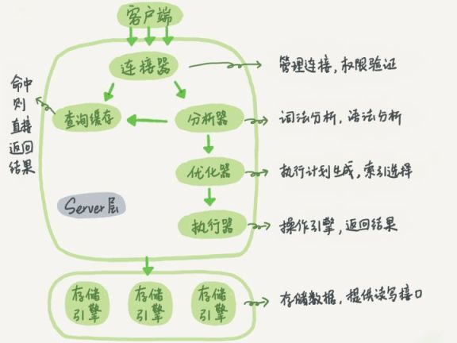
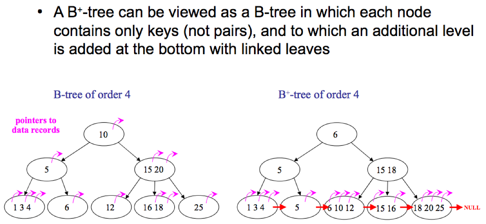
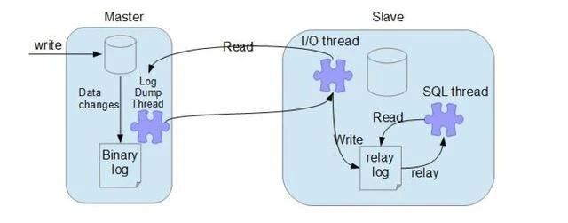

### MySQL基础
#### * 数据库的三范式是什么？
1. 第一范式：强调的是列的原子性，即数据库表的每一列都是不可分割的原子数据项
2. 第二范式：要求实体的属性完全依赖于主关键字，所谓完全依赖指的是不能存在仅依赖主关键字一部分的属性
3. 第三范式：任何非主属性不依赖其他非主属性

#### * 超键、候选键、主键、外键分别是什么？
-   超键：在关系中能唯一标识元组的属性集称为关系模式的超键。一个属性可以为作为一个超键，多个属性组合在一起也可以作为一个超键。超键包含候选键和主键。
-   候选键：是最小超键，即没有冗余元素的超键。
-   主键：数据库表中对储存数据对象予以唯一和完整标识的数据列或属性的组合。一个数据列只能有一个主键，且主键的取值不能缺失，即不能为空值（Null）。
-   外键：在一个表中存在的另一个表的主键称此表的外键。

#### * SQL约束有哪几种？
* NOT NULL: 用于控制字段的内容一定不能为空（NULL）。
* UNIQUE: 控件字段内容不能重复，一个表允许有多个 Unique 约束。
* PRIMARY KEY: 也是用于控件字段内容不能重复，但它在一个表只允许出现一个。
* FOREIGN KEY: 用于预防破坏表之间连接的动作，也能防止非法数据插入外键列，因为它必须是它指向的那个表中的值之一。
* CHECK: 用于控制字段的值范围。

#### * MySQL 中的 varchar 和 char 有什么区别？
**char 是一个定长字段**,假如申请了 char(10) 的空间,那么无论实际存储多少内容.该字段都占用 10 个字符,而 **varchar 是变长的**,也就是说申请的只是最大长度,占用的空间为实际字符长度+1,最后一个字符存储使用了多长的空间.

在检索效率上来讲,char > varchar,因此在使用中,如果确定某个字段的值的长度,可以使用 char,否则应该尽量使用 varchar.例如存储用户 MD5 加密后的密码,则应该使用 char。

#### * MySQL中 in 和 exists 区别
MySQL中的**in语句是把外表和内表作hash 连接**，而**exists语句是对外表作loop循环**，每次loop循环再对内表进行查询。一直大家都认为exists比in语句的效率要高，这种说法其实是不准确的。这个是要区分环境的。
如果查询的两个表大小相当，那么用in和exists差别不大。如果两个表中一个较小，一个是大表，则子查询表大的用exists，子查询表小的用in。

not in 和not exists：如果查询语句使用了not in，那么内外表都进行全表扫描，没有用到索引；而not extsts的子查询依然能用到表上的索引。所以**无论那个表大，用not exists都比not in要快**。

#### * drop、delete和truncate的区别
***
|区别|Delete|Truncate|Drop|
|----|----|----|----|
|类型|属于DML|属于DDL|属于DDL|
|回滚|可回滚|不可回滚|不可回滚|
|删除内容|表结构还在，删除表的全部或一部分数据行|表结构还在，删除所有数据|从数据库中删除表，所有数据行、索引、权限也会被删除|
|删除速度|速度慢，逐行删除|速度快|速度最快|

#### * 什么是存储过程？有哪些优缺点？
存储过程是一个预编译的代码块，执行效率比较高,一个存储过程替代大量 T_SQL 语句 ，可以降低网络通信量，提高通信速率,可以一定程度上确保数据安全。但是存储过程的管理确实是没有那么方便,同时,复用性也没有写在服务层那么好。

#### * MySQL 执行查询的过程
1.  客户端通过 TCP 连接发送连接请求到 MySQL 连接器，连接器会对该请求进行权限验证及连接资源分配
2.  查缓存。（当判断缓存是否命中时，MySQL 不会进行解析查询语句，而是直接使用 SQL 语句和客户端发送过来的其他原始信息。所以，任何字符上的不同，例如空格、注解等都会导致缓存的不命中。）
3.  语法分析（SQL 语法是否写错了）。 如何把语句给到预处理器，检查数据表和数据列是否存在，解析别名看是否存在歧义
4.  优化。是否使用索引，生成执行计划。
5.  交给执行器，将数据保存到结果集中，同时会逐步将数据缓存到查询缓存中，最终将结果集返回给客户端。


更新语句执行会复杂一点。需要检查表是否有排它锁，写 binlog，刷盘，是否执行commit。

### MySQL索引
#### * 什么是索引
MySQL 官方对索引的定义为：索引（Index）是帮助 MySQL 高效获取数据的数据结构。简单的理解，索引类似于字典里面的目录。

#### * 常见的索引类型有哪些
* hash：底层就是 hash 表。进行查找时，根据 key 调用hash 函数获得对应的 hashcode，根据 hashcode 找到对应的数据行地址，根据地址拿到对应的数据。
* B树：B树是一种多路搜索树，n 路搜索树代表每个节点最多有 n 个子节点。每个节点存储 key + 指向下一层节点的指针+ 指向 key 数据记录的地址。查找时，从根结点向下进行查找，直到找到对应的key。
* B+树：B+树是b树的变种，主要区别在于：B+树的非叶子节点只存储 key + 指向下一层节点的指针。另外，B+树的叶子节点之间通过指针来连接，构成一个有序链表，因此对整棵树的遍历只需要一次线性遍历叶子结点即可。



#### * 为什么MySQL使用B+树存储索引？而不用红黑树等
**红黑树**：如果在内存中，红黑树的查找效率比B树更高，但是涉及到磁盘操作，B树就更优了。因为红黑树是二叉树，数据量大时树的层数很高，从树的根结点向下寻找的过程，每读1个节点，都相当于一次IO操作，因此红黑树的I/O操作会比B树多的多。

**hash 索引**：如果只查询单个值的话，hash 索引的效率非常高。但是 hash 索引有几个问题：1）不支持范围查询；2）不支持索引值的排序操作；3）不支持联合索引的最左匹配规则。

**B树索引**：B树索相比于B+树，在进行范围查询时，需要做局部的中序遍历，可能要跨层访问，跨层访问代表着要进行额外的磁盘I/O操作；另外，B树的非叶子节点存放了数据记录的地址，会导致存放的节点更少，树的层数变高。

#### * MySQL中的索引叶子节点存放的是什么？
**MyISAM**：主键索引和辅助索引（普通索引）的叶子节点都是存放 key 和 key 对应数据行的地址。在MyISAM 中，主键索引和辅助索引没有任何区别。

**InnoDB**：主键索引存放的是 key 和 key 对应的数据行。辅助索引存放的是 key 和 key 对应的主键值。因此在使用辅助索引时，通常需要检索两次索引，首先检索辅助索引获得主键值，然后用主键值到主键索引中检索获得记录。

####  * 什么是聚簇索引(聚集索引)？
聚簇索引并不是一种单独的索引类型，而是一种数据存储方式。**聚簇索引将索引和数据行放到了一块**，找到索引也就找到了数据。因为无需进行回表操作，所以效率很高。

InnoDB 中有且只有一个聚簇索引。通常是主键，如果没有主键，则优先选择非空的唯一索引，如果唯一索引也没有，则会创建一个隐藏的row_id 作为聚簇索引。

#### * 什么是回表查询
InnoDB 中，对于主键索引，只需要走一遍主键索引的查询就能在叶子节点拿到数据。
而对于普通索引，叶子节点存储的是 key + 主键值，因此**需要再走一次主键索引**，通过主键索引找到行记录，这就是所谓的回表查询，先定位主键值，再定位行记录。

#### *  走普通索引，一定会出现回表查询吗？
不一定，如果查询语句所要求的字段包含了全部索引，那么就不必再进行回表查询。
**举例**
有一个 user 表，主键为 id，name 为普通索引，则再执行：`select id, name from user where name = 'joonwhee'` 时，通过name 的索引就能拿到 id 和 name了，因此无需再回表去查数据行了。

#### * 覆盖索引
当索引上包含了查询语句中的所有列时，我们无需进行回表查询就能拿到所有的请求数据，因此速度会很快。

当explain的输出结果Extra字段为Using index时，则代表触发覆盖索引。以上面的例子为例

#### * 联合索引（复合索引）的底层实现？
联合索引底层还是使用B+树索引，并且还是只有一棵树，只是此时的排序会：首先按照第一个索引排序，在第一个索引相同的情况下，再按第二个索引排序，依次类推，如果没有左边的索引，单独看右边的索引，其实是无序的 (索引失效)。

#### * 最佳左前缀原则？
最左前缀原则就是最左优先，在创建多列索引时，要根据业务需求，where子句中使用最频繁的一列放在最左边。
mysql会一直向右匹配直到遇到范围查询(>、<、between、like)就停止匹配`a=1 and b=2 and c>3 and b=4`。
而=和in可以乱序`a=1 and b=2 and c=3`建立(a,b,c)索引可以任意顺序。

#### * 讲一下前缀索引
索引字段非常长，占空间也不利于维护。可以只把很长字段前面的公共部分作为一个索引。(Order by不支持前缀索引)
**原则：** 降低重复的索引值
1. 建立索引`alter table x_test add index(x_name(n))`
2. 寻找建立索引的最佳长度n

#### * 了解索引下推吗？
MySQL5.6引入了索引下推优化。默认开启，使用`SET optimizer_Switch='index_condition_pushdown=off'`可以将其关闭
* 有了索引下推优化，可以减少回表次数
* 在InnoDB中只针对二级索引有效

-   在不使用ICP的情况下，在使用非主键索引（又叫普通索引或者二级索引）进行查询时，存储引擎通过索引检索到数据，然后返回给MySQL服务器，服务器然后判断数据是否符合条件 。
-   在使用ICP的情况下，如果存在某些被索引的列的判断条件时，MySQL服务器将这一部分判断条件传递给存储引擎，然后由存储引擎通过判断索引是否符合MySQL服务器传递的条件，只有当索引符合条件时才会将数据检索出来返回给MySQL服务器 。

#### * 为什么官方建议自增长主键作为索引
自增主键是连续的，会减少页分裂的情况，并且能减少数据的移动，每次插入都是插入到最后。

#### * 如何创建索引
1. 在执行create table时创建索引
```mysql
CREATE TABLE user_index2 (
id INT auto_increment PRIMARY KEY,
first_name VARCHAR (16),
last_name VARCHAR (16),
id_card VARCHAR (18),
information text,
KEY name (first_name, last_name),
FULLTEXT KEY (information),
UNIQUE KEY (id_card)
);
```
2. 使用alter table命令去增加索引
```mysql
ALTER TABLE table_name ADD INDEX index_name (column_list);
```
3. 使用create index命令创建
```mysql
CREATE INDEX index_name ON table_name (column_list);
```

#### * 创建索引要注意什么
* 非空字段：指定列为not null，mysql含有空值的列很难查询优化，因为他们会使得运算更加复杂，可以用0或空串代替空值
* 取值离散大的字段：变量各个取值之间的差异程度，可以通过count()函数返回值查看字段差异性，返回值越大说明字段的唯一值越多，字段离散程度越高
* 索引字段越小越好：数据库的数据存储以页为单位，一页存储的数据越多，一次IO获取的数据越多，效率越高

#### *  建立索引的原则有哪些
1. 最左匹配原则
2. =和in可以乱序
3. 尽量选择区分度高的列作为索引，区分度的公式为`count(distinct col)/count(*)`，表示字段不重复的比例，比例越大，扫描的记录数越少
4. 索引列不能参与计算，保持“列干净”
5. 尽量的扩展索引，不要新建索引，可以修改扩展原来的索引

#### * 使用索引查询一定能提高查询性能吗？
因为索引会占用空间和维护，不必要的索引会使查询反应时间变慢
索引范围查询适用于两种情况：
1. 基于一个范围的检索，一般查询返回结果集小于表中记录数的30%
2. 基于非唯一性索引的检索

#### * 什么情况下索引失效
1. 适用`!=`或者`<>`导致索引失效
2. 类型不一致导致索引失效
3. 函数导致的索引失效，如果在索引列使用函数，是不走索引的
4. 运算符导致的索引失效，对列进行`(+,-,*,/,!*)`，不会走索引
5. `or`引起的索引失效，如果or连接同一字段不会失效，连接不同字段会失效
6. 模糊搜索导致的索引失效，`%`放在匹配字段前是不走索引的，放在后面才会走索引
7. `not in、not exists`导致索引失效

### MySQL锁与引擎
#### * 为什么要加锁？
保证多用户环境下数据库的完整性和一致性

#### * 共享锁和排他锁
共享锁又称为读锁，简称S锁，顾名思义，共享锁就是多个事务对于同一数据可以共享一把锁，都能访问到数据，但是只能读不能修改。

排他锁又称为写锁，简称X锁，顾名思义，排他锁就是不能与其他锁并存，如一个事务获取了一个数据行的排他锁，其他事务就不能再获取该行的其他锁，包括共享锁和排他锁，但是获取排他锁的事务可以对数据就行读取和修改。

```mysql
select * from table #不加锁

update/insert/delete #排他锁

select * from table where id = 1 for update：#id为索引，加排他锁

select * from table where id = 1 lock in share mode：#id为索引，加共享锁
```

#### *  数据库的行锁和表锁
**行锁**：操作时只锁某一（些）行，不对其它行有影响。开销大，加锁慢；会出现死锁；锁定粒度小，发生锁冲突的概率低，并发度高。
**页锁**：操作时锁住一页数据（16kb）。开销和加锁速度介于表锁和行锁之间；会出现死锁；锁定粒度介于表锁和行锁之间，并发度一般。
**表锁**：即使操作一条记录也会锁住整个表。开销小，加锁快；不会出现死锁；锁定粒度大，发生锁冲突概率高，并发度最低。

InnoDB 有行锁和表锁，MyIsam 只有表锁。

#### * InnoDB行锁是怎么实现的
InnoDB 行锁是通过索引上的索引项来实现的。意味者：**只有通过索引条件检索数据**，InnoDB **才会使用行级锁**，否则，InnoDB将使用表锁！

* 对于主键索引：直接锁住锁住主键索引即可。
* 对于普通索引：先锁住普通索引，接着锁住主键索引，这是因为一张表的索引可能存在多个，通过主键索引才能确保锁是唯一的，不然如果同时有2个事务对同1条数据的不同索引分别加锁，那就可能存在2个事务同时操作一条数据了。

#### * InnoDB的锁有几种算法
* Record lock：记录锁，单条索引记录上加锁，锁住的永远是索引，而非记录本身。
* Gap lock：间隙锁，在索引记录之间的间隙中加锁，或者是在某一条索引记录之前或者之后加锁，并不包括该索引记录本身。
* Next-key lock: Record lock 和 Gap lock 的结合，即除了锁住记录本身，也锁住索引之间的间隙。

####  * MySQL如何实现悲观锁和乐观锁
* 乐观锁：更新时带上版本号（cas更新）
* 悲观锁：使用共享锁和排它锁，select...lock in share mode，select…for update

#### * 什么是死锁？怎么解决？
死锁是指两个或多个事务在同一资源上相互占用，并请求锁定对方的资源，从而导致恶性循环的现象。

1. 如果不同程序会并发存取多个表，尽量约定以相同的顺序访问表，可以大大降低死锁机会。
2. 在同一个事务中，尽可能做到一次锁定所需要的所有资源，减少死锁产生概率；
3. 对于非常容易产生死锁的业务部分，可以尝试使用升级锁定颗粒度，通过表级锁定来减少死锁产生的概率；

如果业务处理不好可以用分布式事务锁或者使用乐观锁

#### * MYSQL事务的加锁过程
两段锁，先申请，后加锁
**加锁阶段**：在该阶段能够进行加锁操作。在对不论什么数据进行读操作之前要申请并获得S锁（共享锁，其他事务能够继续加共享锁，但不能加排它锁），在进行写操作之前要申请并获得X锁（排它锁，其他事务不能再获得不论什么锁）。加锁不成功，则事务进入等待状态，直到加锁成功才继续运行。  
**解锁阶段**：当事务释放了一个封锁以后，事务进入解锁阶段。在该阶段仅仅能进行解锁操作不能再进行加锁操作。

这样的方式尽管无法避免死锁。可是两段锁协议能够保证事务的并发调度是串行化。

#### * 隔离级别与锁的关系
* 在读未提交RU级别下，读取数据不需要加共享锁，这样就不会跟被修改的数据上的排他锁冲突；
* 在Read Committed级别下，读操作需要加共享锁，但是在语句执行完以后释放共享锁；
* 在Repeatable Read级别下，读操作需要加共享锁，但是在事务提交之前并不释放共享锁，也就是必须等待事务执行完毕以后才释放共享锁。
* SERIALIZABLE 是限制性最强的隔离级别，因为该级别锁定整个范围的键，并一直持有锁，直到事务完成。

#### * 优化锁方面的意见？
- 使用**较低的隔离级别**
- 设计索引，尽量**使用索引去访问数据**，加锁更加精确，从而减少锁冲突
- 选择**合理的事务大小**，给记录显示加锁时，最好一次性请求足够级别的锁。列如，修改数据的话，最好申请排他锁，而不是先申请共享锁，修改时在申请排他锁，这样会导致死锁
- 不同的程序访问一组表的时候，应尽量**约定一个相同的顺序**访问各表，对于一个表而言，尽可能的**固定顺序的获取表中的行**。这样大大的减少死锁的机会。
- 尽量**使用相等条件访问数据**，这样可以避免间隙锁对并发插入的影响
- **不**要申请**超过实际需要的锁级别**
- 数据查询的时候**不是必要，不要使用加锁**。MySQL的MVCC可以实现事务中的查询不用加锁，优化事务性能：MVCC只在committed read（读提交）和 repeatable read （可重复读）两种隔离级别。
- 对于**特定的事务，可以使用表锁**来提高处理速度，减少死锁的可能。

#### * InnoDB四大特性
1. 插入缓冲（insert buffer）
如果我们使用自增主键，那么在插入主键索引（聚簇索引）时，只需不断追加即可，不需要磁盘的随机 I/O。但是如果我们使用的是**普通索引**，大概率是无序的，此时就涉及到磁盘的随机 I/O，而**随机I/O的性能是比较差**的（Kafka 官方数据：磁盘顺序I/O的性能是磁盘随机I/O的4000~5000倍）
   * 它是一种应用在非唯一普通索引页(non-unique secondary index page)不在缓冲池中，对页进行了写操作，并不会立刻将磁盘页加载到缓冲池，而仅仅记录缓冲变更(buffer changes)，等未来数据被读取时，**将多个插入合并到一个操作之中。写缓冲的目的是降低写操作的磁盘IO，提升数据库性能。**

2. 二次写（double write）
脏页刷盘风险：InnoDB 的 page size一般是16KB，操作系统写文件是以4KB作为单位，那么每写一个 InnoDB 的 page 到磁盘上，操作系统需要写4个块。于是可能出现16K的数据，写入4K 时，发生了系统断电或系统崩溃，只有一部分写是成功的，这就是 **partial page write（部分页写入）问题**。这时会出现**数据不完整**的问题。这时是无法通过 redo log 恢复的，因为 redo log 记录的是对页的物理修改，如果页本身已经损坏，重做日志也无能为力。
   * 先将脏数据复制到内存中的 doublewrite buffer
   * 之后通过 doublewrite buffer 再分2次，每次1MB写入到共享表空间的磁盘上（顺序写，性能很高）
   * 完成第二步之后，马上调用 fsync 函数，将doublewrite buffer中的脏页数据写入实际的各个表空间文件（离散写）。
   * 如果操作系统在将页写入磁盘的过程中发生崩溃，InnoDB 再次启动后，发现了一个 page 数据已经损坏，InnoDB 存储引擎**可以从共享表空间的 doublewrite 中找到该页的一个最近的副本**，用于进行数据恢复了。

3. 自适应哈希索引(adaptive hash index）
**哈希（hash）是一种非常快的查找方法**，一般情况下查找的时间复杂度为 O(1)。但是由于不支持范围查询等条件的限制，InnoDB 并没有采用 hash 索引，但是如果能在一些特殊场景下使用 hash 索引，则可能是一个不错的**补充**，而 InnoDB 正是这么做的。
   * InnoDB 会监控对表上索引的查找，如果观察到某些索引被频繁访问，索引成为热数据，建立哈希索引可以带来速度的提升，则**建立哈希索引**，所以称之为自适应（adaptive）的。

4. 预读（read ahead）
   InnoDB 在 I/O 的优化上有个比较重要的特性为预读，当 InnoDB 预计某些 page 可能很快就会需要用到时，它会**异步地将这些 page 提前读取到缓冲池（buffer pool）中**，这其实有点像空间局部性的概念。空间局部性（spatial locality）：如果一个数据项被访问，那么与他地址相邻的数据项也可能很快被访问。
   * 线性预读以 extent（块，1个 extent 等于64个 page）为单位，线性预读方式有一个很重要的变量 innodb_read_ahead_threshold，可以控制 Innodb 执行预读操作的触发阈值。果一个 extent 中的被顺序读取的 page 超过或者等于该参数变量时，Innodb将会异步的将下一个 extent 读取到 buffer pool中，innodb_read_ahead_threshold 可以设置为0-64（一个 extend 上限就是64页）的任何值，默认值为56，值越高，访问模式检查越严格。
   * 随机预读放到以 extent 中的 page 为单位。随机预读方式给 Innodb code 带来了一些不必要的复杂性，同时在性能也存在不稳定性，在5.5中已经将这种预读方式废弃。
   * 线性预读着眼于**将下一个extent 提前读取到 buffer pool 中**，而随机预读着眼于将 **当前 extent 中的剩余的 page** 提前读取到 buffer pool 中。

#### *  InnoDB和MyISAM的区别
***
|对比项|InnoDB|MyIsam|
|----|----|----|
|事务|支持|不支持|
|锁类型|行锁|表锁|
|缓存|缓存索引和数据|只缓存索引|
|主键|必须有，用于实现聚簇索引|可以没有|
|索引|B+树，主键是聚簇索引|B+树，非聚簇索引|
|select count(\*)from m table|较慢，扫描全表|较快，直接读取行数变量|
|hash索引|支持|不支持|
|记录存储顺序|按主键大小有序插入|按记录插入顺序保存|
|外键|支持|不支持|
|全文索引|5.7支持|支持|
|关注点|事务|性能|

#### * 存储引擎的选择
没有特殊情况，使用 InnoDB 即可。如果表中绝大多数都只是读查询，可以考虑 MyISAM。

#### * B+树中一个节点到底多大合适？
1页或页的倍数最为合适。因为如果一个节点的大小小于1页，那么读取这个节点的时候其实也会读出1页，造成资源的浪费。所以为了不造成浪费，所以最后把一个节点的大小控制在1页、2页、3页等倍数页大小最为合适。

这里说的“页”是 MySQL 自定义的单位（和操作系统类似），MySQL 的 Innodb 引擎中1页的默认大小是16k，可以使用命令SHOW GLOBAL STATUS LIKE 'Innodb_page_size' 查看。

在 MySQL 中 B+ 树的一个节点大小为“1页”，也就是16k。

#### * 为什么一个节点一页就够了
Innodb中，B+树中的一个节点存储的内容是：
-   非叶子节点：key + 指针
-   叶子节点：数据行（key 通常是数据的主键）
对于叶子节点：我们假设1行数据大小为1k（对于普通业务绝对够了），那么1页能存16条数据。
对于非叶子节点：key 使用 bigint 则为8字节，指针在 MySQL 中为6字节，一共是14字节，则16k能存放 16 * 1024 / 14 = 1170个。那么一颗高度为3的B+树能存储的数据为：1170 * 1170 * 16 = 21902400（千万级）

#### * 什么是Buffer Pool
Buffer Pool 是 InnoDB 维护的一个**缓存区域**，用来**缓存数据和索引在内存中**，主要用来**加速数据的读写**，如果 Buffer Pool 越大，那么 MySQL 就越像一个内存数据库，默认大小为 128M。

InnoDB 会将那些热点数据和一些 InnoDB 认为即将访问到的数据存在 Buffer Pool 中，以提升数据的读取性能。

InnoDB 在修改数据时，如果数据的页在 Buffer Pool 中，则会直接修改 Buffer Pool，此时我们称这个页为**脏页**，InnoDB 会以一定的频率将脏页刷新到磁盘，这样可以尽量减少磁盘I/O，提升性能。

### MySQL事务
#### * 什么是数据库事务
事务是一个不可分割的数据库操作序列，也是数据库并发控制的基本单位，其执行的结果必须使数据库从一种一致性状态变到另一种一致性状态。事务是逻辑上的一组操作，要么都执行，要么都不执行。

#### * 事务具有的四个特征
* **原子性**。事务是数据库的逻辑工作单位，事务中包含的各操作要么都做，要么都不做
* **一致性**。事 务执行的结果必须是使数据库从一个一致性状态变到另一个一致性状态。因此当数据库只包含成功事务提交的结果时，就说数据库处于一致性状态。如果数据库系统 运行中发生故障，有些事务尚未完成就被迫中断，这些未完成事务对数据库所做的修改有一部分已写入物理数据库，这时数据库就处于一种不正确的状态，或者说是 不一致的状态。
* **隔离性**。一个事务的执行不能其它事务干扰。即一个事务内部的//操作及使用的数据对其它并发事务是隔离的，并发执行的各个事务之间不能互相干扰。
* **持续性**。也称永久性，指一个事务一旦提交，它对数据库中的数据的改变就应该是永久性的。接下来的其它操作或故障不应该对其执行结果有任何影响。

#### * 事务的实现原理
事务是基于重做日志文件(redo log)和回滚日志(undo log)实现的。

每提交一个事务必须先将该事务的所有日志写入到重做日志文件进行持久化，数据库就可以通过重做日志来保证事务的原子性和持久性。

每当有修改事务时，还会产生 undo log，如果需要回滚，则根据 undo log 的反向语句进行逻辑操作，比如 insert 一条记录就 delete 一条记录。undo log 主要实现数据库的一致性。

#### * 什么是MySQL的binlog
MySQL的 binlog 是记录所有数据库表结构变更（例如 CREATE、ALTER TABLE）以及表数据修改（INSERT、UPDATE、DELETE）的二进制日志。binlog 不会记录 SELECT 和 SHOW 这类操作，因为这类操作对数据本身并没有修改，但你可以通过查询通用日志来查看 MySQL 执行过的所有语句。

MySQL binlog 以事件形式记录，还包含语句所执行的消耗的时间，MySQL 的二进制日志是事务安全型的。binlog 的主要目的是复制和恢复。

binlog 有三种格式，各有优缺点：
* statement： 基于 SQL 语句的模式，某些语句和函数如 UUID, LOAD DATA INFILE 等在复制过程 可能导致数据不一致甚至出错。 
* row： 基于行的模式，记录的是行的变化，很安全。但是 binlog 会比其他两种模式大很多，在一 些大表中清除大量数据时在 binlog 中会生成很多条语句，可能导致从库延迟变大。 
* mixed： 混合模式，根据语句来选用是 statement 还是 row 模式。

#### * 在事务中可以混合使用存储引擎吗？
尽量不要在同一个事务中使用多种存储引擎，MySQL服务器层不管理事务，事务是由下层的存储引擎实现的。
如果在事务中混合使用了事务型和非事务型的表（例如InnoDB和MyISAM表）,在正常提交的情况下不会有什么问题。
但**如果该事务需要回滚**，非事务型的表上的变更就无法撤销，这会**导致数据库处于不一致的状态**，这种情况很难修复，事务的最终结果将无法确定。

####  * MySQL的事物隔离级别有哪些？分别用于解决什么问题？
主要用于解决脏读、不可重复读、幻读。 
* 脏读：一个事务读取到另一个事务还未提交的数据。
* 不可重复读：在一个事务中多次读取同一个数据时，结果出现不一致。
* 幻读：在一个事务中使用相同的 SQL 两次读取，第二次读取到了其他事务新插入的行。
  

(不可重复读注重于数据的修改，而幻读注重于数据的插入)

|隔离级别|脏读|不可重复读|幻读|
|----|----|----|----|
|读未提交(Read Uncommitte)|yes|yes|yes|
|读已提交(Read Committed)|no|yes|yes|
|可重复读(Repeatable Read)|no|no|yes|
|串行化(Serialzable)|no|no|no|

#### * MySQL的可重复读怎么实现的
使用MVCC实现的，多版本并发控制
InnoDB会在每行记录后面增加三个隐藏字段：
1.  DB_ROW_ID:  行ID，随着插入新行而单调递增，如果有主键则不会包含该列
2.  DB_TRX_ID:  记录插入或更新该行的事务ID
3.  DB_ROLL_PTR:  回滚指针，指向该记录修改前的信息，当某条记录被多次修改，该行会记录存在多个版本，通过DB_ROLL_PTR链接形成一个类似版本链的概念
**举例**
以**RR**为例：每开启一个事务时，系统给该事务分配一个事务id，该事务在执行第一个select语句的时候，会生成一个当前时间点的**事务快照ReadView**，主要包含：
1. trx_ids：生成ReadView时当前系统中还未执行事务提交的事务id列表
2. up_limit_id：低水位，取trx_ids中最小的那个，事务id小于该值的都可以看到
3. low_limit_id：高水位，生成ReadView时系统将要分配给下一个事务的id值，trx_id大于等于该值都不能看到
4. creator_trx_id：生成该ReadView的事务的事务id
***
当有了ReadView，在访问某条记录时，按下面步骤判断：
1. 如果被访问版本的trx_id与ReadView中的creator_trx_id值相同，意味着当前事务在访问它自己修改过的记录，所以该版本可以被当前事务访问。
2. 如果被访问版本的trx_id小于ReadView中的up_limit_id值，表明生成该版本的事务在当前事务生成ReadView前已经提交，所以该版本可以被当前事务访问。
3. 如果被访问版本的trx_id大于ReadView中的low_limit_id值，表明生成该版本的事务在当前事务生成ReadView后才开启，所以该版本不可以被当前事务访问。
4. 如果被访问版本的trx_id属性值在ReadView的up_limit_id和low_limit_id之间，那就需要判断一下trx_id属性值是不是在trx_ids列表中。如果在，说明创建ReadView时生成该版本的事务还是活跃的，该版本不可以被访问；如果不在，说明创建ReadView时生成该版本的事务已经被提交，该版本可以被访问。
***
在进行判断时，首先会拿记录的最新版本来比较，如果该版本无法被当前事务看到，则通过记录的 DB_ROLL_PTR 找到上一个版本，重新进行比较，直到找到一个能被当前事务看到的版本。
***
而对于删除，其实就是一种特殊的更新，InnoDB 用一个额外的标记位 delete_bit 标识是否删除。当我们在进行判断时，会检查下 delete_bit 是否被标记，如果是，则跳过该版本，通过 DB_ROLL_PTR 拿到下一个版本进行判断。

#### * MVCC如何解决幻读
* 快照读：生成一个事务快照（ReadView），之后都从这个快照获取数据。普通 select 语句就是快照读。
* 当前读：读取数据的最新版本。常见的 update/insert/delete、还有 select ... for update、select ... lock in share mode 都是当前读。

对于快照读，MVCC 因为因为从 ReadView 读取，所以必然不会看到新插入的行，所以天然就解决了幻读的问题。

而对于当前读的幻读，MVCC 是无法解决的。需要使用 Gap Lock 或 Next-Key Lock（Gap Lock + Record Lock）来解决。举例：
`select * from user where id < 10 for update`
当使用了 Gap Lock 时，Gap 锁会锁住 id < 10 的整个范围，因此其他事务无法插入 id < 10 的数据，从而防止了幻读。

#### * 为什么MySQL的可重复读可以解决幻读的情况
但是 MySQL 的 RR 可以，靠的是 Gap 锁。在 RR 级别下，Gap 锁是默认开启的，而在 RC 级别下，Gap 锁是关闭的。

### MySQL优化
#### * MySQL的主从复制
MySQL主从复制涉及到三个线程，一个运行在主节点（Log Dump Thread），其余两个（I/O Thread，SQL Thread）运行在从节点，如下图所示


主从复制默认是异步的模式，具体过程如下。
1. 从节点上的I/O 线程连接主节点，并请求从指定日志文件（bin log file）的指定位置（bin log position，或者从最开始的日志）之后的日志内容；
2. 主节点接收到来自从节点的 I/O请求后，读取指定文件的指定位置之后的日志信息，返回给从节点。返回信息中除了日志所包含的信息之外，还包括本次返回的信息的 bin-log file 以及 bin-log position；从节点的 I/O 进程接收到内容后，将接收到的日志内容更新到 relay log 中，并将读取到的 bin log file（文件名）和position（位置）保存到 master-info 文件中，以便在下一次读取的时候能够清楚的告诉 Master “我需要从某个bin-log 的哪个位置开始往后的日志内容”；
3. 从节点的 SQL 线程检测到 relay-log 中新增加了内容后，会解析 relay-log 的内容，并在本数据库中执行。

#### * 异步复制，主库宕机后，数据丢失
可以使用半同步复制或全同步复制。
1. **半同步复制**：修改语句写入bin log后，不会立即给客户端返回结果。而是首先通过log dump 线程将 binlog 发送给从节点，从节点的 I/O 线程收到 binlog 后，写入到 relay log，然后返回 ACK 给主节点，主节点 收到 ACK 后，再返回给客户端成功。
（先给从节点，再返回给客户端）

2.  **全同步复制**：主节点和所有从节点全部执行了该事务并确认才会向客户端返回成功。因为需要等待所有从库执行完该事务才能返回，所以全同步复制的性能必然会收到严重的影响。
（等待主从节点同步完成，再返回给客户端）

#### * 主库从库复制延迟
可以使用并行复制（并行是指从库多个SQL线程并行执行 relay log），解决从库复制延迟的问题。

MySQL 5.7 中引入基于组提交的并行复制，其核心思想：一个组提交的事务都是可以并行回放，因为这些事务都已进入到事务的 prepare 阶段，则说明事务之间没有任何冲突（否则就不可能提交）。

判断事务是否处于一个组是通过 last_committed 变量，last_committed 表示事务提交的时候，上次事务提交的编号，如果事务具有相同的 last_committed，则表示这些事务都在一组内，可以进行并行的回放。

#### * 如何做慢SQL优化
首先要搞明白慢的原因是什么：是查询条件没有命中索引？还是 load 了不需要的数据列？还是数据量太大？所以优化也是针对这三个方向来的。
1. 首先用 explain 分析语句的执行计划，查看使用索引的情况，是不是查询没走索引，如果可以加索引解决，优先采用加索引解决。
2. 分析语句，看看是否存在一些导致索引失效的用法，是否 load 了额外的数据，是否加载了许多结果中并不需要的列，对语句进行分析以及重写。
3. 如果对语句的优化已经无法进行，可以考虑表中的数据量是否太大，如果是的话可以进行垂直拆分或者水平拆分。

#### * explain常见字段含义
MySQL EXPLAIN命令是查询性能优化不可缺少的一部分。
-   id：标识符
-   select_type：查询的类型
-   table：输出结果集的表
-   partitions：匹配的分区  
-   type：表的连接类型
-   possible_keys：查询时，可能使用的索引
-   key：实际使用的索引
-   key_len：使用的索引字段的长度
-   ref：列与索引的比较
-   rows：估计要检查的行数
-   filtered：按表条件过滤的行百分比
-   Extra：附加信息

#### * type中有哪些常见的值
按类型排序，从好到坏，常见的有：const > eq_ref > ref > range > index > ALL。
-   const：通过主键或唯一键查询，并且结果只有1行（也就是用等号查询）。因为仅有一行，所以优化器的其余部分可以将这一行中的列值视为常量。
-   eq_ref：通常出现于两表关联查询时，使用主键或者非空唯一键关联，并且查询条件不是主键或唯一键的等号查询。
-   ref：通过普通索引查询，并且使用的等号查询。  
-   range：索引的范围查找（>=、<、in 等）。 
-   index：全索引扫描。
-   All：全表扫描

#### * explain主要关注哪些字段
主要关注 type、key、row、extra 等字段。主要是看**是否使用了索引，是否扫描了过多的行数，是否出现 Using temporary、Using filesort 等一些影响性能的主要指标**。

`Using temporary`表示由于排序没有走索引、使用`union`、子查询连接查询、使用某些视图等原因，因此创建了一个内部临时表。

`Using filesort`仅仅表示没有使用索引的排序，事实上`filesort`这个名字很糟糕，并不意味着在硬盘上排序，`filesort`与文件无关。因此消除`Using filesort`的方法就是让查询sql的排序走索引。

#### * 为什么要分库分表
* 分表：单表数据量太大，会极大影响sql执行的性能，分表就是把一个表中的数据放到多个表中，比如按照用户id来分表。
* 分库：一个健康的单库并发量最好保持在每秒1000左右，极限是2000，如果超过这个数值，可以将一个库的数据拆分到多个库中。

|#|分库分表前|分库分表后|
|----|----|----|
|并发支撑情况|MySQL单机部署，扛不住高并发|MySQL从单机到多机，能承受的并发增加了多倍|
|磁盘使用情况|MySQL单机磁盘容量几乎撑满|拆分为多个库，数据库服务器磁盘使用率降低|
|SQL执行性能|单表数据量太大，SQL越跑越慢|单表数据量减少，SQL执行效率提高|

InnoDB的数据表数量级超过千万后，性能会出现下降，核心是由于B+Tree的数据结构导致的（节点数据量较大，io次数较多）

#### * 用过哪些分库分表中间件？
1. sharding-jdbc，当当开源的，属于 client 层方案。确实之前用的还比较多一些，因为 SQL 语法支持也比较多，没有太多限制，而且目前推出到了 2.0 版本，支持分库分表、读写分离、分布式 id 生成、柔性事务（最大努力送达型事务、TCC 事务）
2. mycat：基于 cobar 改造的，属于 proxy 层方案，支持的功能非常完善

#### * 如何对数据库进行垂直或水平拆分
1. 水平拆分的意思，就是把一个表的数据给弄到多个库的多个表里去，但是每个库的表结构都一样，只不 过每个库表放的数据是不同的，所有库表的数据加起来就是全部数据。水平拆分的意义，就是将数据均 匀放更多的库里，然后用多个库来抗更高的并发，还有就是用多个库的存储容量来进行扩容。
2. 垂直拆分的意思，就是把一个有很多字段的表给拆分成多个表，或者是多个库上去。每个库表的结构都不一样，每个库表都包含部分字段。一般来说，会将较少的访问频率很高的字段放到一个表里 去，然后将较多的访问频率很低的字段放到另外一个表里去。因为数据库是有缓存的，你访问频率 高的行字段越少，就可以在缓存里缓存更多的行，性能就越好。这个一般在表层面做的较多一些。

两种分库分表的方式：
* 一种是按照 **range** 来分，就是每个库一段连续的数据，这个一般是按比如时间范围来的，但是这 种一般较少用，因为很容易产生热点问题，大量的流量都打在最新的数据上了。
*  或者是按照某个字段**hash**一下均匀分散，这个较为常用，但是扩容要重新计算哈希值，比较麻烦。

#### * union 和 union all 的区别
* **union all**：对两个结果集直接进行并集操作，记录可能有重复，不会进行排序。
* **union**：对两个结果集进行并集操作，会进行去重，记录不会重复，按字段的默认规则排序。因此，从效率上说，UNION ALL 要比 UNION 更快。

#### * JOIN和UNION的区别
* join 是两张表做交连后里面条件相同的部分记录产生一个记录集，  
* union是产生的两个记录集(字段要一样的)并在一起，成为一个新的记录集 。

#### * 大表数据查询，怎么优化
* 优化shema、sql语句+索引
* 第二加缓存，memcached，redis
* 主从复制，读写分离
* 分库分表

#### * 如何优化关联查询
* 确定ON或者USING子句中是否有索引
* 确保GROUP BY和ORDER BY只有一个表中的列，这样MySQL才有可能使用索引


