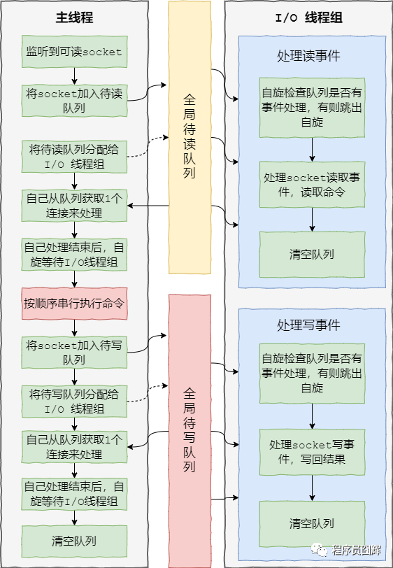
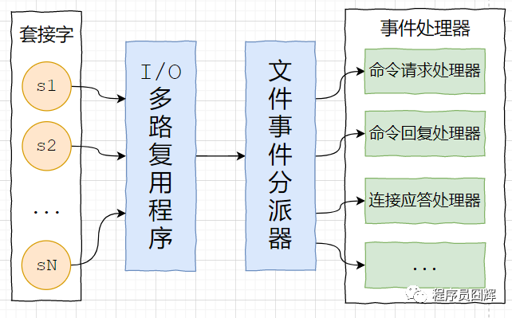
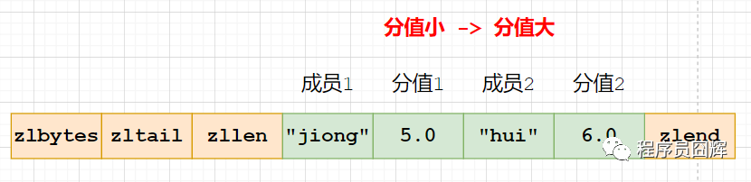
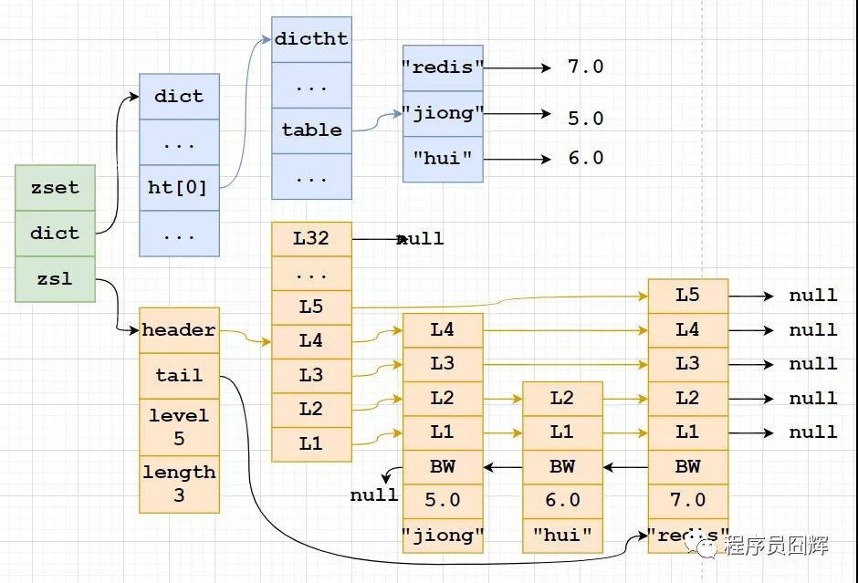
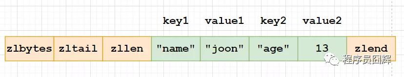
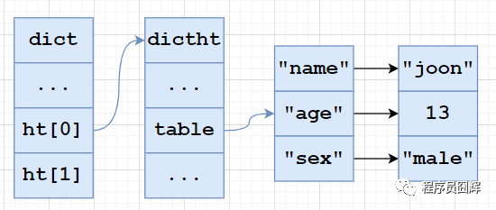
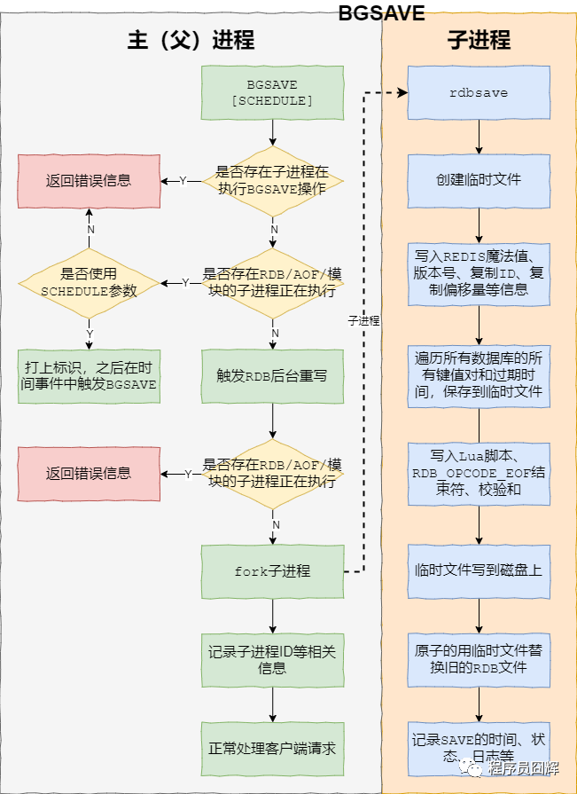
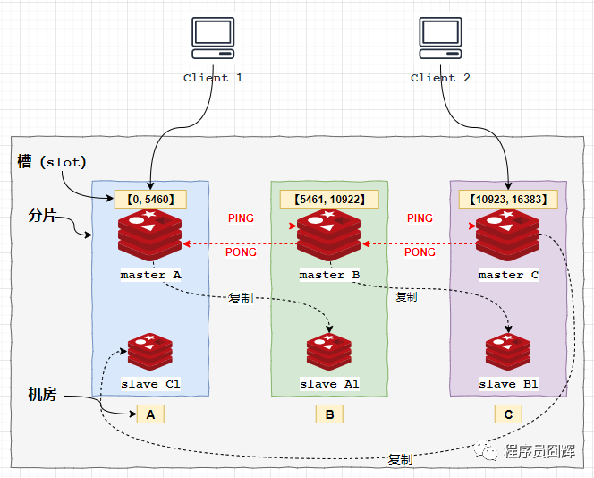

##   Redis的执行
### * Redis 是单线程还是多线程？
1. redis 4.0 之前，redis 是**完全单线程的**。

2. redis 4.0 时，redis 引入了多线程，但是**额外的线程只是用于后台处理**，例如：删除对象，核心流程还是完全单线程的。这也是为什么有些人说 4.0 是单线程的，因为他们指的是核心流程是单线程的。

这边的核心流程指的是 redis 正常处理客户端请求的流程，通常包括：接收命令、解析命令、执行命令、返回结果等。

3. 而在最近，redis 6.0 版本又一次引入了多线程概念，与 4.0 不同的是，这次的多线程会涉及到上述的核心流程。

redis 6.0 中，**多线程主要用于网络 I/O 阶段**，也就是接收命令和写回结果阶段，而在执行命令阶段，还是由单线程串行执行。由于执行时还是串行，因此无需考虑并发安全问题。

值得注意的时，redis 中的多线程组不会同时存在“读”和“写”，这个多线程组只会同时“读”或者同时“写”。

### * 为什么Redis是单线程的
因为 redis 是**完全基于内存操作的**，通常情况下**CPU不会是redis的瓶颈**，redis 的瓶颈最有可能是机器内存的大小或者网络带宽。如果使用多线程的话会更复杂，同时需要引入上下文切换、加锁等等，会带来额外的性能消耗。

而随着近些年互联网的不断发展，大家对于缓存的性能要求也越来越高了，因此 redis 也开始在逐渐往多线程方向发展。

最近的 6.0 版本就对核心流程引入了多线程，主要用于解决 redis 在网络 I/O 上的性能瓶颈。而对于核心的命令执行阶段，目前还是单线程的。

### * Redis 使用单进程、单线程也很快
主要有以下几点：
1. 基于内存的操作
2. 使用了 I/O 多路复用模型，select、epoll 等，基于 reactor 模式开发了自己的网络事件处理器
3. 单线程可以避免不必要的上下文切换和竞争条件，减少了这方面的性能消耗。
4. 以上这三点是 redis 性能高的主要原因，其他的还有一些小优化，例如：对数据结构进行了优化，简单动态字符串、压缩列表等。

### * Redis6.0核心流程
1. 当有读事件到来时，主线程将该客户端连接到全局等待读队列
2. 读取数据：
     * 主线程将等待队列的客户端连接通过轮询调度算法分配给I/O线程处理；
     * 同时主线程也会自己负责处理一个客户端连接的读事件 
     * 当主线程处理完该连接的读事件后，会自旋等待所有的I/O线程处理完毕
3. 命令执行：主线程按照事件被加入全局等待读队列的顺序，串行执行客户端命令，然后将客户端连接放到全局等待写队列
4. 写回结果：跟等待读队列处理类似，主线程将等待写队列的客户端连接使用轮询调度算法分配给I/O线程处理，同时自己也会处理一个，当主线程处理完毕后，会自旋等待所有I/O线程处理完毕，最后清空队列



### * Redis 的网络事件处理器(Reactor 模式)
redis 基于 reactor 模式开发了自己的网络事件处理器，由4个部分组成：套接字、I/O 多路复用程序、文件事件分派器（dispatcher）、以及事件处理器。



**套接字**：socket 连接，也就是客户端连接。当一个套接字准备好执行连接、写入、读取、关闭等操作时， 就会产生一个相应的文件事件。因为一个服务器通常会连接多个套接字， 所以多个文件事件有可能会并发地出现。

**I/O 多路复用程序**：提供 select、epoll、evport、kqueue 的实现，会根据当前系统自动选择最佳的方式。负责监听多个套接字，当套接字产生事件时，会向文件事件分派器传送那些产生了事件的套接字。当多个文件事件并发出现时， I/O 多路复用程序会将所有产生事件的套接字都放到一个队列里面，然后通过这个队列，以有序、同步、每次一个套接字的方式向文件事件分派器传送套接字：当上一个套接字产生的事件被处理完毕之后，才会继续传送下一个套接字。

**文件事件分派器**：接收 I/O 多路复用程序传来的套接字， 并根据套接字产生的事件的类型， 调用相应的事件处理器。

**事件处理器**：事件处理器就是一个个函数， 定义了某个事件发生时， 服务器应该执行的动作。例如：建立连接、命令查询、命令写入、连接关闭等等。

## Redis数据结构
### * Redis常见的数据结构
基础的5种：
-   String：字符串，最基础的数据类型。
-   List：列表。
-   Hash：哈希对象。  
-   Set：集合。  
-   Sorted Set：有序集合，Set 的基础上加了个分值。

高级的4种：
-   HyperLogLog：通常用于基数统计。使用少量固定大小的内存，来统计集合中唯一元素的数量。统计结果不是精确值，而是一个带有0.81%标准差（standard error）的近似值。所以，HyperLogLog适用于一些对于统计结果精确度要求不是特别高的场景，例如网站的UV统计。
-   Geo：redis 3.2 版本的新特性。可以将用户给定的地理位置信息储存起来， 并对这些信息进行操作：获取2个位置的距离、根据给定地理位置坐标获取指定范围内的地理位置集合。 
-   Bitmap：位图。  
-   Stream：主要用于消息队列，类似于 kafka，可以认为是 pub/sub 的改进版。提供了消息的持久化和主备复制功能，可以让任何客户端访问任何时刻的数据，并且能记住每一个客户端的访问位置，还能保证消息不丢失。

### * Sorted Set底层数据结构
Sorted Set（有序集合）当前有两种编码：ziplist、skiplist

**ziplist**：使用压缩列表实现，当保存的元素长度都小于64字节，同时数量小于128时，使用该编码方式，否则会使用 skiplist。这两个参数可以通过 zset-max-ziplist-entries、zset-max-ziplist-value 来自定义修改。



**skiplist**：zset实现，一个zset同时包含一个字典（dict）和一个跳跃表（zskiplist）



### * Sorted Set 同时使用字典和跳跃表？
主要是为了提升性能。

单独使用字典：在执行范围型操作，比如 zrank、zrange，字典需要进行排序，至少需要 O(NlogN) 的时间复杂度及额外 O(N) 的内存空间。

单独使用跳跃表：根据成员查找分值操作的复杂度从 O(1) 上升为 O(logN)。

### * Sorted Set 使用跳跃表而不是红黑树？
主要有以下几个原因：
1. 跳表的性能和红黑树差不多。
2. 跳表更容易实现和调试。

### * Hash 对象底层结构
Hash 对象当前有两种编码：ziplist、hashtable

**ziplist**：使用压缩列表实现，每当有新的键值对要加入到哈希对象时，程序会先将保存了键的节点推入到压缩列表的表尾，然后再将保存了值的节点推入到压缩列表表尾。

因此：
1. 保存了同一键值对的两个节点总是紧挨在一起，保存键的节点在前，保存值的节点在后；
2. 先添加到哈希对象中的键值对会被放在压缩列表的表头方向，而后来添加的会被放在表尾方向。



**hashtable**：使用字典作为底层实现，哈希对象中的每个键值对都使用一个字典键值来保存，跟 java 中的 HashMap 类似。



### * Hash 对象的扩容流程
hash 对象在扩容时使用了一种叫“渐进式 rehash”的方式，步骤如下：
1. 计算新表 size、掩码，为新表 `ht[1]` 分配空间，让字典同时持有 `ht[0]` 和 `ht[1]`两个哈希表。
2. 将 rehash 索引计数器变量 rehashidx 的值设置为0，表示 rehash 正式开始。
3. 在 rehash 进行期间，每次对字典执行添加、删除、査找、更新操作时，程序除了执行指定的操作以外，还会触发额外的 rehash 操作，在源码中的 `_dictRehashStep` 方法。
     * `_dictRehashStep`：从名字也可以看出来，大意是 rehash 一步，也就是 rehash 一个索引位置。
     * 该方法会从 `ht[0]` 表的 rehashidx 索引位置上开始向后查找，找到第一个不为空的索引位置，将该索引位置的所有节点 rehash 到 `ht[1]`，当本次 `rehash` 工作完成之后，将 `ht[0]` 索引位置为 rehashidx 的节点清空，同时将 rehashidx 属性的值加一。
4. 将 rehash 分摊到每个操作上确实是非常妙的方式，但是万一此时服务器比较空闲，一直没有什么操作，难道 redis 要一直持有两个哈希表吗？
     * 答案当然不是的。我们知道，redis 除了文件事件外，还有时间事件，redis 会定期触发时间事件，这些时间事件用于执行一些后台操作，其中就包含 rehash 操作：当 redis 发现有字典正在进行 rehash 操作时，会花费1毫秒的时间，一起帮忙进行 rehash。
5. 随着操作的不断执行，最终在某个时间点上，`ht[0]`的所有键值对都会被 rehash 至 `ht[1]`，此时 rehash 流程完成，会执行最后的清理工作：释放`ht[0]` 的空间、将 `ht[0]` 指向`ht[1]`、重置 `ht[1]`、重置 rehashidx 的值为 -1。

### * 渐进式 rehash 的优点
渐进式 rehash 的好处在于**它采取分而治之的方式**，将 rehash 键值对所需的计算工作均摊到对字典的每个添加、删除、查找和更新操作上，从而**避免了集中式 rehash 而带来的庞大计算量**。

### * 大数据量时hash扩容问题
1. 扩容期开始时，会先给` ht[1]` 申请空间，所以在整个扩容期间，会同时存在 `ht[0] `和 `ht[1]`，会占用额外的空间。
2. 扩容期间同时存在 `ht[0]` 和 `ht[1]`，查找、删除、更新等操作有概率需要操作两张表，耗时会增加。
3. redis 在内存使用接近 maxmemory 并且有设置驱逐策略的情况下，出现 rehash 会使得内存占用超过 maxmemory，触发驱逐淘汰操作，导致 master/slave 均有有大量的 key 被驱逐淘汰，从而出现 master/slave 主从不一致。

## Redis 策略与持久化
### * Redis 删除过期键的策略
* 定时删除：在设置键的过期时间的同时，创建一个定时器，让定时器在键的过期时间来临时，立即执行对键的删除操作。对内存最友好，对 CPU 时间最不友好。

* 惰性删除：放任键过期不管，但是每次获取键时，都检査键是否过期，如果过期的话，就删除该键；如果没有过期，就返回该键。对 CPU 时间最优化，对内存最不友好。

* 定期删除：每隔一段时间，默认100ms，程序就对数据库进行一次检査，删除里面的过期键。至 于要删除多少过期键，以及要检査多少个数据库，则由算法决定。前两种策略的折中，对 CPU 时间和内存的友好程度较平衡。

Redis 使用惰性删除和定期删除。

### * Redis 的内存淘汰（驱逐）策略
当 redis 的内存空间（maxmemory 参数配置）已经用满时，redis 将根据配置的驱逐策略（maxmemory-policy 参数配置），进行相应的动作。

当前 redis 的淘汰策略已经有 8 种了，多余的两种是 Redis 4.0 新增的，基于 LFU（Least Frequently Used）算法实现的。

* **noeviction**：默认策略，不淘汰任何 key，直接返回错误
* **allkeys-lru**：在所有的 key 中，使用 LRU 算法淘汰部分 key
* **allkeys-lfu**：在所有的 key 中，使用 LFU 算法淘汰部分 key，该算法于 Redis 4.0 新增
* **allkeys-random**：在所有的 key 中，随机淘汰部分 key
* **volatile-lru**：在设置了过期时间的 key 中，使用 LRU 算法淘汰部分 key
* **volatile-lfu**：在设置了过期时间的 key 中，使用 LFU 算法淘汰部分 key，该算法于 Redis 4.0 新增
* **volatile-random**：在设置了过期时间的 key 中，随机淘汰部分 key
* **volatile-ttl**：在设置了过期时间的 key 中，挑选 TTL（time to live，剩余时间）短的 key 淘汰

### * Redis 的 LRU 算法怎么实现的？
Redis 在 redisObject 结构体中定义了一个长度 24 bit 的 unsigned 类型的字段（unsigned lru:LRU_BITS），在 LRU 算法中用来存储对象最后一次被命令程序访问的时间。
1. 当每一轮移除 key 时，拿到了 N（默认5）个 key 的 idle time(空闲时间)，遍历处理这 N 个 key，如果 key 的 idle time 比 pool 里面的 key 的 idle time 还要大，就把它添加到 pool 里面去。
2. 当 pool 放满之后，每次如果有新的 key 需要放入，需要将 pool 中 idle time 最小的一个 key 移除。这样相当于 pool 里面始终维护着还未被淘汰的 idle time 最大的 16 个 key。
3. 当我们每轮要淘汰的时候，直接从 pool 里面取出 idle time 最大的 key（只取1个），将之淘汰掉。

**整个流程相当于随机取 5 个 key 放入 pool，然后淘汰 pool 中空闲时间最大的 key，然后再随机取 5 个 key放入 pool，继续淘汰 pool 中空闲时间最大的 key，一直持续下去。**

**在进入淘汰前会计算出需要释放的内存大小，然后就一直循环上述流程，直至释放足够的内存。**

### * Redis 的持久化机制有哪几种
Redis 的持久化机制有：RDB、AOF、混合持久化（RDB+AOF，Redis 4.0引入）。

### * RDB的概念及开启关闭
* **描述**：类似于快照。在某个时间点，将 Redis 在内存中的数据库状态（数据库的键值对等信息）保存到磁盘里面。RDB 持久化功能生成的 RDB 文件是经过压缩的二进制文件。

* **命令**：有两个 Redis 命令可以用于生成 RDB 文件，一个是 SAVE，另一个是 BGSAVE。
    * **SAVE**：生成 RDB 快照文件，但是会阻塞主进程，服务器将无法处理客户端发来的命令请求，所以通常不会直接使用该命令。
    * **BGSAVE**：fork 子进程来生成 RDB 快照文件，阻塞只会发生在 fork 子进程的时候，之后主进程可以正常处理请求



**开启**：使用 save point 配置，满足 save point 条件后会触发 BGSAVE 来存储一次快照，这边的 save point 检查就是在上文提到的 serverCron 中进行。

save point 格式：`save <seconds> <changes>`，含义是 Redis 如果在 seconds 秒内数据发生了 changes 次改变，就保存快照文件。例如 Redis 默认就配置了以下3个：
```shell
save 900 1 #900秒内有1个key发生了变化，则触发保存RDB文件
save 300 10 #300秒内有10个key发生了变化，则触发保存RDB文件
save 60 10000 #60秒内有10000个key发生了变化，则触发保存RDB文件
```

**关闭**：
1. 注释掉所有save point 配置可以关闭 RDB 持久化。
2. 在所有 save point 配置后增加：save ""，该配置可以删除所有之前配置的 save point。
```shell
save ""
```

### * RDB的优缺点
**RDB 的优点**
1. RDB 文件是是经过压缩的二进制文件，**占用空间很小**，它保存了 Redis 某个时间点的数据集，很适合用于做备份。 比如说，你可以在最近的 24 小时内，每小时备份一次 RDB 文件，并且在每个月的每一天，也备份一个 RDB 文件。这样的话，即使遇上问题，也可以**随时将数据集还原到不同的版本**。
2. RDB 非常**适用于灾难恢复（disaster recovery*）：它只有一个文件，并且内容都非常紧凑，可以（在加密后）将它传送到别的数据中心。
3. RDB 可以最大化 redis 的性能。父进程在保存 RDB 文件时唯一要做的就是 fork 出一个子进程，然后这个子进程就会处理接下来的所有保存工作，父进程无须执行任何磁盘 I/O 操作。
4. RDB 在恢复大数据集时的速度比 AOF 的恢复速度要快。

**RDB 的缺点**
1. RDB 在服务器故障时容易造成数据的丢失。RDB 允许我们通过修改 save point 配置来控制持久化的频率。但是，因为 RDB 文件需要保存整个数据集的状态， 所以它是一个比较重的操作，如果频率太频繁，可能会对 Redis 性能产生影响。所以通常可能设置至少5分钟才保存一次快照，这时如果 Redis 出现宕机等情况，则意味着最多可能丢失5分钟数据。
2. RDB 保存时使用 fork 子进程进行数据的持久化，如果数据比较大的话，fork 可能会非常耗时，造成 Redis 停止处理服务N毫秒。如果数据集很大且 CPU 比较繁忙的时候，停止服务的时间甚至会到一秒。
3. Linux fork 子进程采用的是 copy-on-write 的方式。在 Redis 执行 RDB 持久化期间，如果 client 写入数据很频繁，那么将增加 Redis 占用的内存，最坏情况下，内存的占用将达到原先的2倍。刚 fork 时，主进程和子进程共享内存，但是随着主进程需要处理写操作，主进程需要将修改的页面拷贝一份出来，然后进行修改。极端情况下，如果所有的页面都被修改，则此时的内存占用是原先的2倍。

### * AOF概念及开启关闭
**描述**：保存 Redis 服务器所执行的所有写操作命令来记录数据库状态，并在服务器启动时，通过重新执行这些命令来还原数据集。

**开启**：AOF 持久化默认是关闭的，可以通过配置：appendonly yes 开启。

**关闭**：使用配置 appendonly no 可以关闭 AOF 持久化。

### * AOF持久化功能实现
1. 命令追加
     * 当 AOF 持久化功能打开时，服务器在执行完一个写命令之后，会将被执行的写命令追加到服务器状态的 aof 缓冲区（aof_buf）的末尾。
2. 文件写入
      * Linux 操作系统中为了提升性能，使用了页缓存（page cache）。当我们将 aof_buf 的内容写到磁盘上时，此时数据并没有真正的落盘，而是在 page cache 中。
3. 文件同步
     * 为了将 page cache 中的数据真正落盘，需要执行 fsync / fdatasync 命令来强制刷盘。这边的文件同步做的就是刷盘操作。

### * AOF的appendfsync参数
1.  **always**：每处理一个命令都将 aof_buf 缓冲区中的所有内容写入并同步到AOF 文件，即每个命令都刷盘。
2.  **everysec**：将 aof_buf 缓冲区中的所有内容写入到 AOF 文件，如果上次同步 AOF 文件的时间距离现在超过一秒钟， 那么再次对 AOF 文件进行同步， 并且这个同步操作是异步的，由一个后台线程专门负责执行，即每秒刷盘1次。 
3.  **no**：将 aof_buf 缓冲区中的所有内容写入到 AOF 文件， 但并不对 AOF 文件进行同步， 何时同步由操作系统来决定。即不执行刷盘，让操作系统自己执行刷盘。
    
### * AOF的优缺点
**AOF 的优点**
1.  **AOF 比 RDB可靠**。你可以设置不同的 fsync 策略：no、everysec 和 always。默认是 everysec，在这种配置下，redis 仍然可以保持良好的性能，并且就算发生故障停机，也**最多只会丢失一秒钟的数据**。
2.  AOF文件是一个纯追加的日志文件。即使日志因为某些原因而包含了未写入完整的命令（比如写入时磁盘已满，写入中途停机等等）， 我们也**可以使用 redis-check-aof 工具也可以轻易地修复**这种问题。
3.  当 AOF文件太大时，Redis 会自动在**后台进行重写**：重写后的新 AOF 文件包含了恢复当前数据集所需的最小命令集合。整个重写是绝对安全，因为重写是在一个新的文件上进行，同时 Redis 会继续往旧的文件追加数据。当新文件重写完毕，Redis 会把新旧文件进行切换，然后开始把数据写到新文件上。 
4.  AOF 文件**有序地保存了对数据库执行的所有写入操作以 Redis 协议的格式保存**， 因此 AOF 文件的内容非常**容易被人读懂**， 对文件进行分析（parse）也很轻松。如果你不小心执行了 FLUSHALL 命令把所有数据刷掉了，但只要 AOF 文件没有被重写，那么只要停止服务器， 移除 AOF 文件末尾的 FLUSHALL 命令， 并重启 Redis ， 就可以将数据集恢复到 FLUSHALL 执行之前的状态。
    

**AOF 的缺点**
1.  对于相同的数据集，AOF 文件的**大小一般会比 RDB 文件大**。 
2.  根据所使用的 fsync 策略，**AOF 的速度可能会比 RDB 慢**。通常 fsync 设置为每秒一次就能获得比较高的性能，而关闭 fsync 可以让 AOF 的速度和 RDB 一样快。
3.  AOF 在过去曾经发生过这样的 **bug** ：因为个别命令的原因，导致 AOF 文件在重新载入时，无法将数据集恢复成保存时的原样。（举个例子，阻塞命令 BRPOPLPUSH 就曾经引起过这样的 bug ） 。虽然这种 bug 在 AOF 文件中并不常见， 但是相较而言， RDB 几乎是不可能出现这种 bug 的。

### * 为什么需要AOF重写
AOF 持久化是通过保存被执行的写命令来记录数据库状态的，随着写入命令的不断增加，AOF 文件中的内容会越来越多，文件的体积也会越来越大。

如果不加以控制，体积过大的 AOF 文件可能会对 Redis 服务器、甚至整个宿主机造成影响，并且 AOF 文件的体积越大，使用 AOF 文件来进行数据还原所需的时间就越多。

为了处理这种情况， Redis 引入了 AOF 重写：可以在不打断服务端处理请求的情况下， 对 AOF 文件进行重建（rebuild）。

### * AOF重写的过程
**命令**：有两个 Redis 命令可以用于触发 AOF 重写，一个是 BGREWRITEAOF 、另一个是  REWRITEAOF 命令；

**开启**：AOF 重写由两个参数共同控制，auto-aof-rewrite-percentage 和 auto-aof-rewrite-min-size，同时满足这两个条件，则触发 AOF 后台重写 BGREWRITEAOF。
```shell
#当前AOF文件比上次重写后的AOF文件大小的增长比例超过100
auto-aof-rewrite-percentage 100 
#当前AOF文件的文件大小大于64MB
auto-aof-rewrite-min-size 64 mb
```

**REWRITEAOF**：进行 AOF 重写，但是会阻塞主进程，服务器将无法处理客户端发来的命令请求，通常不会直接使用该命令。  

**BGREWRITEAOF：fork** 子进程来进行 AOF 重写，阻塞只会发生在 fork 子进程的时候，之后主进程可以正常处理请求。

REWRITEAOF 和 BGREWRITEAOF 的关系与 SAVE 和 BGSAVE 的关系类似。

**关闭**：auto-aof-rewrite-percentage 0，指定0的百分比，以禁用自动AOF重写功能。  
```shell
auto-aof-rewrite-percentage 0
```

### *  AOF后台重写存在的问题
AOF 后台重写使用子进程进行从写，解决了主进程阻塞的问题，但是仍然存在另一个问题：子进程在进行 AOF 重写期间，服务器主进程还需要继续处理命令请求，新的命令可能会对现有的数据库状态进行修改，从而使得当前的**数据库状态和重写后的 AOF 文件保存的数据库状态不一致**。

### * 如何解决 AOF 后台重写数据不一致问题
为了解决上述问题，Redis 引入了 AOF 重写缓冲区（aof_rewrite_buf_blocks），这个缓冲区在服务器创建子进程之后开始使用，当 Redis 服务器执行完一个写命令之后，它会同时将这个写命令追加到 AOF 缓冲区和 AOF 重写缓冲区。

这样一来可以保证：
1. 现有 AOF 文件的处理工作会如常进行。这样即使在重写的中途发生停机，现有的 AOF 文件也还是安全的。
2. 从创建子进程开始，也就是 AOF 重写开始，服务器执行的所有写命令会被记录到 AOF 重写缓冲区里面。

这样，当子进程完成 AOF 重写工作后，父进程会在 serverCron 中检测到子进程已经重写结束，则会执行以下工作：
1. 将 AOF 重写缓冲区中的所有内容写入到新 AOF 文件中，这时新 AOF 文件所保存的数据库状态将和服务器当前的数据库状态一致。

2. 对新的 AOF 文件进行改名，原子的覆盖现有的 AOF 文件，完成新旧两个 AOF 文件的替换。
之后，父进程就可以继续像往常一样接受命令请求了。

### * 混合持久化
**描述**：混合持久化本质是通过 AOF 后台重写（bgrewriteaof 命令）完成的，不同的是当开启混合持久化时，**fork 出的子进程先将当前全量数据以 RDB 方式写入新的 AOF 文件，然后再将 AOF 重写缓冲区（aof_rewrite_buf_blocks）的增量命令以 AOF 方式写入到文件**，写入完成后通知主进程将新的含有 RDB 格式和 AOF 格式的 AOF 文件替换旧的的 AOF 文件。

**开启**：混合持久化的配置参数为 aof-use-rdb-preamble，配置为 yes 时开启混合持久化，在 redis 4 刚引入时，默认是关闭混合持久化的，但是在 redis 5 中默认已经打开了。

**关闭**：使用 aof-use-rdb-preamble no 配置即可关闭混合持久化。

**优点**：结合 RDB 和 AOF 的优点, 更快的重写和恢复。
**缺点**：AOF 文件里面的 RDB 部分不再是 AOF 格式，可读性差。

### * RDB、AOF、混合持久应该使用哪一个
* 一般来说， 如果想尽量保证数据安全性， 你应该同时使用 RDB 和 AOF 持久化功能，同时可以开启混合持久化。
* 如果你非常关心你的数据， 但仍然可以承受数分钟以内的数据丢失， 那么你可以只使用 RDB 持久化。
* 如果你的数据是可以丢失的，则可以关闭持久化功能，在这种情况下，Redis 的性能是最高的。
* 使用 Redis 通常都是为了提升性能，而如果为了不丢失数据而将 appendfsync  设置为 always 级别时，对 Redis 的性能影响是很大的，在这种不能接受数据丢失的场景，其实可以考虑直接选择 MySQL 等类似的数据库。

## Redis的应用
### * Redis 在项目中的使用场景
缓存（核心）、分布式锁（set + lua 脚本）、排行榜（zset）、计数（incrby）、消息队列（stream）、地理位置（geo）、访客统计（hyperloglog）等。

### * Redis 怎么保证高可用、有哪些集群模式
主从复制、哨兵模式、集群模式。

### * 主从复制的过程
1. **开启**主从复制    
   * 在 slave 直接执行命令：replicaof `<masterip> <masterport>`
   * 在 slave 配置文件中加入：replicaof  `<masterip> <masterport>`
   * 使用启动命令：--replicaof  `<masterip> <masterport>`
2. **建立套接字（socket）连接**
     * slave 将根据指定的 IP 地址和端口，向 master 发起套接字（socket）连接，master 在接受（accept） slave 的套接字连接之后，为该套接字创建相应的客户端状态，此时连接建立完成。
3. **发送PING命令**
     * slave 向 master 发送一个 PING 命令，以检査套接字的读写状态是否正常、 master 能否正常处理命令请求。
4. **身份验证**
     * slave 向 master 发送 AUTH password 命令来进行身份验证。
5. **发送端口信息**
     * 在身份验证通过后后， slave 将向 master 发送自己的监听端口号， master 收到后记录在 slave 所对应的客户端状态的 slave_listening_port 属性中。
6. **发送IP地址**
     * 如果配置了 slave_announce_ip，则 slave 向 master 发送 slave_announce_ip 配置的 IP 地址， master 收到后记录在 slave 所对应的客户端状态的 slave_ip 属性。
     * 该配置是用于解决服务器返回内网 IP 时，其他服务器无法访问的情况。可以通过该配置直接指定公网 IP。
 7. **发送CAPA**
      * CAPA 全称是 capabilities，这边表示的是同步复制的能力。slave 会在这一阶段发送 capa 告诉 master 自己具备的（同步）复制能力， master 收到后记录在 slave 所对应的客户端状态的 slave_capa 属性。
 8. **数据同步**
      * slave 将向 master 发送 PSYNC 命令， master 收到该命令后判断是进行部分重同步还是完整重同步，然后根据策略进行数据的同步。
 9. **命令传播**
      * 当完成了同步之后，就会进入命令传播阶段，这时 master 只要一直将自己执行的写命令发送给 slave ，而 slave 只要一直接收并执行 master 发来的写命令，就可以保证 master 和 slave 一直保持一致了。

### * 哨兵
哨兵（Sentinel） 是 Redis 的高可用性解决方案：由一个或多个 Sentinel 实例组成的 Sentinel 系统可以监视任意多个主服务器，以及这些主服务器属下的所有从服务器。

Sentinel 可以在被监视的主服务器进入下线状态时，自动将下线主服务器的某个从服务器升级为新的主服务器，然后由新的主服务器代替已下线的主服务器继续处理命令请求。

### * 集群模式
哨兵模式最大的缺点就是所有的数据都放在一台服务器上，无法较好的进行水平扩展。

为了解决哨兵模式存在的问题，集群模式应运而生。在高可用上，集群基本是直接复用的哨兵模式的逻辑，并且针对水平扩展进行了优化。

集群模式具备的特点如下：

采取去中心化的集群模式，将数据按槽存储分布在多个 Redis 节点上。集群共有 16384 个槽，每个节点负责处理部分槽。

使用 CRC16 算法来计算 key 所属的槽：crc16(key,keylen) & 16383。

所有的 Redis 节点彼此互联，通过 PING-PONG 机制来进行节点间的心跳检测。

分片内采用一主多从保证高可用，并提供复制和故障恢复功能。在实际使用中，通常会将主从分布在不同机房，避免机房出现故障导致整个分片出问题，下面的架构图就是这样设计的。



客户端与 Redis 节点直连，不需要中间代理层（proxy）。客户端不需要连接集群所有节点，连接集群中任何一个可用节点即可。

### * Redis 事务的实现
一个事务从开始到结束通常会经历以下3个阶段：
1. 事务开始：multi 命令将执行该命令的客户端从非事务状态切换至事务状态，底层通过 flags 属性标识。
2. 命令入队：当客户端处于事务状态时，服务器会根据客户端发来的命令执行不同的操作：

exec、discard、watch、multi 命令会被立即执行

其他命令不会立即执行，而是将命令放入到一个事务队列，然后向客户端返回 QUEUED 回复。

3. 事务执行：当一个处于事务状态的客户端向服务器发送 exec 命令时，服务器会遍历事务队列，执行队列中的所有命令，最后将结果全部返回给客户端。

不过 redis 的事务并不推荐在实际中使用，如果要使用事务，推荐使用 Lua 脚本，redis 会保证一个 Lua 脚本里的所有命令的原子性。  

### * 使用过 Redis 做消息队列么？
Redis 本身提供了一些组件来实现消息队列的功能，但是多多少少都存在一些缺点，相比于市面上成熟的消息队列，例如 Kafka、Rocket MQ 来说并没有优势，因此目前我们并没有使用 Redis 来做消息队列。

关于 Redis 做消息队列的常见方案主要有以下：
1. Redis 5.0 之前可以使用 List（blocking）、Pub/Sub 等来实现轻量级的消息发布订阅功能组件，但是这两种实现方式都有很明显的缺点，两者中相对完善的 Pub/Sub 的主要缺点就是消息无法持久化，如果出现网络断开、Redis 宕机等，消息就会被丢弃。

2. 为了解决 Pub/Sub 模式等的缺点，Redis 在 5.0 引入了全新的 Stream，Stream 借鉴了很多 Kafka 的设计思想，有以下几个特点：

提供了消息的持久化和主备复制功能，可以让任何客户端访问任何时刻的数据，并且能记住每一个客户端的访问位置，还能保证消息不丢失。

引入了消费者组的概念，不同组接收到的数据完全一样（前提是条件一样），但是组内的消费者则是竞争关系。

Redis Stream 相比于 pub/sub 已经有很明显的改善，但是相比于 Kafka，其实没有优势，同时存在：尚未经过大量验证、成本较高、不支持分区（partition）、无法支持大规模数据等问题。

### * Redis 和 Memcached 的比较
1. 数据结构：memcached 支持简单的 key-value 数据结构，而 redis 支持丰富的数据结构：String、List、Set、Hash、SortedSet 等。
2. 数据存储：memcached 和 redis 的数据都是全部在内存中。   
网上有一种说法 “当物理内存用完时，Redis可以将一些很久没用到的 value 交换到磁盘，同时在内存中清除”，这边指的是 redis 里的虚拟内存（Virtual Memory）功能，该功能在 Redis 2.0 被引入，但是在 Redis 2.4 中被默认关闭，并标记为废弃，而在后续版中被完全移除。
3. 持久化：memcached 不支持持久化，redis 支持将数据持久化到磁盘
4. 灾难恢复：实例挂掉后，memcached 数据不可恢复，redis 可通过 RDB、AOF 恢复，但是还是会有数据丢失问题
5. 事件库：memcached 使用 Libevent 事件库，redis 自己封装了简易事件库 AeEvent
6. 过期键删除策略：memcached 使用惰性删除，redis 使用惰性删除+定期删除
7. 内存驱逐（淘汰）策略：memcached 主要为 LRU 算法，redis 当前支持8种淘汰策略，见本文第16题
8. 性能比较
按“CPU 单核” 维度比较：由于 Redis 只使用单核，而 Memcached 可以使用多核，所以在比较上：在处理小数据时，平均每一个核上 Redis 比 Memcached 性能更高，而在 100k 左右的大数据时， Memcached 性能要高于 Redis。

按“实例”维度进行比较：由于 Memcached 多线程的特性，在 Redis 6.0 之前，通常情况下 Memcached 性能是要高于 Redis 的，同时实例的 CPU 核数越多，Memcached 的性能优势越大。

### * 如何用Redis实现分布式锁？
创建了很多个线程去扣减库存inventory，不出意外的库存扣减顺序变了，最终的结果也是不对的。
要想实现分布式锁，必须要求Redis有【互斥】的能力，我们可以使用SETNX命令，命令表示SET IF NOT EXISTS，即key不存在才会设置它的值，否则什么都不做。

在 Redis 2.6.12 之后，Redis 扩展了 SET 命令的参数，用这一条命令就可以了
`127.0.0.1:6379>SET lock 1 EX 10 NX` 
一条命令保证原子性执行
但是会导致两个问题：
1. 锁过期：客户端1操作太久了，超过了锁的过期时间
2. 释放别人的 锁：客户端1操作共享资源完成，释放锁（因为1的提前释放，现在释放的是客户端2的锁）

**锁被别人释放怎么办?**
客户端在加锁时，设置一个只有自己知道的「唯一标识」进去
安全释放锁，可以使用原子性的lua脚本
```lua
if redis.call("GET",KEY[1])==ARGV[1]
then 
   return redis.call("DEL",KEYS[1])
else
   return 0
end
```

1. 加锁，`SET lock uuid EX 20 NX`
2. 操作共享资源
3. 释放锁，Lua脚本，先get判断锁是否归属自己，再del释放锁

**过期时间评估**
java使用Redisson库，采用了自动续期的方案来避免锁过期，这个守护线程一般叫做【看门狗】线程。  

若是Redis集群实现分布式锁
1. 客户端1从Master获取了锁。
2. Master宕机了，存储锁的key还没有来得及同步到Slave上。
3. Slave升级为Master。
4. 客户端2从新的Master获取到了对应同一个资源的锁
5. 锁不具有安全性了

### * RedLock锁
假设我们有 N 个 Redis 主节点，例如 N = 5，这些节点是完全独立的，我们不使用复制或任何其他隐式协调系统，为了取到锁，客户端应该执行以下操作:

1.  获取当前时间，以毫秒为单位。
2.  依次尝试从5个实例，使用相同的 key 和随机值（例如UUID）获取锁。当向Redis 请求获取锁时，客户端应该设置一个超时时间，这个超时时间应该小于锁的失效时间。例如你的锁自动失效时间为10秒，则超时时间应该在 5-50 毫秒之间。这样可以防止客户端在试图与一个宕机的 Redis 节点对话时长时间处于阻塞状态。如果一个实例不可用，客户端应该尽快尝试去另外一个Redis实例请求获取锁。
3.  客户端通过当前时间减去步骤1记录的时间来计算获取锁使用的时间。当且仅当从大多数（N/2+1，这里是3个节点）的Redis节点都取到锁，并且获取锁使用的时间小于锁失效时间时，锁才算获取成功。
4.  如果取到了锁，其真正有效时间等于初始有效时间减去获取锁所使用的时间（步骤3计算的结果）。
5.  如果由于某些原因未能获得锁（无法在至少N/2+1个Redis实例获取锁、或获取锁的时间超过了有效时间），客户端应该在所有的Redis实例上进行解锁（即便某些Redis实例根本就没有加锁成功，防止某些节点获取到锁但是客户端没有得到响应而导致接下来的一段时间不能被重新获取锁）。
    

可以看出，该方案为了解决数据不一致的问题，直接舍弃了异步复制，只使用 master 节点，同时由于舍弃了 slave，为了保证可用性，引入了 N 个节点，官方建议是 5。

该方案主要存以下问题：
1.  严重依赖系统时钟。如果线程1从3个实例获取到了锁，但是这3个实例中的某个实例的系统时间走的稍微快一点，则它持有的锁会提前过期被释放，当他释放后，此时又有3个实例是空闲的，则线程2也可以获取到锁，则可能出现两个线程同时持有锁了。
2.  如果线程1从3个实例获取到了锁，但是万一其中有1台重启了，则此时又有3个实例是空闲的，则线程2也可以获取到锁，此时又出现两个线程同时持有锁了。


### * 缓存穿透
描述：访问一个缓存和数据库都不存在的 key，此时会直接打到数据库上，并且查不到数据，没法写缓存，所以下一次同样会打到数据库上。

此时，缓存起不到作用，请求每次都会走到数据库，流量大时数据库可能会被打挂。此时缓存就好像被“穿透”了一样，起不到任何作用。

**解决方案：**

**1）接口校验**在正常业务流程中可能会存在少量访问不存在 key 的情况，但是一般不会出现大量的情况，所以这种场景最大的可能性是遭受了非法攻击。可以在最外层先做一层校验：用户鉴权、数据合法性校验等，例如商品查询中，商品的ID是正整数，则可以直接对非正整数直接过滤等等。

**2）缓存空值**当访问缓存和DB都没有查询到值时，可以将空值写进缓存，但是设置较短的过期时间，该时间需要根据产品业务特性来设置。

**3）布隆过滤器**使用布隆过滤器存储所有可能访问的 key，不存在的 key 直接被过滤，存在的 key 则再进一步查询缓存和数据库。

### * 布隆过滤器
布隆过滤器的特点是判断不存在的，则一定不存在；判断存在的，大概率存在，但也有小概率不存在。并且这个概率是可控的，我们可以让这个概率变小或者变高，取决于用户本身的需求。

布隆过滤器由一个 bitSet 和 一组 Hash 函数（算法）组成，是一种空间效率极高的概率型算法和数据结构，主要用来判断一个元素是否在集合中存在。

在初始化时，bitSet 的每一位被初始化为0，同时会定义 Hash 函数，例如有3组 Hash 函数：hash1、hash2、hash3。假设我们还有另外两个值：java 和 diaosi，按上面的流程跟 3组 Hash 函数分别计算，结果如下：

java：Hash 函数计算 bitSet 下标为：1、7、11

diaosi：Hash 函数计算  bitSet 下标为：4、10、11

### * 缓存击穿
描述：某一个热点 key，在缓存过期的一瞬间，同时有大量的请求打进来，由于此时缓存过期了，所以请求最终都会走到数据库，造成瞬时数据库请求量大、压力骤增，甚至可能打垮数据库。

解决方案：   
**1）加互斥锁**在并发的多个请求中，只有第一个请求线程能拿到锁并执行数据库查询操作，其他的线程拿不到锁就阻塞等着，等到第一个线程将数据写入缓存后，直接走缓存。
**2）热点数据不过期**直接将缓存设置为不过期，然后由定时任务去异步加载数据，更新缓存。  

这种方式适用于比较极端的场景，例如流量特别特别大的场景，使用时需要考虑业务能接受数据不一致的时间，还有就是异常情况的处理，不要到时候缓存刷新不上，一直是脏数据，那就凉了。  

### * 缓存雪崩
描述：大量的热点 key 设置了相同的过期时间，导在缓存在同一时刻全部失效，造成瞬时数据库请求量大、压力骤增，引起雪崩，甚至导致数据库被打挂。

缓存雪崩其实有点像“升级版的缓存击穿”，缓存击穿是一个热点 key，缓存雪崩是一组热点 key。

解决方案：
**1）过期时间打散**既然是大量缓存集中失效，那最容易想到就是让他们不集中生效。可以给缓存的过期时间时加上一个随机值时间，使得每个 key 的过期时间分布开来，不会集中在同一时刻失效。

**2）热点数据不过期**该方式和缓存击穿一样，也是要着重考虑刷新的时间间隔和数据异常如何处理的情况。

**3）加互斥锁**该方式和缓存击穿一样，按 key 维度加锁，对于同一个 key，只允许一个线程去计算，其他线程原地阻塞等待第一个线程的计算结果，然后直接走缓存即可。


