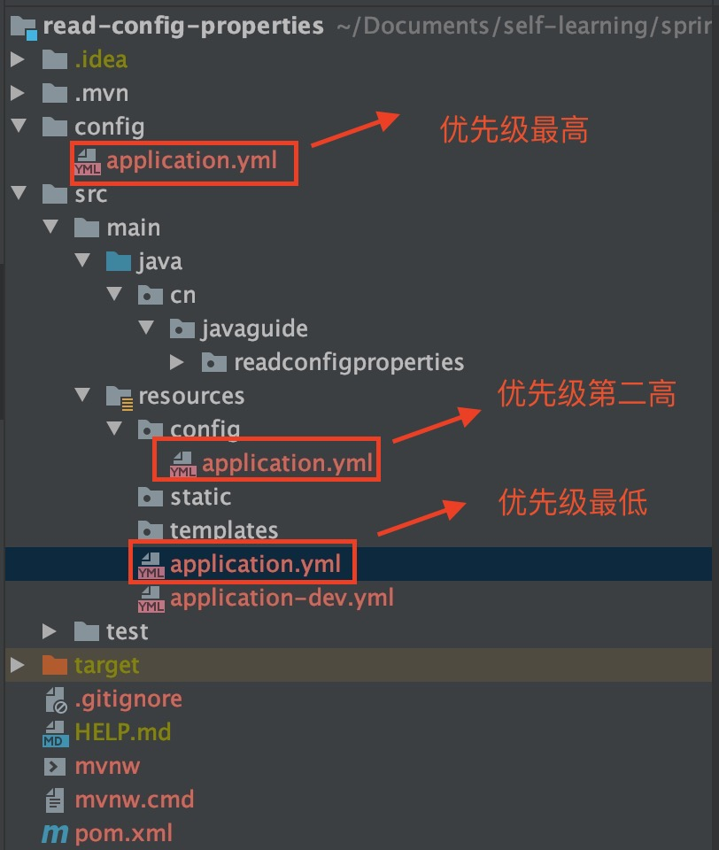

## Spring 概述
###  * 使用Spring框架的好处是什么？
- **轻量** Spring 是轻量的，基本的版本大约2MB
- **控制反转(IOC)** Spring通过控制反转实现了松散耦合，对象们给出它们的依赖，而不是创建或查找依赖的对象们
- **面向切面的编程(AOP)** Spring支持面向切面的编程，并且把应用业务逻辑和系统服务分开
- **容器** Spring 包含并管理应用中对象的生命周期和配置
- **MVC框架** Spring的WEB框架是个精心设计的框架，是Web框架的一个很好的替代品
- **事务管理** Spring 提供一个持续的事务管理接口，可以扩展到上至本地事务下至全局事务（JTA）
- **异常处理** Spring 提供方便的API把具体技术相关的异常（比如由JDBC，Hibernate or JDO抛出的）转化为一致的unchecked 异常。

### * spring 提供了哪些配置方式？
- 基于 xml 配置  
- 基于Java类的配置  
- 基于 Java 注解配置

## Spring IOC
### * 什么是 Spring IOC 容器？
Spring 框架的核心是 Spring 容器。容器创建对象，将它们装配在一起，配置它们并管理它们的完整生命周期。Spring 容器使用依赖注入来管理组成应用程序的组件。容器通过读取提供的配置元数据来接收对象进行实例化，配置和组装的指令。该元数据可以通过 XML，Java 注解或 Java 代码提供。


### * Spring IOC创建的过程
1. 获取一个新的bean工厂：通常是ApplicationContext
2. 加载和解析Spring的配置，解析bean对象，将解析到的bean封装成BeanDefinition
3. 实例化和调用BeanFactoryPostProcessor的扩展方法，这边是一个非常重要的扩展点。
4. 实例化BeanPostProcessor，加载到BeanFactory中，但是这边还不触发，该扩展接口的方法在bean对象执行初始化方法前后被触发。
5. 实例化Bean实例（非懒加载），包括：创建bean实例、bean实例属性填充、bean实例的初始化
6. 完成容器刷新，推送上下文刷新完毕事件ContextRefreshedEvent到监听器


### * IoC 容器构建完毕后执行逻辑
1. 比较常见的方法是**使用事件监听器**，实现 ApplicationListener 接口，监听 **ContextRefreshedEvent 事件**。
2. 还有一种比较少见的方法是**实现 SmartLifecycle 接口**，并且 isAutoStartup 方法返回 true，则会在 finishRefresh() 方法中被触发。
两种方式都是在 finishRefresh 中被触发，SmartLifecycle在ApplicationListener之前。

### * BeanFactory 和 FactoryBean 区别
* **BeanFactory**：Spring 容器最核心也是最基础的接口，本质是个**工厂类**，用于管理 bean 的工厂，**最核心的功能是加载 bean**，也就是 getBean 方法，通常我们不会直接使用该接口，而是使用其子接口。

* **FactoryBean**：该接口以 bean 样式定义，但是它不是一种普通的 bean，它是个**工厂 bean**，实现该接口的类可以**自己定义要创建的 bean 实例**，只需要实现它的 getObject 方法即可。

一般来说，都是通过 FactoryBean#getObject 来返回一个代理类，当我们触发调用时，会走到代理类中，从而可以在代理类中实现中间件的自定义逻辑，比如：RPC 最核心的几个功能，选址、建立连接、远程调用，还有一些自定义的监控、限流等等。

### * BeanFactory和ApplicationContext？
* **BeanFactory**：基础 IoC 容器，提供完整的 IoC 服务支持。

* **ApplicationContext**：高级 IoC 容器，BeanFactory 的子接口，在 BeanFactory 的基础上进行扩展。包含 BeanFactory 的所有功能，还提供了其他高级的特性，比如：事件发布、国际化信息支持、统一资源加载策略等。正常情况下，我们都是使用的 ApplicationContext。

## Spring Bean
### * Spring bean 的生命周期

1. Bean实例化阶段
    * Spring启动，查找并加载需要被Spring管理的bean，进行Bean的实例化
2. Bean实例属性填充阶段
    * Bean实例化后对将Bean的引入和值注入到Bean的属性中
3. Bean的初始化阶段
     * **Aware** 接口的触发，包括BeanFactoryAware、BeanNameAware、Bean-ClassLoaderAware
     * 如果Bean实现了 BeanPostProcessor 接口，Spring就将调用他们的**post-ProcessBeforeInitialization()** 方法，**初始化前**被触发。
     * 如果Bean 实现了**InitializingBean**接口，Spring将调用他们的**after-PropertiesSet()** 方法。如果bean使用**init-method**声明了初始化方法，该方法也会被调用进行bean的**初始化**
     * 如果Bean 实现了BeanPostProcessor接口，Spring就将调用他们的**post-ProcessAfterInitialization()** 方法, **初始化后**被触发。
4. Bean的正常使用阶段
     * 此时，Bean已经准备就绪，可以被应用程序使用了。他们将一直驻留在应用上下文中，直到应用上下文被销毁。
5. Bean的销毁阶段
     * 如果bean实现了**DisposableBean**接口，Spring将调用它的**destory()** 接口方法
     * 如果bean使用了 **destory-method** 声明销毁方法，该方法也会被调用。

### * Spring 中的 bean 的作用域有哪些?
- singleton : 唯一 bean 实例，Spring 中的 bean 默认都是单例的。
- prototype : 每次请求都会创建一个新的 bean 实例。
- request : 每一次HTTP请求都会产生一个新的bean，该bean仅在当前HTTP request内有效。
- session : ：在一个HTTP Session中，一个Bean定义对应一个实例。该作用域仅在基于web的Spring ApplicationContext情形下有效。
- global-session： 全局session作用域，仅仅在基于portlet的web应用中才有意义，Spring5已经没有了。Portlet是能够生成语义代码(例如：HTML)片段的小型Java Web插件。它们基于portlet容器，可以像servlet一样处理HTTP请求。但是，与 servlet 不同，每个 portlet 都有不同的会话

### * @PostConstruct 修饰的方法里用到了其他 bean 实例
1. PostConstruct 注解被封装在 CommonAnnotationBeanPostProcessor中，具体触发时间是在 postProcessBeforeInitialization 方法，从 doCreateBean 维度看，则是在 initializeBean 方法里，属于**初始化 bean 阶段**。
2. 属性的**依赖注入**是在 populateBean 方法里，属于**属性填充阶段**。
3. **属性填充阶段位于初始化之前**，所以本题答案为**没有问题**

### * bean 的 init-method 属性指定的方法里用到了其他 bean 实例
不会有问题。同上面一样，init-method 属性指定的方法也是在 initializeBean 方法里被触发，属于初始化 bean 阶段。

### * Spring中如何让两个bean按顺序加载？
1. 使用 @DependsOn、depends-on
2. 让后加载的类依赖先加载的类
```java
@Component
public class A{
	@Autowire
	private B b;
}
```
3. 使用扩展点提前加载，例如：BeanFactoryPostProcessor
```java
@Component
public class TestBean implements BeanFactoryPostProcessor{
	@Override
	public void postProcessBeanFactory(ConfigurableListableBeanFactory configurableListabbleBeanFactory) throws BeansException{
		//加载bean
		beanFactory.getBean("a");
	}
}
```

## Spring DI
### * 什么是依赖注入？可以通过多少种方式完成依赖注入？

在依赖注入中，您不必创建对象，但必须描述如何创建它们。您不是直接在代码中将组件和服务连接在一起，而是描述配置文件中哪些组件需要哪些服务。由 IoC 容器将它们装配在一起。

通常，依赖注入可以通过三种方式完成，即：
- 构造函数注入
- setter 注入
- 注解注入

### * 区分构造函数注入和 setter 注入
***
| 构造函数注入               | setter 注入              |
| -------------------------- | -------------------------|
| 没有部分注入               | 有部分注入                |
| 不会覆盖 setter 属性       | 会覆盖 setter 属性        |
| 任意修改都会创建一个新实例  | 任意修改不会创建一个新实例 |
| 适用于设置很多属性         | 适用于设置少量属性        |

### * Spring 怎么解决循环依赖的问题
Spring是通过提前暴露bean的引用来解决循环依赖问题的

Spring 首先使用构造函数创建一个 “不完整” 的 bean 实例（之所以说不完整，是因为此时该 bean 实例还未初始化），并且提前曝光该 bean 实例的 ObjectFactory（提前曝光就是将 ObjectFactory 放到 singletonFactories 缓存）.

通过 ObjectFactory 我们可以拿到该 bean 实例的引用，如果出现循环引用，我们可以通过缓存中的 ObjectFactory 来拿到 bean 实例，从而避免出现循环引用导致的死循环。

### * Spring能解决构造函数循环依赖吗
构造函数循环依赖是无法解决的，因为当构造函数出现循环依赖，我们连 “不完整” 的 bean 实例都构建不出来，没办法提前暴露。

### * Spring三级缓存
Spring 的三级缓存其实就是解决循环依赖时所用到的三个缓存。
* **singletonObjects**：正常情况下的 **bean** 被创建完毕后会被放到该缓存，key：beanName，value：bean 实例。
* **singletonFactories**：上面说的提前曝光的 **ObjectFactory** 就会被放到该缓存中，key：beanName，value：ObjectFactory。
* **earlySingletonObjects**：该缓存用于存放 **ObjectFactory 返回的 bean**，也就是说对于一个 bean，ObjectFactory 只会被用一次，之后就通过 earlySingletonObjects 来获取，key：beanName，早期 bean 实例。

### * @Resource和@Autowire的区别
1. @Resource 和 @Autowired 都可以用来装配 bean
2. @Autowired 默认**按类型装配**，默认情况下必须要求依赖对象必须存在，如果要允许null值，可以设置它的required属性为false。可以配合 **@Qualifier**使用名称注入。
3. @Resource 如果指定了 name 或 type，则按指定的进行装配；如果**都不指定，则优先按名称装配**，当找不到与名称匹配的 bean 时才按照类型进行装配。

## Spring AOP
### * Spring 的 AOP 是怎么实现的
本质是**通过动态代理来实现的**，主要有以下几个步骤。
1. 获取增强器，例如被 Aspect 注解修饰的类。
2. 在创建每一个 bean 时，会检查是否有增强器能应用于这个 bean，简单理解就是该 bean 是否在该增强器指定的 execution 表达式中。如果是，则将增强器作为拦截器参数，使用动态代理创建 bean 的代理对象实例。
3. 当我们调用被增强过的 bean 时，就会走到代理类中，从而可以触发增强器，本质跟拦截器类似。

### * 多个AOP的顺序怎么定
通过 Ordered 和 PriorityOrdered 接口进行排序。PriorityOrdered 接口的优先级比 Ordered 更高，如果同时实现 PriorityOrdered 或 Ordered 接口，则再按 order 值排序，值越小的优先级越高。

### * Spring  AOP 有哪些创建代理的方式
Spring 中的 AOP 目前支持 JDK 动态代理和 Cglib 代理。

通常来说：如果被代理对象实现了接口，则使用 JDK 动态代理，否则使用 Cglib 代理。另外，也可以通过指定 proxyTargetClass=true 来实现强制走 Cglib 代理。

### * JDK 动态代理和 Cglib 代理的区别
1. JDK 动态代理本质上是**实现了被代理对象的接口**，而 Cglib 本质上是**继承了被代理对象，覆盖其中的方法**。
2. JDK 动态代理只能对实现了接口的类生成代理，Cglib 则没有这个限制。但是 Cglib 因为使用继承实现，所以 Cglib 无法代理被 final 修饰的方法或类。
3. 在调用代理方法上，JDK 是通过反射机制调用，Cglib是通过FastClass 机制直接调用。FastClass 简单的理解，就是使用 index 作为入参，可以直接定位到要调用的方法直接进行调用。
4. 在性能上，JDK1.7 之前，由于使用了 FastClass 机制，Cglib 在执行效率上比 JDK 快，但是随着 JDK 动态代理的不断优化，从 JDK 1.7 开始，JDK 动态代理已经明显比 Cglib 更快了。

### * JDK 动态代理为什么只能对实现了接口的类生成代理
根本原因是通过 JDK 动态代理生成的类已经继承了 Proxy 类，所以无法再使用继承的方式去对类实现代理。

## Spring 事务

### * Spring 的事务传播行为有哪些
1. REQUIRED：Spring 默认的事务传播级别，如果上下文中已经存在事务，那么就加入到事务中执行，如果当前上下文中不存在事务，则新建事务执行。
2. REQUIRES_NEW：每次都会新建一个事务，如果上下文中有事务，则将上下文的事务挂起，当新建事务执行完成以后，上下文事务再恢复执行。
3. SUPPORTS：如果上下文存在事务，则加入到事务执行，如果没有事务，则使用非事务的方式执行。
4. MANDATORY：上下文中必须要存在事务，否则就会抛出异常。
5. NOT_SUPPORTED ：如果上下文中存在事务，则挂起事务，执行当前逻辑，结束后恢复上下文的事务。
6. NEVER：上下文中不能存在事务，否则就会抛出异常。
7. NESTED：嵌套事务。如果上下文中存在事务，则嵌套事务执行，如果不存在事务，则新建事务。

### * Spring 的事务隔离级别
Spring 的事务隔离级别底层其实是基于数据库的，Spring 并没有自己的一套隔离级别。
* **DEFAULT**：使用数据库的默认隔离级别。
* **READ_UNCOMMITTED**：读未提交，最低的隔离级别，会读取到其他事务还未提交的内容，存在脏读。
* **READ_COMMITTED**：读已提交，读取到的内容都是已经提交的，可以解决脏读，但是存在不可重复读。
* **REPEATABLE_READ**：可重复读，在一个事务中多次读取时看到相同的内容，可以解决不可重复读，但是存在幻读。
* **SERIALIZABLE**：串行化，最高的隔离级别，对于同一行记录，写会加写锁，读会加读锁。在这种情况下，只有读读能并发执行，其他并行的读写、写读、写写操作都是冲突的，需要串行执行。可以防止脏读、不可重复度、幻读，没有并发事务问题。

### * Spring 的事务隔离级别是如何做到和数据库不一致的？
比如数据库是可重复读，Spring 是读已提交，这是怎么实现的？

Spring 的事务隔离级别本质上还是通过数据库来控制的，具体是在执行事务前先执行命令修改数据库隔离级别，命令格式如下：
```mysql
SET SESSION TRANSACTION ISOLATION LEVEL READ COMMITTED
```

### * Spring事务的实现原理
Spring 事务的底层实现主要使用的技术：AOP（动态代理） + ThreadLocal + try/catch。
* 动态代理：基本所有要进行逻辑增强的地方都会用到动态代理，AOP 底层也是通过动态代理实现。
* ThreadLocal：主要用于线程间的资源隔离，以此实现不同线程可以使用不同的数据源、隔离级别等等。
* try/catch：最终是执行 commit 还是 rollback，是根据业务逻辑处理是否抛出异常来决定。
Spring 事务的核心逻辑伪代码如下：
```java
public void invokeWithinTransaction(){
	//事务资源准备
	try{
		//业务逻辑处理，也就是调用被代理的方法
	} catch(Exception e){
		//出现异常，进行回滚并将异常抛出
	} finally{
		//现场还原，还原旧的事务信息
	}
	//正常执行，进行事务的提交，返回业务逻辑处理结果
}
```


## SpringMVC
### * SpringMVC的工作原理
Spring MVC是一个基于Java的实现了MVC设计模式轻量级Web框架，通过把Model，View，Controller分离，将web层进行职责解耦，把复杂的web应用分成逻辑清晰的几部分。


1. 客户端（浏览器）发送请求，直接请求到 `DispatcherServlet`。
2. `DispatcherServlet` 根据请求信息调用 `HandlerMapping`，解析请求对应的 `Handler`。
3. 解析到对应的 `Handler`（也就是我们平常说的 `Controller` 控制器）后，开始由 `HandlerAdapter` 适配器处理。
4. `HandlerAdapter` 会根据 `Handler`来调用真正的处理器开处理请求，并处理相应的业务逻辑。
5. 处理器处理完业务后，会返回一个 `ModelAndView` 对象，`Model` 是返回的数据对象，`View` 是个逻辑上的 `View`。
6. `ViewResolver` 会根据逻辑 `View` 查找实际的 `View`。
7. `DispaterServlet` 把返回的 `Model` 传给 `View`（视图渲染）。
8. 把 `View` 返回给请求者（浏览器）

### * SpringMVC的核心组件
那么接下来就简单介绍一下 `DispatcherServlet` 和九大组件（按使用顺序排序的）：
* **DispatcherServlet** ：Spring MVC 的核心组件，是请求的入口，负责协调各个组件工作 
* **MultipartResolver**：内容类型( `Content-Type` )为 `multipart/*` 的请求的解析器，例如解析处理文件上传的请求，便于获取参数信息以及上传的文件 
* **HandlerMapping** ：请求的处理器匹配器，负责为请求找到合适的`Handler-ExecutionChain` 处理器执行链，包含处理器（`handler`）和拦截器们（`inter-ceptors`）
* **HandlerAdapter** ：处理器的适配器。因为处理器 `handler` 的类型是 Object 类型，需要有一个调用者来实现 `handler` 是怎么被执行。Spring 中的处理器的实现多变，比如用户处理器可以实现 Controller 接口、HttpRequestHandler 接口，也可以用 `@Request-Mapping` 注解将方法作为一个处理器等，这就导致 Spring MVC 无法直接执行这个处理器。所以这里需要一个处理器适配器，由它去执行处理器 
* **HandlerExceptionResolver**：处理器异常解析器，将处理器（ `handler` ）执行时发生的异常，解析( 转换 )成对应的 ModelAndView 结果 
* **RequestToViewNameTranslator** 视图名称转换器，用于解析出请求的默认视图名
* **LocaleResolver**   本地化（国际化）解析器，提供国际化支持  
* **ThemeResolver**  主题解析器，提供可设置应用整体样式风格的支持          
* **ViewResolver**       视图解析器，根据视图名和国际化，获得最终的视图 View 对象   
*  **FlashMapManager**   FlashMap 管理器，负责重定向时，保存参数至临时存储（默认 Session）

Spring MVC 对各个组件的职责划分的比较清晰。`DispatcherServlet` 负责协调，其他组件则各自做分内之事，互不干扰。

### * springMVC拦截器以及如何使用它
Spring的处理程序映射机制包括处理程序拦截器，当你希望将特定功能应用于某些请求时，例如，检查用户主题时，这些拦截器非常有用。拦截器必须实现org.spring-framework.web.servlet包的HandlerInterceptor。此接口定义了三种方法：
- preHandle：在执行实际处理程序之前调用。
- postHandle：在执行完实际程序之后调用。
- afterCompletion：在完成请求后调用。

## SpringBoot
### * SpringBoot的优点
1.  开发基于 Spring 的应用程序很容易。
2.  Spring Boot 项目所需的开发或工程时间明显减少，通常会提高整体生产力。
3.  Spring Boot 不需要编写大量样板代码、XML 配置和注释。
4.  Spring 引导应用程序可以很容易地与 Spring 生态系统集成，如 Spring JDBC、Spring ORM、Spring Data、Spring Security 等。
5.  Spring Boot 遵循“固执己见的默认配置”，以减少开发工作（默认配置可以修改）。
6.  Spring Boot 应用程序提供嵌入式 HTTP 服务器，如 Tomcat 和 Jetty，可以轻松地开发和测试 web 应用程序。（这点很赞！普通运行 Java 程序的方式就能运行基于 Spring Boot web 项目，省事很多）
7.  Spring Boot 提供命令行接口(CLI)工具，用于开发和测试 Spring Boot 应用程序，如 Java 或 Groovy。
8.  Spring Boot 提供了多种插件，可以使用内置工具(如 Maven 和 Gradle)开发和测试 Spring Boot 应用程序。

### * 如何理解 Spring Boot 中的 Starters？
Spring Boot Starters 是一系列依赖关系的集合，因为它的存在，项目的依赖之间的关系对我们来说变的更加简单了。

举个例子：在没有 Spring Boot Starters 之前，我们开发 REST 服务或 Web 应用程序时; 我们需要使用像 Spring MVC，Tomcat 和 Jackson 这样的库，这些依赖我们需要手动一个一个添加。但是，有了 Spring Boot Starters 我们只需要一个只需添加一个**spring-boot-starter-web**一个依赖就可以了，这个依赖包含的字依赖中包含了我们开发 REST 服务需要的所有依赖。
```xml
<dependency>
<groupId>org.springframework.boot</groupId>
<artifactId>spring-boot-starter-web</artifactId>
</dependency>
```

### * Spring Boot支持哪些内嵌Servlet容器
***
|**Name** | **Servlet Version**|
|----|----|
|Tomcat 9.0|4.0|
|Jetty 9.4|3.1|
|Undertow 2.0|4.0|

还可以将 Spring 引导应用程序部署到任何 Servlet 3.1+兼容的 Web 容器中。

### * 介绍一下@SpringBootApplication注解
```java
package org.springframework.boot.autoconfigure;
@Target(ElementType.TYPE)
@Retention(RetentionPolicy.RUNTIME)
@Documented
@Inherited
@SpringBootConfiguration
@EnableAutoConfiguration
@ComponentScan(excludeFilters = {
        @Filter(type = FilterType.CUSTOM, classes = TypeExcludeFilter.class),
        @Filter(type = FilterType.CUSTOM, classes = AutoConfigurationExcludeFilter.class) })
public @interface SpringBootApplication {
   ......
}
```

```java
package org.springframework.boot;
@Target(ElementType.TYPE)
@Retention(RetentionPolicy.RUNTIME)
@Documented
@Configuration
public @interface SpringBootConfiguration {
}
```

可以看出大概可以把 `@SpringBootApplication`看作是 `@Configuration`、`@EnableAutoConfiguration`、`@ComponentScan` 注解的集合。根据 SpringBoot 官网，这三个注解的作用分别是：
*   `@EnableAutoConfiguration`：启用 SpringBoot 的自动配置机制
*   `@ComponentScan`： 扫描被`@Component` (`@Service`,`@Controller`)注解的 bean，注解默认会扫描该类所在的包下所有的类。
*   `@Configuration`：允许在上下文中注册额外的 bean 或导入其他配置类

### * Spring Boot 的自动配置是如何实现的?
`@EnableAutoConfiguration`是启动自动配置的关键，源码如下(建议自己打断点调试，走一遍基本的流程)：
```java
import java.lang.annotation.Documented;
import java.lang.annotation.ElementType;
import java.lang.annotation.Inherited;
import java.lang.annotation.Retention;
import java.lang.annotation.RetentionPolicy;
import java.lang.annotation.Target;
import org.springframework.context.annotation.Import;

@Target({ElementType.TYPE})
@Retention(RetentionPolicy.RUNTIME)
@Documented
@Inherited
@AutoConfigurationPackage
@Import({AutoConfigurationImportSelector.class})
public @interface EnableAutoConfiguration {
    String ENABLED_OVERRIDE_PROPERTY = "spring.boot.enableautoconfiguration";

    Class<?>[] exclude() default {};

    String[] excludeName() default {};
}
```

`@EnableAutoConfiguration` 注解通过 Spring 提供的 `@Import` 注解导入了`AutoConfigurationImportSelector`类（`@Import` 注解可以导入配置类或者 Bean 到当前类中）。

`AutoConfigurationImportSelector`类中`getCandidateConfigurations`方法会将所有自动配置类的信息以 List 的形式返回。这些配置信息会被 Spring 容器作 bean 来管理。

```java
protected List<String> getCandidateConfigurations(AnnotationMetadata metadata, AnnotationAttributes attributes) {
        List<String> configurations = SpringFactoriesLoader.loadFactoryNames(getSpringFactoriesLoaderFactoryClass(),
                getBeanClassLoader());
        Assert.notEmpty(configurations, "No auto configuration classes found in META-INF/spring.factories. If you "
                + "are using a custom packaging, make sure that file is correct.");
        return configurations;
    }
```

自动配置信息有了，那么自动配置还差什么呢？

`@Conditional` 注解。`@ConditionalOnClass`(指定的类必须存在于类路径下),`@ConditionalOnBean`(容器中是否有指定的 Bean)等等都是对`@Conditional`注解的扩展。

拿 Spring Security 的自动配置举个例子:`SecurityAutoConfiguration`中导入了`WebSecurityEnablerConfiguration`类，`WebSecurityEnablerConfiguration`源代码如下：
```java
@Configuration
@ConditionalOnBean(WebSecurityConfigurerAdapter.class)
@ConditionalOnMissingBean(name = BeanIds.SPRING_SECURITY_FILTER_CHAIN)
@ConditionalOnWebApplication(type = ConditionalOnWebApplication.Type.SERVLET)
@EnableWebSecurity
public class WebSecurityEnablerConfiguration {

}
```

`WebSecurityEnablerConfiguration`类中使用`@ConditionalOnBean`指定了容器中必须还有`WebSecurityConfigurerAdapter` 类或其实现类。所以，一般情况下 Spring Security 配置类都会去实现 `WebSecurityConfigurerAdapter`，这样自动将配置就完成了。

### * 开发RESTful Web服务的常用注解
* Spring Bean相关：
     -   `@Autowired` : 自动导入对象到类中，被注入进的类同样要被 Spring 容器管理。
     -   `@RestController` : `@RestController`注解是`@Controller`和`@ResponseBody`的合集,表示这是个控制器 bean,并且是将函数的返回值直接填入 HTTP 响应体中,是 REST 风格的控制器。
     -   `@Component` ：通用的注解，可标注任意类为 `Spring` 组件。如果一个 Bean 不知道属于哪个层，可以使用`@Component` 注解标注。
     -   `@Repository` : 对应持久层即 Dao 层，主要用于数据库相关操作。
     -   `@Service` : 对应服务层，主要涉及一些复杂的逻辑，需要用到 Dao 层。
     -   `@Controller` : 对应 Spring MVC 控制层，主要用于接受用户请求并调用 Service 层返回数据给前端页面。

* 处理常见的HTTP请求类型
     -   `@GetMapping` : GET 请求、
     -   `@PostMapping` : POST 请求。
     -   `@PutMapping` : PUT 请求。
     -   `@DeleteMapping` : DELETE 请求。

* 前后端传值
     -   `@RequestParam`以及`@Pathvairable ：@PathVariable用于获取路径参数，@RequestParam用于获取查询参数。`
     -   `@RequestBody` ：用于读取 Request 请求（可能是 POST,PUT,DELETE,GET 请求）的 body 部分并且 Content-Type 为 `application/json` 格式的数据，接收到数据之后会自动将数据绑定到 Java 对象上去。系统会使用`HttpMessageConverter`或者自定义的`HttpMessageConverter`将请求的 body 中的 json 字符串转换为 java 对象。

### * Spirng Boot 常用的两种配置文件
我们可以通过 `application.properties`或者 `application.yml` 对 Spring Boot 程序进行简单的配置。如果，你不进行配置的话，就是使用的默认配置。

YAML 是一种人类可读的数据序列化语言。它通常用于配置文件。与属性文件相比，如果我们想要在配置文件中添加复杂的属性，YAML 文件就更加结构化，而且更少混淆。可以看出 YAML 具有分层配置数据。

相比 Properties 配置的方式，YAML 配置的方式更加**直观清晰，简洁明了，有层次感**。

### *  Spring Boot 常用的读取配置文件方法
1. 通过 `@value` 读取比较简单的配置信息   

使用 `@Value("${property}")` 读取比较简单的配置信息：
```java
@Value("${property}")
String wuhan2020;
```

2. 通过@ConfigurationProperties读取并与 bean 绑定

**`LibraryProperties` 类上加了 `@Component` 注解，我们可以像使用普通 bean 一样将其注入到类中使用。**
```java
import lombok.Getter;
import lombok.Setter;
import lombok.ToString;
import org.springframework.boot.context.properties.ConfigurationProperties;
import org.springframework.context.annotation.Configuration;
import org.springframework.stereotype.Component;

import java.util.List;

@Component
@ConfigurationProperties(prefix = "library")
@Setter
@Getter
@ToString
class LibraryProperties {
    private String location;
    private List<Book> books;

    @Setter
    @Getter
    @ToString
    static class Book {
        String name;
        String description;
    }
}
```

将其注入到类中使用
```java
package cn.javaguide.readconfigproperties;

import org.springframework.beans.factory.InitializingBean;
import org.springframework.boot.SpringApplication;
import org.springframework.boot.autoconfigure.SpringBootApplication;

/**
 * @author shuang.kou
 */
@SpringBootApplication
public class ReadConfigPropertiesApplication implements InitializingBean {

    private final LibraryProperties library;

    public ReadConfigPropertiesApplication(LibraryProperties library) {
        this.library = library;
    }

    public static void main(String[] args) {
        SpringApplication.run(ReadConfigPropertiesApplication.class, args);
    }

    @Override
    public void afterPropertiesSet() {
        System.out.println(library.getLocation());
        System.out.println(library.getBooks());    }
}
```

3. 通过@ConfigurationProperties读取并校验

**`ProfileProperties` 类没有加 `@Component` 注解。我们在我们要使用`ProfileProperties` 的地方使用`@EnableConfigurationProperties`注册我们的配置 bean：**
```java
import lombok.Getter;
import lombok.Setter;
import lombok.ToString;
import org.springframework.boot.context.properties.ConfigurationProperties;
import org.springframework.stereotype.Component;
import org.springframework.validation.annotation.Validated;

import javax.validation.constraints.Email;
import javax.validation.constraints.NotEmpty;

/**
* @author shuang.kou
*/
@Getter
@Setter
@ToString
@ConfigurationProperties("my-profile")
@Validated
public class ProfileProperties {
   @NotEmpty
   private String name;

   @Email
   @NotEmpty
   private String email;

   //配置文件中没有读取到的话就用默认值
   private Boolean handsome = Boolean.TRUE;

}
```

具体使用
```java
package cn.javaguide.readconfigproperties;

import org.springframework.beans.factory.InitializingBean;
import org.springframework.beans.factory.annotation.Value;
import org.springframework.boot.SpringApplication;
import org.springframework.boot.autoconfigure.SpringBootApplication;
import org.springframework.boot.context.properties.EnableConfigurationProperties;

/**
 * @author shuang.kou
 */
@SpringBootApplication
@EnableConfigurationProperties(ProfileProperties.class)
public class ReadConfigPropertiesApplication implements InitializingBean {
    private final ProfileProperties profileProperties;

    public ReadConfigPropertiesApplication(ProfileProperties profileProperties) {
        this.profileProperties = profileProperties;
    }

    public static void main(String[] args) {
        SpringApplication.run(ReadConfigPropertiesApplication.class, args);
    }

    @Override
    public void afterPropertiesSet() {
        System.out.println(profileProperties.toString());
    }
}
```

4. @PropertySource读取指定的 properties 文件

```java
import lombok.Getter;
import lombok.Setter;
import org.springframework.beans.factory.annotation.Value;
import org.springframework.context.annotation.PropertySource;
import org.springframework.stereotype.Component;

@Component
@PropertySource("classpath:website.properties")
@Getter
@Setter
class WebSite {
    @Value("${url}")
    private String url;
}
```

使用：
```java
@Autowired
private WebSite webSite;

System.out.println(webSite.getUrl());//https://javaguide.cn/
```

### *  Spring Boot 加载配置文件的优先级


### * 常用的 Bean 映射工具
工作中，我们经常需要将对象转换成不同的形式以适应不同的api，或者在不同业务层中传输对象而不同分层的对象存在不同的格式，因此我们需要编写映射代码将对象中的属性值从一种类型转换成另一种类型。

MapStruct、ModelMapper、Dozer、Orika、JMapper 是 5 种常用的 Bean 映射工具。

### * Spring Boot 监控系统实际运行状况
我们可以使用 Spring Boot Actuator 来对 Spring Boot 项目进行简单的监控。

```xml
<dependency>
    <groupId>org.springframework.boot</groupId>
    <artifactId>spring-boot-starter-actuator</artifactId>
</dependency>
```

集成了这个模块之后，你的 Spring Boot 应用程序就自带了一些开箱即用的获取程序运行时的内部状态信息的 API。

比如通过 GET 方法访问 `/health` 接口，你就可以获取应用程序的健康指标。

### * Spring Boot 如何做请求参数校验？
1. 校验注解
     * JSR 提供的校验注解
     * Hibernate Validator 提供的校验注解

2. 验证请求体(RequestBody)

我们在需要验证的参数上加上了`@Valid` 注解，如果验证失败，它将抛出`MethodArgumentNotValidException`。默认情况下，Spring 会将此异常转换为 HTTP Status 400（错误请求）。

```java
@RestController
@RequestMapping("/api")
public class PersonController {

    @PostMapping("/person")
    public ResponseEntity<Person> getPerson(@RequestBody @Valid Person person) {
        return ResponseEntity.ok().body(person);
    }
}
```

3. 验证请求参数(Path Variables 和 Request Parameters)

在类上加上 Validated 注解，这个参数可以告诉 Spring 去校验方法参数
```java
@RestController
@RequestMapping("/api")
@Validated
public class PersonController {

    @GetMapping("/person/{id}")
    public ResponseEntity<Integer> getPersonByID(@Valid @PathVariable("id") @Max(value = 5,message = "超过 id 的范围了") Integer id) {
        return ResponseEntity.ok().body(id);
    }

    @PutMapping("/person")
    public ResponseEntity<String> getPersonByName(@Valid @RequestParam("name") @Size(max = 6,message = "超过 name 的范围了") String name) {
        return ResponseEntity.ok().body(name);
    }
}
```

### * 使用 Spring Boot 实现全局异常处理
**使用 `@ControllerAdvice` 和 `@ExceptionHandler` 处理全局异常**

SpringBoot中，@ControllerAdvice 即可开启全局异常处理，使用该注解表示开启了全局异常的捕获，我们只需在自定义一个方法使用@ExceptionHandler注解然后定义捕获异常的类型即可对这些捕获的异常进行统一的处理。

1. 自定义异常信息枚举类
```java
package com.mango.seckill.vo;

import lombok.AllArgsConstructor;
import lombok.Getter;
import lombok.ToString;

@Getter
@ToString
@AllArgsConstructor
public enum RespBeanEnum {
    //通用
    SUCCESS(200,"登录成功"),
    ERROR(500,"服务器端很异常"),
    //登录模块5002xx
    LOGIN_ERROR(500210,"用户名或密码不正确"),
    MOBILE_ERROR(500211,"手机号格式错误"),
    BIND_ERROR(50022,"参数校验错误"),
    MOBILE_NOT_EXIST(50023,"手机号码不存在"),
    PASSWORD_UPDATE_FAIL(50024,"密码更新失败"),
    LOG_IN_AGAIN(50025,"请重新登录"),
    //秒杀模块5005xx
    EMPTY_STOCK(500500,"库存不足"),
    REPEATE_ERROR(500501,"该商品每人限购一件"),
    SELL_OUT(500502,"售罄"),
    ORDER_NOT_EXIST(500503,"订单不存在"),
    REQUEST_ILLEGAL(500504,"请求错误"),
    SECKILL_FAIL(500505,"秒杀失败"),
    ;
    private final Integer code;
    private final String message;
}
```

2. 自定义全局异常信息实体类，用于包装异常信息
```java
package com.mango.seckill.vo;

import lombok.AllArgsConstructor;
import lombok.Data;
import lombok.NoArgsConstructor;

@Data
@AllArgsConstructor
@NoArgsConstructor
public class RespBean {
    private long code;
    private String message;
    private Object obj;

    //成功
    public static RespBean success() {
        return new RespBean(RespBeanEnum.SUCCESS.getCode(), RespBeanEnum.SUCCESS.getMessage(), null);
    }

    public static RespBean success(Object obj) {
        return new RespBean(RespBeanEnum.SUCCESS.getCode(), RespBeanEnum.SUCCESS.getMessage(), obj);
    }

    //失败,直接传枚举，因为失败原因有多个
    public static RespBean error(RespBeanEnum respBeanEnum) {
        return new RespBean(respBeanEnum.getCode(), respBeanEnum.getMessage(), null);
    }

    public static RespBean error(RespBeanEnum respBeanEnum, Object obj) {
        return new RespBean(respBeanEnum.getCode(), respBeanEnum.getMessage(), obj);
    }
}
```

3. 自定义异常类型，一般我们处理的都是 `RuntimeException` ，所以如果你需要自定义异常类型的话直接集成这个类就可以了。
```java
package com.mango.seckill.exception;

import com.mango.seckill.vo.RespBeanEnum;
import lombok.AllArgsConstructor;
import lombok.Data;
import lombok.NoArgsConstructor;

/**
 * 全局异常
 */
@Data
@AllArgsConstructor
@NoArgsConstructor
public class GlobalException extends RuntimeException{
    private RespBeanEnum respBeanEnum;
}

```

4. 定义异常处理类
```java
package com.mango.seckill.exception;

import com.mango.seckill.vo.RespBean;
import com.mango.seckill.vo.RespBeanEnum;
import org.springframework.validation.BindException;
import org.springframework.web.bind.annotation.ExceptionHandler;
import org.springframework.web.bind.annotation.RestControllerAdvice;

@RestControllerAdvice
public class GlobalExceptionHandler {
    @ExceptionHandler(Exception.class)
    public RespBean ExceptionHandler(Exception e){
        if (e instanceof GlobalException){
            GlobalException ex = (GlobalException) e;
            return RespBean.error(ex.getRespBeanEnum());
        }else if (e instanceof BindException) {
            BindException ex = (BindException) e;
            RespBean respBean = RespBean.error(RespBeanEnum.BIND_ERROR);
            respBean.setMessage("参数校验异常："+ex.getBindingResult().getAllErrors().get(0).getDefaultMessage());
            return respBean;
        }
        return RespBean.error(RespBeanEnum.ERROR);
    }
}
```

5. 手动抛出异常

### * Spring Boot 中实现定时任务
使用 `@Scheduled` 注解就能很方便地创建一个定时任务。

```java
@Component
public class ScheduledTasks {
    private static final Logger log = LoggerFactory.getLogger(ScheduledTasks.class);
    private static final SimpleDateFormat dateFormat = new SimpleDateFormat("HH:mm:ss");

    /**
     * fixedRate：固定速率执行。每5秒执行一次。
     */
    @Scheduled(fixedRate = 5000)
    public void reportCurrentTimeWithFixedRate() {
        log.info("Current Thread : {}", Thread.currentThread().getName());
        log.info("Fixed Rate Task : The time is now {}", dateFormat.format(new Date()));
    }
}
```

单纯依靠 `@Scheduled` 注解 还不行，我们还需要在 SpringBoot 中我们只需要在启动类上加上`@EnableScheduling` 注解，这样才可以启动定时任务。`@EnableScheduling` 注解的作用是发现注解 `@Scheduled` 的任务并在后台执行该任务。