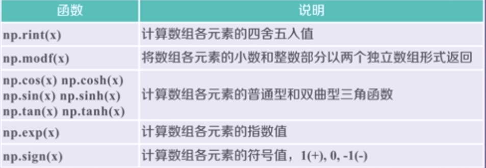

### 主题思想

一个数据表达一个含义--------->一组数据表达一个或多个含义：与一组数据相关的那些事儿，即如何理解数据表达的含义

编程工具  
使用Anaconda IDE集成开发工具  
需要理解和掌握如下工具的使用：conda、Spyder、IPython  
常用的python IDE工具  
IDLE 自带的、默认的、常用的，入门级编写工具，适合入门，300行以内  
Sublime Text 专为程序员设计，有多种功能和风格  
Wine 公司维护，收费，适合多人共同开发  
VS & PTVS  
Eclipse PyDev 需要一定的能力配置  
PyCharm 社区版免费  
Canopy 公司维护，工具收费  
Anaconda 免费开源  

### Anaconda的基本使用
conda 是一个工具，用于包管理和环境  
包管理和pip类似，管理Python的第三方库  
环境管理包括能够允许用户使用不同版本的python，并能够灵活切换  
anaconda: 一个集合，包括conda、某版本的python、一批第三方库等
IPython 的？命令，可以查看参数  
IPython `%run ` 用于运行.py程序 （%run在一个空的命名空间执行%）  


### 数据的维度
维度：是一组数据的组织形式  
一维数据  
由对等关系的有序和无序数据构成，采用线性方式组织，对应列表、数组和集合等概念。  
列表和数组  
都是一组数据的有序结构  
区别：列表数据类型可以不同 数组数据类型相同  
二维数据  
由多个一维数据构成，是一维数据的组合形式，表格是典型的二维数据，其中，表头是二维数据的一部分  
多维数据  
由一维或二维数据在新维度上扩展而成  
高维数据  
仅利用最基本的二元关系展示数据间的复杂结构（键值对）  
一维数据：列表和集合类型  
二维数据：列表类型  
多维类型：列表类型  
高维类型：字典类型或者数据表示格式   

### Numpy库
是一个开源的python科学计算基础库  
一个强大的N维数组对象 ndarray  
广播功能函数  
整合C/C++/Fortran代码的工具  
线性代数、傅立叶变换、随机数生成等功能  
Numpy是SciPy、Pandas等数据处理或科学计算库的基础  
`import numpy as np`  
尽管别名可以省略或者更改，建议使用上述约定的别名  
N维数组对象：ndarray  
例子：计算A2+B3，其中，A、B是一维数组  
```
def pySum():
    a = [0,1,2,3.4]
    b = [9,8,7,6,5]
    c = []
    
    for i in range(len(a)):
        c.append(a[i]**2+b[i]**3)
    return c
print(pySum)
```
numpy的方法：
```
import numpy as np

def npSum():
    a = np.array([0,1,2,3,4])
    b = np.array([9,8,7,6,5])
    c = a**2 + b**3
    
    return c

print(npSum()) 
```
数组对象可以去掉元素间运算所需的循环，使一维向量更像单个数据  
设置专门的数组对象，经过优化，可以提升这类应用的运算速度  
观察：科学计算时，一个维度所有数据的类型往往是相同的  
数组对象采用相同的数据类型，有助于节省运算和存储空间  
ndarray是一个多维数组对象，由两部分构成：  
实际的数据  
描述这些数据的元数据（数据维度、数据类型等等）  
ndarray数组一般要求所有元素类型相同（同质），数组下标从0开始  
`np.array()`生成一个ndarray数组，ndarray在程序中的别名是array  
`np.array()`输出成[]形式，元素用空格分割。  
轴（axis）：保存数据的维度    秩（rank）：轴的数量（几个维度）  


```
In [6]: a = np.array([[0,1,2,3,4],[9,8,7,6,5]])

In [7]: a.ndim
Out[7]: 2

In [8]: a.shape
Out[8]: (2, 5)

In [9]: a.size
Out[9]: 10

In [10]: a.dtype
Out[10]: dtype('int64')

In [11]: a.itemsize
Out[11]: 8 
```
ndarray的元素类型  

 


#### ndarray数组的创建方法
1. 从python中的列表、元组等类型创建ndarray数组  
`x = np,array(list/tuple)`  
`x = np.array(list/tuple, dtype= np.float32)`  
当np.array()不指定dtype时，NumPy将根据数据情况关联一个dtype类型。  

2)使用numpy中函数创建ndarray数组，如arange, ones,zeros等  

```
n [12]: np.arange(15)
Out[12]: array([ 0,  1,  2,  3,  4,  5,  6,  7,  8,  9, 10, 11, 12, 13, 14])

In [13]: np.ones((4,5))
Out[13]: 
array([[1., 1., 1., 1., 1.],
       [1., 1., 1., 1., 1.],
       [1., 1., 1., 1., 1.],
       [1., 1., 1., 1., 1.]])

In [14]: np.zeros((4,5))
Out[14]: 
array([[0., 0., 0., 0., 0.],
       [0., 0., 0., 0., 0.],
       [0., 0., 0., 0., 0.],
       [0., 0., 0., 0., 0.]])

In [15]: np.eye(5)
Out[15]: 
array([[1., 0., 0., 0., 0.],
       [0., 1., 0., 0., 0.],
       [0., 0., 1., 0., 0.],
       [0., 0., 0., 1., 0.],
       [0., 0., 0., 0., 1.]])

In [17]: np.ones((2,3,5))
Out[17]: 
array([[[1., 1., 1., 1., 1.],
        [1., 1., 1., 1., 1.],
        [1., 1., 1., 1., 1.]],

       [[1., 1., 1., 1., 1.],
        [1., 1., 1., 1., 1.],
        [1., 1., 1., 1., 1.]]]) 
```
 


```
In [18]: a = np.linspace(1,10,4)

In [19]: a
Out[19]: array([ 1.,  4.,  7., 10.])

In [20]: a = np.linspace(1,10,4, endpoint=False)

In [21]: a
Out[21]: array([1.  , 3.25, 5.5 , 7.75])

In [22]: b  = np.linspace(1,10,4)

In [23]: c = np.concatenate((a,b))

In [24]: c
Out[24]: array([ 1.  ,  3.25,  5.5 ,  7.75,  1.  ,  4.  ,  7.  , 10.  ]) 
```
ndarray数组的维度变换  

`new_a = a.astype(new_type)`  
astype()方法一定会创建新的数组（原始数据的一个拷贝），即两个类型一致。  
ndarray数组向列表的转换  
`ls = a.tolist`  
从字节流（raw bytes)中创建ndarray数组  
从文件中读取特定格式，创建ndarray数组  

数组的索引和切片  
一维数组的索引和切片，与python的列表类似  
```
In [25]: a = np.array([9,8,7,6,5])

In [26]: a[2]
Out[26]: 7

In [27]: a[1:4:2]   #起始编号：终止编号（不含）：步长3元素冒号分割
Out[27]: array([8, 6]) 
```
多维数组的索引：  
```
In [28]: a = np.arange(24).reshape((2,3,4))

In [29]: a
Out[29]: 
array([[[ 0,  1,  2,  3],
        [ 4,  5,  6,  7],
        [ 8,  9, 10, 11]],

       [[12, 13, 14, 15],
        [16, 17, 18, 19],
        [20, 21, 22, 23]]])

In [30]: a[1,2,3]
Out[30]: 23

In [31]: a[0,1,2]
Out[31]: 6

In [32]: a[-1, -2 , -3]
Out[32]: 17 
```
多维数组的切片：  
```
In [33]: a[:, 1, -3]      #选取一个维度用：
Out[33]: array([ 5, 17])

In [34]: a[:, 1:3, :]             #每个维度切片与一维数组相同
Out[34]: 
array([[[ 4,  5,  6,  7],
        [ 8,  9, 10, 11]],

       [[16, 17, 18, 19],
        [20, 21, 22, 23]]])

In [35]: a[:,:,::2]    #每个维度可以使用步长跳跃切片
Out[35]: 
array([[[ 0,  2],
        [ 4,  6],
        [ 8, 10]],

       [[12, 14],
        [16, 18],
```

#### narrray数组的运算
数组与标量之间的运算  
数组与标量之间的运算作用于数组的每一个元素  
```
 a.mean()
Out[36]: 11.5

In [37]: a = a/a.mean()

In [38]: a
Out[38]: 
array([[[0.        , 0.08695652, 0.17391304, 0.26086957],
        [0.34782609, 0.43478261, 0.52173913, 0.60869565],
        [0.69565217, 0.7826087 , 0.86956522, 0.95652174]],

       [[1.04347826, 1.13043478, 1.2173913 , 1.30434783],
        [1.39130435, 1.47826087, 1.56521739, 1.65217391],
        [1.73913043, 1.82608696, 1.91304348, 2.        ]]]) 
```
对ndarray中的数据执行元素极运算的函数  



```
In [41]: a = np.arange(24).reshape((2,3,4))

In [42]: a
Out[42]: 
array([[[ 0,  1,  2,  3],
        [ 4,  5,  6,  7],
        [ 8,  9, 10, 11]],

       [[12, 13, 14, 15],
        [16, 17, 18, 19],
        [20, 21, 22, 23]]])

In [43]: np.square(a)
Out[43]: 
array([[[  0,   1,   4,   9],
        [ 16,  25,  36,  49],
        [ 64,  81, 100, 121]],

       [[144, 169, 196, 225],
        [256, 289, 324, 361],
        [400, 441, 484, 529]]])

In [44]: a = sqrt(a)
---------------------------------------------------------------------------
NameError                                 Traceback (most recent call last)
<ipython-input-44-7803baeb8559> in <module>()
----> 1 a = sqrt(a)

NameError: name 'sqrt' is not defined

In [45]: a = np.sqrt(a)

In [46]: a
Out[46]: 
array([[[0.        , 1.        , 1.41421356, 1.73205081],
        [2.        , 2.23606798, 2.44948974, 2.64575131],
        [2.82842712, 3.        , 3.16227766, 3.31662479]],

       [[3.46410162, 3.60555128, 3.74165739, 3.87298335],
        [4.        , 4.12310563, 4.24264069, 4.35889894],
        [4.47213595, 4.58257569, 4.69041576, 4.79583152]]])

In [47]: np.modf(a)
Out[47]: 
(array([[[0.        , 0.        , 0.41421356, 0.73205081],
         [0.        , 0.23606798, 0.44948974, 0.64575131],
         [0.82842712, 0.        , 0.16227766, 0.31662479]],
 
        [[0.46410162, 0.60555128, 0.74165739, 0.87298335],
         [0.        , 0.12310563, 0.24264069, 0.35889894],
         [0.47213595, 0.58257569, 0.69041576, 0.79583152]]]),
 array([[[0., 1., 1., 1.],
         [2., 2., 2., 2.],
         [2., 3., 3., 3.]],
 
        [[3., 3., 3., 3.],
         [4., 4., 4., 4.],
         [4., 4., 4., 4.]]]))
In [48]: b = a[1, :, :]

In [49]: b
Out[49]: 
array([[3.46410162, 3.60555128, 3.74165739, 3.87298335],
       [4.        , 4.12310563, 4.24264069, 4.35889894],
       [4.47213595, 4.58257569, 4.69041576, 4.79583152]]) 
```
NumPy二元函数  

```
 In [53]: a = np.arange(24).reshape((2,3,4))

In [54]: a
Out[54]: 
array([[[ 0,  1,  2,  3],
        [ 4,  5,  6,  7],
        [ 8,  9, 10, 11]],

       [[12, 13, 14, 15],
        [16, 17, 18, 19],
        [20, 21, 22, 23]]])

In [55]: b = np.sqrt(a)

In [56]: b
Out[56]: 
array([[[0.        , 1.        , 1.41421356, 1.73205081],
        [2.        , 2.23606798, 2.44948974, 2.64575131],
        [2.82842712, 3.        , 3.16227766, 3.31662479]],

       [[3.46410162, 3.60555128, 3.74165739, 3.87298335],
        [4.        , 4.12310563, 4.24264069, 4.35889894],
        [4.47213595, 4.58257569, 4.69041576, 4.79583152]]])

In [57]: np.maximum(a,b)
Out[57]: 
array([[[ 0.,  1.,  2.,  3.],
        [ 4.,  5.,  6.,  7.],
        [ 8.,  9., 10., 11.]],

       [[12., 13., 14., 15.],
        [16., 17., 18., 19.],
        [20., 21., 22., 23.]]])

In [58]: a>b
Out[58]: 
array([[[False, False,  True,  True],
        [ True,  True,  True,  True],
        [ True,  True,  True,  True]],

       [[ True,  True,  True,  True],
        [ True,  True,  True,  True],
        [ True,  True,  True,  True]]]) 
```

####  NumPy文件存放与读取
CSV（Comma-Separated Value, 逗号分割值）  
CSV是一种常见的文件格式，用来存储批量数据  
CSV文件  
`np.savetxt(frame,array,fmt='%.18e', delimiter=None)`  
frame: 文件、字符串或者产生器，可以是.gz或.bz2的压缩文件  
array: 存入文件的数组  
fmt: 写入文件的格式,例如：%d %.2f %.18e  
delimiter: 分割字符串，默认是空格  
`np.loadtxt(frame, dtype=np.float, delimiter=None, unpack=False)`   
unpack:如果True，读入属性将分别写入不同的变量   
```
a = np.arange(100).reshape(5,20)
>>> np.savetxt('a.csv', a, fmt='%d', delimiter=',')
>>> b = np.loadtxt('a.csv',delimiter=',')
>>> b
array([[ 0.,  1.,  2.,  3.,  4.,  5.,  6.,  7.,  8.,  9., 10., 11., 12.,
        13., 14., 15., 16., 17., 18., 19.],
       [20., 21., 22., 23., 24., 25., 26., 27., 28., 29., 30., 31., 32.,
        33., 34., 35., 36., 37., 38., 39.],
       [40., 41., 42., 43., 44., 45., 46., 47., 48., 49., 50., 51., 52.,
        53., 54., 55., 56., 57., 58., 59.],
       [60., 61., 62., 63., 64., 65., 66., 67., 68., 69., 70., 71., 72.,
        73., 74., 75., 76., 77., 78., 79.],
       [80., 81., 82., 83., 84., 85., 86., 87., 88., 89., 90., 91., 92.,
        93., 94., 95., 96., 97., 98., 99.]])
>>> b = np.loadtxt('a.csv',dtype=np.int, delimiter=',')
>>> b
array([[ 0,  1,  2,  3,  4,  5,  6,  7,  8,  9, 10, 11, 12, 13, 14, 15,
        16, 17, 18, 19],
       [20, 21, 22, 23, 24, 25, 26, 27, 28, 29, 30, 31, 32, 33, 34, 35,
        36, 37, 38, 39],
       [40, 41, 42, 43, 44, 45, 46, 47, 48, 49, 50, 51, 52, 53, 54, 55,
        56, 57, 58, 59],
       [60, 61, 62, 63, 64, 65, 66, 67, 68, 69, 70, 71, 72, 73, 74, 75,
        76, 77, 78, 79],
       [80, 81, 82, 83, 84, 85, 86, 87, 88, 89, 90, 91, 92, 93, 94, 95,
        96, 97, 98, 99]])  
```
CSV只能有效的存储一维和二维数组  

多维数组的存取  
a.tofile(frame, sep='', format='%s')  
frame:文件、字符串  
sep: 数据分割字符串，如果是空串，写入文件为二进制  
format：写入数据的格式  
```
>>> c = np.arange(100).reshape(5,10,2)
>>> c.tofile("c.dat", format='%d')   
```
`np.fromfile(frame, dtype= float, count=-1, sep='') ` 
count: 读入元素的个数，-1表示读入整个文件  
```
>>> c.tofile("c.dat", sep=",", format='%d')
>>> d = np.fromfile("c.dat", dtype=np.int, sep=",")
>>> d
array([ 0,  1,  2,  3,  4,  5,  6,  7,  8,  9, 10, 11, 12, 13, 14, 15, 16,
       17, 18, 19, 20, 21, 22, 23, 24, 25, 26, 27, 28, 29, 30, 31, 32, 33,
       34, 35, 36, 37, 38, 39, 40, 41, 42, 43, 44, 45, 46, 47, 48, 49, 50,
       51, 52, 53, 54, 55, 56, 57, 58, 59, 60, 61, 62, 63, 64, 65, 66, 67,
       68, 69, 70, 71, 72, 73, 74, 75, 76, 77, 78, 79, 80, 81, 82, 83, 84,
       85, 86, 87, 88, 89, 90, 91, 92, 93, 94, 95, 96, 97, 98, 99])
>>> d = np.fromfile("c.dat", dtype=np.int, sep=",").reshape(5,10,2)
>>> d
array([[[ 0,  1],
        [ 2,  3],
        [ 4,  5],
        [ 6,  7],
        [ 8,  9],
        [10, 11],
        [12, 13],
        [14, 15],
        [16, 17],
        [18, 19]],

       [[20, 21],
        [22, 23],
        [24, 25],
        [26, 27],
        [28, 29],
        [30, 31],
        [32, 33],
        [34, 35],
        [36, 37],
        [38, 39]],

       [[40, 41],
        [42, 43],
        [44, 45],
        [46, 47],
        [48, 49],
        [50, 51],
        [52, 53],
        [54, 55],
        [56, 57],
        [58, 59]],

       [[60, 61],
        [62, 63],
        [64, 65],
        [66, 67],
        [68, 69],
        [70, 71],
        [72, 73],
        [74, 75],
        [76, 77],
        [78, 79]],

       [[80, 81],
        [82, 83],
        [84, 85],
        [86, 87],
        [88, 89],
        [90, 91],
        [92, 93],
        [94, 95],
        [96, 97],
        [98, 99]]]) 
```
该方法需要读取时知道存入文件时数组的维度和元素类型  
 `a.tofile()`和`np.fromefile()`需要配合使用  
可以通过元数据文件来存储额外信息  

Numpy的便捷文件存取  
`np.save(frame,array)`或者`np.savez(fname,array) ` 
frame:文件名，以.npy为扩展名，压缩扩展名为.npz  
array:数组变量  
np.load（frame）  
frame：文件名，以.npy为扩展名，压缩扩展名为.npz  
```
>>> a = np.arange(100).reshape(5,10,2)
>>> np.save("a.npy", a)
>>> b =np.load("a.npy")
>>> b
array([[[ 0,  1],
        [ 2,  3],
        [ 4,  5],
        [ 6,  7],
        [ 8,  9],
        [10, 11],
        [12, 13],
        [14, 15],
        [16, 17],
        [18, 19]],

       [[20, 21],
        [22, 23],
        [24, 25],
        [26, 27],
        [28, 29],
        [30, 31],
        [32, 33],
        [34, 35],
        [36, 37],
        [38, 39]],

       [[40, 41],
        [42, 43],
        [44, 45],
        [46, 47],
        [48, 49],
        [50, 51],
        [52, 53],
        [54, 55],
        [56, 57],
        [58, 59]],

       [[60, 61],
        [62, 63],
        [64, 65],
        [66, 67],
        [68, 69],
        [70, 71],
        [72, 73],
        [74, 75],
        [76, 77],
        [78, 79]],

       [[80, 81],
        [82, 83],
        [84, 85],
        [86, 87],
        [88, 89],
        [90, 91],
        [92, 93],
        [94, 95],
        [96, 97],
        [98, 99]]]) 
```
np.random的随机数函数  


```
 >>> a = np.random.randint(100,200,(3,4))
>>> a
array([[168, 133, 164, 186],
       [137, 111, 144, 114],
       [180, 138, 123, 189]])
>>> np.random.shuffle(a)
>>> a
array([[180, 138, 123, 189],
       [168, 133, 164, 186],
       [137, 111, 144, 114]])
>>> np.random.shuffle(a)
>>> a
array([[180, 138, 123, 189],
       [137, 111, 144, 114],
       [168, 133, 164, 186]])
In [1]: import numpy as np
In [2]: a = np.random.randint(100,200,(3,4))
In [3]: a
Out[3]: 
array([[116, 105, 108, 111],
       [177, 161, 133, 153],
       [199, 172, 130, 104]])
In [4]: np.random.permutation(a)
Out[4]: 
array([[177, 161, 133, 153],
       [116, 105, 108, 111],
       [199, 172, 130, 104]])
In [5]: a
Out[5]: 
array([[116, 105, 108, 111],
       [177, 161, 133, 153],
       [199, 172, 130, 104]])
In [8]: b = np.random.randint(100,200,(8,))
In [9]: b
Out[9]: array([106, 108, 169, 160, 105, 181, 195, 165])
In [10]: np.random.choice(b,(3,2))
Out[10]: 
array([[195, 105],
       [108, 106],
       [169, 108]])
In [13]: np.random.choice(b, (3,2), replace=False)
Out[13]: 
array([[181, 106],
       [195, 165],
       [105, 160]])
In [15]: np.random.choice(b,(3,2), p=b/np.sum(b))
Out[15]: 
array([[105, 108],
       [181, 169],
       [169, 165]])
In [17]: p=b/np.sum(b)
In [18]: p
Out[18]: 
array([0.08915055, 0.09083263, 0.14213625, 0.13456686, 0.0883095 ,
       0.15222876, 0.16400336, 0.13877208])  
```

```

In [20]: import numpy as np
In [21]: u = np.random.uniform(0,10,(3,4))
In [22]: u
Out[22]: 
array([[1.55342812, 9.66284631, 9.35205728, 4.35551918],
       [5.80542662, 3.67044365, 6.99966878, 9.01022477],
       [9.40537026, 8.69429305, 2.4411329 , 2.42999845]])
In [23]: n = np.random.normal(10,5,(3,4))
In [24]: n
Out[25]:
array([[ 8.79560911, 12.64784441, 14.08858882,  7.24640246],
       [11.0859235 , 13.34351634,  6.48576609, 16.38133251],
       [ 8.22931202,  9.23737404, 12.66597265,  3.07189174]]) 
```

#### NumPy的统计函数

```
 In [26]: a = np.arange(15).reshape(3,5)
In [27]: a
Out[27]: 
array([[ 0,  1,  2,  3,  4],
       [ 5,  6,  7,  8,  9],
       [10, 11, 12, 13, 14]])

In [29]: np.sum(a)
Out[29]: 105

In [30]: np.mean(a,axis = 1)
Out[30]: array([ 2.,  7., 12.])

In [31]: np.mean(a,axis = 0)
Out[31]: array([5., 6., 7., 8., 9.])

In [33]: np.average(a, axis=0,weights=[10,5,1])
Out[33]: array([2.1875, 3.1875, 4.1875, 5.1875, 6.1875])

In [34]: np.std(a)
Out[34]: 4.320493798938574

In [35]: np.var(a)
Out[35]: 18.666666666666668 
```

```
In [38]: b = np.arange(15,0,-1).reshape(3,5)

In [39]: b
Out[39]: 
array([[15, 14, 13, 12, 11],
       [10,  9,  8,  7,  6],
       [ 5,  4,  3,  2,  1]])

In [40]: np.max(b)
Out[40]: 15

In [41]: np.argmax(b)
Out[41]: 0

In [42]: np.unravel_index(np.argmax(b), b.shape)
Out[42]: (0, 0)

In [43]: np.ptp(b)
Out[43]: 14

In [45]: np.median(b)
Out[45]: 8.0
```

#### NumPy的梯度函数

梯度：连续值之间的变化率，即斜率。  
XY坐标轴中连续三个X坐标对应的Y轴值：a, b, c， 其中b的梯度是（c-a)/2  
```
In [46]: c = np.random.randint(0,20,(5))

In [47]: c
Out[47]: array([13, 13,  4,  5, 11])

In [49]: np.gradient(c)
Out[49]: array([ 0. , -4.5, -4. ,  3.5,  6. ])

In [50]: d = np.random.randint(0, 20, (5))

In [51]: d
Out[51]: array([13, 14, 13, 10,  1])

In [52]: np.gradient(d)
Out[52]: array([ 1.,  0., -2., -6., -9.])

In [56]: e = np.random.randint(0, 50 ,(3,5))

In [57]: e
Out[57]: 
array([[42,  5, 25,  0, 23],
       [35, 18, 30,  6,  6],
       [15, 43,  5, 19, 43]])

In [59]: np.gradient(e)
Out[59]: 
[array([[ -7. ,  13. ,   5. ,   6. , -17. ],
        [-13.5,  19. , -10. ,   9.5,  10. ],   #最外层维度的梯度值
        [-20. ,  25. , -25. ,  13. ,  37. ]]),
 array([[-37. ,  -8.5,  -2.5,  -1. ,  23. ],
        [-17. ,  -2.5,  -6. , -12. ,   0. ],   #第二层维度的梯度
        [ 28. ,  -5. , -12. ,  19. ,  24. ]])]   
```

