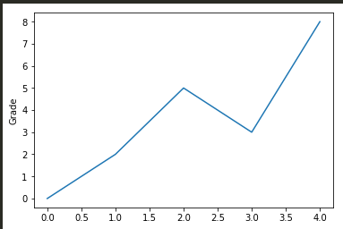

### 图像的数组表示
图像的RGB色彩模式  
RGB三个颜色通道的变化和叠加得到各种颜色，其中  
*R红色，取值范围，0-255  
*G绿色，取值范围，0-255  
*B蓝色，取值范围，0-255  
RGB形成的颜色包括了人类视力感知的所有颜色   
PIL库，Python Image Library   
PIL库是一个具有强大图像处理能力的第三方库  
`from PIL import Image `   
Image 是PIL库中代表一个图像的类（对象）  
图像是一个由像素组成的二维矩阵，每个元素是一个RGB值  
```python
In [61]: from PIL import Image

In [62]: import numpy as np

In [63]: im = np.array(Image.open("/home/liu/Pictures/Wallpapers/1.jpg"))

In [64]: print(im.shape,im.dtype)
(853, 1280, 3) uint8 
```
图像是一个三维数组  

图像变换  
读入图像后，获得像素RGB值，修改后保存为新的文件  
```python
In [66]: from PIL import Image

In [67]: import numpy as np

In [68]: a = np.array(Image.open("/home/liu/Pictures/Wallpapers/1.jpg"))

In [69]: print(a.shape,a.dtype)
(853, 1280, 3) uint8

In [70]: b = [255, 255, 255] -a

In [71]: im = Image.fromarray(b.astype('uint8'))

In [72]: im.save("/home/liu/Pictures/Wallpapers/2.jpg")

In [73]: c = np.array(Image.open("/home/liu/Pictures/Wallpapers/1.jpg").convert('L'))

In [74]: d = 255 - c

In [75]: ip = Image.fromarray(d.astype('uint8'))

In [76]: ip.save("/home/liu/Pictures/Wallpapers/3.jpg")

In [77]: e = (100/255)*c + 150 #区间变换

In [80]: it = Image.fromarray(e.astype('uint8'))

In [81]: it.save("/home/liu/Pictures/Wallpapers/4.jpg")

In [82]: f = 255*(a/255)**2

In [83]: im = Image.fromarray(f.astype('uint8'))

In [84]: im.save("/home/liu/Pictures/Wallpapers/5.jpg")
 
```
“图像的手绘效果”实例分析  


手绘效果的几个特征：  
*黑白灰色  


*边界线条较重  
*相同或相近色彩趋于白色  
*略有光源效果  

```
In [1]: from PIL import Image

In [2]: import numpy as np

In [3]: a = np.array(Image.open('/home/liu/Pictures/Wallpapers/1.jpg').convert('L')).astype('float')

In [4]: depth = 10.              #(0-100)

In [5]: grad = np.gradient(a)    #取图像灰度的梯度值
                                 
In [6]: grad_x, grad_y = grad    #分别取横纵图像梯度值

In [7]: grad_x = grad_x*depth/100.  #利用深度值*梯度值来添加深度值对梯度值的影响因素，然后/100进行归一化处理

In [8]: grad_y = grad_y*depth/100.

In [9]: A = np.sqrt(grad_x**2 + grad_y**2 + 1.) #构造x和y轴梯度的三维归一化单位坐标系

In [10]: uni_x = grad_x/A                       

In [11]: uni_y = grad_y/A

In [12]: uni_z = 1./A

In [13]: vec_e1 = np.pi/2.2                  #光源的俯视角度，弧度值
                     
In [14]: vec_az = np.pi/4                    #光源的方位角度，弧度值

In [15]: dx = np.cos(vec_e1)*np.cos(vec_az)  #光源对x轴的影响

In [16]: dy = np.cos(vec_e1)*np.sin(vec_az)  #光源对y轴的影响

In [17]: dz = np.sin(vec_e1)                 #光源对z轴的影响

In [19]: b = 255*(dx*uni_x + dy*uni_y + dz*uni_z)   #梯度和光源相互作用，将梯度转化为灰度，光源归一化

In [20]: b.clip(0,255)  #为避免数据越界，将生成的灰度值裁剪至0-255区间
Out[20]: 
array([[253.70520777, 252.40446768, 250.80809797, ..., 252.40446768,
        252.40446768, 252.40446768],
       [253.70520777, 252.40446768, 250.80809797, ..., 252.40446768,
        252.40446768, 252.40446768],
       [253.70520777, 252.40446768, 252.40446768, ..., 251.77581299,
        252.40446768, 252.40446768],
       ...,
       [250.97588848, 249.66293851, 250.80809797, ..., 252.40446768,
        252.40446768, 252.40446768],
       [252.11668729, 251.84198642, 251.77581299, ..., 252.40446768,
        252.40446768, 252.40446768],
       [248.82580592, 253.41853376, 249.5664661 , ..., 252.40446768,
        252.40446768, 252.40446768]])

In [21]: im = Image.fromarray(b.astype('uint8'))       #重构图像

In [22]: im.save('/home/liu/Pictures/Wallpapers/hand.jpg')
```


### Matplotlib库的介绍
python是优秀的数据可视化第三方库  
Matolotlib库由各种可视化类构成，内部结构复杂，受Matlab的启发  
matplotlib.pyplot是绘制各类可视化图形的命令子库，相当于快捷方式。  
import matplotlib.pyplot as plt(引入模块的别名)  

```
import  matplotlib.pyplot  as plt
plt.plot([0,2,5,3,8])
plt.ylabel("Grade")
plt.savefig('test', dpi=600)  #png
plt.show() 
```


`plt.savefig()`将输出图形存储为文件，默认为PNG格式，可以通过dpi修改输出质量  

```
import  matplotlib.pyplot  as plt
plt.plot([0,2,5,3,8], [3,1,4,5,2])
plt.ylabel("Grade")
plt.axis([-1, 10, 0, 6])
plt.show() 
```

plt.plot(x,y)当有两个以上的参数时，按照x轴和y轴的顺序绘制数据点  
pyplot的绘图区域  
`plt.subplot(nrows,ncols,plot_number)  `  
`plt.subplot(3,2,4)  `  

在全局绘图区域中创立一个分区体系，并定位到一个子绘图区域  

```
import numpy as np 
import matplotlib.pyplot as plt 

def f(t):
    return np.exp(-t) * np.cos(2*np.pi*t)
a = np.arange(0.0, 5.0, 0.02)
plt.subplot(211)
plt.plot(a, f(a))

plt.subplot(212)
plt.plot(a, np.cos(2*np.pi*2),  'r--')
plt.show()
```
plt.plot(x, y, format_string, **kwargs)  
x:  X轴数据， 列表或数组，可选  
y:  Y轴数据， 列表或数组。  
format_string:  控制曲线的格式字符串，可选  
**kwargs:  第二组或更多（x, y, format_string）  
当绘制多条曲线时，各条曲线的x不能省略  
```
import numpy as np 
import matplotlib.pyplot as plt 

a = np.arange(10)
plt.plot(a,   a*1.5,    a,    a*2.5,   a,   a*3.5 ,   a,     a*4.5 )
plt.show() 
```


format_string:  控制曲线的格式字符串，可选由颜色字符、风格字符和标记字符组成


```
import numpy as np 
import matplotlib.pyplot as plt 

a = np.arange(10)
plt.plot(a,   a*1.5,    'go-' ,   a,    a*2.5,   'rx',   a,   a*3.5 ,  ' * ',    a,     a*4.5 ,  'b-.' )
plt.show() 
```


pyplot的中文显示方法  
pyplot并不支持中文显示，需要rcParams修改字体实现  

```
import matplotlib.pyplot as plt
import matplotlib

matplotlib.rcParams['font.family']='SimHei' #SinHei是黑体
plt.plot([3,1,4,5,2])
plt.ylabel("纵轴（值）")
plt.savefig('test',dpi=600)
plt.show() 
```


```
import  numpy as np 
import  matplotlib.pyplot as plt 
import  matplotlib
matplotlib.rcParams['font.family']='STSong'
matplotlib.rcParams['font.size'] = 20
a = np.arange(0.0,  5.0,  0.02)
plt.xlabel('横轴：时间')
plt.ylabel('纵轴：振幅')
plt.plot(a, np.cos(2*np.pi*a),   'r--')
plt.show() 
```
第二种方法，在有中文输出的地方，增加一个属性：fontproperties(建议使用)  
```
import  numpy as np 
import  matplotlib.pyplot as plt 

a = np.arange(0.0,  5.0,  0.02)

plt.xlabel('横轴：时间',  fontproperties = 'SimHei', fontsize=20)
plt.ylabel('纵轴：振幅' , fontproperties = 'SimHei', fontsize=20)
plt.plot(a, np.cos(2*np.pi*a),   'r--)
plt.show() 
```
pyplot的文本显示函数  


```
import  numpy as np 
import  matplotlib.pyplot as plt 

a = np.arange(0.0,  5.0,  0.02)
plt.plot(a, np.cos(2*np.pi*a),   'r--')

plt.xlabel('1',  fontproperties = 'SimHei', fontsize=15, color='green')
plt.ylabel('2' , fontproperties = 'SimHei', fontsize=20)
plt.title('shili  $y=cos(2\pi  x)$', fontproperties= 'SimHei', fontsize=25)
plt.text(2, 1, r'$\mu=100$', fontsize=15)
plt.axis([-1, 6, -2, 2])
plt.grid(True)
plt.show() 
```

 ```
import  numpy as np 
import  matplotlib.pyplot as plt 

a = np.arange(0.0,  5.0,  0.02)
plt.plot(a, np.cos(2*np.pi*a),   'r--')

plt.xlabel('1',  fontproperties = 'SimHei', fontsize=15, color='green')
plt.ylabel('2' , fontproperties = 'SimHei', fontsize=20)
plt.title('shili  $y=cos(2\pi  x)$', fontproperties= 'SimHei', fontsize=25)
plt.annotate( r'$\mu=100$', xy=(2,1),  xytext=(3,1.5), arrowprops= dict(facecolor = 'black', shrink = 0.1, width = 2)) #shrink 使箭头在两端留出空白

plt.axis([-1, 6, -2, 2])
plt.grid(True)
plt.show()
 ```

绘图子区域分割   
`plt.subplot2grid()`  
`plt.subplot2grid(GridSpec, CurSpec, colspan=1, rowspan=1)`  
理念，设定网格，选中网格，确定选中行列区域数量  

GridSpec

```
import matplotlib.gridspec as gridspec
gs = gridspec.GeidSpec(3.3)

ax1 = plt.subplot(gs[0, :])
ax2 = plt.subplot(gs[1, : -1])
ax3 = plt.dubplot(gs[1:, -1])
ax4 = plt.subplot(gs[2, 0])
ax5 = plt.subplot(gs[2, 1])
```
Matplotlib基础绘图函数实例   


饼图的函数  

```
import matplotlib.pyplot as plt

labels = 'Frogs', 'Hogs', 'Dogs', 'Logs'
sizes = [15, 30, 45, 10]
explode = (0, 0.1, 0, 0)
plt.pie(sizes,explode=explode, labels=labels, autopct  = '%1.1f%%', shadow=False, startangle=90)
plt.axis('equal') #显示为正方
plt.show() 
```

pyplot的直方图绘制
`......`
