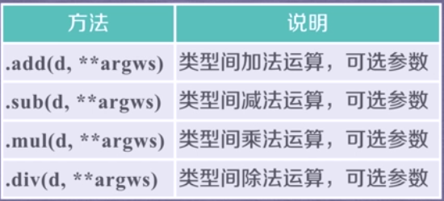
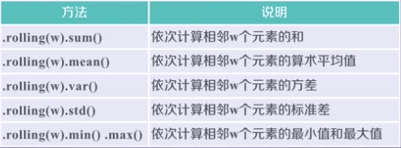

### Pandas 库的引用
Pandas是Python第三方库，提供高性能易用数据类型和分析工具。  
`import pandas as pd`  
Pandas 基于Numpy实现，常与Numpy和Matplotlib一同使用  
两个数据类型：Series, DataFrame  
基于上述数据类型的各类操作  
基本操作、运算操作、特征类操作、关联类操作  
NumPy               Pandas    
基础数据类型          扩展数据类型   
关注数据的结构表达     关注数据的应用表达    
维度：数据间关系       数据与索引间关系   

Pandas库中的Series类型,由一组数据与之相关的数据索引组成  
index_0 --->data_a  
index_1 --->data_b  
index_2 --->data_c  
index_3 --->data_d  
```
In [1]: import pandas as pd

In [2]: a = pd.Series([9, 8, 7, 6])

In [3]: a
Out[3]: 
0    9
1    8
2    7
3    6
dtype: int64
In [4]: a = pd.Series([9, 8, 7, 6], index=["a", "b", "c", "d"]) 

In [5]: a
Out[5]: 
a    9
b    8
c    7
d    6
dtype: int64
```
从标量值创建  
```
In [7]: import pandas as pd

In [8]: s = pd.Series(25, index=['a','b','c'])

In [9]: s
Out[9]: 
a    25
b    25
c    25
dtype: int64   
```
从字典类型创建   
```
In [10]: d = pd.Series({'a':9, 'b':8, 'c':7})

In [11]: d
Out[11]: 
a    9
b    8
c    7
dtype: int64

In [12]: e = pd.Series({'a':9, 'b':8, 'c':7}, index=['c', 'a', 'b', 'd']) #index从字典中进行选择操作

In [13]: e
Out[13]: 
c    7.0
a    9.0
b    8.0
d    NaN
dtype: float64     
```
从ndarray类型创建  
```
In [14]: import pandas as pd

In [15]: import numpy as np

In [16]: n = pd.Series(np.arange(5))

In [17]: n
Out[17]: 
0    0
1    1
2    2
3    3
4    4
dtype: int64
```
Series类型的基本操作  
```
In [19]: a
Out[19]: 
a    9
b    8
c    7
d    6
dtype: int64

In [20]: b.index
In [21]: a.index
Out[21]: Index(['a', 'b', 'c', 'd'], dtype='object')            #.index 获得索引/.valus获得数据
In [22]: a.values
Out[22]: array([9, 8, 7, 6])
```
```
In [27]: b = pd.Series([8,9,7,6], index=['a', 'b', 'c', 'd'])

In [28]: b
Out[28]: 
a    8
b    9
c    7
d    6
dtype: int64

In [29]: b['b']         #自动索引和自定义索引并存
Out[29]: 9

In [30]: b[1]
Out[30]: 9

In [31]: b[['c', 'd', 0]]        #两套索引并存，但不能混合使用
Out[31]: 
c    7.0
d    6.0
0    NaN
dtype: float64

In [32]: b[['c', 'd', 'a']]   
Out[32]: 
c    7
d    6
a    8
dtype: int64   
```
Series类型的操作类似于ndarray类型  
索引方法相同，采用[]  
NumPy中运算和操作可用于Series类型  
可以通过自定义索引的列表进行切片   
可以通过自动索引进行切片，如果含有自定义索引，它们也会被保留下来  
```
In [34]: import pandas as pd

In [35]: import numpy as np

In [36]: b = pd.Series([9,8,7,6], ['a','b','c','d'])

In [37]: b
Out[37]: 
a    9
b    8
c    7
d    6
dtype: int64

In [38]: b[3]
Out[38]: 6

In [39]: b[:3]
Out[39]: 
a    9
b    8
c    7
dtype: int64

In [41]: b[b > b.median()]
Out[41]: 
a    9
b    8
dtype: int64

In [42]: np.exp(b)
Out[42]: 
a    8103.083928
b    2980.957987
c    1096.633158
d     403.428793
dtype: float64

In [43]: 'c' in b
Out[43]: True

In [44]: 0 in b           #in判断自定义索引在不在
Out[44]: False

In [45]: b.get('f', 100)  #从b中提取f的值并返回，但f中为空，第二个参数100,所以返回了100
Out[45]: 100

#Series + Series
In [47]: import pandas as pd

In [48]: a = pd.Series([1,2,3], ['c', 'd', 'e'])

In [49]: b = pd.Series([9,8,7,6],['a', 'b', 'c', 'd'])

In [50]: a + b 
Out[50]: 
a    NaN
b    NaN
c    8.0
d    8.0
e    NaN
dtype: float64 
```
Series类型在运算中会自动对齐不同索引的数据  
Series对象和索引都可以有一个名字，存储在属性.name中  
Series对象可以随时修改并立刻生效  
```
In [53]: import pandas as pd

In [54]: b = pd.Series([9,8,7,6],['a','b','c','d'])

In [55]: b['a']
Out[55]: 9

In [56]: b['a'] = 15

In [57]: b.name = "Series"

In [58]: b
Out[58]: 
a    15
b     8
c     7
d     6
Name: Series, dtype: int64

In [59]: b['a', 'c'] = 20

In [60]: b
Out[60]: 
a    20
b     8
c    20
d     6
Name: Series, dtype: int64 
```

Pandas库的DataFrame类型  
DataFrame类型由共同相同索引的一组列组成  
index_0 --->data_a     data_1            data_w  
index_1 --->data_b     data_2     ....   data_x  
index_2 --->data_c     data_3            data_y  
index_3 --->data_d     data_4            data_z  
DataFrame是一个表格型的数据类型，每列值类型可以不同  
DataFrame既有行索引、也有列索引  
DataFrame常用于表达二维数据，但可以表达多维数据  
可以由：  
* 二维ndarray对象  
* 由一维ndarray、列表、字典、元组或者Series构成的字典  
* Series类型  
* 其他的DaraFrame类型 

#### Pandas库的DataFrame类型
DataFrame类型由共同相同索引的一组列组成
index_0 --->data_a     data_1            data_w
index_1 --->data_b     data_2     ....   data_x
index_2 --->data_c     data_3            data_y
index_3 --->data_d     data_4            data_z
DataFrame是一个表格型的数据类型，每列值类型可以不同
DataFrame既有行索引、也有列索引
DataFrame常用于表达二维数据，但可以表达多维数据
可以由：
*二维ndarray对象
*由一维ndarray、列表、字典、元组或者Series构成的字典
*Series类型
*其他的DaraFrame类型

二维ndarray对象创建
```
In [62]: import pandas as pd

In [63]: import numpy as np

In [64]: d = pd.DataFrame(np.arange(10).reshape(2,5))

In [65]: d
Out[65]: 
   0  1  2  3  4
0  0  1  2  3  4
1  5  6  7  8  9

In [66]:
```
从一维ndarray对象字典创建  
```
In [67]: dt = {'one': pd.Series([1, 2 ,3], index=['a', 'b', 'c']), 'two':pd.Series
    ...: ([9,8,7,6], index=['a', 'b', 'c', 'd'])}

In [68]: d = pd.DataFrame(dt)

In [69]: d
Out[69]: 
   one  two
a  1.0    9
b  2.0    8
c  3.0    7
d  NaN    6

In [70]: d = pd.DataFrame(dt, index=['b', 'c', 'd'], columns=['two', 'three'])

In [71]: d
Out[71]: 
   two three
b    8   NaN
c    7   NaN
d    6   NaN 
```
从列表类型的字典创建  
```
In [73]: dl = {'one': [1,2,3,4], 'two':['a', 'b', 'c', 'd']}
In [75]: d = pd.DataFrame(dl, index = ['a', 'b', 'c', 'd'])

In [76]: d
Out[76]: 
   one two
a    1   a
b    2   b
c    3   c
d    4   d

In [77]: 
```

如何改变Series和DataFrame对象？  
增加或重排：重新索引  .reindex()能够改变或重排Series和DataFrame索引  

 


Series 和DataFrame的索引是Index类型  
Index对象是不可修改类型  


使用.drop()能够删除Series和DataFrame指定行或列索引  


#### Pandas库的算术运算法则
算术运算根据行列索引，补齐后运算，运算默认产生浮点数  
补齐时缺项填充NaN（空值）  
二维和一维、一维和零维间为广播运算  
采用+-*/符号进行的二元运算产生新的对象  
```
In [78]: import pandas as pd

In [79]: import numpy as np

In [80]: a = pd.DataFrame(np.arange(12).reshape(3,4))

In [81]: a
Out[81]: 
   0  1   2   3
0  0  1   2   3
1  4  5   6   7
2  8  9  10  11

In [82]: b = pd.DataFrame(np.arange(20).reshape(4,5))

In [83]: b
Out[83]: 
    0   1   2   3   4
0   0   1   2   3   4
1   5   6   7   8   9
2  10  11  12  13  14
3  15  16  17  18  19

In [84]: a + b 
Out[84]: 
      0     1     2     3   4
0   0.0   2.0   4.0   6.0 NaN
1   9.0  11.0  13.0  15.0 NaN
2  18.0  20.0  22.0  24.0 NaN
3   NaN   NaN   NaN   NaN NaN

In [85]: a * b
Out[85]: 
      0     1      2      3   4
0   0.0   1.0    4.0    9.0 NaN
1  20.0  30.0   42.0   56.0 NaN
2  80.0  99.0  120.0  143.0 NaN
3   NaN   NaN    NaN    NaN NaN
```

```
In [86]: b.add(a, fill_value = 100)
Out[86]: 
       0      1      2      3      4
0    0.0    2.0    4.0    6.0  104.0
1    9.0   11.0   13.0   15.0  109.0
2   18.0   20.0   22.0   24.0  114.0
3  115.0  116.0  117.0  118.0  119.0

In [87]: b.mul(a, fill_value = 0)
Out[87]: 
      0     1      2      3    4
0   0.0   1.0    4.0    9.0  0.0
1  20.0  30.0   42.0   56.0  0.0
2  80.0  99.0  120.0  143.0  0.0
3   0.0   0.0    0.0    0.0  0.0 
```
fill_value 参数代替NaN，代替后参与运算  
```
In [88]: b
Out[88]: 
    0   1   2   3   4
0   0   1   2   3   4
1   5   6   7   8   9
2  10  11  12  13  14
3  15  16  17  18  19

In [89]: c = pd.Series(np.arange(4))

In [90]: c
Out[90]: 
0    0
1    1
2    2
3    3
dtype: int64

In [91]: c -10
Out[91]: 
0   -10
1    -9
2    -8
3    -7
dtype: int64

In [92]: b - c
Out[92]: 
      0     1     2     3   4
0   0.0   0.0   0.0   0.0 NaN
1   5.0   5.0   5.0   5.0 NaN
2  10.0  10.0  10.0  10.0 NaN
3  15.0  15.0  15.0  15.0 NaN
```
不同维度间为广播运算，一维Series默认在轴1参与运算  
比较运算  
同维度运算，尺寸一致  
不同维度运算为广播运算，运算在轴1  
Python 数据特征的提取  
 Pandas库的数据排序  
`.sort_index()方法在指定轴上根据索引进行排序，默认升序`   
`.sort_index(axis=,ascending=True)`  

```
In [94]: import pandas as pd

In [95]: import numpy as np

In [96]: b = pd.DataFrame(np.arange(20).reshape(4,5),index=['c', 'a', 'd', 'b'])

In [97]: b
Out[97]: 
    0   1   2   3   4
c   0   1   2   3   4
a   5   6   7   8   9
d  10  11  12  13  14
b  15  16  17  18  19

In [99]: b.sort_index()
Out[99]: 
    0   1   2   3   4
a   5   6   7   8   9
b  15  16  17  18  19
c   0   1   2   3   4
d  10  11  12  13  14

In [100]: b.sort_index(ascending=True)
Out[100]: 
    0   1   2   3   4
a   5   6   7   8   9
b  15  16  17  18  19
c   0   1   2   3   4
d  10  11  12  13  14

In [101]: b.sort_index(ascending=False)
Out[101]: 
    0   1   2   3   4
d  10  11  12  13  14
c   0   1   2   3   4
b  15  16  17  18  19
a   5   6   7   8   9

In [102]: b.sort_index(axis=1, ascending=False)
Out[102]: 
    4   3   2   1   0
c   4   3   2   1   0
a   9   8   7   6   5
d  14  13  12  11  10
b  19  18  17  16  15 
```
` .sort_value()`方法在指定轴上根据数值进行排序，默认升序  
`Series.sort_values(axis=0, ascending=True) ` 
`DataFrame.sort_values(by, axis = 0, ascending=True) ` 
by : axis轴上某个索引或者索引列表  

```
In [105]: c = b.sort_values(2, ascending=False)

In [106]: c
Out[106]: 
    0   1   2   3   4
b  15  16  17  18  19
d  10  11  12  13  14
a   5   6   7   8   9
c   0   1   2   3   4

In [107]: c = b.sort_values('a', axis=1, ascending=False)

In [108]: c
Out[108]: 
    4   3   2   1   0
c   4   3   2   1   0
a   9   8   7   6   5
d  14  13  12  11  10
b  19  18  17  16  15 
```
NaN统一放到末尾  

#### Pandas基本分析函数  
适用于Series和DataFrame类型    


```
In [109]: c =pd.Series([8, 9, 7, 6], index=['a', 'b', 'c', 'd'])

In [110]: c
Out[110]: 
a    8
b    9
c    7
d    6
dtype: int64

In [111]: c.describe()
Out[111]: 
count    4.000000
mean     7.500000
std      1.290994
min      6.000000
25%      6.750000
50%      7.500000
75%      8.250000
max      9.000000
dtype: float64 
```
只适用于Series类型


数据的累计统计分析  
适用于Series和DataFrame类型  


```
 In [1]: import pandas as pd

In [2]: import numpy as np

In [3]: b = pd.DataFrame(np.arange(20).reshape(4,5),index=['c','a','d','b'])

In [4]: b
Out[4]: 
    0   1   2   3   4
c   0   1   2   3   4
a   5   6   7   8   9
d  10  11  12  13  14
b  15  16  17  18  19

In [5]: b.cumsum()
Out[5]: 
    0   1   2   3   4
c   0   1   2   3   4
a   5   7   9  11  13
d  15  18  21  24  27
b  30  34  38  42  46

In [6]: b.cumprod()
Out[6]: 
   0     1     2     3     4
c  0     1     2     3     4
a  0     6    14    24    36
d  0    66   168   312   504
b  0  1056  2856  5616  9576

In [7]: b.cummin()
Out[7]: 
   0  1  2  3  4
c  0  1  2  3  4
a  0  1  2  3  4
d  0  1  2  3  4
b  0  1  2  3  4

In [8]: b.cummax()
Out[8]: 
    0   1   2   3   4
c   0   1   2   3   4
a   5   6   7   8   9
d  10  11  12  13  14
b  15  16  17  18  19    
```
适用于Series和DataFrame类型，滚动计算（窗口计算）  


```
 In [10]: import pandas as pd

In [11]: import numpy as np

In [12]: b = pd.DataFrame(np.arange(20).reshape(4,5),index=['c', 'a', 'd', 'b'])

In [13]: b
Out[13]: 
    0   1   2   3   4
c   0   1   2   3   4
a   5   6   7   8   9
d  10  11  12  13  14
b  15  16  17  18  19

In [14]: b.rolling(2).sum()
Out[14]: 
      0     1     2     3     4
c   NaN   NaN   NaN   NaN   NaN
a   5.0   7.0   9.0  11.0  13.0
d  15.0  17.0  19.0  21.0  23.0
b  25.0  27.0  29.0  31.0  33.0

In [15]: b.rolling(3).sum()
Out[15]: 
      0     1     2     3     4
c   NaN   NaN   NaN   NaN   NaN
a   NaN   NaN   NaN   NaN   NaN
d  15.0  18.0  21.0  24.0  27.0
b  30.0  33.0  36.0  39.0  42.0 
```

#### 数据的相关分析
两个事物，表示为X和Y，如何判断它们之间的相关性？  
* X增大，Y增大，两个变量正相关  
* X增大，Y减小，两个变量负相关  
* X增大，Y无视，两个变量不相关  
斜方差  
两个事物，表示为X和Y  

Pearson相关系数  


```
In [17]: hprice = pd.Series([3.04,22.93,12.75,22.6,12.33], index = ['2008','2009',
    ...: '2010', '2011', '2012'])

In [18]: m2 = pd.Series([8.18,18.38,9.13,7.82,6.69], index=['2008','2009', '2010',
    ...: '2011', '2012'])


In [20]: hprice.corr(m2)
Out[20]: 0.5239439145220387
```