# 基础的数据处理

## 出租车数据的基础处理,由gps生成OD(交通出行量)

### 读取租车数据


```python
import pandas as pd #读取数据
data = pd.read_csv('/home/liu/Documents/pygeo-tutorial/data-sample/TaxiData-Sample',header = None)
#对于一个没有字段名标题的数据,默认情况下会把数据第一行默认为字段名标题,为了解决这个问题，
#添加“header=None”，告诉函数，读取的原始文件数据没有列索引。因此，read_csv为自动加上列索引
data.columns = ['VehicleNum','Stime','Lng','Lat','OpenStatus','Speed']
```


```python
#显示数据前5行
data.head(5)
```


<table border="1" class="dataframe">
  <thead>
    <tr style="text-align: right;">
      <th></th>
      <th>VehicleNum</th>
      <th>Stime</th>
      <th>Lng</th>
      <th>Lat</th>
      <th>OpenStatus</th>
      <th>Speed</th>
    </tr>
  </thead>
  <tbody>
    <tr>
      <th>0</th>
      <td>22271</td>
      <td>22:54:04</td>
      <td>114.167000</td>
      <td>22.718399</td>
      <td>0</td>
      <td>0</td>
    </tr>
    <tr>
      <th>1</th>
      <td>22271</td>
      <td>18:26:26</td>
      <td>114.190598</td>
      <td>22.647800</td>
      <td>0</td>
      <td>4</td>
    </tr>
    <tr>
      <th>2</th>
      <td>22271</td>
      <td>18:35:18</td>
      <td>114.201401</td>
      <td>22.649700</td>
      <td>0</td>
      <td>0</td>
    </tr>
    <tr>
      <th>3</th>
      <td>22271</td>
      <td>16:02:46</td>
      <td>114.233498</td>
      <td>22.725901</td>
      <td>0</td>
      <td>24</td>
    </tr>
    <tr>
      <th>4</th>
      <td>22271</td>
      <td>21:41:17</td>
      <td>114.233597</td>
      <td>22.720900</td>
      <td>0</td>
      <td>19</td>
    </tr>
  </tbody>
</table>

* VehicleNum----车牌  
* Stime----时间  
* Lng----经度  
* Lat----纬度  
* OpenStatus----是否有乘客(0没乘客,1有乘客)  
* Speed----速度  

### 基础的数据操作
读取数据时读进来的是DataFrame格式的数据表,而一个DataFrame中的每一列,则为一个Series.


```python
type(data)
```


    pandas.core.frame.DataFrame

取DataFrame的某一列


```python
type(data['Lng'])
```


    pandas.core.series.Series

如果取某一列或者某几列,想得到的是DataFrame


```python
type(data[['Lng','Lat']])
```


    pandas.core.frame.DataFrame

### 数据的筛选
在筛选数据的时候,一般用`data[条件]`的格式  
其中的条件,是对data每一行数据的true和false布尔变量的Series  

例如想得到车牌号为22271的所有数据  
首先我们要获得一个布尔变量的Series,这个Series对应的是data的每一行.


```python
(data['VehicleNum']==22271).head(5)
```


    0    True
    1    True
    2    True
    3    True
    4    True
    Name: VehicleNum, dtype: bool


```python
#得到车牌照为22271的所有数据
data[data['VehicleNum']==22271].head(5)
```

</style>
<table border="1" class="dataframe">
  <thead>
    <tr style="text-align: right;">
      <th></th>
      <th>VehicleNum</th>
      <th>Stime</th>
      <th>Lng</th>
      <th>Lat</th>
      <th>OpenStatus</th>
      <th>Speed</th>
    </tr>
  </thead>
  <tbody>
    <tr>
      <th>0</th>
      <td>22271</td>
      <td>22:54:04</td>
      <td>114.167000</td>
      <td>22.718399</td>
      <td>0</td>
      <td>0</td>
    </tr>
    <tr>
      <th>1</th>
      <td>22271</td>
      <td>18:26:26</td>
      <td>114.190598</td>
      <td>22.647800</td>
      <td>0</td>
      <td>4</td>
    </tr>
    <tr>
      <th>2</th>
      <td>22271</td>
      <td>18:35:18</td>
      <td>114.201401</td>
      <td>22.649700</td>
      <td>0</td>
      <td>0</td>
    </tr>
    <tr>
      <th>3</th>
      <td>22271</td>
      <td>16:02:46</td>
      <td>114.233498</td>
      <td>22.725901</td>
      <td>0</td>
      <td>24</td>
    </tr>
    <tr>
      <th>4</th>
      <td>22271</td>
      <td>21:41:17</td>
      <td>114.233597</td>
      <td>22.720900</td>
      <td>0</td>
      <td>19</td>
    </tr>
  </tbody>
</table>
</div>


如果我们想对data删去所有牌照为22271的数据  
>data[-(条件)]


```python
#删除车牌照为22271的所有数据
data[-(data['VehicleNum']==22271)].head(5)
```

</style>
<table border="1" class="dataframe">
  <thead>
    <tr style="text-align: right;">
      <th></th>
      <th>VehicleNum</th>
      <th>Stime</th>
      <th>Lng</th>
      <th>Lat</th>
      <th>OpenStatus</th>
      <th>Speed</th>
    </tr>
  </thead>
  <tbody>
    <tr>
      <th>1437</th>
      <td>35807</td>
      <td>01:53:46</td>
      <td>113.809898</td>
      <td>22.626801</td>
      <td>0</td>
      <td>0</td>
    </tr>
    <tr>
      <th>1438</th>
      <td>35807</td>
      <td>01:43:46</td>
      <td>113.813301</td>
      <td>22.623600</td>
      <td>0</td>
      <td>0</td>
    </tr>
    <tr>
      <th>1439</th>
      <td>35807</td>
      <td>01:14:15</td>
      <td>113.847000</td>
      <td>22.594700</td>
      <td>0</td>
      <td>41</td>
    </tr>
    <tr>
      <th>1440</th>
      <td>35807</td>
      <td>02:01:41</td>
      <td>113.852501</td>
      <td>22.625700</td>
      <td>0</td>
      <td>22</td>
    </tr>
    <tr>
      <th>1441</th>
      <td>35807</td>
      <td>01:01:59</td>
      <td>113.897003</td>
      <td>22.551901</td>
      <td>0</td>
      <td>42</td>
    </tr>
  </tbody>
</table>
</div>

### 获取/删除/定义DataFrame的某一列
获取列不会影响到data,在操作后将得到的表重新赋值给data才有影响


```python
data[['Stime']].head(5)
```

</style>
<table border="1" class="dataframe">
  <thead>
    <tr style="text-align: right;">
      <th></th>
      <th>Stime</th>
    </tr>
  </thead>
  <tbody>
    <tr>
      <th>0</th>
      <td>22:54:04</td>
    </tr>
    <tr>
      <th>1</th>
      <td>18:26:26</td>
    </tr>
    <tr>
      <th>2</th>
      <td>18:35:18</td>
    </tr>
    <tr>
      <th>3</th>
      <td>16:02:46</td>
    </tr>
    <tr>
      <th>4</th>
      <td>21:41:17</td>
    </tr>
  </tbody>
</table>
</div>


```python
#定义列'Speed1'为Speed列的两倍,注意,此操作会影响到data
data['Speed1']=data['Speed']*2
#或者
data.loc[:,'Speed1'] = data['Speed']*2  #loc函数主要通过行标签索引行数据,loc[]算是前闭加后闭,索引某一列数据loc[:,'a']
#iloc 主要是通过行号获取行数据,iloc[0:1]是前闭后开的
data.head(5)
```


</style>
<table border="1" class="dataframe">
  <thead>
    <tr style="text-align: right;">
      <th></th>
      <th>VehicleNum</th>
      <th>Stime</th>
      <th>Lng</th>
      <th>Lat</th>
      <th>OpenStatus</th>
      <th>Speed</th>
      <th>Speed1</th>
    </tr>
  </thead>
  <tbody>
    <tr>
      <th>0</th>
      <td>22271</td>
      <td>22:54:04</td>
      <td>114.167000</td>
      <td>22.718399</td>
      <td>0</td>
      <td>0</td>
      <td>0</td>
    </tr>
    <tr>
      <th>1</th>
      <td>22271</td>
      <td>18:26:26</td>
      <td>114.190598</td>
      <td>22.647800</td>
      <td>0</td>
      <td>4</td>
      <td>8</td>
    </tr>
    <tr>
      <th>2</th>
      <td>22271</td>
      <td>18:35:18</td>
      <td>114.201401</td>
      <td>22.649700</td>
      <td>0</td>
      <td>0</td>
      <td>0</td>
    </tr>
    <tr>
      <th>3</th>
      <td>22271</td>
      <td>16:02:46</td>
      <td>114.233498</td>
      <td>22.725901</td>
      <td>0</td>
      <td>24</td>
      <td>48</td>
    </tr>
    <tr>
      <th>4</th>
      <td>22271</td>
      <td>21:41:17</td>
      <td>114.233597</td>
      <td>22.720900</td>
      <td>0</td>
      <td>19</td>
      <td>38</td>
    </tr>
  </tbody>
</table>
</div>


```python
#删除列'Stime'操作不会影响到data,在操作后必须将得到的表重新赋值给data才有影响  
data.drop(['Stime'],axis=1).head(5)
```

</style>
<table border="1" class="dataframe">
  <thead>
    <tr style="text-align: right;">
      <th></th>
      <th>VehicleNum</th>
      <th>Lng</th>
      <th>Lat</th>
      <th>OpenStatus</th>
      <th>Speed</th>
      <th>Speed1</th>
    </tr>
  </thead>
  <tbody>
    <tr>
      <th>0</th>
      <td>22271</td>
      <td>114.167000</td>
      <td>22.718399</td>
      <td>0</td>
      <td>0</td>
      <td>0</td>
    </tr>
    <tr>
      <th>1</th>
      <td>22271</td>
      <td>114.190598</td>
      <td>22.647800</td>
      <td>0</td>
      <td>4</td>
      <td>8</td>
    </tr>
    <tr>
      <th>2</th>
      <td>22271</td>
      <td>114.201401</td>
      <td>22.649700</td>
      <td>0</td>
      <td>0</td>
      <td>0</td>
    </tr>
    <tr>
      <th>3</th>
      <td>22271</td>
      <td>114.233498</td>
      <td>22.725901</td>
      <td>0</td>
      <td>24</td>
      <td>48</td>
    </tr>
    <tr>
      <th>4</th>
      <td>22271</td>
      <td>114.233597</td>
      <td>22.720900</td>
      <td>0</td>
      <td>19</td>
      <td>38</td>
    </tr>
  </tbody>
</table>
</div>

### 获取某一列某一行的数据
在获取某行某列的数据时,记得一定要用iloc(按表目前排列的顺序取),不能用loc(按index取)  
因为在做完筛选\排序等操作,表就不是按index来排列.


```python
#获取Stime列的第4行数据
data['Stime'].loc[3]
```


    '16:02:46'

## 数据清洗
首先,将数据按车牌,时间排序,特别要注意,data排序后需要再赋值给data,否则没有作用


```python
data = data.sort_values(by = ['VehicleNum','Stime'])
#by:指定列名(axis=0或’index’)或索引值(axis=1或’columns’)ascending:是否按指定列的数组升序排列，默认为True，即升序排列
data.head(5)
```

</style>
<table border="1" class="dataframe">
  <thead>
    <tr style="text-align: right;">
      <th></th>
      <th>VehicleNum</th>
      <th>Stime</th>
      <th>Lng</th>
      <th>Lat</th>
      <th>OpenStatus</th>
      <th>Speed</th>
      <th>Speed1</th>
    </tr>
  </thead>
  <tbody>
    <tr>
      <th>39</th>
      <td>22271</td>
      <td>00:00:49</td>
      <td>114.266502</td>
      <td>22.728201</td>
      <td>0</td>
      <td>0</td>
      <td>0</td>
    </tr>
    <tr>
      <th>397</th>
      <td>22271</td>
      <td>00:01:48</td>
      <td>114.266502</td>
      <td>22.728201</td>
      <td>0</td>
      <td>0</td>
      <td>0</td>
    </tr>
    <tr>
      <th>1413</th>
      <td>22271</td>
      <td>00:02:47</td>
      <td>114.266502</td>
      <td>22.728201</td>
      <td>0</td>
      <td>0</td>
      <td>0</td>
    </tr>
    <tr>
      <th>244</th>
      <td>22271</td>
      <td>00:03:46</td>
      <td>114.266502</td>
      <td>22.728201</td>
      <td>0</td>
      <td>0</td>
      <td>0</td>
    </tr>
    <tr>
      <th>247</th>
      <td>22271</td>
      <td>00:04:45</td>
      <td>114.268898</td>
      <td>22.729500</td>
      <td>0</td>
      <td>11</td>
      <td>22</td>
    </tr>
  </tbody>
</table>
</div>

在pandas的数据处理过程中,我们筛掉不要的数据用下面的方法是最好的

>data[条件]是保留符合条件的数据  
data[-(条件)]是删除符合条件的数据


```html
Series的shift()函数能够将数据按顺序后移一位
Series的shift(-1)函数能够将数据按顺序前移一位
因此我们要判断的是，如果：
后一位和前一位相等，但是后一位与中间一位不等，那么中间一位的数据就要删除（前一条数据，中间一条数据，后一条数据的车牌必须相等）
```


```python
#筛选之前的数据量
len(data)
```


    1601307


```python
################################################
#用到的条件是:
#1.后一位和前一位相等 
#2.但是后一位和中间一位不等
#3.前一条数据,后一条数据的车牌相等
#4.中间一条数据,后一条数据的车牌相等

#各条件之间的交集可以用
#data[(条件1)&(条件2)]
#各条件之间的并集可以用
#data[(条件1)|(条件2)]

data = data[-((data['OpenStatus'].shift(-1) == data['OpenStatus'].shift())&
              (data['OpenStatus'].shift(-1) != data['OpenStatus'])&
              (data['VehicleNum'].shift(-1) == data['VehicleNum'].shift())&
              (data['VehicleNum'].shift(-1) == data['VehicleNum']))]
```


```python
len(data)
```


    1598866


## 识别OD
乘客上下车的状态变化识别


```python
data = data.drop(['Speed1'], axis = 1)
```


```python
data.head(5)
```

</style>
<table border="1" class="dataframe">
  <thead>
    <tr style="text-align: right;">
      <th></th>
      <th>VehicleNum</th>
      <th>Stime</th>
      <th>Lng</th>
      <th>Lat</th>
      <th>OpenStatus</th>
      <th>Speed</th>
    </tr>
  </thead>
  <tbody>
    <tr>
      <th>39</th>
      <td>22271</td>
      <td>00:00:49</td>
      <td>114.266502</td>
      <td>22.728201</td>
      <td>0</td>
      <td>0</td>
    </tr>
    <tr>
      <th>397</th>
      <td>22271</td>
      <td>00:01:48</td>
      <td>114.266502</td>
      <td>22.728201</td>
      <td>0</td>
      <td>0</td>
    </tr>
    <tr>
      <th>1413</th>
      <td>22271</td>
      <td>00:02:47</td>
      <td>114.266502</td>
      <td>22.728201</td>
      <td>0</td>
      <td>0</td>
    </tr>
    <tr>
      <th>244</th>
      <td>22271</td>
      <td>00:03:46</td>
      <td>114.266502</td>
      <td>22.728201</td>
      <td>0</td>
      <td>0</td>
    </tr>
    <tr>
      <th>247</th>
      <td>22271</td>
      <td>00:04:45</td>
      <td>114.268898</td>
      <td>22.729500</td>
      <td>0</td>
      <td>11</td>
    </tr>
  </tbody>
</table>
</div>

把下一条数据的信息与前一条信息做比较,这样就能很方便地比较出这条数据和下条数据的差异,在字段名字后面加个1,代表后面一条数据的值.  
另外定义StatusChange为下一条数据的OpenStatus减去这一条数据的OpenStatus.  


```python
data.loc[:,'OpenStatus1'] = data['OpenStatus'].shift(-1)
data.loc[:,'VehicleNum1'] = data['VehicleNum'].shift(-1)
data.loc[:,'Lng1'] = data['Lng'].shift(-1)
data.loc[:,'Lat1'] = data['Lat'].shift(-1)
data.loc[:,'Stime1'] = data['Stime'].shift(-1)

data.loc[:,'StatusChange'] = data['OpenStatus1']-data['OpenStatus']
data.head(5)
```

</style>
<table border="1" class="dataframe">
  <thead>
    <tr style="text-align: right;">
      <th></th>
      <th>VehicleNum</th>
      <th>Stime</th>
      <th>Lng</th>
      <th>Lat</th>
      <th>OpenStatus</th>
      <th>Speed</th>
      <th>OpenStatus1</th>
      <th>VehicleNum1</th>
      <th>Lng1</th>
      <th>Lat1</th>
      <th>Stime1</th>
      <th>StatusChange</th>
    </tr>
  </thead>
  <tbody>
    <tr>
      <th>39</th>
      <td>22271</td>
      <td>00:00:49</td>
      <td>114.266502</td>
      <td>22.728201</td>
      <td>0</td>
      <td>0</td>
      <td>0.0</td>
      <td>22271.0</td>
      <td>114.266502</td>
      <td>22.728201</td>
      <td>00:01:48</td>
      <td>0.0</td>
    </tr>
    <tr>
      <th>397</th>
      <td>22271</td>
      <td>00:01:48</td>
      <td>114.266502</td>
      <td>22.728201</td>
      <td>0</td>
      <td>0</td>
      <td>0.0</td>
      <td>22271.0</td>
      <td>114.266502</td>
      <td>22.728201</td>
      <td>00:02:47</td>
      <td>0.0</td>
    </tr>
    <tr>
      <th>1413</th>
      <td>22271</td>
      <td>00:02:47</td>
      <td>114.266502</td>
      <td>22.728201</td>
      <td>0</td>
      <td>0</td>
      <td>0.0</td>
      <td>22271.0</td>
      <td>114.266502</td>
      <td>22.728201</td>
      <td>00:03:46</td>
      <td>0.0</td>
    </tr>
    <tr>
      <th>244</th>
      <td>22271</td>
      <td>00:03:46</td>
      <td>114.266502</td>
      <td>22.728201</td>
      <td>0</td>
      <td>0</td>
      <td>0.0</td>
      <td>22271.0</td>
      <td>114.268898</td>
      <td>22.729500</td>
      <td>00:04:45</td>
      <td>0.0</td>
    </tr>
    <tr>
      <th>247</th>
      <td>22271</td>
      <td>00:04:45</td>
      <td>114.268898</td>
      <td>22.729500</td>
      <td>0</td>
      <td>11</td>
      <td>0.0</td>
      <td>22271.0</td>
      <td>114.272003</td>
      <td>22.731199</td>
      <td>00:05:44</td>
      <td>0.0</td>
    </tr>
  </tbody>
</table>
</div>

### 将上下车的状态整理为OD
两个条件:
1. StatusChange字段为1或者-1
2. 这条数据和下一条数据的车辆ID必须是相同的


```python
data = data[((data['StatusChange'] == 1)|(data['StatusChange'] == -1))&(data['VehicleNum'] == data['VehicleNum1'])]
data.head(5)
```

</style>
<table border="1" class="dataframe">
  <thead>
    <tr style="text-align: right;">
      <th></th>
      <th>VehicleNum</th>
      <th>Stime</th>
      <th>Lng</th>
      <th>Lat</th>
      <th>OpenStatus</th>
      <th>Speed</th>
      <th>OpenStatus1</th>
      <th>VehicleNum1</th>
      <th>Lng1</th>
      <th>Lat1</th>
      <th>Stime1</th>
      <th>StatusChange</th>
    </tr>
  </thead>
  <tbody>
    <tr>
      <th>1548741</th>
      <td>22334</td>
      <td>00:00:52</td>
      <td>114.111130</td>
      <td>22.576750</td>
      <td>1</td>
      <td>13</td>
      <td>0.0</td>
      <td>22334.0</td>
      <td>114.111130</td>
      <td>22.576750</td>
      <td>00:01:04</td>
      <td>-1.0</td>
    </tr>
    <tr>
      <th>1548351</th>
      <td>22334</td>
      <td>00:07:44</td>
      <td>114.080498</td>
      <td>22.554182</td>
      <td>0</td>
      <td>11</td>
      <td>1.0</td>
      <td>22334.0</td>
      <td>114.080498</td>
      <td>22.554182</td>
      <td>00:07:57</td>
      <td>1.0</td>
    </tr>
    <tr>
      <th>1549620</th>
      <td>22334</td>
      <td>00:17:58</td>
      <td>114.084915</td>
      <td>22.540850</td>
      <td>1</td>
      <td>2</td>
      <td>0.0</td>
      <td>22334.0</td>
      <td>114.084915</td>
      <td>22.540850</td>
      <td>00:18:16</td>
      <td>-1.0</td>
    </tr>
    <tr>
      <th>1547182</th>
      <td>22334</td>
      <td>00:18:56</td>
      <td>114.084915</td>
      <td>22.540850</td>
      <td>0</td>
      <td>0</td>
      <td>1.0</td>
      <td>22334.0</td>
      <td>114.084915</td>
      <td>22.540850</td>
      <td>00:19:05</td>
      <td>1.0</td>
    </tr>
    <tr>
      <th>1547627</th>
      <td>22334</td>
      <td>00:44:47</td>
      <td>114.056236</td>
      <td>22.633383</td>
      <td>1</td>
      <td>3</td>
      <td>0.0</td>
      <td>22334.0</td>
      <td>114.056236</td>
      <td>22.633383</td>
      <td>00:44:52</td>
      <td>-1.0</td>
    </tr>
  </tbody>
</table>
</div>


```python
#data数据保留一些我们需要的字段
data = data[['VehicleNum','Stime','Lng','Lat','StatusChange']]
data.head(5)
```

</style>
<table border="1" class="dataframe">
  <thead>
    <tr style="text-align: right;">
      <th></th>
      <th>VehicleNum</th>
      <th>Stime</th>
      <th>Lng</th>
      <th>Lat</th>
      <th>StatusChange</th>
    </tr>
  </thead>
  <tbody>
    <tr>
      <th>1548741</th>
      <td>22334</td>
      <td>00:00:52</td>
      <td>114.111130</td>
      <td>22.576750</td>
      <td>-1.0</td>
    </tr>
    <tr>
      <th>1548351</th>
      <td>22334</td>
      <td>00:07:44</td>
      <td>114.080498</td>
      <td>22.554182</td>
      <td>1.0</td>
    </tr>
    <tr>
      <th>1549620</th>
      <td>22334</td>
      <td>00:17:58</td>
      <td>114.084915</td>
      <td>22.540850</td>
      <td>-1.0</td>
    </tr>
    <tr>
      <th>1547182</th>
      <td>22334</td>
      <td>00:18:56</td>
      <td>114.084915</td>
      <td>22.540850</td>
      <td>1.0</td>
    </tr>
    <tr>
      <th>1547627</th>
      <td>22334</td>
      <td>00:44:47</td>
      <td>114.056236</td>
      <td>22.633383</td>
      <td>-1.0</td>
    </tr>
  </tbody>
</table>
</div>

现在就得到了乘客哪里上车,哪里下车.而我们需要的OD数据形式是,每一行记录包括了信息:车辆ID,上车时间,上车地点,下车时间,下车地点.  

```python
data = data.rename(columns = {'Lng':'SLng','Lat':'SLat'})
data['ELng'] = data['SLng'].shift(-1)
data['ELat'] = data['SLat'].shift(-1)
data['Etime'] = data['Stime'].shift(-1)
data = data[data['StatusChange'] == 1]
data = data.drop('StatusChange',axis = 1)
```


```python
data.head(5)
```

</style>
<table border="1" class="dataframe">
  <thead>
    <tr style="text-align: right;">
      <th></th>
      <th>VehicleNum</th>
      <th>Stime</th>
      <th>SLng</th>
      <th>SLat</th>
      <th>ELng</th>
      <th>ELat</th>
      <th>Etime</th>
    </tr>
  </thead>
  <tbody>
    <tr>
      <th>1548351</th>
      <td>22334</td>
      <td>00:07:44</td>
      <td>114.080498</td>
      <td>22.554182</td>
      <td>114.084915</td>
      <td>22.540850</td>
      <td>00:17:58</td>
    </tr>
    <tr>
      <th>1547182</th>
      <td>22334</td>
      <td>00:18:56</td>
      <td>114.084915</td>
      <td>22.540850</td>
      <td>114.056236</td>
      <td>22.633383</td>
      <td>00:44:47</td>
    </tr>
    <tr>
      <th>1547511</th>
      <td>22334</td>
      <td>02:38:35</td>
      <td>114.091637</td>
      <td>22.543200</td>
      <td>114.093498</td>
      <td>22.554382</td>
      <td>02:46:52</td>
    </tr>
    <tr>
      <th>1547789</th>
      <td>22334</td>
      <td>03:58:46</td>
      <td>114.038818</td>
      <td>22.553232</td>
      <td>114.052299</td>
      <td>22.604366</td>
      <td>04:13:57</td>
    </tr>
    <tr>
      <th>1547764</th>
      <td>22334</td>
      <td>06:30:11</td>
      <td>114.031250</td>
      <td>22.519550</td>
      <td>114.067886</td>
      <td>22.521299</td>
      <td>06:41:19</td>
    </tr>
  </tbody>
</table>
</div>


```python
data.to_csv('/home/liu/Documents/pygeo-tutorial/data-sample/TaxiOD-Sample1', index = None)
```

# 出租车数据的集计与基础图表绘制

## 读取数据


```python
#读取GPS数据
import pandas as pd
data = pd.read_csv('/home/liu/Documents/pygeo-tutorial/data-sample/TaxiData-Sample', header = None)
data.columns = ['VehicleNum', 'Stime', 'Lng', 'Lat', 'OpenStatus', 'Speed']
data.head(5)
```

</style>
<table border="1" class="dataframe">
  <thead>
    <tr style="text-align: right;">
      <th></th>
      <th>VehicleNum</th>
      <th>Stime</th>
      <th>Lng</th>
      <th>Lat</th>
      <th>OpenStatus</th>
      <th>Speed</th>
    </tr>
  </thead>
  <tbody>
    <tr>
      <th>0</th>
      <td>22271</td>
      <td>22:54:04</td>
      <td>114.167000</td>
      <td>22.718399</td>
      <td>0</td>
      <td>0</td>
    </tr>
    <tr>
      <th>1</th>
      <td>22271</td>
      <td>18:26:26</td>
      <td>114.190598</td>
      <td>22.647800</td>
      <td>0</td>
      <td>4</td>
    </tr>
    <tr>
      <th>2</th>
      <td>22271</td>
      <td>18:35:18</td>
      <td>114.201401</td>
      <td>22.649700</td>
      <td>0</td>
      <td>0</td>
    </tr>
    <tr>
      <th>3</th>
      <td>22271</td>
      <td>16:02:46</td>
      <td>114.233498</td>
      <td>22.725901</td>
      <td>0</td>
      <td>24</td>
    </tr>
    <tr>
      <th>4</th>
      <td>22271</td>
      <td>21:41:17</td>
      <td>114.233597</td>
      <td>22.720900</td>
      <td>0</td>
      <td>19</td>
    </tr>
  </tbody>
</table>
</div>


```python
TaxiOD = pd.read_csv('/home/liu/Documents/pygeo-tutorial/data-sample/TaxiOD.csv')
TaxiOD.columns = ['VehicleNum','Stime','SLng','SLat','Elng','Elat','Etime']
TaxiOD.head()
```

</style>
<table border="1" class="dataframe">
  <thead>
    <tr style="text-align: right;">
      <th></th>
      <th>VehicleNum</th>
      <th>Stime</th>
      <th>SLng</th>
      <th>SLat</th>
      <th>Elng</th>
      <th>Elat</th>
      <th>Etime</th>
    </tr>
  </thead>
  <tbody>
    <tr>
      <th>0</th>
      <td>22223</td>
      <td>00:03:23</td>
      <td>114.167465</td>
      <td>22.562468</td>
      <td>114.225235</td>
      <td>22.552750</td>
      <td>00:10:48</td>
    </tr>
    <tr>
      <th>1</th>
      <td>22223</td>
      <td>00:11:33</td>
      <td>114.227150</td>
      <td>22.554167</td>
      <td>114.229218</td>
      <td>22.560217</td>
      <td>00:15:19</td>
    </tr>
    <tr>
      <th>2</th>
      <td>22223</td>
      <td>00:17:13</td>
      <td>114.231354</td>
      <td>22.562166</td>
      <td>114.255798</td>
      <td>22.590967</td>
      <td>00:29:06</td>
    </tr>
    <tr>
      <th>3</th>
      <td>22223</td>
      <td>00:36:45</td>
      <td>114.240196</td>
      <td>22.563650</td>
      <td>114.119965</td>
      <td>22.566668</td>
      <td>00:54:42</td>
    </tr>
    <tr>
      <th>4</th>
      <td>22223</td>
      <td>01:01:14</td>
      <td>114.135414</td>
      <td>22.575933</td>
      <td>114.166748</td>
      <td>22.608267</td>
      <td>01:08:17</td>
    </tr>
  </tbody>
</table>
</div>


## 每小时GPS数据量绘图
### 将需要绘制的数据算出来
该步骤主要用到df.groupby功能
我们要集计每小时的数据,那就需要由一列的内容表示数据属于哪个小时,然后以那列数据为集记.因此这里我们对data的Stime列处理,得到该时间所属的小时.

```python
import time
#1.时间当成字符串,用str自带slice方法取前两位
timeflag = time.time()#返回当前时间的时间戳
data['Hour'] = data['Stime'].str.slice(0,2)#把时间当成字符串,用列自带的str方法,取前两位
#计算耗时
print('方法1',time.time()-timeflag,'s')

#2.把时间当成字符串,遍历取字符串前两位
timeflag = time.time()
data['Hour'] = data['Stime'].apply(lambda r:r[:2]) #当函数参数已经存在于一个元组或字典中时,间接地调用函数.
print('方法2',time.time()-timeflag,'s')

#3.转换为时间格式后取小时
#timeflag = time.time()
#data['Hour'] = pd.to_datetime(data['Stime']).apply(lambda r: r.hour)
#print('方法3',time.time()-timeflag,'s')
```

    方法1 1.1978394985198975 s
    方法2 0.5706005096435547 s

```python
data['Hour']
```


    0          22
    1          18
    2          18
    3          16
    4          21
               ..
    1601302    20
    1601303    20
    1601304    20
    1601305    20
    1601306    20
    Name: Hour, Length: 1601307, dtype: object

用df.groupby().count()计数
group的列都会变成index,所以我们用.reset_index(),将index重新变成列  


```python
hourcount = data.groupby(data['Stime'].apply(lambda r:r[:2]))['VehicleNum'].count().reset_index()
hourcount.head(5)
```

</style>
<table border="1" class="dataframe">
  <thead>
    <tr style="text-align: right;">
      <th></th>
      <th>Stime</th>
      <th>VehicleNum</th>
    </tr>
  </thead>
  <tbody>
    <tr>
      <th>0</th>
      <td>00</td>
      <td>68745</td>
    </tr>
    <tr>
      <th>1</th>
      <td>01</td>
      <td>63142</td>
    </tr>
    <tr>
      <th>2</th>
      <td>02</td>
      <td>60680</td>
    </tr>
    <tr>
      <th>3</th>
      <td>03</td>
      <td>57494</td>
    </tr>
    <tr>
      <th>4</th>
      <td>04</td>
      <td>57060</td>
    </tr>
  </tbody>
</table>
</div>

### 开始绘图
使用matplotlib包来绘制每小时GPS数据量的图表


```python
#一般,用matplotlib绘图的代码由3部分组成
#第一部分:创建图
import matplotlib.pyplot as plt
#创建一个图用plt.figure
#其中fig可以想象是整张图,ax是图上其中一个画板
#plt是画笔
fig = plt.figure(1,(8,4))
ax = plt.subplot(111)
#告诉画笔,我们在ax上画图
plt.sca(ax)

#第二部分:绘制
#用plt.plot画折线
plt.plot(hourcount['Stime'],hourcount['VehicleNum'])

#第三部分:调整
plt.title('Hourly data Volume')
plt.show()
```

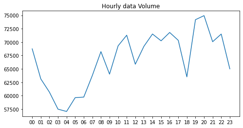

```python
import matplotlib.pyplot as plt
fig     = plt.figure(1,(8,4),dpi = 250)    
ax      = plt.subplot(111)
plt.sca(ax)

#折线图调整颜色加上数据点
plt.plot(hourcount['Stime'],hourcount['VehicleNum'],'k-',hourcount['Stime'],hourcount['VehicleNum'],'k.')
#加上条形图
plt.bar(hourcount['Stime'],hourcount['VehicleNum'],width =0.5)

plt.title('Hourly data Volume')

#把y轴起点固定在0
plt.ylim(0,80000)
plt.ylabel('Data volumn')
plt.xlabel('Hour')
plt.show()
```


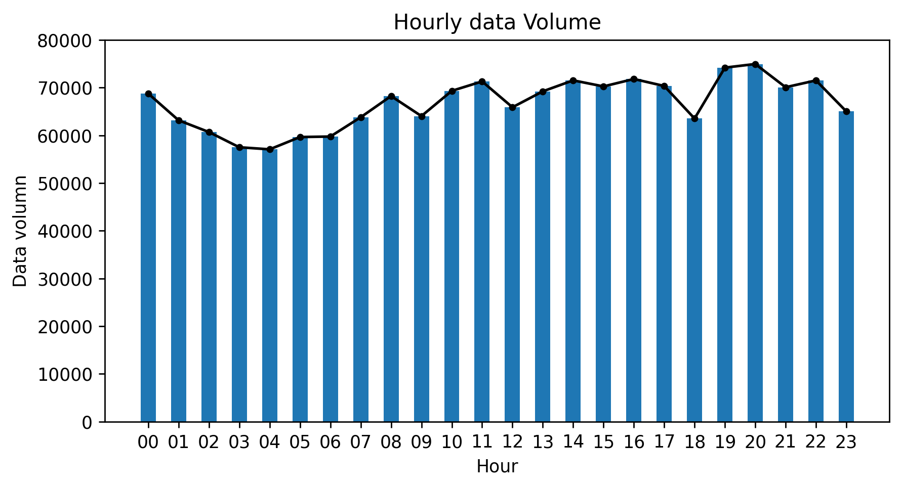


```python
TaxiOD.head(5)
```

</style>
<table border="1" class="dataframe">
  <thead>
    <tr style="text-align: right;">
      <th></th>
      <th>VehicleNum</th>
      <th>Stime</th>
      <th>SLng</th>
      <th>SLat</th>
      <th>Elng</th>
      <th>Elat</th>
      <th>Etime</th>
      <th>order_time</th>
    </tr>
  </thead>
  <tbody>
    <tr>
      <th>0</th>
      <td>22223</td>
      <td>00:03:23</td>
      <td>114.167465</td>
      <td>22.562468</td>
      <td>114.225235</td>
      <td>22.552750</td>
      <td>00:10:48</td>
      <td>445</td>
    </tr>
    <tr>
      <th>1</th>
      <td>22223</td>
      <td>00:11:33</td>
      <td>114.227150</td>
      <td>22.554167</td>
      <td>114.229218</td>
      <td>22.560217</td>
      <td>00:15:19</td>
      <td>226</td>
    </tr>
    <tr>
      <th>2</th>
      <td>22223</td>
      <td>00:17:13</td>
      <td>114.231354</td>
      <td>22.562166</td>
      <td>114.255798</td>
      <td>22.590967</td>
      <td>00:29:06</td>
      <td>713</td>
    </tr>
    <tr>
      <th>3</th>
      <td>22223</td>
      <td>00:36:45</td>
      <td>114.240196</td>
      <td>22.563650</td>
      <td>114.119965</td>
      <td>22.566668</td>
      <td>00:54:42</td>
      <td>1077</td>
    </tr>
    <tr>
      <th>4</th>
      <td>22223</td>
      <td>01:01:14</td>
      <td>114.135414</td>
      <td>22.575933</td>
      <td>114.166748</td>
      <td>22.608267</td>
      <td>01:08:17</td>
      <td>423</td>
    </tr>
  </tbody>
</table>
</div>


```python
orderNum = TaxiOD.groupby(data['Stime'].apply(lambda r:r[:2]))['Etime'].count().reset_index()
```


```python
import matplotlib.pyplot as plt
fig     = plt.figure(1,(8,4),dpi = 250)    
ax      = plt.subplot(111)
plt.sca(ax)

#折线图调整颜色加上数据点
plt.plot(orderNum['Stime'],orderNum['Etime'],'k-',orderNum['Stime'],orderNum['Etime'],'k.')
#加上条形图
plt.bar(orderNum['Stime'],orderNum['Etime'],width =0.5)

plt.title('Hourly order Volume')

#把y轴起点固定在0
plt.ylim(0,80000)
plt.ylabel('order volumn')
plt.xlabel('Hour')
plt.show()
```


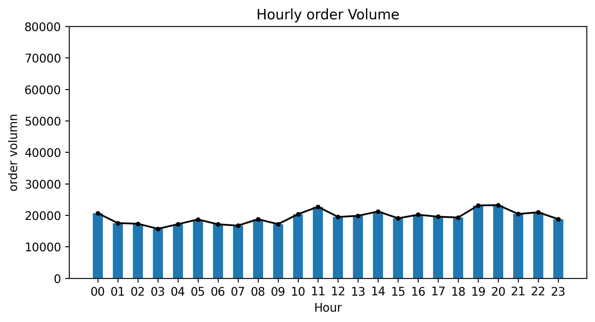


## 订单的持续时间箱型图
订单的持续时间计算
这里,我想绘制一下订单的持续时间分布图,从TaxiOD来计算每个订单的持续时间吧  
我们创建一列,叫order_time,记录的是从Stime到Etime经过的时间,单位是s


```python
TaxiOD = TaxiOD[-TaxiOD['Etime'].isnull()]
```


```python
#方法1:直接硬算
TaxiOD['order_time'] = TaxiOD['Etime'].str.slice(0,2).astype('int')*3600+\
TaxiOD['Etime'].str.slice(3,5).astype('int')*60+\
TaxiOD['Etime'].str.slice(6,8).astype('int')-\
TaxiOD['Stime'].str.slice(0,2).astype('int')*3600-\
TaxiOD['Stime'].str.slice(3,5).astype('int')*60-\
TaxiOD['Stime'].str.slice(6,8).astype('int')
#方法2:转换为时间格式,相减后提取秒
#TaxiOD['order_time'] = (pd.to_datetime(TaxiOD['Etime'])-pd.to_datetime(TaxiOD['Stime']))
#TaxiOD['order_time'] = TaxiOD['order_time'].apply(lambda r:r.seconds)
```

### 用两种方式绘图
首先用plt.boxplot绘制全部数据分布的箱型图

```python
fig = plt.figure(1,(7,3),dpi = 250)
ax  = plt.subplot(111)
plt.sca(ax)

plt.boxplot(TaxiOD['order_time']/60)

plt.ylabel('minutes')
plt.xlabel('order time')
plt.ylim(0,60)
plt.show()
```


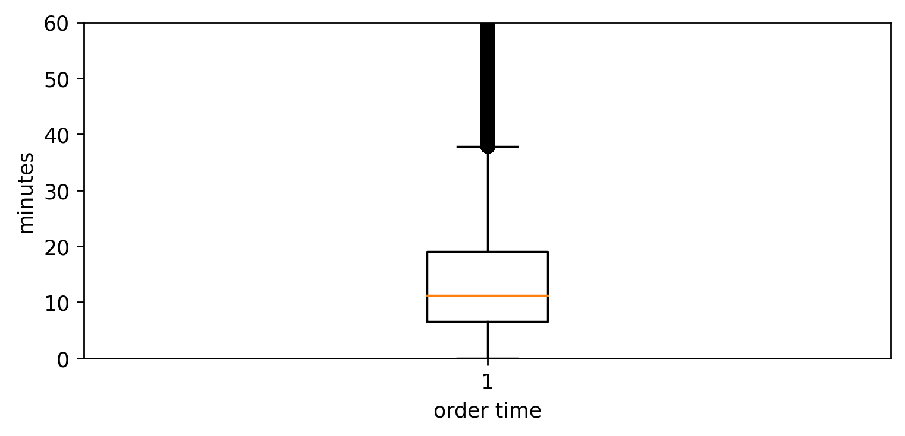


画出每小时分组的订单时间分布


```python
TaxiOD['Hour'] = TaxiOD['Stime'].str.slice(0,2)
```


```python
fig = plt.figure(1,(10,5),dpi = 250)
ax = plt.subplot(111)
plt.sca(ax)
hour = TaxiOD['Hour'].drop_duplicates().sort_values()
#drop_duplicates()函数是对df格式的数据,去除特定列下面的重复行,返回Df格式的数据
datas = []
for i in range(len(hour)):
    datas.append(TaxiOD[TaxiOD['Hour']==hour.iloc[i]]['order_time']/60)
#绘制
plt.boxplot(datas)
#更改x轴ticks的文字
plt.xticks(range(1,len(hour)+1),list(hour))
plt.ylabel('Order time(minutes)')
plt.xlabel('Order start time')
plt.ylim(0,60)
plt.show()
```


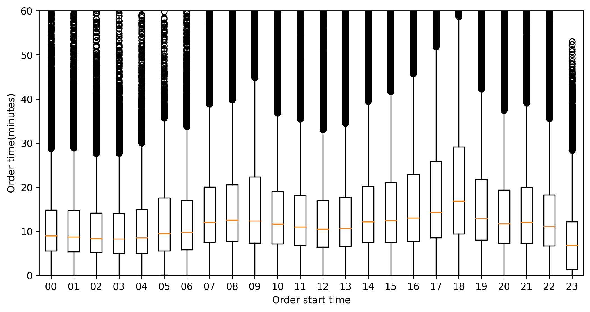

```python
import seaborn as sns
fig = plt.figure(1,(10,5),dpi = 250)
ax = plt.subplot(111)
plt.sca(ax)

sns.boxplot(x = 'Hour', y = TaxiOD["order_time"]/60, data = TaxiOD, ax=ax)

plt.ylabel('Order time(minutes)')
plt.xlabel('Order start time')
plt.ylim(0,60)
plt.show()
```


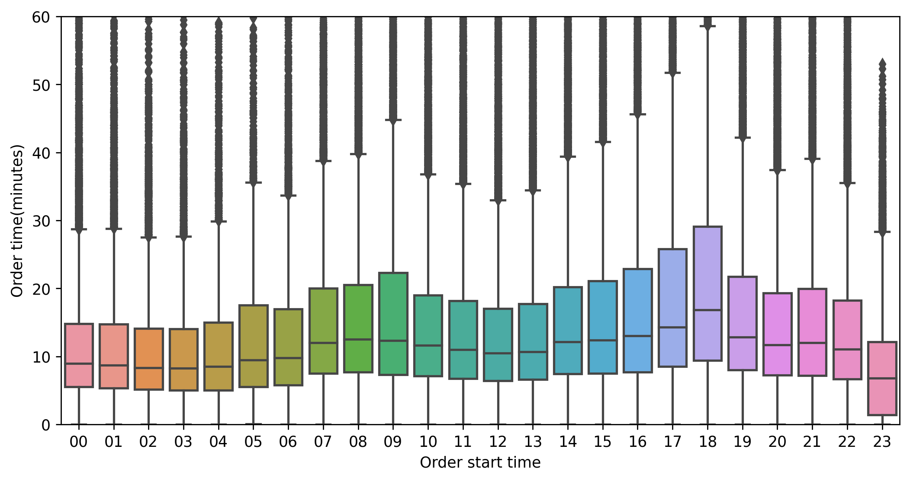

# 出租车数据的地理信息处理
## 读取shp文件
* .shp 存储的是几何要素的的空间信息，也就是XY坐标
* .shx 存储的是有关*.shp存储的索引信息。它记录了在*.shp中，空间数据是如何存储的，XY坐标的输入点在哪里，有多少XY坐标对等信息
* .dbf 存储地理数据的属性信息的dBase表


```python
#导入必要的包
import pandas as pd
import numpy as np
#绘制图用的包
import matplotlib as mpl
import matplotlib.pyplot as plt
#geopandas包
import geopandas 
#shapely包
from shapely.geometry import point,Polygon,shape
#读取shapefile文件
shp = '/home/liu/Documents/pygeo-tutorial/shapefile/sz.shp'
sz = geopandas.GeoDataFrame.from_file(shp,encoding = 'utf-8')
#绘制
sz.plot()
```


    <AxesSubplot:>

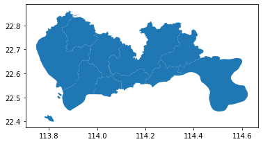

```python
sz.head(5)
```

</style>
<table border="1" class="dataframe">
  <thead>
    <tr style="text-align: right;">
      <th></th>
      <th>centroid_x</th>
      <th>centroid_y</th>
      <th>qh</th>
      <th>geometry</th>
    </tr>
  </thead>
  <tbody>
    <tr>
      <th>0</th>
      <td>114.143157</td>
      <td>22.577605</td>
      <td>罗湖</td>
      <td>POLYGON ((114.10006 22.53431, 114.09969 22.535...</td>
    </tr>
    <tr>
      <th>1</th>
      <td>114.041535</td>
      <td>22.546180</td>
      <td>福田</td>
      <td>POLYGON ((113.98578 22.51348, 113.98558 22.523...</td>
    </tr>
    <tr>
      <th>2</th>
      <td>114.270206</td>
      <td>22.596432</td>
      <td>盐田</td>
      <td>POLYGON ((114.22772 22.54290, 114.22643 22.543...</td>
    </tr>
    <tr>
      <th>3</th>
      <td>113.851387</td>
      <td>22.679120</td>
      <td>宝安</td>
      <td>MULTIPOLYGON (((113.81831 22.54676, 113.81816 ...</td>
    </tr>
    <tr>
      <th>4</th>
      <td>113.926290</td>
      <td>22.766157</td>
      <td>光明</td>
      <td>POLYGON ((113.98587 22.80304, 113.98605 22.802...</td>
    </tr>
  </tbody>
</table>
</div>


```python
sz['geometry'].iloc[2]
```


```python
type(sz['geometry'].iloc[0])
```


    shapely.geometry.polygon.Polygon


```python
#用unary_union可以将一个geopandas的所有记录合并为一个图形,合并出来的结果是Polygon
sz.unary_union
```


## 栅格化
我们需要能够直接批量算出来一批经纬度的栅格编号  
栅格化的原理  
栅格编号(loncol,latcol)  
栅格中心点坐标(hblon,hblat)

每个网格的长度:  
$$x = 500$$
计算每个网格的经度和纬度增加:
$$\Delta Lon = \frac{x\cdot 360}{2\pi\cdot R_e\cdot cos(\frac{(lat_1-lat_2)\cdot \pi}{360})}$$
$$\Delta Lat =\frac{x\cdot 360}{2\pi\cdot R_e}$$
$R_e:地球半径$

计算每个网格的坐标ID:  
$$LonID = \frac{m-(lon_1-\frac{\Delta Lon}{2})}{\Delta Lon}$$
$$LonID = \frac{a-(lat_1-\frac{\Delta Lat}{2})}{\Delta Lat}$$

m：输入点的经度

n：输入点的纬度


```python
#栅格化代码
import math
testlon = 114
testlat = 22.5

#划定栅格划分范围
lon1 = 113.75194
lon2 = 114.624187
lat1 = 22.447837
lat2 = 22.864748

latStart = min(lat1,lat2)
lonStart = min(lon1,lon2)

#定义栅格大小
accuracy = 500

#计算栅格经纬度增加量大小 \Delta Lon和\Delta Lat
deltaLon = accuracy * 360/(2 * math.pi * 6371004 * math.cos((lat1 + lat2) * math.pi /360))
deltaLat = accuracy * 360/(2 * math.pi * 6371004)

#计算栅格的经纬度编号
LONCOL=divmod(float(testlon) - (lonStart - deltaLon / 2) , deltaLon)[0]
LATCOL=divmod(float(testlat) - (latStart - deltaLat / 2) , deltaLat)[0] 
#divmod() 函数把除数和余数运算结果结合起来，返回一个包含商和余数的元组(a // b, a % b)

#计算栅格的中心点经纬度
HBLON = LONCOL*deltaLon + (lonStart - deltaLon/2)
HBLAT = LATCOL*deltaLon + (latStart - deltaLat/2)
#格子编号*格子宽+起始坐标-半个格子宽 = 格子中心横坐标

LONCOL,LATCOL,HBLON,HBLAT,deltaLon,deltaLat
```


    (51.0,
     12.0,
     113.99800701150498,
     22.504060066467282,
     0.004872614089207591,
     0.004496605206422906)

生成栅格的geopandas数据


```python
from shapely.geometry import Point,Polygon,shape
Polygon([(HBLON+deltaLon/2,HBLAT-deltaLat/2),
        (HBLON+deltaLon/2,HBLAT+deltaLat/2),
        (HBLON-deltaLon/2,HBLAT+deltaLat/2),
        (HBLON-deltaLon/2,HBLAT-deltaLat/2)])#多边形建模
```


```python
import pandas as pd
import numpy as np
import matplotlib as mpl
import matplotlib.pyplot as plt
import geopandas
from shapely.geometry import Point,Polygon,shape

#定义空geopandas表
data = geopandas.GeoDataFrame()

#定义空的list,后面循环一次就往里面加东西
LONCOL = []
LATCOL = []
geometry = []
HBLON1 = []
HBLAT1 = []

#计算总共要生成多少个栅格
lonsnum = int((lon2-lon1)/deltaLon)+1
latsnum = int((lat2-lat1)/deltaLat)+1

for i in range(lonsnum):
    for j in range(latsnum):
        HBLON = i*deltaLon + (lonStart - deltaLon/2)
        HBLAT = j*deltaLat + (latStart - deltaLat/2)
        LONCOL.append(i)
        LATCOL.append(j)
        HBLON1.append(HBLON)
        HBLAT1.append(HBLAT)
        
        #生成栅格的Polygon形状
        #这里我们用周围的栅格推算三个顶点的位置,否则生成的栅格因为小数点取值问题出现小缝隙
        HBLON_1 = (i+1)*deltaLon + (lonStart - deltaLon / 2)
        HBLAT_1 = (j+1)*deltaLat + (latStart - deltaLat / 2)
        geometry.append(Polygon([
        (HBLON-deltaLon/2,HBLAT-deltaLat/2),
        (HBLON_1-deltaLon/2,HBLAT-deltaLat/2),
        (HBLON_1-deltaLon/2,HBLAT_1-deltaLat/2),
        (HBLON-deltaLon/2,HBLAT_1-deltaLat/2)]))
        
#为geopandas文件的每一列赋值为刚刚的list
data['LONCOL'] = LONCOL
data['LATCOL'] = LATCOL
data['HBLON'] = HBLON1
data['HBLAT'] = HBLAT1
data['geometry'] = geometry

data.plot()
```


    <AxesSubplot:>


```python
data.head(5)
```

</style>
<table border="1" class="dataframe">
  <thead>
    <tr style="text-align: right;">
      <th></th>
      <th>LONCOL</th>
      <th>LATCOL</th>
      <th>HBLON</th>
      <th>HBLAT</th>
      <th>geometry</th>
    </tr>
  </thead>
  <tbody>
    <tr>
      <th>0</th>
      <td>0</td>
      <td>0</td>
      <td>113.749504</td>
      <td>22.445589</td>
      <td>POLYGON ((113.74707 22.44334, 113.75194 22.443...</td>
    </tr>
    <tr>
      <th>1</th>
      <td>0</td>
      <td>1</td>
      <td>113.749504</td>
      <td>22.450085</td>
      <td>POLYGON ((113.74707 22.44784, 113.75194 22.447...</td>
    </tr>
    <tr>
      <th>2</th>
      <td>0</td>
      <td>2</td>
      <td>113.749504</td>
      <td>22.454582</td>
      <td>POLYGON ((113.74707 22.45233, 113.75194 22.452...</td>
    </tr>
    <tr>
      <th>3</th>
      <td>0</td>
      <td>3</td>
      <td>113.749504</td>
      <td>22.459079</td>
      <td>POLYGON ((113.74707 22.45683, 113.75194 22.456...</td>
    </tr>
    <tr>
      <th>4</th>
      <td>0</td>
      <td>4</td>
      <td>113.749504</td>
      <td>22.463575</td>
      <td>POLYGON ((113.74707 22.46133, 113.75194 22.461...</td>
    </tr>
  </tbody>
</table>
</div>


```python
grid = data[data.intersects(sz.unary_union)]
grid.plot()
```


    <AxesSubplot:>

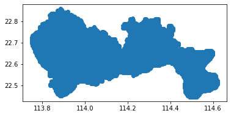

```python
#保存
grid.to_file('/home/liu/Documents/pygeo-tutorial/shapefile/grid',encoding = 'utf-8')
```

## 将数据对应到栅格


```python
import pandas as pd
TaxiOD = pd.read_csv('/home/liu/Documents/pygeo-tutorial/data-sample/TaxiOD.csv')
TaxiOD.columns = ['VehicleNum', 'Stime', 'SLng', 'SLat', 
       'ELng', 'ELat','Etime']
TaxiOD.head(5)
```

</style>
<table border="1" class="dataframe">
  <thead>
    <tr style="text-align: right;">
      <th></th>
      <th>VehicleNum</th>
      <th>Stime</th>
      <th>SLng</th>
      <th>SLat</th>
      <th>ELng</th>
      <th>ELat</th>
      <th>Etime</th>
    </tr>
  </thead>
  <tbody>
    <tr>
      <th>0</th>
      <td>22223</td>
      <td>00:03:23</td>
      <td>114.167465</td>
      <td>22.562468</td>
      <td>114.225235</td>
      <td>22.552750</td>
      <td>00:10:48</td>
    </tr>
    <tr>
      <th>1</th>
      <td>22223</td>
      <td>00:11:33</td>
      <td>114.227150</td>
      <td>22.554167</td>
      <td>114.229218</td>
      <td>22.560217</td>
      <td>00:15:19</td>
    </tr>
    <tr>
      <th>2</th>
      <td>22223</td>
      <td>00:17:13</td>
      <td>114.231354</td>
      <td>22.562166</td>
      <td>114.255798</td>
      <td>22.590967</td>
      <td>00:29:06</td>
    </tr>
    <tr>
      <th>3</th>
      <td>22223</td>
      <td>00:36:45</td>
      <td>114.240196</td>
      <td>22.563650</td>
      <td>114.119965</td>
      <td>22.566668</td>
      <td>00:54:42</td>
    </tr>
    <tr>
      <th>4</th>
      <td>22223</td>
      <td>01:01:14</td>
      <td>114.135414</td>
      <td>22.575933</td>
      <td>114.166748</td>
      <td>22.608267</td>
      <td>01:08:17</td>
    </tr>
  </tbody>
</table>
</div>


```python
TaxiOD = TaxiOD[-TaxiOD['ELng'].isnull()].copy() #copy() 函数返回一个字典的浅复制
#计算起点栅格的经纬度编号
TaxiOD['SLONCOL'] = ((TaxiOD['SLng'] - (lonStart - deltaLon / 2))/deltaLon).astype('int')
TaxiOD['SLATCOL'] = ((TaxiOD['SLat'] - (latStart - deltaLat / 2))/deltaLat).astype('int')
#计算起点栅格的中心点经纬度
TaxiOD['SHBLON'] = TaxiOD['SLONCOL']*deltaLon + (lonStart - deltaLon / 2)
TaxiOD['SHBLAT'] = TaxiOD['SLATCOL']*deltaLat + (latStart - deltaLat / 2)
#计算终点栅格的经纬度编号
TaxiOD['ELONCOL'] = ((TaxiOD['ELng'] - (lonStart - deltaLon / 2))/deltaLon).astype('int')
TaxiOD['ELATCOL'] = ((TaxiOD['ELat'] - (latStart - deltaLat / 2))/deltaLat).astype('int') 
#计算终点栅格的中心点经纬度
TaxiOD['EHBLON'] = TaxiOD['ELONCOL']*deltaLon + (lonStart - deltaLon / 2)
TaxiOD['EHBLAT'] = TaxiOD['ELATCOL']*deltaLat + (latStart - deltaLat / 2)
#筛选去掉起点终点在同一个格子里的OD
TaxiOD = TaxiOD[-((TaxiOD['SLONCOL']==TaxiOD['ELONCOL'])&(TaxiOD['SLATCOL']==TaxiOD['ELATCOL']))]
#筛选去掉不在研究范围内的栅格，TaxiOD的LONCOL、LATCOL都需要在我们的范围内
TaxiOD = TaxiOD[(TaxiOD['SLONCOL']>=0) & (TaxiOD['SLATCOL']>=0) &(TaxiOD['ELONCOL']>=0) & (TaxiOD['ELATCOL']>=0)&
(TaxiOD['SLONCOL']<=lonsnum) & (TaxiOD['SLATCOL']<=latsnum) &(TaxiOD['ELONCOL']<=lonsnum) & (TaxiOD['ELATCOL']<=latsnum)]

TaxiOD.head(5)
```

</style>
<table border="1" class="dataframe">
  <thead>
    <tr style="text-align: right;">
      <th></th>
      <th>VehicleNum</th>
      <th>Stime</th>
      <th>SLng</th>
      <th>SLat</th>
      <th>ELng</th>
      <th>ELat</th>
      <th>Etime</th>
      <th>SLONCOL</th>
      <th>SLATCOL</th>
      <th>SHBLON</th>
      <th>SHBLAT</th>
      <th>ELONCOL</th>
      <th>ELATCOL</th>
      <th>EHBLON</th>
      <th>EHBLAT</th>
    </tr>
  </thead>
  <tbody>
    <tr>
      <th>0</th>
      <td>22223</td>
      <td>00:03:23</td>
      <td>114.167465</td>
      <td>22.562468</td>
      <td>114.225235</td>
      <td>22.552750</td>
      <td>00:10:48</td>
      <td>85</td>
      <td>25</td>
      <td>114.163676</td>
      <td>22.558004</td>
      <td>97</td>
      <td>23</td>
      <td>114.222147</td>
      <td>22.549011</td>
    </tr>
    <tr>
      <th>1</th>
      <td>22223</td>
      <td>00:11:33</td>
      <td>114.227150</td>
      <td>22.554167</td>
      <td>114.229218</td>
      <td>22.560217</td>
      <td>00:15:19</td>
      <td>98</td>
      <td>24</td>
      <td>114.227020</td>
      <td>22.553507</td>
      <td>98</td>
      <td>25</td>
      <td>114.227020</td>
      <td>22.558004</td>
    </tr>
    <tr>
      <th>2</th>
      <td>22223</td>
      <td>00:17:13</td>
      <td>114.231354</td>
      <td>22.562166</td>
      <td>114.255798</td>
      <td>22.590967</td>
      <td>00:29:06</td>
      <td>98</td>
      <td>25</td>
      <td>114.227020</td>
      <td>22.558004</td>
      <td>103</td>
      <td>32</td>
      <td>114.251383</td>
      <td>22.589480</td>
    </tr>
    <tr>
      <th>3</th>
      <td>22223</td>
      <td>00:36:45</td>
      <td>114.240196</td>
      <td>22.563650</td>
      <td>114.119965</td>
      <td>22.566668</td>
      <td>00:54:42</td>
      <td>100</td>
      <td>26</td>
      <td>114.236765</td>
      <td>22.562500</td>
      <td>76</td>
      <td>26</td>
      <td>114.119822</td>
      <td>22.562500</td>
    </tr>
    <tr>
      <th>4</th>
      <td>22223</td>
      <td>01:01:14</td>
      <td>114.135414</td>
      <td>22.575933</td>
      <td>114.166748</td>
      <td>22.608267</td>
      <td>01:08:17</td>
      <td>79</td>
      <td>28</td>
      <td>114.134440</td>
      <td>22.571494</td>
      <td>85</td>
      <td>36</td>
      <td>114.163676</td>
      <td>22.607466</td>
    </tr>
  </tbody>
</table>
</div>


## 集计栅格OD(全天 高峰时段)


```python
OD = TaxiOD.groupby(['SLONCOL','SLATCOL','ELONCOL','ELATCOL'])['VehicleNum'].count().reset_index()
OD = OD.sort_values(by = 'VehicleNum',ascending = False)
```

## 绘制栅格的OD图
### 先绘制前20行

```python
#取前20的OD
Topod = OD.iloc[:20].copy()

#计算起点栅格的中心点经纬度
Topod['SHBLON'] = Topod['SLONCOL'] * deltaLon + (lonStart - deltaLon / 2)
Topod['SHBLAT'] = Topod['SLATCOL'] * deltaLat + (latStart - deltaLat / 2)

#计算终点栅格的中心点经纬度
Topod['EHBLON'] = Topod['ELONCOL'] * deltaLon + (lonStart - deltaLon / 2)
Topod['EHBLAT'] = Topod['ELATCOL'] * deltaLat + (latStart - deltaLat / 2)
Topod.head()
```


    .dataframe tbody tr th {
        vertical-align: top;
    }
    
    .dataframe thead th {
        text-align: right;
    }
</style>
<table border="1" class="dataframe">
  <thead>
    <tr style="text-align: right;">
      <th></th>
      <th>SLONCOL</th>
      <th>SLATCOL</th>
      <th>ELONCOL</th>
      <th>ELATCOL</th>
      <th>VehicleNum</th>
      <th>SHBLON</th>
      <th>SHBLAT</th>
      <th>EHBLON</th>
      <th>EHBLAT</th>
    </tr>
  </thead>
  <tbody>
    <tr>
      <th>113365</th>
      <td>63</td>
      <td>17</td>
      <td>65</td>
      <td>16</td>
      <td>298</td>
      <td>114.056478</td>
      <td>22.522031</td>
      <td>114.066224</td>
      <td>22.517534</td>
    </tr>
    <tr>
      <th>155022</th>
      <td>75</td>
      <td>21</td>
      <td>74</td>
      <td>19</td>
      <td>275</td>
      <td>114.114950</td>
      <td>22.540017</td>
      <td>114.110077</td>
      <td>22.531024</td>
    </tr>
    <tr>
      <th>113808</th>
      <td>63</td>
      <td>18</td>
      <td>65</td>
      <td>16</td>
      <td>235</td>
      <td>114.056478</td>
      <td>22.526528</td>
      <td>114.066224</td>
      <td>22.517534</td>
    </tr>
    <tr>
      <th>160281</th>
      <td>76</td>
      <td>21</td>
      <td>74</td>
      <td>19</td>
      <td>173</td>
      <td>114.119822</td>
      <td>22.540017</td>
      <td>114.110077</td>
      <td>22.531024</td>
    </tr>
    <tr>
      <th>122609</th>
      <td>65</td>
      <td>17</td>
      <td>63</td>
      <td>18</td>
      <td>172</td>
      <td>114.066224</td>
      <td>22.522031</td>
      <td>114.056478</td>
      <td>22.526528</td>
    </tr>
  </tbody>
</table>
</div>


```python
#导入绘图包
import matplotlib as mpl
import matplotlib.pyplot as plt
```


```python
fig     = plt.figure(1,(10,8),dpi = 250)    
ax      = plt.subplot(111)
plt.sca(ax)

#把刚才生成的栅格在ax上绘制
grid.plot(ax =ax,edgecolor = (0,0,0,0.8),facecolor = (0,0,0,0),linewidths=0.2)

#把合并的行政区划变成一个geopandas，在ax上绘制
SZ_all = geopandas.GeoDataFrame()
SZ_all['geometry'] = [sz.unary_union]
SZ_all.plot(ax = ax,edgecolor = (0,0,0,1),facecolor = (0,0,0,0),linewidths=0.5)

plt.show()
```


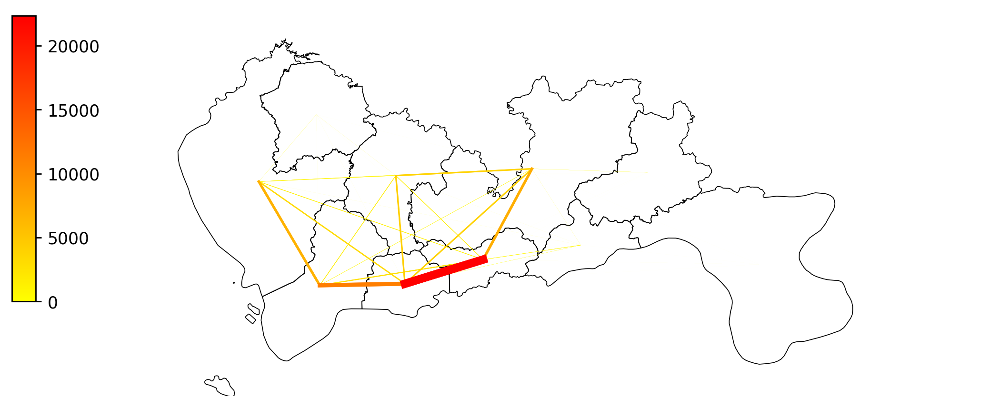

```python
fig     = plt.figure(1,(10,8),dpi = 250)    
ax      = plt.subplot(111)
plt.sca(ax)

grid.plot(ax =ax,edgecolor = (0,0,0,0.8),facecolor = (0,0,0,0),linewidths=0.2)
SZ_all.plot(ax = ax,edgecolor = (0,0,0,1),facecolor = (0,0,0,0),linewidths=0.5)

for i in range(len(Topod)):

    
    plt.plot([Topod['SHBLON'].iloc[i],Topod['EHBLON'].iloc[i]],[Topod['SHBLAT'].iloc[i],Topod['EHBLAT'].iloc[i]])


#不显示坐标轴
plt.axis('off')

plt.show()
```

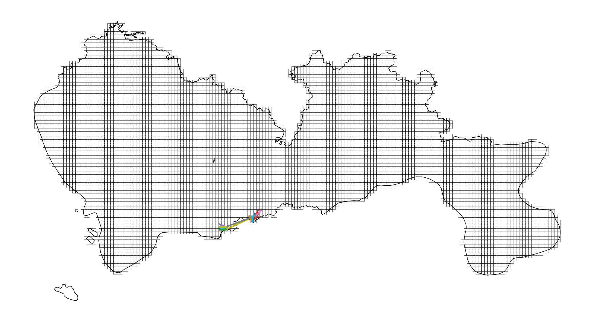

### 画出全部的OD


```python
OD1 = OD[OD['VehicleNum']>10].copy()

#OD从小到大排序方便我们后续操作，因为我们希望小的OD先画，放在最底下，大的OD后画，放在最上面
OD1 = OD1.sort_values(by = 'VehicleNum')

#计算起点栅格的中心点经纬度
OD1['SHBLON'] = OD1['SLONCOL'] * deltaLon + (lonStart - deltaLon / 2)
OD1['SHBLAT'] = OD1['SLATCOL'] * deltaLat + (latStart - deltaLat / 2)

#计算终点栅格的中心点经纬度
OD1['EHBLON'] = OD1['ELONCOL'] * deltaLon + (lonStart - deltaLon / 2)
OD1['EHBLAT'] = OD1['ELATCOL'] * deltaLat + (latStart - deltaLat / 2)

#对OD分5组，生成一个取值为0-1的列，每组的值相同，用以表示OD的粗细，取名linewidth
step = 5
OD1['linewidth'] = (np.array(range(len(OD1)))*step/len(OD1)).astype('int')/step+0.1
OD1.head(5)
```

</style>

<table border="1" class="dataframe">
  <thead>
    <tr style="text-align: right;">
      <th></th>
      <th>SLONCOL</th>
      <th>SLATCOL</th>
      <th>ELONCOL</th>
      <th>ELATCOL</th>
      <th>VehicleNum</th>
      <th>SHBLON</th>
      <th>SHBLAT</th>
      <th>EHBLON</th>
      <th>EHBLAT</th>
      <th>linewidth</th>
    </tr>
  </thead>
  <tbody>
    <tr>
      <th>41465</th>
      <td>37</td>
      <td>17</td>
      <td>34</td>
      <td>21</td>
      <td>11</td>
      <td>113.929790</td>
      <td>22.522031</td>
      <td>113.915173</td>
      <td>22.540017</td>
      <td>0.1</td>
    </tr>
    <tr>
      <th>93970</th>
      <td>59</td>
      <td>27</td>
      <td>61</td>
      <td>20</td>
      <td>11</td>
      <td>114.036988</td>
      <td>22.566997</td>
      <td>114.046733</td>
      <td>22.535521</td>
      <td>0.1</td>
    </tr>
    <tr>
      <th>149728</th>
      <td>74</td>
      <td>20</td>
      <td>76</td>
      <td>27</td>
      <td>11</td>
      <td>114.110077</td>
      <td>22.535521</td>
      <td>114.119822</td>
      <td>22.566997</td>
      <td>0.1</td>
    </tr>
    <tr>
      <th>38433</th>
      <td>36</td>
      <td>18</td>
      <td>37</td>
      <td>18</td>
      <td>11</td>
      <td>113.924918</td>
      <td>22.526528</td>
      <td>113.929790</td>
      <td>22.526528</td>
      <td>0.1</td>
    </tr>
    <tr>
      <th>138355</th>
      <td>71</td>
      <td>23</td>
      <td>68</td>
      <td>23</td>
      <td>11</td>
      <td>114.095459</td>
      <td>22.549011</td>
      <td>114.080841</td>
      <td>22.549011</td>
      <td>0.1</td>
    </tr>
  </tbody>
</table>
</div>


```python
import time
fig     = plt.figure(1,(10,8),dpi = 250)    
ax      = plt.subplot(111)
plt.sca(ax)

#把刚才生成的栅格在ax上绘制
grid.plot(ax = ax,edgecolor = (0,0,0,0.8),facecolor = (0,0,0,0),linewidths=0.2)

#绘制整个深圳的范围
SZ_all.plot(ax = ax,edgecolor = (0,0,0,1),facecolor = (0,0,0,0),linewidths=0.5)

#设置colormap的数据
import matplotlib
vmax = OD['VehicleNum'].max()
#设定一个标准化的工具，设定OD的colormap最大最小值，他的作用是norm(count)就会将count标准化到0-1的范围内
norm = mpl.colors.Normalize(vmin=0,vmax=vmax)
#设定colormap的颜色
cmapname = 'autumn_r'
#cmap是一个获取颜色的工具，cmap(a)会返回颜色，其中a是0-1之间的值
cmap = matplotlib.cm.get_cmap(cmapname)

#绘制OD
timeflag = time.time()
for i in range(len(OD1)):
    ###########################你需要在下面写代码#############################
    #设定plt.plot里面的参数alpha和color和linewidth
    plt.plot([OD1['SHBLON'].iloc[i],OD1['EHBLON'].iloc[i]],[OD1['SHBLAT'].iloc[i],OD1['EHBLAT'].iloc[i]],\
            linewidth = OD1['linewidth'].iloc[i],color = cmap(norm(OD1['VehicleNum'].iloc[i])),alpha=0.5)
    
    ###################################################################################
print('绘制OD用时',time.time()-timeflag,'秒')
    
#不显示坐标轴
plt.axis('off')    

#绘制假的colorbar，这是因为，我们画的OD是线，没办法直接画出来colorbar
#所以我们在一个看不见的地方画了一个叫imshow的东西，他的范围是0到vmax
#然后我们再对imshow添加colorbar
plt.imshow([[0,vmax]], cmap=cmap)
#设定colorbar的大小和位置
cax = plt.axes([0.08, 0.4, 0.02, 0.3])
plt.colorbar(cax=cax)

#然后要把镜头调整回到深圳地图那，不然镜头就在imshow那里了


ax.set_xlim(113.6,114.8)
ax.set_ylim(22.4,22.9)


plt.show()
```

    绘制OD用时 5.278459548950195 秒

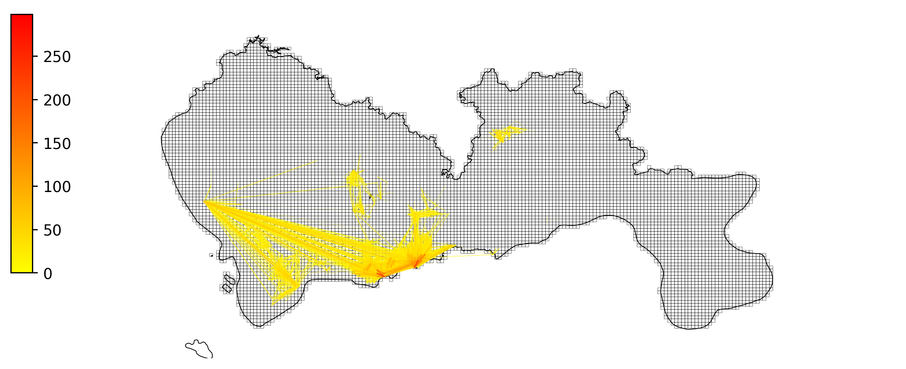

```python
len(OD1)
```


    5319

### 用GeoDataFrame自带plot函数绘制
如果遍历绘制OD，绘制速度比较慢，绘制5319条OD用时31s。
但是，如果把DataFrame变成GeoDataFrame，然后用自带的plot函数绘制，会快很多


```python
from shapely.geometry import LineString
OD1['geometry'] = OD1.apply(lambda r:LineString([[r['SHBLON'],r['SHBLAT']],[r['EHBLON'],r['EHBLAT']]]),axis = 1)
#LineStrings构造函数传入参数是2个或多个点序列,返回坐标
OD1 = geopandas.GeoDataFrame(OD1)
```


```python
fig     = plt.figure(1,(10,8),dpi = 250)    
ax      = plt.subplot(111)
plt.sca(ax)

#计时
import time
timeflag = time.time()
#绘制底图
grid.plot(ax = ax,edgecolor = (0,0,0,0.8),facecolor = (0,0,0,0),linewidths=0.2)
SZ_all.plot(ax = ax,edgecolor = (0,0,0,1),facecolor = (0,0,0,0),linewidths=0.5)
print('绘制底图用时',time.time()-timeflag,'秒')


#设置colormap的数据
import matplotlib
vmax = OD['VehicleNum'].max()
cmapname = 'autumn_r'
cmap = matplotlib.cm.get_cmap(cmapname)

timeflag = time.time()
#绘制OD
OD1.plot(ax = ax,column = 'VehicleNum',vmax = vmax,vmin = 0,cmap = cmap,linewidth = OD1['linewidth'])
print('绘制OD用时',time.time()-timeflag,'秒')

plt.axis('off')    
plt.imshow([[0,vmax]], cmap=cmap)
cax = plt.axes([0.08, 0.4, 0.02, 0.3])
plt.colorbar(cax=cax)
ax.set_xlim(113.6,114.8)
ax.set_ylim(22.4,22.9)
plt.show()
```

    绘制底图用时 1.735227346420288 秒
    绘制OD用时 0.26875901222229004 秒

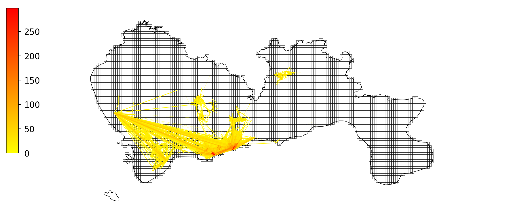

```python
#集计
Odistribution = OD.groupby(['SLONCOL','SLATCOL'])['VehicleNum'].sum().reset_index()
```


```python
#将集计的结果与栅格的geopandas执行merge操作
gridtoplot = pd.merge(grid,Odistribution.rename(columns = {'SLONCOL':'LONCOL','SLATCOL':'LATCOL'}),on = ['LONCOL','LATCOL'])
gridtoplot = gridtoplot.rename(columns = {'VehicleNum':'count'})
```


```python
fig     = plt.figure(1,(10,8),dpi = 250)    
ax      = plt.subplot(111)
plt.sca(ax)

#设置colormap的数据
import matplotlib
vmax = gridtoplot['count'].max()
#设定一个标准化的工具，设定OD的colormap最大最小值，他的作用是norm(count)就会将count标准化到0-1的范围内
norm = mpl.colors.Normalize(vmin=0,vmax=vmax)
#设定colormap的颜色
cmapname = 'autumn_r'
#cmap是一个获取颜色的工具，cmap(a)会返回颜色，其中a是0-1之间的值
cmap = matplotlib.cm.get_cmap(cmapname)


#将gridtoplot这个geodataframe进行绘制
#提示：用gridtoplot.plot，设定里面的参数是column = 'count'，以count这一列来绘制。参数cmap = cmap设定它的颜色
###########################你需要在下面写代码#############################
#gridtoplot.plot(...)
gridtoplot.plot(ax = ax, column = 'count', vmax = vmax, vmin=0, cmap = cmap)

###################################################################################

#绘制整个深圳的范围
SZ_all.plot(ax = ax,edgecolor = (0,0,0,1),facecolor = (0,0,0,0),linewidths=0.5)


#不显示坐标轴
plt.axis('off')    

#绘制假的colorbar，这是因为，我们画的OD是线，没办法直接画出来colorbar
#所以我们在一个看不见的地方画了一个叫imshow的东西，他的范围是0到vmax
#然后我们再对imshow添加colorbar
plt.imshow([[0,vmax]], cmap=cmap)
#设定colorbar的大小和位置
cax = plt.axes([0.08, 0.4, 0.02, 0.3])
plt.colorbar(cax=cax)


#然后要把镜头调整回到深圳地图那，不然镜头就在imshow那里了


ax.set_xlim(113.6,114.8)
ax.set_ylim(22.4,22.9)

plt.show()
```


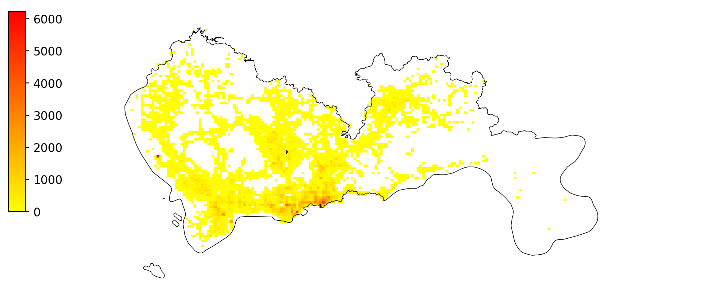


# 基于出租车GPS的OD期望线绘制与底图添加（plot_map）
GIS文件(地理信息系统):  
1. 深圳行政区划
2. 深圳栅格

数据: 
1. 出租车GPS集计栅格OD  


```python
#导入必要的包
import pandas as pd
import numpy as np

#绘制图用的包
import matplotlib as mpl
import matplotlib.pyplot as plt

#geopandas包
import geopandas

#shapely包
from shapely.geometry import Point,Polygon,shape
```

## 读取基础数据
### GIS数据


```python
#行政区划数据
#读取shapefile文件
shp = '/home/liu/Documents/pygeo-tutorial/shapefile/sz.shp'
xzqh = geopandas.GeoDataFrame.from_file(shp, encoding = 'utf-8')

#绘制看看什么样
xzqh.plot()
xzqh.head(5)
```


<div>
<style scoped>
    .dataframe tbody tr th:only-of-type {
        vertical-align: middle;
    }

    .dataframe tbody tr th {
        vertical-align: top;
    }
    
    .dataframe thead th {
        text-align: right;
    }
</style>
<table border="1" class="dataframe">
  <thead>
    <tr style="text-align: right;">
      <th></th>
      <th>centroid_x</th>
      <th>centroid_y</th>
      <th>qh</th>
      <th>geometry</th>
    </tr>
  </thead>
  <tbody>
    <tr>
      <th>0</th>
      <td>114.143157</td>
      <td>22.577605</td>
      <td>罗湖</td>
      <td>POLYGON ((114.10006 22.53431, 114.09969 22.535...</td>
    </tr>
    <tr>
      <th>1</th>
      <td>114.041535</td>
      <td>22.546180</td>
      <td>福田</td>
      <td>POLYGON ((113.98578 22.51348, 113.98558 22.523...</td>
    </tr>
    <tr>
      <th>2</th>
      <td>114.270206</td>
      <td>22.596432</td>
      <td>盐田</td>
      <td>POLYGON ((114.22772 22.54290, 114.22643 22.543...</td>
    </tr>
    <tr>
      <th>3</th>
      <td>113.851387</td>
      <td>22.679120</td>
      <td>宝安</td>
      <td>MULTIPOLYGON (((113.81831 22.54676, 113.81816 ...</td>
    </tr>
    <tr>
      <th>4</th>
      <td>113.926290</td>
      <td>22.766157</td>
      <td>光明</td>
      <td>POLYGON ((113.98587 22.80304, 113.98605 22.802...</td>
    </tr>
  </tbody>
</table>
</div>


```python
#栅格数据
#读取shapefile文件
shp = '/home/liu/Documents/pygeo-tutorial/shapefile/grid/grid.shp'
grid = geopandas.GeoDataFrame.from_file(shp,encoding = 'gbk')

#绘制
grid.plot()
```


    <AxesSubplot:>

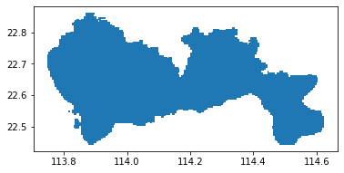


### 栅格OD数据
这个数据是前面教程中用公式计算出来的OD


```python
OD = pd.read_csv('/home/liu/Documents/pygeo-tutorial/data-sample/taxi_od_grid.csv')
OD.head(5)
```

</style>
<table border="1" class="dataframe">
  <thead>
    <tr style="text-align: right;">
      <th></th>
      <th>SLONCOL</th>
      <th>SLATCOL</th>
      <th>ELONCOL</th>
      <th>ELATCOL</th>
      <th>VehicleNum</th>
    </tr>
  </thead>
  <tbody>
    <tr>
      <th>0</th>
      <td>63</td>
      <td>17</td>
      <td>65</td>
      <td>16</td>
      <td>298</td>
    </tr>
    <tr>
      <th>1</th>
      <td>75</td>
      <td>21</td>
      <td>74</td>
      <td>19</td>
      <td>275</td>
    </tr>
    <tr>
      <th>2</th>
      <td>63</td>
      <td>18</td>
      <td>65</td>
      <td>16</td>
      <td>235</td>
    </tr>
    <tr>
      <th>3</th>
      <td>76</td>
      <td>21</td>
      <td>74</td>
      <td>19</td>
      <td>173</td>
    </tr>
    <tr>
      <th>4</th>
      <td>65</td>
      <td>17</td>
      <td>63</td>
      <td>18</td>
      <td>172</td>
    </tr>
  </tbody>
</table>
</div>


## 栅格与小区,行政区的匹配
### 栅格中心点获取


```python
#栅格所带的字段信息
grid.head(5)
```

</style>
<table border="1" class="dataframe">
  <thead>
    <tr style="text-align: right;">
      <th></th>
      <th>LONCOL</th>
      <th>LATCOL</th>
      <th>HBLON</th>
      <th>HBLAT</th>
      <th>geometry</th>
    </tr>
  </thead>
  <tbody>
    <tr>
      <th>0</th>
      <td>0</td>
      <td>54</td>
      <td>113.749504</td>
      <td>22.688405</td>
      <td>POLYGON ((113.74707 22.68616, 113.74707 22.690...</td>
    </tr>
    <tr>
      <th>1</th>
      <td>0</td>
      <td>55</td>
      <td>113.749504</td>
      <td>22.692902</td>
      <td>POLYGON ((113.74707 22.69065, 113.74707 22.695...</td>
    </tr>
    <tr>
      <th>2</th>
      <td>0</td>
      <td>56</td>
      <td>113.749504</td>
      <td>22.697399</td>
      <td>POLYGON ((113.74707 22.69515, 113.74707 22.699...</td>
    </tr>
    <tr>
      <th>3</th>
      <td>0</td>
      <td>57</td>
      <td>113.749504</td>
      <td>22.701895</td>
      <td>POLYGON ((113.74707 22.69965, 113.74707 22.704...</td>
    </tr>
    <tr>
      <th>4</th>
      <td>0</td>
      <td>58</td>
      <td>113.749504</td>
      <td>22.706392</td>
      <td>POLYGON ((113.74707 22.70414, 113.74707 22.708...</td>
    </tr>
  </tbody>
</table>
</div>

下一步我们定义一个geoDataFrame变量，命名为grid_point，存储的是栅格的中心点


```python
grid_point = grid.copy()
#我们相当于把geometry这一列的信息由polygon改成point
grid_point['geometry'] = grid.centroid

grid_point.plot()
```


    <AxesSubplot:>

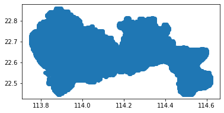

```python
grid_point.head(5)
```

</style>
<table border="1" class="dataframe">
  <thead>
    <tr style="text-align: right;">
      <th></th>
      <th>LONCOL</th>
      <th>LATCOL</th>
      <th>HBLON</th>
      <th>HBLAT</th>
      <th>geometry</th>
    </tr>
  </thead>
  <tbody>
    <tr>
      <th>0</th>
      <td>0</td>
      <td>54</td>
      <td>113.749504</td>
      <td>22.688405</td>
      <td>POINT (113.74950 22.68841)</td>
    </tr>
    <tr>
      <th>1</th>
      <td>0</td>
      <td>55</td>
      <td>113.749504</td>
      <td>22.692902</td>
      <td>POINT (113.74950 22.69290)</td>
    </tr>
    <tr>
      <th>2</th>
      <td>0</td>
      <td>56</td>
      <td>113.749504</td>
      <td>22.697399</td>
      <td>POINT (113.74950 22.69740)</td>
    </tr>
    <tr>
      <th>3</th>
      <td>0</td>
      <td>57</td>
      <td>113.749504</td>
      <td>22.701895</td>
      <td>POINT (113.74950 22.70190)</td>
    </tr>
    <tr>
      <th>4</th>
      <td>0</td>
      <td>58</td>
      <td>113.749504</td>
      <td>22.706392</td>
      <td>POINT (113.74950 22.70639)</td>
    </tr>
  </tbody>
</table>
</div>

### 空间连接sjoin
在对栅格和行政区划连接时,要用到geopandas的sjoin方法


```python
#连接到行政区划
grid_point = geopandas.sjoin(grid_point, xzqh, how='inner', op='intersects')#类似于pandas.merge()
#'inner'表示内连接，且连接结果表中的矢量列来自左表
#'intersects'代表相交，即几何对象之间存在共有的边或内部点
grid_point.head(5)
```

</style>
<table border="1" class="dataframe">
  <thead>
    <tr style="text-align: right;">
      <th></th>
      <th>LONCOL</th>
      <th>LATCOL</th>
      <th>HBLON</th>
      <th>HBLAT</th>
      <th>geometry</th>
      <th>index_right</th>
      <th>centroid_x</th>
      <th>centroid_y</th>
      <th>qh</th>
    </tr>
  </thead>
  <tbody>
    <tr>
      <th>2</th>
      <td>0</td>
      <td>56</td>
      <td>113.749504</td>
      <td>22.697399</td>
      <td>POINT (113.74950 22.69740)</td>
      <td>3</td>
      <td>113.851387</td>
      <td>22.67912</td>
      <td>宝安</td>
    </tr>
    <tr>
      <th>3</th>
      <td>0</td>
      <td>57</td>
      <td>113.749504</td>
      <td>22.701895</td>
      <td>POINT (113.74950 22.70190)</td>
      <td>3</td>
      <td>113.851387</td>
      <td>22.67912</td>
      <td>宝安</td>
    </tr>
    <tr>
      <th>4</th>
      <td>0</td>
      <td>58</td>
      <td>113.749504</td>
      <td>22.706392</td>
      <td>POINT (113.74950 22.70639)</td>
      <td>3</td>
      <td>113.851387</td>
      <td>22.67912</td>
      <td>宝安</td>
    </tr>
    <tr>
      <th>5</th>
      <td>0</td>
      <td>59</td>
      <td>113.749504</td>
      <td>22.710888</td>
      <td>POINT (113.74950 22.71089)</td>
      <td>3</td>
      <td>113.851387</td>
      <td>22.67912</td>
      <td>宝安</td>
    </tr>
    <tr>
      <th>6</th>
      <td>0</td>
      <td>60</td>
      <td>113.749504</td>
      <td>22.715385</td>
      <td>POINT (113.74950 22.71539)</td>
      <td>3</td>
      <td>113.851387</td>
      <td>22.67912</td>
      <td>宝安</td>
    </tr>
  </tbody>
</table>
</div>


```python
grid_point.plot()
```


    <AxesSubplot:>


```python
#只取需要的列
grid_point = grid_point[['LONCOL','LATCOL','qh','centroid_x','centroid_y']]
```

### 把OD表的起点终点和grid_point表连接
这里用df.merge,把OD和grid_point表连接起来


```python
grid_point.columns = ['SLONCOL','SLATCOL','Sqh','S_x','S_y']
OD = pd.merge(OD,grid_point, on = ['SLONCOL','SLATCOL'])
grid_point.columns = ['ELONCOL','ELATCOL','Eqh','E_x','E_y']
OD = pd.merge(OD,grid_point,on = ['ELONCOL','ELATCOL'])
OD.head(5)
```

</style>
<table border="1" class="dataframe">
  <thead>
    <tr style="text-align: right;">
      <th></th>
      <th>SLONCOL</th>
      <th>SLATCOL</th>
      <th>ELONCOL</th>
      <th>ELATCOL</th>
      <th>VehicleNum</th>
      <th>Sqh</th>
      <th>S_x</th>
      <th>S_y</th>
      <th>Eqh</th>
      <th>E_x</th>
      <th>E_y</th>
    </tr>
  </thead>
  <tbody>
    <tr>
      <th>0</th>
      <td>63</td>
      <td>17</td>
      <td>65</td>
      <td>16</td>
      <td>298</td>
      <td>福田</td>
      <td>114.041535</td>
      <td>22.546180</td>
      <td>福田</td>
      <td>114.041535</td>
      <td>22.54618</td>
    </tr>
    <tr>
      <th>1</th>
      <td>75</td>
      <td>21</td>
      <td>65</td>
      <td>16</td>
      <td>139</td>
      <td>罗湖</td>
      <td>114.143157</td>
      <td>22.577605</td>
      <td>福田</td>
      <td>114.041535</td>
      <td>22.54618</td>
    </tr>
    <tr>
      <th>2</th>
      <td>63</td>
      <td>18</td>
      <td>65</td>
      <td>16</td>
      <td>235</td>
      <td>福田</td>
      <td>114.041535</td>
      <td>22.546180</td>
      <td>福田</td>
      <td>114.041535</td>
      <td>22.54618</td>
    </tr>
    <tr>
      <th>3</th>
      <td>76</td>
      <td>21</td>
      <td>65</td>
      <td>16</td>
      <td>89</td>
      <td>罗湖</td>
      <td>114.143157</td>
      <td>22.577605</td>
      <td>福田</td>
      <td>114.041535</td>
      <td>22.54618</td>
    </tr>
    <tr>
      <th>4</th>
      <td>65</td>
      <td>17</td>
      <td>65</td>
      <td>16</td>
      <td>64</td>
      <td>福田</td>
      <td>114.041535</td>
      <td>22.546180</td>
      <td>福田</td>
      <td>114.041535</td>
      <td>22.54618</td>
    </tr>
  </tbody>
</table>
</div>

### 集计行政区划的OD


```python
#集记行政区划的OD
OD = OD.groupby(['Sqh','S_x','S_y','Eqh','E_x','E_y'])['VehicleNum'].sum().reset_index()
OD.head(5)
```

</style>
<table border="1" class="dataframe">
  <thead>
    <tr style="text-align: right;">
      <th></th>
      <th>Sqh</th>
      <th>S_x</th>
      <th>S_y</th>
      <th>Eqh</th>
      <th>E_x</th>
      <th>E_y</th>
      <th>VehicleNum</th>
    </tr>
  </thead>
  <tbody>
    <tr>
      <th>0</th>
      <td>光明</td>
      <td>113.92629</td>
      <td>22.766157</td>
      <td>光明</td>
      <td>113.926290</td>
      <td>22.766157</td>
      <td>141</td>
    </tr>
    <tr>
      <th>1</th>
      <td>光明</td>
      <td>113.92629</td>
      <td>22.766157</td>
      <td>南山</td>
      <td>113.930714</td>
      <td>22.544103</td>
      <td>8</td>
    </tr>
    <tr>
      <th>2</th>
      <td>光明</td>
      <td>113.92629</td>
      <td>22.766157</td>
      <td>宝安</td>
      <td>113.851387</td>
      <td>22.679120</td>
      <td>119</td>
    </tr>
    <tr>
      <th>3</th>
      <td>光明</td>
      <td>113.92629</td>
      <td>22.766157</td>
      <td>福田</td>
      <td>114.041535</td>
      <td>22.546180</td>
      <td>3</td>
    </tr>
    <tr>
      <th>4</th>
      <td>光明</td>
      <td>113.92629</td>
      <td>22.766157</td>
      <td>罗湖</td>
      <td>114.143157</td>
      <td>22.577605</td>
      <td>2</td>
    </tr>
  </tbody>
</table>
</div>


```python
OD = OD[-(OD['Sqh']==OD['Eqh'])]
```

## OD的绘制


```python
OD = OD.sort_values(by = 'VehicleNum')
OD.head(5)
```

</style>
<table border="1" class="dataframe">
  <thead>
    <tr style="text-align: right;">
      <th></th>
      <th>Sqh</th>
      <th>S_x</th>
      <th>S_y</th>
      <th>Eqh</th>
      <th>E_x</th>
      <th>E_y</th>
      <th>VehicleNum</th>
    </tr>
  </thead>
  <tbody>
    <tr>
      <th>30</th>
      <td>大鹏</td>
      <td>114.502205</td>
      <td>22.571337</td>
      <td>龙岗</td>
      <td>114.206790</td>
      <td>22.695694</td>
      <td>1</td>
    </tr>
    <tr>
      <th>26</th>
      <td>大鹏</td>
      <td>114.502205</td>
      <td>22.571337</td>
      <td>宝安</td>
      <td>113.851387</td>
      <td>22.679120</td>
      <td>1</td>
    </tr>
    <tr>
      <th>24</th>
      <td>大鹏</td>
      <td>114.502205</td>
      <td>22.571337</td>
      <td>坪山</td>
      <td>114.356936</td>
      <td>22.691020</td>
      <td>1</td>
    </tr>
    <tr>
      <th>21</th>
      <td>坪山</td>
      <td>114.356936</td>
      <td>22.691020</td>
      <td>罗湖</td>
      <td>114.143157</td>
      <td>22.577605</td>
      <td>1</td>
    </tr>
    <tr>
      <th>19</th>
      <td>坪山</td>
      <td>114.356936</td>
      <td>22.691020</td>
      <td>宝安</td>
      <td>113.851387</td>
      <td>22.679120</td>
      <td>1</td>
    </tr>
  </tbody>
</table>
</div>


```python
import matplotlib as mpl
import matplotlib.pyplot as plt
```


```python
fig = plt.figure(1,(10,8),dpi = 250)
ax = plt.subplot(111)
plt.sca(ax)
#绘制行政区划
xzqh.plot(ax = ax,edgecolor = (0,0,0,1),facecolor = (0,0,0,0),linewidths = 0.5)
#设置colormap的数据
import matplotlib 
vmax = OD['VehicleNum'].max()
#设定一个标准化的工具,设定OD的colormap最大最小值,他的作用是norm(count)就会将count标准化到0-1的范围内
norm = mpl.colors.Normalize(vmin=0,vmax=vmax)
#设定colormap的颜色
cmapname = 'autumn_r'
#设定一个标准化的工具,cmap(a)会返回颜色,其中a是0-1之间的值
cmap = matplotlib.cm.get_cmap(cmapname)

#绘制OD
for i in range(len(OD)):
    #设定第i条线的color和linewidth
    color_i = cmap(norm(OD['VehicleNum'].iloc[i]))
    linewidth_i = norm(OD['VehicleNum'].iloc[i])*5
    
    #绘制
    plt.plot([OD['S_x'].iloc[i],OD['E_x'].iloc[i]],[OD['S_y'].iloc[i],OD['E_y'].iloc[i]],color = color_i,linewidth = linewidth_i)
    
#不显示坐标轴
plt.axis('off')    

#绘制假的colorbar，这是因为，我们画的OD是线，没办法直接画出来colorbar
#所以我们在一个看不见的地方画了一个叫imshow的东西，他的范围是0到vmax
#然后我们再对imshow添加colorbar
plt.imshow([[0,vmax]], cmap=cmap)
#设定colorbar的大小和位置
cax = plt.axes([0.08, 0.4, 0.02, 0.3])
plt.colorbar(cax=cax)

#然后要把镜头调整回到深圳地图那，不然镜头就在imshow那里了

ax.set_xlim(113.6,114.8)
ax.set_ylim(22.4,22.9)

###################################################################################

plt.show()
```


## 用plot_map包绘制底图
只需要用以下代码：  

`plot_map(plt,bounds,zoom = 9,style = 1)`  
可以通过更改函数plot map中的“style”和“styleid”来更改地图样式  
bounds——设置绘图边界`[lon1，lat1，lon2，lat2]`（wgs1984）  
zoom——地图的缩放级别  
style——从1到7表示不同的地图样式，1-6表示openstreetmap，7表示mapbox，样式3和4不需要token  
styleid——如果style设置为7（来自mapbox），则可以在此处更改styleid，用“深色”或“浅色”或您自己的样式  


```python
import plot_map

fig     = plt.figure(1,(10,8),dpi = 250)    
ax      = plt.subplot(111)
plt.sca(ax)

bounds = [113.6,22.4,114.8,22.9]
plot_map.plot_map(plt,bounds,zoom = 12,style = 4)

#绘制行政区划
xzqh.plot(ax = ax,edgecolor = (0,0,0,1),facecolor = (0,0,0,0.2),linewidths=0.5)

#设置colormap的数据
import matplotlib
vmax = OD['VehicleNum'].max()
norm = mpl.colors.Normalize(vmin=0,vmax=vmax)
cmapname = 'autumn_r'
cmap = matplotlib.cm.get_cmap(cmapname)

#绘制OD
for i in range(len(OD)):
    color_i=cmap(norm(OD['VehicleNum'].iloc[i]))
    linewidth_i=norm(OD['VehicleNum'].iloc[i])*5
    plt.plot([OD['S_x'].iloc[i],OD['E_x'].iloc[i]],[OD['S_y'].iloc[i],OD['E_y'].iloc[i]],color=color_i,linewidth=linewidth_i)


    
#不显示坐标轴
plt.axis('off')    

#添加colorbar
plt.imshow([[0,vmax]], cmap=cmap)
#设定colorbar的大小和位置
cax = plt.axes([0.13, 0.32, 0.02, 0.3])
plt.colorbar(cax=cax)

ax.set_xlim(113.6,114.8)
ax.set_ylim(22.4,22.9)


plt.show()
```

    imgsavepath do not exist, your tile map will not save

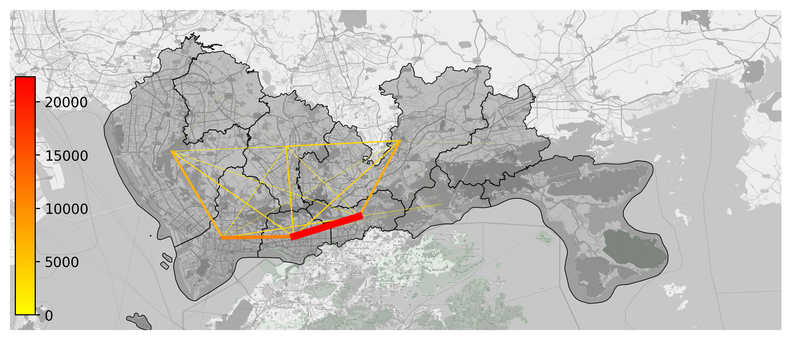

# 绘制数据分布的散点图和热力图
## 数据集计处理
绘制数据分布的时候,首先第一步还是将数据集计,得到每一个小范围内的数据量是多少.


```python
import pandas as pd 
#读取数据
data = pd.read_csv('/home/liu/Documents/pygeo-tutorial/data-sample/TaxiData-Sample',header = None)
#给数据命名列
data.columns = ['VehicleNum','Stime','Lng','Lat','OpenStatus','Speed']
```


```python
#筛选范围内数据
bounds = [113.7,22.42,114.3,22.8]
data = data[(data['Lng']>bounds[0])&(data['Lng']<bounds[2])&(data['Lat']>bounds[1])&(data['Lat']<bounds[3])]
```


```python
#经纬度小数点保留三位小数
data2 = data[['Lng','Lat']].round(3).copy()

#集计每个小范围内数据量
data2['count'] = 1
data2 = data2.groupby(['Lng','Lat'])['count'].count().reset_index()

#排序数据,让数据量小的放上面先画,数据大的放下面最后画
data2.sort_values(by = 'count')
data2.head(5)
```

</style>
<table border="1" class="dataframe">
  <thead>
    <tr style="text-align: right;">
      <th></th>
      <th>Lng</th>
      <th>Lat</th>
      <th>count</th>
    </tr>
  </thead>
  <tbody>
    <tr>
      <th>0</th>
      <td>113.701</td>
      <td>22.779</td>
      <td>1</td>
    </tr>
    <tr>
      <th>1</th>
      <td>113.703</td>
      <td>22.779</td>
      <td>1</td>
    </tr>
    <tr>
      <th>2</th>
      <td>113.715</td>
      <td>22.781</td>
      <td>1</td>
    </tr>
    <tr>
      <th>3</th>
      <td>113.717</td>
      <td>22.780</td>
      <td>1</td>
    </tr>
    <tr>
      <th>4</th>
      <td>113.723</td>
      <td>22.769</td>
      <td>1</td>
    </tr>
  </tbody>
</table>
</div>


## 散点图绘制

```python
import plot_map
import imp
imp.reload(plot_map)
```


    <module 'plot_map' from '/home/liu/Documents/jupyter/用Python分析时空数据的教程/plot_map.py'>


```python
bounds = [113.7, 22.42, 114.3, 22.8]

import matplotlib as mpl
import matplotlib.pyplot as plt
import plot_map
import seaborn as sns
fig     = plt.figure(1,(8,8),dpi = 100)    
ax      = plt.subplot(111)
plt.sca(ax)
fig.tight_layout(rect = (0.05,0.1,1,0.9))

#背景
plot_map.plot_map(plt,bounds,zoom = 12,style = 4)


#colorbar
pallete_name = "BuPu"
colors = sns.color_palette(pallete_name, 3)
colors.reverse()
cmap = mpl.colors.LinearSegmentedColormap.from_list(pallete_name, colors)
vmax = data2['count'].quantile(0.99)
norm = mpl.colors.Normalize(vmin=0, vmax=vmax)


#plot scatters
plt.scatter(data2['Lng'],data2['Lat'],s = 1,alpha = 1,c = data2['count'],cmap = cmap,norm=norm )
plt.axis('off')
plt.xlim(bounds[0],bounds[2])
plt.ylim(bounds[1],bounds[3])

# 加比例尺和指北针
plot_map.plotscale(ax,bounds = bounds,textsize = 10,compasssize = 1,accuracy = 2000,rect = [0.06,0.03])

#假的 colorbar
plt.imshow([[0,vmax]], cmap=cmap)
cax = plt.axes([0.13, 0.33, 0.02, 0.3])
plt.colorbar(cax=cax)

plt.show()
##########################################################
```

    imgsavepath do not exist, your tile map will not save


    /home/liu/miniconda3/lib/python3.7/site-packages/geopandas/_compat.py:88: UserWarning: The Shapely GEOS version (3.8.0-CAPI-1.13.1 ) is incompatible with the GEOS version PyGEOS was compiled with (3.8.1-CAPI-1.13.3). Conversions between both will be slow.
      shapely_geos_version, geos_capi_version_string

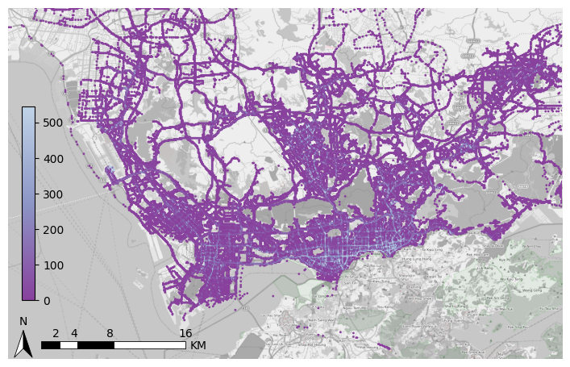


## 热力图绘制(countourf)
热力图绘制这里采用plt的contourf函数绘制,而countour所传入的参数是一个矩阵形式
`plt.countourf(x,y,z, levels = levels, cmap = cmap,origin = 'lower' )`
* x -- 一维横坐标
* y -- 一维纵坐标
* z -- 二维矩阵值
* levels -- 分层的颜色
因此我们用pd.pivot透视表来生成x,y,z  
在这里我对z取一个log,这样可视化出来效果更优美  


```python
import numpy as np
d = data2.pivot(columns = 'Lng',index = 'Lat', values = 'count').fillna(0)#fillna(0)将NAN值转换为0
#将一个dataframe的记录数据整合成表格，而且是按照pivot(‘index=xx’,’columns=xx’,’values=xx’)来整合的
z = np.log(d.values)
x = d.columns
y = d.index
levels = np.linspace(0,z.max(),25)#通过定义均匀间隔创建数值序列
```

    /home/liu/miniconda3/lib/python3.7/site-packages/ipykernel_launcher.py:4: RuntimeWarning: divide by zero encountered in log
      after removing the cwd from sys.path.


```python
bounds = [113.7,22.42,114.3,22.8]

#导入绘图包
import matplotlib as mpl 
import matplotlib.pyplot as plt
import plot_map
import seaborn as sns
import numpy as np

#---画布--
fig = plt.figure(1,(10,10),dpi = 60)
ax = plt.subplot(111)
plt.sca(ax)
fig.tight_layout(rect = (0.05,0.1,1,0.9))#调整整体空白
                 
#绘制底图
plot_map.plot_map(plt,bounds,zoom = 12,style = 4)

#colorbar的数据
import matplotlib
cmap = matplotlib.colors.LinearSegmentedColormap.from_list('cmap', ['#9DCC42','#FFFE03','#F7941D','#E9420E','#FF0000'], 256)

#绘制热力图
plt.contourf(x,y,z, levels=levels, cmap=cmap,origin = 'lower')


plt.axis('off')
plt.xlim(bounds[0],bounds[2])
plt.ylim(bounds[1],bounds[3])

#绘制假的colorbar
plt.imshow([np.exp(levels)], cmap=cmap)
cax = plt.axes([0.13, 0.32, 0.02, 0.3])
plt.colorbar(cax=cax)


plt.show()
```

    imgsavepath do not exist, your tile map will not save

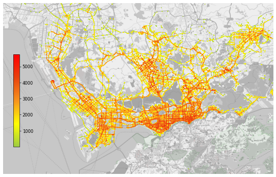

# 复杂的数据处理任务应该如何切入
遇到任何复杂的问题时,要想办法把问题变成可以批量解决的编程问题
## 数据处理任务应该如何分解
在遇到数据处理任务的时候,首先应该思考最重要的问题是:  
>这个数据处理任务的输入和输出是什么?

具体来说,我们有什么样的数据?数据是如何存储的?我们要得到什么的结果?结果的数据是什么形式的?  
``
输入(数据形式是怎么样存储的)---数据分析任务---->输出(数据形式是怎么存储的)
``
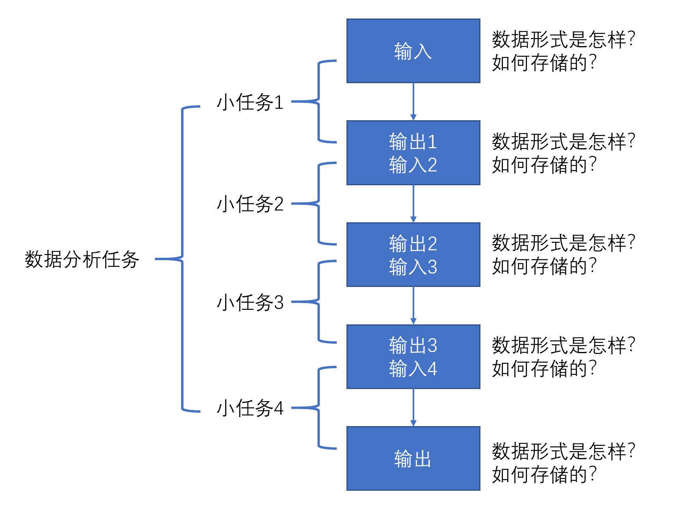

