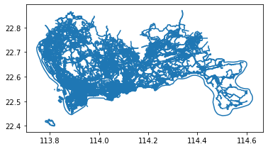

# 轨道客流可视化
GIS文件:  
1. 上海轨道2号线-线性
2. 上海轨道2号线-站点

数据:
1. 上海轨道2号线-断面客流(数据虚构)

## 读取数据


```python
import geopandas as gpd
shp = '/home/liu/Documents/pygeo-tutorial/shapefile/metroline2/metroline2.shp'
line = gpd.GeoDataFrame.from_file(shp,encoding = 'utf-8')
line
```

</style>
<table border="1" class="dataframe">
  <thead>
    <tr style="text-align: right;">
      <th></th>
      <th>city</th>
      <th>linename</th>
      <th>geometry</th>
    </tr>
  </thead>
  <tbody>
    <tr>
      <th>0</th>
      <td>上海</td>
      <td>地铁2号线(徐泾东-浦东国际机场)</td>
      <td>LINESTRING (121.29660 31.19123, 121.30094 31.1...</td>
    </tr>
    <tr>
      <th>1</th>
      <td>上海</td>
      <td>地铁2号线(浦东国际机场-徐泾东)</td>
      <td>LINESTRING (121.80240 31.15162, 121.80132 31.1...</td>
    </tr>
  </tbody>
</table>
</div>


```python
line.plot()
```


    <AxesSubplot:>

.png)


```python
import pandas as pd
stop = pd.read_csv('/home/liu/Documents/pygeo-tutorial/data-sample/metrostop2.csv')
stop.head(5)    
```

</style>
<table border="1" class="dataframe">
  <thead>
    <tr style="text-align: right;">
      <th></th>
      <th>stationnames</th>
      <th>linename</th>
      <th>lon</th>
      <th>lat</th>
    </tr>
  </thead>
  <tbody>
    <tr>
      <th>0</th>
      <td>徐泾东</td>
      <td>地铁2号线(徐泾东-浦东国际机场)</td>
      <td>121.294879</td>
      <td>31.190269</td>
    </tr>
    <tr>
      <th>1</th>
      <td>虹桥火车站</td>
      <td>地铁2号线(徐泾东-浦东国际机场)</td>
      <td>121.316980</td>
      <td>31.195925</td>
    </tr>
    <tr>
      <th>2</th>
      <td>虹桥2号航站楼</td>
      <td>地铁2号线(徐泾东-浦东国际机场)</td>
      <td>121.321726</td>
      <td>31.196596</td>
    </tr>
    <tr>
      <th>3</th>
      <td>淞虹路</td>
      <td>地铁2号线(徐泾东-浦东国际机场)</td>
      <td>121.354842</td>
      <td>31.220001</td>
    </tr>
    <tr>
      <th>4</th>
      <td>北新泾</td>
      <td>地铁2号线(徐泾东-浦东国际机场)</td>
      <td>121.369405</td>
      <td>31.218306</td>
    </tr>
  </tbody>
</table>
</div>


```python
data = pd.read_csv('/home/liu/Documents/pygeo-tutorial/data-sample/metrodata-sample.csv',encoding = 'utf-8')
data.head(5)
```

</style>
<table border="1" class="dataframe">
  <thead>
    <tr style="text-align: right;">
      <th></th>
      <th>FROMSTATIONAME</th>
      <th>TOSTATIONAME</th>
      <th>FLOW</th>
    </tr>
  </thead>
  <tbody>
    <tr>
      <th>0</th>
      <td>徐泾东</td>
      <td>虹桥火车站</td>
      <td>1223</td>
    </tr>
    <tr>
      <th>1</th>
      <td>虹桥火车站</td>
      <td>徐泾东</td>
      <td>1785</td>
    </tr>
    <tr>
      <th>2</th>
      <td>虹桥火车站</td>
      <td>虹桥2号航站楼</td>
      <td>4333</td>
    </tr>
    <tr>
      <th>3</th>
      <td>虹桥2号航站楼</td>
      <td>虹桥火车站</td>
      <td>4851</td>
    </tr>
    <tr>
      <th>4</th>
      <td>虹桥2号航站楼</td>
      <td>淞虹路</td>
      <td>4105</td>
    </tr>
  </tbody>
</table>
</div>

## 对一个方向的轨道线进行GIS处理
先取一个方向的轨道线数据


```python
linename = line['linename'].drop_duplicates().iloc[1]#去除重复数据
linename
```


    '地铁2号线(浦东国际机场-徐泾东)'


```python
stop_1 = stop[stop['linename'] == linename]
line_1 = line[line['linename'] == linename]
```


```python
#站点的数据还不是geopandas,下面来创建一下geopandas
from shapely.geometry import Point,Polygon
stop_1['geometry'] = stop_1.apply(lambda r:Point(r['lon'],r['lat']),axis = 1)
stop_1 = gpd.GeoDataFrame(stop_1)
stop_1.plot()
```

    /home/liu/miniconda3/lib/python3.7/site-packages/ipykernel_launcher.py:3: SettingWithCopyWarning: 
    A value is trying to be set on a copy of a slice from a DataFrame.
    Try using .loc[row_indexer,col_indexer] = value instead
    
    See the caveats in the documentation: https://pandas.pydata.org/pandas-docs/stable/user_guide/indexing.html#returning-a-view-versus-a-copy
      This is separate from the ipykernel package so we can avoid doing imports until
    
    <AxesSubplot:>


```python
#首先我们来将轨道切成段
#把点和线都变成整体
#对geopandasframe执行unary_union操作后,他们都会变成一个shapely的geometry对象
stop_1_geo = stop_1.unary_union#通过unary_union属性，我们可以将一整列矢量合并为单独的一个shapely矢量对象
line_1_geo = line_1.unary_union
#切分
from shapely.ops import split
#用shapely的split功能切分线,这里,因为点的位置不一定在线上(就算在线上,由于小数点取值的问题也可能不会精确的在线上)
#所以,对点进行buffer以后,再用buffer来切分线
split_line = split(line_1_geo,stop_1_geo.buffer(0.0008))
#buffer用于缓冲区的创建,缓冲区用于表示点、线、面等矢量数据的影响范围或服务范围，思想很简单，即为矢量数据拓展出一定宽度的边
split_line
```


```python
len(stop_1)
```


    30

用切分的线段生成geodataframe


```python
splited_line = gpd.GeoDataFrame({'geometry':split_line})
splited_line['linename'] = linename
splited_line.plot()
```


    <AxesSubplot:>


```python
splited_line.head(5)
```

</style>
<table border="1" class="dataframe">
  <thead>
    <tr style="text-align: right;">
      <th></th>
      <th>geometry</th>
      <th>linename</th>
    </tr>
  </thead>
  <tbody>
    <tr>
      <th>0</th>
      <td>LINESTRING (121.80240 31.15162, 121.80213 31.1...</td>
      <td>地铁2号线(浦东国际机场-徐泾东)</td>
    </tr>
    <tr>
      <th>1</th>
      <td>LINESTRING (121.80213 31.15237, 121.80132 31.1...</td>
      <td>地铁2号线(浦东国际机场-徐泾东)</td>
    </tr>
    <tr>
      <th>2</th>
      <td>LINESTRING (121.79306 31.16992, 121.79252 31.1...</td>
      <td>地铁2号线(浦东国际机场-徐泾东)</td>
    </tr>
    <tr>
      <th>3</th>
      <td>LINESTRING (121.79214 31.17123, 121.79060 31.1...</td>
      <td>地铁2号线(浦东国际机场-徐泾东)</td>
    </tr>
    <tr>
      <th>4</th>
      <td>LINESTRING (121.75189 31.20151, 121.75123 31.2...</td>
      <td>地铁2号线(浦东国际机场-徐泾东)</td>
    </tr>
  </tbody>
</table>
</div>

切分之后的每一段地铁线路,我们需要添加信息表示它是从哪个站到哪个站,这样,下一步就可以将流量数据匹配上,我们要把线断的起点和终点匹配到最近的站点


```python
lineshp = splited_line.geometry.iloc[1]
lineshp
```


```python
#起点坐标是
startlon,startlat = lineshp.coords[0]
#终点坐标是
endlon,endlat = lineshp.coords[-1]
```

找到各轨道线匹配最近的站点信息


```python
def getstartendstation(lineshp,stop_1):
    #每段轨迹起点\终点坐标计算
    startlon,startlat = lineshp.coords[0]
    endlon,endlat = lineshp.coords[-1]
    #在stop_1中出离终点和起点最近的站点
    stop_1['dis'] = abs(stop_1['lon']-startlon)+abs(stop_1['lat']-startlat)
    start = stop_1[stop_1['dis'] == stop_1['dis'].min()]['stationnames'].iloc[0]

    stop_1['dis'] = abs(stop_1['lon']-endlon)+abs(stop_1['lat']-endlat)
    end = stop_1[stop_1['dis'] == stop_1['dis'].min()]['stationnames'].iloc[0]
    
    return start,end
```


```python
station_a = []
station_b = []
for i in range(0,len(splited_line)):
    lineshp = splited_line.geometry.iloc[i]
    start, end = getstartendstation(lineshp,stop_1)
    station_a.append(start)
    station_b.append(end)
splited_lines= splited_line.copy()
splited_lines['station_a'] = station_a[:]
splited_lines['station_b'] = station_b[:]
```


```python
splited_lines = pd.merge(splited_lines,data,left_on=['station_a','station_b'],right_on=['FROMSTATIONAME','TOSTATIONAME'])
```


```python
splited_lines = splited_lines.drop(['FROMSTATIONAME','TOSTATIONAME'],axis =1)#删掉多余的列
```


```python
splited_lines.head(5)
```

</style>
<table border="1" class="dataframe">
  <thead>
    <tr style="text-align: right;">
      <th></th>
      <th>geometry</th>
      <th>linename</th>
      <th>station_a</th>
      <th>station_b</th>
      <th>FLOW</th>
    </tr>
  </thead>
  <tbody>
    <tr>
      <th>0</th>
      <td>LINESTRING (121.80213 31.15237, 121.80132 31.1...</td>
      <td>地铁2号线(浦东国际机场-徐泾东)</td>
      <td>浦东国际机场</td>
      <td>海天三路</td>
      <td>746</td>
    </tr>
    <tr>
      <th>1</th>
      <td>LINESTRING (121.79214 31.17123, 121.79060 31.1...</td>
      <td>地铁2号线(浦东国际机场-徐泾东)</td>
      <td>海天三路</td>
      <td>远东大道</td>
      <td>825</td>
    </tr>
    <tr>
      <th>2</th>
      <td>LINESTRING (121.75030 31.20140, 121.74693 31.2...</td>
      <td>地铁2号线(浦东国际机场-徐泾东)</td>
      <td>远东大道</td>
      <td>凌空路</td>
      <td>864</td>
    </tr>
    <tr>
      <th>3</th>
      <td>LINESTRING (121.71896 31.19474, 121.71596 31.1...</td>
      <td>地铁2号线(浦东国际机场-徐泾东)</td>
      <td>凌空路</td>
      <td>川沙</td>
      <td>1201</td>
    </tr>
    <tr>
      <th>4</th>
      <td>LINESTRING (121.69296 31.18854, 121.69168 31.1...</td>
      <td>地铁2号线(浦东国际机场-徐泾东)</td>
      <td>川沙</td>
      <td>华夏东路</td>
      <td>2504</td>
    </tr>
  </tbody>
</table>
</div>


```python
splited_lines.plot()
```


    <AxesSubplot:>


首先，根据流量，对每一段分组，这个用我们之前的OD绘制时宽度的分组方法。
分10组，保存在linewidth中，最大的是1，最小的是0.1


```python
import numpy as np
#生成段
step = 10
splited_lines = splited_lines.sort_values(by = 'FLOW')
splited_lines['linewidth'] = (np.array(range(len(splited_lines)))*step/len(splited_lines)).astype(int)/step+0.1
splited_lines.head(5)
```

</style>
<table border="1" class="dataframe">
  <thead>
    <tr style="text-align: right;">
      <th></th>
      <th>geometry</th>
      <th>linename</th>
      <th>station_a</th>
      <th>station_b</th>
      <th>FLOW</th>
      <th>linewidth</th>
    </tr>
  </thead>
  <tbody>
    <tr>
      <th>0</th>
      <td>LINESTRING (121.80213 31.15237, 121.80132 31.1...</td>
      <td>地铁2号线(浦东国际机场-徐泾东)</td>
      <td>浦东国际机场</td>
      <td>海天三路</td>
      <td>746</td>
      <td>0.1</td>
    </tr>
    <tr>
      <th>1</th>
      <td>LINESTRING (121.79214 31.17123, 121.79060 31.1...</td>
      <td>地铁2号线(浦东国际机场-徐泾东)</td>
      <td>海天三路</td>
      <td>远东大道</td>
      <td>825</td>
      <td>0.1</td>
    </tr>
    <tr>
      <th>2</th>
      <td>LINESTRING (121.75030 31.20140, 121.74693 31.2...</td>
      <td>地铁2号线(浦东国际机场-徐泾东)</td>
      <td>远东大道</td>
      <td>凌空路</td>
      <td>864</td>
      <td>0.1</td>
    </tr>
    <tr>
      <th>3</th>
      <td>LINESTRING (121.71896 31.19474, 121.71596 31.1...</td>
      <td>地铁2号线(浦东国际机场-徐泾东)</td>
      <td>凌空路</td>
      <td>川沙</td>
      <td>1201</td>
      <td>0.2</td>
    </tr>
    <tr>
      <th>28</th>
      <td>LINESTRING (121.31618 31.19590, 121.31323 31.1...</td>
      <td>地铁2号线(浦东国际机场-徐泾东)</td>
      <td>虹桥火车站</td>
      <td>徐泾东</td>
      <td>1785</td>
      <td>0.2</td>
    </tr>
  </tbody>
</table>
</div>


```python
#新建一个变量,splited_duan来存储生成的面
splited_duans = splited_lines.copy()
#设定一下我们想要的面宽度
kuandu = 0.005
r = splited_lines.iloc[0]
theline = r['geometry']
theline 
```


```python
offsetline = r['geometry'].parallel_offset(kuandu*r['linewidth'],join_style = 3)
#返回距对象右侧或左侧一定距离的LineString或MultiLineString几何
offsetline
```


```python
ply = Polygon(np.append(np.array(theline.coords),
        np.array(offsetline.coords)).reshape(-1,2))
#reshape(-1, n) 函数， 表示将此矩阵或者数组重组，以 m行n列的形式表示
ply
```


OK，下一步，对每一段都应用上面的方法，把生成的polygon放到一个list变量里然后赋值给splited_duans的geometry


```python
geo = []


for i in range(len(splited_lines)):
    r = splited_lines.iloc[i]
    ply = Polygon(np.append(np.array(r['geometry'].coords),
    np.array(r['geometry'].parallel_offset(kuandu*r['linewidth'],join_style = 3).coords)).reshape(-1,2))
    geo.append(ply)

splited_duans['geometry'] = geo
```


```python
splited_duans.plot()
```


    <AxesSubplot:>


```python
splited_duans1 = splited_duans.copy()
```


```python
#把另一个方向的轨道也算出来
#取另一个方向的数据
linename2 = line['linename'].drop_duplicates().iloc[0]
stop_2 = stop[stop['linename'] == linename2]
line_2 = line[line['linename'] == linename2]
#创建geopandas
from shapely.geometry import Point,Polygon
stop_2['geometry'] = stop_2.apply(lambda r:Point(r['lon'],r['lat']),axis = 1)
stop_2 = gpd.GeoDataFrame(stop_2)
#首先来将轨道切成段,把点和线都变成整体
#对geopandasframe执行unary_union操作后,他们都会变成一个shapely的geometry对象
stop_2_geo = stop_2.unary_union#通过unary_union属性，我们可以将一整列矢量合并为单独的一个shapely矢量对象
line_2_geo = line_2.unary_union
#切分
from shapely.ops import split
split_line2 = split(line_2_geo,stop_2_geo.buffer(0.0008))
splited_line2 = gpd.GeoDataFrame({'geometry':split_line})
splited_line2['linename'] = linename2
#找到各轨道线匹配最近的站点信息
station_a = []
station_b = []
for i in range(0,len(splited_line2)):
    lineshp = splited_line.geometry.iloc[i]
    start, end = getstartendstation(lineshp,stop_2)
    station_a.append(start)
    station_b.append(end)
splited_lines2= splited_line2.copy()
splited_lines2['station_a'] = station_a[:]
splited_lines2['station_b'] = station_b[:]
#
splited_lines2 = pd.merge(splited_lines2,data,left_on=['station_a','station_b'],right_on=['FROMSTATIONAME','TOSTATIONAME'])
splited_lines2 = splited_lines2.drop(['FROMSTATIONAME','TOSTATIONAME'],axis =1)#删掉多余的列
#根据流量，对每一段分组，这个用之前的OD绘制时宽度的分组方法
step = 10
splited_lines2 = splited_lines2.sort_values(by = 'FLOW')
splited_lines2['linewidth'] = (np.array(range(len(splited_lines2)))*step/len(splited_lines2)).astype(int)/step+0.1
#新建一个变量,splited_duan来存储生成的面
splited_duans2 = splited_lines2.copy()
#设定一下我们想要的面宽度
kuandu = 0.005
r = splited_lines2.iloc[0]
theline = r['geometry']
#把生成的polygon放到一个list变量里然后赋值给splited_duans的geometry
geo2 = []
for i in range(len(splited_lines2)):
    r = splited_lines2.iloc[i]
    ply = Polygon(np.append(np.array(r['geometry'].coords),
    np.array(r['geometry'].parallel_offset(kuandu*r['linewidth'],join_style = 3).coords)).reshape(-1,2))
    geo2.append(ply)
    
splited_duans2['geometry'] = geo2

splited_duans2.plot()
```

    /home/liu/miniconda3/lib/python3.7/site-packages/ipykernel_launcher.py:8: SettingWithCopyWarning: 
    A value is trying to be set on a copy of a slice from a DataFrame.
    Try using .loc[row_indexer,col_indexer] = value instead
    
    See the caveats in the documentation: https://pandas.pydata.org/pandas-docs/stable/user_guide/indexing.html#returning-a-view-versus-a-copy


    <AxesSubplot:>


## 可视化出图


```python
#设定显示范围
lat1sh = 30.8666667;
lat2sh = 31.5833333;
lon1sh = 121.066667;
lon2sh = 122.0;
bounds = [lon1sh+0.2,lat1sh+0.2,lon2sh-0.2,lat2sh-0.3]

import plot_map
#导入必要的包
import pandas as pd
import numpy as np
#绘制图用的包
import matplotlib as mpl
import matplotlib.pyplot as plt
#geopandas包
import geopandas

#定义画的大小
fig     = plt.figure(1,(10,8),dpi = 100)    
ax      = plt.subplot(111)
plt.sca(ax)

#plot_map包绘制背景图
plot_map.plot_map(plt,bounds,zoom = 12,style = 4)

#设定colormap
cmap = mpl.colors.LinearSegmentedColormap.from_list('cmap', ['#9DCC42','#FFFE03','#F7941D','#E9420E','#FF0000'], 256)
vmax = splited_duans['FLOW'].max()

#把前面搞出来的画上去
splited_duans1.plot(ax=ax, column='FLOW', lw=4, cmap=cmap,vmin = 0,vmax = vmax)
splited_duans2.plot(ax=ax, column='FLOW', lw=4, cmap=cmap,vmin = 0,vmax = vmax)

# 加比例尺和指北针
plot_map.plotscale(ax,bounds = bounds,textsize = 10,compasssize = 1,accuracy = 1000,rect = [0.06,0.06])

#设定显示范围
plt.axis('off')
plt.xlim(bounds[0],bounds[2])
plt.ylim(bounds[1],bounds[3])

#绘制colorbar
plt.imshow([[0,vmax]], cmap=cmap)
cax = plt.axes([0.03, 0.35, 0.02, 0.3])
plt.colorbar(cax=cax)

plt.show()
```

    imgsavepath do not exist, your tile map will not save


# 用道路切分地块！shapely的线转面处理
用路网和行政区划数据生成地块矢量

## 读取数据


```python
#导入必要的包
import pandas as pd
import numpy as np

#绘制图用的包
import matplotlib as mpl
import matplotlib.pyplot as plt

#geopandas包
import geopandas

#shapely包
from shapely.geometry import Point,Polygon,shape

#读取shapefile文件
shp = '/home/liu/Documents/pygeo-tutorial/shapefile/sz.shp'
sz = geopandas.GeoDataFrame.from_file(shp,encoding = 'utf-8')

#绘制看看长什么样
sz.plot()
```


    <AxesSubplot:>


```python
sz = sz.unary_union
sz
```

-1638101969575114.svg)


```python
#路网
shp = r'/home/liu/Documents/pygeo-tutorial/shapefile/shenzhen_osmroad.shp'
road = geopandas.GeoDataFrame.from_file(shp,encoding = 'utf-8')

#绘制看看长什么样
road.plot()
```


    <AxesSubplot:>

.png)


## 开始
首先我们将路网的线和行政区划的面的边界组合到一起


```python
lines = list(road['geometry'])+list(sz.boundary)
geopandas.GeoDataFrame({'geometry':lines}).plot()
```


    <AxesSubplot:>





```python
import shapely
#第一个操作：把相邻的线合成到一起，即A的起点和B终点在同一个位置，那么把AB合成一起（如果不这样做，后面得到的结果可能会在AB端点处打断，但AB端点不一定是交点）
merged_lines = shapely.ops.linemerge(lines)
#第二个操作：合并为整体，但是实际上是线段的组合，会在交点处打断
border_lines = shapely.ops.unary_union(merged_lines)
#上面两个操作连起来实现的功能就是在交点处打断线
#第三个操作：生成线段所组成的面
decomposition = shapely.ops.polygonize_full(border_lines)
```


```python
decomposition
```


    (<shapely.geometry.collection.GeometryCollection at 0x7f1e86704290>,
     <shapely.geometry.collection.GeometryCollection at 0x7f1e85dbd410>,
     <shapely.geometry.collection.GeometryCollection at 0x7f1e85dbd250>,
     <shapely.geometry.collection.GeometryCollection at 0x7f1e85dbd3d0>)


```python
decomposition[0][0]
```

.svg)


```python
area = geopandas.GeoDataFrame({'geometry':list(decomposition[0])})
```


```python
area1 = area.buffer(-0.00015)
#经纬度的1°大约等于111.111km，也就是说
#这里设定的0.00015大约是
#0.00015*1000*111.111 = 16.66665m

#接下来把buffer一下就没了的面删除
area1 = area1[-area1.is_empty]

#生成一个新的gdf
area1 = geopandas.GeoDataFrame({'geometry':area1})
```


```python
area1.plot()
```


    <AxesSubplot:>

.png)


提取每个地块的中心点


```python
areacentroid = area1.copy()
areacentroid['geometry'] = area1.centroid
areacentroid.plot()
```


    <AxesSubplot:>

.png)

```python
#放大看看
lat1sh = 22.499;
lat2sh = 22.564;
lon1sh = 114.026;
lon2sh = 114.103;
bounds = [lon1sh,lat1sh,lon2sh,lat2sh]

import matplotlib as mpl
import matplotlib.pyplot as plt
import plot_map
import seaborn as sns
fig     = plt.figure(1,(10,10),dpi = 100)      
ax      = plt.subplot(111)
plt.sca(ax)
fig.tight_layout(rect = (0.05,0.1,1,0.9))

#背景
plot_map.plot_map(plt,bounds,zoom = 14,style = 4)

#绘制地块
area1.plot(ax = ax,edgecolor = (0,0,0,1),facecolor = (0,0,0,0.5))
#绘制地块中心点
areacentroid.plot(ax = ax,markersize = 1,color = 'red')


plt.axis('off')
plt.xlim(bounds[0],bounds[2])
plt.ylim(bounds[1],bounds[3])

plt.show()
```

    imgsavepath do not exist, your tile map will not save


# 利用osmnx与plot_map计算并可视化街道方向

本文的方向熵是指一个区域内所有街道的方向的混乱程度


```python
import osmnx as ox
import matplotlib.pyplot as plt
import geopandas as gpd
import pandas as pd
import numpy as np
from plot_map import plot_map
import math
```

方向熵的计算公式为:
$$H = -\sum_{i=1}^nP(O_i)log_eP(O_i)$$

$P(O_i)$指方向在第i个方向街道的比例(这里将街道的方向分为了36类,将正北设置为0度,以10度为间隔创建36个区间,我们就认为它的方向就在这个区间)


```python
def reverse_bearing(x):
    return x + 180 if x < 180 else x - 180 
```


```python
def count_and_merge(n, bearings):
    # make twice as many bins as desired, then merge them in pairs
    # prevents bin-edge effects around common values like 0° and 90°
    n = n * 2
    bins = np.arange(n + 1) * 360 / n
    count, _ = np.histogram(np.array(bearings), bins=bins)
    
    # move the last bin to the front, so eg 0.01° and 359.99° will be binned together
    count = np.roll(count, 1)
    return count[::2] + count[1::2]
```


```python
def calculate_entropy(count):
    count_p = count/count.sum()
    entropy = 0
    for i in count_p:
        entropy -= i*math.log(i)
    return entropy 
```


```python
# function to draw a polar histogram for a set of edge bearings
def polar_plot(ax, bearings, n=36, title=''):

    bins = np.arange(n + 1) * 360 / n
    count = count_and_merge(n, bearings)
    _, division = np.histogram(bearings, bins=bins)
    frequency = count / count.sum()
    division = division[0:-1]
    width =  2 * np.pi / n

    ax.set_theta_zero_location('N')
    ax.set_theta_direction('clockwise')

    x = division * np.pi / 180
    bars = ax.bar(x, height=frequency, width=width, align='center', bottom=0, zorder=2,
                  color='#003366', edgecolor='k', linewidth=0.5, alpha=0.7)
    
    ax.set_ylim(top=frequency.max())
    
    title_font = {'family':'DejaVu Sans', 'size':24, 'weight':'bold'}
    xtick_font = {'family':'DejaVu Sans', 'size':10, 'weight':'bold', 'alpha':1.0, 'zorder':3}
    ytick_font = {'family':'DejaVu Sans', 'size': 9, 'weight':'bold', 'alpha':0.2, 'zorder':3}
    
    ax.set_title(title.upper(), y=1.05, fontdict=title_font)
    
    ax.set_yticks(np.linspace(0, max(ax.get_ylim()), 5))
    yticklabels = ['{:.2f}'.format(y) for y in ax.get_yticks()]
    yticklabels[0] = ''
    ax.set_yticklabels(labels=yticklabels, fontdict=ytick_font)
    
    xticklabels = ['N', '', 'E', '', 'S', '', 'W', '']
    ax.set_xticklabels(labels=xticklabels, fontdict=xtick_font)
    ax.tick_params(axis='x', which='major', pad=-2)
```


```python
sh = gpd.read_file('/home/liu/Documents/pygeo-tutorial/shapefile/shanghai_shp/区县界_area.shp')
```

下面开始下载上海市各个区的路网数据,并计算每个区的路网的方向熵


```python
### 创造一个空的GeoDataFrame，用来储存我们即将下载的各个区的路网数据
sh_road = gpd.GeoDataFrame(columns = ['u', 'v', 'key', 'osmid', 'name', 'highway', 'oneway', 'length',
       'geometry', 'bridge', 'ref', 'lanes', 'maxspeed', 'access', 'tunnel',
       'junction','district'])

### 创造一个空的列表，用来存放各个区内各个街道的方向
sh_orientation_count = []

### 写一个循环，遍历上海的每个区，依次获取并处理路网数据
for i in sh.index:
    
    ### 利用osmnx，获取每个区的路网数据（可以通行小汽车的路网）
    G = ox.graph_from_polygon(sh.loc[i,'geometry'],network_type='drive')
    #sh.loc[i,'三岔路口比例'] = ox.stats.basic_stats(G)['streets_per_node_proportion'][3]
    #sh.loc[i,'十字路口比例'] = ox.stats.basic_stats(G)['streets_per_node_proportion'][4]
    
    ### 上一步获取的路网数据格式为networkx中的graph格式，这里我们将它转换成GeoDataFrame
    road_gdf = ox.graph_to_gdfs(G)[1]
    
    ### 并为路网赋上相应的行政区信息（属于哪个区）
    road_gdf['district'] = sh.loc[i,'NAME']
    ### 将每个区的路网添加至总的路网数据中
    sh_road = sh_road.append(road_gdf,ignore_index=True)
    
    ### 利用osmnx的add_edge_bearings函数为路网的边添加方向属性
    Gu = ox.add_edge_bearings(ox.get_undirected(G))
    
    ### 将边的方向属性都提取出来，存在一个Series中
    b = pd.Series([d['bearing'] for u, v, k, d in Gu.edges(keys=True, data=True)])
    
### 为边添加另一个方向的方向属性（+-180度）（因为路都是直线，如果从a端点到b端点与正北的夹角为30度，那么b端点到a端点与正北的夹角就是210度
    b = pd.concat([b, b.map(reverse_bearing)]).reset_index(drop=True).dropna()
    
    ### 将提取出来的方向属性添加到总的方向数据中
    sh_orientation_count.append(b)
    
    ### 计算每个区的街道的方向熵，并直接储存在上海的GeoDataFrame中
    sh.loc[i,'方向熵'] = calculate_entropy(count_and_merge(36,b))
    
    print('{}处理完毕'.format(sh.loc[i,'NAME']))
```

经过操作我们可以得到:
1. 上海的GeoDataFrame，储存了每个区的geometry和方向熵的具体数值
2. 上海的路网数据GeoDataFrame，储存了上海每个区的路网数据，有一个district字段专门来标记每条道路属于哪个区
3. 上海各个区的道路方向的集合（列表形式），储存了每个区内所有路网的方向

首先我们从上海的GeoDataFrame中提取每个区的方向熵，然后根据区的名称的字段，将其与上海路网数据的GeoDataFrame进行连接

这样我们可以为路网数据的GeoDataFrame添加一个方向熵的字段，代表每条道路所在区的路网的方向熵


```python
##提取街道名称与方向熵字段
sh_district_entropy = sh.loc[:,['NAME','方向熵']]
```


```python
##改一下名字,方便连接
sh_district_entropy.columns = ['district','方向熵']
```


```python
##根据district字段进行连接
sh_road = pd.merge(sh_road,sh_district_entropy,on='district',how = 'outer')
```


```python
sh_bounds = [120.79560279980944,30.623112899720564,122.03020320013769, 31.925845100091397]
```


```python
###开始绘图,先设置上海的行政区作为底图
base = sh.plot(figsize=(10,10),facecolor='none',edgecolor='black',lw=0.6)

###然后在底图上绘制路网地图,并以每条道路所在区的方向熵大小为路网赋予颜色(cmap操作)
sh_road.plot(ax=base,column='方向熵',lw=0.4,legend=True,legend_kwds={'shrink':0.7,'label':'Entropy'})

###标记方向熵大于75%分位数的区的名称
for i in sh.index:
    if sh.loc[i,'方向熵'] >= sh['方向熵'].quantile(0.75):
        plt.text(sh.loc[i,'geometry'].centroid.x,sh.loc[i,'geometry'].centroid.y,sh.loc[i,'NAME'],fontdict={'family':'Arial Unicode MS','size':10},horizontalalignment='center',verticalalignment='center')

### 调用plot_map添加osm的底图
plot_map(plt,sh_bounds,zoom=14,style=4)

### 关闭坐标轴，更好看
base.axis('off')

### 保存图片
plt.savefig('sh_entropy_plot.jpg',dpi=70,bbox_inches='tight')

plt.show()
```


