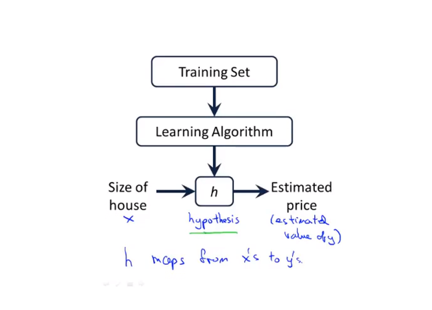
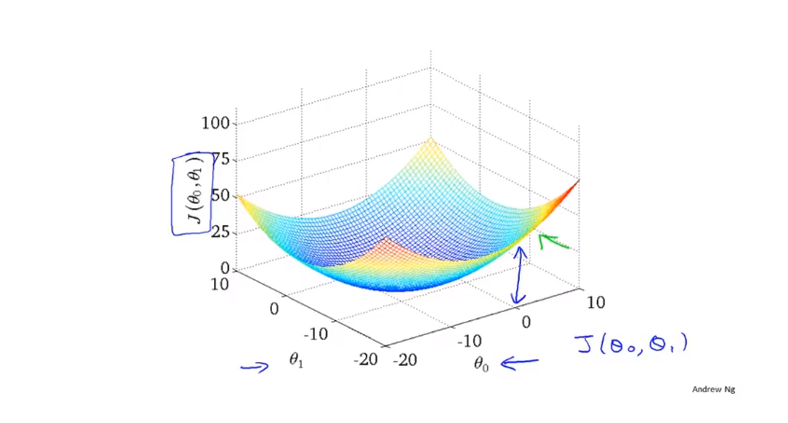
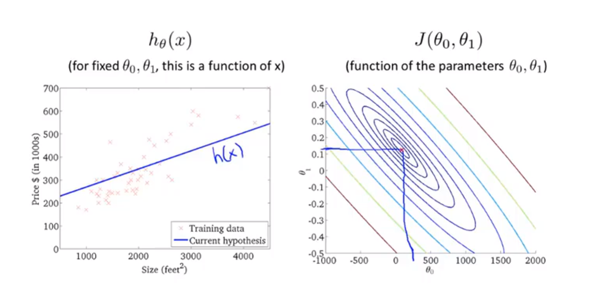
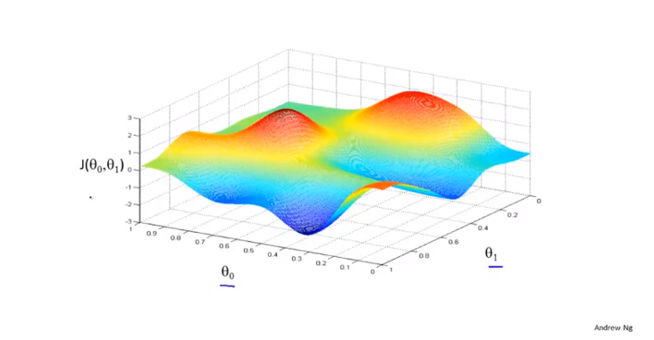
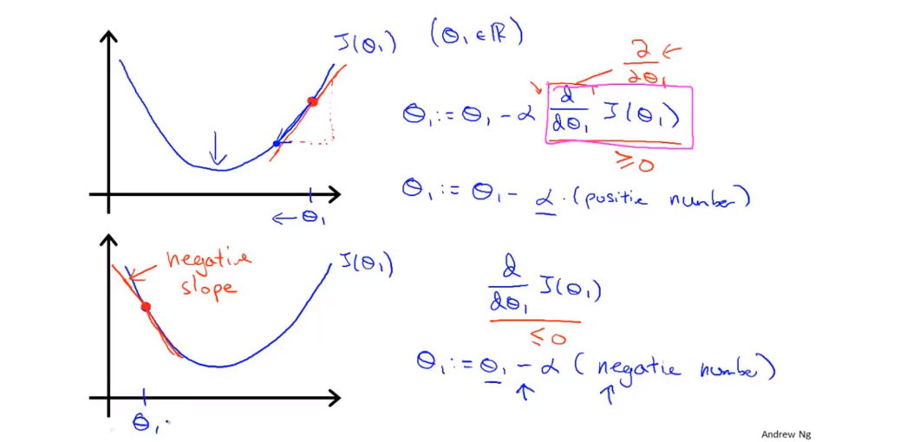
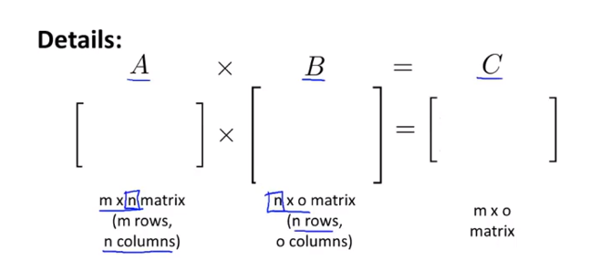
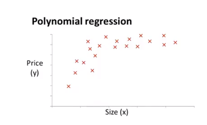
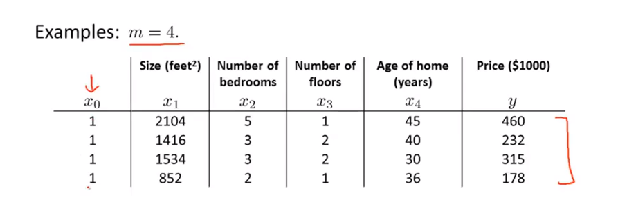

### 1 欢迎

#### 1.1 什么是机器学习
 A computer program is said to learn from experience E with respect  to some task T and some performance measure P, if its performance on T, as measured by P, improves with experience E.
Supervised learning 监督学习
监督学习是指我们给算法一个数据集，其中包含了正确的答案（回归问题、分类问题 ）
Unsupervisef learning  无监督学习
聚类算法：探究数据集中的数据结构，数据是没有什么标签的，将数据进行归类
强化学习：是指智能系统在与环境的连续互动中学习最优行为测略的机器学习问题，本质是学习最优打序管决策

### 2 单变量线性回归

#### 2.1 代价函数
$$
h_\theta(x)=\theta_0+\theta_1x
$$

把$\theta$称为模型参数 Parameter
假设函数不同，参数也不同
在线性回归中，训练集给出一些点，我们要选择最能拟合的假设函数，合理预测y值
$$\sum^m_{i=1}(h_\theta(x^{(i)-y^{(i)}}))^2$$
预测值和实际值的差的平方误差和或者说预测价格与实际卖出价格的差的平方。m是训练集的容量。
代价函数也称平均误差函数，可写作
$$J(\theta_0,\theta_1)=\frac{1}{2m}\sum^m_{i=1}(h_\theta(x^{(i)-y^{(i)}}))^2$$
我们要做的是关于$\theta_0$和$\theta_1$对函数$J(\theta_0,\theta_1)$求最小值。 
Hypothesis: $h_\theta(x)=\theta_0+\theta_1x$ 
Parameters: $\theta_0,\theta_1$ 
Cost Function: $J(\theta_0,\theta_1)=\frac{1}{2m}\sum^m_{i=1}(h_\theta(x^{(i)})-y^{(i)})^2$ 
Goal: $minimize_{\theta_0,\theta_1} J(\theta_0,\theta_1)$ 
代价函数=优化目标 

#### 2.2 梯度下降
用梯度下降算法最小化任意函数J 
Have some function $J(\theta_0,\theta_1)$ 
Want $min{J(\theta_0,\theta_1})$ 
**Outline:**

* Start with some $\theta_0,\theta_1$
* Keep changing $\theta_0,\theta_1$ to reduce $J(\theta_0,\theta_1)$ until we hopefully end up at a minimum
  

$\theta_0$和$\theta_1$在水平轴上，函数J在垂直坐标轴上，图形表面高度则是J的值。我们从$\theta_0$和$\theta_1$的某个值出发，对其两个赋初值，从这个函数表面的某个点出发。  
Gradient descent algorithm  
repeat until convergence{ 
$$\theta_j:=\theta_j-\alpha\frac{\partial}{\partial\theta_j}J(\theta_0,\theta_1)\quad(for\quad j=0 \quad and \quad j=1)$$
}  

Corret: Simultaneous update 
$temp0:=\theta_0-\alpha\frac{\partial}{\partial\theta_0}J(\theta_0,\theta_1)$ 
$temp1:=\theta_1-\alpha\frac{\partial}{\partial\theta_1}J(\theta_0,\theta_1)$ 
$\theta_0:=temp0$ 
$\theta_1:=temp1$ 
用“:=”表示赋值，是一个赋值运算符，这里的$\alpha$是一个被称为学习率的数字，用来控制，梯度下降时，我们迈出多大的步子。 
我们要同时更新$\theta_0,\theta_1$，同步更新 
导数项代表该点的斜率

$\theta_1:=\theta_1\alpha\frac{\partial}{\partial\theta_1}J(\theta_1)$  
If $\alpha$ is too small,gradient descent can be slow.
If $\alpha$ is too large,gradient descent can overshoot the minimum. It may fail to converge, or even diverge.

#### 2.3 线性回归的梯度下降
将梯度函数和代价函数结合得到线性回归的算法  
Gradient descent algorithm  
repeat until convergence{ 
$$\theta_j:=\theta_j-\alpha\frac{\partial}{\partial\theta_j}J(\theta_0,\theta_1)\quad(for\quad j=0 \quad and \quad j=1)$$
}  
Linear Regression Model
Hypothesis:
$$h_\theta(x)=\theta_0+\theta_1x$$  
Cost Function: 
$$J(\theta_0,\theta_1)=\frac{1}{2m}\sum^m_{i=1}(h_\theta(x^{(i)})-y^{(i)})^2$$  
关键问题在导数项：
$$\frac{\partial}{\partial\theta_j}J(\theta_0,\theta_1) = \frac{\partial}{\partial\theta_j}\frac{1}{2m}\sum^m_{i=1}(h_\theta(x^{(i)-y^{(i)}}))^2=\frac{\partial}{\partial\theta_j}\frac{1}{2m}\sum^m_{i=1}(\theta_0+\theta_1x^{i}-y^{i})^2$$  
$$j=0 : \frac{\partial}{\partial\theta_0}J(\theta_0,\theta_1)=\frac{1}{m}\sum^m_{i=1}(h_\theta(x^{(i)})-y^{(i)})$$
$$j=1 : \frac{\partial}{\partial\theta_1}J(\theta_0,\theta_1)=\frac{1}{m}\sum^m_{i=1}(h_\theta(x^{(i)})-y^{(i)})x^{(i)}$$  
不断重复同步更新：  
repeat until convergence
$$\theta_0:=\theta_0-\alpha\frac{1}{m}\sum^m_{i=1}(h_\theta(x^{(i)})-y^{(i)})$$
$$\theta_1=\frac{1}{m}\sum^m_{i=1}(h_\theta(x^{(i)})-y^{(i)})x^{(i)}$$
我们学习出的算法叫做：Batch梯度下降法 

### 3 线性代数回顾

#### 3.1 矩阵和向量
矩阵：由数字组成的阵列，并写在方括号里  
矩阵的维数应该写作：行*列  
向量：n*1行的矩阵，有n个元素，R^n  
一般用大写字母表示矩阵  

#### 3.2 加法和标量乘法
加法：
$$\begin{bmatrix} 1 & 0 \\ 2 & 5 \\ 3 & 1\end{bmatrix}+\begin{bmatrix} 4 & 0.5 \\ 2 & 5 \\ 0 & 1\end{bmatrix}=\begin{bmatrix} 5 & 0.5 \\ 4 & 10 \\ 3 & 2\end{bmatrix}$$
这两个矩阵的每一个元素都逐个相加  
标量乘法：  
将标量与矩阵中每一个元素相乘 

#### 3.3 矩阵向量乘法
一个矩阵与向量相乘
m\*n矩阵乘n\*1向量 等于m\*1向量   
To get $y_i$,multiply A's $i^{th}$ row with elements of vector x, and add them up.

#### 3.4 矩阵乘法
能够相乘的矩阵，需要满足矩阵的维度相互匹配  

#### 3.5 矩阵乘法的特征
标量的运算，乘法可以满足交换律，但是这个不能应用在矩阵运算中  
矩阵运算满足结合律
特征矩阵：Identity Matrix
$$\begin{bmatrix} 1 & 0 & 0\\ 0 & 1 & 0 \\ 0 & 0 &1\end{bmatrix}$$
对角线上都是1,其他位置都是0,对于任何矩阵A 
$$A\cdot I = I \cdot A = A$$

#### 3.6 逆和转置
如果A矩阵是一个m$\times$m的矩阵(square)，而且它存在一个逆矩阵，
$$AA^{-1}=A^{-1}A=I$$
$$\begin{bmatrix} 3 & 4 \\ 2 & 16 \end{bmatrix}\begin{bmatrix} 0.4 & -0.1 \\ -0.05 & 0.075 \end{bmatrix} = \begin{bmatrix} 1 & 0 \\ 0 & 1 \end{bmatrix} = I_{2\times 2}$$  
不存在逆矩阵的矩阵称作奇异矩阵  其值无限接近0  
转置矩阵：  
$$A=\begin{bmatrix} 1 & 2 & 0 \\ 3 & 5 & 9\end{bmatrix}$$
$$A^T=\begin{bmatrix} 1 & 3 \\ 2 & 5 \\ 0 & 9 \end{bmatrix}$$

### 4 多变量线性回归

#### 4.1 多功能
n = number of features  
$x^{(i)}$ = input(features) of i^{th} training example  
$x^{(i)}_j$ =value of feature j in i^{th} training example  

假设函数：
$$h_\theta(x)=\theta_0+\theta_1x_1+\theta_2x_2+...+\theta_nx_n$$
为了方便，定义 $x_0=1$
$$h_\theta(x)=\theta_0x_0+\theta_1x_1+\theta_2x_2+...+\theta_nx_n$$

#### 4.2 多元梯度下降法
假设函数：$h_\theta(x)=\theta^Tx\theta_0x_0+\theta_1x_1+\theta_2x_2+...+\theta_nx_n$  
参数： $\theta_0,\theta_1,...,\theta_n$  
代价函数：$J(\theta_0,\theta_1,...,\theta_n)=\frac{1}{2m}\sum^m_{i=1}(h_\theta(x^{(i)})-y^{(i)})^2$  
梯度下降：  
Repeat  
$$\theta_j:=\theta_j-\alpha\frac{\partial}{\partial\theta_j}J(\theta_0,...,\theta_n)$$  
simultaneously update for every j = 0,...,n  
New algorithm(n>=1);
Repeat  
$$\theta_j:=\theta_j-\alpha\frac{1}{m}\sum^m_{i=1}(h_\theta(x^{(i)})-y^{(i)})x^{(i)}$$  
同时更新$\theta_j$, j=1,2,...,n  
函数的特征需要保证相似的大小  
**Mean normalizaton**
Replace $x_i$ with $x_i-\mu_i(平均值)$ to make features have approximately zero mean  (Do not apply to $x_0=1$)  
例如$x_1$的范围是$0<x_1\leq2000$, $x2$的范围是$0<x_2\leq5$    
特征缩放  
$x_1=\frac{size-1000}{2000}$    
$x_2=\frac{bedrooms-2}{5}$
$$-0.5\leq x_1\leq0.5, -0.5 \leq x_2\leq0.5$$

怎么样选择学习率$\alpha$
#### 4.3 特征和多项目式回归
趋势可能是曲线，所以需要多项式，例如：
$$\theta_0+\theta_1x+\theta_2x^2$$

### 5 正规方程
对于某些线性回归问题，正规方程会给我们更好的方法来求得$\theta$的最优值。
使用解析的方式，跟递归不同，正规方程只需要一次就可求解  
$\theta\in R^{n+1} \quad J(\theta_0,\theta_1,...,\theta_m)=\frac{1}{2m}\sum^m_{i=1}(h_\theta(x^{(i)})-y{(i)})^2$
$$\frac{\partial}{\partial\theta_j}J(\theta)=...=0 \qquad (for\quad every\quad j)$$
solve for $\theta_0,\theta_1,..,\theta_n$  
增加一列

$x_0$，它的取值永远是1  
$X=\begin{bmatrix}1 & 2104 & 5 & 1 & 45 \\ 1 & 1416 & 3 & 2 & 40 \\ 1 & 1534 & 3 & 2 & 30 \\ 1 & 852 & 2 & 1 & 36\end{bmatrix}\qquad y=\begin{bmatrix}460 \\232 \\315 \\178 \end{bmatrix}$  
$$\theta=(X^TX)^{-1}X^Ty$$
使用正规方程不需要特征缩放，但递归下降算法适用于处理大量的数据，大于一万，小于一万用正规方程即可。    
在矩阵方程不可逆的时候，使用程序可以正常计算出来（伪逆），这是技术性进阶的数学原因。而不可能逆有两种原因，数值的单位不一样，还有就是样本数太少，想求的参数太多，这样可以删除某些多余的特征。  

