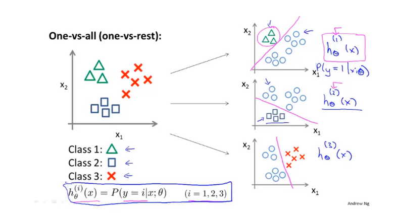
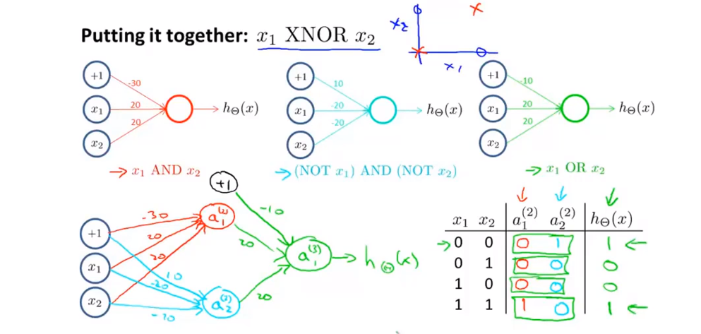
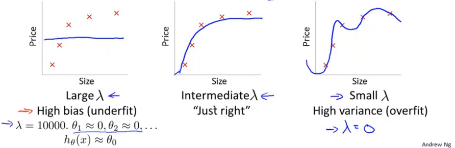
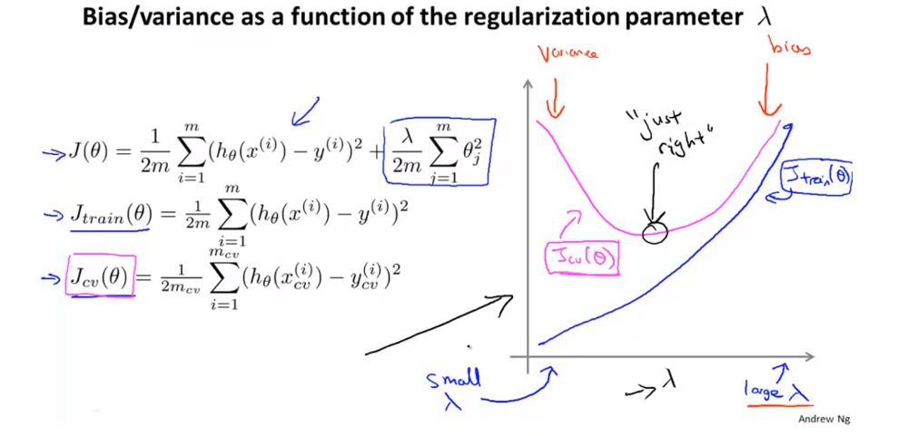

### 分类
分类问题，例如  
Email: 垃圾邮件/不是垃圾邮件  
Online：信息是真的/信息是假的  
Tumor：良性的/恶性的  
$y=\{0,1\}$   
0:Negative Class负类/1:Positive Class正类  

将分类器的输出$h_\theta(x)$阀值定位0.5  
如果$h_\theta\geq0.5$,预测'y=1'  
如果$h_\theta<0.5$,预测‘y=0’ 

#### 假设陈述
逻辑分类模型  
我们想要$0\leq h_\theta(x) \leq 1$  
$h_\theta(x)=g(\theta^Tx)$  
$g(z)=\frac{1}{1+e^{-z}}$ z是实数 ，g(z)一端趋向1一端趋向0。  
关于假设h(x)函数的解释：  
$h_\theta(x)$= 输入x对于y=1的估计概率  
举例：如果 $x=\begin{bmatrix}x_0 \\ x_1\end{bmatrix}=\begin{bmatrix}1 \\ tumorSize \end{bmatrix}$  
$h_\theta(x)=0.7$  
可以说明病人的肿瘤有70%的概率为恶性肿瘤。
当特征变量为x，变量的参数为$\theta$，可以表示‘y=1’或‘y=0’的概率为：  
$$h_\theta(x)=P(y=1|x;\theta)$$
$$P(y=0|x;\theta)+P(y=1|x;\theta)=1$$
$$P(y=0|x;\theta)=1-P(y=1|x;\theta)$$

#### 决策界限（decision boundary）
分类函数：  
$h_\theta(x)=g(\theta^Tx)=P(y=1|x;\theh 
ta)$  
$g(z)=\frac{1}{1+e^{-z}}$  

$g(z)\geq0.5$ when $z \geq 0$。$h_\theta(x)=g(\theta^Tx)\geq0.5$ when $\theta^T\geq0$  
假设：预测“y=1” 如果$h_\theta(x)\geq0.5$  
预测“y=0” 如果$h_\theta(x)<0.5$  

假设$h_\theta(x)=g(\theta_0+\theta x_1+\theta x_2)$,并且已知$\theta^T=\begin{bmatrix}-3 & 1 & 1\end{bmatrix}$  
可以预测"y=1", 如果 $-3+x_1+x_2\geq0$，也就是$x_1+x_2\geq3$  

$h_\theta(x)=g(\theta_0+\theta_1x_1+\theta_2x_2+\theta_3x_1^2+\theta_4x_4^2)$  
$\theta^T=\begin{bmatrix}-1 & 0 & 0 & 1 &1\end{bmatrix}$  
预测“y=1”，如果$-1+x_1^2+x_2^2\geq0$，可改写为$x_1^2+x_2^2\geq0$  
一旦有了参数$\theta$，决策边界就可以确定了。

#### 代价函数
训练集：{$(x^{(1)},y^{(1)}),(x^{(2)},y^{(2)}),...,(x^{(m)},y^{(m)})$}
m个特征 $x\in\begin{bmatrix}x_0\\x_1\\...\\x_n\end{bmatrix}$  
$x_0=1,y\in\{0,1\}$  
$$h_\theta(x)=\frac{1}{1+e^{-\theta^Tx}}$$
我们应该怎么去确定参数$\theta$呢？  
代价函数：  
线性回归：
$$J(\theta)=\frac{1}{m}\sum^m_{i=1}\frac{1}{2}(h_\theta(x^{(i)})-y^{(i)})^2$$  
平均误差平方可以写为：    
$$Cost(h_\theta(x^{(i)}),y^{(i)})=\frac{1}{2}(h_\theta(x^{(i)})-y^{(i)})^2$$
如果直接代入，画出代价函数（优化目标函数如左图，有很多局部最优，且是非凸函数）  
 
逻辑回归代价函数


搞错的代价是巨大的  


#### 简化代价函数与梯度下降
逻辑回归代价函数（优化目标函数）$$J(\theta)=\frac{1}{m}\sum^m_{i=1}Cost(h_\theta(x^{(i)}),y^{(i)})$$

$$Cost(h_\theta(x),y)=\begin{cases}
-log(h_\theta(x)&if&y=1\\
-log(1-h_\theta(x))&if&y=0
\end{cases}$$

Note:y=0 or 1 always 
简化$Cost(h_\theta(x),y)=-ylog(h_\theta(x))-(1-y)log(1-h_\theta(x))$ 
由此我们可以得到： 
$$J(\theta)=-\frac{1}{m}[\sum^m_{i-1}y^{(i)}logh_\theta(x^{(i)})+(1-y^{(i)})log(1-h_\theta(x^{(i)}))]$$
为了拟合出参数$\theta$,我们应该找出让$J(\theta)$取得最小值的参数$\theta$： 
$\min\limits_\theta J(\theta)$
得到了参数，当我们输入一组新的特征去预测时 
输出：$h_\theta(x)=\frac{1}{1+e^{-\theta^Tx}}$  
使用梯度下降法来找出代价函数的最小值
$$J(\theta)=-\frac{1}{m}[\sum^m_{i-1}y^{(i)}logh_\theta(x^{(i)})+(1-y^{(i)})log(1-h_\theta(x^{(i)}))]$$
想要得到$\min\limits_\theta J(\theta)$：  
Repeat{
$$\theta_j:\theta_j-\alpha\frac{\partial}{\partial\theta_j}J(\theta)=\theta_j-\alpha\sum^m_{i=1}(h_\theta(x^{(i)})-y^{(i)})x_j^{(i)}$$
(同时更新所有的$\theta_j$)  
}  
它与线性回归的参数求解公式一样，但是因为线性回归和逻辑回归所设定的假设函数不一样，一个是$h_\theta(x)=\theta^Tx$,一个是$h_\theta(x)=\frac{1}{1+e^{-\theta^Tx}}$.  

#### 高级优化
优化算法   
代价函数$J(\theta)$,想得到$\min\limits_\theta J(\theta)$  
当我们输入参数$\theta$的时候，我们可以使用代码计算  

* $J(\theta)$
* $\frac{\partial}{\partial\theta_j}J(\theta)\quad (for\quad j=0,1,2...,n)$
梯度下降：  
Repeat { 
$$\theta_j:\theta_j-\alpha\frac{\partial}{\partial\theta_j}J(\theta)$$
}  

(共轭梯度法、BFGS、L-BFGS)  
举例：  
$\theta=\begin{bmatrix}\theta_1 \\ \theta_2\end{bmatrix}$  
$J(\theta)=(\theta_1-5)^2+(\theta_2-5)^2$  
$\frac{\partial}{\partial\theta_1}J(\theta)=2(\theta_1-5)$  
$\frac{\partial}{\partial\theta_2}J(\theta)=2(\theta_2-5)$    
```
funtion[jVal,gradient]
        = costFunction(theta)
    jVal = (theta(1)-5)^2 + ...
    (theta(2)-5)^2;
    gradient = zeros(2,1);
    gradient(1) = 2*(theta(1)-5);
    gradient(2) = 2*(theta(2)-5);
options = optimst('GradObj', 'on','MaxIter','100');
initialTheta = zeros(2,1);
[optTheta, functionVal, exitFlag] ...
    =fminunc(@costFunction,initialTheta,options)

```

#### 多元算法
多元分类问题  
Email 标签归类：工作、朋友、家庭和爱好  
医学诊断：没有生病、感冒、发烧  
天气：晴朗、多云、下雨、下雪  



训练一个逻辑回归分类器$h_\theta^{(i)}(x)$对每一个种类进行预测。  
新输入一个x去做分类预测，取$\max\limits_ih_\theta^{(i)}(x)$即最大值，有最好分类效果的分类器。

### 正则化

#### 过拟合问题

欠拟合/正常拟合与过拟合  
如果我们具有太多的特征，则学习的假设可能非常适合训练集，但无法归纳为新的示例（在新示例上预测价格,无法泛化一般化去预测)  

有两个办法防止过拟合

1. 减少特征的数量
- 人为的删除某些特征变量
- 模型选择算法
2. 正则化
- 保留所有的特征变量，但是减少参数值的大小
- 这个方法非常有效，当我们有很多特征变量时，每个变量都可以对预测做出贡献  


假设我们在函数中加入惩罚项，使得$\theta_3$,$\theta_4$非常小
$$\min\limits_\theta\frac{1}{2m}\sum^m_{i=1}(h_\theta(x^{(i)})-y^{(i)})^2$$
$$\min\limits_\theta\frac{1}{2m}\sum^m_{i=1}(h_\theta(x^{(i)})-y^{(i)})^2+1000\theta_3^2+1000\theta_4^2$$
要想改写后的代价函数尽可能小，那么$\theta_3$,$\theta_4$的值都要尽量接近于0。也就是说我们只需要多余项的参数足够小，这样就可以避免过拟合。现在，如果我们要最小化这个函数，那么为了最小化这个新的代价函数，我们要让参数尽可能小。因为，如果你在原有代价函数的基础上加上 1000 乘以 参数 这一项 ，那么这个新的代价函数将变得很大，所以，当我们最小化这个新的代价函数时， 我们将使 参数 的值接近于 0，就像我们忽略了参数值一样。如果我们做到这一点（ 参数 接近 0 )，那么我们将得到一个近似的多项式函数。    
将参数的值减小，我们会得到一个更简单的假设模型，也更不容易出现过拟合的现象。    
举例房屋问题：

* 特征：$x_1,x_2,...,x_{100}$
* 参数：$\theta_0$,$\theta_1$,$\theta_2$,...,$\theta_{100}$ 

这里有很多特征量，并且我们一时间无法筛查出哪些是不相关的  
$$J(\theta)=\frac{1}{2m}\sum^m_{i=1}(h(x^{(i)})-y^{(i)})^2$$  
改写代价函数为(正则化)：
$$J(\theta)=\frac{1}{2m}[\sum^m_{i=1}(h_\theta(x^{(i)})-y^{(i)})^2+\lambda\sum^n_{j=1}\theta_j^2]$$
$\lambda$称为正则化系数，它的作用是控制两个不同目标之间的取舍。  
在正则化中，我们选择$\theta$去缩小  
$$J(\theta)=\frac{1}{2m}[\sum^m_{i=1}(h_\theta(x^{(i)})-y^{(i)})^2+\lambda\sum^n_{j=1}\theta_j^2]$$
如果$theta$被设定为一个极大的值，例如$\theta=10^{10}$,参数的值接近于0,可能出现欠拟合的现象。  

#### 线性回归的正则化
梯度下降法：  
Repeat  
$$\theta_j:=\theta_j-\alpha\frac{1}{m}\sum_{i=1}^m(h_\theta(x^{(i)})-y^{(i)})x_j^{(i)}$$
正则化改写成：
$$\theta_j:=\theta_j-\alpha\frac{1}{m}\sum_{i=1}^m(h_\theta(x^{(i)})-y^{(i)})x_j^{(i)}+\frac{\lambda}{m}\theta_j$$
$$\theta_j=:\theta_j(1-\alpha\frac{\lambda}{m})-\alpha\frac{1}{m}\sum_{i=1}^m(h_\theta(x^{(i)})-y^{(i)})x_j^{(i)}$$
使每次迭代，都使$\theta_j$乘以一个比1略小的数。  
正规方程法：  
$X=\begin{bmatrix}(x^{(1)})^T \\...\\ (x^{(m)})^T\end{bmatrix}$     $\quad y=\begin{bmatrix}y^{(1)} \\...\\ y^{(m)}\end{bmatrix}$  
$$\theta=(X^TX)^{-1}X^Ty$$
正则化改写为：  
$$(X^TX+\lambda\begin{bmatrix}0&0&0&...&0 \\ 0&1&0&...&0 \\ 0&0&1&...&0 \\ 0&0&0&...&0 \\ 0&0&0&...&1\end{bmatrix})^{-1}X^Ty$$  

#### Logistic回归的正则化
代价函数：  
$$j(\theta)=-[\frac{1}{m}\sum_{i=1}^my^{(i)}log h_\theta(x^{(i)})+(1-y^{(i)})log(1-h_\theta(x^{(i)}))]$$
正则化改写为：
$$j(\theta)=-[\frac{1}{m}\sum_{i=1}^my^{(i)}log h_\theta(x^{(i)})+(1-y^{(i)})log(1-h_\theta(x^{(i)}))]+\frac{\lambda}{2m}\sum_{j=1}^n\theta_j^2$$
梯度下降法：  
Repeat  
$$\theta_j:=\theta_j-\alpha\frac{1}{m}\sum_{i=1}^m(h_\theta(x^{(i)})-y^{(i)})x_j^{(i)}$$
正则化改写成：
$$\theta_j:=\theta_j-\alpha\frac{1}{m}\sum_{i=1}^m(h_\theta(x^{(i)})-y^{(i)})x_j^{(i)}+\frac{\lambda}{m}\theta_j$$
$$\theta_j=:\theta_j(1-\alpha\frac{\lambda}{m})-\alpha\frac{1}{m}\sum_{i=1}^m(h_\theta(x^{(i)})-y^{(i)})x_j^{(i)}$$

### 神经网络学习

#### 非线性假设
对于一般机器学习问题，特征量都会非常多。    
 

#### 神经元与大脑  
起源：试图模仿大脑的算法。 在80年代和90年代初期被广泛使用； 在90年代后期，人气下降。  
最近的复兴：适用于许多应用的最新技术.  

模拟单个神经元   

模拟神经网络    

$a_i^{j}=$ "激活值" of unit i in layer j  
$\Theta^{(j)}=$ 权重控制矩阵从第 j 层到第 j+1 层的映射  
$$a_1^{(2)}=g(\Theta^{(1)}_{10}x_0+\Theta^{(1)}_{11}x_1+\Theta^{(1)}_{12}x_2+\Theta^{(1)}_{13}x_3)$$
$$a_2^{(2)}=g(\Theta^{(1)}_{20}x_0+\Theta^{(1)}_{21}x_1+\Theta^{(1)}_{22}x_2+\Theta^{(1)}_{23}x_3)$$ 
$$a_3^{(2)}=g(\Theta^{(1)}_{30}x_0+\Theta^{(1)}_{31}x_1+\Theta^{(1)}_{32}x_2+\Theta^{(1)}_{33}x_3)$$
$$h_\Theta(x)=a_1^{(3)}=g(\Theta^{(2)}_{10}a_0^{(2)}+\Theta^{(2)}_{11}a_1^{(2)}+\Theta^{(2)}_{12}a_2^{(2)}+\Theta^{(2)}_{13}a_3^{(2)})$$
如果神经网络在j层有$s_j$个单元，在 j+1 层有$s_{j+1}$个单元，因此$\Theta^{(j)}$将会是一个$s_{j+1}\times(s_j+1)维度的矩阵$。  
将上述式子进行改写并向量化  
$$a_1^{(2)}=g(z_1^{(2)})$$
$$a_2^{(2)}=g(z_2^{(2)})$$
$$a_3^{(2)}=g(z_3^{(2)})$$
$$
x=\begin{bmatrix}
x_0 \\ x_1 \\ x_2 \\x_3  
\end{bmatrix}
\quad z^{(2)}=\begin{bmatrix}
 z_1^{(2)} \\ z_2^{(2)} \\ z_3^{(2)}
\end{bmatrix}
$$
$z^{(2)}=\Theta^{(1)}x=\Theta^{(1)}a^{(1)}$  
$a^{(2)}=g(z^{(2)})$  
Add $a_0^{(2)}=1$   
$z^{(3)}=\Theta^{(2)}a^{(2)}$   
$h_\Theta(x)=a^{(3)}=g(z^{(3)})$  
上述称为向前传播  


#### 例子与直觉理解


Simple example:AND  
$x_1,x_2\in\{0,1\}$  
$y=x_1\quad AND\quad x_2$  

 
隐藏层可以计算一些，然后下一层计算更复杂的，层数越多，计算越复杂，最后这些特征作用于输出。  

#### 多元分类
要在神经网络中实现多类别分类，采用的方法本质上是一种一对多法的扩展。


### 神经网络参数的反向传播算法

#### 代价函数

二元分类：  
$y=0/1$  
1个输出结果  
多元分类：  
$y=\mathbb{R}^K \quad E.g.\begin{bmatrix}1 \\ 0 \\ 0 \\ 0\end{bmatrix},\begin{bmatrix}0 \\ 1 \\ 0 \\ 0\end{bmatrix},\begin{bmatrix}0 \\ 0 \\ 1 \\ 0\end{bmatrix},\begin{bmatrix}0 \\ 0 \\ 0 \\ 1\end{bmatrix}$  
K个输出。  
逻辑回归的代价函数  
$$J(\theta)=-\frac{1}{m}[\sum^m_{i=1}y^{(i)}log h_\theta(x^{(i)})+(1-y^{(i)})log(1-h_\theta(x^{(i)}))]+\frac{\lambda}{2m}\sum^n_{j=1}\theta_j^2$$
神经网络：  
$h_\Theta(x)\in\mathbb{R}^K,(h_\Theta(x))_i=i^{th}output$  
$$j(\Theta)=-\frac{1}{m}[\sum_{i=1}^m\sum^K_{k=1}y_k^{(i)}log(h_\Theta(x^{(i)}))_k+(1-y^{(i)}_k)log(1-(h_\Theta(x^{(i)}))_k)]+\frac{\lambda}{2m}\sum^{L-1}_{l=1}\sum^{s_l}_{i=1}\sum^{s_{l+1}}_{j=1}(\Theta^{(l)}_{ji})^2$$

#### 反向传播算法
$$j(\Theta)=-\frac{1}{m}[\sum_{i=1}^m\sum^K_{k=1}y_k^{(i)}log(h_\Theta(x^{(i)}))_k+(1-y^{(i)}_k)log(1-(h_\Theta(x^{(i)}))_k)]+\frac{\lambda}{2m}\sum^{L-1}_{l=1}\sum^{s_l}_{i=1}\sum^{s_{l+1}}_{j=1}(\Theta^{(l)}_{ji})^2$$
目的是$\min_\Theta J(\Theta)$
我们需要计算
- $J(\Theta)$
- $\frac{\partial}{\partial\Theta^{(l)}_{ij}}J(\Theta)$  


给一个训练样板（x，y）：  
按照下面的顺序进行计算：  
$a^{(1)}=x$  
$z{(2)}=\Theta^{(1)}a^{(1)}$  
$a^{(2)}=g(z^{(2)})\quad (add\quad a_0^{(2)})$  
$z^{(3)}=\Theta^{(2)}a^{(2)}$  
$a^{(3)}=g(z^{(3)})\quad (add\quad a_0^{(3)})$  
$z^{(4)}=\Theta^{(3)}a^{(3)}$  
$a^{(4)}=h_\Theta(x)=g(z^{(4)})$   
误差：$\delta^{(l)}_j=$ 第l层第j个节点的误差。  
例如对于每一个输出（层数L=4）  
$$\delta_j^{(4)}=a_j^{4}-y_j$$  
$$\delta^{(3)}=(\Theta^{(3)})^T\delta^{(4)}.*g'(z^{(3)})$$  
$$\delta^{(3)}=(\Theta^{(3)})^T\delta^{(4)}.*g'(z^{(3)})$$
推导见 
[神经网络反向传播算法详细推导](https://zhuanlan.zhihu.com/p/25609953)   
反向传播算法：  
训练集$\{(x^{(1)},y^{(1)}),...,(x^{(m)},y^{(m)})\}$  
设$\Delta^{(l)}_{ij}=0(对于全部的l,i,j来说)$
For i=1 to m  
Set $a^{(1)}=x^{(i)}$
Perform forward propagation to compute $a^{(l)}$ for l = 2,3,...,L.
Using $y^{(i)}$,compute $\delta^{(L)}=a^{(L)}-y^{(i)}$  
Compute $\delta^{(L-1)},\delta^{(L-2)},...,\delta^{(2)}$  
$\Delta^{(l)}_{ij}:=\Delta^{(l)}_{ij}+a_j^{(l)}\delta_i^{(l+1)}$   
我们可以得到  
$D_{ij}^{(l)}:=\frac{1}{m}\Delta^{(l)}_{ij}+\lambda\Theta_{ij}^{(l)}$ if $j\neq 0$  
$D_{ij}^{(l)}:=\frac{1}{m}\Delta^{(l)}_{ij}$ if $j= 0$  
则有：$\frac{\partial}{\partial\Theta^{(l)}_{ij}}J(\Theta)=D_{ij}^{(l)}$

#### 理解反向传播算法

反向传播算法做了什么工作？  
$$j(\Theta)=-\frac{1}{m}[\sum_{i=1}^m\sum^K_{k=1}y_k^{(i)}log(h_\Theta(x^{(i)}))_k+(1-y^{(i)}_k)log(1-(h_\Theta(x^{(i)}))_k)]+\frac{\lambda}{2m}\sum^{L-1}_{l=1}\sum^{s_l}_{i=1}\sum^{s_{l+1}}_{j=1}(\Theta^{(l)}_{ji})^2$$  
Focusing on a single example $x^{(i)},y^{(i)},$ the case of 1 output unit, and ignoring regularization ($\lambda=0$),
$$cost(i)\approx y^{(i)}logh_\Theta(x^{(i)})+(1-y^{(i)})logh_\Theta(x^{(i)})$$
(Think of $cost(i)\approx(h_\Theta(x^{(i)})-y^{(i)})^2$)  
l.e. how well is the network doing on example i?  
$\delta_j^{(l)}$="error" of cost for $a_j^{(l)}$(unit j in layer l)  
$\delta_j^{(l)}=\frac{\partial}{\partial z_j^{(l)}}$ for $j \geq 0$, where 
$$cost(i)= y^{(i)}logh_\Theta(x^{(i)})+(1-y^{(i)})logh_\Theta(x^{(i)})$$  

#### 梯度检测
参数向量 $\theta$ (e.g. $\theta$ is "unrolled" version of $\Theta^{(1)},\Theta^{(2)},\Theta^{(3)}$)   
$\theta=\theta_1,\theta_2,\theta_3...,\theta_n$  
$\frac{\partial}{\partial\theta_1}J(\theta)\approx\frac{J(\theta_1+\epsilon,\theta_2,\theta_3,..,\theta_n)-J(\theta_1-\epsilon,\theta_2,\theta_3,..,\theta_n)}{2\epsilon}$  
$\frac{\partial}{\partial\theta_2}J(\theta)\approx\frac{J(\theta_1,\theta_2+\epsilon,\theta_3,..,\theta_n)-J(\theta_1,\theta_2-\epsilon,\theta_3,..,\theta_n)}{2\epsilon}$  
...  
$\frac{\partial}{\partial\theta_n}J(\theta)\approx\frac{J(\theta_1,\theta_2,\theta_3,..,\theta_n+\epsilon)-J(\theta_1,\theta_2,\theta_3,..,\theta_n-\epsilon)}{2\epsilon}$  
检查这种方法计算出来的 GradApprox$\approx$DVec,即可证明我们计算的导数是正确的。  

#### 随机初始化
对于梯度下降法，我们需要对变量$\Theta$给予初始值，如果全部给0的话，在每次迭代之后，权重的大小不会改变，函数式子也会相等，这个神经网络所有的隐藏单元都在计算相同的特征，计算不出什么有趣的东西。  
解决办法：  
Initialize each $\Theta^{(l)}_{ij}$ to a random value in $[-\epsilon,\epsilon]$

#### 总结
选择一个网络架构（神经元之间的连接模式）   


No.of input units : Dimension of features $x^{(i)}$
No.of output units: Number of classes  
Reasonable defalt: 1 hidden layer, or if >1 hidden layer, have same no.of hidden units in every layer(usually the more the better)  
训练一个神经网络：  

1. Randomly initial weights
2. Implement foeward propagation to get $h_\theta(x^{(i)})$ for any $x^{(i)}$
3. Implement code to compute cost funtion $J(\Theta)$
4. Implement backprop to compute partial derivatives $\frac{\partial}{\partial\Theta_{jk}^{(l)}}J(\Theta)$
5. Use gradient checking to compare $\frac{\partial}{\partial\Theta_{jk}^{(l)}}J(\Theta)$ computed using backpropagation vs. using numerical estimate of gradient of $J(\Theta)$.  
Then disable gradient checking code.  
6. Use gradient descent or advanced optimization method with backpropagation ti try minimize $J(\Theta)$ as a function of parameters.  

#### 无人驾驶
神经网络应用的一个实例    

### 应用机器学习的建议
当要选择或者优化一个机器学习算法的时候，大多数人可能会凭感觉去选择：
* 获取更多训练数据
* 试试更少的特征量
* 试试更多的特征
* 增加多项式
* 试试增加$\lambda$的值
* 试试减少$\lambda$的值
盲目选择可能会浪费时间。

机器学习诊断法：  
诊断法：您可以运行该测试来了解学习算法在哪些方面有效，哪些无效，以及如何最好地提高其性能的指导。  

#### 评估假设
判断假设函数是否过拟合  
1. 特征量小的时候，画出函数图像  
2. 将数据按照7：3的比例分割成训练集和测试集（乱序）
   - Learn parameter $\theta$ from training data
   - Compute test set error

#### 模型选择和训练、验证、测试集
模型选择  
1. $h_\theta(x)=\theta_0+\theta_1x$
2. $h_\theta(x)=\theta_0+\theta_1x+\theta_2x^2$
3. $h_\theta(x)=\theta_0+\theta_1x+...+\theta_3x^3$  
   .  
   .   
10. $h_\theta(x)=\theta_0+\theta_1x+...+\theta_{10}x^{10}$

拟合这个模型并且估计，这个拟合好的模型假设对新样本的泛化能力。
就是取每一个假设和它相应的参数，然后计算出它在测试集中的性能。接下来，为了从这些模型中选出最好的一个，应该看哪个模型有最小的测试误差，但是这样仍然不能公正的评估假设函数的泛化能力，原因在于，我们拟合了一个额外的参数d，也就是多项式的次数，我们用测试集拟合了参数d，我们选择了一个最好地拟合测试集的参数d的值。因此，我们的参数向量在测试集上的性能很可能是对泛化误差过于乐观的估计。（**对测试集的效果好，并不一定对新样本的效果好，并不能证明其泛化能力强弱**）  
更好的方法：将数据集分成三部分，训练集、交叉验证cv（验证集）和测试集，其比例为6：2：2 。然后我们就可以定义：  
训练误差（Training error）：
$$J_{train}(\theta)=\frac{1}{2m}\sum^m_{i=1}(h_\theta(x^{(i)})-y^{(i)})^2$$
交叉验证误差（Cross Validation error）:
$$J_{cv}(\theta)=\frac{1}{2m}\sum^m_{i=1}(h_\theta(x_{cv}^{(i)})-y^{(i)}_{cv})^2$$
测试误差（Test error）:
$$J_{test}(\theta)=\frac{1}{2m}\sum^m_{i=1}(h_\theta(x_{test}^{(i)})-y^{(i)}_{test})^2$$
计算出各个假设函数的最小代价函数所对应的参数值，使用交叉验证集来选择出最合适的假设，最后可用测试集来估计假设函数的泛化误差。

#### 诊断偏差和方差
假设你的学习算法表现不好（$J_{cv}(\theta)$ or $J_{test}(\theta)$的值偏大）。这是偏差问题还是方差问题呢？  

Bias高偏差（欠拟合）：  训练集和交叉验证误差都比较大 
Variance高方差（过拟合）: 训练集误差会小，交叉验证集误差远远大于训练集误差。  
正则化线性回归  
模型：
$$h_\theta(x)=\theta_0+\theta_1x+\theta_2x^2+\theta_3x^3+\theta_4x^4$$
$$J(\theta)=\frac{1}{2m}\sum^m_{i=1}(h_\theta(x^{(i)})-y^{(i)})^2+\frac{\lambda}{2m}\sum^m_{(j=1)}\theta_j^2$$

选择正则化参数$\lambda$  
模型：
$$h_\theta(x)=\theta_0+\theta_1x+\theta_2x^2+\theta_3x^3+\theta_4x^4$$
$$J(\theta)=\frac{1}{2m}\sum^m_{i=1}(h_\theta(x^{(i)})-y^{(i)})^2+\frac{\lambda}{2m}\sum^m_{(j=1)}\theta_j^2$$

1. Try $\lambda=0$
2. Try $\lambda=0.01$
3. Try $\lambda=0.02$
4. Try $\lambda=0.04$
5. Try $\lambda=00.08$  
...
12. Try $\lambda=10$

然后选择有最小交叉验证误差的参数$\lambda$  


#### 学习曲线
绘制学习曲线非常有用，也许想检查你的学习算法运行是否一切正常，或者你希望改进算法的表现。  
训练误差（Training error）：
$$J_{train}(\theta)=\frac{1}{2m}\sum^m_{i=1}(h_\theta(x^{(i)})-y^{(i)})^2$$
交叉验证误差（Cross Validation error）:
$$J_{cv}(\theta)=\frac{1}{2m}\sum^m_{i=1}(h_\theta(x_{cv}^{(i)})-y^{(i)}_{cv})^2$$
将它们绘制成m相关的函数，10个、20个、30个样本...m个样本。  

当m很小时，对每一个训练样本都能很容易地拟合到很好，所以训练误差将会很小，反过来，当m的值逐渐增大，那么想对每一个训练样本都拟合到很好，就显得愈发困难了。训练集的误差就会越来越大。  
交叉验证误差就是在没有见过的交叉验证集上的误差。当训练集很小的时候，泛化程度不会很好，意思就是不能很好的适应新样本，因此这个假设就不是一个理想的假设。只有当使用一个足够大的训练集时，才有可能得到一个能够更好拟合数据的假设。 


高偏差可以由很高的交叉验证误差和训练误差反映出来。  
如果学习算法正处于高偏差的情形，那么选用更多的训练集数据对于改善算法无益。   

在高方差的假设函数中，使用更多的训练集数据，对改进算法是有帮助的。  

- 获取更多的训练集数据（改善高方差的问题）
- 使用更少的特征（对高方差时有效）
- 使用更多的特征（对高偏差时有效）
- 增加多项式的特征（修正高偏差）
- 增加$\lambda$（修正高偏差）
- 减小$\lambda$ (修正高方差)
  
### 机器学习系统设计

#### 确定执行的优先级
在改进一个算法的时候，有很多的思路，要确定执行改进的顺序。

#### 误差分析
推荐路线：
* 从可以快速实现的简单算法开始。 实施它并在您的交叉验证数据上对其进行测试。
* 绘制学习曲线，以确定是否有可能提供更多数据，更多功能等。
* 错误分析：手动检查算法在其上出错的示例（在交叉验证集中）。 看看您在任何类型的示例上是否发现任何系统趋势，都会使错误发生。

举例：  
Error Analysis  
$m_{cv}=500$ 交叉验证集中有500个样本  
算法错误分类了100封电子邮件  
手动检查100个错误，并根据以下错误将其分类:  
(i) 什么类型的邮件  
(ii) 你认为什么样的特征可以帮助它们被正确分类  
帮助分类的特征可能有：错误的拼写、奇怪的邮件来源以及垃圾邮件特有的标点符号使用。  
数值评估的重要性
discount/discounts/discounted/discounting应被视为同一个词吗？
可以使用“阻止”软件（例如“ Porter stemmer”）  
错误分析可能无法帮助您确定这是否可能提高性能。 唯一的解决方案是尝试一下，看看它是否有效。  
需要对有无词干的算法性能进行数值评估（例如，交叉验证误差）。  
Without stemming:5% error/With stemming:3% error  
大小写：Mom vd mom  
多去想和尝试。

#### 不对称性分类的误差评估
在一个样本中，一个类的数据与另一个类的数据相比多很多。如果你有一个偏斜类，用分类精确度并不能很好地衡量算法，因为你可能获得一个很高的精确度和非常低的误差，但我们不知道它是否是一个好的模型。  
假设让我们判断病人是否患了癌症。  

**查准率**
（在我们预测$y=1$的所有患者中，实际上有多少癌症？） 
$$\frac{True\quad Positives}{Predicted\quad Positive}=\frac{True\quad Positive}{True \quad Positive+False\quad Positive}$$
**召回率**
（在所有实际患有癌症的患者中，我们正确地检测出癌症的比例是多少？) 
$$\frac{True\quad Positive}{Actull\quad Positive}=\frac{True\quad Positive}{True\quad Positive+False \quad Negative}$$  

#### 精确度和召回率的权衡
Logistic 回归：$0\leq h_\theta(x)\leq1$  
Predict 1 if $h_\theta(x)\geq0.5$    
Predict 0 if $h_\theta(x)< 0.5$  
假设我们想要预测$y=1$(Cancer) 只有在非常确定的情况下,将0.5修改为0.7,甚至是0.9 。这样会有较高的查准率，较低的召回率。  
假设我们想避免太多癌症的确诊（避免误诊）。这样会有高的召回率，低的查准率。      

$Average:\frac{P+R}{2}$不可以评估算法的好坏。  
$F_1Score:2\frac{PR}{P+R}$(F值)  

#### 机器学习数据
大数据基础
使用具有很多参数的学习算法（例如具有许多特征的逻辑回归/线性回归;具有许多隐藏单元的神经网络）。

使用大型训练集（不可能过度拟合的情况下）训练出很多参数的假设函数，这可以得到一个高性能的函数。  

### 支持向量机（SVM）  

#### 优化目标 
修改 Logistic 回归  
$h_\theta(x)=\frac{1}{1+e^{-\theta^Tx}}$  

If $y=1$, we want $h_\theta(x)\approx1, \theta^Tx\gg0$    
If $y=0$, we want $h_\theta(x)\approx1, \theta^Tx\ll0$   
每个单独的样本对总代价函数的贡献：
$$-(ylogh_\theta(x)+(1-y)log(1-h_\theta(x)))=$$
$$-ylog\frac{1}{1+e^{-\theta^Tx}}-(1-y)log(1-\frac{1}{1+e^{-\theta^Tx}})$$

逻辑回归的代价函数：  
$$\min\limits_\theta\frac{1}{m}[\sum_{i=1}^my^{(i)}(-logh_\theta(x^{(i)}))+(1-y^{(i)})((-log(1-h_\theta(x^{(i)})))]+\frac{\lambda}{2m}\sum_{j=1}^n\theta_j^2$$
支持向量机：  
$$\min\limits_\theta C\sum^m_{i=1}[y^{(i)}cost_1(\theta^Tx^{(i)})+(1-y^{(i)}cost_0(\theta^Tx^{(i)})]+\frac{1}{2}\sum^n_{j=1}\theta^2_j$$
$$h_\theta(x)=\begin{cases}1&if&\theta^Tx\geq0\\0 &otherwise\end{cases}$$

#### 直观上对大间隔的理解

分类器分割的距离称为支持向量机的间距，这使得支持向量机具有鲁棒性。因为它在分离数据时，会尽量用大的间距去分离。因此支持向量机有时会被称为大间距分离器。  

当正则化系数C特别大的时候，分类会变得很敏感。  

#### 大间隔分类器的数学原理
SVM决策边界  
$\min\limits_\theta\frac{1}{2}\sum^n_{j=1}\theta^2_j=\frac{1}{2}(\theta_1^2+\theta_2^2)=\frac{1}{2}(\sqrt{\theta_1^2+\theta_2^2})=\frac{1}{2}\parallel\theta\parallel^2$    
s.t.  
$$\theta^Tx^{(i)}\geq1 \quad if \quad y^{(i)}=1$$
$$\theta^Tx^{(i)}\leq-1 \quad if \quad y^{(i)}=0$$
假设$\theta_0=0,n=2$  

$\min\limits_\theta\frac{1}{2}\sum\limits^n_{j=1}\theta^2_j=\frac{1}{2}\parallel\theta\parallel^2$  
s.t.  
$$p^{(i)} \cdot \parallel\theta\parallel\geq1\quad if \quad y^{(i)}=1$$ 
$$p^{(i)} \cdot \parallel\theta\parallel\leq-1\quad if \quad y^{(i)}=1$$ 

#### 核函数
预测$y=1$ if $\theta_0+\theta_1x_1+\theta_2x_2+\theta_3x_1x_2+\theta_4x_1^2+\theta_5x_2^2+...\geq0$  

给出x，计算像素上新的特征点。给定一个实例x，让我将第一个特征$f_1$定义为一种相似度的度量，即度量训练样本x与第一个标记的相似度。  
$f_1=similarity(x,l^{(1)})=exp(-\frac{\parallel x-l^{(1)}\parallel^2}{2\sigma^2})$  
该函数称为高斯核函数（相似度函数）。   
核函数和相似度：   
$f_1=similarity(x,l^{(1)})=exp(-\frac{\parallel x-l^{(1)}\parallel^2}{2\sigma^2})$  
如果$x\approx l^{(1)}$:  
$$f_1\approx exp(-\frac{0^2}{2\sigma^2})\approx 1$$
如果$x$ 远离$l^{(1)}$
$$f_1\approx exp(-\frac{(large \quad number)^2}{2\sigma^2})\approx 0$$


预测$y=1$ 当$\theta_0+\theta_1f_1+\theta_2f_2+\theta_3f_3\geq0$  
我们应该怎么得到$l^{(1)},l^{(2)},l^{(3)}...?$  
SVM with kernels  
给出$(x^{(1)},y^{(1)}),(x^{(2)},y^{(2)}),...,(x^{(m)},y^{(m)})$  
选择$l^{(1)}=x^{(1)},l^{(2)}=x^{(2)},...,l^{(m)}=x^{(m)}$  
给出一个样本x：  
$f_1=similarity(x,l^{(1)})$  
$f_2=similarity(x,l^{(2)})$  
...  
看样本到各特征点的距离，距离近相似度高核函数数值大，距离远相似度低核函数数值小。  
假设函数：给出x，计算特征量$f\in\mathbb{R}^{m+1}$  
预测“y=1”，如果$\theta^Tf\geq0$  
训练：  
$$\min\limits_\theta C\sum^m_{i=1}[y^{(i)}cost_1(\theta^Tf^{(i)})+(1-y^{(i)}cost_0(\theta^Tf^{(i)})]+\frac{1}{2}\sum^n_{j=1}\theta^2_j$$
SVM参数  
$C(=\frac{1}{\lambda})$ .  
Large C:低偏差，高方差。  
Small C：高偏差，低方差。  
$\sigma^2$  
Large $\sigma^2$: 特征量$f_i$变化不多，高偏差，低方差。   
Small$\sigma^2$: 特征量变化剧烈，低偏差，高方差。  

#### 使用SVM
使用SVM软件库（例如liblinear,libsvm,..）去解出参数$\theta$，但我们需要去选择参数C和核函数。  
当我们选择高斯核函数的时候
$$f_1= exp(-\frac{(large \quad number)^2}{2\sigma^2})$$
需要选择参数$\sigma^2$， 并且注意将特征量归一化，缩放数值比例。
>n=number of features($x\in\mathbb{R}^{n+1}$),m=number of training examples.  
If n is large(relative to m):  
Use logistic regression, or SVM without a kernel("linear kernel")  
If n is small, m is intermediate:  
Use SVM with Gaussian kernel  
If n is small,m is large:  
Create/add more features, then use logistic regression or SVM without a kernel.  


