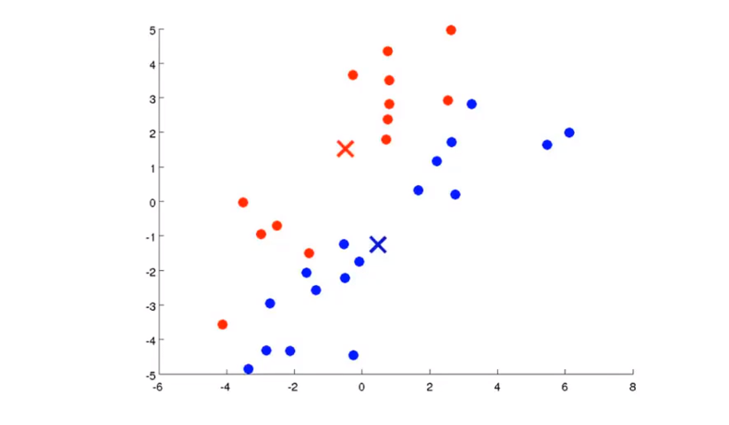
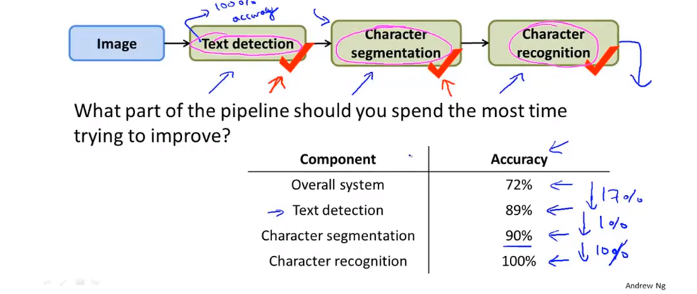

### 无监督学习

#### 无监督学习的概念
在无监督学习中，我们的数据并不带有任何标签。聚类算法有很多的实际应用，例如市场分割、社交网络分析，组织计算集群，天文数据分析。

#### K-Means算法

1. 执行k均值算法，第一步是随机生成两点，这两点称为聚类中心。

K均值算法是一种迭代算法，它会做两件事，第一个是簇分配，第二个是移动聚类中心。在K均值算法中，每次内循环的第一步，是要进行簇分配，也就是说，我要遍历每个样本，也就是图上的每个绿点，然后根据每一个点，是与红色聚类中心更近，还是与蓝色聚类中心更近，来将每个数据点分配给两个聚类中心之一。具体来说，就是遍历你的数据集，然后将每个点染成红色或蓝色，这取决于某个点是更接近于红色聚类中心还是更接近蓝色聚类中心，现在已经分好了图中点。  

这就是簇分配的步骤。  
K均值的第二步就是移动聚类中心，我们要做的是将两个聚类中心，也就是红色和蓝色的叉，将其移动到同色的点的均值处，因为我们要做的是，找出所有红色的点，然后计算它们的均值，也就是所有的红色点的平均位置，然后把红色的聚类中心移动到这里，蓝色聚类中心也一样，找出所有蓝点并计算它们的均值，然后把蓝色聚类中心移动到那里。  

如果不断运行K均值算法的迭代，可以得到  

K均值算法接受两个输入，一个是参数K，它表示你想从数据中聚类出的簇的个数，另一个输出就是一系列无标签的，只用x来表示的数据集。
Input：  

- K(number of clusters)
- Training set{$x^{(1)},x^{(2)},..,x^{(m)}$}
-   
$x^{i}\in\mathbb{R}^n$(drop $x_0=1$ convention)  
K均值算法：  
随机初始化K个聚类中心 $\mu_1,\mu_2,..,\mu_k\in\mathbb{R}^n$  
>Repeat {  
    for $i=1$ to $m$  
      $c^{(i)}$:=index(from 1 to K) of cluster centroid closest to $x^{(i)}$  
    for $k=1$ to K  
      $\mu_k$:=average (mean) of points assigned to cluster k  
}  

1. $c^{(i)}$来表示第1个到第k个，最接近$x^{(i)}$的聚类中心，这就是簇分配步骤，将每个样本，根据它离哪一个聚类中心更近一些，将其染成对应的颜色。所以$c^{(i)}$是一个在1到k之间的数，它表明这个点是更接近红色的叉还是蓝色的叉。  
2. $\mu_k$代表这个簇中所有点的均值

#### 优化目标
K均值的优化目标函数
>$c^{(i)}$ = index of cluster(1,2..,K)to which wxample $x^{(i)}$ is currently assigned  
$\mu_k$ = cluster centroidk ($\mu_k\in\mathbb{R}$)  
$\mu_{c^{(i)}}$ = cluster centroid of cluster to which example $x^{(i)}$ has been assigned

优化目标函数(失真函数)可以表示为：
$$J(c^{(1)},...,c^{(m)},\mu_1,...,\mu_k)=\frac{1}{m}\parallel x^{(i)}-\mu_{c^{(i)}}\parallel^2$$
$$\min\limits_{c^{(1)},...,c^{(m)},\mu_1,...,\mu_k}J(c^{(1)},...,c^{(m)},\mu_1,...,\mu_k)$$

#### 随机初始化
当运行K均值算法时，你应该把聚类中心数值K设置为比训练样本数量m小的值。如果运行一个K均值算法，它的聚类中心数等于或大于样本数会很奇怪。  
随机挑选K个训练样本，然后设定$\mu_1$到$\mu_k$,让它们等于这K个样本。  
假设K等于2,为了初始化聚类中心，随机挑选两个样本，要初始化聚类中心，只需要将这两个样本作为聚类中心。  
K均值算法可能会落在局部最优，如果随机初始化不好，则会得到较差的局部最优。我们能做的就是初始化K均值算法很多次，并运行K均值算法很多次，以此来保证我们最终能得到一个足够好的结果，具体做法为：  
>For i = 1 to 100{  
    Randomly initialize K-means.  
    Run K-means. Get $c^{(1)},...,c^{(m)},\mu_1,...,\mu_k$.  
    Compute cost function (distortion)  
     $J(c^{(1)},...,c^{(m)},\mu_1,...,\mu_k)$  
}  
Pick clustering that gave lowest cost $J(c^{(1)},...,c^{(m)},\mu_1,...,\mu_k)$  

#### 选取聚类数量
选择聚类数量，肘部法则，通过改变K值来计算目标优化函数的值并画图。  

有时，您正在运行K-means以获得群集以用于稍后的/下游用途。根据指标评估K均值，以了解该指标在以后的目的中的表现。也就是根据目的去选择K的数量。  

### 降维

#### 目标1 数据压缩
有些数据的特征是可以削减的，例如厘米和英尺这两个特征。  
2D to 1D 将数据投影到直线  
3D to 2D 将数据投影到平面  

#### 目标2 可视化
多维数据不能可视化，需要降维呈现。降维后特征所表述的意义可以通过图像来理解。

#### 主成分分析问题规划
降维操作最常用的算法是一个叫做主成分分析（PCA）的算法。找一个低维平面，然后将高维数据都投影在该平面上。  
在应用PCA之前，常规的做法是先进性均值归一化和特征规范化，使得特征均值为0，并且其数值在可比较范围之内。  

从2维减少到1维：找到要在其上投影数据的方向（向量$u^{(1)}\in\mathbb{R}^n$，以最大程度地减少投影误差。  
PCA并不是线性回归  

PCA试图找到一个低维的平面，来对数据进行投影，以便最小化投影误差的平方，以及最小化每个点与投影后的对应点之间距离的平方值。  

数据预处理  
训练集：$x^{(1)},x^{(2)},...,x^{(m)}$  
预处理（特征缩放/均值标准化）：  
$$\mu_j=\frac{1}{m}\sum^m_{i=1}x_j^{(i)}$$
用$x_j-\mu_j$去代替$x_j^{(i)}$.  
如果不同的特征规模不同的话，（例如$x_1=size\quad of \quad house,x_2=number\quad of \quad bedrooms$）,缩放特征量以具有可比较的值范围。

主成分分析（PCA）算法  
将数据从n维降到k维  
计算“协方差”:  
$$\Sigma=\frac{1}{m}\sum_{i=1}^n(x^{(i)})(x^{(i)})^T$$
>From `[U,S,V]=svd(Sigma)`, we get:  
$U=\begin{bmatrix} |&|&...&| \\ u^{(1)}&u^{(2)}&...&u^{(n)} \\ |&|&...&| \end{bmatrix}\in\mathbb{R}^{n\times n}$  
take the first K Columns of the U matrix

#### 主成分数量的选择 
选择K（主成分数量）  
平均投影误差平方：$\frac{1}{m}\sum\limits^m_{i=1}\parallel x^{(i)}-x_{approx}^{(i)}\parallel^2$  
数据的总变化：$\frac{1}{m}\sum\limits^m_{i=1}\parallel x^{(i)}\parallel^2$   
通常，将k选择为最小值，以便  
$$\frac{\frac{1}{m}\sum\limits_{i=1}^m\parallel x^{(i)}-x_{approx}^{(i)}\parallel^2} {\frac{1}{m}\sum\limits^m_{i=1}\parallel x^{(i)}\parallel^2}\leq0.01 \qquad (1\%)$$
“保留99％的方差信息”    

>Pick smallest value of k for which   
$\frac{\sum\limits^k_{i=1}S_{ii}}{\sum\limits^m_{i=1}S_{ii}}\geq0.99$  
(99% of variance retained)  

#### 压缩重现（解压）
$z^{(i)}=U^T_{reduce}x^{(i)}$  
$x^{(i)}=U_{reduce}z^{(i)}$

#### 应用PCA的建议
利用PCA对监督学习算法进行加速  
假设有一个监督学习的例子  
$(x^{(1)},y^{(1)}),(x^{(2)},y^{(2)}),...,(x^{(m)},y^{(m)})$  
如果$x^{(i)}\in\mathbb{R}^{10000}$,对于这种高维的特征向量，运行学习算法时将变得非常慢。使用PCA可以减少数据的维度，从而使得算法运行更加高效。  
1. 首先可以检查已经被标记的训练集，并抽取输入，把y暂时放在一边,所以我们就得到了一个无标签的训练集。   
Unlabeled dataset：$x^{(1)},x^{(2)},..,x^{(m)}\in\mathbb{R}^{10000}$  
2. 接着我们使用PCA得到原始数据的低维表示$z^{(1)},z^{(2)},..,z^{(m)}\in\mathbb{R}^{1000}$  
3. 这就给了我们一个新的训练集$(z^{(1)},y^{(1)}),(z^{(2)},y^{(2)}),...,(z^{(m)},y^{(m)})$  
4. 我们可以将新的训练集输入假设函数，进行计算，但不能应用在交叉验证集或者在测试集上。  

！！PCA不可以去修缮过拟合的问题

### 异常检测
假如你是一个飞机引擎生产商，在生产飞机引擎时，你需要进行质量控制测试，而作为这个测试一部分，你测量了飞机引擎的一些特征变量。例如：  
Aircraft engine features:  
$x_1 = heat\quad generated$  
$x_2 = vibration\quad intensity$  
...  
Dataset:{$x^{(1)},x^{(2)},...,x^{(m)}$}  
加入有一天有了一个新引擎，有一个特征变量集$x_{test}$。所谓的异常检测问题就是，我们希望知道这个新的飞机引擎是否有某种异常。  
定义：  
数据集：{$x^{(1)},x^{(2)},...,x^{(m)}$}  
这个数据集里是正常的，那新的$x_{test}$是否正常呢？  
欺诈识别:  
$x^{(i)}$=用户活动的特征  
Model $p(x)$ from data  
通过 $p(x)<\varepsilon$ 检查哪些非正常用户    

#### 高斯分布（/正态分布）
对于$x\in\mathbb{R}$. 如果x服从均值为$\mu$,方差为$\sigma^2$的正态分布。 可写作：
$x\sim N(\mu,\sigma^2)$ 
$$p(x;\mu,\sigma^2)=\frac{1}{\sqrt{2\pi}\sigma}exp(-\frac{(x-\mu)^2}{2\sigma^2})$$
 
参数估计  
Dataset：{$x^{(1)},x^{(2)},...,x^{(m)}$} 
假设这些样本来自一个高斯分布的总体，假设我猜测每一个样本$x^{(i)}$服从高斯分布，但是我们不知道$\mu$和$\sigma^2$是多少。参数估计就是从数据集中估计出未知的参数。  
$$\mu=\frac{1}{m}\sum_{i=1}^mx^{(i)}$$
$$\sigma^2=\frac{1}{m}\sum_{i=1}^m(x^{(i)}-\mu)^2$$

#### 算法
概率密度估算  
Training set:{$x^{(1)},x^{(2)},...,x^{(m)}$}  
Each example is $x\in\mathbb{R}^m$  
$x_1\sim N(\mu_1,\sigma_1^2)$   
$x_2\sim N(\mu_2,\sigma_3^2)$  
$x_3\sim N(\mu_3,\sigma_3^2)$  
...   
$x_m\sim N(\mu_m,\sigma_m^2)$  
$p(x)=p(x_1;\mu_1,\sigma^2_1)p(x_2;\mu_2,\sigma^2_2)...p(x_m;\mu_m,\sigma^2_m)=\prod\limits_{j=1}^m p(x_j;\mu_j,\sigma^2_j)$  
1. 选择你认为服从正态分布的特征量$x_i$
2. 去估算出参数
3. 给出新的样板x，计算p(x)
$$p(x)=\prod\limits_{j=1}^m p(x_j;\mu_j,\sigma^2_j)=\prod\limits_{j=1}^m\frac{1}{\sqrt{2\pi}\sigma}exp(-\frac{(x-\mu)^2}{2\sigma^2})$$ 
Anomaly if p(x) < $\varepsilon$  

#### 开发和评估异常检测系统
假设我们有一个数据集：$(x^{(1)},y^{(1)}),(x^{(2)},y^{(2)}),...,(x^{(m)},y^{(m)})$(假设是正常的样本/没有异常的样本)  
交叉验证集:$(x_cv^{(1)},y_cv^{(1)}),...,(x_cv^{(m)},y_cv^{(m)})$  
测试集：$(x_test^{(1)},y_test^{(1)}),...,(x_test^{(m)},y_test^{(m)})$  
如果有10000个好的飞机引擎，有20个异常的飞机引擎    
训练集：6000个好引擎  
交叉验证集：2000个好引擎（y=0），10个异常引擎(y=1)    
测试集：2000个好引擎(y=0)，10个异常引擎(y=1)  
算法应用：
>Fit model p(x) on training set{$x^{(1)},x^{(2)},...,x^{(m)}$}  
On a cross validation/test example x, predict  
$y=\begin{cases}1 & if&p(x)<\varepsilon&(anomaly)\\ 0 & if&p(x)\geq\varepsilon&(nomaly)\end{cases}$  
Possible evalution metric:  
1 True positive, false positive, false negative, true negative  
2 Precision/Recall  
3 $F_1$-score  
Can also use cross validation set to choose parameter $\varepsilon$  

#### 异常检测 VS 监督学习
* 异常检测  
如果一个遇到一个正常的样本数量很少，而异常的样本有很多的情况。 任何算法都很难从正例中学习异常现象。 未来的异常可能看起来与我们到目前为止所看到的任何异常示例都不相似。  
* 监督学习  
大量的正面和负面的例子。足够的正例可以使算法理解正例，未来的正例可能与训练集中的正例相似。

#### 怎样选择特征
如果你画出数据的直方图， 并且发现图形看起来与高斯分布相差甚远，那么就有必要进行一些不同的转换，通过这些方法让数据更接近高斯分布。

在检测异常的算法中，我们希望p(x)在正常样本时比较大，在异常样本的情况下比较小。一种常见的情况是，如果p(x)是可比较的，当正常样本和异常时p(x)的值都比较大。看看一些异常的样本会不会启发自己创造新的特征。  

选择在发生异常情况时可能具有异常大或小的值的特征。

#### 多变量高斯分布
$x\in\mathbb{R}^n.$不要分开建立模型$p(x_1),p(x_2),...,etc.$ 要建立统一的模型。  
参数 $\mu\in\mathbb{R}^n,\Sigma\in\mathbb{R}^{n\times n}$(协方差矩阵)  
$$p(x;\mu,\Sigma)=\frac{1}{(2\pi)^{\frac{n}{2}}\mid\Sigma\mid^{\frac{1}{2}}}exp(-\frac{1}{2}(x-\mu)T\Sigma^{-1}(x-\mu))$$
参数估计：  
给出训练集：{$x^{(1)},x^{(2)},...,x^{(m)}$}   
$\mu=\frac{1}{m}\sum\limits_{i=1}^mx^{(i)}$  
$\Sigma=\frac{1}{m}\sum\limits_{i=1}^m(x^{(i)}-\mu)(x^{(i)}-\mu)^T$  
1. $p(x)$ 参数估计  
$\mu=\frac{1}{m}\sum\limits_{i=1}^mx^{(i)}$  
$\Sigma=\frac{1}{m}\sum\limits_{i=1}^m(x^{(i)}-\mu)(x^{(i)}-\mu)^T$  
2. 给出一个新样本，计算
    $$p(x;\mu,\Sigma)=\frac{1}{(2\pi)^{\frac{n}{2}}\mid\Sigma\mid^{\frac{1}{2}}}exp(-\frac{1}{2}(x-\mu)T\Sigma^{-1}(x-\mu))$$
    标记为异常如果$p(x)<\varepsilon$  
    原始的高斯模型是多元高斯模型的一种特殊情况。  
* 原始模型：手动创建特征以捕获异常，其中$x_1,x_2$采用不寻常的值组合。   
  Computaionally cheaper(alternatively,scales better to large n)  
  OK even if m (training set size) is small
* 多元模型：自动捕获要素之间的关联  
  Computationally more expensive    
  Must have m>n, or else $\Sigma$ is non-invertible

### 推荐系统

#### 问题规划

我们根据此想开发一个推荐系统  
一个可以自动填补这些缺失值的算法，这样我们就可以看一下，该用户还有哪些电影没有看过，并推荐新电影给该用户。 

#### 基于内容的推荐算法

For each user j, learn a parameter $\theta^{(j)}\in\mathbb{R^{n+1}}$. Predict user j as rating movie i with $(\theta^{(j)})^Tx^{(i)}$ stars. 

$r(i,j)$ = 1 如果用户评价了电影i，我们就将$r(i,j)$记为1.，否则记为0.  
$y^{(i,j)}$ = 对该电影的评价，如果评价存在的话  
$\theta^{(j)}$ = 每个用户 $x^{(i)}$ 的一个参数。  
$x^{(i)}$ = 特定电影的一个特征向量  
对于每一个用户和电影，我们会预测：$(\theta^{(j)})^T(x^{(i)})$  
$m^{(j)}$ = 评价了电影的用户数量

为了学习参数向量$\theta^{(j)}$:  
$$\min\limits_{\theta^{(j)}}\sum_{i:r(i,j)=1}((\theta^{(j)})^Tx^{(i)}-y^{(i,j)})^2+\frac{\lambda}{2}\sum^n_{k=1}(\theta_k^{(j)})^2$$
为了学习所有用户的$\theta^{(1)},\theta^{(2)},...,\theta^{(n_u)}$:
$$\min\limits_{\theta^{(j)}}\sum^{n_u}_{j=1}\sum_{i:r(i,j)=1}((\theta^{(j)})^Tx^{(i)}-y^{(i,j)})^2+\frac{\lambda}{2}\sum^{n_u}_{j=1}\sum^n_{k=1}(\theta_k^{(j)})^2$$
下面，为了实现最小化，采用梯度下降的方法：  
$$\theta_k^{(j)}:=\theta_k^{(j)}-\alpha\sum_{i:r(i,j)=1}((\theta^{(j)})^Tx^{(i)}-y^{(i,j)})x_k^{(i)}\quad(for\quad k = 0)$$
$$\theta_k^{(j)}:=\theta_k^{(j)}-\alpha(\sum_{i:r(i,j)=1}((\theta^{(j)})^Tx^{(i)}-y^{(i,j)})x_k^{(i)}+\lambda\theta_k^{(j)})\quad(for\quad k \neq 0)$$

#### 协同过滤
如果你有所有电影评分的集合，即 $r(i,j)$、$y^{(i,j)}$,于是根据不同电影的特征，我们可以学习不同用户的参数$\theta$  
如果你的用户愿意为你提供这些参数，你就能估计出各种电影的特征值。  
$\theta-x-\theta-x...$不断互相推导，互相改进，最终算法会收敛到一个合理的系统推荐模型。  

将这两个优化函数结合为一个函数，同时最小化 $x^{(1)},x^{(2)},...,x^{(n_m)}$ 和 $\theta^{(1)},\theta^{(2)},...,\theta^{(m)}$:  
$$J(x^{(1)},..,x^{(n_m)},\theta^{(1)},...,\theta^{(n_u)})=\frac{1}{2}\sum\limits_{(i,j):r(i,j)=1}((\theta^{(j)})^T-y^{(i,j)})^2+\frac{\lambda}{2}\sum^{n_m}_{i=1}\sum^n_{k=1}(x_k^{(i)})^2+\frac{\lambda}{2}\sum^{n_u}_{j=1}\sum^n_{k=1}(\theta_k^{(j)})^2$$
$$\min\limits_{x^{(1)},x^{(2)},...,x^{(n_m)},\theta^{(1)},\theta^{(2)},...,\theta^{(m)}}J(x^{(1)},..,x^{(n_m)},\theta^{(1)},...,\theta^{(n_u)})$$

#### 矢量化：低秩矩阵
找到相关的电影：  
对于每一个产品i，我们学习的特征向量为 $x^{(i)}\in\mathbb{R}^n$.  
怎么样去找到与电影i相关的电影j。  
5 个相似于电影i的电影：
找到5个电影，满足smllest$\parallel x^{(i)}-x^{(j)}\parallel$.  

#### 实施细节：均值归一化
如果有个人从来不对电影进行评价，那就无法给他推荐相关的电影。均值归一化的想法可以让我们解决这个问题。和以前一样我们把所有的评分放在矩阵Y里，就是把所有的这些评分，全部整合到矩阵Y里，全是？的一列对应Eve没有给任何电影评分，要实现归一化，要做的就是计算，每个电影所得评分的均值，我们把它们存在一个叫$\mu$的向量中。  

对于用户j，基于i预测：$(\theta^{(j)})^T(x^{(i)})+\mu_i$  

### 大规模机器学习

#### 随机梯度下降
代价函数 $cost(\theta,(x^{(i)},y^{(i)}))=\frac{1}{2}(h_\theta(x^{(i)})-y^{(i)})^2$  
目标优化函数
$$J_{train}(\theta)=\frac{1}{m}\sum^m_{i=1}cost(\theta,(x^{(i)},y^{(i)}))$$
1. 将所有m个训练样本重新随机排列
2. Repeat{   
     for i:=1,...,m{   
       $\theta_j:=\theta_j-\alpha(h_\theta(x^{(i)})-y^{(i)})x_j^{(i)}$  
       (for every j=0,...,n)  
     }  

}   
循环1～10次就好了  

#### Mini-Batch 梯度下降
批量梯度下降：在每次迭代中使用所有m个样本  
随机梯度下降：每次迭代均使用1个样本  
小批量梯度下降：在每次迭代中使用b个样本  

#### 随机梯度下降收敛
>Batch gradient descent:  
Plot $J_{train}(\theta)$ as a function of the number of iterations of gradient descent.
$J_{train}(\theta)=\frac{1}{2m}\sum^m_{i=1}(h_\theta(x^{(i)})-y^{(i)})^2$  
Stochastic gradient descent:  
$cost(\theta,(x^{(i)},y^{(i)}))=\frac{1}{2}(h_\theta(x^{(i)})-y^{(i)})^2$  
During learning, compute $cost(\theta,(x^{(i)},y^{(i)}))$ before updating $\theta$ using $(x^{(i)},y^{(i)})$
Every 1000 iterations(say), plot $cost(\theta,(x^{(i)},y^{(i)}))$ averaged over the last 1000 examples processed by algorithm.

比起之前的算法需要时不时地计算$J_{train}$，那样就得遍历所有的训练样本，而梯度下降法的这个步骤，只用在更新$\theta$之前计算这些cost函数，并不需要太大的计算量。我们要做就是每1000次迭代运算中，求出前1000个cost函数的平均值，然后把它画出来，通过画出来的图，我们就能检查出，随机梯度下降是否在收敛。  

#### 在线学习
如果你有一个由不断进入网站的用户流所产生的连续的数据流，你就可以使用在线学习机制，从数据流中学习用户的偏好，然后用这些信息来优化关于网站的决策。  
用户来到的运输服务网站，指定出发地和目的地，您提供要价的方式运输其包裹，并且用户有时选择使用您的运输服务（y = 1），有时不选择（y = 0）。  
特征量 x 捕获用户属性，来源/目的地和要价的功能。 我们想通过学习$p(y=1|x;\theta)$以优化价格。  

#### 减少映射与数据并行
Map-reduce解决随机梯度下降解决不了的更大规模数据的问题。  
批量梯度下降：$\theta_j:=\theta_j-\alpha\frac{1}{400}\sum\limits_{i=1}^400(h_\theta(x^{(i)})-y^{(i)})x_j^{(i)}$  
Machine 1: Use $(x^{(1)},y^{(1)}),...,(x^{(100)},y^{(100)})$    
Machine 2: Use $(x^{(101)},y^{(101)}),...,(x^{(200)},y^{(200)})$   
Machine 3: Use $(x^{(201)},y^{(201)}),...,(x^{(300)},y^{(300)})$   
Machine 4: Use $(x^{(301)},y^{(301)}),...,(x^{(400)},y^{(400)})$   
将数据分到四台机器上使得计算速度提高了四倍。  

只要你的学习算法可以表示为对训练集的求和 

### 应用举例 照片OCR

#### 问题描述
照片OCR全称为“照片光学字符识别”，其注重让计算机读出图片中的文字信息。
1. 首先，给定某张照片，它将图像扫描一遍。
2. 然后找出照片中的文字信息，之后它将重点关注这些文字区域，并对区域中的文字进行识别，分割成独立字符
3. 当它正确读出这些文字后，它会将这些文字内容显示并记录下来。

Photo OCR pipeline（过程流水线）  
 

#### 滑动窗口分类器 
照片OCR的第一步，文字识别：  
1. 从数据集中收集一些正样本和负样本  
 
2. 利用固定比例的窗口滑动算法，然后将发现的白色区域放大周围范围 
3. 字符分割，使用监督学习算法，提供正样本和负样本  

#### 获取大量数据和人工数据
人工数据合成主要有两种形式，第一种实际上是自己创造数据，即从零开始创造新数据，第二种是我们已经有了小的标签训练集，然后以某种方式扩充训练集。  

对原数据进行扩充要有代表性。  

1. Make sure you have a low bias classifier before expending the effort.(Plot learning curves).E.g.keep increasing the number of features/number of hidden units in neural network until you have a low bias classifier.
2. "How much work would it be to get 10x as much data as we currently have?" 
   - 人工合成数据
   - 扩充已有数据集
   - “crowd source”

#### 天花板分析：下一步的流程线
上限分析  

哪一个模块需要花更多的时间？
提升哪个模块对系统性能改善最有效果？  

### 总结
**First Step ， and thank you for your teaching!!!**  
   

