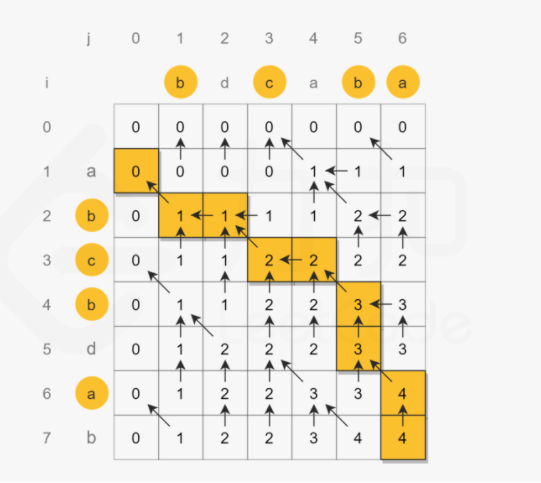

## 显性转移
### 杨辉三角
#### 题目
给定一个非负整数 numRows，生成「杨辉三角」的前 numRows 行。
在「杨辉三角」中，每个数是它左上方和右上方的数的和。


```
**输入:** numRows = 5
**输出:** [[1],[1,1],[1,2,1],[1,3,3,1],[1,4,6,4,1]]
```
#### 思路
题目直接给出了状态转移方程`f[i][j]=f[i-1][j]+f[i-1][j-1]`
初始状态是`f[0][0]=1`
#### 题解
```java
public class generate {
    public List<List<Integer>> generate(int numRows) {
        int[][] f = new int[numRows][numRows];
        f[0][0]=1;
        for (int i=1;i<numRows;i++){
            f[i][0]=f[i][i]=1;
            for (int j=1;j<numRows;j++){
                f[i][j]=f[i-1][j]+f[i-1][j-1];
            }
        }
        List<List<Integer>> ans = new LinkedList<>();
        for (int i=0;i<numRows;i++){
            List<Integer> row = new ArrayList<>();
            for (int j=0;j<i+1;j++){
                row.add(f[i][j]);
            }
            ans.add(row);
        }
        return ans;
    }
}
```

### 青蛙跳台阶问题
#### 题目
一只青蛙一次可以跳上1级台阶，也可以跳上2级台阶。求该青蛙跳上一个 n 级的台阶总共有多少种跳法。
答案需要取模 1e9+7（1000000007），如计算初始结果为：1000000008，请返回 1。
#### 思路
状态转移是从0开始，到n-1结束的，注意遍历范围，此外因为第i项仅与同行的第i-1项和i-2项相关，可以用变量a，b，c进行循环遍历，节约空间
#### 题解
```java
public class numWays {
    public int numWays(int n) {
        int a=0,b=1,sum;
        for (int i=2;i<n;i++){
            sum = a+b+2;
            a=b;
            b=sum;
        }
        return a;
    }
}
```

## 路径问题
### 不同路径
#### 题目
一个机器人位于一个 m x n 网格的左上角 （起始点在下图中标记为 “Start” ）。
机器人每次只能向下或者向右移动一步。机器人试图达到网格的右下角（在下图中标记为 “Finish” ）。
问总共有多少条不同的路径？

#### 思路
我们令 `dp[i][j]`是到达 i, j 最多路径
1. 当前只能由位置往下移动得来，即有`f[i][j]=f[i-1][j]`
2. 当前只能由位置往右移动得来，即有`f[i][j]=f[i][j-1]`
3. 当前位置可以由两种移动方式得来，即有`f[i][j]=f[i-1][j]+f[i][j-1]`

注意，对于第一行 `dp[0][j]`，或者第一列 `dp[i][0]`，由于都是在边界，所以只能为 1
时间复杂度：`O(m*n)O(m∗n)`
空间复杂度：`O(m * n)O(m∗n)`
优化：因为我们每次只需要 `dp[i-1][j],dp[i][j-1]`
#### 题解
```java
public class uniquePaths {
    public int uniquePaths(int m, int n) {
        int[][] dp = new int[m][n];
        for (int i=0; i<n; i++) dp[0][i]=1;
        for (int j=0; j<m; j++) dp[j][0]=1;
        for (int k=1; k<m; k++){
            for (int l=1; l<n; l++){
                dp[k][l] = dp[k-1][l]+dp[k][l-1];
            }
        }
        return dp[m-1][n-1];
    }
}
```
### 不同路径II
#### 题目
一个机器人位于一个 m x n 网格的左上角 （起始点在下图中标记为“Start” ）。
机器人每次只能向下或者向右移动一步。机器人试图达到网格的右下角（在下图中标记为“Finish”）。
现在考虑网格中有障碍物。那么从左上角到右下角将会有多少条不同的路径？
#### 思路
1. 当前只能由位置往下移动得来，即有`f[i][j]=f[i-1][j]`
2. 当前只能由位置往右移动得来，即有`f[i][j]=f[i][j-1]`
3. 当前位置可以由两种移动方式得来，即有`f[i][j]=f[i-1][j]+f[i][j-1]`
4. 遇到障碍物，即`obstacleGrid[i][j]=1`，则有`f[i][j]=0`
#### 题解
```java
public class uniquePathsWithObstacles {
    public int uniquePathsWithObstacles(int[][] obstacleGrid) {
        int m = obstacleGrid.length;
        int n = obstacleGrid[0].length;
        int[][] path = new int[m][n];
        path[0][0]=obstacleGrid[0][0]==1?0:1;
        for (int i=0;i<m;i++){
            for (int j=0;j<n;j++){
                if (obstacleGrid[i][j]!=1){
                    if (i>0&&j>0)
                        path[i][j]=path[i-1][j]+path[i][j-1];
                    else if (i>0)
                        path[i][j]=path[i-1][j];
                    else if (j>0)
                        path[i][j]=path[i][j-1];
                }
            }
        }
        return path[m-1][n-1];
    }
}
```
### 最小路径和
#### 题目
给定一个包含非负整数的 `_m_ x _n_` 网格 `grid` ，请找出一条从左上角到右下角的路径，使得路径上的数字总和为最小。
**说明**每次只能向下或者向右移动一步。
#### 思路
每个格子的值为`n=grid[i][j]`
1. 当前只能由位置往下移动得来，即有`f[i][j]=f[i-1][j]+n`
2. 当前只能由位置往右移动得来，即有`f[i][j]=f[i][j-1]+n`
3. 当前位置可以由两种移动方式得来，即有`f[i][j]=min(f[i-1][j]+n,f[i][j-1]+n)`
#### 题解
```java
public class minPathSum {
    public int minPathSum(int[][] grid) {
        int m = grid.length;
        int n = grid[0].length;
        int[][] path = new int[m][n];
        path[0][0]=grid[0][0];
        for (int i=0;i<m;i++){
            for (int j=0;j<n;j++){
                if (i>0 && j>0){
                    path[i][j] = Math.min(path[i][j]+grid[i][j],path[i-1][j]+grid[i][j]);
                }
                else if (i>0){
                    path[i][j] = path[i-1][j]+grid[i][j];
                }
                else if (j>0){
                    path[i][j] = path[i][j-1]+grid[i][j];
                }
            }
        }
        return path[m-1][n-1];
    }
}
```

### 三角形最小路径和
#### 题目
给定一个三角形 triangle ，找出自顶向下的最小路径和。
每一步只能移动到下一行中相邻的结点上。相邻的结点 在这里指的是 下标 与 上一层结点下标 相同或者等于 上一层结点下标 + 1 的两个结点。也就是说，如果正位于当前行的下标 i ，那么下一步可以移动到下一行的下标 i 或 i + 1 。
```
输入：triangle = [[2],[3,4],[6,5,7],[4,1,8,3]]
输出：11
解释：如下面简图所示：
   2
  3 4
 6 5 7
4 1 8 3
自顶向下的最小路径和为 11（即，2 + 3 + 5 + 1 = 11）。
```
#### 思路
三角形顶点`path[0][0]=triangle.get(0).get(0)`
每一行数值，边上的直接继承上一行自相邻的数，内部的继承自上一行相邻的较小的数值
#### 题解
```java
public class minimumTotal {
    public int minimumTotal(List<List<Integer>> triangle) {
        int ans = Integer.MAX_VALUE;
        int m = triangle.size();
        int n = triangle.get(triangle.size()-1).size();
        int[][] path = new int[m][n];
        path[0][0]=triangle.get(0).get(0);
        for (int i=1;i<m;i++){
            for (int j=0;j<triangle.get(i).size();j++){
                int value = triangle.get(i).get(j);
                if (j==0){
                    path[i][j] = path[i-1][j] + value;
                }
                else if (0<j && j<triangle.get(i).size()-1){
                    path[i][j] = Math.min(path[i-1][j-1]+value,path[i-1][j]+value);
                }
                else if (j==triangle.get(i).size()-1){
                    path[i][j] = path[i-1][j-1]+value;
                }
            }
        }
        for (int j=0;j<n;j++){
            int a = path[m-1][j];
            ans = ans<a?ans:a;
        }
        return ans;
    }
}
```

### 下降路径最小和
#### 题目
给你一个 n x n 的 方形 整数数组 matrix ，请你找出并返回通过 matrix 的下降路径 的 最小和 。下降路径 可以从第一行中的任何元素开始，并从每一行中选择一个元素。在下一行选择的元素和当前行所选元素最多相隔一列（即位于正下方或者沿对角线向左或者向右的第一个元素）。具体来说，位置 (row, col) 的下一个元素应当是 (row + 1, col - 1)、(row + 1, col) 或者 (row + 1, col + 1) 。
```
输入：matrix = [[2,1,3],[6,5,4],[7,8,9]]
输出：13
解释：下面是两条和最小的下降路径，用加粗+斜体标注：
[[2,**1**,3],      [[2,**1**,3],
 [6,**5**,4],       [6,5,**4**],
 [**7**,8,9]]       [7,**8**,9]]
```
#### 思路
枚举起点+动态规划
#### 题解
```java
class Solution {
    int MAX = Integer.MAX_VALUE;
    public int minFallingPathSum(int[][] mat) {
        int n = mat.length;
        int[][] f = new int[n][n];
        // 初始化：对于首行而言，每个位置的「最小成本」就是其「矩阵值」
        for (int i = 0; i < n; i++) f[0][i] = mat[0][i];
        // 从第二行开始，根据题目给定的条件进行转移
        for (int i = 1; i < n; i++) {
            for (int j = 0; j < n; j++) {
                int val = mat[i][j];
                f[i][j] = f[i - 1][j] + val;
                if (j - 1 >= 0) f[i][j] = Math.min(f[i][j], f[i-1][j-1] + val);
                if (j + 1 <  n) f[i][j] = Math.min(f[i][j], f[i-1][j+1] + val);
            }
        }
        int ans = MAX;
        for (int i = 0; i < n; i++) ans = Math.min(ans, f[n-1][i]);
        return ans;
    }
}
```

### 打家劫舍
#### 题目
你是一个专业的小偷，计划偷窃沿街的房屋。每间房内都藏有一定的现金，影响你偷窃的唯一制约因素就是相邻的房屋装有相互连通的防盗系统，如果两间相邻的房屋在同一晚上被小偷闯入，系统会自动报警。
给定一个代表每个房屋存放金额的非负整数数组，计算你 不触动警报装置的情况下 ，一夜之内能够偷窃到的最高金额。
```
输入：[1,2,3,1]
输出：4
解释：偷窃 1 号房屋 (金额 = 1) ，然后偷窃 3 号房屋 (金额 = 3)。
     偷窃到的最高金额 = 1 + 3 = 4 。
```
 #### 思路
1. 当 i=0时，偷窃金额也是0
2. 当i=1时，偷窃金额就是`nums[i]`
3. 当i=k时
     * 当偷了k家，则有`money[i-2]+nums[k]`
     * 当没偷k家，则有`money[i-1]`
     * 取两者最大值
#### 题解
```java
public class rob {
    public int rob(int[] nums) {
        int N = nums.length;
        int [] money = new int[N+1];
        money[0] = 0;
        money[1] = nums[0];
        for (int i=2;i<N+1;i++){
            money[i] = Math.max(money[i-2]+nums[i-1],money[i-1]);
        }
        return money[N];
    }
}
```

### 打家劫舍II
#### 题目
你是一个专业的小偷，计划偷窃沿街的房屋，每间房内都藏有一定的现金。这个地方所有的房屋都 围成一圈 ，这意味着第一个房屋和最后一个房屋是紧挨着的。同时，相邻的房屋装有相互连通的防盗系统，如果两间相邻的房屋在同一晚上被小偷闯入，系统会自动报警 。
给定一个代表每个房屋存放金额的非负整数数组，计算你 在不触动警报装置的情况下 ，今晚能够偷窃到的最高金额
#### 思路
难点在于房屋是首尾相接的，可以复制两个数组，一个数组没有头，一个数组没有尾，最后比较这两个数组遍历出来的最大值
#### 题解
```java
public class rob2 {
    public int rob2(int[] nums) {
        if(nums.length==0) return 0;
        if(nums.length==1) return nums[0];
        int[] nums1 = Arrays.copyOfRange(nums,0,nums.length-1);
        int[] nums2 = Arrays.copyOfRange(nums,1,nums.length);
        int m1=ways(nums1);
        int m2=ways(nums2);
        return Math.max(m1,m2);
    }

    public int ways(int[] nums){
        int N = nums.length;
        int[] m = new int[N+1];
        m[0] = 0;
        m[1] = nums[0];
        for (int i=2;i<N+1;i++){
            m[i] = Math.max(m[i-1],m[i-2]+nums[i-1]);
        }
        return m[N];
    }
}
```

### 打家劫舍III
#### 题目
在上次打劫完一条街道之后和一圈房屋后，小偷又发现了一个新的可行窃的地区。这个地区只有一个入口，我们称之为“根”。 除了“根”之外，每栋房子有且只有一个“父“房子与之相连。一番侦察之后，聪明的小偷意识到“这个地方的所有房屋的排列类似于一棵二叉树”。 如果两个直接相连的房子在同一天晚上被打劫，房屋将自动报警。
计算在不触动警报的情况下，小偷一晚能够盗取的最高金额。
```
输入: [3,2,3,null,3,null,1]
     3
    / \
   2   3
    \   \ 
     3   1

输出: 7 
解释: 小偷一晚能够盗取的最高金额 = 3 + 3 + 1 = 7.
```
#### 思路
1. 每一个节点有两种状态，可选和不可选，初始状态可以用一个数组表示{0，0}
2. 选择一个节点：左右节点都不可选，`node.val+left[0]+right[0]`
3. 不选择该节点：左右节点可选可不选，选最大值情况
`max(left[0],left[1])+max(right[0],right[1])`
4. 需要进行后序遍历，先要得到左右叶子节点上的最大值才可以计算上层的节点上的最大值
#### 题解
```java
public class rob3 {
    public int rob3(TreeNode root) {
        if (root==null) return 0;
        int[] ans = dfs(root);
        return Math.max(ans[0],ans[1]);
    }

    public int[] dfs(TreeNode root){
        if (root==null){
            return new int[] {0,0};
        }
        int[] left = dfs(root.left);
        int[] right = dfs(root.right);
        int selected = root.val + left[0] + right[0];
        int notSelected = Math.max(left[0],left[1]) + Math.max(right[0],right[1]);
        return new int[] {notSelected,selected};
    }
}
```

## 序列问题
### 最长连续递增序列
#### 题目
给定一个未经排序的整数数组，找到最长且 连续递增的子序列，并返回该序列的长度。
连续递增的子序列 可以由两个下标 l 和 r（l < r）确定，如果对于每个 l <= i < r，都有 `nums[i] < nums[i + 1]`，那么子序列`[nums[l], nums[l + 1], ..., nums[r - 1], nums[r]]` 就是连续递增子序列。
```
输入：nums = [1,3,5,4,7]
输出：3
解释：最长连续递增序列是 [1,3,5], 长度为3。
尽管 [1,3,5,7] 也是升序的子序列, 但它不是连续的，因为 5 和 7 在原数组里被 4 隔开。 
```
#### 思路
定义`dp[i]`是i位置的连续递增序列长度，初始化都为1，因为是递增的连续序列，所以必须要满足`nums[i]>nums[i-1]`，才有`dp[i]=dp[i-1]+1`;
#### 题解
```java
class Solution {
    public int findLengthOfLCIS(int[] nums) {
        int n = nums.length;
        if (n==0) return 0;
        int[] dp = new int[n];
        Arrays.fill(dp,1);
        int res = 1;
        for (int i=1; i<n;i++){
            if (nums[i]>nums[i-1]){
                dp[i] = dp[i-1]+1;
            }
            res = dp[i]>res?dp[i]:res;
        }
        return res;
    }
}
```

### 最长重复子数组
#### 题目
给两个整数数组 `A` 和 `B` ，返回两个数组中公共的、长度最长的子数组的长度。
```java
输入：
A: [1,2,3,2,1]
B: [3,2,1,4,7]
输出：3
解释：
长度最长的公共子数组是 [3, 2, 1] 。
```
#### 思路
令 `dp[i][j]` 表示 `A[i:]` 和 `B[j:]` 的最长公共前缀，那么答案即为所有 `dp[i][j]` 中的最大值。如果 `A[i] == B[j]`，那么 `dp[i][j] = dp[i-1][j-1] + 1`，否则 `dp[i][j] = 0`。

#### 题解
```java
class Solution {
    public int findLength(int[] nums1, int[] nums2) {
        int m = nums1.length;
        int n = nums2.length;
        if (m==0||n==0) return 0;
        int[][] dp = new int[m+1][n+1];
        int res = 0;
        for (int i = 1;i<m+1;i++){
            for (int j=1;j<n+1;j++){
                if (nums1[i-1]==nums2[j-1]){
                    dp[i][j] = dp[i-1][j-1]+1;
                    res = dp[i][j]>res?dp[i][j]:res;
                }
            }
        }
        return  res;
    }
}
```

### 最长公共子序列
#### 题目
给定两个字符串 text1 和 text2，返回这两个字符串的最长公共子序列 的长度。如果不存在 公共子序列 ，返回 0 。
一个字符串的 子序列 是指这样一个新的字符串：它是由原字符串在不改变字符的相对顺序的情况下删除某些字符（也可以不删除任何字符）后组成的新字符串。
例如，"ace" 是 "abcde" 的子序列，但 "aec" 不是 "abcde" 的子序列。
两个字符串的 公共子序列 是这两个字符串所共同拥有的子序列。
#### 思路
0. 单个数组或者字符串要使用动态规划时，可以把动态规划`dp[i]`定义为`nums[0:i]`中想要求解的结果；当两个数组或者字符串要用动态规划时，可以把动态规划定义成两维的`dp[i][j]`，其含义是在`A[0:i]`与`B[0:j]`之间匹配得到想要的结果
1. **状态定义**：定义`dp[i][j]`表示`text1[0:i-1]`和`text[0:j-1]`的最长公共子序列
2. **状态转移方程**：
     * 当`text1[0:i-1]==text[0:j-1]`时，`dp[i][j]=dp[i-1][j-1]+1`
     * 当`text1[0:i-1]!=text[0:j-1]`时，`dp[i][j]=max(dp[i-1][j],dp[i][j-1])`
     
3. **状态初始化**：`dp[0][0]=0`
4. **遍历方向与范围**：看`dp[i][j]`的依赖条件，i和j的遍历顺序都是从小到大的，因为0位置被初始化，i和j从1位置开始到端点进行遍历
5. 返回最终结果，也就是`dp[len(text1)][len(text2)]`
#### 题解
```java
public class longestCommonSubsequence {
    public int longestCommonSubsequence(String text1, String text2) {
        int m = text1.length();
        int n = text2.length();
        int[][] dp = new int[m+1][n+1];
        dp[0][0]=0;
        for (int i=1;i<m;i++){
            for (int j=1;j<n;j++){
                if (text1.charAt(i-1)==text2.charAt(i-1)){
                    dp[i][j]=dp[i-1][j-1]+1;
                }
                else {
                    dp[i][j]=Math.max(dp[i][j-1],dp[i-1][j]);
                }
            }
        }
        return dp[m][n];
    }
}
```

### 最长回文子串
#### 题目
给你一个字符串 `s`，找到 `s` 中最长的回文子串。
```
输入：s = "babad"
输出："bab"
解释："aba" 同样是符合题意的答案。
```
#### 思路
回文串的状态转移性质：一个长度严格大于2的回文去掉头尾字符后，剩下的部分依然是回文。反之，如果一个字符串头尾两个字符都不相等，那么这个字符串不是回文。
1. 定义状态
`dp[i][j]`表示：字串`s[i:j]`是否为回文子串
2. 根据头尾是否相等，需要分条件讨论
   * 如果字串长度为2，则字符相等即回文串
   * 如果字符串长度大于2，则其状态从上一个字符串转移而来`dp[i][j]=(s[i]==s[j]) && dp[i+1][j-1]`
3. 考虑初始化
当字符串只有一个时，即`i==j`时，一定是回文的
4. 考虑输出
记录子串长度和起始位置即可
#### 题解
```java
class Solution {
    public String longestPalindrome(String s) {
        int len = s.length();
        if (len<2) return s;
        int maxLen = 1;
        int begin = 0;
        boolean[][] dp = new boolean[len][len];
        char[] charArray = s.toCharArray();
        for (int i=0;i<len;i++){
            dp[i][i] = true;
        }
        
        for (int j=1; j<len;j++){
            for (int i=0;i<j;i++){
                if (charArray[i] != charArray[j]){
                    dp[i][j] = false;
                }else {
                    if (j-i<3){
                        dp[i][j]=true;
                    }else {
                        dp[i][j] = dp[i+1][j-1];
                    }
                }
                if (dp[i][j] && j-i+1>maxLen){
                    maxLen = j-i+1;
                    begin = i;
                }
            }
        }
        return s.substring(begin,begin+maxLen);
    }
}
```

### 编辑距离
#### 题目
给你两个单词 word1 和 word2，请你计算出将 word1 转换成 word2 所使用的最少操作数 。
你可以对一个单词进行如下三种操作：
插入一个字符
删除一个字符
替换一个字符
```
输入：word1 = "horse", word2 = "ros"
输出：3
解释：
horse -> rorse (将 'h' 替换为 'r')
rorse -> rose (删除 'r')
rose -> ros (删除 'e')
```
#### 思路
1. 状态定义：
     * `dp[i][j]`比较到字符串1的i位置和j位置所产生的最小操作数
     * `dp[i-1][j-1]`表示替换或保留操作
     * `dp[i-1][j]`表示删除操作（第二个字符串为0，所以要一直删除）
     * `dp[i][j-1]`表示插入操作（第一个字符串为0，所以要一直插入）
2. 状态转移方程
当`text1[i]==text2[j]`时，`dp[i][j]=dp[i-1][j-1]`，不需要任何操作
当`text1[i]!=text2[j]`时，`dp[i][j]=min(替换，删除，插入)+1`
3. 状态初始化
    * `dp[0][0]=0`
    * `dp[i][0]=dp[i-1][0]`
    * `dp[0][j]=dp[j-1][0]` 
4. 遍历方向及范围:`dp[i][j]`依赖于上一层的结果，所以遍历方向为由小到大，范围从1开始
5.  返回值结果：返回`dp[len(text1)][len(text2)]`
#### 题解
```java
public class minDistance {
    public int minDistance(String word1, String word2) {
        int m = word1.length();
        int n = word2.length();
        int[][] dp = new int[m+1][n+1];
        dp[0][0]=0;
        for (int i=1;i<m+1;i++) dp[i][0]=dp[i-1][0]+1;
        for (int j=1;j<n+1;j++) dp[0][j]=dp[0][j-1]+1;
        for (int i=1;i<m+1;i++){
            for (int j=1;j<n+1;j++){
                if (word1.charAt(i-1)==word2.charAt(j-1)){
                    dp[i][j]=dp[i-1][j-1];
                }
                else {
                    dp[i][j]=Math.min(
                            Math.min(dp[i-1][j-1],dp[i-1][j]),
                            dp[i][j-1])+1;
                }
            }
        }
        return dp[m][n];
    }
}
```

### 最长递增子序列
#### 题目
给你一个整数数组 nums ，找到其中最长严格递增子序列的长度。
子序列是由数组派生而来的序列，删除（或不删除）数组中的元素而不改变其余元素的顺序。例如，`[3,6,2,7]` 是数组 `[0,3,1,6,2,2,7]`的子序列。
#### 思路
1. 状态定义：
`dp[i]`的值代表 nums 前 i 个数字的最长子序列长度。
2. 转移方程： 设`j∈[0,i)`，考虑每轮计算新 `dp[i]` 时，遍历 `[0,i)` 列表区间，做以下判断：
     * 当 `nums[i]>nums[j]`时： `nums[i]`可以接在 `nums[j]` 之后（此题要求严格递增），此情况下最长上升子序列长度为 `dp[j]+1`；
     * 当 `nums[i]<=nums[j]`时:  `nums[i]`无法接在`nums[j]`之后，此情况上升子序列不成立，跳过。
     上述所有 **1. 情况** 下计算出的 `dp[j] + 1` 的最大值，为直到 i 的最长上升子序列长度（即 `dp[i]`）。实现方式为遍历 j 时，每轮执行 `dp[i] = max(dp[i], dp[j] + 1)`。
3. 转移方程： `dp[i] = max(dp[i], dp[j] + 1) for j in [0, i)`。
4. 初始状态：
`dp[i]`所有元素置 1，含义是每个元素都至少可以单独成为子序列，此时长度都为 1。
5. 返回值：
返回 dp列表最大值，即可得到全局最长上升子序列长度。
#### 题解
```java
class Solution {
    public int lengthOfLIS(int[] nums) {
        if(nums.length==0) return 0;
        int len = nums.length;
        int[] dp = new int[len];
        Arrays.fill(dp,1);
        int res = Integer.MIN_VALUE;
        for(int i = 0; i<len;i++){
            for(int j=0;j<i;j++){
                if(nums[j]<nums[i]){
                    dp[i] = Math.max(dp[i],dp[j]+1);
                }
            }
            res = Math.max(dp[i],res);
        }
        return res; 
    }
}
```


### 连续子数组的最大和
#### 题目
输入一个整型数组，数组中的一个或连续多个整数组成一个子数组。求所有子数组的和的最大值。
要求时间复杂度为`O(n)`。
#### 思路
* 状态定义：设动态规划列表dp，`dp[i]`代表以元素`nums[i]`为结尾的连续子数组最大和。
    *  为何定义最大和`dp[i]`中必须包含元素`nums[i]`：保证`d[i]`递推到`dp[i+1]`的正确性；如果不包含`nums[i]`，递推时则不满足题目的*连续子数组*要求
* 转移方程：若`dp[i-1]`$\le$  0，说明`dp[i-1]`对`dp[i]`产生负贡献，即`dp[i-1]+nums[i]`还不如`nums[i]`本身大。
   * 当`dp[i-1]`>0时：执行`dp[i]=dp[i-1]+nums[i];`
   * 当`dp[i-1]`<0时：执行`dp[i]=nums[i]`
* 初始状态：`dp[0]=nums[0]`，即以`nums[0]`结尾的连续子数组最大和为`nums[0]`
* 返回值：返回dp列表中的最大值，代表全局最大值 
#### 题解
```java
class Solution{
	public int maxSubArray(int[] nums){
		int res = nums[0];
		for(int i=1;i<nums.length;i++){
			nums[i] = nums[i] + Math.max(nums[i-1],0);
			res = Math.max(res,nums[i]);
		}
		return res;
	}
}
```

### 正则表达式匹配
#### 题目
请实现一个函数用来匹配包含`.`和`*`的正则表达式。模式中的字符`.`表示任意一个字符，而`*`表示它前面的字符可以出现任意次（含0次）。在本题中，匹配是指字符串的所有字符匹配整个模式。例如，字符串`"aaa"`与模式`"a.a"`和`"ab*ac*a"`匹配，但与`"aa.a"`和`"ab*a"`均不匹配。
#### 思路
* **状态定义** 设动态规划矩阵dp，`dp[i][j]`代表字符串s的前i个字符和p的前j个字符能否匹配
* **转移方程** `dp[0][0]`代表空字符的状态，`dp[i][j]`对应添加字符是`s.charAt(i-1)和p.charAt(j-1)`
   * 当`p.charAt(j-1)='*'`时，`dp[i][j]`在以下任意情况true下为true：
       1. `dp[i][j-2]`: 将字符组合`p[j-2]*`看作出现0次，能否匹配；
       2. `dp[i-1][j]且s.charAt(i-1)==p.charAt(j-2)`:让字符`p.charAt(j-2)`多出现一次
       3.  `dp[i-1][j]且p.charAt(j-2)=='.'`:让字符`p.charAt(j-2)`多出现一次
   * 当`p.charAt(j-1)!='*'`时：
       1.  `dp[i - 1][j - 1] 且 s.charAt(i - 1) = p.charAt(j - 1)`
       2.  `dp[i - 1][j - 1] 且  p.charAt(j - 1)=='.'`
       **初始化**
   *   `dp[0][0] = true`： 代表两个空字符串能够匹配。
   *  `dp[0][j] = dp[0][j - 2] 且 p[j - 1] = '*'`： 首行 s 为空字符串，因此当 p 的偶数位为 * 时才能够匹配（即让 p 的奇数位出现 0 次，保持 p 是空字符串）。因此，循环遍历字符串 p ，步长为 2（即只看偶数位）。
   **返回值**
-   **返回值：** `dp` 矩阵右下角字符，代表字符串 `s` 和 `p` 能否匹配。
#### 题解
```java
class Solution {
    public boolean isMatch(String s, String p) {
        int m = s.length();
        int n = p.length();
        boolean[][] dp = new boolean[m+1][n+1];
        dp[0][0]=true;
        for (int j=2;j<n+1;j+=2){
            dp[0][j] = dp[0][j-2] && p.charAt(j-1)=='*';
        }
        for (int i=1;i<m+1;i++){
            for (int j=1;j<n+1;j++){
                if (p.charAt(j-1)=='*'){
                    dp[i][j] = dp[i][j-2] ||
                            dp[i-1][j] && s.charAt(i-1)==p.charAt(j-2) ||
                            dp[i-1][j] && p.charAt(j-2)=='.';
                }else {
                    dp[i][j] = dp[i-1][j-1] && s.charAt(i-1)==p.charAt(j-1) ||
                            dp[i-1][j-1] && p.charAt(j-1) == '.';
                }
            }
        }
        return dp[m][n];
    }
}
```

### 把数字翻译成字符串
#### 题目
给定一个数字，我们按照如下规则把它翻译为字符串：0 翻译成 “a” ，1 翻译成 “b”，……，11 翻译成 “l”，……，25 翻译成 “z”。一个数字可能有多个翻译。请编程实现一个函数，用来计算一个数字有多少种不同的翻译方法。
```
**输入:** 12258
**输出:** `5` **解释:** 12258有5种不同的翻译，分别是"bccfi", "bwfi", "bczi", "mcfi"和"mzi"
```
#### 思路
可抽象为青蛙跳台阶问题，一次选择一个字符或者两个字符进行转化，但是是有转化条件的
#### 题解
```java
class Solution {
    public int translateNum(int num) {
        String str = String.valueOf(num);
        int n = str.length();
        char[] nums = str.toCharArray();
        int[] dp=new int[n+1];
        dp[0] = 1;
        dp[1] = 1;
        for (int i=2;i<n+1;i++){
            char c1 = nums[i-1];
            if (c1>='0' && c1<='9'){
                dp[i] += dp[i-1];
            }
            char c2 = nums[i-2];
            if (c2=='1' || (c2=='2' && c1<='5')){
                dp[i] += dp[i-2];
            }
        }
        return dp[n];
    }
}
```

### 预测赢家
#### 题目
#### 思路
1. 状态定义：甲乙比赛，甲先手面对区间`[i,...,j]`时，`dp[i][j]`表示对乙的净胜分
2. 状态转移方程：甲先手面对区间`[i,..,j]`
     * 如果甲拿`nums[i]`，变成了乙先手面对区间`[i+1,..j]`，这段区间乙对甲的净胜分为`dp[i+1][j]`；那么甲对乙的净胜分应该是`nums[i]-dp[i+1][j]`
     * 如果甲拿`nums[j]`，同理可得甲对乙的净胜分是`nums[j]-dp[i][j-1]`
     * 两种情况取大即可
3. 状态初始化：当i=j时，`dp[i][j]=0`  
#### 题解
```java
public class PredictTheWinner {
    // 状态转移方程：dp[i][j] = max(nums[i] - dp[i + 1][j], nums[j] - dp[i][j - 1])

    public boolean PredictTheWinner(int[] nums) {
        int len = nums.length;
        int[][] dp = new int[len][len];

        // dp[i][j]：作为先手，在区间 nums[i..j] 里进行选择可以获得的相对分数
        for (int i = 0; i < len; i++) {
            dp[i][i] = nums[i];
        }

        for (int i = len - 2; i >= 0; i--) {
            for (int j = i + 1; j < len; j++) {
                dp[i][j] = Math.max(nums[i] - dp[i + 1][j], nums[j] - dp[i][j - 1]);
            }
        }
        return dp[0][len - 1] >= 0;
    }
}
```

### 三个无重叠子数组的最大和

#### 题目

给你一个整数数组 nums 和一个整数 k ，找出三个长度为 k 、互不重叠、且 3 * k 项的和最大的子数组，并返回这三个子数组。

以下标的数组形式返回结果，数组中的每一项分别指示每个子数组的起始位置（下标从 0 开始）。如果有多个结果，返回字典序最小的一个。

```text
输入：nums = [1,2,1,2,6,7,5,1], k = 2
输出：[0,3,5]
解释：子数组 [1, 2], [2, 6], [7, 5] 对应的起始下标为 [0, 3, 5]。
也可以取 [2, 1], 但是结果 [1, 3, 5] 在字典序上更大。

输入：nums = [1,2,1,2,1,2,1,2,1], k = 2
输出：[0,2,4]
```

#### 思路

1. 状态定义：定义`f[i][j]`为考虑前i个数，凑成无重叠子数组数量为j个时的最大值。最终答案为`f[n-1][3]`
2. 状态转移方程：考虑最优方案中是否存在`nums[i]`，即第i个数之后的数对最优方案没有贡献
   * 存在`nums[i]` ：$f[i][j]=f[i-k][j-1]+\sum^i_{idx=i-k+1}nums[idx]$
   * 不存在`nums[i]`：$f[i][j]=f[i-1][j]$
   * 两种情况取最大
   * 其中求解$\sum^i_{idx=i-k+1}nums[idx]$可以使用前缀和进行优化

#### 题解

```java
class Solution {
public int[] maxSumOfThreeSubarrays(int[] nums, int k) {
        int n = nums.length;
        long[] sum = new long[n+1];
        for (int i=1; i<=n;i++){
            sum[i] = sum[i-1]+nums[i-1];
        }
        long[][] f = new long[n+10][4];
        for (int i= n-k+1; i>=1; i--){
            for (int j=1;j<4;j++){
                f[i][j] = Math.max(f[i+1][j], f[i+k][j-1] + sum[i+k-1]-sum[i-1]);
            }
        }
        int[] ans = new int[3];
        int i = 1, j = 3, idx = 0;
        while (j>0){
            if (f[i+1][j]>f[i+k][j-1]+sum[i+k-1]-sum[i-1]){
                i++;
            }else {
                ans[idx++] = i - 1;
                i += k; j--;
            }
        }
        return  ans;
    }
}
```

### 467.环绕字符串中唯一的子字符串
#### 题目
把字符串 `s` 看作是 `“abcdefghijklmnopqrstuvwxyz”` 的无限环绕字符串，所以 `s` 看起来是这样的：

-   `"...zabcdefghijklmnopqrstuvwxyzabcdefghijklmnopqrstuvwxyzabcd...."` . 

现在给定另一个字符串 `p` 。返回 `s` 中 唯一 的 `p` 的 非空子串 的数量 。
```
输入: p = "zab"
输出: 6
解释: 在字符串 s 中有六个子串“z”、“a”、“b”、“za”、“ab”、“zab”。
```
#### 思路

1.状态定义：`f[i]`为以位置`i`作为结尾的，在`s`中存在的最长字串长度。
2. 状态转移方程：
	* 当在`s`中，`p[i+1]`是`p[i]`的下一个字符，那么说明**连接上**，于是`f[i+1]=dp[i]+1`。
	* 当在`s`中，`p[i+1]`不是`p[i]`的下一个字符，那么说明连接不上，于是`dp[i+1]=1`。
3. 初始化：`f[s[0]-'a']=1`

#### 题解
```java
class Solution {
    public int findSubstringInWraproundString(String _p) {
        char[] cs = _p.toCharArray();
        int n = cs.length, ans = 0;
        int[] max = new int[26];
        max[cs[0] - 'a']++;
        for (int i = 1, j = 1; i < n; i++) {
            int c = cs[i] - 'a', p = cs[i - 1] - 'a';
            if ((p == 25 && c == 0) || p + 1 == c) j++;
            else j = 1;
            max[c] = Math.max(max[c], j);
        }
        for (int i = 0; i < 26; i++) ans += max[i];
        return ans;
    }
}
```

## 01背包

### 分割等和子集
#### 题目
给你一个 **只包含正整数** 的 **非空** 数组 `nums` 。请你判断是否可以将这个数组分割成两个子集，使得两个子集的元素和相等。
```java
**输入：**nums = [1,5,11,5]
**输出：**true
**解释：**数组可以分割成 [1, 5, 5] 和 [11] 。
```
#### 思路
将此问题转化为01背包问题，即是否可以拿出一些数令其和等于数组总和的一半
#### 题解
```java
public class Solution {

    public boolean canPartition(int[] nums) {
        int len = nums.length;
        // 题目已经说非空数组，可以不做非空判断
        int sum = 0;
        for (int num : nums) {
            sum += num;
        }
        // 特判：如果是奇数，就不符合要求
        if ((sum & 1) == 1) {
            return false;
        }

        int target = sum / 2;
        // 创建二维状态数组，行：物品索引，列：容量（包括 0）
        boolean[][] dp = new boolean[len][target + 1];

        // 先填表格第 0 行，第 1 个数只能让容积为它自己的背包恰好装满
        if (nums[0] <= target) {
            dp[0][nums[0]] = true;
        }
        // 再填表格后面几行
        for (int i = 1; i < len; i++) {
            for (int j = 0; j <= target; j++) {
                // 直接从上一行先把结果抄下来，然后再修正
                dp[i][j] = dp[i - 1][j];

                if (nums[i] == j) {
                    dp[i][j] = true;
                    continue;
                }
                if (nums[i] < j) {
                    dp[i][j] = dp[i - 1][j] || dp[i - 1][j - nums[i]];
                }
            }
        }
        return dp[len - 1][target];
    }
}
/*一维数组优化*/
class Solution {
    public boolean canPartition(int[] nums) {
        int n = nums.length;

        //「等和子集」的和必然是总和的一半
        int sum = 0;
        for (int i : nums) sum += i;
        int target = sum / 2;

        // 对应了总和为奇数的情况，注定不能被分为两个「等和子集」
        if (target * 2 != sum) return false;

        // 取消「物品维度」
        boolean[] f = new boolean[target+1];
        f[0] = true;
        for (int i = 1; i <= n; i++) {
            int t = nums[i-1];
            for (int j = target; j >= 0; j--) {
                // 不选该物品
                boolean no = f[j];
                // 选该物品
                boolean yes = j >= t ? f[j-t] : false;
                f[j] = no | yes;
            }
        }
        return f[target];
    }
}
```

#### 474.一和零
#### 题目
给你一个二进制字符串数组 `strs` 和两个整数 `m` 和 `n` 。
请你找出并返回 `strs` 的最大子集的长度，该子集中 **最多** 有 `m` 个 `0` 和 `n` 个 `1` 。
如果 `x` 的所有元素也是 `y` 的元素，集合 `x` 是集合 `y` 的 **子集** 。
>输入：strs = ["10", "0001", "111001", "1", "0"], m = 5, n = 3
输出：4
解释：最多有 5 个 0 和 3 个 1 的最大子集是 {"10","0001","1","0"} ，因此答案是 4 。其他满足题意但较小的子集包括 {"0001","1"} 和 {"10","1","0"} 。{"111001"} 不满足题意，因为它含 4 个 1 ，大于 n 的值 3 。
#### 思路
每个字符串的价值都是 `1`（对答案的贡献都是 `1`），选择的成本是该字符串中 `1`的数量和 `0` 的数量。

问我们在 `1` 的数量不超过 `m`，`0` 的数量不超过 `n` 的条件下，最大价值是多少。

由于每个字符串只能被选一次，且每个字符串的选与否对应了「价值」和「成本」，求解的问题也是「最大价值」是多少。

因此可以直接套用 01 背包的「状态定义」来做：

`f[k][i][j]`代表考虑前 k 件物品，在数字 1 容量不超过 `i`，数字 `0` 容量不超过`j`的条件下的「最大价值」（每个字符串的价值均为 `1`）。

有了「状态定义」之后，「转移方程」也很好推导：
$$dp[i][j][k]=max(dp[i-1][j][k],dp[i-1][j-cnt[i][0]][k-cnt[i][1]]+1)$$
其中`cnt`是记录0，1数量的二维数组。
#### 题解
```java
class Solution {
    public int findMaxForm(String[] strs, int m, int n) {
       int len = strs.length;
       int[][] cnt = new int[len][2];
       for(int i=0;i<len;i++){
           int zero = 0, one = 0;
           for(char c : strs[i].toCharArray()){
               if(c=='0') zero++;
               else one++;
           }
           cnt[i] = new int[] {zero,one};
       }

        int[][] dp = new int[m+1][n+1];
        for(int i=0;i<len;i++){
            int zero = cnt[i][0];
            int one = cnt[i][1];
            for(int j=m; j>=zero; j--){
                for(int k=n; k>=one; k--){
                    dp[j][k] = Math.max(dp[j][k], dp[j-zero][k-one]+1);
                }
            }
        }
        return dp[m][n];
    }
}
```

### 1049.最后一块石头的重量ii

#### 题目
有一堆石头，用整数数组 `stones` 表示。其中 `stones[i]` 表示第 `i` 块石头的重量。

每一回合，从中选出**任意两块石头**，然后将它们一起粉碎。假设石头的重量分别为 `x` 和 `y`，且 `x <= y`。那么粉碎的可能结果如下：

-   如果 `x == y`，那么两块石头都会被完全粉碎；
-   如果 `x != y`，那么重量为 `x` 的石头将会完全粉碎，而重量为 `y` 的石头新重量为 `y-x`。

最后，**最多只会剩下一块** 石头。返回此石头 **最小的可能重量** 。如果没有石头剩下，就返回 `0`。
#### 思路
此题目可以转化为求集合的两个子集最小差值的问题，使用数组和的1/2作为背包容量C，数组长度为N，每个石头的重量为W，可以转化为01背包问题，使背包的重量尽量逼近与总重量，则两部分的差值也会逼近最小值。
#### 题解
```java
class Solution {
    public int lastStoneWeightII(int[] stones) {
        int sum = Arrays.stream(stones).sum();
        int target = sum/2;
        int len = stones.length;
        int[] dp = new int[target+1];
        for(int i=0;i<len;i++){
            for(int j=target;j>=stones[i];j--){
                int n = dp[j];
                int y = dp[j-stones[i]]+stones[i];
                dp[j] = Math.max(n, y);
            }
        }
        return sum - 2*dp[target];
    }
}
```

## 完全背包

### 兑换零钱
#### 题目
给你一个整数数组 coins ，表示不同面额的硬币；以及一个整数 amount ，表示总金额。
计算并返回可以凑成总金额所需的 最少的硬币个数 。如果没有任何一种硬币组合能组成总金额，返回 -1 。
你可以认为每种硬币的数量是无限的。
#### 思路
完全背包问题
#### 题解
```java
public class coinChange {
    public int coinChange(int[] coins, int amount) {
        int max = amount + 1;
        int[] dp = new int[amount + 1];
        Arrays.fill(dp, max);
        dp[0] = 0;
        for (int i = 1; i <= amount; i++) {
            for (int j = 0; j < coins.length; j++) {
                if (coins[j] <= i) {
                    dp[i] = Math.min(dp[i], dp[i - coins[j]] + 1);
                }
            }
        }
        return dp[amount] > amount ? -1 : dp[amount];
    }
}
```

### 零钱兑换II
#### 题目
给定一个整数数组 coins，表示不同面额的硬币；以及一个整数 amount，表示总金额。本题要求的是在每种硬币的数量是无限的情况下，计算并返回可以凑成总金额 amount 的硬币组合数。

#### 思路
完全背包
1. 状态定义
    对于本题，定义二维数组 `dp[i][j]` 表示：从前 `i`种硬币中凑出金额 `j`的硬币组合数/方案数。

2. 状态转移
	$$dp[i][j]=max(dp[i-1][j],dp[i][j-v[i]]+w[i])$$

3.  记整数数组 coins 的长度为 `n`。为便于状态更新，减少对边界的判断，初始二维 dp 数组维度为$(n+1) \times (*)$，其中第一维为 `n+1` 也意味着：第 `i` 种硬币为 `coins[i-1]`，第 1 种硬币为 `coins[0]`，第 0 种硬币为空。
	初始化时，不合法的或未定义的状态则可以设置为 0：
		* `dp[0][0] = 1`：表示从前 0 种硬币中选出若干个组成金额 0 所对应的组合数目为 1，即「空集合」不选任何硬币即可得到金额 0。【只有这么一种组合】
		* 对于其他 $dp[0][j],\ \ j\geq 1$，则有 `dp[0][j] = 0`：「空集合」中无法选出任何硬币组成金额 $j\geq 1$。

#### 题解
```java
class Solution {
    public int change(int amount, int[] coins) {
        int n = coins.length;
        int[] f = new int[amount + 1];
        f[0] = 1;
        for (int i = 1; i <= n; i++) {
            int val = coins[i - 1];
            for (int j = val; j <= amount; j++) {
                f[j] += f[j - val];
            }
        }
        return f[amount];
    }
}
```

## 分组背包
### 1155. 掷色子的N种方法
#### 题目
这里有 `n` 个一样的骰子，每个骰子上都有 `k` 个面，分别标号为 `1` 到 `k` 。

给定三个整数 `n` ,  `k` 和 `target` ，返回可能的方式(从总共 `kn` 种方式中)滚动骰子的数量，使正面朝上的数字之和等于 `target` 。

答案可能很大，你需要对 `109 + 7` 取模 。
#### 思路
使用分组背包的思想
问题转化：**用 d 个骰子（物品组）进行掷，掷出总和（取得的总价值）为 t 的方案数**
1. 状态定义：`f[i][j]`表示考虑前 `i` 个物品组，凑成价值为 `j` 的方案数。
2. 初始化：为了方便表示，物品组标号从1开始，则有`f[0][0]=1`。
3. 状态转移：根据题意，对于第 i 个物品组而言，可能决策的方案有：
	* 第 `i`个骰子的结果为 `1`：`f[i][j]=f[i-1][j-1]`
	* 第 `i`个骰子的结果为 `2`：`f[i][j]=f[i-1][j-2]`
	* ...
	* 第 `i`个骰子的结果为 `k`：`f[i][j]=f[i-1][j-k]`
则状态转移方程可以表示为：
$$f[i][j]=\sum^m_{k=1}f[i-1][j-k] \, j\geq k$$
优化为一维数组，由于是直接在`f[j]`上进行累加计算，因此每轮要手动置零
#### 题解
```java
class Solution {
    int mod = (int)1e9+7;
    public int numRollsToTarget(int n, int m, int t) {
        int[] f = new int[t + 1];
        f[0] = 1;
        for (int i = 1; i <= n; i++) {
            for (int j = t; j >= 0; j--) {
                f[j] = 0;
                for (int k = 1; k <= m; k++) {
                    if (j >= k) {
                        f[j] = (f[j] + f[j-k]) % mod;
                    }
                }
            }
        } 
        return f[t];
    }
}
```

### 盈利计划
#### 题目
集团里有 `n` 名员工，他们可以完成各种各样的工作创造利润。

第 `i` 种工作会产生 `profit[i]` 的利润，它要求 `group[i]` 名成员共同参与。如果成员参与了其中一项工作，就不能参与另一项工作。

工作的任何至少产生 `minProfit` 利润的子集称为 盈利计划 。并且工作的成员总数最多为 `n` 。

有多少种计划可以选择？因为答案很大，所以 返回结果模 `10^9 + 7` 的值。
#### 思路
问题转化：将每个任务看作一个「物品」，完成任务所需要的人数看作「成本」，完成任务得到的利润看作「价值」
1. 状态定义：定义 `f[i][j][k]`为考虑前 `i` 件物品，使用人数不超过 `j`，所得利润至少为 `k` 的方案数。
2. 初始化：当不存在任何物品（任务）时，所得利用利润必然为 0（满足至少为 0），同时对人数限制没有要求。因此可以让所有 `f[0][x][0] = 1`
3. 状态转移：
	* 不选，$f[i][j][k]=f[i-1][j][k]$
	* 选择改任务，首先要满足人数达到要求，即`j>=group[i-1]`，例如利润减去新增的利润为负值，根据题意至少满足最小利润的条件，将0与其作比较就可以避免出现负数的情况。$$f[i][j][k]=f[i-1][j-group[i-1]][max(k-profit[i-1],0)]$$
#### 题解
```java
class Solution {
    public int profitableSchemes(int n, int minProfit, int[] group, int[] profit) {
        int mod = (int) 1e9+7;
        int m = group.length;
        long[][][] dp = new long[m+1][n+1][minProfit+1];

        for(int j = 0; j<=n; j++) dp[0][j][0] = 1;

        for(int i = 1; i<=m; i++){
            int a = group[i-1], b = profit[i-1];
            for(int j = 0;j<=n;j++){
                for(int k=0;k<=minProfit;k++){
                    dp[i][j][k] = dp[i-1][j][k];
                    if(j>=a){
                        int u = Math.max(k-b, 0);
                        dp[i][j][k]+=dp[i-1][j-a][u];
                        if(dp[i][j][k]>=mod) dp[i][j][k]-=mod;
                    }
                }
            }
        }
        return (int) dp[m][n][minProfit];
    }
}
```