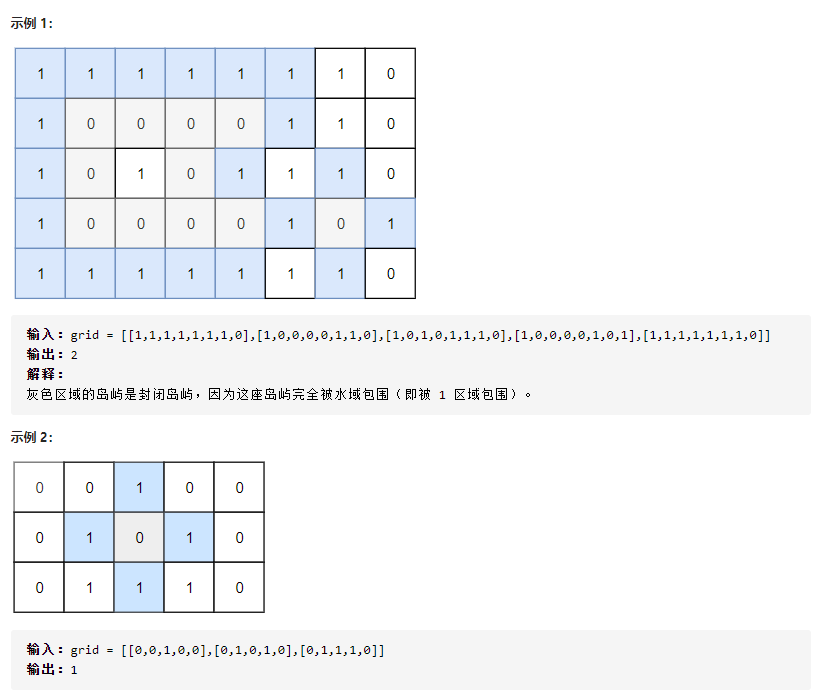
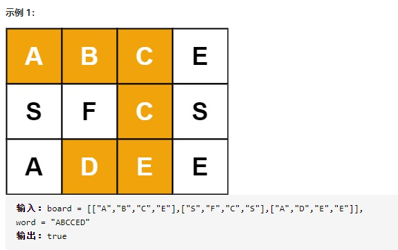

## DFS
### 判断二分图
#### 题目
存在一个 无向图 ，图中有 n 个节点。其中每个节点都有一个介于 0 到 n - 1 之间的唯一编号。给你一个二维数组 graph ，其中 `graph[u]` 是一个节点数组，由节点 u 的邻接节点组成。形式上，对于  `graph[u]`中的每个 v ，都存在一条位于节点 u 和节点 v 之间的无向边。该无向图同时具有以下属性：
* 不存在自环（ `graph[u]`不包含 u）。
* 不存在平行边（ `graph[u]` 不包含重复值）。
* 如果 v 在  `graph[u]` 内，那么 u 也应该在  `graph[u]`内（该图是无向图）

这个图可能不是连通图，也就是说两个节点 u 和 v 之间可能不存在一条连通彼此的路径。
二分图 定义：如果能将一个图的节点集合分割成两个独立的子集 A 和 B ，并使图中的每一条边的两个节点一个来自 A 集合，一个来自 B 集合，就将这个图称为 二分图 。

如果图是二分图，返回 true ；否则，返回 false 。
```
0 —— 1    
|    |
3 —— 2
**输入：**graph = [[1,3],[0,2],[1,3],[0,2]]
**输出：**true
**解释：**`可以将节点分成两组: {0, 2} 和 {1, 3} 。`
```
#### 思路
采用节点着色的方法，深度遍历每个节点，从一个根节点开始，将其没有着色的邻点着不同的颜色，若邻点着色了则判断是否是不同的颜色，若颜色相同则返回false，颜色不同继续遍历，遍历完之后返回true
#### 题解
```java
//深度优先搜索
public class isBipartite {
    private static final int UNCOLORED = 0;
    private static final int RED = 1;
    private static final int GREEN = 2;
    private int[] color;
    private boolean valid;
    public boolean isBipartite(int[][] graph) {
        int n = graph.length;
        valid = true;
        color = new int[n];
        Arrays.fill(color,UNCOLORED);
        for (int i=0; i<n && valid; i++){
            if (color[i]==UNCOLORED){
                dfs(i,RED,graph);
            }
        }
        return valid;
    }
    public void dfs(int node, int c, int[][] graph){
        color[node] = c;
        int cNei = c==RED? GREEN :RED;
        for (int neighbor : graph[node]){
            if (color[neighbor]==UNCOLORED){
                dfs(neighbor,cNei,graph);
                if (!valid) return;
            }
            else if (color[neighbor] !=cNei){
                valid=false;
            }
        }
    }
}
//广度优先搜索
class Solution {
    private static final int UNCOLORED = 0;
    private static final int RED = 1;
    private static final int GREEN = 2;
    private int[] color;

    public boolean isBipartite(int[][] graph) {
        int n = graph.length;
        color = new int[n];
        Arrays.fill(color, UNCOLORED);
        for (int i = 0; i < n; ++i) {
            if (color[i] == UNCOLORED) {
                Queue<Integer> queue = new LinkedList<Integer>();
                queue.offer(i);
                color[i] = RED;
                while (!queue.isEmpty()) {
                    int node = queue.poll();
                    int cNei = color[node] == RED ? GREEN : RED;
                    for (int neighbor : graph[node]) {
                        if (color[neighbor] == UNCOLORED) {
                            queue.offer(neighbor);
                            color[neighbor] = cNei;
                        } else if (color[neighbor] != cNei) {
                            return false;
                        }
                    }
                }
            }
        }
        return true;
    }
}
```

### 二维数组中的查找
#### 题目
在一个 n * m 的二维数组中，每一行都按照从左到右递增的顺序排序，每一列都按照从上到下递增的顺序排序。请完成一个高效的函数，输入这样的一个二维数组和一个整数，判断数组中是否含有该整数。
示例:
现有矩阵 matrix 如下：
```
[
  [1,   4,  7, 11, 15],
  [2,   5,  8, 12, 19],
  [3,   6,  9, 16, 22],
  [10, 13, 14, 17, 24],
  [18, 21, 23, 26, 30]
]
```
#### 思路

#### 题解
```java
class Solution {
	public boolean findNumberIn2DArray(int[][] matrix, int target) {
		if(matrix.length==0 || matrix[0].length==0 || matrix[0][0] > target)
			return false;
		int m = matrix.length;
		int n= matrix[0].length;
		int r =0;
		int c = n-1;
		while(r<m && c>=0)
		{
			int num = matrix[r][c];
			if(num==target) return true;
			if(num<target) r++;
			if(num>target) c--;
		}
		return false;
	}
}
```

### 岛屿数量
#### 题目
给你一个由 '1'（陆地）和 '0'（水）组成的的二维网格，请你计算网格中岛屿的数量。
岛屿总是被水包围，并且每座岛屿只能由水平方向和/或竖直方向上相邻的陆地连接形成。
此外，你可以假设该网格的四条边均被水包围。
```shell
输入：grid = [
  ["1","1","1","1","0"],
  ["1","1","0","1","0"],
  ["1","1","0","0","0"],
  ["0","0","0","0","0"]
]
输出：1
```
#### 思路
二叉树的 DFS 有两个要素：「**访问相邻结点**」和「**判断 base case**」
对于网格上的 DFS，我们完全可以参考二叉树的 DFS，写出网格 DFS 的两个要素：

首先，网格结构中的格子有多少相邻结点？答案是上下左右四个。对于格子 (r, c) 来说（r 和 c 分别代表行坐标和列坐标），四个相邻的格子分别是 (r-1, c)、(r+1, c)、(r, c-1)、(r, c+1)。换句话说，网格结构是「四叉」的。

其次，网格 DFS 中的 base case 是什么？从二叉树的 base case 对应过来，应该是网格中不需要继续遍历、`grid[r][c]`会出现数组下标越界异常的格子，也就是那些超出网格范围的格子。

这一点稍微有些反直觉，坐标竟然可以临时超出网格的范围？这种方法我称为「先污染后治理」—— 甭管当前是在哪个格子，先往四个方向走一步再说，如果发现走出了网格范围再赶紧返回。这跟二叉树的遍历方法是一样的，先递归调用，发现 root == null 再返回。

#### 题解
```java
public class numIslands {
    public int numIslands(char[][] grid) {
        int ans = 0;
        for(int i=0;i<grid.length;i++){
            for (int j=0;j<grid[0].length;j++){
                if (grid[i][j]=='1'){
                    ans++;
                    dfs(grid,i,j);
                }
            }
        }
        return ans;
    }

    public void dfs(char[][] grid, int i, int j){
        if (inArea(grid,i,j)) return;
        grid[i][j] = '2';
        dfs(grid,i,j-1);
        dfs(grid,i,j+1);
        dfs(grid,i-1,j);
        dfs(grid,i+1,j);
    }

    public boolean inArea(char[][] grid, int i, int j){
        boolean b = i>=0 && i<=grid.length && j>=0 && j<=grid[0].length;
        return b;
    }
}
```

### 岛屿的最大面积
#### 题目
给定一个包含了一些 0 和 1 的非空二维数组 grid 。

一个 岛屿 是由一些相邻的 1 (代表土地) 构成的组合，这里的「相邻」要求两个 1 必须在水平或者竖直方向上相邻。你可以假设 grid 的四个边缘都被 0（代表水）包围着。

找到给定的二维数组中最大的岛屿面积。(如果没有岛屿，则返回面积为 0 。)
```shell
[[0,0,1,0,0,0,0,1,0,0,0,0,0],
 [0,0,0,0,0,0,0,1,1,1,0,0,0],
 [0,1,1,0,1,0,0,0,0,0,0,0,0],
 [0,1,0,0,1,1,0,0,1,0,1,0,0],
 [0,1,0,0,1,1,0,0,1,1,1,0,0],
 [0,0,0,0,0,0,0,0,0,0,1,0,0],
 [0,0,0,0,0,0,0,1,1,1,0,0,0],
 [0,0,0,0,0,0,0,1,1,0,0,0,0]]
```
#### 思路
关键在于注意处理相邻边的关系和结果
#### 题解
```java
    public int maxAreaOfIsland(int[][] grid) {
        int ans = Integer.MIN_VALUE;
        int area = 0;
        List<Integer> list = new ArrayList<>();
        for (int i=0;i<grid.length;i++){
            for (int j=0; j<grid[0].length; j++){
                if (grid[i][j]==1){
                    list.add(dfs(grid,i,j));
                }
            }
        }
        if (list.size()==0) return 0;
        for (Integer i:list){
            ans = ans<i? i:ans;
        }
        return ans;
    }

    public int dfs(int[][] grid, int i, int j){
        if (!inArea(grid,i,j) || grid[i][j]!=1) return 0;
        grid[i][j] = 2;
        int area = 1+dfs(grid,i+1,j)
                +dfs(grid,i-1,j)
                +dfs(grid,i,j+1)
                +dfs(grid,i,j-1);

        return area;
    }

    boolean inArea(int[][] grid, int i, int j){
        return i>=0 && i<grid.length && j>=0 && j<grid[0].length;
    }
```

### 封闭岛屿的数目
#### 题目
有一个二维矩阵 grid ，每个位置要么是陆地（记号为 0 ）要么是水域（记号为 1 ）。
我们从一块陆地出发，每次可以往上下左右 4 个方向相邻区域走，能走到的所有陆地区域，我们将其称为一座「岛屿」。
如果一座岛屿完全由水域包围，即陆地边缘上下左右所有相邻区域都是水域，那么我们将其称为「封闭岛屿」。
请返回封闭岛屿的数目。


#### 思路
循环遍历二维数组寻找新岛屿的陆地，再从该陆地出发深度优先遍历判断其所在岛屿是否为封闭岛屿
1. 当遇到新岛屿的陆地时，将当前临时封闭岛屿数量val置1
2. 从该块陆地出发，利用深度优先遍历找到该岛屿内的其他陆地，找到一块要改变一块的状态（陆沉），相当于已经遍历过这个地方，避免下次重复计算！
3. 若遍历到矩阵边界则说明为非封闭岛屿，将当前临时封闭岛屿数目val置0
4. 更新封闭岛屿的数量
#### 题解
```java
public class closedIsland {
    private int val;
    public int closedIsland(int[][] grid) {
        int closedLandNum=0;
        for(int i=0; i<grid.length;i++){
            for(int j=0; j<grid[0].length;j++) {
                if (grid[i][j] == 0) {
                    val=1;
                    dfs(grid,i,j);
                    closedLandNum +=val;
                }
            }
        }
        return closedLandNum;
    }

    public void dfs(int[][] grid, int i, int j){
        if(i<0 || i==grid.length || j<0 || j==grid[0].length){
            val=0;
            return;
        }
        if(grid[i][j]!=0) return;
        grid[i][j]=1;
        dfs(grid,i-1,j);
        dfs(grid,i+1,j);
        dfs(grid, i, j-1);
        dfs(grid, i, j+1);
    }
}
```

### 单词搜索
#### 题目
给定一个 m x n 二维字符网格 board 和一个字符串单词 word 。如果 word 存在于网格中，返回 true ；否则，返回 false 。
单词必须按照字母顺序，通过相邻的单元格内的字母构成，其中“相邻”单元格是那些水平相邻或垂直相邻的单元格。同一个单元格内的字母不允许被重复使用。


#### 思路
1.  任意一个字符，从上下左右开始找  
2.  注意边界判断  
3.  注意某个字母什么时候覆盖什么时候还原
4.  只要存在即可返回true
#### 题解
```java
    public boolean exist(char[][] board, String word) {
        for (int j=0; j<board.length; j++){
            for (int k=0; k<board[0].length;k++){
                if(dfs(board,0,word,j,k))
                    return true;
            }
        }
        return false;
    }

    public boolean dfs(char[][] board, int i, String word,int j, int k){
        if (i==word.length()) return true;
        if (!inArea(board,j,k) || board[j][k]!=word.charAt(i)) return false;
        char temp = board[j][k];
        board[j][k] = '*';
        boolean found = dfs(board,i+1,word,j+1,k)
                || dfs(board,i+1,word,j-1,k)
                || dfs(board,i+1,word,j,k+1)
                || dfs(board,i+1,word,j,k-1);
        board[j][k] = temp;
        return found;
    }

    public boolean inArea(char[][] board, int j, int k){
        return j>=0 && j<=board.length-1 && k>=0 && k<=board[0].length-1;
    }
```

### 矩阵中的路径
#### 题目
给定一个 m x n 二维字符网格 board 和一个字符串单词 word 。如果 word 存在于网格中，返回 true ；否则，返回 false 。
单词必须按照字母顺序，通过相邻的单元格内的字母构成，其中“相邻”单元格是那些水平相邻或垂直相邻的单元格。同一个单元格内的字母不允许被重复使用。
例如，在下面的 3×4 的矩阵中包含单词 "ABCCED"（单词中的字母已标出）。
#### 思路
DFS+回溯+剪枝：
剪枝条件：
1. 搜索到的字符串长度满足目标值长度
2. i，j应该在方格范围之内，且在本次搜索中没有被用到过
3. 将各个方向的dfs用或连接，目的是找到一个目标值就可以返回true，而不用全部查找
#### 题解
```java
class Solution {
    public boolean exist(char[][] board, String word) {
        int m = board.length;
        int n = board[0].length;
        int len = word.length();
        if (m==0||n==0||len==0) return false;
        boolean[][] used = new boolean[m][n];
        for (int i =0;i<m;i++){
            for (int j=0;j<n;j++){
                if(dfs(board,i,j,word,0,used)) return true;
            }
        }
        return false;

    }
    boolean dfs(char[][] board, int i, int j, String word,int n,boolean[][] used){
        if (n==word.length()){
            return true;
        }
        if (!inArea(board, i, j) || used[i][j]==true || board[i][j] != word.charAt(n)) return false;
        used[i][j]=true;
        boolean res = dfs(board,i-1,j,word,n+1,used) ||
        dfs(board,i+1,j,word,n+1,used) ||
        dfs(board,i,j-1,word,n+1,used) ||
        dfs(board,i,j+1,word,n+1,used);
        used[i][j]=false;
        return res;
    }

    boolean inArea(char[][] board, int i, int j){
        return i>=0 && i<board.length && j>=0 && j<board[0].length;
    }
}
```


###  太平洋大西洋水流问题
#### 题目
给定一个 m x n 的非负整数矩阵来表示一片大陆上各个单元格的高度。“太平洋”处于大陆的左边界和上边界，而“大西洋”处于大陆的右边界和下边界。
规定水流只能按照上、下、左、右四个方向流动，且只能从高到低或者在同等高度上流动。
请找出那些水流既可以流动到“太平洋”，又能流动到“大西洋”的陆地单元的坐标。
提示：
输出坐标的顺序不重要
m 和 n 都小于150
```
给定下面的 5x5 矩阵:
  太平洋 ~   ~   ~   ~   ~ 
       ~  1   2   2   3  (5) *
       ~  3   2   3  (4) (4) *
       ~  2   4  (5)  3   1  *
       ~ (6) (7)  1   4   5  *
       ~ (5)  1   1   2   4  *
          *   *   *   *   * 大西洋

返回:
[[0, 4], [1, 3], [1, 4], [2, 2], [3, 0], [3, 1], [4, 0]] (上图中带括号的单元).
```
#### 思路
从上左边界和下右边界分别出发，可以到达的地方标志为true，将两次到达的地方取共同点，则可得到最后结果。
#### 题解
```java
class Solution {
    public List<List<Integer>> pacificAtlantic(int[][] heights) {
        List<List<Integer>> ans = new ArrayList<>();
        int m = heights.length;
        int n = heights[0].length;
        if(m==0||n==0){
            return ans;
        }
        boolean[][] reachedA = new boolean[m][n];
        boolean[][] reachedP = new boolean[m][n];
        for (int i=0;i<m;i++){
            dfs(i, 0,heights,reachedP);
            dfs(i, n-1,heights,reachedA);
        }
        for (int j=0; j<n;j++){
            dfs(0,j,heights,reachedP);
            dfs(m-1,j,heights,reachedA);
        }
        
        for (int i=0;i<m;i++){
            for (int j=0;j<n;j++){
                if (reachedA[i][j]&&reachedP[i][j]){
                    ans.add(Arrays.asList(i,j));
                }
            }
        }
        return ans;
    }

    public void dfs(int i, int j, int[][] heights, boolean[][] reached){
        if (!inArea(i,j, heights) || reached[i][j]) return;
        reached[i][j]=true;
        if (inArea(i-1,j, heights) && heights[i][j]<=heights[i-1][j]) dfs(i-1,j,heights,reached);
        if (inArea(i+1,j, heights) && heights[i][j]<=heights[i+1][j]) dfs(i+1,j,heights,reached);
        if (inArea(i,j-1, heights) && heights[i][j]<=heights[i][j-1]) dfs(i,j-1,heights,reached);
        if (inArea(i,j+1, heights) && heights[i][j]<=heights[i][j+1]) dfs(i,j+1,heights,reached);
    }

    boolean inArea(int i, int j, int[][] heights){
        return i>=0 && i<heights.length && j>=0 && j<heights[0].length;
    }
}
```

### 边界着色
#### 题目

给你一个大小为`m x n` 的整数矩阵 `grid` ，表示一个网格。另给你三个整数 `row`、`col` 和 `color` 。网格中的每个值表示该位置处的网格块的颜色。

当两个网格块的颜色相同，而且在四个方向中任意一个方向上相邻时，它们属于**同一连通分量**。

**连通分量的边界**是指连通分量中的所有与不在分量中的网格块相邻（四个方向上）的所有网格块，或者在网格的边界上（第一行/列或最后一行/列）的所有网格块。

请你使用指定颜色 `color` 为所有包含网格块 `grid[row][col]` 的**连通分量的边界**进行着色，并返回最终的网格`grid` 。

示例

```txt
输入：grid = [[1,1],[1,2]], row = 0, col = 0, color = 3
输出：[[3,3],[3,2]]

输入：grid = [[1,2,2],[2,3,2]], row = 0, col = 1, color = 3
输出：[[1,3,3],[2,3,3]]

输入：grid = [[1,1,1],[1,1,1],[1,1,1]], row = 1, col = 1, color = 2
输出：[[2,2,2],[2,1,2],[2,2,2]]
```

#### 思路

1. 保证不越界，用数组记录避免重复访问
2. 最终找到的网格值应该与最开始指定方格的颜色相同
3. 最终找到的网格需要位于边界上
   * 如果网格位于整个网盘的边界上，其一定是在边界
   * 除此之外，如果网格处在网盘之内，它的上下左右四个方向有一个方向上的网格颜色不同与指定方格颜色，也可以判断它在边界上

#### 题解

```java
class Solution {
    boolean[][] visited;
    int origin;
    public int[][] colorBorder(int[][] grid, int row, int col, int color) {
        origin = grid[row][col];
        visited = new boolean[grid.length][grid[0].length];
        dfs(grid,row,col,color,visited);
        return grid;
    }

    void dfs(int[][] grid, int i, int j, int color, boolean[][] visited) {
        if (!inArea(grid,i,j) || visited[i][j] || grid[i][j]!=origin) return;
        if (onBoundary(grid,i,j)) grid[i][j] = color;
        if (isBound(grid,i,j-1)||isBound(grid,i,j+1)||isBound(grid,i-1,j)||isBound(grid,i+1,j)) grid[i][j] = color;
        visited[i][j] = true;
        dfs(grid, i+1, j, color, visited);
        dfs(grid, i-1, j, color, visited);
        dfs(grid, i, j+1, color, visited);
        dfs(grid, i, j-1, color, visited);
        
    }

    boolean inArea(int[][] grid, int i, int j){
        return i>=0 && i<grid.length && j>=0 && j<grid[0].length;
    }
    
    boolean onBoundary(int[][] grid, int i, int j){
        return i == 0 || i == grid.length-1 || j ==0 ||j == grid[0].length-1;
    }
    
    boolean isBound(int[][] grid, int i, int j){
        if (!inArea(grid, i, j)) return false;
        if (grid[i][j] != origin && !visited[i][j]) return true;
        return false;
    }
}
```

### 删除无效的括号
#### 题目
给你一个由若干括号和字母组成的字符串 `s` ，删除最小数量的无效括号，使得输入的字符串有效。
返回所有可能的结果。答案可以按 **任意顺序** 返回。
```
输入：s = "()())()"
输出：["(())()","()()()"]
```
#### 思路
采用dfs+回溯的思想，设置一个标志分数，将左括号标志为1，右括号为-1
取Max = min(左括号数目，右括号数目)，得到最多可以组成的括号数
* 当字符为左括号时，如果分数小于max，则可以选它，也可以不选它
* 当字符为右括号时，如果分数大于0，则证明有左括号可以去匹配它，可以选也可以不选
* 当字符为其他符号时，直接加入
* 当字符串长度到达比之前的长度长或相等时，加入Set（去重）
* 最后在set中取出最长的字符串返回集合
#### 题解
```java
class Solution {
    private int len;
    public List<String> removeInvalidParentheses(String s) {
        char[] cs = s.toCharArray();
        int l = 0, r=0;
        for (int i=0; i<s.length();i++){
            if (cs[i]=='(') l++;
            else if (cs[i]==')') r++;
        }
        int max = Math.min(l,r);
        Set<String> all = new HashSet<>();
        dfs(cs,0,0,max,"",all);
        List<String> ans = new ArrayList<>();
        for (String str:all){
            if (str.length()==len){
                ans.add(str);
            }
        }
        return ans;
    }

    private void dfs(char[] cs, int u, int score, int max, String cur, Set<String> all) {
        if (u==cs.length){
            if (score==0 && cur.length()>=len){
                len = Math.max(len,cur.length());
                all.add(cur);
            }
            return;
        }
        if (cs[u]=='('){
            if (score+1<=max) dfs(cs,u+1,score+1,max,cur+'(',all);
            dfs(cs,u+1,score,max,cur,all);
        } else if (cs[u]==')'){
            if (score>0) dfs(cs,u+1,score-1,max,cur+')',all);
            dfs(cs,u+1,score,max,cur,all);
        }else {
            dfs(cs,u+1,score,max,cur+String.valueOf(cs[u]),all);
        }
    }
}
```

### 638.大礼包
#### 题目
在 LeetCode 商店中， 有 `n` 件在售的物品。每件物品都有对应的价格。然而，也有一些大礼包，每个大礼包以优惠的价格捆绑销售一组物品。

给你一个整数数组 `price` 表示物品价格，其中 `price[i]` 是第 i 件物品的价格。另有一个整数数组 `needs` 表示购物清单，其中 `needs[i]` 是需要购买第 `i` 件物品的数量。

还有一个数组 `special` 表示大礼包，`special[i]` 的长度为 `n + 1` ，其中 `special[i][j] `表示第 `i` 个大礼包中内含第 `j` 件物品的数量，且 `special[i][n]`（也就是数组中的最后一个整数）为第 `i` 个大礼包的价格。

返回 确切 满足购物清单所需花费的最低价格，你可以充分利用大礼包的优惠活动。你不能购买超出购物清单指定数量的物品，即使那样会降低整体价格。任意大礼包可无限次购买。
#### 思路
首先过滤掉不会买的礼包，如果礼包内每样物品的数量满足需求但是不超出的话，就会选择礼包，否则选择单买，通过记忆化搜索的方式记录购买过的礼包，然后将需求初始化之后维护更新。
#### 题解
```java
class Solution {
    Map<List<Integer>, Integer> memo = new HashMap<List<Integer>, Integer>();

    public int shoppingOffers(List<Integer> price, List<List<Integer>> special, List<Integer> needs) {
        int n = price.size();

        // 过滤不需要计算的大礼包，只保留需要计算的大礼包
        List<List<Integer>> filterSpecial = new ArrayList<List<Integer>>();
        for (List<Integer> sp : special) {
            int totalCount = 0, totalPrice = 0;
            for (int i = 0; i < n; ++i) {
                totalCount += sp.get(i);
                totalPrice += sp.get(i) * price.get(i);
            }
            if (totalCount > 0 && totalPrice > sp.get(n)) {
                filterSpecial.add(sp);
            }
        }

        return dfs(price, special, needs, filterSpecial, n);
    }

    // 记忆化搜索计算满足购物清单所需花费的最低价格
    public int dfs(List<Integer> price, List<List<Integer>> special, List<Integer> curNeeds, List<List<Integer>> filterSpecial, int n) {
        if (!memo.containsKey(curNeeds)) {
            int minPrice = 0;
            for (int i = 0; i < n; ++i) {
                minPrice += curNeeds.get(i) * price.get(i); // 不购买任何大礼包，原价购买购物清单中的所有物品
            }
            for (List<Integer> curSpecial : filterSpecial) {
                int specialPrice = curSpecial.get(n);
                List<Integer> nxtNeeds = new ArrayList<Integer>();
                for (int i = 0; i < n; ++i) {
                    if (curSpecial.get(i) > curNeeds.get(i)) { // 不能购买超出购物清单指定数量的物品
                        break;
                    }
                    nxtNeeds.add(curNeeds.get(i) - curSpecial.get(i));
                }
                if (nxtNeeds.size() == n) { // 大礼包可以购买
                    minPrice = Math.min(minPrice, dfs(price, special, nxtNeeds, filterSpecial, n) + specialPrice);
                }
            }
            memo.put(curNeeds, minPrice);
        }
        return memo.get(curNeeds);
    }
}
```

## BFS
### 433.最小基因变化
#### 题目
基因序列可以表示为一条由 8 个字符组成的字符串，其中每个字符都是 `'A'`、`'C'`、`'G'` 和 `'T'` 之一。
假设我们需要调查从基因序列 `start` 变为 `end` 所发生的基因变化。一次基因变化就意味着这个基因序列中的一个字符发生了变化。
-   例如，`"AACCGGTT" --> "AACCGGTA"` 就是一次基因变化。

另有一个基因库 `bank` 记录了所有有效的基因变化，只有基因库中的基因才是有效的基因序列。
给你两个基因序列 `start` 和 `end` ，以及一个基因库 `bank` ，请你找出并返回能够使 `start` 变化为 `end` 所需的最少变化次数。如果无法完成此基因变化，返回 `-1` 。
注意：起始基因序列 `start` 默认是有效的，但是它并不一定会出现在基因库中。

```
输入：start = "AACCGGTT", end = "AAACGGTA", bank = ["AACCGGTA","AACCGCTA","AAACGGTA"]
输出：2
```


#### 思路
为了方便，我们令 `S=start`、`T=end`，将每个基因序列视为「状态」。

容易想到使用 BFS 进行求解，并使用「哈希表」记录到达某个状态所消耗的步数（同时为了快速判断某个状态是否合法，我们使用 `Set` 结构对 `bank[i]` 进行转存）。

起始将 `S` 加入队列，并更新到达 `S` 所使用的步数为 `0`，然后进行常规的 BFS 过程：每次取出队头元素，尝试替换当前状态的某一位，来得到新的状态（限定新状态必须合法，即必须出现在 `Set` 中），如果新状态合法并且没有在记录步数的哈希表中出现过，则将新状态入队并更新得到新状态所用步数，否则丢弃新状态。

重复上述过程直到找到 T（返回具体步数） 或者队列为空（返回 `-1`）。

#### 题解
```java
class Solution {
    static char[] items = new char[] { 'A', 'C', 'G', 'T' };

    public int minMutation(String start, String end, String[] bank) {
        Set<String> set = new HashSet<>();
        for (String s : bank)
            set.add(s);
        Deque<String> d = new ArrayDeque<>();
        Map<String, Integer> map = new HashMap<>();
        d.addLast(start);
        map.put(start, 0);
        while (!d.isEmpty()) {
            int size = d.size();
            while (size-- > 0) {
                String s = d.pollFirst();
                char[] cs = s.toCharArray();
                int step = map.get(s);
                for (int i = 0; i < 8; i++) {
                    for (char c : items) {
                        if (cs[i] == c) continue;
                        char[] clone = cs.clone();
                        clone[i] = c;
                        String sub = String.valueOf(clone);
                        if (!set.contains(sub)) continue;
                        if (map.containsKey(sub)) continue;
                        if (sub.equals(end)) return step + 1;
                        map.put(sub, step + 1);
                        d.addLast(sub);
                    }
                }
            }
        }
        return -1;
    }
}
```

### 单词接龙
#### 题目
字典 `wordList` 中从单词 `beginWord` 和 `endWord` 的 转换序列 是一个按下述规格形成的序列 `beginWord -> s1 -> s2 -> ... -> sk`：

每一对相邻的单词只差一个字母。
 对于 `1 <= i <= k` 时，每个 `si` 都在 `wordList` 中。注意， `beginWord` 不需要在 `wordList` 中。
`sk == endWord`
给你两个单词 `beginWord` 和 `endWord` 和一个字典 `wordList` ，返回 从 `beginWord` 到 `endWord` 的 最短转换序列 中的 单词数目 。如果不存在这样的转换序列，返回 0 。

#### 思路
使用BFS进行最短步骤的搜索
遍历26个字母，依次改变取出的单词字母，改变后在单词列表中的单词，若为目标单词则返回寻找步数，否则将其作为下一层节点添加进队列中。

需要注意的是避免重复搜索，一个节点可能有多条到达路径

本题因为知道起始与目标节点，因此可使用双向BFS进行优化。

#### 题解
```java
class Solution {
    public int ladderLength(String beginWord, String endWord, List<String> wordList) {
        Set<String> wordSet = new HashSet<>(wordList);
        if(wordSet.size()==0 || !wordSet.contains(endWord)) return 0;
        wordSet.remove(beginWord);

        Set<String> visited = new HashSet<>();
        visited.add(beginWord);

        Queue<String> queue = new LinkedList<>();
        queue.offer(beginWord);
        int step = 1;

        while(!queue.isEmpty()){
            int size = queue.size();
            for(int i=0; i<size; i++){
                String word = queue.poll();
                if(changeOnLetter(wordSet,visited,queue,word,endWord)){
                    return step+1;
                }
            }
            step++;
        }
        return 0;

    }

    private boolean changeOnLetter(Set<String> wordSet, Set<String> visited, Queue<String> queue, String word,
            String endWord) {
                char[] letter = word.toCharArray();
                for(int i = 0; i<letter.length; i++){
                    char origin = letter[i];
                    for(char c = 'a'; c<='z'; c++){
                        if(c == origin) continue;
                        letter[i] = c;
                        String changedWord = String.valueOf(letter);
                        if(wordSet.contains(changedWord)){
                            if(changedWord.equals(endWord)){
                                return true;
                            }
                            if(!visited.contains(changedWord)){
                                queue.add(changedWord);
                                visited.add(changedWord);
                            }
                        }
                    }
                    letter[i] = origin;
                }
        return false;
    }
}
```


## 拓扑排序
### 课程表
#### 题目
你这个学期必须选修 `numCourses` 门课程，记为 0 到 `numCourses-1`。
在选修某些课程之前需要一些先修课程。 先修课程按数组 `prerequisites` 给出，其中`prerequisites[i] = [ai, bi]` ，表示如果要学习课程 `ai` 则 必须 先学习课程  `bi` 。
例如，先修课程对 `[0, 1]`表示：想要学习课程 0 ，你需要先完成课程 1 。
请你判断是否可能完成所有课程的学习？如果可以，返回 `true` ；否则，返回 `false` 。
#### 思路
典型拓扑排序
#### 题解
```java
class Solution {
    public boolean canFinish(int numCourses, int[][] prerequisites) {
        int[] res = new int[numCourses];
        int[] indegree = new int[numCourses];
        //获取每门课的入度
        for(int[] pre : prerequisites){
            indegree[pre[0]]++;
        }
        //将入度为0的课程放入队列中
        Queue<Integer> queue = new ArrayDeque<>();
        for(int i=0;i<numCourses;i++){
            if(indegree[i]==0){
                queue.offer(i);
            }
        }
        //执行课程安排
        int i =0;
        while(!queue.isEmpty()){
            Integer curr = queue.poll();
            res[i++] = curr;
            //删除依赖是当前节点的课程
            for(int[] pre:prerequisites){
                if(pre[1]==curr){
                    indegree[pre[0]]--;
                    if(indegree[pre[0]]==0){
                        queue.offer(pre[0]);
                    }
                }
            }
        }
        return i == numCourses;
    }
}
```

### 外星人字典
#### 题目
现有一种使用英语字母的外星文语言，这门语言的字母顺序与英语顺序不同。

给定一个字符串列表 `words` ，作为这门语言的词典，`words` 中的字符串已经**按这门新语言的字母顺序进行了排序 **。

请你根据该词典还原出此语言中已知的字母顺序，并 **按字母递增顺序排列**。若不存在合法字母顺序，返回 `""` 。若存在多种可能的合法字母顺序，返回其中 **任意一种 顺序即可**。

字符串 `s` 字典顺序小于 字符串 `t` 有两种情况：

在第一个不同字母处，如果 `s` 中的字母在这门外星语言的字母顺序中位于 `t` 中字母之前，那么 `s` 的字典顺序小于 `t` 。
如果前面 `min(s.length, t.length`) 字母都相同，那么 `s.length < t.length` 时，`s` 的字典顺序也小于 `t` 。

```
输入：words = ["wrt","wrf","er","ett","rftt"]
输出："wertf"
```
```
输入：words = ["z","x"]
输出："zx"
```

#### 思路
采用邻接表建图，然后根据数组中的排序关联字母，最后进行拓扑排序

#### 题解
```java
class Solution{
	int N = 26, M = N * N, idx = 0, cnt = 0;
	int[] he = new int[N], e = new int[M], ne = new int[M];
	int[] in = new int[N], out = new int[N];
	boolean[] vis = new boolean[N];
	void add(int a, int b){
		e[idx] = b;
		ne[idx] = he[a];
		he[a] = idx++;
		out[a]++; in[b]++;
	}
	public String alienOrder(String[] ws){
		int n = ws.length;
		Arrays.fill(he,-1);
		for(int i = 0; i < n; i++){
			for(char c: ws[i].toCharArray()){
				if(!vis[c-'a'] && ++cnt>=0) vis[c-'a'] = true;
			}
			for(int j = 0; j < i; j++){
				if(!build(ws[j],ws[i])) return "";
			}
		}
		Deque<Integer> d = new ArrayDeque<>();
		for(int i = 0; i < 26; i++){
			if(vis[i] && in[i] ==0) d.addLast(i);
		}
		StringBuilder sb = new StringBuilder();
		while(!d.isEmpty()){
			int u = d.pollFirst();
			sb.append((char)(u+'a'));
			for(int i = he[u]; i!=-1; i = ne[i]){
				int j = e[i];
				if(--in[j]==0) d.addLast(j);
			}
		}
		return sb.length() == cnt ? sb.toString() : "";
	}
	boolean build(String a, String b){
		int n = a.length(), m = b.length(), len = Math.min(n,m);
		for(int i = 0; i < len; i++){
			int c1 = a.charAt(i)-'a', c2 = b.charAt(i)-'a';
			if(c1!=c2){
				add(c1,c2);
				return true;
			}
		}
		return n<=m;
	}
}
```

