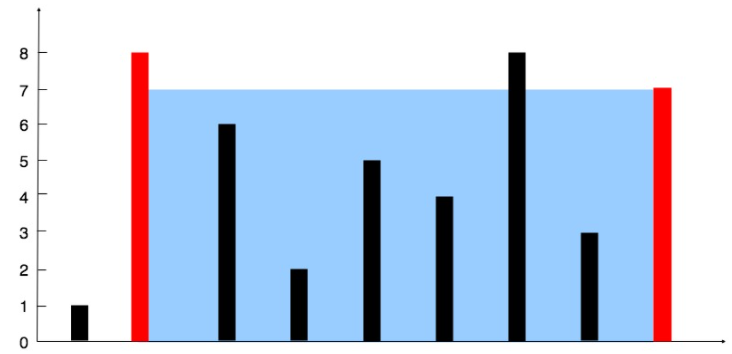

### 移除元素
#### 题目
给你一个数组 `nums` 和一个值 `val`，你需要 **[原地](https://baike.baidu.com/item/%E5%8E%9F%E5%9C%B0%E7%AE%97%E6%B3%95)** 移除所有数值等于 `val` 的元素，并返回移除后数组的新长度。

不要使用额外的数组空间，你必须仅使用 `O(1)` 额外空间并 **[原地](https://baike.baidu.com/item/%E5%8E%9F%E5%9C%B0%E7%AE%97%E6%B3%95) 修改输入数组**。

元素的顺序可以改变。你不需要考虑数组中超出新长度后面的元素。
```
**输入：**nums = [0,1,2,2,3,0,4,2], val = 2 
**输出：**5, nums = [0,1,4,0,3] 
**解释：**函数应该返回新的长度 **`5`**, 并且 nums 中的前五个元素为 **`0`**, **`1`**, **`3`**, **`0`**, **4**。注意这五个元素可为任意顺序。你不需要考虑数组中超出新长度后面的元素。
```
#### 思路
快慢指针，删除过程如下所示


#### 题解
```java
class Solution {  
    public int removeElement(int[] nums, int val) {  
        if(nums.length == 0) return 0;  
        int slow = 0;  
        for(int fast = 0; fast < nums.length; fast++){  
            if(nums[fast] != val){  
                nums[slow++] = nums[fast];  
            }  
        }        return slow;  
    }  
}
```

### 删除排序数组中的重复项
#### 题目
给你一个有序数组 `nums` ，请你 **原地** 删除重复出现的元素，使每个元素 **只出现一次** ，返回删除后数组的新长度。
#### 思路
使用快慢指针，如果快指针位置的值与慢指针位置的值不一致，慢指针下一个位置的值才是快指针的值
#### 题解
```java
class Solution {
    public int removeDuplicates(int[] nums) {
        if(nums.length == 0) return 0;
        int slow = 0;
        for(int fast = 0; fast < nums.length; fast++){
            if(nums[slow] != nums[fast]){
                nums[++slow] = nums[fast];
            }
        }
        return slow + 1;
    }
}
```

### 删除有序数组中的重复项||
#### 题目
给你一个有序数组 `nums` ，请你 **[原地](http://baike.baidu.com/item/%E5%8E%9F%E5%9C%B0%E7%AE%97%E6%B3%95)** 删除重复出现的元素，使得出现次数超过两次的元素**只出现两次** ，返回删除后数组的新长度。

不要使用额外的数组空间，你必须在 **[原地](https://baike.baidu.com/item/%E5%8E%9F%E5%9C%B0%E7%AE%97%E6%B3%95) 修改输入数组** 并在使用 O(1) 额外空间的条件下完成。
#### 思路
对于此类问题，我们应该进行如下考虑：
-   由于是保留 `k` 个相同数字，**对于前 `k` 个数字，我们可以直接保留。**
-   对于后面的任意数字，能够保留的前提是：**与当前写入的位置前面的第 `k` 个元素进行比较，不相同则保留。**
#### 题解
```java
class Solution {
    public int removeDuplicates(int[] nums) {
        if(nums.length == 0) return 0;
        int slow = 0;
        for(int fast = 0; fast < nums.length; fast++){
            if(slow < 2 || nums[slow-2] != nums[fast]){
                nums[slow++] = nums[fast];
            }
        }
        return slow;
    }
}
```

### 三数之和
#### 题目
给你一个包含 n 个整数的数组 nums，判断 nums 中是否存在三个元素 a，b，c ，使得 a + b + c = 0 ？请你找出所有和为 0 且不重复的三元组。
#### 思路
特判，对于数组长度 n，如果数组为 null或者数组长度小于 3，返回 `[]`。
对数组进行排序。
遍历排序后数组：
若 `nums[i]>0`：因为已经排序好，所以后面不可能有三个数加和等于 0，直接返回结果。
对于重复元素：跳过，避免出现重复解
令左指针 `L=i+1`，右指针 `R=n-1`，当 `L<R` 时，执行循环：
当 `nums[i]+nums[L]+nums[R]==0`，执行循环，判断左界和右界是否和下一位置重复，去除重复解。并同时将 L,R 移到下一位置，寻找新的解
若和大于 0，说明` nums[R]` 太大，RR 左移
若和小于 0，说明 `nums[L]`  太小，LL 右移
#### 题解
```java
public class unrepeatedTriple {

    public List<List<Integer>> threeSum(int[] nums) {
        List<List<Integer>> lists = new ArrayList<>();
        //排序
        Arrays.sort(nums);
        //双指针
        int len = nums.length;
        for(int i = 0;i < len;++i) {
            if(nums[i] > 0) return lists;

            if(i > 0 && nums[i] == nums[i-1]) continue;

            int curr = nums[i];
            int L = i+1, R = len-1;
            while (L < R) {
                int tmp = curr + nums[L] + nums[R];
                if(tmp == 0) {
                    List<Integer> list = new ArrayList<>();
                    list.add(curr);
                    list.add(nums[L]);
                    list.add(nums[R]);
                    lists.add(list);
                    while(L < R && nums[L+1] == nums[L]) ++L;
                    while (L < R && nums[R-1] == nums[R]) --R;
                    ++L;
                    --R;
                } else if(tmp < 0) {
                    ++L;
                } else {
                    --R;
                }
            }
        }
        return lists; 
    }
}
```

### 第三大的数
#### 题目
给你一个非空数组，返回此数组中 **第三大的数** 。如果不存在，则返回数组中最大的数。
注意，要求返回第三大的数，是指在所有不同数字中排第三大的数。
#### 思路
先使用set去重，然后循环遍历放到数组中排序
#### 题解
```java
    public int thirdMax(int[] nums) {
        Set<Integer> set = new HashSet<>();
        for (int i=0;i<nums.length;i++){
            if(!set.contains(nums[i])){
                set.add(nums[i]);
            }
            else continue;
        }
        int[] list = new int[set.size()];
        int i = 0;
        for(Integer num:set){
            list[i] = num;
            i++;
        }
        Arrays.sort(list);
        if(list.length<3){
            return list[list.length-1];
        }
        else return list[list.length-3];
    }
```

### 移动0
#### 题目
给定一个数组 `nums`，编写一个函数将所有 `0` 移动到数组的末尾，同时保持非零元素的相对顺序。
#### 思路
使用双指针，左指针指向当前已经处理好的序列的尾部，右指针指向待处理序列的头部。
右指针不断向右移动，每次右指针指向非零数，则将左右指针对应的数交换，同时左指针右移。注意到以下性质：
左指针左边均为非零数；
右指针左边直到左指针处均为零。
全覆盖补0也可以
#### 题解
```java
class Solution {
    public void moveZeroes(int[] nums) {
        int n = nums.length, left = 0, right = 0;
        while (right < n) {
            if (nums[right] != 0) {
                swap(nums, left, right);
                left++;
            }
            right++;
        }
    }

    public void swap(int[] nums, int left, int right) {
        int temp = nums[left];
        nums[left] = nums[right];
        nums[right] = temp;
    }
}

//-------------------------------
public class moveZeroes {  
    public void moveZeroes(int[] nums) {  
        int i = 0;  
 for(int num :nums){  
            if(num!=0){  
                nums[i] = num;  
 i++;  
 }  
        }  
        for(int j = i+1; j<nums.length; j++){  
            nums[j] = 0;  
 }  
    }  
}
```

### h指数
#### 题目
给定一位研究者论文被引用次数的数组（被引用次数是非负整数），数组已经按照 升序排列 。编写一个方法，计算出研究者的 h 指数。
h 指数的定义: “h 代表“高引用次数”（high citations），一名科研人员的 h 指数是指他（她）的 （N 篇论文中）总共有 h 篇论文分别被引用了至少 h 次。（其余的 N - h 篇论文每篇被引用次数不多于 h 次。）"
输入: citations = `[0,1,3,5,6]`
输出: 3 
解释: 给定数组表示研究者总共有 5 篇论文，每篇论文相应的被引用了 0, 1, 3, 5, 6 次。
     由于研究者有 3 篇论文每篇至少被引用了 3 次，其余两篇论文每篇被引用不多于 3 次，所以她的 h 指数是 3。
#### 解题思路
查找范围的初始左边界 `left` 为 `0`, 初始右边界 `right` 为 `n-1`，其中 `n`为数组 `citations` 的长度。每次在查找范围内取中点 `mid`，则有 `n−mid` 篇论文被引用了至少 `citations[mid]` 次。如果在查找过程中满足`citations[mid]` $\ge$`n-mid` ，则移动右边界 right，否则移动左边界left。
#### 题解
```java
class Solution {
    public int hIndex(int[] cs) {
        int n = cs.length;
        int l = 0, r = n;
        while (l < r) {
            int mid = l + r + 1 >> 1;
            if (check(cs, mid)) l = mid;
            else r = mid - 1;
        }
        return r;
    }
    boolean check(int[] cs, int mid) {
        int ans = 0;
        for (int i : cs) if (i >= mid) ans++;
        return ans >= mid;
    }
}
```

### 下一个序列
#### 题目
实现获取下一个排列 的函数，算法需要将给定数字序列重新排列成字典序中下一个更大的排列。
如果不存在下一个更大的排列，则将数字重新排列成最小的排列（即升序排列）。
必须原地修改，只允许使用额外常数空间
#### 思路
1. 下一个序列的意思是，123456->123465，字典序的下一个排列
2. 首先从后往前搜索，应该找到`nums[i]`<`nums[i+1]`的数i，这样才可以保证是字典序的下一个排列，即让排列尽可能小，i后面的数自然是**降序**排列，
3. 从i往后搜索，将相对小的大数与i位置的数交换，
4. 然后将i后的数做逆序排列
#### 题解
```java
public class nextPermutation {
    public static void nextPermutation(int[] nums) {
        if(nums.length<2) return;
        int i;
        for(i=nums.length-2; i>=0; i--){
            if(nums[i+1]>nums[i]){
                break;
            }
        }
        if(i!=-1){
            int j;
            for (j=i+1;j<nums.length;j++)
            {
                if(nums[j]<=nums[i]) break;
            }
            swap(nums,i,j-1);
        }
        for (int j=i+1,k=nums.length-1;j<k;j++,k--){
            swap(nums,j,k);
        }
    }

    public static void swap(int[] nums,int a, int b) {
        int temp = nums[a];
        nums[a] = nums[b];
        nums[b] = temp;
    }

    public static void main(String[] args){
        int[] nums = {1,3,2,7,6,5}; //1,3,5,2,6,7
        nextPermutation(nums);
        for(int num: nums){
            System.out.print(num + " ");
        }
    }
}
```

### 逆序对
#### 题目
在数组中的两个数字，如果前面一个数字大于后面的数字，则这两个数字组成一个逆序对。输入一个数组，求出这个数组中的逆序对的总数。
#### 思路
采用归并排序的方法，在合并数组时统计逆序对的对数
#### 题解
```java
public class reversPair {
    private static int count;
    public int reversePairs(int[] nums) {
        if(nums.length<2) return 0;
        this.count = 0;
        sort(nums,0,nums.length-1);
        return count;
    }

    public static void sort(int[] nums,int left, int right){
        if(left==right) return;
        int mid = left + (right-left)/2;
        sort(nums,left,mid);
        sort(nums,mid+1,right);
        merge(nums,left,mid+1,right);
    }

    public static void merge(int[] nums,int leftPtr,int rightPtr, int rightBound){
        int mid = rightPtr-1;
        int i = leftPtr;
        int j = rightPtr;
        int k = 0;
        int[] temp = new int[rightBound-leftPtr+1];

        while(i<=mid && j<=rightBound){
            if(nums[i]<=nums[j]){
                temp[k++] = nums[i++];
            }
            else {
                temp[k++] = nums[j++];
                count = count + mid-i+1;
            }
        }
        while (i<=mid) temp[k++]=nums[i++];
        while (j<=rightBound) temp[k++] = nums[j++];

        for(int m=0; m<temp.length;m++)
            nums[leftPtr+m] = temp[m];
    }
}
```

### 盛最多水的容器
#### 题目
给你 n 个非负整数 `a1，a2，...，an`，每个数代表坐标中的一个点 (i, ai) 。在坐标内画 n 条垂直线，垂直线 i 的两个端点分别为 (i, ai) 和 (i, 0) 。找出其中的两条线，使得它们与 x 轴共同构成的容器可以容纳最多的水。说明：你不能倾斜容器。    

#### 思路
设两指针 ii , jj ，指向的水槽板高度分别为 `h[i]h[i] , h[j]h[j]` ，此状态下水槽面积为 S(i, j)S(i,j) 。由于可容纳水的高度由两板中的短板决定。
在每个状态下，无论长板或短板向中间收窄一格，都会导致水槽 底边宽度 -1变短：
* 若向内移动短板 ，水槽的短板` min(h[i],h[j])`可能变大，因此下个水槽的面积可能大 
* 若向内移动长板 ，水槽的短板 `min(h[i],h[j])`不变或变小，因此下个水槽的面积一定小 
#### 题解
```java
class Solution {
    public int maxArea(int[] height) {
        int ans = 0;
        int i = 0;
        int j = height.length-1;
        while (i<j){
            int w = j-i;
            int h = Math.min(height[i],height[j]);
            ans = Math.max(ans,w*h);
            if (height[i]>height[j]) j--;
            else i++;
        }
        return ans;
    }
}
```

### 单词距离
#### 题目
有个内含单词的超大文本文件，给定任意两个不同的单词，找出在这个文件中这两个单词的最短距离(相隔单词数)。如果寻找过程在这个文件中会重复多次，而每次寻找的单词不同，你能对此优化吗?


### 乘积小于K的子数组
#### 题目
给你一个整数数组 nums 和一个整数 k ，请你返回子数组内所有元素的乘积严格小于 k 的连续子数组的数目。
```
输入：nums = [10,5,2,6], k = 100
输出：8
解释：8 个乘积小于 100 的子数组分别为：[10]、[5]、[2],、[6]、[10,5]、[5,2]、[2,6]、[5,2,6]。
需要注意的是 [10,5,2] 并不是乘积小于 100 的子数组。
```

#### 思路
首先定义两个指针 left 和 right，后续遍历数组与记录用

1. 左右指针起始均在位置 0 ；用右指针遍历数组，每次循环中右指针右移一次；
2. 移动过程中纪录从左指针到右指针路上的连续数的乘积为 mul；
3. 如果乘积大于 k 了，则左指针右移，注意此处用的是 while 来使左指针右移，因为实际情况可能是：右指针最后右移一次指向了一个比较大的数使得 mul 不小于目标值，此时左指针需要右移多次才能使得 mul 刚小于 k；
4. 最后用 ans 记录 mul 小于 k 时的数组组合；
#### 题解
```java
class Solution {
    public int numSubarrayProductLessThanK(int[] nums, int k) {
        //同样排除k为1的情况比如  [1,1,1] k=1
        if (k <= 1) {
            return 0;
        }
        int left = 0;
        int right = 0;
        //创建一个变量记录路上的乘积
        int mul = 1;
        //记录连续数组的组合个数
        int ans = 0;

        //用右指针遍历整个数组，每次循环右指针右移一次
        while(right<nums.length) {
            //记录乘积
            mul *= nums[right];
            //当大于等于k，左指针右移并把之前左指针的数除掉
            while (mul >= k) {
                mul /= nums[left];
                left++;
            }

            //每次右指针位移到一个新位置，应该加上 x 种数组组合：
            //  nums[right]
            //  nums[right-1], nums[right]
            //  nums[right-2], nums[right-1], nums[right]
            //  nums[left], ......, nums[right-2], nums[right-1], nums[right]
            //共有 right - left + 1 种
            ans += right - left + 1;

            //右指针右移
            right++;
        }
        return ans;
    }
}
```
