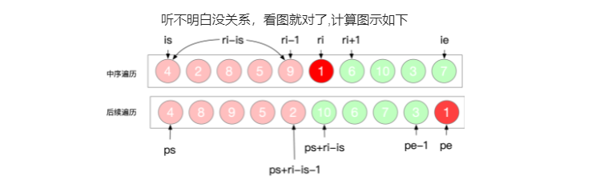

# 数组
### 动态数组
#### 题目
实现一个动态数组的各种功能

```
输入：
`["LCArray", "size", "push_back", "pop_back", "size", "push_back", "size", "index", "pop_back", "push_back"]`
`[[], [], [95], [], [], [37], [], [0], [], [28]]`
输出：
`[null,0,null,null,0,null,1,37,null,null]`
```

解释：
```java
LCArray l = LCArray()
l.size()        // 获取数组长度，此时数组为空，返回 0
l.push_back(95) // 在数组末尾插入新元素 95，返回 null
l.pop_back()    // 删除数组中的最后一个元素，返回 null
l.size()        // 获取数组长度，此时数组为空，返回 0
l.push_back(37) // 在数组末尾插入新元素 37，返回 null
l.size()        // 获取数组长度，返回 1
l.index(0)      // 返回数组中下标为 0 的元素 37
l.pop_back()    // 删除数组中的最后一个元素，返回 null
l.push_back(28) // 在数组末尾插入新元素 28，返回 null
```
#### 思路
使用静态数组，配合两个指针，对数组的容量进行动态扩容
#### 题解
```java
class dynamicArray {  
	private int maxPos;  
	private int curPos;  
	private int[] staticArray;  
	public dynamicArray() {  
        this.maxPos = 1;  
		this.curPos = 0;  
		this.staticArray = new int[1];  
	}  
	
	public void push_back(int n){  
        if(curPos == maxPos){  
            int[] newArray = new int[2*maxPos];  
			System.arraycopy(staticArray,0,newArray,0,maxPos);  
			this.maxPos = 2*maxPos;  
			this.staticArray = newArray;  
		}  
		staticArray[curPos] = n;  
		curPos++;  
	}  
  
    public void pop_back(){  
        curPos = curPos-1;  
	}  
  
    public int size(){  
        return curPos;  
	}  
  
    public int index(int idx){  
        return staticArray[idx];  
	}  
}
```


# 链表
### 环路检测
#### 题目
给定一个链表，如果它是有环链表，实现一个算法返回环路的开头节点。
#### 思路
如果链表中有某个节点，可以通过连续跟踪 next 指针再次到达，则链表中存在环。 为了表示给定链表中的环，我们使用整数 pos 来表示链表尾连接到链表中的位置（索引从 0 开始）。如果 pos 是 -1，则在该链表中没有环。注意：pos不作为参数进行传递，仅仅是为了标识链表的实际情况。
#### 题解
```java
public class Solution {
	public ListNode detectCycle(ListNode head) {
		ListNode pos = head;
		Set<ListNode> set = new HashSet<>();
		while(pos!=null)
		{
			if(set.contains(pos))
			{
				return pos;
			}
			else
			{
				set.add(pos);
			}
			pos = pos.next;
		}
		return null; 
	}
}
```

### 环路检测II
#### 题目
给定一个链表，返回链表开始入环的第一个节点。 如果链表无环，则返回 null。
为了表示给定链表中的环，我们使用整数 pos 来表示链表尾连接到链表中的位置（索引从 0 开始）。 如果 pos 是 -1，则在该链表中没有环。注意，pos 仅仅是用于标识环的情况，并不会作为参数传递到函数中。
说明：不允许修改给定的链表。
进阶：
你是否可以使用 O(1) 空间解决此题？
#### 思路
1. 环路检测：双指针，一个快，每次走两步；一个慢，一次走一步，套圈的时候找到交点
2. 找到入口：头节点到环入口a个节点，环路上b个节点，n为绕环的圈数，到入口是a+nb个节点，让快节点从头节点出发，慢节点在之前的nb节点出发，每次走一步，相遇的时候即在入口节点。
#### 题解
```java
class ListNode1 {
    int val;
    ListNode1 next;
    ListNode1(int x) {
        val = x;
        next = null;
    }
 }

public class detectCycle {
    public ListNode1 detectCycle(ListNode1 head){
        if(head==null) return null;
        ListNode1 fast = head, slow = head;
        while (true){
            if(fast==null || fast.next ==null) return null;
            fast = fast.next.next;
            slow = slow.next;
            if(fast==slow) break;
        }
        fast = head;
        while (slow!=fast){
            slow = slow.next;
            fast = fast.next;
        }
        return fast;
    }
}
```


### 反转链表
#### 题目
定义一个函数，输入一个链表的头节点，反转该链表并输出反转后链表的头节点。
#### 思路
使用迭代的思路：用pre保存当前节点，然后令当前节点的next节点等于pre节点，循环往复，直到当前节点为null为止。
#### 题解
```java
class Solution {
	public ListNode reverseList(ListNode head) {
		ListNode pre = null;
		ListNode cur = null;
		while(head!=null)
		{
			cur = head;
			head = head.next;
			cur.next = pre;
			pre = cur;
		}
		return pre;
	}
}
//---------------------------------递归--------------------------
class Solution {
    public ListNode reverseList(ListNode head) {
        return recur(head, null);    // 调用递归并返回
    }
    private ListNode recur(ListNode cur, ListNode pre) {
        if (cur == null) return pre; // 终止条件
        ListNode res = recur(cur.next, cur);  // 递归后继节点
        cur.next = pre;              // 修改节点引用指向
        return res;                  // 返回反转链表的头节点
    }
}
```

### 删除列表的倒数第N个节点
#### 题目
给你一个链表，删除链表的倒数第 `n` 个结点，并且返回链表的头结点。
#### 思路
双指针，第一个指针与第二个指针保持n个节点的举例，当第一个指针到达末尾时，第二个指针的下一个节点即为要删除的节点。
#### 题解
```java
public class removeNthFromEnd {
    public Node removeNthFromEnd(Node head, int n) {
        Node dummy = new Node(0,head);
        Node second = dummy;
        Node first = head;
        for(int i = 0; i<n; i++){
            first = first.next;
        }
        while (first!=null){
            first = first.next;
            second = second.next;
        }
        second.next = second.next.next;
        Node ans = dummy.next;
        return ans;
    }
}
```


### 复制带随机指针的链表
#### 题目
给你一个长度为 n 的链表，每个节点包含一个额外增加的随机指针 random ，该指针可以指向链表中的任何节点或空节点。
构造这个链表的 深拷贝。 深拷贝应该正好由 n 个 全新 节点组成，其中每个新节点的值都设为其对应的原节点的值。新节点的 next 指针和 random 指针也都应指向复制链表中的新节点，并使原链表和复制链表中的这些指针能够表示相同的链表状态。复制链表中的指针都不应指向原链表中的节点 。
例如，如果原链表中有 X 和 Y 两个节点，其中 X.random --> Y 。那么在复制链表中对应的两个节点 x 和 y ，同样有 x.random --> y 。
返回复制链表的头节点。
用一个由 n 个节点组成的链表来表示输入/输出中的链表。每个节点用一个 `[val, random_index]` 表示：
val：一个表示 Node.val 的整数。
random_index：随机指针指向的节点索引（范围从 0 到 n-1）；如果不指向任何节点，则为  null 。
你的代码 只 接受原链表的头节点 head 作为传入参数。
#### 思路
主要难点在于判断随机指针所指向的节点有没有被重复创建，可以用哈希表来判断
#### 题解
```java
public class copyRandomList {
    HashMap<Node, Node> visited = new HashMap<Node, Node>();
    public Node getClonedNode(Node node) {
        // If the node exists then
        if (node == null) return null;
        if (!this.visited.containsKey(node)) {
            this.visited.put(node, new Node(node.val, null, null));
        }
        return this.visited.get(node);
    }

    public Node copyRandomList(Node head) {
        if (head == null) return null;
        Node oldNode = head;
        Node newNode = new Node(oldNode.val);
        this.visited.put(oldNode, newNode);
        while (oldNode != null) {
            newNode.random = this.getClonedNode(oldNode.random);
            newNode.next = this.getClonedNode(oldNode.next);
            oldNode = oldNode.next;
            newNode = newNode.next;
        }
        return this.visited.get(head);
    }
}
```

### 两个链表的第一个公共节点
#### 题目
输入两个链表，找出它们的第一个公共节点。
输入：intersectVal = 8, listA = `[4,1,8,4,5]`, listB = `[5,0,1,8,4,5]`, skipA = 2, skipB = 3
输出：Reference of the node with value = 8
输入解释：相交节点的值为 8 （注意，如果两个列表相交则不能为 0）。从各自的表头开始算起，链表 A 为` [4,1,8,4,5]`，链表 B 为 `[5,0,1,8,4,5]`。在 A 中，相交节点前有 2 个节点；在 B 中，相交节点前有 3 个节点。
#### 思路
哈希表遍历或者双指针解法（走过你来时的路）
#### 题解
```java
public class getIntersectionNode {
    public ListNode getIntersectionNode(ListNode headA, ListNode headB) {
        if(headA==null||headB==null) return null;
        ListNode a = headA;
        ListNode b = headB;
        while (a!=b){
            a= a==null?headB:a.next;
            b= b==null?headA:b.next;
        }
        return a;
    }
}
```


### 两数相加
#### 题目
给你两个 非空 的链表，表示两个非负的整数。它们每位数字都是按照 逆序 的方式存储的，并且每个节点只能存储 一位 数字。
请你将两个数相加，并以相同形式返回一个表示和的链表。
你可以假设除了数字 0 之外，这两个数都不会以 0 开头。
```
**输入：**l1 = [2,4,3], l2 = [5,6,4]
**输出：**[7,0,8]
**解释：**342 + 465 = 807.
```
#### 题目
1. 在短链表后面补0至两条链表长度相同
2. 每个位置上的数等于两链表节点数值相加，再加上进位 x+y+carry
3. 如果遍历完毕，carry大于0，则新增节点carry
#### 题解
```java
class Solution {
    public ListNode addTwoNumbers(ListNode l1, ListNode l2) {
       ListNode pre = new ListNode(-1);
       ListNode cur = pre;
       int carry = 0;
       while (l1!=null||l2!=null){
           int num1 = l1==null? 0:l1.val;
           int num2 = l2==null? 0:l2.val;
           int sum = num1+num2+carry;
           cur.next = new ListNode(sum%10);
           carry = sum/10;
           cur = cur.next;
           if (l1!=null) l1 = l1.next;
           if (l2!=null) l2 = l2.next;
       }
       if (carry>0){
           cur.next = new ListNode(carry);
       }
       return pre.next;
    }
}
```

### 合并两个有序链表
#### 题目
将两个升序链表合并为一个新的 **升序** 链表并返回。新链表是通过拼接给定的两个链表的所有节点组成的。
#### 思路
如果 l1 或者 l2 一开始就是空链表 ，那么没有任何操作需要合并，所以我们只需要返回非空链表。否则，我们要判断 l1 和 l2 哪一个链表的头节点的值更小，然后递归地决定下一个添加到结果里的节点。如果两个链表有一个为空，递归结束。
#### 题解
```java
class Solution {
    public ListNode mergeTwoLists(ListNode l1, ListNode l2) {
        if (l1 == null) {
            return l2;
        } else if (l2 == null) {
            return l1;
        } else if (l1.val < l2.val) {
            l1.next = mergeTwoLists(l1.next, l2);
            return l1;
        } else {
            l2.next = mergeTwoLists(l1, l2.next);
            return l2;
        }
    }
}
```


# 哈希表
### 卡牌分组
#### 题目
给定一副牌，每张牌上都写着一个整数。
此时，你需要选定一个数字 X，使我们可以将整副牌按下述规则分成 1 组或更多组：
每组都有 X 张牌。
组内所有的牌上都写着相同的整数。
仅当你可选的 X >= 2 时返回 true。
```
**输入：**[1,2,3,4,4,3,2,1]
**输出：**true
**解释：**可行的分组是 [1,1]，[2,2]，[3,3]，[4,4]
```
#### 思路
辗转相除法求最大公约数
#### 题解
```java
public class cardGroup {
    public static boolean hasGroupsSizeX(int[] deck) {
        if(deck ==null || deck.length<2) return false;
        HashMap<Integer,Integer> map = new HashMap<>();
        for(int num :deck){
            if(!map.containsKey(num)){
                map.put(num,1);
            }
            else{
                int count = map.get(num);
                map.replace(num,count+1);
            }
        }
        int[] list = new int[map.size()];
        int i =0;
        for(Integer value: map.values()){
            if(value==1) return false;
            list[i] = value;
            i++;
        }

        int g = -1;
        for(int j=0; j<list.length; j++){
            if(g==-1){
                g = list[j];
            }
            else {
                g = gcd(g,list[j]);
            }
        }

        return g>=2;
    }

    public static int gcd(int x, int y){
        return x==0 ? y:gcd(y%x,x);
    }
```

### 两数之和
#### 题目
给定一个整数数组 nums 和一个整数目标值 target，请你在该数组中找出 和为目标值 target  的那 两个 整数，并返回它们的数组下标。
你可以假设每种输入只会对应一个答案。但是，数组中同一个元素在答案里不能重复出现。
你可以按任意顺序返回答案。
#### 思路
使用一个 HashMap 来存储数字和其坐标位置之间的映射。判断数组中是否有与这个数的和为目标值的另一个数。
#### 题解
```java
public class sumOfTwoNumber {
    public int[] twoSum(int[] nums, int target) {
        if(nums.length<2 || nums==null) return null;
        HashMap<Integer,Integer> map = new HashMap<>();
        for(int i=0; i<nums.length; i++){
            int res = target - nums[i];
            if(map.containsKey(res)){
                return new int[] {map.get(res),i};
            }
            map.put(nums[i],i);
        }
        return new int[] {};

    }
}
```

### 求数组中每个数第一次出现的位置
#### 题目
给定一维数组，求数组中从左往右每个数字第一次 出现的位置。如果是第一次出现则返回 -1。
示例：
输入：`[1,3,1,2,1]`
输出：`[-1,-1,0,-1,0]`
解释：数字 1 出现了三次，第一次出现的位置是 0，所以除了 0 位置是 -1，其他数字 1 对应的位置答案均为 0。
#### 思路

#### 题解
```java
public class FirstAppearedPos {
    public static int[] find_left_repeat_num(int[] nums) {
        if(nums==null) return null;
        int[] ans = new int[nums.length];
        HashMap<Integer,Integer> map = new HashMap<>();
        for(int i = 0; i< nums.length; i++){
            if(map.containsKey(nums[i])){
                ans[i] = map.get(nums[i]);
            }
            else {
                ans[i] = -1;
                map.put(nums[i],i);}
        }
        return ans;
    }
```

### 数组大小减半
#### 题目
给你一个整数数组 `arr`。你可以从中选出一个整数集合，并删除这些整数在数组中的每次出现。返回 **至少** 能删除数组中的一半整数的整数集合的最小大小。
#### 思路
使用哈希表统计数组中各数出现的次数，注意题目中为减去数组至少一半的长度，
我们可以优先访问重复最多的数的次数，如果其大于等于数组的一半长度即可返回1，
不够一半向后加重复第二多的数的次数，以此类推，最后返回累加的个数即可。
#### 题解
```java
public class solution {
    public static int minSetSize(int[] arr) {
        if(arr==null) return -1;
        HashMap<Integer,Integer> map = new HashMap<>();
        List<Integer> list = new ArrayList<>();
        for(int num:arr){
            if(!map.containsKey(num)){
                map.put(num,1);
            }
            else {
                int count = map.get(num);
                map.replace(num,count+1);
            }
        }
        double target = Math.ceil(arr.length/2);
        for(int ele: map.values()){
            list.add(ele);
        }
        int[] res =new int[list.size()];
        for (int j = 0; j<res.length; j++){
            res[j] = list.get(j);
        }
        Arrays.sort(res);
        int sum = 0;
        for(int i=res.length-1; i>=0 ;i--){
            sum = sum + res[i];
            if(res[i]>=target) return 1;
            else{
                if(sum>=target) return res.length-i;
                else continue;
            }
        }
        return -1;
    }
}
```


# 队列
### 用队列实现栈
#### 题目
用队列实现栈的功能
#### 思路
两个队列，pop时将一个队列中的数据留最后一个弹出，其它的转移到别的队列中，然后交换队列的指针
#### 题解
```java
class MyStack {

        /**
         * Initialize your data structure here.
         */
        private Queue<Integer> q1;
        private Queue<Integer> q2;

        /**
         * Initialize your data structure here.
         */
        public MyStack() {
            this.q1 = new LinkedList<>();
            this.q2 = new LinkedList<>();
        }

        /**
         * Push element x onto stack.
         */
        public void push(int x) {
            q1.add(x);
        }

        /**
         * Removes the element on top of the stack and returns that element.
         */
        public int pop() {
            this.top();
            Queue<Integer> temp = q1;
            q1 = q2;
            q2 = temp;
            return q2.poll();
        }

        /**
         * Get the top element.
         */
        public int top() {
            while (q1.size() > 1) {
                int element = q1.poll();
                q2.add(element);
            }
            return q1.peek();
        }

        /**
         * Returns whether the stack is empty.
         */
        public boolean empty() {
            return q1.isEmpty() && q2.isEmpty();
        }
    }
```

### 查找最小的k对数字
#### 题目
给定两个以升序排列的整数数组 nums1 和 nums2 , 以及一个整数 k 。
定义一对值 (u,v)，其中第一个元素来自 nums1，第二个元素来自 nums2 。
请找到和最小的 k 个数对 (u1,v1),  (u2,v2)  ...  (uk,vk) 。
```
输入: nums1 = [1,7,11], nums2 = [2,4,6], k = 3
输出: [1,2],[1,4],[1,6]
解释: 返回序列中的前 3 对数：
     [1,2],[1,4],[1,6],[7,2],[7,4],[11,2],[7,6],[11,4],[11,6]
```
#### 思路
维护一个小顶堆，先将第一个数组所有与第二个数组的第一个元素配对添加进小顶堆中，然后弹出堆顶元素，加入新元素
#### 题解
```java
    public List<List<Integer>> kSmallestPairs(int[] nums1, int[] nums2, int k) {
        // 小顶堆
        PriorityQueue<int[]> queue = new PriorityQueue<>(
                (o1, o2) -> (nums1[o1[0]] + nums2[o1[1]]) - (nums1[o2[0]] + nums2[o2[1]]));
        List<List<Integer>> res = new LinkedList<>();
        // 两个数组有一个为空，返回空
        if(nums1.length==0 || nums2.length == 0 ||k==0){
            return res;
        }
        // 将我们假想的每个数组的第一项加入小顶堆
        for (int i = 0; i < Math.min(nums1.length, k); i++) {
            queue.add(new int[] { i, 0 }); // 加入的是坐标，小顶堆的比较器也是基于坐标比较
        }
        // 循环K次或者堆空
        while (k > 0 && !queue.isEmpty()) {
            // 弹出堆顶元素
            int[] pair = queue.poll();
            List<Integer> item = new ArrayList<>();
            item.add(nums1[pair[0]]);
            item.add(nums2[pair[1]]);
            // 若我们假想的数组有下一个元素，则加入小顶堆
            if (pair[1] < nums2.length - 1) {
                queue.add(new int[] { pair[0], pair[1] + 1 });
            }
            res.add(item);
            k--;
        }
        return res;
    }
```

### 合并K个升序链表
#### 题目
给你一个链表数组，每个链表都已经按升序排列。
请你将所有链表合并到一个升序链表中，返回合并后的链表。
```
输入：lists = [[1,4,5],[1,3,4],[2,6]]
输出：[1,1,2,3,4,4,5,6]
解释：链表数组如下：
[
  1->4->5,
  1->3->4,
  2->6
]
将它们合并到一个有序链表中得到。
1->1->2->3->4->4->5->6
```
#### 思路
1. 使用优先队列
2. 使用分治的思想，借鉴归并排序
#### 题解
```java
//优先队列
/**
 * Definition for singly-linked list.
 * public class ListNode {
 *     int val;
 *     ListNode next;
 *     ListNode(int x) { val = x; }
 * }
 */
class Solution {
   public ListNode mergeKLists(ListNode[] lists) {
        if (lists == null || lists.length == 0) return null;
        PriorityQueue<ListNode> queue = new PriorityQueue<>(lists.length, new Comparator<ListNode>() {
            @Override
            public int compare(ListNode o1, ListNode o2) {
                if (o1.val < o2.val) return -1;
                else if (o1.val == o2.val) return 0;
                else return 1;
            }
        });
        ListNode dummy = new ListNode(0);
        ListNode p = dummy;
        for (ListNode node : lists) {
            if (node != null) queue.add(node);
        }
        while (!queue.isEmpty()) {
            p.next = queue.poll();
            p = p.next;
            if (p.next != null) queue.add(p.next);
        }
        return dummy.next;
    }
}

//分而治之
/**
 * Definition for singly-linked list.
 * public class ListNode {
 *     int val;
 *     ListNode next;
 *     ListNode(int x) { val = x; }
 * }
 */
class Solution {
   public ListNode mergeKLists(ListNode[] lists) {
        if (lists == null || lists.length == 0) return null;
        return merge(lists, 0, lists.length - 1);
    }

    private ListNode merge(ListNode[] lists, int left, int right) {
        if (left == right) return lists[left];
        int mid = left + (right - left) / 2;
        ListNode l1 = merge(lists, left, mid);
        ListNode l2 = merge(lists, mid + 1, right);
        return mergeTwoLists(l1, l2);
    }

    private ListNode mergeTwoLists(ListNode l1, ListNode l2) {
        if (l1 == null) return l2;
        if (l2 == null) return l1;
        if (l1.val < l2.val) {
            l1.next = mergeTwoLists(l1.next, l2);
            return l1;
        } else {
            l2.next = mergeTwoLists(l1,l2.next);
            return l2;
        }
    }
}
```

# 栈
### 最小栈
#### 题目
设计一个支持` push` ，`pop` ，`top` 操作，并能在常数时间内检索到最小元素的栈。    
* push(x) —— 将元素 x 推入栈中。
* pop() —— 删除栈顶的元素。
* top() —— 获取栈顶元素。
* getMin() —— 检索栈中的最小元素。
#### 思路
两个栈，一个栈用来存最小值，返回栈顶元素即可得到栈内最小值
#### 题解
```java
class MinStack {
	private Stack<Integer> stack;
	private Stack<Integer> min_stack;
	
	public MinStack() {
		stack = new Stack<>();
		min_stack = new Stack<>();
	}
	
	public void push(int x) {
		stack.push(x);
		if(min_stack.isEmpty() || x <= min_stack.peek())
			min_stack.push(x);
	}
	
	public void pop() {
		if(stack.pop().equals(min_stack.peek()))
			min_stack.pop();
	}
	
	public int top() {
		return stack.peek();
	}
	
	public int getMin() {
		return min_stack.peek();
	}
}
```
### 两个栈实现一个队列
#### 题目
用两个栈实现一个队列
#### 思路
如果使用Stack的方式来做这道题，会造成速度较慢； 原因的话是Stack继承了Vector接口，而Vector底层是一个Object[]数组，那么就要考虑空间扩容和移位的问题了。 可以使用LinkedList来做Stack的容器，因为LinkedList实现了Deque接口，所以Stack能做的事LinkedList都能做，其本身结构是个双向链表，扩容消耗少。
#### 题解
```java
class CQueue {
	private LinkedList<Integer> s1;
	private LinkedList<Integer> s2;
	
	public CQueue() {
		this.s1 = new LinkedList<>();
		this.s2 = new LinkedList<>();
	}
	
	public void appendTail(int value) {
		s1.add(value);
	}
	
	public int deleteHead() {
		while(!s1.isEmpty())
		{
			s2.add(s1.pop());
		} 
		
		if(!s2.isEmpty()) return s2.pop();
		else return -1;
	}
}
```

### 有效的括号
#### 题目
给定一个只包括` '('，')'，'{'，'}'，'['，']'` 的字符串 s ，判断字符串是否有效。
有效字符串需满足：
左括号必须用相同类型的右括号闭合。
左括号必须以正确的顺序闭合。
```
输入：s = "()"
输出：true
```
#### 思路
使用栈来进行括号的匹配
#### 题解
```java
class Solution {
    public boolean isValid(String s) {
        Map<Character,Character> map = new HashMap<>();
        Deque<Character> deque = new ArrayDeque<>();
        map.put(')','(');
        map.put(']','[');
        map.put('}','{');
        for (int i=0;i<s.length();i++){
            char c = s.charAt(i);
            if (map.containsKey(c)){
                if (deque.isEmpty()||deque.peekLast()!=map.get(c)){
                    return false;
                }
                deque.pollLast();
            }else deque.offerLast(c);
        }
        return deque.isEmpty();
    }
}
```

### 最长有效括号子串
#### 题目
给你一个只包含 '(' 和 ')' 的字符串，找出最长有效（格式正确且连续）括号子串的长度。
#### 思路
找到可以匹配的索引号，弹栈时候进行长度比较操作   
`maxAns = max(maxAns,匹配到完整括号的下标-无效括号的下标)` 
#### 题解
```java
public class longestValidParentheses {
    public int longestValidParentheses(String s) {
        if(s.length()==0) return 0;
        char[] cs = s.toCharArray();
        int maxValue = 0;
        Deque<Integer> stack = new LinkedList<>();
        stack.push(-1);
        for (int i=0;i< cs.length;i++){
            if (cs[i]=='(') {
                stack.push(i);
            }else {
                stack.pop();
                if (stack.isEmpty()){
                    stack.push(i);
                }else {
                    maxValue = Math.max(maxValue,i-stack.peek());
                }
            }
        }
        return maxValue;
    }
}
```


# 二叉树
## 二叉树的构造
### 二叉树序列化与反序列化
#### 题目
序列化是将一个数据结构或者对象转换为连续的比特位的操作，进而可以将转换后的数据存储在一个文件或者内存中，同时也可以通过网络传输到另一个计算机环境，采取相反方式重构得到原数据。
请设计一个算法来实现二叉树的序列化与反序列化。这里不限定你的序列 / 反序列化算法执行逻辑，你只需要保证一个二叉树可以被序列化为一个字符串并且将这个字符串反序列化为原始的树结构。
#### 思路
使用“#”来代表null值进行序列化，使用DFS前序遍历序列化和反序列化
#### 题解
```java
public class Solution {
// Encodes a tree to a single string.
	public String serialize(TreeNode root) 
	{
		if(root==null) return "#";
		return root.val + "," + serialize(root.left) + "," + serialize(root.right);
	} 
// Decodes your encoded data to tree. 
	public TreeNode deserialize(String data) 
	{
		if("#".equals(data)) return null;
		Queue<String> str = new LinkedList<>(Arrays.asList(data.split(",")));
		TreeNode node = deserHelper(str);
		return node;
	}
	public TreeNode deserHelper(Queue<String> str)
	{
		String s = str.poll();
		if("#".equals(s)) return null;
		int rootVal = Integer.parseInt(s);
		TreeNode root = new TreeNode(rootVal);
		root.left = deserHelper(str);
		root.right = deserHelper(str);
		return root;
	}
}
```

### 从中序与后序遍历序列构造二叉树
#### 题目
根据一棵树的中序遍历与后序遍历构造二叉树。
例如，给出
中序遍历`inorder = [9,3,15,20,7]`
后序遍历 `postorder = [9,15,7,20,3]` 
#### 思路
* 在后序遍历中，最后一个元素为树的根节点
* 在中序遍历序列中，根节点的左边为左子树，根节点的右边为右子树
树的还原过程描述：
1. 首先在后序遍历序列中找到根节点(最后一个元素)
2. 根据根节点在中序遍历中找到根节点的位置
3. 根据根节点的位置将中序遍历序列分为左子树和右子树
4. 根据根节点的位置确定左子树和右子树在中序数组和后序数组中的边界位置
5. 递归构造左子树和右子树
6. 返回根节点结束

#### 题解 
```java
class Solution
{
	int[] post;
	HashMap<Integer,Integer> memo = new HashMap<>();
	
	public TreeNode buildTree(int[] inorder, int[] postorder)
	{
		for(int i=0; i<inorder.length;i++)
			memo.put(inorder[i],i);
		post = postorder;
		TreeNode root = build(0,inorder.length-1,0,postorder.length-1)
		return root
	}
	
	public TreeNode build(int inStart, int inEnd, int postStart, int postEnd)
	{
		if(inEnd<inStart || postEnd<postStart) return null;
		int rootValue = post[postEnd];
		int rootIndex = memo.get(rootValue);
		ThreeNode node = new TreeNode(rootValue);
		node.left = buid(inStart, rootIndex-1, postStart, postStart+rootIndex-inStart-1);
		node.right = buid(rootIndex+1, inEnd, postStart+rootIndex-inStart, postEnd-1);
		return node;
	}
}
```
### 105.从前序与中序遍历序列构造二叉树
#### 题目
#### 思路
#### 题解
```java
class Solution {
	int[] pre;
	HashMap<Integer,Integer> indexList = new HashMap<>();
	
	public TreeNode buildTree(int[] preorder, int[] inorder) {
		if(preorder==null || inorder==null) return null;
		for(int i=0; i<inorder.length; i++)
		{
			indexList.put(inorder[i],i);
		}
		pre = preorder;
		TreeNode root=build(0,inorder.length-1,0,preorder.length-1);
		return root;
	}

	public TreeNode build(int inStart, int inEnd, int preStart, int preEnd)
	{
		if(inEnd<inStart || preEnd<preStart) return null;
		int rootVal = pre[preStart];
		int rootIndex = indexList.get(rootVal);
		
		TreeNode node = new TreeNode(rootVal);
		node.left = build(inStart, rootIndex-1, preStart+1, preStart+rootIndex-inStart);
		node.right = build(rootIndex+1, inEnd, preStart+rootIndex-inStart+1, preEnd);
		return node;
	}
}
```

### 翻转二叉树
#### 题目
翻转一棵二叉树。
示例：
```
输入：

     4
   /   \
  2     7
 / \   / \
1   3 6   9
输出：

     4
   /   \
  7     2
 / \   / \
9   6 3   1
```
#### 思路
先反转左右子树，然后分别对左右子树进行递归翻转
#### 题解
```java
class invertTree {
    public TreeNode invertTree(TreeNode root) {
        if(root==null) return null;
        TreeNode temp = root.left;
        root.left = root.right;
        root.right = temp;
        invertTree(root.left);
        invertTree(root.right);
        return root;
    }
}
```

### 将有序数组转换为二叉搜索树
#### 题目
给你一个整数数组 nums ，其中元素已经按 升序 排列，请你将其转换为一棵 高度平衡 二叉搜索树。

高度平衡 二叉树是一棵满足「每个节点的左右两个子树的高度差的绝对值不超过 1 」的二叉树。
#### 思路
使用分治递归的思想，取中间值为根，左右子树依次递归
#### 题解
```java
public class sortedArrayToBST {
    public TreeNode sortedArrayToBST(int[] nums) {
        int left = 0;
        int right = nums.length-1;
        return distribution(nums,left,right);
    }

    public TreeNode distribution(int[] nums,int left,int right){
        if(left>right) return null;
        int mid = left+(right-left)/2;
        TreeNode root = new TreeNode(nums[mid]);
        root.left = distribution(nums,left,mid-1);
        root.right = distribution(nums,mid+1,right);
        return root;
    }
}
```


## 二叉树的查找排序
### 对称二叉树
#### 题目
给定一个二叉树，检查它是否是镜像对称的。
#### 思路
分条件判断
#### 题解
```
    1
   / \
  2   2
 / \ / \
3  4 4  3
```
返回true 或者false
```java
/**-----------------------------递归-----------------------------------------*/
class Solution {
	public boolean isSymmetric(TreeNode root) {
		if(root==null) return true;
		TreeNode left = root.left;
		TreeNode right = root.right;
		return judge(left,right);
	}

	public boolean judge(TreeNode left, TreeNode right)
	{
		if(left==null && right==null) return true;
		if(left!=null && right==null) return false;
		if(left==null && right!=null) return false;
		return (left.val == right.val)
		&& judge(left.left,right.right)
		&& judge(left.right,right.left);
	}
}
/**-----------------------------遍历-----------------------------------------*/
```

### 填充每个节点的下一个右侧节点指针
#### 题目
给定一个 二叉树 ，其所有叶子节点都在同一层，每个父节点都有两个子节点。二叉树定义如下
```
struct Node {
  int val;
  Node *left;
  Node *right;
  Node *next;
}
```
#### 思路

#### 题解
```java
class Solution {
	public Node connect(Node root) {
		if(root==null) return null;
		Queue<Node> queue =new LinkedList<>(); 
		queue.add(root);
		while(!queue.isEmpty())
		{
			int size = queue.size();
			Node pre = null;
			for(int i=0; i<size; i++)
			{
				Node node = queue.poll();
				if(pre!=null)
				{
					pre.next = node;
				}
				pre = node;
				if(node.left!=null)
				{
					queue.add(node.left);
				}
				if(node.right!=null)
				{
					queue.add(node.right);
				}
			}
		}
		return root;
	}
}
```
迭代法
```java
class Solution {
	public Node connect(Node root) {
		if(root == null) return null;
		if(root.left!=null)
		{
			if(root.right!=null) root.left.next=root.right;
			else root.left.next = getNext(root.next);
		}
		if(root.right!=null) root.right.next = getNext(root.next);
		connect(root.right);
		connect(root.left);
		return root;
	}
	
	Node getNext(Node root)
	{
		if(root==null) return null;
		if(root.left!=null) return root.left;
		if(root.right!=null) return root.right;
		return getNext(root.next);
	}
}
```

### 二叉树的最近公共祖先
#### 题目
给定一个二叉树, 找到该树中两个指定节点的最近公共祖先。
#### 思路

#### 题解
```java
class Solution {
	public TreeNode lowestCommonAncestor(TreeNode root, TreeNode p, TreeNode q) 
	{
		if(root==null || root==p || root==q) return root;
		TreeNode left = lowestCommonAncestor(root.left,p,q);
		TreeNode right = lowestCommonAncestor(root.right,p,q);
		if(left == null) return right;
		if(right == null) return left;
		return root;
	}
}
```

### 二叉树的右视图
#### 题目
给定一个二叉树的 **根节点** `root`，想象自己站在它的右侧，按照从顶部到底部的顺序，返回从右侧所能看到的节点值。
```
输入: [1,2,3,null,5,null,4]
输出: [1,3,4]
示例 2:

输入: [1,null,3]
输出: [1,3]
示例 3:

输入: []
输出: []
```
#### 思路
层序遍历，取最后一个值
#### 题解
```java
public List<Integer> rightSideView(TreeNode root) {
        List<Integer> ans = new ArrayList<>();
        if (root==null) return ans;
        Queue<TreeNode> queue = new LinkedList<>();
        queue.add(root);
        while (!queue.isEmpty()){
            int size = queue.size();
            for(int i=0; i<size; i++){
                root = queue.poll();
                if(root.left!=null){
                    queue.add(root.left);
                }
                if(root.right!=null){
                    queue.add(root.right);
                }
                if(i==size-1){
                    ans.add(root.val);
                }
            }
        }
        return ans;
    }
```

### 二叉搜索树中第k小的元素
#### 题目
给定一个二叉搜索树的根节点 `root` ，和一个整数 `k` ，请你设计一个算法查找其中第 `k` 个最小元素（从 1 开始计数）。
```
输入：root = [3,1,4,null,2], k = 1
输出：1
```
#### 思路
二叉搜索树的特性：**中序遍历的二叉搜索树是升序排列的**
#### 题解
```java
    public int kthSmallest(TreeNode root, int k){
        List<TreeNode> list = new ArrayList<>();
        list = inorderTraversal(list,root);
        return list.get(k-1).val;
    }

    public List<TreeNode> inorderTraversal(List<TreeNode> list, TreeNode root){
        if(root==null) return list;
        inorderTraversal(list,root.left);
        list.add(root);
        inorderTraversal(list,root.right);
        return list;
    }
```

### 二叉搜索树的最小绝对值
#### 题目
给你一棵所有节点为非负值的二叉搜索树，请你计算树中任意两节点的差的绝对值的最小值。
#### 思路
利用二叉搜索树中序遍历为升序的性质，设置前置节点pre为-1，中序遍历比较其绝对值
#### 题解
```java
class Solution{
	int pre;
	int ans;
	public int getMininumDifference(TreeNode root){
		ans = Integer.MAX_VALUE;
		pre = -1;
		dfs(root);
		return ans;
	}
	
	public void dfs(TreeNode root){
		if(root==null) return;
		dfs(root.left);
		if(pre == -1){
			pre=root.val;
		}
		else{
			ans = Math.min(ans,root.val-pre);
			pre=root.val;
		}
		dfs(root.right);
	}
}
```


### 二叉搜索树迭代器
#### 题目
实现一个二叉搜索树迭代器类BSTIterator ，表示一个按中序遍历二叉搜索树（BST）的迭代器：
BSTIterator(TreeNode root) 初始化 BSTIterator 类的一个对象。BST 的根节点 root 会作为构造函数的一部分给出。指针应初始化为一个不存在于 BST 中的数字，且该数字小于 BST 中的任何元素。
boolean hasNext() 如果向指针右侧遍历存在数字，则返回 true ；否则返回 false 。
int next()将指针向右移动，然后返回指针处的数字。
注意，指针初始化为一个不存在于 BST 中的数字，所以对 next() 的首次调用将返回 BST 中的最小元素。

你可以假设 next() 调用总是有效的，也就是说，当调用 next() 时，BST 的中序遍历中至少存在一个下一个数字。
#### 思路
1. 方法一：将二叉树中序遍历放入数组，对数组实现迭代
2. 方法二：使用单调栈，迭代访问弹出
#### 题解
```java
//扁平化
public class BSTIterator {
    public List<TreeNode> IteratorList;
    public int index;

    public BSTIterator(TreeNode root) {
        List<TreeNode> list = new ArrayList<>();
        IteratorList = inorderTraversal(root,list);
        iter = list.listIterator();
		index = 0;
    }

    public static List<TreeNode> inorderTraversal(TreeNode root,List<TreeNode> list){
        while (root==null) return list;
        inorderTraversal(root.left,list);
        list.add(root);
        inorderTraversal(root.right,list);
        return list;
    }

    public int next() {
        return list.get(index++);
    }

    public boolean hasNext() {
		if(index<list.size-1) return false;
		return true;
	}
}
//用栈来迭代（维护单调栈）
class BSTIterator1 {
    Deque<TreeNode> stack;

    public BSTIterator1(TreeNode root) {
        stack = new LinkedList<>();
        while (root!=null){
            stack.push(root);
            root=root.left;
        }
    }

    public int next() {
        TreeNode nextNode = stack.pop();
        nextNode = nextNode.right;
        while (nextNode!=null){
            stack.push(nextNode);
            nextNode=nextNode.left;
        }
        return nextNode.val;
    }

    public boolean hasNext() {
        return stack.isEmpty();
    }
}
```

### 两棵二叉搜索树中的所有元素
#### 题目
给你 `root1` 和 `root2` 这两棵二叉搜索树。请你返回一个列表，其中包含 **两棵树** 中的所有整数并按 **升序** 排序。


```
输入：root1 = [2,1,4], root2 = [1,0,3]
输出：[0,1,1,2,3,4]
```
#### 思路
利用二叉搜索树中序遍历升序的条件，将二叉树转化为线性列表，再使用归并排序的方法进行整合
#### 题解
```java
class Solution {
    int INF = 0x3f3f3f3f;
    //ACM中常用表示无穷大的常量，与Integer.MAX_VALUE一个数量级，但可防止溢出
    public List<Integer> getAllElements(TreeNode root1, TreeNode root2) {
        List<Integer> ans = new ArrayList<>();
        List<Integer> l1 = new ArrayList<>(), l2 = new ArrayList<>();
        dfs(root1, l1); dfs(root2, l2);
        int n = l1.size(), m = l2.size(), i = 0, j = 0;
        while (i < n || j < m) {
            int a = i < n ? l1.get(i) : INF, b = j < m ? l2.get(j) : INF;
            if (a <= b) {
                ans.add(a); i++;
            } else {
                ans.add(b); j++;
            }
        }
        return ans;
    }
    void dfs(TreeNode root, List<Integer> list) {
        if (root == null) return ;
        dfs(root.left, list);
        list.add(root.val);
        dfs(root.right, list);
    }
}
```

### 后继者
#### 题目
设计一个算法，找出二叉搜索树中指定节点的“下一个”节点（也即中序后继）。
如果指定节点没有对应的“下一个”节点，则返回`null`。
```
输入: root = [2,1,3], p = 1

  2
 / \
1   3

输出: 2
```
#### 思路
利用 BST 的特性，我们可以根据当前节点 `root` 与 `p` 的值大小关系来确定搜索方向：

* 若有 `root.val <= p.val` : 根据 BST 特性可知当前节点 `root` 及其左子树子节点均满足「值小于等于 `p.val`」，因此不可能是 `p` 点的后继，我们直接到 `root` 的右子树搜索 `p` 的后继（递归处理）；
* 若有 `root.val > p.val` : 当第一次搜索到满足此条件的节点时，在以 `root` 为根节点的子树中「位于最左下方」的值为 `p` 的后继，但也有可能 `root` 没有左子树，因此 `p` 的后继要么在 `root` 的左子树中（若有），要么是 `root` 本身，此时我们可以直接到 `root` 的左子树搜索，若搜索结果为空返回 `root`，否则返回搜索结果。

#### 题解
```java
/**
 * Definition for a binary tree node.
 * public class TreeNode {
 *     int val;
 *     TreeNode left;
 *     TreeNode right;
 *     TreeNode(int x) { val = x; }
 * }
 */
class Solution {
    int c;
    public TreeNode inorderSuccessor(TreeNode root, TreeNode p) {
        if(root==null) return null;
        if(root.val<=p.val) return inorderSuccessor(root.right,p);
        TreeNode ans = inorderSuccessor(root.left,p);
        return ans == null ? root:ans;
    }
}
```

### 左叶子之和
#### 题目
计算给定二叉树的所有左叶子之和。
#### 思路
遍历判断节点的左节点是否为空，不为空是不是叶子节点
#### 题解
```java
public class sumOfLeftLeaves {
    public int sumOfLeftLeaves(TreeNode root) {
        if (root==null) return 0;
        int sum = 0;
        if(root.left!=null && root.left.left==null && root.left.right==null){
            sum = root.left.val;
        }
        return sum + sumOfLeftLeaves(root.left) + sumOfLeftLeaves(root.right);
    }
}
```

### 二叉树中所有距离为k的节点
#### 题目
给定一个二叉树（具有根结点 root）， 一个目标结点 target ，和一个整数值 K 。
返回到目标结点 target 距离为 K 的所有结点的值的列表。 答案可以以任何顺序返回。
#### 思路
DFS深度遍历，将父子节点关系存进map之中，而后从target节点开始进行BFS广度遍历，用Set集合保证遍历的不重复性，遍历到k次即可得到答案。
#### 题解
```java
public class distanceK {
    public static Map<TreeNode,TreeNode> parent;
    public List<Integer> distanceK(TreeNode root, TreeNode target, int k) {
        List<Integer> ans = new ArrayList<>();
        Set<TreeNode> visited = new HashSet<>();
        parent = new HashMap<>();
        dfs(root,null);

        Deque<TreeNode> queue = new LinkedList<>();
        queue.add(target);
        while (!queue.isEmpty()){
            if(k--==0){
                while (!queue.isEmpty()){
                    ans.add(queue.pop().val);
                }
                break;
            }
            int size = queue.size();
            for(int i=0;i<size;i++){
                TreeNode node = queue.poll();
                visited.add(node);
                if(node.left!=null && !visited.contains(node.left)){
                    queue.add(node.left);
                }
                if(node.right!=null && !visited.contains(node.right)){
                    queue.add(node.right);
                }
                TreeNode p = parent.get(node);
                if(p!=null && !visited.contains(p)){
                    queue.add(p);
                }
            }
        }
        return ans;
    }

    public static void dfs(TreeNode node, TreeNode par){
        if(node==null) return;
        parent.put(node,par);
        dfs(node.left,node);
        dfs(node.right,node);
    }
}
```

### 数据流中的中位数
#### 题目
中位数是有序列表中间的数。如果列表长度是偶数，中位数则是中间两个数的平均值。
例如，
```
[2,3,4] 的中位数是 3

[2,3] 的中位数是 (2 + 3) / 2 = 2.5
```
设计一个支持以下两种操作的数据结构：
void addNum(int num) - 从数据流中添加一个整数到数据结构中。
double findMedian() - 返回目前所有元素的中位数。
```
示例：
addNum(1)
addNum(2)
findMedian() -> 1.5
addNum(3) 
findMedian() -> 2
```
#### 思路
利用最大堆的思想，实现上浮函数，注意int相除要进行强制类型转换
#### 题解
```java
public class MedianFinder {
    /** initialize your data structure here. */
    public static List<Integer> arr;

    public MedianFinder() {
        this.arr = new ArrayList<>();
    }

    public void addNum(int num) {
        if(arr.size()==0){
            arr.add(num);
            return;
        }
        arr.add(num);
        upAdjust(arr.size()-1);
    }

    public static void upAdjust(int childIndex){
        int parentIndex = childIndex-1;
        int temp = arr.get(childIndex);
        while (childIndex>0 && temp>arr.get(parentIndex)){
            arr.set(childIndex,arr.get(parentIndex));
            childIndex = parentIndex;
            parentIndex = childIndex-1;
        }
        arr.set(childIndex,temp);
    }

    public double findMedian() {
        if(arr.size()==0) return 0;
        double ans;
        int index;
        if(arr.size()%2==0){
            index = (arr.size())/2;
            int a = arr.get(index);
            int b = arr.get(index-1);
            ans = (double) (a+b)/2;

        }
        else {
            index = (arr.size()-1)/2;
            ans = arr.get(index);
        }
        return ans;
    }

    public static void main(String[] args){
        MedianFinder method = new MedianFinder();
        method.addNum(1);
        method.addNum(2);
        for(int i:arr){
            System.out.print(i+" ");
        }
        double ans = method.findMedian();
        System.out.print(ans);
    }
}
```

### 删除二叉搜索树中的节点
#### 题目
给定一个二叉搜索树的根节点 root 和一个值 key，删除二叉搜索树中的 key 对应的节点，并保证二叉搜索树的性质不变。返回二叉搜索树（有可能被更新）的根节点的引用。

一般来说，删除节点可分为两个步骤：

首先找到需要删除的节点；
如果找到了，删除它。

```
输入：root = [5,3,6,2,4,null,7], key = 3
输出：[5,4,6,2,null,null,7]
解释：给定需要删除的节点值是 3，所以我们首先找到 3 这个节点，然后删除它。
一个正确的答案是 [5,4,6,2,null,null,7], 如下图所示。
另一个正确答案是 [5,2,6,null,4,null,7]。
```
#### 思路
根据二叉搜索树的性质
* 如果目标节点大于当前节点值，则去右子树中删除；
* 如果目标节点小于当前节点值，则去左子树中删除；
* 如果目标节点就是当前节点，分为以下三种情况：
	* 其无左子：其右子顶替其位置，删除了该节点；
	* 其无右子：其左子顶替其位置，删除了该节点；
	* 其左右子节点都有：
		* 从「当前节点的左子树」中选择「值最大」的节点替代 root 的位置，确保替代后仍满足 BST 特性；
		* 从「当前节点的右子树」中选择「值最小」的节点替代 root 的位置，确保替代后仍满足 BST 特性。


#### 题解
```java
class Solution {
    public TreeNode deleteNode(TreeNode root, int key) {
        if (root == null) return null;
        if (root.val == key) {
            if (root.left == null) return root.right;
            if (root.right == null) return root.left;
            TreeNode t = root.left;
            while (t.right != null) t = t.right;
            t.right = root.right;
            return root.left;
        } else if (root.val < key) root.right = deleteNode(root.right, key);
        else root.left = deleteNode(root.left, key);
        return root;
    }
}
```

## 二叉树路径问题
该类问题大致分为两种
1. 自顶向下：从某一节点，从上到下寻找路径，到某一个节点结束
  * 如果是找路径和等于给定target的路径的，那么可以不用新增一个临时变量cursum来判断当前路径和，只需要用给定和target减去节点值，最终结束条件判断`target==0`即可
  * 是否要回溯：二叉树的问题大部分是不需要回溯的.
  * 找到路径后是否要return:取决于题目是否要求找到叶节点满足条件的路径,如果必须到叶节点,那么就要return; 但如果是到任意节点都可以，那么必不能return,因为这条路径下面还可能有更深的路径满足条件，还要在此基础上继续递归.
  * 是否要双重递归(即调用根节点的dfs函数后，继续调用根左右节点的pathsum函数)：看题目要不要求从根节点开始的，还是从任意节点开
2. 非自顶向下：就是从任意节点到任意节点的路径，不需要自顶向下
  * 设计一个辅助函数maxpath，调用自身求出以一个节点为根节点的左侧最长路径left和右侧最长路径right，那么经过该节点的最长路径就是left+right

### 二叉树的最大深度
#### 题目
给定一个二叉树，找出其最大深度。  
二叉树的深度为根节点到最远叶子节点的最长路径上的节点数。  
**说明:** 叶子节点是指没有子节点的节点。
**示例：**  
给定二叉树 `[3,9,20,null,null,15,7]`
```shell
    3
   / \
  9  20
    /  \
   15   7
```
返回最大深度3。
#### 思路
递归遍历节点取左右子树的较大深度
#### 题解
```java
class Solution {
	public int maxDepth(TreeNode root) {
		if(root==null) return 0;
		int answer = Math.max(maxDepth(root.left),maxDepth(root.right)) +1;
		return answer;
	}
}
```

### 二叉树的最小深度
#### 题目
给定一个二叉树，找出其最小深度。
最小深度是从根节点到最近叶子节点的最短路径上的节点数量。
**说明:** 叶子节点是指没有子节点的节点。
```
输入：root = [3,9,20,null,null,15,7]
输出：2
```

#### 思路
使用BFS，广度优先搜索，不必搜寻所有路径，只要搜索到叶子节点即可返回最小深度值。

#### 题解
```java
class Solution {
    public int minDepth(TreeNode root) {
        if(root==null) return 0;
        Queue<TreeNode> q = new ArrayDeque<>();
        int depth = 1;
        q.add(root);
        while(!q.isEmpty()){
            int size = q.size();
            for(int i=0; i<size; i++){
                TreeNode node = q.poll();
                if(node.left==null && node.right == null){
                    return depth;
                }
                if(node.left!=null) q.add(node.left);
                if(node.right!=null) q.add(node.right);
            }
            depth++;
        }
        return depth;
    }
}
```

### 路径之和
#### 题目
给你二叉树的根节点 root 和一个表示目标和的整数 targetSum ，判断该树中是否存在 根节点到叶子节点 的路径，这条路径上所有节点值相加等于目标和 targetSum.
#### 思路
target不断减去节点值，最终遍历到刚好值与节点值相等的时候，则判断为真，遍历完了没有就为假。
#### 题解
```java
class Solution {
	public boolean hasPathSum(TreeNode root, int targetSum) {
		if(root==null) return false;
		if(root.left==null && root.right==null)
		{
			return root.val == targetSum;
		}
		return hasPathSum(root.left,targetSum-root.val) ||   
			   hasPathSum(root.right,targetSum-root.val);

 }
}
//递归不用去管计算机具体做了什么，具体怎么走，我们只用搞懂在这一个结点上应该发生什么，有怎么样的返回值怎么样的判断，这就是递归。
```

### 二叉树的所有路径
#### 题目
给定一个二叉树，返回所有从根节点到叶子节点的路径。
```
输入:

   1
 /   \
2     3
 \
  5

输出: ["1->2->5", "1->3"]

解释: 所有根节点到叶子节点的路径为: 1->2->5, 1->3
```
#### 思路
使用前序遍历的方法，易错点在迭代终止条件处记得返回
#### 题解
```java
public class binaryTreePaths {
    public List<String> binaryTreePaths(TreeNode root) {
        List<String> ans = new ArrayList<>();
        StringBuilder builder = new StringBuilder();
        PathsFinder(ans, root, builder);
        return ans;
    }

    public void PathsFinder(List<String> ans, TreeNode root, StringBuilder builder) {
        if (root == null) return;
        if (root.left == null && root.right == null) {
            builder.append(root.val);
            ans.add(builder.toString());
            return;
        }
        PathsFinder(ans, root.left, new StringBuilder(builder).append(root.val + "->"));
        PathsFinder(ans, root.right, new StringBuilder(builder).append(root.val + "->"));
    }
}
```

### 二叉树的直径
#### 题目
给定一棵二叉树，你需要计算它的直径长度。一棵二叉树的直径长度是任意两个结点路径长度中的最大值。这条路径可能穿过也可能不穿过根结点。
#### 思路
从根节点出发，计算每一个节点左子树与右子树的最大深度，用一个全局变量来维护路径的最大值（L+R+1），最终得到的结果-1即为所求二叉树的直径
#### 题解
```java
class Solution {
    private int ans;
    public int diameterOfBinaryTree(TreeNode root) {
        ans=1;
        depth(root);
        return ans-1;
    }

    public int depth(TreeNode node){
        if (node==null) return 0;
        int L = depth(node.left);
        int R = depth(node.right);
        ans = Math.max(ans,L+R+1);
        return Math.max(L,R)+1;
    }
}
```

## 并查集
### 省份数量
#### 题目
有 n 个城市，其中一些彼此相连，另一些没有相连。如果城市 a 与城市 b 直接相连，且城市 b 与城市 c 直接相连，那么城市 a 与城市 c 间接相连。
省份 是一组直接或间接相连的城市，组内不含其他没有相连的城市。
给你一个 n x n 的矩阵 isConnected ，其中 `isConnected[i][j] = 1` 表示第 i 个城市和第 j 个城市直接相连，而`isConnected[i][j] = 0` 表示二者不直接相连。
返回矩阵中省份的数量。
#### 思路
使用并查集
* 并查集是一种数据结构
并查集这三个字，一个字代表一个意思。
*  **并（Union）**，代表合并
*  **查（Find）**，代表查找
*  **集（Set）**，代表这是一个以字典为基础的数据结构，它的基本功能是合并集合中的元素，查找集合中的元素
并查集的典型应用是**有关连通分量的问题**
并查集解决单个问题（添加，合并，查找）的时间复杂度都是O(1)
因此，并查集可以应用到在线算法中
#### 题解
```java
class UnionFind{
	private Map<Integer,Integer> father;
	private int numOfSets = 0;
	
	public UnionFind(){
		father = new HashMap<Integer,Integer>();
		numOfSets=0;
	}
	
	public void add(int x){
		if(!father.containsKey(x)){
			father.put(x,null);
			numOfSets++;
		}
	}
	
	public void merge(int x, int y){
		int rootX = find(x);
		int rootY = find(y);
		if(rootX!=rootY){
			father.put(rootX,rootY);
			numOfSets--;
		}
	}
	
	public int find(int x){
		int root = x;
		while(father.get(root)!=null){
			root=father.get(root);
		}
		
		while(x!=root){
			int original_father = father.get(x);
			father.put(x,root);
			x = original_father;
		}
		return root;
	}
	
	public boolean isConnected(int x,int y){
		return find(x) == find(y);
	}
	
	public int getNumOfSets(){
		return numOfSets;
	}
}
	
class Solution{
	public int findCircleNum(int[][] isCOnnected){
		UnionFind uf = new UnionFind();
		for(int i=0;i<isConnected.length;i++){
			uf.add(i);
			for(int j=0;j<i;j++){
				if(isConnected[i][j]==1){
					uf.merge(i,j);
				}
			}
		}
		return uf.getNumOfSets();
	}
}
```

### 太平洋大西洋水流问题
#### 题目
有一个 `m × n` 的矩形岛屿，与 **太平洋** 和 **大西洋** 相邻。 **“太平洋”** 处于大陆的左边界和上边界，而 **“大西洋”** 处于大陆的右边界和下边界。

这个岛被分割成一个由若干方形单元格组成的网格。给定一个 `m x n` 的整数矩阵 `heights` ， `heights[r][c]` 表示坐标 `(r, c)` 上单元格 **高于海平面的高度** 。

岛上雨水较多，如果相邻单元格的高度 **小于或等于** 当前单元格的高度，雨水可以直接向北、南、东、西流向相邻单元格。水可以从海洋附近的任何单元格流入海洋。

返回网格坐标 `result` 的 **2D 列表** ，其中 `result[i] = [ri, ci]` 表示雨水从单元格 `(ri, ci)` 流动 **既可流向太平洋也可流向大西洋** 。

#### 思路
起始将与海域 1 联通的边缘格子与 P 联通，将与海域 2 联通的边缘格子与 A 联通，然后跑一遍 DFS/BFS，最后将既和 P 联通又和 A 联通的格子加入答案。

#### 题解
```java
class Solution {
    int[] pId;
    int[] aId;
    int m,n,N,P,A;
    int[][] heights;

    public boolean connected(int[] id, int a, int b){
        return find(id,a) == find(id,b);
    }

    public int find(int[] id, int a){
        if (id[a] != a) id[a] = find(id, id[a]);
        return id[a];
    }

    public void union(int[] id, int a, int b){
        id[find(id,a)] = id[find(id,b)];
    }

    public int getId(int x, int y){
        return x * n + y;
    }


    public List<List<Integer>> pacificAtlantic(int[][] heights) {
        this.heights = heights;
        m = heights.length;
        n = heights[0].length;
        int tot = m * n;
        N = tot + 2;
        P = tot;
        A = tot + 1;
        pId = new int[N];
        aId = new int[N];
        for(int i = 0; i<=A; i++){
            pId[i] = aId[i] = i;
        }
        for(int i=0;i<m;i++){
            for(int j=0; j<n; j++){
                int idx = getId(i, j);
                if(i==0 || j ==0){
                    if(!connected(pId, P, idx)) dfs(pId,P,i,j);
                }
                if(i==m-1 || j == n-1){
                    if(!connected(aId, A, idx)) dfs(aId,A,i,j);
                }
            }
        }
        List<List<Integer>> ans = new ArrayList<>();
        for(int i=0; i<m; i++){
            for(int j=0;j<n;j++){
                int idx = getId(i, j);
                if(connected(pId, P, idx) && connected(aId, A, idx)){
                    List<Integer> list = new ArrayList<>();
                    list.add(i);list.add(j);
                    ans.add(list);
                }
            }
        }
        return ans;
    }

    int[][] dirs = new int[][]{{1,0},{-1,0},{0,1},{0,-1}};
    private void dfs(int[] id, int root, int x, int y) {
        union(id, root, getId(x, y));
        for(int[] dir:dirs){
            int nx = x + dir[0] , ny = y + dir[1];
            if(nx<0 || nx >=m || ny < 0 || ny >= n) continue;
            if(connected(id, root, getId(nx, ny)) || heights[nx][ny] < heights[x][y]) continue;
            dfs(id,root,nx, ny);
        }
    }
}
```

## Trie树
### 实现Trie树（字典树）
#### 题目
Trie（发音类似 "try"）或者说 `前缀树` 是一种树形数据结构，用于高效地存储和检索字符串数据集中的键。这一数据结构有相当多的应用情景，例如自动补完和拼写检查。

请你实现 Trie 类：
*  `Trie()`初始化前缀树对象。
* `void insert(String word)` 向前缀树中插入字符串 word 。
* `boolean search(String word)` 如果字符串 word 在前缀树中，返回 true（即，在检索之前已经插入）；否则，返回 false 。
* `boolean startsWith(String prefix)` 如果之前已经插入的字符串 word 的前缀之一为 prefix ，返回 true ；否则，返回 false 。

```txt
输入
["Trie", "insert", "search", "search", "startsWith", "insert", "search"]
[[], ["apple"], ["apple"], ["app"], ["app"], ["app"], ["app"]]
输出
[null, null, true, false, true, null, true]

解释
Trie trie = new Trie();
trie.insert("apple");
trie.search("apple");   // 返回 True
trie.search("app");     // 返回 False
trie.startsWith("app"); // 返回 True
trie.insert("app");
trie.search("app");     // 返回 True
```

#### 思路
一个朴素的办法是直接利用二维数组来实现Trie树
* 使用二维数组`trie[]`来存储我们所有的单词
* 使用`index`来自增记录我们到底用了多少个格子（相当于给被用到的格子进行编号）
* 使用`count[]`数组记录某个格子被「被标记为结尾的次数」（当`idx`编号的格子被标记了`n`次，则有`cnt[idx]=n`）。

相比二维数组，更加常规的做法是建立TrieNode结构节点。
随着数据的不断插入，根据需要不断创建TrieNode节点。

#### 代码
```java
/*******************二维数组***************************/
class Trie {
    int N = 100009; // 直接设置为十万级
    int[][] trie;
    int[] count;
    int index;

    public Trie() {
        trie = new int[N][26];
        count = new int[N];
        index = 0;
    }
    
    public void insert(String s) {
        int p = 0;
        for (int i = 0; i < s.length(); i++) {
            int u = s.charAt(i) - 'a';
            if (trie[p][u] == 0) trie[p][u] = ++index;
            p = trie[p][u];
        }
        count[p]++;
    }
    
    public boolean search(String s) {
        int p = 0;
        for (int i = 0; i < s.length(); i++) {
            int u = s.charAt(i) - 'a';
            if (trie[p][u] == 0) return false;
            p = trie[p][u];
        }
        return count[p] != 0;
    }
    
    public boolean startsWith(String s) {
        int p = 0;
        for (int i = 0; i < s.length(); i++) {
            int u = s.charAt(i) - 'a';
            if (trie[p][u] == 0) return false;
            p = trie[p][u];
        }
        return true;
    }
}
/*******************对象节点***************************/
class Trie {  
    class TrieNode {  
        boolean end;  
        TrieNode[] tns = new TrieNode[26];  
    }  
  
    TrieNode root;  
    public Trie() {  
        root = new TrieNode();  
    }  
  
    public void insert(String s) {  
        TrieNode p = root;  
        for(int i = 0; i < s.length(); i++) {  
            int u = s.charAt(i) - 'a';  
            if (p.tns[u] == null) p.tns[u] = new TrieNode();  
            p = p.tns[u];   
        }  
        p.end = true;  
    }  
  
    public boolean search(String s) {  
        TrieNode p = root;  
        for(int i = 0; i < s.length(); i++) {  
            int u = s.charAt(i) - 'a';  
            if (p.tns[u] == null) return false;  
            p = p.tns[u];   
        }  
        return p.end;  
    }  
  
    public boolean startsWith(String s) {  
        TrieNode p = root;  
        for(int i = 0; i < s.length(); i++) {  
            int u = s.charAt(i) - 'a';  
            if (p.tns[u] == null) return false;  
            p = p.tns[u];   
        }  
        return true;  
    }  
}
```

