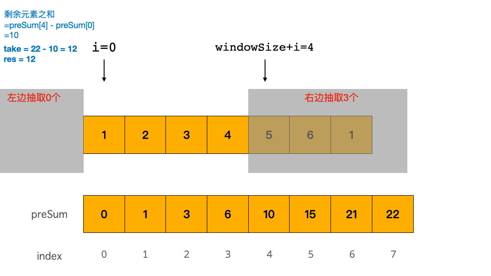

### 滑动窗口最大值
#### 题目
给你一个整数数组 nums，有一个大小为 k 的滑动窗口从数组的最左侧移动到数组的最右侧。你只可以看到在滑动窗口内的 k 个数字。滑动窗口每次只向右移动一位。
返回滑动窗口中的最大值。
输入：`nums = [1,3,-1,-3,5,3,6,7], k = 3`
输出：`[3,3,5,5,6,7]`
解释：
```
滑动窗口的位置                  最大值
---------------               -----
[1  3  -1] -3  5  3  6  7       3
 1 [3  -1  -3] 5  3  6  7       3
 1  3 [-1  -3  5] 3  6  7       5
 1  3  -1 [-3  5  3] 6  7       5
 1  3  -1  -3 [5  3  6] 7       6
 1  3  -1  -3  5 [3  6  7]      7
```
#### 思路
遍历数组，将数存放在双向队列中，并用 L,R 来标记窗口的左边界和右边界。队列中保存的并不是真的数，而是该数值对应的数组下标位置，并且数组中的数要从大到小排序。如果当前遍历的数比队尾的值大，则需要弹出队尾值，直到队列重新满足从大到小的要求。刚开始遍历时, L和R都为 0，有一个形成窗口的过程，此过程没有最大值，L不动，R向右移。当窗口大小形成时，L和R一起向右移，每次移动时，判断队首的值的数组下标是否在 `[L,R]` 中，如果不在则需要弹出队首的值，当前窗口的最大值即为队首的数。
#### 题解
```java
public class maxSlidingWindow {
    public int[] maxSlidingWindow(int[] nums, int k) {
        if(nums==null || nums.length<2) return nums;
        //双向队列，保存当前窗口最大值的数组位置，保证队列中数组位置的数值从大到小排序
        LinkedList<Integer> queue = new LinkedList<>();
        //结果数组
        int[] result = new int[nums.length-k+1];
        for(int i=0; i< nums.length; i++) {
            while (!queue.isEmpty() && nums[queue.peekLast()] <= nums[i]) {
                queue.pollLast();
            }
            queue.addLast(i);
            if(queue.peekFirst() <= i-k) queue.pollFirst();
            if(i>=k-1) result[i-k+1] = nums[queue.peekFirst()];
        }
        return result;
    }
}
```

### 可获得的最大点数
#### 题目
几张卡牌 排成一行，每张卡牌都有一个对应的点数。点数由整数数组 cardPoints 给出。
每次行动，你可以从行的开头或者末尾拿一张卡牌，最终你必须正好拿 k 张卡牌。
你的点数就是你拿到手中的所有卡牌的点数之和。
给你一个整数数组 cardPoints 和整数 k，请你返回可以获得的最大点数。
```
输入：cardPoints = [1,2,3,4,5,6,1], k = 3
输出：12
解释：第一次行动，不管拿哪张牌，你的点数总是 1 。但是，先拿最右边的卡牌将会最大化你的可获得点数。最优策略是拿右边的三张牌，最终点数为 1 + 6 + 5 = 12 。
```
#### 思路
取两端和的最大值，即是求数组剩余数和的最小值，采用滑动窗口的方法来进行计算

#### 题解
```java
class Solution {
    public int maxScore(int[] cardPoints, int k) {
        int n = cardPoints.length;
        int windowSize = n - k;
        int sum = 0;
        for(int i=0; i<windowSize; i++){
            sum+=cardPoints[i];
        }
        int minSum = sum;
        for(int i=windowSize;i<n;i++){
            sum += cardPoints[i] - cardPoints[i-windowSize];
            minSum = Math.min(sum, minSum);
        }
        return Arrays.stream(cardPoints).sum()-minSum;
    }
}
```

### 乘积小于K的子数组
#### 题目
给你一个整数数组 nums 和一个整数 k ，请你返回子数组内所有元素的乘积严格小于 k 的连续子数组的数目。
```
输入：nums = [10,5,2,6], k = 100
输出：8
解释：8 个乘积小于 100 的子数组分别为：[10]、[5]、[2],、[6]、[10,5]、[5,2]、[2,6]、[5,2,6]。
需要注意的是 [10,5,2] 并不是乘积小于 100 的子数组。
```

#### 思路
首先定义两个指针 left 和 right，后续遍历数组与记录用

1. 左右指针起始均在位置 0 ；用右指针遍历数组，每次循环中右指针右移一次；
2. 移动过程中纪录从左指针到右指针路上的连续数的乘积为 mul；
3. 如果乘积大于 k 了，则左指针右移，注意此处用的是 while 来使左指针右移，因为实际情况可能是：右指针最后右移一次指向了一个比较大的数使得 mul 不小于目标值，此时左指针需要右移多次才能使得 mul 刚小于 k；
4. 最后用 ans 记录 mul 小于 k 时的数组组合；
#### 题解
```java
class Solution {
    public int numSubarrayProductLessThanK(int[] nums, int k) {
        //同样排除k为1的情况比如  [1,1,1] k=1
        if (k <= 1) {
            return 0;
        }
        int left = 0;
        int right = 0;
        //创建一个变量记录路上的乘积
        int mul = 1;
        //记录连续数组的组合个数
        int ans = 0;

        //用右指针遍历整个数组，每次循环右指针右移一次
        while(right<nums.length) {
            //记录乘积
            mul *= nums[right];
            //当大于等于k，左指针右移并把之前左指针的数除掉
            while (mul >= k) {
                mul /= nums[left];
                left++;
            }

            //每次右指针位移到一个新位置，应该加上 x 种数组组合：
            //  nums[right]
            //  nums[right-1], nums[right]
            //  nums[right-2], nums[right-1], nums[right]
            //  nums[left], ......, nums[right-2], nums[right-1], nums[right]
            //共有 right - left + 1 种
            ans += right - left + 1;

            //右指针右移
            right++;
        }
        return ans;
    }
}
```

### 无重复字符的最长字串
#### 题目
给定一个字符串 `s` ，请你找出其中不含有重复字符的 **最长子串** 的长度
```shell
输入: s = "abcabcbb"
输出: 3 
解释: 因为无重复字符的最长子串是 "abc"，所以其长度为 3。
```
#### 思路
使用滑动窗口，左指针不动，右指针往前走，遇到相同的字符，左指针行动，直到没有重复字符为止，记录字符长度，使用哈希表记录字符位置，可以快速跳转。
#### 题解
```java
class Solution {
    public int lengthOfLongestSubstring(String s) {
        if (s.length()==0) return 0;
        HashMap<Character,Integer> map = new HashMap<>();
        int ans = 0;
        int left = 0;
        for (int i=0;i<s.length();i++){
            if (map.containsKey(s.charAt(i))){
                left = Math.max(left,map.get(s.charAt(i))+1);
            }
            map.put(s.charAt(i),i);
            ans = Math.max(ans,i-left+1);
        }
        return ans;
    }
}
```