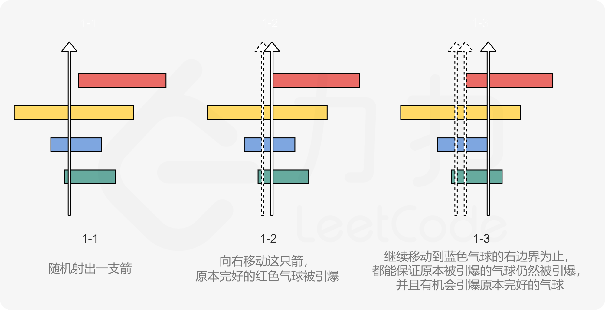

## 贪心

### 加油站
#### 题目
在一条环路上有 N 个加油站，其中第 i 个加油站有汽油 `gas[i]` 升。
你有一辆油箱容量无限的的汽车，从第 i 个加油站开往第 i+1 个加油站需要消耗汽油` cost[i]` 升。你从其中的一个加油站出发，开始时油箱为空。
如果你可以绕环路行驶一周，则返回出发时加油站的编号，否则返回 -1。
说明: 
如果题目有解，该答案即为唯一答案。
输入数组均为非空数组，且长度相同。
输入数组中的元素均为非负数。
输入:
gas  =` [1,2,3,4,5]`
cost = `[3,4,5,1,2]`
输出: 3
解释:
从 3 号加油站(索引为 3 处)出发，可获得 4 升汽油。此时油箱有 = 0 + 4 = 4 升汽油
开往 4 号加油站，此时油箱有 4 - 1 + 5 = 8 升汽油
开往 0 号加油站，此时油箱有 8 - 2 + 1 = 7 升汽油
开往 1 号加油站，此时油箱有 7 - 3 + 2 = 6 升汽油
开往 2 号加油站，此时油箱有 6 - 4 + 3 = 5 升汽油
开往 3 号加油站，你需要消耗 5 升汽油，正好足够你返回到 3 号加油站。
因此，3 可为起始索引。
#### 思路
贪心算法，算油箱的剩余量最小的点，如果该点大于0，那么其他的点肯定大于0，换言之，其他站点都可以到达
#### 题解
```java
//------------------------自己的解法---------------------------
class Solution {
    public static int canCompleteCircuit(int[] gas, int[] cost) {
        int n = gas.length;
        int[] diff = new int[n];
        for(int i=0; i<n; i++){
            diff[i] = gas[i] - cost[i];
        }

        for(int j=n-1; j>=0; j--){
            int sum =0;
            int k = 0;
            while(k<n && sum>=0){
                int m = (j+k)%n;
                sum = sum + diff[m];
                k++;
            }
            if(k==n && sum>=0) return j;
        }
        return -1;
    }
}
//---------------------------贪心------------------------------------
public int canCompleteCircuit(int[] gas, int[] cost) {
    int len = gas.length;
    int spare = 0;
    int minSpare = Integer.MAX_VALUE;
    int minIndex = 0;

    for (int i = 0; i < len; i++) {
        spare += gas[i] - cost[i];
        if (spare < minSpare) {
            minSpare = spare;
            minIndex = i;
        }
    }

    return spare < 0 ? -1 : (minIndex + 1) % len;
}
```

### 寻找峰值
#### 题目
峰值元素是指其值大于左右相邻值的元素。
给你一个输入数组 nums，找到峰值元素并返回其索引。数组可能包含多个峰值，在这种情况下，返回 任何一个峰值 所在位置即可。
你可以假设 `nums[-1] = nums[n] = -∞ `
#### 思路
二分法，取中点m，如果m位置的元素小于m+1位置的元素，则峰值在右侧，反之在左侧。
找峰值好比爬山，两边都是负穷，所以只要找到上坡就会找到峰值。
#### 题解
```java
public class findPeakElement {
    public int findPeakElement(int[] nums){
        int left = 0;
        int right = nums.length-1;
        while (left<right){
            int mid = (left+right)/2;
            if(nums[mid]>nums[mid+1]){
                right = mid;
            }
            else {
                left = mid +1;
            }
        }
        return left;
    }
}
```

### 用最少数量的箭引爆气球
#### 题目
在二维空间中有许多球形的气球。对于每个气球，提供的输入是水平方向上，气球直径的开始和结束坐标。由于它是水平的，所以纵坐标并不重要，因此只要知道开始和结束的横坐标就足够了。开始坐标总是小于结束坐标。
一支弓箭可以沿着 x 轴从不同点完全垂直地射出。在坐标 x 处射出一支箭，若有一个气球的直径的开始和结束坐标为 xstart，xend， 且满足  xstart ≤ x ≤ xend，则该气球会被引爆。可以射出的弓箭的数量没有限制。 弓箭一旦被射出之后，可以无限地前进。我们想找到使得所有气球全部被引爆，所需的弓箭的最小数量。
给你一个数组 points ，其中` points [i] = [xstart,xend]` ，返回引爆所有气球所必须射出的最小弓箭数。
```
输入：points = [[10,16],[2,8],[1,6],[7,12]]
输出：2
解释：对于该样例，x = 6 可以射爆 [2,8],[1,6] 两个气球，以及 x = 11 射爆另外两个气球
```
#### 思路
使用贪心的思想，对数组的右边界进行排序，选出最小的右边界作为弓箭落点，引爆所有可以引爆的气球，然后对没引爆的气球再从最小右边界开始引爆。

#### 题解
```java
class Solution {
    public int findMinArrowShots(int[][] points) {
        if (points.length == 0) {
            return 0;
        }
        Arrays.sort(points, new Comparator<int[]>() {
            public int compare(int[] point1, int[] point2) {
                if (point1[1] > point2[1]) {
                    return 1;
                } else if (point1[1] < point2[1]) {
                    return -1;
                } else {
                    return 0;
                }
            }
        });
        int pos = points[0][1];
        int ans = 1;
        for (int[] balloon: points) {
            if (balloon[0] > pos) {
                pos = balloon[1];
                ++ans;
            }
        }
        return ans;
    }
}
```

### K次取反后最大化的数组和

#### 题目

给你一个整数数组 nums 和一个整数 k ，按以下方法修改该数组：

选择某个下标 i 并将 nums[i] 替换为 -nums[i] 。
重复这个过程恰好 k 次。可以多次选择同一个下标 i 。

以这种方式修改数组后，返回数组 **可能的最大和**。

* 示例1

  ```txt
  输入：nums = [4,2,3], k = 1
  输出：5
  解释：选择下标 1 ，nums 变为 [4,-2,3] 。
  ```

* 示例2

  ```txt
  输入：nums = [3,-1,0,2], k = 3
  输出：6
  解释：选择下标 (1, 2, 2) ，nums 变为 [3,1,0,2] 。

* 示例3

  ```txt
  输入：nums = [2,-3,-1,5,-4], k = 2
  输出：13
  解释：选择下标 (1, 4) ，nums 变为 [2,3,-1,5,4] 。
  ```

#### 思路

假设取反前的总和为 sumsum，取反一个任意值 xx 后，对 sumsum 的影响为 - 2 * x−2∗x。

即取反一个负数会使得结果变大，取反正数会使结果变小，取反 00 值对结果没有影响。

因此，为了让取反后的结果尽可能的大，我们应当取反 -2*x−2∗x 尽可能大的数值。即按照「负数从小到大的顺序进行取反」。

对取反次数 kk 和 负数个数 cntcnt 进行分情况讨论：

* k <= cntk<=cnt：按照负数从小到大的顺序进行取反即可；
* k > cntk>cnt：按照负数从小到大的顺序进行取反后，根据「是否存在 00 值」和「剩余取反次数的奇偶性」进行分情况讨论：
  * 存在 00 值 或 剩余取反次数为偶数：直接返回当前取反数组的总和（ 00 值可抵消任意次数的取反操作，将偶数次的取反操作应用在同一数值上，结果不变）；
  * 不存在 00 值且剩余取反次数为奇数：此时从当前数值中取一个绝对值最小值（使用 idxidx 记录该值下标）进行取反，得到最终的取反数组。

最后对取反数组进行求和操作即可。

#### 题解

```java
class Solution {
    public int largestSumAfterKNegations(int[] nums, int k) {
        int n = nums.length, idx = 0;
        PriorityQueue<Integer> q = new PriorityQueue<>((a,b)->nums[a]-nums[b]);
        boolean zero = false;
        for (int i = 0; i < n; i++) {
            if (nums[i] < 0) q.add(i);
            if (nums[i] == 0) zero = true;
            if (Math.abs(nums[i]) < Math.abs(nums[idx])) idx = i;
        }
        if (k <= q.size()) {
            while (k-- > 0) nums[q.peek()] = -nums[q.poll()];
        } else {
            while (!q.isEmpty() && k-- > 0) nums[q.peek()] = -nums[q.poll()];
            if (!zero && k % 2 != 0) nums[idx] = -nums[idx];
        }
        int ans = 0;
        for (int i : nums) ans += i;
        return ans;
    }
}
```

### 跳跃游戏
#### 题目
给定一个非负整数数组 `nums` ，你最初位于数组的 **第一个下标** 。
数组中的每个元素代表你在该位置可以跳跃的最大长度。
判断你是否能够到达最后一个下标。
#### 思路
使用贪心思想，首先计算每个位置是否可达，再次维护一个在该位置起跳的最远距离，如果能跳过最后一个位置则直接返回true，遍历完之后最后一个位置不可达的话就返回false。
#### 题解
```java
class Solution {
    public boolean canJump(int[] nums) {
        int n = nums.length;
        int rightMost = 0;
        for (int i = 0; i < n; i++) {
            if (i <= rightMost) {
                rightMost = Math.max(rightMost, i + nums[i]);
                if (rightMost >= n-1) {
                    return true;
                }
            }
        }
        return false;
    }
}
```


