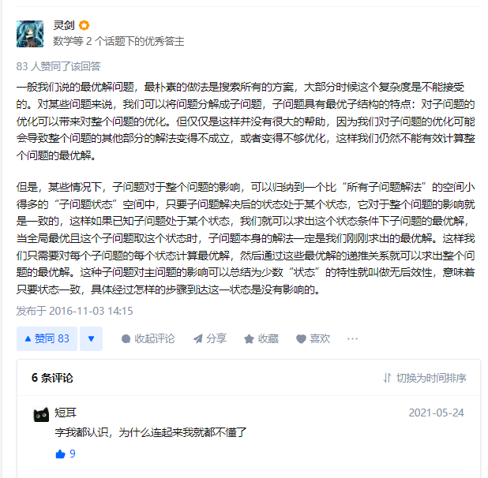
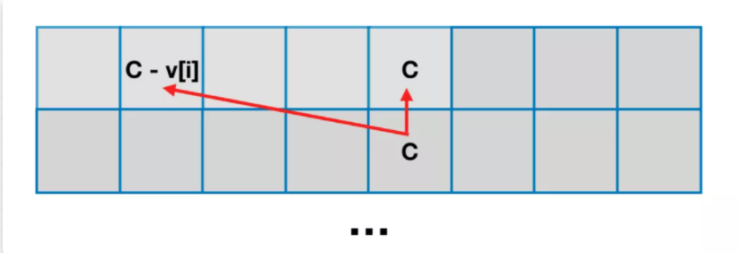

# 动态规划
思维发展：暴力递归 -> 记忆化搜索 -> 动态规划
什么问题可以用动态规划来解决：**当前某个状态确定后，之后的状态转移与之前的决策无关**
**「记忆化搜索」本质是带“缓存”功能的「暴力递归」**
它只能解决重复计算的问题，而不能确定中间结果的访问时机和访问次数，本质是一“自顶向下”的解决方式；

**「动态规划」是一种“自底向上”的解决方案 ：**
能明确访问时机和访问次数，这为降低算法的空间复杂度带来巨大空间，我们可以根据依赖关系来决定保留哪些中间结果，而无须将全部中间结果进行“缓存”。

对于动态规划问题，拆解为如下五步曲
1. 确定dp数组（dp table）以及下标的含义 
2. 确定递推公式 
3. dp数组如何初始化 
4. 确定遍历顺序 
5. 举例推导dp数组




## 斐波那契数列的启示
### 暴力递归
暴力递归之所以暴力是因为**包含了重复计算**
那么怎么才可以进行优化
```java
class Solution {
    public int fib(int n) {
        int a = 0, b = 1, sum;
        for(int i = 0; i < n; i++){
            sum = (a + b) % 1000000007;
            a = b;
            b = sum;
        }
        return a;
    }
}
```

### 记忆化搜索
 假设有排成一行的N个位置，记为1~N，N一定大于或等于2开始时机器人在其中的M位置（M一定时1~N中的一个）
如果机器人来到1位置，那么下一步只能往右来到2位置；
如果机器人来到N位置，那么下一步只能往左来到N-1位置；
如果机器人来到中间位置，那么下一步可以往左或者往右走；
规定机器人必须走K步，最终能来到P位置(P也是1~N中的一个)的方法有多少种
给定四个参数N、M、K、P，返回方法的数量
```java
public int ViolenceRecursive(int N,int M,int K,int P){
	if(N<2||k<1||<M<1||M>N||P<1||P>N) return 0;
	return walk(N,M,K,P)
}

public static int walk(int N,int cur, int rest, int P){
	if(rest==0){
		return cur==P?1:0;
	}
	if(cur==1){
		return walk(N,2,rest-1,P);
	
	}
	if(cur==N){
		return walk(N,N-1,rest-1,P);
	}
	return walk(N,cur+1,rest-1,P)+walk(N,cur-1,rest-1,P);
}
```
为了避免递归中的重复计算，可以将cur和rest的组合返回的结果，加入到一个缓存里
```java
public int JoinCache(int N,int M,int K,int P){
	if(N<2||k<1||<M<1||M>N||P<1||P>N) return 0;
	int[][] dp = new int[N+1][K+1];
	for(int row=0;row<=N;row++){
		for(itn col=0;col<=K;col++){
			dp[row][col]=-1;
		}
	}
	return walk(N,M,K,P,dp)
}

public static int walk(int N,int cur, int rest, int P,int[][] dp){
	if(dp[cur][rest]!-1){
		return dp[cur][rest];
	}
	if(rest==0){
		dp[cur][rest] = cur==P?1:0;
		return dp[cur][rest];
	}
	if(cur==1){
		dp[cur][rest] = walk(N,2,rest-1,P);
		return dp[cur][rest];
	
	}
	if(cur==N){
		dp[cur][rest] = walk(N,N-1,rest-1,P);
		return dp[cur][rest];
	}
	dp[cur][rest] = walk(N,cur+1,rest-1,P)+walk(N,cur-1,rest-1,P);
	return dp[cur][rest];
}
```
### 动态规划
有几个可变参数就是几维表，假设N为7,M为2，K为5，P为3
根据

|cur/rest|0|1|2|3|4|5|
|----|----|----|----|----|----|----|
|0|x|x|x|x|x|x|
|1|0|0|1|0|3|0|
|2|0|1|0|3|0|9|
|3|1|0|2|0|6|0|
|4|0|1|0|3|0|10|
|5|0|0|1|0|4|0|
|6|0|0|0|1|0|5|
|7|0|0|0|0|1|0|

## 背包问题
泛指一类「给定价值与成本」，同时「限定决策规则」，在这样的条件下，如何实现价值最大化的问题。
### 经典01背包
有 N件物品和一个容量是V的背包。每件物品有且只有一件。
第i件物品的体积是`v[i]` ，价值是`w[i]` 。
求解将哪些物品装入背包，可使这些物品的总体积不超过背包容量，且总价值最大。

1. 如果要设计一个DFS函数对所有方案进行枚举的话，大概是这样一个签名函数：
     `int dfs(int[] v, int[] w, int i, int c)`
     * 其中v、w对应了输入的【物品体积】和【物品价值】，属于**不变参数，无须考虑**
     * 而i和c分别代表【当前枚举到哪件物品】和【现在的剩余容量】
     * 返回值是最大价值

2. 根据变化参数和返回值，可以抽象出dp数组
>一个二维数组，其中一维代表【当前枚举到哪件物品】，另外一维是【现在的剩余容量】，数组装的是最大价值。

3. 根据dp数组得出状态定义：
>考虑前i件物品，使用容量不超过C的条件下的背包最大价值

4.  最后一步，推导状态转移方程，对于第i件物品，有【选】和【不选】两种决策，结合【状态定义】，【不选】方案的最大价值很好确定 
>【不选】其实就是`dp[i-1][c]`，等效于我们只考虑前i-1件物品，当前容量为c的情况下的最大价值，同理，如果【选】第i件物品代表消耗了`v[i]`的背包容量，获取了`w[i]`的价值，那么留给前i-1件物品的背包容量就只剩下`c-v[i]`，即最大价值为`dp[i-1][c-v[i]]+w[i]`
当然，选第i件还有一个前提：`当前剩余的背包容量>=物品的体积`
在选和不选之间取最大值，就是背包最大价值

5. 得到最终状态转移方程为
`dp[i][c]=max(dp[i-1][c],dp[i-1][c-v[i]]+w[i])`

```java
class Solution {
    public int maxValue(int N, int C, int[] v, int[] w) {
        int[][] dp = new int[N][C+1];
        // 先处理「考虑第一件物品」的情况
        for (int i = 0; i <= C; i++) {
            dp[0][i] = i >= v[0] ? w[0] : 0;
        }
        // 再处理「考虑其余物品」的情况
        for (int i = 1; i < N; i++) {
            for (int j = 0; j < C + 1; j++) {
                // 不选该物品
                int n = dp[i-1][j]; 
                // 选择该物品，前提「剩余容量」大于等于「物品体积」
                int y = j >= v[i] ? dp[i-1][j-v[i]] + w[i] : 0; 
                dp[i][j] = Math.max(n, y);
            }
        }
        return dp[N-1][C];
    }
}
```

**滚动数组解法**
就是计算「某一行」的时候只需要依赖「前一行」，因此可以用一个只有两行的数组来存储中间结果，根据当前计算的行号是偶数还是奇数来交替使用第 0 行和第 1 行。
```java
class Solution{
	public int maxValue(Int N, int C, int[] v, int[] w){
		int[][] dp = new int[2][C+1];
		//先考虑第一件物品的情况
		for(int j=0;j<C+1;j++){
			dp[0][j] = j >= v[0]?w[0]:0;
		}
		//再考虑处理其余物品的情况
		for(int i=1;i<N;i++){
			for(int j=0;j<C+1;j++){
				int n = dp[(i-1)&1][j];
				int y = j>=v[i]?dp[(i-1)&1][j-v[i]] + w[i]:0;
				dp[i&1][j] = Math.max(n,y);
			}
		}
		return dp[(N-1)&1][C];
	}
}
```

进一步优化，根据原状态转移方程可以发现，求解第i行格子，依赖第i-1行的第c个格子和第`c-v[i]`个格子（也就是对应着第i个物品不选和选的两种情况）
`dp[i][c]=max(dp[i-1][c],dp[i-1][c-v[i]]+w[i])`

换句话说，只依赖于「上一个格子的位置」以及「上一个格子的左边位置」。因此，只要我们将求解第 i行格子的顺序「从 0 到 c 」改为「从c  到0 」，就可以将原本 2 行的二维数组压缩到一行（转换为一维数组）。

```java
class Solution {
    public int maxValue(int N, int C, int[] v, int[] w) {
        int[] dp = new int[C + 1];
        for (int i = 0; i < N; i++) {
            for (int j = C; j >= v[i]; j--) {
                // 不选该物品
                int n = dp[j]; 
                // 选择该物品
                int y = dp[j-v[i]] + w[i]; 
                dp[j] = Math.max(n, y);
            }
        }
        return dp[C];
    }
}
```

### 完全背包
有N种物品和一个容量为C 的背包，每种物品都有无限件。
第 i 件物品的体积是`v[i]` ，价值是`w[i]` 。
求解将哪些物品装入背包可使这些物品的费用总和不超过背包容量，且价值总和最大。

1. 可以直接将01背包的【状态定义】拿过来使用
>`dp[i][j]`代表考虑前i件物品，放入一个容量为j的背包可以获得的最大价值

2. 由于每件物品可以被选择多次，因此对于某个`dp[i][j]`而言，其值为以下所有可能方案中的最大值
     * 选择0件物品i的最大价值，即`dp[i-1][j]`
     *  选择1件物品i的最大价值，即`dp[i-1][j-v[i]]+w[i]`
     *  选择2件物品i的最大价值，即`dp[i-1][j-2*v[i]]+2*w[i]`
     *  ...
     *  选择k件物品i的最大价值，即`dp[i-1][j-k*v[i]]+k*w[i]`

3. 由此得状态转移方程为
`dp[i][j]=max(dp[i-1][j],dp[i-1][j-k*v[i]]+k*w[i]),0<k*v[i]<=j`

```java
class Solution {
    public int maxValue(int N, int C, int[] v, int[] w) {
        int[][] dp = new int[N][C + 1];
        
        // 先预处理第一件物品
        for (int j = 0; j <= C; j++) {
            // 显然当只有一件物品的时候，在容量允许的情况下，能选多少件就选多少件
            int maxK = j / v[0];
            dp[0][j] = maxK * w[0];
        }
        
        // 处理剩余物品
        for (int i = 1; i < N; i++) {
            for (int j = 0; j <= C; j++) {
                // 不考虑第 i 件物品的情况（选择 0 件物品 i）
                int n = dp[i - 1][j];
                // 考虑第 i 件物品的情况
                int y = 0;
                for (int k = 1 ;; k++) {
                    if (j < v[i] * k) {
                        break;
                    }
                    y = Math.max(y, dp[i - 1][j - k * v[i]] + k * w[i]);
                }
                dp[i][j] = Math.max(n, y);
            }
        }
        return dp[N - 1][C];
    }
}
```

4. 通过观察状态转移方程可以发现，在更新某个`dp[i][j]`的时候只依赖于`dp[i-1][j]`因此可以同样使用滚动数组的方式将空间优化到`O(C)`。
```java
class Solution{
    public int maxValue(int N, int C, int[] v, int[] w){
        int[][] dp = new int[2][C+1];
        //先预处理第一件物品
        for(int j=0;j<=C;j++){
            //显然当只有一件物品的时候，在容量允许的情况下，能选多少件就选多少件
            int maxK = j/v[0];
            dp[0][j] = maxK * w[0];
        }
        //处理剩余物品
        for(int i=1; i<N; i++){
            for(int j = 0; j<= C; j++){
                不考虑第i件物品
                int n = dp[(i-1)&1][j];
                //考虑第i件物品
                int y = 0;
                for(int k = 1;;k++){
                    if(j < v[i] * k) break;
                    y = Math.max(y,dp[(i-1)&1][j-k*v[i]] + k*w[i]);
                }
                dp[i&1][j] = Math.max(n,y);
            }
        }
        return dp[N-1][C];
    }
}
```

5. 优化为一维数组
之所以 01 背包能够使用「一维空间优化」解法，是因为当我们开始处理第 `i`件物品的时候，数组中存储的是已经处理完的第`i-1` 件物品的状态值。

**然后配合着我们容量维度「从大到小」的遍历顺序，可以确保我们在更新某个状态时，所需要用到的状态值不会被覆盖。**
因此01背包问题的状态转移方程为：
$$dp[j]=max(dp[j],dp[j-v[i]]+w[i])$$
同时容量维度的遍历顺序为从大到小。
我们先来展开完全背包中`dp[i][j]`的所有可能方案：
$$dp[i][j]=max(dp[i-1][j],dp[i-1][j-v[i]]+w[i],dp[i-1][j-2*v[i]]+2*w[i]+...+dp[i-1][j-k*v[i]]+k*w[i])$$
然后我们通过代入，看看 `dp[i][j-v[i]]`是什么内容：
$$dp[i][j-v[i]]=max(dp[i-1][j-v[i]],dp[i-1][j-2*v[i]]+w[i],dp[i-1][j-3*v[i]]+2*w[i]+...+dp[i-1][j-k*v[i]]+(k-1)*w[i])$$
两种情况下，`dp[i][j]`和`dp[i][j-v[i]]`之间的各部分总是相差`w[i]`，因此，要求的`dp[i][j]`最大值问题就等价于求`dp[i][j-v[i]]+w[i]`的最大值问题。

也就是
$$dp[i][j]=max(dp[i-1][j],dp[i][j-v[i]]+w[i])$$
```java
class Solution {
    public int maxValue(int N, int C, int[] v, int[] w) {
        int[] dp = new int[C + 1];
        for (int i = 0; i < N; i++) {
            for (int j = 0; j <= C; j++) {
                // 不考虑第 i 件物品的情况（选择 0 件物品 i）
                int n = dp[j];
                // 考虑第 i 件物品的情况
                int y = j - v[i] >= 0 ? dp[j - v[i]] + w[i] : 0; 
                dp[j] = Math.max(n, y);
            }
        }
        return dp[C];
    }
}
```

### 多重背包
有N种物品和一个容量为C的背包，每种物品 **「数量有限」**。
第i件物品的体积是`v[i]`，价值是`w[i]`，数量是`s[i]`
问选择哪些物品， 每件物品选择多少件，可使得总价值最大
其实就是在 0-1 背包问题的基础上，增加了每件物品可以选择「有限次数」的特点（在容量允许的情况下）

>输入: `N = 2, C = 5, v = [1,2], w = [1,2], s = [2,1]` 
输出: 4
解释: 选两件物品 1，再选一件物品 2，可使价值最大。

**朴素二维**
`dp[i][j]`代表考虑前i件物品，且所选物品总体积不超过j时获得的最大价值
由于每件物品可以被选择【有限次】，因此对于某个`dp[i][j]`而言，其值应该为以下所有方案中的最大值：
  * 选择0件物品`i`的最大价值，即`dp[i-1][j]`
  * 选择1件物品`i`的最大价值，即`dp[i-1][j-v[i]]+w[i]`
  * ...
  * 选择`s[i]`件物品`i`的最大价值，即`dp[i-1][j-s[i]v[i]]+s[i]*w[i]`
由此可得出【状态转移方程】为 ：
$$dp[i][j]=max(dp[i-1][j],dp[i-1][j-k*v[i]]+k*w[i]),0<k \leq s[i],0<k*v[i] \leq j$$
只比完全背包的状态转移公式多了一个数量限制条件
```java
class Solution{
	public int maxValue(int N, int C, int[] s, int[] v, int[] w){
		int[][] dp = new int[N][C+1];
		//先处理第一件物品
		for(int j=0;j<=C;j++){
			//显然当只有一件物品的时候，在容量允许的条件下，能选多少件就选多少件(不超过限制数量)
			int maxK = Math.min(j/v[0],s[0]);
			dp[0][j] = maxK*w[0];
		}
		//处理剩余物品
		for(int i=1;i<N;i++){
			for(int j=0;j<=C;j++){
				int n = dp[i-1][j];
				int y = 0;
				for(int k=1;k<=s[i];k++){
					if(j<k*v[i]){
						break;
					}
					y=Math.max(y,dp[i-1][j-k*v[i]]+k*w[i]);
				}
				dp[i][j]=Math.max(n,y);
			}
		}
		return dp[N-1][C];
	}
}
```

**滚动数组**

通过观察我们的「状态转移方程」可以发现，我们在更新某个 `dp[i][x]`的时候只依赖于`dp[i-1][y]`。
```java
class Solution {
    public int maxValue(int N, int C, int[] s, int[] v, int[] w) {
        int[][] dp = new int[2][C + 1];
        
        // 先处理第一件物品
        for (int j = 0; j <= C; j++) {
            // 显然当只有一件物品的时候，在容量允许的情况下，能选多少件就选多少件（不超过限制数量）
            int maxK = Math.min(j / v[0], s[0]);
            dp[0][j] = maxK * w[0];
        }
        
        // 处理剩余物品
        for (int i = 1; i < N; i++) {
            for (int j = 0; j <= C; j++) {
                // 不考虑第 i 件物品的情况
                int n = dp[(i- 1)&1][j];
                // 考虑第 i 件物品的情况
                int y = 0;
                for (int k = 1; k <= s[i]; k++) {
                    if (j < k * v[i]) {
                        break;
                    }
                    y = Math.max(y, dp[(i - 1)&1][j - k * v[i]] + k * w[i]);
                }
                dp[i&1][j] = Math.max(n, y);
            }
        }
        
        return dp[(N - 1)&1][C];
    }
}
```

**一维空间优化**

```java
class Solution {
    public int maxValue(int N, int C, int[] s, int[] v, int[] w) {
        int[] dp = new int[C + 1];
        for (int i = 0; i < N; i++) {
            for (int j = C; j >= v[i]; j--) {
                for (int k = 0; k <= s[i] && j >= k * v[i]; k++) {
                    dp[j] = Math.max(dp[j], dp[j - k * v[i]] + k * w[i]);
                }
            }
        }
        return dp[C];
    }
}
```

**二进制优化**
二进制优化的本质，是对「物品」做分类，使得总数量为 m的物品能够用更小的 `log m`个数所组合表示出来。
```java
class Solution {
    public int maxValue(int N, int C, int[] s, int[] v, int[] w) {
        // 扁平化
        List<Integer> worth = new ArrayList<>();
        List<Integer> volume = new ArrayList<>();

        // 我们希望每件物品都进行扁平化，所以首先遍历所有的物品
        for (int i = 0; i < N; i++) {
            // 获取每件物品的出现次数
            int val = s[i];
            // 进行扁平化：如果一件物品规定的使用次数为 7 次，我们将其扁平化为三件物品：1*重量&1*价值、2*重量&2*价值、4*重量&4*价值
            // 三件物品都不选对应了我们使用该物品 0 次的情况、只选择第一件扁平物品对应使用该物品 1 次的情况、只选择第二件扁平物品对应使用该物品 2 次的情况，只选择第一件和第二件扁平物品对应了使用该物品 3 次的情况 ... 
            for (int k = 1; k <= val; k *= 2) { 
                val -= k;
                worth.add(w[i] * k);
                volume.add(v[i] * k);
            }
            if (val > 0) {
                worth.add(w[i] * val);
                volume.add(v[i] * val);
            }
        }

        // 0-1 背包问题解决方案
        int[] dp = new int[C + 1];
        for (int i = 0; i < worth.size(); i++) {
            for (int j = C; j >= volume.get(i); j--) {
                dp[j] = Math.max(dp[j], dp[j - volume.get(i)] + worth.get(i));
            }
        }
        return dp[C];
    }
}
```

**单调队列优化**
「单调队列优化」是对「状态」做拆分操作, 利用某个状态必然是由余数相同的特定状态值转移而来进行优化。
```java
class Solution {
    public int maxValue(int N, int C, int[] s, int[] v, int[] w) {
        int[] dp = new int[C + 1];
        int[] g = new int[C + 1]; // 辅助队列，记录的是上一次的结果
        int[] q = new int[C + 1]; // 主队列，记录的是本次的结果

        // 枚举物品
        for (int i = 0; i < N; i++) {
            int vi = v[i];
            int wi = w[i];
            int si = s[i];

            // 将上次算的结果存入辅助数组中
            g = dp.clone();

            // 枚举余数
            for (int j = 0; j < vi; j++) {
                // 初始化队列，head 和 tail 分别指向队列头部和尾部
                int head = 0, tail = -1;
                // 枚举同一余数情况下，有多少种方案。
                // 例如余数为 1 的情况下有：1、vi + 1、2 * vi + 1、3 * vi + 1 ...
                for (int k = j; k <= C; k+=vi) {
                    dp[k] = g[k];
                    // 将不在窗口范围内的值弹出
                    if (head <= tail && q[head] < k - si * vi) head++;
                    // 如果队列中存在元素，直接使用队头来更新
                    if (head <= tail) dp[k] = Math.max(dp[k], g[q[head]] + (k - q[head]) / vi * wi);
                    // 当前值比对尾值更优，队尾元素没有存在必要，队尾出队
                    while (head <= tail && g[q[tail]] - (q[tail] - j) / vi * wi <= g[k] - (k - j) / vi * wi) tail--;
                    // 将新下标入队 
                    q[++tail] = k;
                }
            }
        }
        return dp[C];
    }
}
```

### 三种传统背包总结
三种背包问题都有**不超过**和**恰好**两种状态定义。
这两种状态定义只在「初始化」上有区别。

至于该如何初始化则要抓住 什么样的状态是合法的 ：

-   对于「不超过」的状态定义： `f[0][x]`均为合法值 。
    代表不考虑任何物品，背包容量「不超过 x」的所取得的最大价值为0 。
	
-   对于「恰好」的状态定义： 中只有  `f[0][0]`为合法值 ，其他值均为“无效值”。
    代表不考虑任何物品，只有背包容量「恰好为0 」时所取得的最大价值为0 ；其他容量「恰好为非 0」是无法取得有效价值的（因为不考虑任何物品）。
	
	总的来说，三种背包问题都很经典（本质上都是组合优化问题），以至于「背包问题」直接成为了一类的动态规划模型。
### 混合背包
混合背包其实就是综合了「01 背包」、「完全背包」和「多重背包」三种传统背包问题。
我们知道在一维空间优化方式中「01 背包」将当前容量 `j`按照“从大到小”进行遍历，而「完全背包」则是将当前容量`j`按照“从小到大”进行遍历。

同时「多重背包」可以通过「二进制优化」彻底转移成「01 背包」。

所以我们只需要根据第`i`个物品是「01 背包」物品还是「完全背包」物品，选择不同的遍历顺序即可

### 分组背包
给定 N个物品组，和容量为C的背包。
第 `i`个物品组共有`S[i]`件物品，其中第`i`组的第`j`件物品的成本为 `v[i][j]`，价值为 `w[i][j]`。
每组有若干个物品，同一组内的物品最多只能选一个。
求解将哪些物品装入背包可使这些物品的费用总和不超过背包容量，且价值总和最大。
```
输入：N = 2, C = 9, S = [2, 3], v = [[1,2,-1],[1,2,3]], w = [[2,4,-1],[1,3,6]]  
  
输出：10
```
由于每组有若干个物品，且每组「最多」选择一件物品。
即对于第 `i` 组而言，可决策的方案如下：
* 不选择该组的任何物品：`f[i][j]=f[i-1][j]`
* 选择该组的第一件：`f[i][j]=f[i-1][j-v[i][0]]+w[i][0]`
* ...
* 选择该组的最后一件物品：`f[i][j]=f[i-1][j-v[i][S[i]-1]]+w[i][S[i]-1]`

最后的状态转移方程为：
$$f[i][j]=max(f[i-1][j],f[i-1][j-v[i][k]+w[i][k]) \, 0\leq k < S[i]$$

```java
class Solution {
    public int maxValue(int N, int C, int[] S, int[][] v, int[][] w) {
        int[][] dp = new int[N + 1][C + 1];
        for (int i = 1; i <= N; i++) {
            int[] vi = v[i - 1];
            int[] wi = w[i - 1];
            int si = S[i - 1];
            for (int j = 1; j <= C; j++) {
                dp[i][j] = dp[i - 1][j];
                for (int k = 0; k < si; k++) {
                    if (j >= vi[k]) {
                        dp[i][j] = Math.max(dp[i][j], dp[i - 1][j - vi[k]] + wi[k]);
                    }
                }
            }
        }
        return dp[N][C];
    }
}
```
**滚动数组**
根据状态转移方程，不难发现`f[i][j]`只依赖于`f[i-1][x]`，且`j>=x`

```java
class Solution {
    public int maxValue(int N, int C, int[] S, int[][] v, int[][] w) {
        int[][] dp = new int[2][C + 1];
        for (int i = 1; i <= N; i++) {
            int[] vi = v[i - 1];
            int[] wi = w[i - 1];
            int si = S[i - 1];
            for (int j = 1; j <= C; j++) {
                int a = i & 1, b = (i - 1) & 1;
                dp[a][j] = dp[b][j];
                for (int k = 0; k < si; k++) {
                    if (j >= vi[k]) {
                        dp[a][j] = Math.max(dp[a][j], dp[b][j - vi[k]] + wi[k]);
                    }
                }
            }
        }
        return dp[N & 1][C];
    }
}
```

**一维空间优化**
1. 取消物品维度
2. 将容量维度的遍历顺序修改为「从大到小」（确保所依赖的值不会被覆盖）
```java
class Solution {
    public int maxValue(int N, int C, int[] S, int[][] v, int[][] w) {
        int[] dp = new int[C + 1];
        for (int i = 1; i <= N; i++) {
            int[] vi = v[i - 1];
            int[] wi = w[i - 1];
            int si = S[i - 1];
            for (int j = C; j >= 0; j--) {
                for (int k = 0; k < si; k++) {
                    if (j >= vi[k]) {
                        dp[j] = Math.max(dp[j], dp[j - vi[k]] + wi[k]);
                    }
                }
            }
        }
        return dp[C];
    }
}
```
