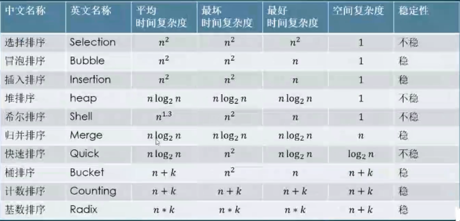

# 排序算法
* 时间复杂度：将程序的基本执行次数，即相对执行时间`T(n)`,简化为一个渐进时间复杂度（一个数量级），用大O表示。
* 空间复杂度：一个算法在运行过程中临时占用存储空间大小的度量。

常见排序列表

## 选择排序
最简单也是最没用的   
* 时间复杂度：$n^2$    
* 空间复杂度：1
* 稳定性：不稳定(两个相等的数值在排序之后相对位置发生了变化)
#### 思路
在无序区里找一个最小的元素跟在有序区的后面。
#### 实现
```java
public class SelectionSort {
	public static void main(String[] args)
	{
		int[] arr = {2,3,5,7,8,6,9,1,4};
		
		for(int i=0; i<arr.length-1;i++)
		{
			int minPos = i;
			
			for(int j=i+1;j<arr.length;j++)
			{
				minPos = arr[j]<arr[minPos] ? j : minPos;
			}
			
			System.out.println("minPos:" + minPos);
			
			int temp = arr[i];
			arr[i] = arr[minPos];
			arr[minPos]= temp;
		}		
			
		for(int i = 0; i<arr.length; i++)
		{
			System.out.print(arr[i] + " ");
		}
	}
}
```

## 冒泡排序
 * 时间复杂度：$n^2$
 * 空间复杂度：1
 * 稳定性：稳定
 #### 思路
 从无序区透过交换找出最大元素放到有序区前端
 #### 实现
```java
import java.util.*;

public class BubbleSort {
	public static void main(String[] args)
	{
		int arr[] = new int[20];
		Random r = new Random();
		for(int i=0; i<arr.length; i++)
		{
			arr[i] = r.nextInt(20);
		}
		
		for(int i=arr.length-1; i>0; i--) 
		{
			for(int j=0; j<i; j++)
			{
				if(arr[j]>arr[j+1])
				{
					int temp = arr[j+1];
					arr[j+1] = arr[j];
					arr[j] = temp;
				}
			}
		}
		
		System.out.println("sorted arr :");
		for(int k=0; k<arr.length-1;k++)
		{
			System.out.print(arr[k] + " ");
		}
		System.out.println();
	}
}
````
## 插入排序
对于基本有序的数组最好用的，稳定
 * 时间复杂度：$n^2$
 * 空间复杂度：1
 * 稳定性：稳定
 #### 思路
 把无序区的第一个元素插入到有序区的合适的位置
 #### 实现
 ```java
public class InsertionSort {
	public static void main(String[] args)
	{
		int[] arr = {1,5,3,8,6,4,7,9,2};
		sort(arr);
		print(arr);
	}
	
	static void sort(int[] a)
	{
		for(int i=1; i<a.length; i++)
		{
			for(int j=i; j>0; j--)
			{
				if(a[j]<a[j-1])
				{
					swap(a, j, j-1);
				}
			}
		}
	}
	
	static void swap(int[] a, int i, int j)
	{
		int temp =  a[i];
		a[i] =  a[j];
		a[j] = temp;
	}
	
	static void print(int[] a)
	{
		for(int i=0; i<a.length; i++)
		{
			System.out.print(a[i] + " ");
		}
	}
}
 ```

 简单排序算法总结：
 1. 冒泡：基本不用，太慢
 2. 选择：基本不用，太慢
 3. 插入：样本小且基本有序的时候效率比较高

## 希尔排序
改进的插入排序
 * 时间复杂度：$n^1.3$
 * 空间复杂度：1
 * 稳定性：稳定
##### 思路
每一轮按照事先决定的间隔进行插入排序，间隔会依次缩小，最后一次一定要是1
#### 实现
```java
public class ShellSort {
	public static void main(String[] args)
	{
		int[] arr = {9,6,11,3,5,12,8,7,10,15,14,4,1,13,2};
		sort(arr);
		print(arr);
	}
	
	public static void sort(int[] arr)
	{
		int h=1;
		while(h<=arr.length/3) {
			h = h*3 +1;
		}
		
		for(int grap = h; grap>0; grap = grap/2)
		{
			for(int i=grap; i<arr.length; i++)
			{
				for(int j=i; j>grap-1;  j-=grap)
				{
					if(arr[j-grap]>arr[j]) 
						swap(arr,j-grap,j);
				}
			}
		}
	}
	
	public static void swap(int[] a, int i, int j)
	{
		int temp = a[i];
		a[i] = a[j];
		a[j] = temp;
	}
	
	public static void print(int[] arr)
	{
		for(int i=0; i<arr.length; i++)
		{
			System.out.print(arr[i] + " ");
		}
	}
}
```
## 归并排序
java对象排序专用
 * 时间复杂度：$nlog_2n$
 * 空间复杂度：n
 * 稳定性：稳定
#### 思路
把数据分为两段，从两段中逐个选最小的元素移入新数据段的末尾，可从上到下或从下到上进行。
#### 实现
```java
public class MergeSort {
	public static void main(String[] args)
	{
		int[] arr = {2,5,7,9,1,3,6};
		sort(arr,0,arr.length-1);
		print(arr);
	}
	
	public static void sort(int[] arr, int left, int right)
	{
		if(left==right) return;
		//分成两半
		int mid = left + (right-left)/2;
		//左边排序
		sort(arr,left,mid);
		//右边排序
		sort(arr,mid+1,right);
		merge(arr,left,mid+1,right);
	}
	
	public static void merge(int[] arr, int leftPtr, int rightPtr, int rightBound)
	{
		int mid = rightPtr -1;
		int i = leftPtr;
		int j = rightPtr;
		int k = 0;
		int[] temp = new int[rightBound-leftPtr+1];
		
		while(i <= mid && j <=rightBound)
		{
			temp[k++] = arr[i] <= arr[j] ? arr[i++] : arr[j++];
		}
		
		while(i<=mid) temp[k++] = arr[i++];
		while(j<=rightBound) temp[k++] =arr[j++];
		
		for(int m=0; m<temp.length;m++)
			arr[leftPtr+m] = temp[m];
		
	}
	
	public static void print(int[] arr)
	{
		for(int i=0; i<arr.length; i++)
		{
			System.out.print(arr[i]+ " ");
		}
	}
}
```
java对象排序
* 对象排序一般要求稳定

## 快速排序
 * 时间复杂度：$nlog_2n$
 * 空间复杂度：n
 * 稳定性：稳定
 #### 思路
 (小数、基准元素、大数)
 在区间中随机挑选一个元素作为基准，将小于基准的元素放在基准之前，大于基准的元素放在基准之后，再分别对小数区与大数区进行排序。
 #### 实现
```java
public class QuickSort {
	public static void main(String[] args)
	{
		int[] arr = {2,3,5,6,8,10,7,9,1,4};
		sort(arr,0,arr.length-1);
		print(arr);
	}
	
	public static void sort(int[] arr, int leftBound, int rightBound)
	{
		if(leftBound>=rightBound) return;
		int mid = partition(arr,leftBound,rightBound);
		sort(arr,leftBound,mid-1);
		sort(arr,mid+1,rightBound);
	}
	
	public static int partition(int[] arr, int leftBound, int rightBound)
	{
		int pivot = rightBound;
		int left = leftBound;
		int right = rightBound-1;
		while(left<=right) 
		{
			while(left<=right && arr[left]<= arr[pivot]) left++;
			while(left<=right && arr[right]> arr[pivot]) right--;
		
			if(left<right) swap(arr,left,right);
		}
		
		swap(arr,pivot,left);
		
		return left;
		
	}
	
	public static void swap(int[] arr, int i, int j)
	{
		int temp = arr[i];
		arr[i] = arr[j];
		arr[j] = temp;
	}
	
	public static void print(int[] arr)
	{
		for(int i=0; i<arr.length; i++)
		{
			System.out.print(arr[i] + " ");
		}
	}
}
```
双轴快排，快排改进
## 计数排序
非比较排序
桶思想的一种
* 量大但是范围小
   *  某大型企业数万名员工的年龄排序
   *  如何快速得知高考名次

 * 时间复杂度：$n+k$
 * 空间复杂度：n+k
 * 稳定性：稳定

计数数组，统计数字出现的次数
#### 思路
统计小于等于该元素值的元素个数i，将该元素就放在目标数组的索引位i（$i/ge0$）
#### 实现
```java
package algorithm;
import java.util.Random;

public class CountSort {
	public static void main(String[] args)
	{
		int[] arr = new int[20];
		Random r = new Random();
		for(int i=0; i<arr.length; i++)
		{
			arr[i] = r.nextInt(20); 
		}
		int[] result = sort(arr);
		print(result);
	}
	
	public static int[] sort(int[] arr)
	{
		int[] result = new int[arr.length];
		int[] count = new int[20];
		
		for(int i=0; i<arr.length; i++) {
			count[arr[i]]++;
		}
		
		//print(count);
		
//		for(int i=0, j=0; i<count.length; i++) {
//			while(count[i]-- > 0) result[j++] = i;
//		} 不稳定
		
		for(int i=1; i<count.length; i++) {
			count[i] = count[i] +count[i-1];
		}
		
		for(int i=arr.length-1; i>=0; i--) {
			result[--count[arr[i]]] = arr[i];
		} //计数累加，好处是数值为

		return result;
	}
	
	public static void print(int[] arr)
	{
		for(int i=0; i<arr.length; i++)
		{
			System.out.print(arr[i] + " ");
		}
	}
}
```
* 计数排序是非比较排序
* 适用于特定问题，也就是对源数据有要求

## 基数排序
 * 时间复杂度：$n*k$
 * 空间复杂度：n+k
 * 稳定性：稳定
#### 思路
一种多关键字的排序算法，可以用桶排序实现
#### 实现
```java
package algorithm;

import java.util.Arrays;

public class RadixSort {
	public static void main(String[] args)
	{
		int[] arr = {123,456,358,384,356,587,599,468};
		int[] result = sort(arr);
		print(result);
	}
	
	public static int[] sort(int[] arr)
	{
		int[] count = new int[10];
		int[] result = new int[arr.length]; 
		
		for(int i=0;i<3;i++)
		{
			int devision =(int) Math.pow(10, i);
			for(int j=0; j<arr.length; j++)
			{
				int num = arr[j]/devision%10;
				count[num]++;
			}
			
			for(int k=1;k<count.length;k++)
			{
				count[k] = count[k] + count[k-1];
			}
			
			for(int n=arr.length-1; n>=0; n--)
			{
				int num = arr[n]/devision%10;
				result[--count[num]] = arr[n];
			}
			
			System.arraycopy(result,0,arr,0,arr.length);
			/*
			* src：要复制的数组(源数组)
		    * srcPos：复制源数组的起始位置
		    * dest：目标数组
		    * destPos：目标数组的下标位置
		    * length：要复制的长度*/
			Arrays.fill(count, 0);
		}
		return result;
	}
	
	public static void print(int[] arr)
	{
		for(int i=0; i<arr.length; i++)
			System.out.print(arr[i]+" ");
	}

}
```
* 本质上是一种多关键字排序
* 有低位优先和高位优先两种
    *  LSD MSD 
    *  MSD属于分治的思想

## 桶排序
 * 时间复杂度：$n*k$
 * 空间复杂度：n+k
 * 稳定性：稳定
 * 不重要
#### 思路
将值为i的元素放入i号桶，最后依次把桶里的元素倒出来。  

