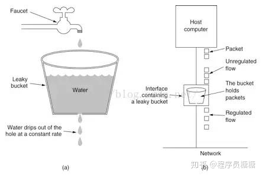

漏桶算法

## 思路
漏桶算法思路很简单，请求先进入到漏桶里，漏桶以固定的速度出水，也就是处理请求，当水加的过快，则会直接溢出，也就是拒绝请求，可以看出漏桶算法能强行限制数据的传输速率。


## 实现
```java
long timeStamp = getNowTime(); 
int capacity = 10000;// 桶的容量
int rate = 1;//水漏出的速度
int water = 100;//当前水量

public static bool control() {   
    //先执行漏水，因为rate是固定的，所以可以认为“时间间隔*rate”即为漏出的水量
    long  now = getNowTime();
    water = Math.max(0, water - (now - timeStamp) * rate);
    timeStamp = now;

    if (water < capacity) { // 水还未满，加水
        water ++; 
        return true; 
    } else { 
        return false;//水满，拒绝加水
   } 
} 
```
## 应用场景
该算法很好的解决了时间边界处理不够平滑的问题，因为在每次请求进桶前都将执行“漏水”的操作，再无边界问题。
但是对于很多场景来说，除了要求能够限制数据的平均传输速率外，还要求允许某种程度的突发传输。这时候漏桶算法可能就不合适了，令牌桶算法更为适合。
# 令牌桶算法
## 思路
令牌桶算法的原理是系统会以一个恒定的速度往桶里放入令牌，而如果请求需要被处理，则需要先从桶里获取一个令牌，当桶里没有令牌可取时，则拒绝服务。

**1）单速率三色标记算法**
网络工程师任务小组（IETF）的RFC文件定义了单速率三色标记算法，评估依据以下3个参数：承诺访问速率(CIR)，即向令牌桶中填充令牌的速率；承诺突发尺寸(CBS)，即令牌桶的容量，每次突发所允许的最大流量尺寸（注：设置的突发尺寸必须大于最大报文长度）；超额突发尺寸(EBS)。

一般采用双桶结构：C桶和E桶。Tc表示C桶中的令牌数，Te表示E桶中令牌数，两桶的总容量分别为CBS和EBS。初始状态时两桶是满的，即Tc和Te初始值分别等于CBS和EBS。令牌的产生速率是CIR，通常是先往C桶中添加令牌，等C桶满了，再往E桶中添加令牌，当两桶都被填满时，新产生的令牌将会被丢弃。

色盲模式下，假设到达的报文长度为B。若报文长度B小于C桶中的令牌数Tc，则报文被标记为绿色，且C桶中的令牌数减少B；若Tc<B <Te，则标记为黄色，E和C桶中的令牌数均减少B；若B >Te，标记为红色，两桶总令牌数都不减少。

在非色盲模式下，若报文已被标记为绿色或B <Tc，则报文被标记为绿色，Tc减少B；若报文已被标记为黄色或Tc<B <Te，则标记为黄色，且Te减少B；若报文已被标记为红色或B >Te，则标记为红色，Tc和Te都不减少。
**2）双速率三色标记算法** 
IETF的RFC文件定义了双速率三色算法，主要是根据4种流量参数来评估：CIR、CBS、峰值信息速率(PIR)，峰值突发尺寸(PBS)。前两种参数与单速率三色算法中的含义相同，PIR这个参数只在交换机上才有，路由器没有这个参数。该值必须不小于CIR的设置值，如果大于CIR，则速率限制在CIR于PRI之间的一个值。

与单速率三色标记算法不同，双速率三色标记算法的两个令牌桶C桶和P桶填充令牌的速率不同，C桶填充速率为CIR，P桶为PIR；两桶的容量分别为CBS和PBS。用Tc和Tp表示两桶中的令牌数目，初始状态时两桶是满的，即Tc和Tp初始值分别等于CBS和PBS。

色盲模式下，如果到达的报文速率大于PIR，超过Tp+Tc部分无法得到令牌，报文被标记为红色，未超过Tp+Tc而从P桶中获取令牌的报文标记为黄色，从C桶中获取令牌的报文被标记为绿色；当报文速率小于PIR，大于CIR时，报文不会得不到令牌，但超过Tp部分报文将从P桶中获取令牌，被标记为黄色报文，从C桶中获取令牌的报文被标记为绿色；当报文速率小于CIR时，报文所需令牌数不会超过Tc，只从C桶中获取令牌，所以只会被标记为绿色报文。

在非色盲模式下，如果报文已被标记为红色或者超过Tp+Tc部分无法得到令牌的报文，被标记为红色；如果标记为黄色或者超过Tc未超过Tp部分报文记为黄色；如果报文被标记为绿或未超过Tc部分报文，被标记为绿色。
## 实现
-   假如用户配置的平均发送速率为r，则每隔1/r秒一个令牌被加入到桶中(每秒会有r个令牌放入桶中)；
-   假设桶中最多可以存放b个令牌。如果令牌到达时令牌桶已经满了，那么这个令牌会被丢弃；
-   当一个n个字节的数据包到达时，就从令牌桶中删除n个令牌(不同大小的数据包，消耗的令牌数量不一样)，并且数据包被发送到网络；
-   如果令牌桶中少于n个令牌，那么不会删除令牌，并且认为这个数据包在流量限制之外(n个字节，需要n个令牌。该数据包将被缓存或丢弃)；
-   算法允许最长b个字节的突发，但从长期运行结果看，数据包的速率被限制成常量r。对于在流量限制外的数据包可以以不同的方式处理：  
    1)它们可以被丢弃；  
    2)它们可以排放在队列中以便当令牌桶中累积了足够多的令牌时再传输；  
    3)它们可以继续发送，但需要做特殊标记，网络过载的时候将这些特殊标记的包丢弃。
	
```java
long timeStamp=getNowTime(); 
int capacity; // 桶的容量
int rate ;//令牌放入速度
int tokens;//当前水量

bool control() {
   //先执行添加令牌的操作
   long  now = getNowTime();
   tokens = max(capacity, tokens+ (now - timeStamp)*rate); 
   timeStamp = now;   //令牌已用完，拒绝访问

   if(tokens<1){
     return false;
   }else{//还有令牌，领取令牌
     tokens--;
     retun true;
   }
 } 
```
## 应用场景
令牌桶算法是网络流量整形和速率限制中最常使用的一种算法。典型情况下，令牌桶算法用来控制发送到网络上的数据的数目，并允许突发数据的发送。

大小固定的令牌桶可自行以恒定的速率源源不断地产生令牌。如果令牌不被消耗，或者被消耗的速度小于产生的速度，令牌就会不断地增多，直到把桶填满。后面再产生的令牌就会从桶中溢出。最后桶中可以保存的最大令牌数永远不会超过桶的大小。

传送到令牌桶的数据包需要消耗令牌。不同大小的数据包，消耗的令牌数量不一样。令牌桶这种控制机制基于令牌桶中是否存在令牌来指示什么时候可以发送流量。令牌桶中的每一个令牌都代表一个字节。如果令牌桶中存在令牌，则允许发送流量；而如果令牌桶中不存在令牌，则不允许发送流量。因此，如果突发门限被合理地配置并且令牌桶中有足够的令牌，那么流量就可以以峰值速率发送。