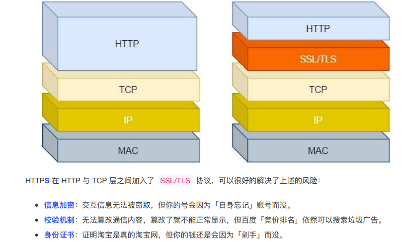

# HTTP
## HTTP基本概念
>HTTP是什么   

HTTP是超文本传输协议，HyperText Transfer Protocol

**HTTP是一个计算机世界里专门在【两点】之间【传输】文字、图片、音频、视频等【超文本】数据的【约定和规范】**

|状态码|具体含义|常见的状态码|
|-----|--------------------------| ------------ |
|1xx|提示信息，表示现在是协议处理的中间状态，还需要后续的操作||
|2xx|成功，报文已经收到并被正确处理|200、204、206|
|3xx|重定向，资源位置发生变动，需要客户端重新发送请求|301、302、304|
|4xx|客户端错误，请求报文有误，服务器无法处理|400、403、404|
|5xx|服务器错误，服务器在处理请求时内部发生了错误|500、501、502、503|

1. `1xx`类状态码属于提示信息，实际用得比较少
2. `2xx`类状态码表示服务器处理了客户端的请求
    * 【200 ok】是最常见的成功状态码，表示一切正常。如果是非`HEAD`请求，服务器返回的响应头都会有body数据。
    * 【204 No Content】也是常见的成功状态码，响应头没有body数据
    * 【206 Partial Content】应用于HTTP分块下载或者断点续传，表示响应返回的body数据并不是资源的全部，而是一部分。
 3. `3xx`类状态码表示客户端请求的资源发生了变动，需要客户端用新的URL重新发送请求获取资源，也就是重定向。
    * 【301 Moved Permanently】表示永久重定向，说明请求的资源已经不存在了，需要改用新的URl
    * 【302 Found】表示临时重定向，表示请求的资源还在，但需要暂时用另一个URL来访问
    * 【304 Not Modified】不具有跳转的含义，表示资源未修改，重定向已存在的缓冲文件，也称缓存重定向，用于缓存控制。
4. `4xx`表示客户端发送的报文有误，也就是错误码的含义
    * 【400 Bad Request】表示客户端请求的报文有错误，但只是个笼统的错误
    * 【403 Forbidden】表示服务器禁止访问资源，并不是客户端的请求出错
    * 【404 Not Found】表示请求的资源在服务器上不存在或未找到，所以无法提供
5. `5xx`服务器内部发生错误
    * 【500 Internal Server Error】与400类型，是个笼统的错误码
    * 【501 Not Implemented】 表示客户端请求的功能还不支持，类似于“即将开业，敬请期待”
    * 【502 Bad Gateway】通常是服务器作为网关或代理时返回的错误码，表示服务器自身工作正常，访问后端服务器发生了错误。
    * 【503 Service Unavailable】表示服务器当前很忙，暂时无法相应服务器，类似于“网络服务正忙，请稍后重试”

HTTP常见字段
1. `Host`字段
   * 客户端发送请求时，用来指定服务器的域名。
   * 可以通过Host字段来区分同一台服务器上的不同网站站点(IP相同，Host不同)。
2. `Content-Length`
   * 服务器在返回数据时，会有此字段，表示本次回应的数据长度。
3. `Connection`
   * 最常用于客户端要求服务器使用TCP持久连接，以便其它请求复用。   
   * HTTP/1.1版本都是默认持久连接，但是为了兼容老版本，一般需要指定connection首部字段为`Keep-Alive`
   * 一个可以复用的TCP连接就建立了，直到客户端或服务器主动关闭连接。但是这个不是标准字段
4. `Content-Type`
   * 用于服务器回应时，告诉客户端本次数据的格式
   * 客户端请求时，可以使用`Accept`字段声明自己可以接受哪些数据格式
   * `Accept:*/*`这个字段表面接受任何形式的数据
5. `Content-Encoding`
   * 本次服务器返回的数据采用了什么样的压缩方法
   * 客户端请求时，可以用`Accept-Encoding`字段说明自己可以接受哪些压缩方法

 ## GET 与POST
 `GET`方法的含义是*从服务器获得资源*，这个资源可以是静态的文本、页面、图片视频等。    

 `POST`是向`URI`指定的资源提交数据，数据就放在报文的body里，拼接好POST请求头，通过TCP协议发送给服务器。   

* 在HTTP协议里，所谓的【安全】是指请求方法不会【破坏】服务器上的资源
* 所谓的【幂等】，意思是多次执行相同的操作，结果都是【相同】的。  

那么很明显`GET`方法是安全且幂等，POST是不安全不幂等的。   

## HTTP特性
>HTTP(1.1)优点

1. 简单，HTTP基本的报文格式就是`header + body`，头部信息也是`key-value`简单文本的形式，易于理解，降低了学习和使用的门槛。
2. 灵活和易于扩展，HTTP协议里各类请求方法，URI/URL、状态码和头字段等每个组成都没有被固定死。
3. 应用广泛和跨平台

>缺点

1. 无状态双刃剑，好处是服务器不需要额外资源去记忆HTTP的状态，坏处是服务器在完成关联性操作(登录-添加购物车-下单)都要知道用户的信息，每次都要重新请求。无状态的解决方案，比较简单的是`Cookie`，通过在请求和响应报文中写入`Cookie`信息来控制客户端状态。  

    

2. 明文传输双刃剑，好处是方便阅读调试，坏处是信息裸奔，没有隐私。  
3. 不安全
   * 通信使用明文，内容可能会被窃听
   * 不验证通信方的身份，因此可能遭遇伪装
   * 无法证明报文的完整性，所以有可能已遭到篡改，比如网页上植入垃圾广告，视觉污染。 

HTTP的安全问题，可以通过引入SSL/TLS层，用HTTPS的方式解决。   

>HTTP性能

HTTP协议基于TCP/IP，并且使用了`请求-应答`的通信模式，所以性能的关键在于这两点。  
1. 长连接   
减少TCP连接的重复建立和断开造成的额外开销，减轻了服务器端的负载
2. 管道网路传输
在同一个TCP连接中，客户端可以发出多个请求，只要第一个请求发出去了，不必等其回来就可以发第二个请求，减少整体的响应时间
3. 队头堵塞  
【请求-应答】的模式加剧了HTTP的性能问题。当顺序发送的请求序列中的一个请求因为某种原因被阻塞时，在后面排队的所有请求也被一同阻塞了，会招致客户端一直请求不到数据。  
## HTTP与HTTPS
>区别

1. HTTP是超文本传输协议，信息是明文传输，存在安全风险。HTTPS则解决HTTP不安全的缺陷，在TCP和HTTP网络层之间加入了`SSL/TLS`安全协议，使得报文能够加密传输
2. HTTP连接建立相对简单，TCP三次握手之后便可进行HTTP的报文传输。而HTTPS在TCP三次握手之后，还需要进行`SSL/TLS`的握手过程，才可进入加密报文传输。
3. HTTP端口号是80，HTTPS的端口号是443
4. HTTPS协议需要向CA(证书权威机构)申请数字证书，来保证服务器的身份是可信的。

>HTTPS如何解决HTTP的风险
 1. **混合加密**的方式实现信息的机密性，解决了窃听的风险
 2. **摘要算法**的方式实现了信息的完整性，为数据生成独一无二的指纹，指纹用于校验数据的完整性，解决了篡改的风险。
 3. 将服务器的公钥放到**数字证书**中，解决了冒充的风险。    

混合加密   
通过混合加密的方式可以保证信息的机密性，HTTPS采用的是`对称加密`和`非对称加密`结合的{混合加密}方式
* 在通信前建立采用非对称加密的方式交换`会话密钥`，后续就不再使用非对称加密。
* 在通信过程中全部使用`对称加密`的`会话密钥`的方式加密明文数据。   

采用【混合加密】的方式的原因是
* 对称加密只使用一个密钥，运算速度快，密钥必须保密，无法做到安全的密钥交换
* 非对称加密使用两个密钥：公钥和私钥，公钥可以任意分发而私钥保密，解决了密钥交换问题但速度慢。

摘要算法
* 客户端在发送明⽂之前会通过摘要算法算出明⽂的「指纹」，发送的时候把「指纹 + 明⽂」⼀同加密成密⽂后，发送给服务器，服务器解密后，⽤相同的摘要算法算出发送过来的明⽂，通过⽐较客户端携带的「指纹」和当前算出的「指纹」做⽐较，若「指纹」相同，说明数据是完整的。

数字证书
* 客户端先向服务器端索要公钥，然后用公钥加密信息，服务器收到密文后，用自己的私钥解锁。
* 将公钥放在数字证书中，只要证书可信，公钥就是可信的。
* 通过数字证书的⽅式保证服务器公钥的身份，解决冒充的⻛险

  

HTTPS如何建立连接：
SSL/TLS协议基本流程：
* 客户端向服务器索要并验证服务器的公钥
* 双方协商产生`会话密钥`
* 双方采用会话密钥进行加密通信

SSL/TSL的【握手阶段】涉及四次通信：
1. ClientHello
   首先，由客户端向服务器发起加密通信请求，也就是`ClientHello`请求。
   * 客户端支持的SSL/TLS协议版本。
   * 客户端生成的随机数(`Client Random`)，后面用于生产【会话密钥】。 
   * 客户端支持的密码套件列表，如RSA加密算法。

2. ServerHello
    服务器收到客户端请求后，向客户端发出响应，也就是`SeverHello`
  * 确认`SSL/TLS`协议版本，如果浏览器不支持，则关闭加密通信
  * 服务器生产随机数(`Server Random`)，后面用于生产【会话密钥】。 
  * 确认的密码套件列表，如RSA加密算法。
  * 服务器的数字证书。

3. 客户端回应
 客户端收到服务器的回应之后，首先通过浏览器或者操作系统中的CA公钥，确认服务器的数字证书的真实性。  如果证书没有问题，客户端会从数字证书中取出服务器的公钥，然后使用它加密报文，向服务器发送信息：
 * 一个随机数(`pre-master key`)。该随机数会被服务器公钥加密。  
 * 加密通信算法改变通知，表示随后的信息都将用【会话密钥】加密通信。
 * 客户端握手结束通知，表示客户端的握手阶段结束。这一项同时把之前你所有内容的发生的数据做个摘要，用来供服务器校验。  
上⾯第⼀项的随机数是整个握⼿阶段的第三个随机数，这样服务器和客户端就同时有三个随机数，接着就⽤双⽅协 商的加密算法，各⾃⽣成本次通信的「会话秘钥」

4. 服务器的最后回应
服务器收到客户端的第三个随机数(`pre-master key`)之后，通过协商的加密算法，计算出本次的【会话密钥】，发出最后的信息：
* 加密通信算法改变通知，表示随后的信息都将用【会话密钥】加密通信 
* 服务器握手结束通知，表示服务器的握手阶段已经结束。这一项同时把之前所有内容发生的数据做摘要，用来供客户端检验。   

⾄此，整个 SSL/TLS 的握⼿阶段全部结束。接下来，客户端与服务器进⼊加密通信，就完全是使⽤普通的 HTTP 协议，只不过⽤「会话秘钥」加密内容。

* HTTP/1.1 中的管道（ pipeline）传输中如果有⼀个请求阻塞了，那么队列后请求也统统被阻塞住了
* HTTP/2 多个请求复⽤⼀个TCP连接，⼀旦发⽣丢包，就会阻塞住所有的 HTTP 请求。

HTTP/3 把 HTTP 下层的 TCP 协议改成了 UDP

HTTP/1.1如何优化？
1. 尽量避免发送HTTP请求；
   * 缓存
2. 减少HTTP请求次数
   * 减少重定向请求次数
   * 合并请求
   * 延迟发送请求
3. 减少HTTP响应的数据大小
   * 无损压缩
   * 有损压缩

