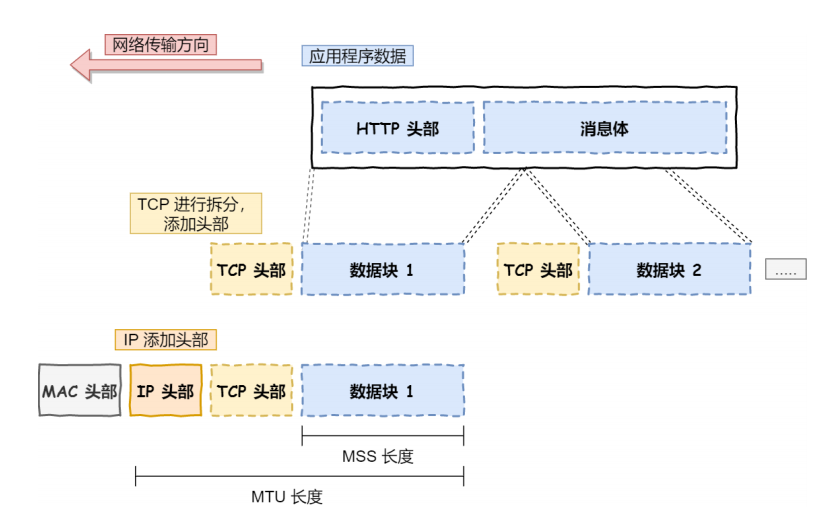

# 计算机网络基础
## TCP/IP网络模型
对于不同设备上进程间的通信，需要网络通信，为了兼容多种多样的设备，就出现了通用的网路协议。

1. 应用层   
应用层处于最上层，只需要专注于为用户提供应用功能，不用关心数据是如何传输的。应用层工作在操作系统的应用态，传输层及以下工作在操作系统内核态。

2. 传输层(*实现应用到应用间的通信，应用间数据传输的媒介*)
传输层为应用层提供网络支持，在传输层有两个协议`TCP`和`UDP`   
  * TCP（Transmission Control Protocol）传输层控制协议，大部分应用的是此协议，例如HTTP应用层协议。
  * TCP比UDP多了很多特性，例如流量控制、超时重传、拥塞控制等。    

  * UDP相对简单，只负责发送数据包，不保证数据包是否能抵达对方，但它实时性相对更好，传输效率也高。UDP也可以实现可靠传输，将TCP特性在应用层上实现。  

  * 应用需要传输的数据量可能会非常大，因此当传输层数据包大小超过MSS（TCP最大报文长度），就要将数据包分块。在TCP协议中，这样的分块称为`TCP段`

  * 当设备作为接收方，传输层要负责把数据包传给应用，但是一台设备上可能会用很多应用等待传输数据，因此需要用编号将应用区分开，这个编号就是`端口`。    
     例如80端口是Web服务器使用，22端口是远程登陆服务器使用。浏览器每个标签栏都是独立的进程，操作系统会为这些进程提供临时端口号。   
  
  * 传输层的报文中会携带端口号，接收方可以识别出该报文是发送给哪个应用的。    

3. 网络层    
    
  * 网络层最常使用的是IP协议(Internet Protocol)，IP协议会将传输层的报文作为数据部分，再加上IP包头组装成IP报文
  * 如果报文大小超过`MTU`（以太网一般为1500字节）就会再次进行分片，得到一个即将发送到网络的IP报文。   
  * 网络层负责将数据从一个设备传输到另一个设备。一般用IP地址给设备编号。
     * 一个是`网络号`，负责标识该IP地址是属于哪个子网的
     * 另一个是`主机号`，负责标识同一子网下的不同主机
     * IP地址需要根据子网掩码才能算出来，在寻址过程中，先匹配网络号，再匹配主机号
     * 除了`寻址`，IP还有一个重要功能是`路由`，实际设备间有许多网络路径，需要通过算法决定数据包走哪条路径。

4. 数据链路层   
数据不仅可以在同一网络中传输，还可以跨网络进行传输。数据链路层主要为网络层提供链路级别传输的服务。      
   * 一旦数据需要跨网络传输，就需要有一个设备同时在两个网络当中，一般是路由器，路由器可以通过路由表来计算出下一个要去的Ip地址 
   *  每个设备的网卡都会有一个MAC地址，用来唯一标识设备。路由器计算出下一个目的地的IP地址，再通过ARP协议找到该目的地的MAC地址，就知道IP地址是哪个设备的了。  

 6. 物理层
当数据准备要从设备发送到网络时，需要把数据包转换成电信号，让其可以在物理介质中传输，这一层就是物理层。
它主要为数据链路层提供二进制传输的服务。    

