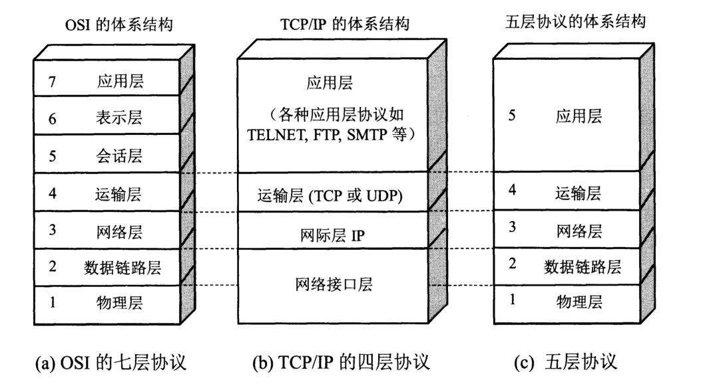
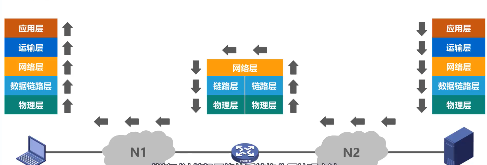

## 计算机网络概述
### 计算机网络的性能指标
1. 速率
    * 连接在计算机网络上的主机在数字信道上传送比特的速率，也称为**比特率**或数据率
    * 基本单位：bit/s(b/s,bps)，常用单位：kb/s.Mb/s,Gb/s,Tb/s
2. 带宽
    * 用来表示网络的**通信线路**所能传送数据的能力，因此网络带宽表示在单位时间内从网络中的某一点到另一点所能通过的**最高数据率**；单位与速率单位相同。
3. 吞吐量
    * 吞吐量表示在**单位时间内通过某个网络（或信道、接口）的数据量**
    * 吞吐量被经常用于对现实世界中的网络的一种测量，以便知道实际上有多少数据量能够通过网络，吞吐量受网络的带宽或额定速率的限制。
4. 时延
    * **发送时延**=$\frac{分组长度(b)}{发送速率(b/s)}$
    * **传播时延**=$\frac{信道长度(m)}{电磁波传播速率(m/s)}$
    * **处理时延** 一般不便于计算
5. 时延带宽积
    * 传播时延和带宽的乘积
    * 若发送端连续发送数据，则在所发送的第一个比特即将到达终点时，发送端就已经发送了时延带宽积个比特
    * 链路的时延带宽积又称为**以比特为单位的链路长度**
6. 往返时间RTT
    * 在许多情况下，因特网上的信息不仅仅单方向传输，而是**双向交互**
    * 我们有时很需要知道双向交互一次所需的时间
7. 利用率
    * **信道利用率**：用来表示某信道有百分之几的时间是被利用的(有数据通过)；
    * **网络利用率**：全网络的信道利用率的加权平均
    * 利用率**并非越高越好**：当某信道的利用率增大时，该信道引起的时延也会迅速增加
    * 信道利用率**也不可以太低**，导致宝贵的通信资源被浪费
8. 丢包率
   * 丢包率即分组丢失率，是指在一定时间范围内，传输过程中**丢失的分组数量与分组数量的比率**
   * 分组丢失两个主要原因：**分组误码**，结点交换机缓存队列满了(**网络拥塞**)

### 计算机网络体系结构
**各层作用及概述**

* 应用层：解决通过应用程序之间的交互来实现特定网络应用的问题
* 表示层：解决通信双方交换信息的表示问题
* 会话层：解决进程之间进行会话的问题
* 运输层：解决进程之间基于网路的通信问题
* 网络层：解决分组在多个网络之间传输（路由）的问题
* 数据链路层：解决分组在一个网络（或一段链路）上传输的问题
* 物理层：解决使用何种信号来传输比特0和1的问题

**分层结构体系思想举例**
1. **发送方发送**

第一步：
   -  **应用层**按照HTTP协议的规定构建一个**HTTP请求报文**
   -  应用层将**HTTP请求报文**交付给传输层处理

第二步：
-   **运输层**给**HTTP请求报文**添加一个**TCP首部**，使之成为**TCP报文段**
-   **TCP报文段的首部格式**作用是区分应用进程以及实现可靠传输
-   **运输层**将**TCP报文段**交付给**网络层**处理

第三步：
-   **网络层**给**TCP报文段**添加一个**IP首部**，使之成为**IP数据报**
-   **IP数据报的首部格式**作用是使**IP数据报**可以在互联网传输，也就是被路由器转发
-   **网络层**将**IP数据报**交付给**数据链路层**处理

第四步：
-   **数据链路层**给**IP数据报**添加一个**首部**和一个**尾部**，使之成为**帧** （图示右边为首部，左边为尾部）
-   该**首部**的作用主要是为了让**帧**能够在一段链路上或一个网络上传输，能够被相应的目的主机接收
-   该**尾部**的作用是让目的主机检查所接收到的**帧**是否有误码
-   **数据链路层**将**帧**交付给**物理层**

第五步：
-   **物理层**先将**帧**看做是**比特流**，这里的网络N1假设是以太网，所以**物理层**还会给该**比特流**前面添加**前导码**
-   **前导码**的作用是为了让目的主机做好接收帧的准备
-   **物理层**将装有**前导码**的**比特流**变换成相应的**信号**发送给传输媒体
    

第六步：
-   **信号**通过**传输媒体**到达**路由器**

2. **路由器转发** 

第一步：
-   **物理层**将**信号**变为**比特流**，然后去掉**前导码**后，将其交付给**数据链路层**
-   **数据链路层**将**帧**的**首部**和**尾部**去掉后，将其交付给**网络层**，这实际交付的是**IP数据报**
-   **网络层**解析**IP数据报**的**首部**，从中提取**目的网络地址**

第二步：
-   提取**目的网络地址**后查找**自身路由表**。确定**转发端口**， 以便进行转发
-   **网络层**将**IP数据报**交付给**数据链路层**
-   **数据链路层**给**IP数据报**添加一个**首部**和一个**尾部**，使之成为**帧**
-   **数据链路层**将帧交付给**物理层**
-   **物理层**先将**帧**看成**比特流**，这里的网络N2假设是以太网，所以**物理层**还会给该**比特流**前面添加**前导码**
-   物理层将装有**前导码**的**比特流**变换成相应的**信号**发送给传输媒体，信号通过传输媒体到达**Web服务器**

3. **接收方接收**

和发送方（主机）发送过程的封装正好是反着来
在Web 服务器上

-   **物理层**将**信号**变换为**比特流**，然后去掉**前导码**后成为**帧**，交付给**数据链路层**
-   **数据链路层**将**帧**的**首部**和**尾部**去掉后成为**IP数据报**，将其交付给**网络层**
-   **网络层**将**IP数据报**的**首部**去掉后成为**TCP报文段**，将其交付给**运输层**
-   **运输层**将**TCP报文段**的**首部**去掉后成为**HTTP请求报文**，将其交付给**应用层**
-   **应用层**对**HTTP请求报文**进行**解析**，然后给主机发回**响应报文**

**发回响应报文的步骤和之前过程类似**

**协议与服务**
**协议**
1. 协议：控制两个对等实体进行逻辑通信的规则的集合
2. 协议的三要素：语法、语义、同步
     * 语法：定义所交换信息的格式
     * 语义：定义收发双方所要完成的操作
     * 同步：定义收发双方的时序关系
3. 在协议的控制下，两个对等实体间的逻辑通信使得本层能够向上一层提供服务
4. 要实现本层协议，还需要使用下面一层所提供的服务
5. 协议是**水平的**，服务是**垂直的**。
6. 实体看得见相邻下层所提供的服务，但并不知道实现该服务的具体协议。也就是说，下面的协议对上面的实体是 **"透明"** 的。

**服务**
1.   **服务访问点**：在同一系统中相邻两层的实体交换信息的逻辑接口，用于区分不同的服务类型。
        -   数据链路层的服务访问点为帧的“类型”字段。
        -   网络层的服务访问点为IP数据报首部中的“协议字段”。
        -   运输层的服务访问点为“端口号”。
2.  **服务原语**：上层使用下层所提供的服务必须通过与下层交换一些命令，这些命令称为服务原语。
3.   **协议数据单元PDU**：对等层次之间传送的数据包称为该层的协议数据单元。
4.   **服务数据单元SDU**：同一系统内，层与层之间交换的数据包称为服务数据单元。
5.    多个SDU可以合成为一个PDU，一个SDU也可划分为几个PDU。

## 物理层
### 物理层的基本概念
-   物理层考虑的是怎样才能在连接各种计算机的传输媒体上传输数据比特流。
-   物理层为数据链路层屏蔽了各种传输媒体的差异，使数据链路层只需要考虑如何完成本层的协议和服务，而不必考虑网络具体的传输媒体是什么。
-   物理层协议的主要任务：**机械特性、电气特性、功能特性、过程特性**
-   传输媒体不属于任何一层，如果一定要分类，则属于物理层

### 物理层下面的传输媒体
-   传输媒体
    -   导引型传输媒体
        -   同轴电缆
        -   双绞线
        -   光纤
    -   非导引型传输媒体
        -   无线电波
        -   微波
        -   红外线
        -   可见光

### 传输方式
1. 串行传输
   * 串行传输是指数据是一个比特一个比特依次发送的，只需要一条传输链路。
2. 并行传输
   * 并行传输是指一次发送n个比特而不是一个比特，为此。在发送端和接收端之间需要有n条传输线路。
***
1.  同步传输  
    收发双方时钟同步的方法
    -   外同步: 在收发双方之间添加一条单独的时钟信号线
    -   内同步: 发送端将时钟同步信号编码到发送数据中一起传输（例如曼彻斯特编码)
2.  异步传输
    -   **字节之间异步**（字节之间的时间间隔不固定)
    -   字节中的每个比特仍然要同步(各比特的持续时间是相同的)
***
1.  单工：一方向另一方传递信息 （无线广播）
2.  半双工：双方互相传递信息，但是不能同时传递 （对讲机）
3.  全双工：双方可同时互相传递信息 （电话）

### 编码与调制

码元：在使用时间域的波形表示数字信号时,代表不同 **离散数值的基本波形**。

## 数据链路层
### 数据链路层概述
* 链路：就是从一个结点到相邻节点的一段物理线路，而中间没有任何其他的交换结点
* 数据链路：是指把实现通信协议的硬件和软件加到链路上，就构成了数据链路
* 数据链路层以帧为单位传输和处理数据

### 封装成帧
**封装成帧**：数据链路层给网络层交付的协议数据单元添加 **帧头和帧尾** 的操作。称为封装成帧。  
**目的**：为了在链路上 **以帧为单元** 来传送数据，也就是 **为了实现数据链路层本身的功能。**

-   帧头和帧尾中包含有重要的控制信息。
-   帧头和帧尾的作用之一就是帧定界。

1. PPP帧的帧头和帧尾各有一个标志字节，作用是帧定界。

2. 并不是每一种数据链路层协议的帧都包含帧定界标志。例如，以太网MAC帧。而且以太网V2的MAC帧还有帧间间隔，规定为 96 比特时间

### 差错检测
接收方主机收到帧后，通过检错码和检错算法，就可以判断出帧在传输过程中是否出现了误码。
-   **比特差错**：实际的通信链路都不是理想的，比特在传输过程中可能会产生差错: 1可能会变成0,而0也可能变成1。这称为比特差错。
-   **误码率BER**：在一段时间内，传输错误的比特占所传输比特总数的比率称为误码率BER(Bit Error Rate)
-   **差错检测码FCS**：使用差错检测码来检测数据在传输过程中是否产生了比特差错，是数据链路层所要解决的重要问题之一。

奇偶校验（一般不会采用）：
-  **奇/偶校验**：在待发送的数据后面 **添加1位奇偶校验位**，使整个数据（包括所添加的校验位在内)中 **“1”的个数** 为奇数(奇校验)或偶数（偶校验)。
-  如果有 **奇数个位发生误码**，则奇偶性发生变化，**可以检查出误码**
-  如果有 **偶数个位发生误码**，则奇偶性不发生变化，**不能检查出误码（漏检)**

循环冗余校验CRC
- 收发双方约定好生成一个多项式G(x)
- 发送方基于待发送的数据和生成多项式计算出差错检测码(冗余码)，将其添加到待传输数据的后面一起传输
- 接收方通过多项式来计算收到的数据是否产生了误码

### 可靠传输
接受方主机收到有误码的帧后，不会接受，将其丢弃。  
   * 如果数据链路层向其上层提供的是不可靠服务，丢弃就丢弃了，不会有更多措施。  
   * 如果数据链路层向其上层提供的是 **可靠服务**，就还需要其他措施，确保接收方主机回以重新收到被丢弃的这个帧的副本。

-   一般情况下，**有线链路** 的误码率比较低，为了减小开销，并 **不要求数据链路层向上提供可靠传输服务**。即使出现了误码，可靠传输的问题由其上层处理。
-   **无线链路** 易受干扰，误码率比较高，因此 **要求数据链路层** 必须向上层提供 **可靠传输服务**。

-   **比特差错** 只是传输差错中的一种。
-   从整个计算机网络体系结构来看，传输差错还包括**分组丢失、分组失序** 以及 **分组重复**。
-   分组丢失、分组失序以及分组重复这些传输差错，一般不会出现在数据链路层，而会出现在其上层。
-   **可靠传输服务并不仅局限于数据链路层**，其他各层均可选择实现可靠传输。

####  停止等待协议(SW)

* **确认与否认** 发送方发送数据分组给接收方，接收方确认ACK无误后继续发送下一个数据分组，如果收到错误信息NAK，则重传上一个数据分组

* **超时重传**当数据分组丢失时，发送方可能会一直等待反馈，为了解决该问题可以设置一个超时计时器，一般可将重传时间选为略大于”从发送方到接收方的平均往返时间“，这种机制就是**超时重传**。

* **确认丢失** 当ACK分组丢失，为了让接收方能够判断所收到的数据分组是否是重复的，需要给数据分组编号。

* **确认迟到** 当确认分组超过了超时时间，为了让发送方能够判断所收到的ACK分组是否是重复的，需要给ACK分组编号，所用比特数量与数据分组编号所用比特数量一样。一般数据链路层不会出现这种情况，因此可以不用给ACK分组编号。

